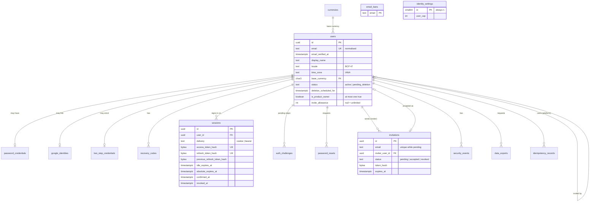
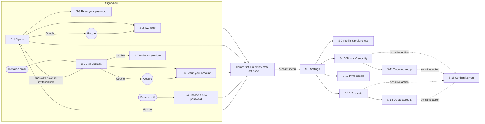
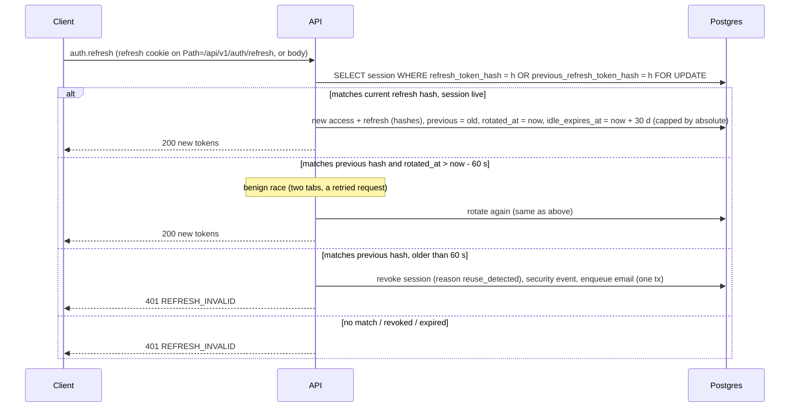
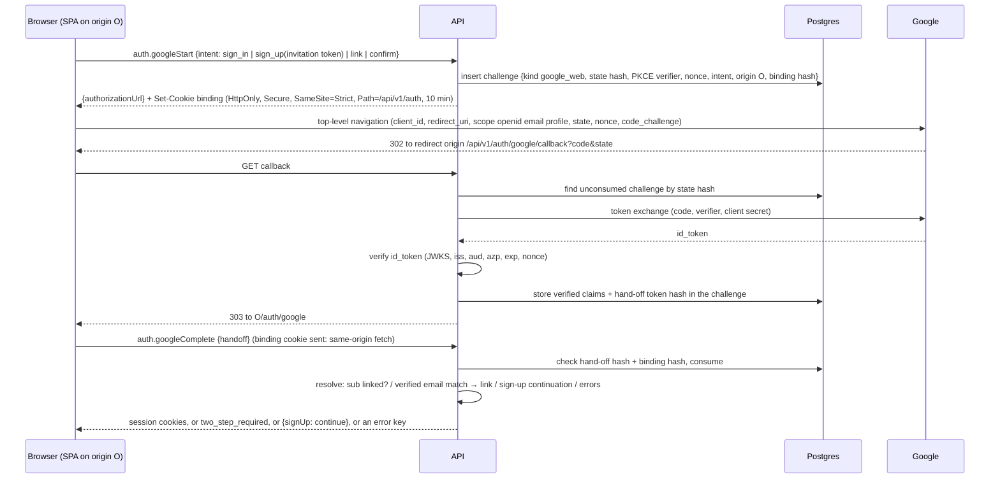
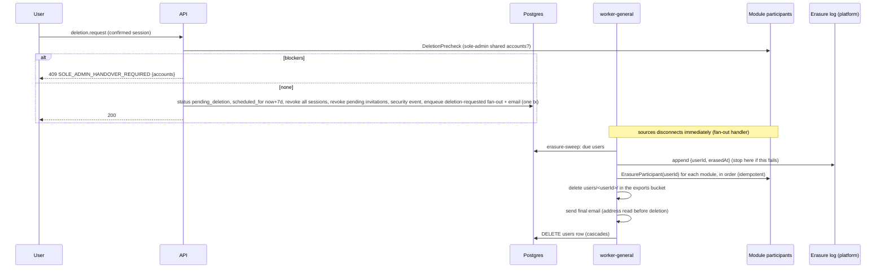

# Identity: High-Level Design

Who a Budmon user is, how they get in (invitation, password, Google, two-step verification), how they stay in (sessions), their preferences, and their control over their own data (export, deletion). It also gives every other module the authenticated principal, user lookups, and the extension points that deletion and export need.

Sources: [spec summary](../../product/spec-summary.md) v0.10 §4.1 (`IDN`), §3 (XC-n), §4.13 (`ADM`, identity's dependants), §5 to §8; the user's answers in [round 4](../../product/notes/2026-10-04-round-4-answers.md) (R4), [round 5](../../product/notes/2026-10-04-round-5-answers.md) (R5), [round 6](../../product/notes/2026-10-05-round-6-answers.md) (R6), [platform decisions](../../product/notes/2026-10-05-platform-decisions.md) (PD); the [codebase review](../../product/codebase-review.md) (CR); the approved [platform HLD](../platform/hld.md) v1.2 (cited as **P-D-n**, **P-§n**) and [platform LLD](../platform/lld.md) v0.9 (cited as **P-F-n**).

## Changelog

| Version | Date | Change |
| ------- | ---------- | ------ |
| 0.1     | 2026-10-07 | Initial draft |

## 1. Context and requirements

### 1.1 Requirements

| Requirement | What identity must do |
| ----------- | --------------------- |
| IDN-US-1, IDN-BR-3 | Create a user only from a valid, unused, unexpired invitation, with email + password or Google; collect base currency, time zone (and language); hand off to the first-run empty state. Nothing may hard-wire invite-only (IDN-US-10 later). |
| IDN-US-2, XC-18 | Long-lived sessions on web and Android (about a month without signing in again); list and sign out sessions. |
| IDN-US-3 | Edit name, base currency, time zone, language; a time-zone change never moves stored dates. |
| IDN-US-4 | Password reset by emailed link; the link expires; other sessions are signed out. |
| IDN-US-5, IDN-BR-2 | Find another user by exact email only; no partial search, no directory. |
| IDN-US-6, XC-17 | Export everything the user owns as CSV and JSON, at any time. |
| IDN-US-7, XC-16 | Delete the user: confirmation, 7-day undo, sources disconnected immediately, sole-admin shared accounts handed over first, then full erasure; entries on shared accounts stay as "deleted user". |
| IDN-US-8, XC-18, A26 | Optional two-step verification with an authenticator app (TOTP); recovery codes on enrolment. |
| IDN-US-9 | Any user invites by email within their allowance; 7-day expiry; revocable; shared-account invitations (ACC-US-4) also invite to Budmon; the user cap (ADM-US-3) and email bans (ADM-BR-4) are enforced. |
| IDN-BR-1, A32, R5-Q5 | One user per email; Google sign-in with a password account's email links automatically **only when Google reports the email verified**; the sign-in Google account is independent of connected Gmail inboxes. |
| XC-27 | Email only for account matters: invitations, password reset, deletion notices (and the security notices this HLD adds, D-19). |
| `admin` (ADM-US-1 to 5, ADM-BR-1, 2, 4) | Identity holds the data admin manages and enforces: user status and last activity, the product-owner flag, invite allowances, the user cap, email bans; it offers service operations for admin's portal (D-21). |
| Platform obligations | `identity` provides the `AuthHook` and principal (P-F-54), the users table that `idempotency_records` references (P-§3.1), the `ErasureHandler` (P-F-146), the locale column (P-D-37), sign-in rate limits (P-D-22), the credential-table rule (P-D-19), the privacy notice content (P-D-29 gate item 15), and replaces the web `HomePlaceholder` (P-F-216). |
| CR §2.1, spec §7 | Replace the old auth flows (I-1 to I-14) while keeping the patterns; date of birth isn't collected. |

### 1.2 Goals

- Signing in is quick on both apps (one screen; one or two taps with Google or a password manager) and happens rarely (sessions last about a month).
- Credentials are safe by construction: nothing that grants access is stored in a usable form; every credential table is out of `budmon_capture`'s reach; no token ever appears in a URL path or query, a log, a job payload or a telemetry event.
- Every sign-in path and every recovery path respects two-step verification when it's on.
- Deletion is real (erasure across every module, replayable after a restore) and reversible for 7 days.
- Other modules get one small, stable surface: the principal, a users reader, and registration points for deletion, export and account-share invitations.

### 1.3 Non-goals

- Open sign-up (IDN-US-10, Later). The design keeps it possible: the invitation check is one step in sign-up, and `email_verified_at` exists for a future verification flow.
- Changing the email address of a user (not in the spec's profile list; future work, §12).
- Passkeys / WebAuthn, SMS or email one-time codes as a second factor, "remember this device" for two-step verification.
- Sign-in providers other than Google.
- The admin portal's screens, owner-only procedures, audit log and feature switches (`admin`); the shared-account handover rules themselves (`accounts`, ADM-US-8).
- Notification preferences (`notifications`) and source management (`sources`).
- A user-visible security activity log (the events are recorded, D-19; showing them is future work).
- Storing IP addresses or locations of sessions.

## 2. Actors and stories

Actors: **invited person** (has an invitation, no user yet), **user**, **product owner** (a user with the owner flag, ADM-BR-1), **other modules** (system actors calling identity's services), **worker-general** (emails, exports, erasure).

| ID | Spec | Story |
| -- | ---- | ----- |
| US-1 | IDN-US-1, IDN-BR-3 | As an invited person, I want to create my Budmon user from my invitation with a password, choosing my base currency, time zone and language, so I can start. |
| US-2 | IDN-US-2, XC-18 | As a user, I want to sign in with email and password and stay signed in on web and Android for about a month, and to see and sign out my sessions, so I don't log in every time and stay in control. |
| US-3 | IDN-US-1, IDN-US-2, IDN-BR-1, R5-Q5 | As an invited person or user, I want to sign up and sign in with Google, with my existing password account linked automatically when Google confirms the email, so I can use the account I already have. |
| US-4 | IDN-US-8, A26 | As a user, I want to turn on two-step verification with an authenticator app and get recovery codes, so my data is safer. |
| US-5 | IDN-US-4 | As a user with a password, I want to reset a forgotten password by email, so I can get back in. |
| US-6 | IDN-US-3 | As a user, I want to edit my name, base currency, time zone and language, so totals and dates make sense to me. |
| US-7 | IDN-US-9, ADM-US-3, ADM-US-5, ADM-BR-4 | As a user, I want to invite someone by email within my allowance, see my invitations and revoke them, so they can join the group. |
| US-8 | IDN-US-5, IDN-BR-2 | As a user (through `accounts`' sharing screen), I want to find another user by their exact email, so I can share an account or lend to them. |
| US-9 | IDN-US-6, XC-17 | As a user, I want to export all my data as CSV and JSON, so I own my data. |
| US-10 | IDN-US-7, XC-16 | As a user, I want to delete my Budmon user with a 7-day undo, so I can leave completely. |
| US-11 | ADM-BR-1, P-D-29 (stage 0) | As the product owner, I want to create the first (owner) user from the command line on a fresh installation, so Budmon can be used before any invitation exists. |

Business rules carried through: IDN-BR-1 (D-7), IDN-BR-2 (D-20), IDN-BR-3 (D-10), ADM-BR-2 (D-10), ADM-BR-4 (D-7, D-10), PLT-BR-1 (§7.5), P-D-19's credential-table rule (§3.1, D-22).

## 3. Data model

### 3.1 Tables

All tables follow the platform conventions (P-§3.1): snake_case, UUIDv7 keys, `timestamptz` instants, `created_at`/`updated_at`, explicit `onDelete`. **Credential tables** (marked ★) hold anything that grants access or proves identity; they're never granted to `budmon_capture` (P-D-19) and never appear in exports.

| Table | New / changed | Purpose | Key columns | Relationships |
| ----- | ------------- | ------- | ----------- | ------------- |
| `users` | New (replaces the removed `users`) | The Budmon user: profile, preferences, lifecycle, and what `admin` manages. Readable by `budmon_capture` (time zone, locale, status). | `id`; `email` (normalised: trimmed, lower-cased; unique); `email_verified_at`; `display_name`; `locale` (BCP 47, P-D-37); `time_zone` (IANA); `base_currency` (ISO 4217); `status` (`active`, `pending_deletion`); `deletion_requested_at`, `deletion_scheduled_for`, `deletion_requested_by` (`self`, `owner`); `is_product_owner` (at most one `true`, partial unique index); `invite_allowance` (integer ≥ 0, `null` = unlimited; default 3, R6-Q5); `invited_by_user_id`; `last_active_at` (hour precision). | `base_currency` → `currencies.code` (`restrict`); `invited_by_user_id` → `users.id` (`set null`). Referenced by every module's user-owned rows. |
| `password_credentials` ★ | New | The password hash, separate from `users` so the capture role never sees it. | `user_id` (PK); `password_hash` (Argon2id PHC string, D-5); `updated_at`. | `user_id` → `users` (`cascade`). |
| `google_identities` ★ | New | The linked Google account for sign-in (not Gmail capture, R5-Q5). | `id`; `user_id` (unique: one per user); `google_sub` (unique); `email_at_link`; `linked_at`; `last_used_at`. | `user_id` → `users` (`cascade`). |
| `two_step_credentials` ★ | New | TOTP enrolment (D-8). | `user_id` (PK); `secret_envelope` (`bytea`, sealed with the `api-secrets` key, P-F-114, AAD = table + user + purpose); `state` (`pending`, `enabled`); `pending_expires_at`; `last_used_step` (replay guard); `enabled_at`. | `user_id` → `users` (`cascade`). |
| `recovery_codes` ★ | New | One-time recovery codes (D-8). | `id`; `user_id`; `code_hmac` (HMAC-SHA-256); `used_at`; `created_at`. | `user_id` → `users` (`cascade`). |
| `sessions` ★ | New | One signed-in device; also the refresh-token family (D-1 to D-4). | `id`; `user_id`; `delivery` (`cookie`, `bearer`); `client_kind`; `device_label`; `auth_method` (`password`, `google`, `reset`, `sign_up`); `access_token_hash` (unique), `access_expires_at`; `refresh_token_hash` (unique), `previous_refresh_token_hash`, `refresh_rotated_at`; `idle_expires_at`, `absolute_expires_at`; `confirmed_at` (last step-up, D-9); `last_used_at`; `revoked_at`, `revoke_reason`. | `user_id` → `users` (`cascade`). |
| `auth_challenges` ★ | New | Short-lived, single-use state between steps: pending two-step sign-ins, Google web flow state and hand-off, Android Google nonces, Google step-up (D-6, D-8, D-9). | `id`; `kind`; `token_hash` (unique); `binding_hash` (web binding cookie); `user_id` (nullable); `data` (`jsonb`: intent, origin, invitation ID, PKCE verifier, nonce, delivery, verified Google claims after the callback); `attempts`; `expires_at` (2 to 30 minutes by kind); `consumed_at`. | `user_id` → `users` (`cascade`). |
| `invitations` ★ (token) | New | Invitations to Budmon (D-10). | `id`; `email` (normalised); `inviter_user_id` (nullable: owner bootstrap); `origin` (`direct`, `account_share`, `bootstrap`); `status` (`pending`, `accepted`, `revoked`); `token_hash` (nullable until the worker issues the token); `token_issued_at`; `expires_at`; `send_count`; `accepted_user_id`, `accepted_at`; `revoked_at`, `revoked_by_user_id`. Partial unique index on `email` where `status = 'pending'`. "Expired" is derived (`pending` and `expires_at ≤ now`). | `inviter_user_id`, `accepted_user_id`, `revoked_by_user_id` → `users` (`set null`). |
| `password_resets` ★ | New | Reset (and "set a password") requests (D-13). | `id`; `user_id`; `token_hash` (nullable until issued); `expires_at`; `used_at`; `created_at`. | `user_id` → `users` (`cascade`). |
| `email_bans` | New | Banned addresses (ADM-BR-4); written through `admin`, enforced here. | `email` (normalised, PK); `banned_at`; `banned_by_user_id`. | `banned_by_user_id` → `users` (`set null`). |
| `identity_settings` | New | Instance-wide settings identity enforces; one row. | `id` (fixed `1`, check constraint); `user_cap` (default 90, A-2). | None. |
| `security_events` | New | Security audit trail per user (D-19). | `id`; `user_id`; `kind` (enum); `session_id` (nullable, no FK); `client_kind`; `created_at`. No IPs, no user agents, no free text. | `user_id` → `users` (`cascade`). |
| `data_exports` | New | Export requests and their files (D-16). | `id`; `user_id`; `status` (`queued`, `running`, `ready`, `failed`, `expired`); `object_key`; `byte_size`; `requested_at`, `completed_at`, `expires_at`; `failure_key`. | `user_id` → `users` (`cascade`). The object lives in the platform's `exports` bucket. |
| `idempotency_records` | Changed (platform table) | Adds the foreign key the platform deferred to identity (platform LLD §3.1). | `user_id`. | `user_id` → `users` (`cascade`). |

Notes:

- **Why credentials aren't columns on `users`:** `budmon_capture` must read `users` (time zones, locales, status) and must never read credentials (P-D-19). Separate tables make the grant list simple and testable.
- **Tokens are stored only as hashes.** Session, refresh, invitation, reset, challenge and hand-off tokens are 256-bit random values stored as SHA-256 (D-4); recovery codes as HMAC-SHA-256 (D-8); passwords as Argon2id (D-5); the TOTP secret sealed (D-8).
- **No IP addresses** are stored anywhere in identity (rate limiting uses the platform's HMAC'd counters).

### 3.2 Entity-relationship diagram



### 3.3 Data lifecycle

| Data | Lifecycle |
| ---- | --------- |
| `users` | Hard-deleted at erasure (D-15), cascading to every identity table and to every module table that references users with `cascade`. Modules that keep shared-account entries "attributed to deleted user" use `set null` on author columns and show "Deleted user" (their LLDs, XC-16). |
| `sessions` | Revoked rows and expired rows are kept 30 days (so a replayed refresh token is recognised and refused without ambiguity) and then deleted by a daily purge job. At most 20 live sessions per user; creating a 21st revokes the least recently used. |
| `auth_challenges` | Deleted 1 hour after expiry or consumption by an hourly purge job. Verified Google claims in `data` (sub, email, name) exist for at most 30 minutes. |
| `password_resets` | Deleted 24 hours after expiry or use. |
| `invitations` | Accepted invitations are deleted when the accepted user is erased (they contain that user's email). Revoked and expired invitations are deleted 90 days after they ended (personal data of a non-user; long enough for `admin`'s list, ADM-US-2). Pending invitations of a user whose deletion is requested are revoked at once. |
| `email_bans` | Kept until the owner lifts the ban (the purpose requires keeping the address; stated in the privacy notice). |
| `recovery_codes` | Replaced as a set on regeneration; all deleted when two-step verification is turned off. |
| `two_step_credentials` | `pending` rows expire after 15 minutes; deleted when turned off. |
| `security_events` | Deleted 90 days after creation, and with the user. |
| `data_exports` | Row marked `expired` after 7 days (the platform purge job deletes the object at the same age, P-§3.3) and deleted 30 days later; objects and rows deleted at erasure. |
| Erasure | Always preceded by an erasure-log record (P-D-30) so it can be replayed after a restore. |

## 4. User experience

### 4.0 UX conventions this module establishes

`docs/design/ux-guidelines.md` doesn't exist yet; the platform delegated proposing it to identity (P-§4). Identity's screens follow these conventions, and they're proposed as the content of that file once this HLD is approved (A-9):

- Tone: calm, plain, never blaming (P8, accepted). Second person ("your password"), sentence case, verbs on buttons ("Send invitation", not "OK").
- One primary action per screen (filled button); secondary actions are outlined or text buttons; destructive primaries use the error colour **and** a destructive verb ("Delete my account").
- Forms: labels above fields, never placeholders as labels; errors under the field with an icon (P-C-3); validation on submit and on leaving a field once the rule is known; focus goes to the first invalid field.
- Password managers and autofill are first-class: correct `autocomplete` values on web, autofill hints on Android.
- Confirmations only for destructive or hard-to-reverse actions; everything reversible is just done, with a toast.
- Signed-out screens are a centred single column (max 420 px) on web and full-screen on Android.

### 4.1 User journeys

**J-1 First-time sign-up from an invitation, with a password (US-1).**
1. The invited person gets an email: subject "{Inviter} invited you to Budmon", body with who invited them, a one-line description of Budmon, the button **Accept invitation**, and "This invitation expires on {date}". (Account-share invitations add a line from `accounts`, e.g. "…to share the account House money".)
2. The link opens `https://<origin>/invite#t=<token>` (the token is in the fragment, D-11). The web app removes the fragment from the address bar and shows **Join Budmon**: "{Inviter} invited {email} to Budmon." with **Continue with Google** and **Use a password**.
3. **Use a password** → **Set up your account**: email (shown, not editable), Your name, Password (with a show/hide toggle and the rule "At least 12 characters"), Base currency (preselected from the browser locale's region, e.g. EGP for `en-EG`, else USD; searchable list "EGP — Egyptian pound"), Time zone (preselected from the device, searchable), Language (English; more later). A note: "Base currency is used for totals across accounts. You can change these later in Settings." A link to the privacy notice. Primary **Create account**.
4. On success the user is signed in and lands on the home screen's first-run empty state (owned by `accounts`): "Welcome to Budmon, {name}. Add your first account to start." with **Add account**.
- *Goes wrong:*
  - Link expired, revoked or already used: **This invitation can't be used** with the reason ("It expired on 3 Oct." / "It was cancelled." / "It has already been used. If that was you, sign in.") and "Ask {inviter} to send a new one." plus **Sign in**.
  - Token missing or malformed: "This link isn't complete. Open it again from the email, or copy the whole link."
  - Budmon is full (the owner lowered the cap below the current count): "Budmon can't take new people right now. {Inviter} and the administrator have been told." (both are emailed, ADM-US-3).
  - The address was banned after the invitation was sent: "This invitation can't be used." (no reason given).
  - Already signed in as someone else in this browser: "You're signed in as {email}. Sign out to accept this invitation." with **Sign out and continue**.
  - Weak or common password: inline "Use at least 12 characters." / "This password is too common. Try a longer phrase."
  - Server error after submit: the platform's J-1 wording. Retrying is safe: if the account was in fact created, the retry shows "Your account is ready. Sign in to continue." (D-10).

**J-2 Sign-up with Google (US-3).** Steps 1 and 2 as J-1, then **Continue with Google**: web goes to Google's account chooser and back (D-6); Android shows the Credential Manager sheet. Back in Budmon, **Set up your account** has the name prefilled from Google, no password field, and the line "You'll sign in with Google as {google email}." (shown only when it differs from the invited email). **Create account** → home first-run state.
- *Goes wrong:* the user cancels at Google: back on **Join Budmon** with "Google sign-in was cancelled." That Google account already belongs to another Budmon user: "This Google account is already used by another Budmon account. Use a different Google account or a password." Google is unreachable: "Couldn't reach Google. Try again, or use a password." The Google address is banned: "This Google account can't be used with Budmon."

**J-3 Sign in with email and password (US-2).**
1. Signed-out users opening Budmon land on **Sign in**: Budmon wordmark, "Sign in to Budmon", **Continue with Google**, a divider "or", Email, Password, **Sign in**, links "Forgot password?" and, below, "Budmon is invite-only. Got an invitation? Open the link in the email." On Android the same screen also offers **I have an invitation link** (paste, D-23).
2. Correct credentials and no two-step verification → home (or the screen they were trying to open on web). On Android the app offers to save the password to the user's password manager (Credential Manager).
3. With two-step verification → J-5.
- *Goes wrong:* wrong email or password: "Email or password is incorrect." (never which one; D-18); too many attempts: the platform's J-3 ("Too many attempts. Try again in {n} minutes."); account closed by the owner: "This Budmon account has been closed."; the user has no password (Google-only): the same "Email or password is incorrect." plus, under the form, the standing hint "Signed up with Google? Use Continue with Google."; offline (Android): "You're offline. Connect to sign in." (offline entry needs a previously signed-in user, D-23).

**J-4 Sign in with Google (US-3).** **Continue with Google** → Google → home.
- If the Google account is linked: signed in.
- If not linked but its email matches a Budmon user **and Google says the email is verified**: linked automatically, signed in, the user sees a toast "Google sign-in is now connected to your account." and gets an email (D-7, D-19).
- If the email matches but Google doesn't report it verified: "Sign in with your password, then connect Google in Settings."
- No match: "There's no Budmon account for {google email}. Budmon is invite-only: ask someone who uses Budmon to invite you."
- Two-step verification on → J-5 after Google.
- *Goes wrong:* as J-2; plus, on the web in stage 0 only, **Continue with Google** is hidden when the page's origin isn't a registered Google redirect origin (D-6), so it's never a dead button.

**J-5 Two-step verification at sign-in (US-4).** After the first factor: **Two-step verification**: "Enter the 6-digit code from your authenticator app." One code field (numeric keyboard, one-time-code autofill), **Verify**, link "Use a recovery code instead" (switches the field to "Recovery code", format `XXXX-XXXX-XXXX`), link "Back to sign in". Success → home. Using a recovery code shows afterwards: "You used a recovery code. {n} left." and, when 3 or fewer remain, **Create new codes** (goes to J-7's regeneration).
- *Goes wrong:* wrong code: "That code didn't work. Check your app and try again." After 5 wrong codes the step ends: "Too many attempts. Sign in again." The step times out after 5 minutes: "This sign-in timed out. Sign in again." Lost phone and codes: the screen's help link "Lost access to your authenticator?" explains: "Use one of your recovery codes. If you don't have them, contact the Budmon administrator." (Q-3).

**J-6 Staying signed in (US-2).** The user opens Budmon days later and is simply in. Sessions renew silently; a session ends after 30 days without use or 90 days after sign-in (D-2). When it ends: web shows **Sign in** with "Your session ended. Sign in again." and returns to the same page afterwards; Android shows the same, and unsynced offline entries are kept and sync after signing in (P-F-255).
- *Goes wrong:* refresh-token reuse is detected (a stolen token): that session is ended everywhere it's used, the user sees "For your security, you've been signed out. Sign in again.", and gets an email "We signed you out of Budmon on {device}" (D-3).

**J-7 Turning on two-step verification (US-4).** Settings → **Sign-in & security** → Two-step verification: "Off" with **Turn on**.
1. **Confirm it's you** (D-9) if not confirmed in the last 10 minutes.
2. **Scan this code**: a QR code, "Can't scan? Enter this key instead:" the key in groups of 4 with **Copy**, and the steps "1. Open your authenticator app (for example Google Authenticator, Microsoft Authenticator, 1Password). 2. Add an account and scan the code. 3. Enter the 6-digit code it shows." Field + **Verify and turn on**. On Android, the screen also offers **Open in authenticator app** (an `otpauth://` intent) because the phone can't scan its own screen.
3. **Save your recovery codes**: "If you lose your phone, each of these codes lets you sign in once. Keep them somewhere safe, like a password manager." Ten codes, **Copy all**, **Download** (web: a `.txt` file; Android: share sheet), and the checkbox "I've saved my recovery codes", which enables **Done**.
4. Back on Sign-in & security: "Two-step verification: On", toast "Two-step verification is on.", email "Two-step verification was turned on".
- Turning it off: **Turn off** → confirm dialog "Turn off two-step verification? Your account will be protected by your password only." with code field (TOTP or recovery code required) and **Turn off**. Email sent.
- Regenerating codes: **Create new recovery codes** → confirm with a TOTP code → step 3 again; "Your old codes no longer work."
- *Goes wrong:* wrong code at step 2: "That code didn't work. Check that your phone's time is set automatically." The 15-minute setup window expires: "Setup timed out. Start again." Leaving at step 3 without ticking the box: two-step is already on; the codes are shown again on return to the screen only within 10 minutes, otherwise the user must create new ones (a banner says so).

**J-8 Forgot password (US-5).**
1. **Sign in** → "Forgot password?" → **Reset your password**: Email, **Send reset link**.
2. Always: **Check your email**: "If {email} has a Budmon account, we've sent a link to reset the password. It expires in 30 minutes." with "Didn't get it? Check spam, or send it again." (resend available after 60 seconds).
3. The email: "Reset your Budmon password" with **Choose a new password**; for Google-only users, "Set a password for Budmon" (D-13).
4. The link opens `/reset-password#t=<token>` → **Choose a new password**: New password, **Save password**; if two-step is on, also "Code from your authenticator app" (or a recovery code).
5. Success: signed in on this device, toast "Password changed. You've been signed out everywhere else.", email "Your Budmon password was changed".
- *Goes wrong:* expired or used link: "This link has expired. Request a new one." with **Request new link**; wrong second factor: J-5's messages; closed account: the email is never sent (the page still says "If … has an account"); rate limit: the platform's J-3.

**J-9 Editing profile and preferences (US-6).** Settings → **Profile & preferences**: Name, Email (read-only, with "Contact the administrator to change your email." A-1), Base currency, Time zone, Language. Each change is saved with **Save changes** (one form); toast "Saved." Changing the base currency asks first: "Change base currency to {code}? Totals and budgets will be shown in {code}. Your accounts keep their own currencies." Changing the time zone shows inline, before saving: "Dates of existing transactions won't change. 'Today' will follow {zone}." Changing the language updates the interface immediately after saving, without a reload.
- *Goes wrong:* validation (empty name, unknown zone) inline; server error: platform J-1.

**J-10 Sessions (US-2).** Settings → **Sign-in & security** → **Where you're signed in**: a list, this device first, each row with device label ("Chrome on Windows", "Android · Pixel 8"), "Signed in {date}", "Last active {relative time}", and **Sign out** (not on this device's row). **Sign out of all other devices** at the bottom (no confirmation; toast "Signed out of {n} other devices."). The account menu has **Sign out** for this device.
- On Android, signing out with unsynced offline entries asks: "{n} entries haven't synced yet. If you sign out now, they stay on this phone and sync the next time you sign in." with **Sync now** (when online), **Sign out anyway**, **Cancel** (D-23).

**J-11 Inviting someone (US-7).** Settings → **Invite people**: "You can invite {n} more people." (or "You can invite as many people as Budmon has room for." when unlimited), field Email, **Send invitation**; below, **Your invitations**: email, status chip (Pending, expires {date} / Accepted / Expired / Cancelled), actions **Resend** and **Cancel invitation** on pending ones.
- Success: the row appears as Pending, toast "Invitation sent to {email}."
- *Goes wrong:* allowance used up: the form is replaced by "You've used all your invitations. The administrator can give you more."; invitations switched off for this user (ADM-US-7): "Sending invitations isn't available for your account."; cap reached: "Budmon is full right now, so no new invitations can be sent."; already a user: "{email} already uses Budmon."; a pending invitation exists: "{email} already has a pending invitation." with **Resend**; banned: "This address can't be invited."; invalid email: inline "Enter an email address like name@example.com."; resent too often: "You can resend this invitation again tomorrow." Email delivery failing doesn't fail the request: the row shows "Sending…" and then "Couldn't send. Try again." with **Resend** if the worker gives up (D-12).

**J-12 Finding a user (US-8).** Inside `accounts`' sharing dialog (its UX): the user types an exact email; identity answers with the person's display name ("Mona Adel uses Budmon") or "No Budmon user with this email. We'll invite them to Budmon too." No suggestions while typing.

**J-13 Exporting data (US-9).** Settings → **Your data** → **Export your data**: "Get a copy of everything you've put into Budmon: accounts, transactions, budgets and settings, as a ZIP file with CSV and JSON." **Request export** (after **Confirm it's you**). Status row: "Preparing your export…" → "Ready. Available until {date}." with **Download** (and an email "Your Budmon export is ready"). Older exports listed with their expiry.
- *Goes wrong:* one export already running: the button is replaced by the running status; more than 3 requests in a day: "You can request another export tomorrow."; export fails: "We couldn't prepare your export. Try again." with **Try again**; download link expired: tapping **Download** fetches a fresh link (presigned URLs last 15 minutes, P-D-35).

**J-14 Deleting the account (US-10).**
1. Settings → **Your data** → **Delete account** → **Delete your Budmon account**: what happens, in order: "Your Gmail and SMS connections stop immediately. After 7 days, everything you own in Budmon is erased: accounts, transactions, budgets, settings. Entries you added to shared accounts stay, shown as 'Deleted user'. You can cancel within 7 days." Then **Download your data first** (link to J-13).
2. Blocking section if the user is the only admin of a shared account with other people: "Before you can delete your account, hand over these shared accounts:" list with **Manage** on each (to `accounts`). **Delete my account** stays disabled until the list is empty.
3. **Confirm it's you**, then the checkbox "I understand my data will be erased after 7 days" enables **Delete my account** (destructive style).
4. The user is signed out everywhere; the sign-in screen shows "Your account will be deleted on {date}. Sign in to cancel or download your data." Email: "Your Budmon account will be deleted on {date}" with how to cancel.
5. Signing in during the grace period works; every screen shows a banner "Your account will be deleted on {date}." with **Keep my account**. Connecting sources is blocked (D-15). **Keep my account** → toast "Your account won't be deleted. Reconnect your Gmail and SMS in Sources." and an email.
6. After 7 days: erasure; final email "Your Budmon account has been deleted."
- *Goes wrong:* the request fails: platform J-1; deletion was requested by the owner (ADM-US-4): sign-in shows "This Budmon account has been closed." and there's no **Keep my account** (only the owner can undo).

**J-15 Confirm it's you (step-up, D-9).** A dialog (web) or sheet (Android) in front of sensitive actions: "Confirm it's you" with, depending on the user: Password; or "Code from your authenticator app" (when two-step is on); or **Continue with Google** (Google-only users without two-step). **Confirm**. Valid for 10 minutes for further sensitive actions on this device.
- *Goes wrong:* wrong password or code: inline, as in J-3/J-5; rate limit: platform J-3.

**J-16 Owner bootstrap (US-11).** On a fresh installation the owner runs `cli identity:bootstrap-owner --email <address>` (through `budmon-local` on the laptop). It prints "Owner invitation created. Open this link within 7 days: https://<origin>/invite#t=…" and also emails it. The owner follows J-1 or J-2; the resulting user has the owner flag and unlimited invitations. Running it again when an owner exists fails with "An owner already exists."

### 4.2 Screens

| Screen | Purpose | Information hierarchy (first → last) | Primary action | Other actions |
| ------ | ------- | ------------------------------------ | -------------- | ------------- |
| S-1 Sign in | Get a returning user in. | Title → Google button → email + password → "Forgot password?" → invite-only note | **Sign in** | Continue with Google; Forgot password?; I have an invitation link (Android) |
| S-2 Two-step verification | Second factor at sign-in, reset, or step-up. | Instruction → code field → recovery-code switch | **Verify** | Use a recovery code; Back to sign in |
| S-3 Reset your password / Check your email | Request a reset link. | Instruction → email → (after) confirmation and expiry | **Send reset link** | Back to sign in; Send again |
| S-4 Choose a new password | Set a password from a link. | Instruction → new password → second factor (if on) | **Save password** | Request new link (on error) |
| S-5 Join Budmon (invitation landing) | Show who invited whom; choose a method. | Inviter and invited email → method choice → expiry | **Continue with Google** / **Use a password** (equal weight) | Sign in |
| S-6 Set up your account | Collect what a new user needs. | Email (read-only) → name → password (if chosen) → base currency → time zone → language → privacy notice link | **Create account** | Back |
| S-7 Invitation problem | Explain why an invitation can't be used. | Reason → what to do | **Sign in** | (none) |
| S-8 Settings home | Entry to identity's settings (and other modules'). | Profile summary (name, email) → sections: Profile & preferences, Sign-in & security, Invite people, Your data → (other modules' sections) | (navigation) | Sign out |
| S-9 Profile & preferences | Edit profile and preferences. | Name → email (read-only) → base currency → time zone → language | **Save changes** | (none) |
| S-10 Sign-in & security | Methods, two-step, sessions. | Password (set / change / add) → Google (connected as … / connect / disconnect) → two-step (on/off, recovery codes left) → where you're signed in (list) | Per section | Sign out of all other devices |
| S-11 Two-step setup | Enrol TOTP. | Step indicator → QR + key → code → recovery codes | **Verify and turn on**, then **Done** | Copy key; Open in authenticator app (Android); Copy all; Download |
| S-12 Invite people | Send and manage invitations. | Allowance → email field → invitation list | **Send invitation** | Resend; Cancel invitation |
| S-13 Your data | Export and deletion. | Export (status, download) → delete account entry | **Request export** | Download; Delete account |
| S-14 Delete account | Explain, check preconditions, confirm. | Consequences → export link → blockers → confirmation | **Delete my account** (destructive) | Download your data first; Manage (per blocker) |
| S-15 Pending-deletion banner | Make the grace period visible everywhere. | Date → action | **Keep my account** | (none) |
| S-16 Confirm it's you | Step-up. | Why → one factor | **Confirm** | Cancel |

Wireframes (web shown; Android uses the same order full-screen, with Material 3 components).

S-1 Sign in:

```
+------------------------------------------+
|                 Budmon                   |
|            Sign in to Budmon             |
|                                          |
|  [ G  Continue with Google            ]  |
|  ------------------ or ----------------  |
|  Email                                   |
|  [ mona@example.com                   ]  |
|  Password                     [Show]     |
|  [ ••••••••••••                       ]  |
|                        Forgot password?  |
|  [            Sign in                 ]  |
|                                          |
|  Budmon is invite-only. Got an           |
|  invitation? Open the link in the email. |
|  (Android: [I have an invitation link])  |
+------------------------------------------+
```

S-5 Join Budmon and S-6 Set up your account:

```
+------------------------------------------+   +------------------------------------------+
|              Join Budmon                 |   |          Set up your account             |
|                                          |   |  Email                                   |
|  Ahmed Samir invited                     |   |  mona@example.com                        |
|  mona@example.com to Budmon.             |   |  Your name                               |
|                                          |   |  [ Mona Adel                          ]  |
|  [ G  Continue with Google            ]  |   |  Password                    [Show]      |
|  [    Use a password                  ]  |   |  [                                    ]  |
|                                          |   |  At least 12 characters.                 |
|  This invitation expires on 14 Oct.      |   |  Base currency                           |
|  Already have an account? Sign in        |   |  [ EGP — Egyptian pound            v ]   |
+------------------------------------------+   |  Time zone                               |
                                               |  [ Africa/Cairo (GMT+3)            v ]   |
                                               |  Language                                |
                                               |  [ English                         v ]   |
                                               |  Base currency is used for totals.       |
                                               |  You can change these later.             |
                                               |  By continuing you agree to the          |
                                               |  privacy notice.                         |
                                               |  [         Create account             ]  |
                                               +------------------------------------------+
```

S-2 Two-step verification:

```
+------------------------------------------+
|        Two-step verification             |
|  Enter the 6-digit code from your        |
|  authenticator app.                      |
|  Code                                    |
|  [ 123 456                            ]  |
|  [             Verify                 ]  |
|  Use a recovery code instead             |
|  Back to sign in                         |
+------------------------------------------+
```

S-10 Sign-in & security:

```
+------------------------------------------------------------+
| Settings > Sign-in & security                              |
|------------------------------------------------------------|
| Password                                                   |
|   Last changed 12 Sep                    [Change password] |
| Google                                                     |
|   Connected as mona.adel@gmail.com            [Disconnect] |
| Two-step verification                                      |
|   On · 8 recovery codes left      [Create new codes] [Off] |
|------------------------------------------------------------|
| Where you're signed in                                     |
|   Chrome on Windows · This device                          |
|     Signed in 2 Oct · Active now                           |
|   Android · Pixel 8                            [Sign out]  |
|     Signed in 20 Sep · Last active 3 hours ago             |
|                           [Sign out of all other devices]  |
+------------------------------------------------------------+
```

S-11 Two-step setup (steps 2 and 3):

```
+------------------------------------------+   +------------------------------------------+
| Turn on two-step verification   Step 1/2 |   | Save your recovery codes        Step 2/2 |
|                                          |   | Each code lets you sign in once if you   |
|   [ QR CODE ]                            |   | lose your phone. Keep them safe.         |
|                                          |   |   7KQ2-M9XD-4TRA    P3WF-8JZN-2HCV       |
| Can't scan? Enter this key instead:      |   |   ...  (10 codes, monospace, LTR)        |
|   JBSW Y3DP EHPK 3PXP     [Copy]         |   | [Copy all]  [Download]                   |
| 1. Open your authenticator app ...       |   | [x] I've saved my recovery codes         |
| Code  [ ______ ]                         |   | [               Done                 ]   |
| [      Verify and turn on            ]   |   +------------------------------------------+
+------------------------------------------+
```

S-12 Invite people:

```
+------------------------------------------------------------+
| Settings > Invite people                                   |
| You can invite 2 more people.                              |
| Email                                                      |
| [ karim@example.com                    ] [Send invitation] |
|------------------------------------------------------------|
| Your invitations                                           |
|  karim@example.com   (Pending · expires 14 Oct)            |
|                                   [Resend] [Cancel invite] |
|  sara@example.com    (Accepted)                            |
|  omar@example.com    (Expired)                             |
+------------------------------------------------------------+
```

S-14 Delete account:

```
+------------------------------------------------------------+
| Delete your Budmon account                                 |
| - Gmail and SMS connections stop immediately.              |
| - After 7 days, everything you own is erased.              |
| - Your entries on shared accounts stay, as "Deleted user". |
| - You can cancel within 7 days.                            |
| Download your data first                                   |
|------------------------------------------------------------|
| (!) Before you can delete your account, hand over:         |
|     House money (shared with 2 people)          [Manage]   |
|------------------------------------------------------------|
| [ ] I understand my data will be erased after 7 days       |
| [ Delete my account ]  (disabled while blockers remain)    |
+------------------------------------------------------------+
```

S-15 banner: `(i) Your account will be deleted on 14 Oct.  [Keep my account]` at the top of every signed-in screen, `role="status"`.

### 4.3 Navigation

The app shell (home, accounts, transactions) is designed by later modules; identity adds the signed-out area, the Settings area and its sections, and the account menu. On web the Settings entry is in the account menu (avatar initials, top end); on Android it's the profile/"More" destination of the bottom bar.



Web routes (decided here, detailed in the LLD): `/sign-in`, `/sign-in/two-step`, `/forgot-password`, `/reset-password`, `/invite`, `/auth/google` (hand-off landing, D-6), `/settings`, `/settings/profile`, `/settings/security`, `/settings/security/two-step`, `/settings/invitations`, `/settings/data`, `/settings/data/delete`. Signed-in routes redirect to `/sign-in?next=<route path>` when there's no session; `next` accepts only same-origin route paths (no open redirect).

### 4.4 States

| Screen | Empty | Loading | Error | Partial / a lot of data |
| ------ | ----- | ------- | ----- | ----------------------- |
| S-1 Sign in | Fields empty; email remembered from the last sign-in on this device (web: password manager; Android: last email in app storage). | **Sign in** shows a spinner and the form is read-only. Web boot: a blank page with the wordmark while the session is checked (≤ 1 request + 1 refresh). | Inline / form-level messages (J-3); unavailable: platform J-7. | Very long emails: the field scrolls; no truncation in error messages (email is bidi-isolated, P-D-38). |
| S-2 Two-step | Field empty, focused. | **Verify** spinner. | J-5 messages; timeout → S-1 with message. | Recovery codes left shown after use. |
| S-5/S-6 Invitation | (Not applicable.) | "Checking your invitation…" skeleton while the token is previewed. | S-7 reasons; Google failures (J-2). | Long inviter names wrap; long currency/zone lists are searchable comboboxes (Kobalte, keyboard accessible). |
| S-9 Profile | Not applicable (all fields always have values). | Skeleton rows; **Save changes** spinner. | Inline field errors; load failure → P-S-2 fallback. | Long names wrap; zone list ~ 400 entries, searchable, grouped by region. |
| S-10 Security | Google: "Not connected" with **Connect Google**; password: "No password. You sign in with Google." with **Add a password**; two-step: "Off". | Section skeletons. | Section-level error with **Try again**. | 20 sessions max (D-2); list shows all, this device first, then by last activity. |
| S-12 Invite people | "You haven't invited anyone yet. Invite someone you share money with, like a partner or housemate." | List skeleton. | Inline / form-level (J-11). | Unlimited allowance text; long lists paginate 20 at a time ("Show more"). |
| S-13 Your data | "No exports yet." | "Preparing your export…" with an indeterminate progress indicator and text (not colour only). | "We couldn't prepare your export." | Older exports listed until they expire (at most 3 a day × 7 days). Size shown ("4.2 MB"). |
| S-14 Delete account | No blockers: the blocker section is hidden. | Blocker list loading: **Delete my account** stays disabled with "Checking shared accounts…". | Blocker check fails: "Couldn't check your shared accounts. Try again." (deletion stays disabled). | Many blockers: all listed, each with **Manage**. |

### 4.5 Interaction and feedback

- **Server-confirmed, not optimistic.** Every identity mutation waits for the server; the triggering button shows progress. Security actions are never optimistic.
- **Toasts** for completed settings changes ("Saved.", "Invitation sent to …", "Signed out of 2 other devices."); `role="status"`.
- **Confirmations** only for: changing base currency (J-9), turning off two-step verification, disconnecting Google, signing out with unsynced Android entries, deleting the account. **Undo:** account deletion (7 days), invitation cancellation (send a new one). Revoking a session isn't undoable (the user signs in again).
- **Step-up** (S-16) appears before: changing or adding a password, connecting or disconnecting Google, turning two-step on, creating new recovery codes, requesting an export, deleting the account (D-9). Turning two-step off always asks for a code, even right after a step-up.
- **Validation:** email format and password length are checked as the user leaves the field; "common password" and all server rules on submit; errors inline under the field (P-J-2). The password field never clears itself on error; the code fields clear and refocus after a wrong code.
- **Session expiry** is handled silently: on `UNAUTHENTICATED`, the client refreshes once (single-flight per browser through the Web Locks API, per app through a mutex on Android) and retries; only when refresh fails does the sign-in screen appear, keeping unsaved form input on web where the route allows it.
- **Emails as feedback:** security-relevant changes always produce an email (D-19), so a user learns about changes they didn't make.
- **What updates when:** profile changes update the app shell (name, language) after the server confirms; a language change re-renders without reload (P-D-37); base currency and time zone changes invalidate cached queries of other modules (TanStack Query invalidation / Android repository refresh).

### 4.6 Effort on frequent tasks

| Task | Steps |
| ---- | ----- |
| Open the app when already signed in (the common case) | 0: sessions last about a month and renew silently (D-2). |
| Sign in with a saved password (web) | 2: autofill, **Sign in** (+1 code with two-step). |
| Sign in on Android with Google | 2: **Continue with Google**, pick the account (Credential Manager one-tap when only one) (+1 code with two-step). |
| Two-step code | Typed on a numeric keyboard, pasted, or filled by a password manager that stores TOTP (`autocomplete="one-time-code"` on web; the matching autofill hint on Android). |
| Invite someone | 2 after opening Settings > Invite people: type email, **Send invitation**. |
| Sign-up from an invitation | 3 screens (landing, set up, home); every field except name and password is preselected. |

Remembered choices: last signed-in email per device; the last used sign-in method is highlighted on S-1 ("Last used" badge on the Google button or the email form).

### 4.7 Presentation of data

- **Money:** identity shows none. Currency choices are shown as "EGP — Egyptian pound" (code, then localised name from `Intl.DisplayNames`/ICU), from the platform's `currencies` table (active currencies only).
- **Dates and times:** invitation expiry, deletion date and export expiry as absolute dates in the user's locale and time zone ("14 Oct", with the year when it isn't the current year; deletion shows date and time: "14 Oct at 15:20"); session activity as relative times under 7 days ("3 hours ago"), else a date (P-§4.7). Before sign-up (no profile yet), the device's zone and locale are used.
- **Time zones:** "Africa/Cairo (GMT+3)", with the current offset computed for today.
- **Device labels:** derived server-side from the client kind and a coarse parse of the user agent ("Chrome on Windows", "Firefox on Linux", "Android · Pixel 8" from a model name the app sends); never the raw user agent.
- **Codes and keys:** recovery codes and the TOTP key in a monospace font, grouped, always LTR and isolated (P-D-38); emails always isolated.

### 4.8 Platform and accessibility

- **Web:** responsive from 360 px; signed-out screens are a centred column (max 420 px); settings use a two-column layout (section list at the inline start, content at the inline end) from 960 px and a single column below. All logical properties (P-D-38).
- **Android:** phones first; Material 3; Credential Manager for Google and for saving/offering passwords; edge-to-edge with insets; `FLAG_SECURE` on the two-step setup and recovery-code screens (prevents screenshots and the recent-apps thumbnail from capturing secrets).
- **Keyboard and screen readers (D-39 baseline):** every action reachable by keyboard; focus moves to the page heading on navigation and to the first invalid field or error summary on submit; the QR code has the text alternative "QR code for your authenticator app. Use the key below if you can't scan."; code fields are single inputs (not one box per digit), labelled, with `inputmode="numeric"`; status changes (export ready, invitation sent) are announced via the live region; the step indicator is text ("Step 1 of 2"). TalkBack labels on every icon button (Show password: "Show password").
- **Colour:** status chips use text plus an icon; the destructive button also says "Delete"; contrast ≥ 4.5:1.
- **Session security on shared computers:** not specifically handled (no "remember me" switch); users sign out from the account menu (A-6).

### 4.9 Wording

| Where | Text |
| ----- | ---- |
| Sign-in title / button | "Sign in to Budmon" / "Sign in" |
| Google button | "Continue with Google" |
| Invite-only note | "Budmon is invite-only. Got an invitation? Open the link in the email." |
| Wrong credentials (`INVALID_CREDENTIALS`) | "Email or password is incorrect." |
| Closed account (`ACCOUNT_CLOSED`) | "This Budmon account has been closed." |
| Google not linked, no match (`GOOGLE_ACCOUNT_UNKNOWN`) | "There's no Budmon account for {email}. Budmon is invite-only: ask someone who uses Budmon to invite you." |
| Google email unverified (`GOOGLE_EMAIL_UNVERIFIED`) | "Sign in with your password, then connect Google in Settings." |
| Google already used (`GOOGLE_ACCOUNT_IN_USE`) | "This Google account is already used by another Budmon account." |
| Google unreachable (`GOOGLE_UNAVAILABLE`) | "Couldn't reach Google. Try again, or use your password." |
| Google cancelled | "Google sign-in was cancelled." |
| Two-step prompt | "Enter the 6-digit code from your authenticator app." |
| Wrong code (`TWO_STEP_CODE_INVALID`) | "That code didn't work. Check your app and try again." |
| Two-step attempts / timeout (`TWO_STEP_CHALLENGE_EXPIRED`) | "Too many attempts. Sign in again." / "This sign-in timed out. Sign in again." |
| Recovery code used | "You used a recovery code. {n, plural, one {# code left} other {# codes left}}." |
| Session ended | "Your session ended. Sign in again." |
| Reuse detected | "For your security, you've been signed out. Sign in again." |
| Password rule | "At least 12 characters." / "This password is too common. Try a longer phrase." (`PASSWORD_TOO_WEAK`) |
| Reset sent | "If {email} has a Budmon account, we've sent a link to reset the password. It expires in 30 minutes." |
| Reset link bad (`RESET_LINK_INVALID`) | "This link has expired. Request a new one." |
| Invitation problems (`INVITATION_EXPIRED`, `_REVOKED`, `_USED`, `_INVALID`) | "It expired on {date}." / "It was cancelled." / "It has already been used. If that was you, sign in." / "This link isn't complete. Open it again from the email, or copy the whole link." |
| Cap reached (`USER_CAP_REACHED`) | Invite: "Budmon is full right now, so no new invitations can be sent." Accept: "Budmon can't take new people right now. {Inviter} and the administrator have been told." |
| Allowance (`INVITE_ALLOWANCE_EXHAUSTED`) | "You've used all your invitations. The administrator can give you more." |
| Invitations disabled (`INVITATIONS_DISABLED`) | "Sending invitations isn't available for your account." |
| Already a user (`ALREADY_A_USER`) / pending (`INVITATION_PENDING`) / banned (`EMAIL_NOT_INVITABLE`) | "{email} already uses Budmon." / "{email} already has a pending invitation." / "This address can't be invited." |
| Invite empty state | "You haven't invited anyone yet. Invite someone you share money with, like a partner or housemate." |
| Step-up title | "Confirm it's you" |
| Step-up needed (`CONFIRMATION_REQUIRED`) | (no text; the client opens S-16) |
| Base currency confirm | "Change base currency to {code}? Totals and budgets will be shown in {code}. Your accounts keep their own currencies." |
| Time zone hint | "Dates of existing transactions won't change. 'Today' will follow {zone}." |
| Export intro | "Get a copy of everything you've put into Budmon: accounts, transactions, budgets and settings, as a ZIP file with CSV and JSON." |
| Export busy (`EXPORT_IN_PROGRESS`) / limit (`EXPORT_LIMIT_REACHED`) | "Preparing your export…" / "You can request another export tomorrow." |
| Delete blockers (`SOLE_ADMIN_HANDOVER_REQUIRED`) | "Before you can delete your account, hand over these shared accounts:" |
| Delete confirm | Checkbox "I understand my data will be erased after 7 days"; button "Delete my account" |
| Pending banner | "Your account will be deleted on {date}." Button "Keep my account" |
| Email subjects | "{Inviter} invited you to Budmon"; "Reset your Budmon password"; "Set a password for Budmon"; "Your Budmon password was changed"; "Two-step verification was turned on" / "…turned off"; "New recovery codes were created"; "A recovery code was used to sign in"; "Google sign-in was connected to your Budmon account" / "…disconnected"; "We signed you out of Budmon on {device}"; "Your Budmon export is ready"; "Your Budmon account will be deleted on {date}"; "Your Budmon account won't be deleted"; "Your Budmon account has been deleted"; "{Name} couldn't join Budmon" (to inviter, cap) |

All strings live in the client catalogs and, for emails, the server catalog (P-F-160), English first.

## 5. Interfaces, protocols and integrations

### 5.1 Client ↔ API

- **Transport:** the platform's oRPC contract under `/api/v1` (P-D-4, P-§5.2). Procedure groups: `auth.*` (sign-in, two-step, refresh, sign-out, Google start/complete/android, step-up, password reset), `me.*` (profile, preferences, sign-in methods, two-step management, sessions), `invitations.*` (mine, create, resend, revoke, preview, accept), `users.lookupByEmail`, `exports.*`, `deletion.*`. Everything carrying an email, password, code or token is a `POST` with a JSON body (P-D-24); no token is ever in a path or query.
- **Public procedures** (added to `PUBLIC_PROCEDURES`, P-F-53): sign-in, two-step verify, refresh, Google start/complete/android/nonce, password reset request and confirm, invitation preview and accept, `auth.methods` (which sign-in methods the current origin can offer). Everything else is `authedProcedure`; owner operations for `admin` are services, not procedures, here (D-21).
- **One non-contract route:** `GET /api/v1/auth/google/callback` (Google's redirect target), a plain Fastify route like the platform's health routes, excluded from OpenAPI, which only ever answers with a `303` to the SPA (D-6). It's listed in the default-deny test's explicit exceptions.
- **Idempotency (P-D-13):** authenticated creates (`invitations.create`, `exports.request`) take an `Idempotency-Key`. Public creates (sign-up, which has no user to scope a key to) are made retry-safe by the invitation's state instead (D-10). Sign-in, refresh and step-up aren't "creates" in the D-13 sense.
- **Token transport (D-4):** sign-in-type procedures take `tokenDelivery: "cookie" | "body"`. The web app always uses `cookie` (tokens are set as `HttpOnly` cookies and never reach JavaScript); Android uses `body` and sends `Authorization: Bearer <access token>`.
- **Errors** (new keys, statuses fixed in the LLD): `INVALID_CREDENTIALS` 401, `ACCOUNT_CLOSED` 403, `TWO_STEP_REQUIRED` (returned as a result, not an error, D-8), `TWO_STEP_CODE_INVALID` 400, `TWO_STEP_CHALLENGE_EXPIRED` 401, `REFRESH_INVALID` 401, `CONFIRMATION_REQUIRED` 403, `PASSWORD_TOO_WEAK` 400, `RESET_LINK_INVALID` 400, `GOOGLE_*` (400/409/503), `INVITATION_*` (400/409/410), `USER_CAP_REACHED` 409, `INVITE_ALLOWANCE_EXHAUSTED` 409, `INVITATIONS_DISABLED` 403, `ALREADY_A_USER` 409, `INVITATION_PENDING` 409, `EMAIL_NOT_INVITABLE` 409, `EXPORT_IN_PROGRESS` 409, `EXPORT_LIMIT_REACHED` 429, `SOLE_ADMIN_HANDOVER_REQUIRED` 409, `DELETION_NOT_PENDING` 409. All through `BudmonError` (P-D-21).
- **Real-time:** none. Export status is polled every 5 seconds while the S-13 screen is open and an export is `queued` or `running`; the email covers the rest.

### 5.2 What identity exposes to other modules (D-20)

| Surface | Kind | Contents |
| ------- | ---- | -------- |
| `AuthHook` (P-F-54) | Platform hook implementation | Resolves `Authorization: Bearer` (Android) or the access cookie (web, only with an `X-Budmon-Client: web/…` header) to a `Principal { userId, isOwner, sessionId }`, or `null`. Requires the platform amendment PA-1 (§5.6). |
| `requireConfirmed(ctx, maxAgeSeconds = 600)` | Helper | Throws `CONFIRMATION_REQUIRED` unless the session was stepped-up recently (D-9). Other modules may use it for their own sensitive actions (for example `sources` disconnecting everything). |
| `UsersReader` | Service interface | `getProfile(userId)` (display name, email, locale, time zone, base currency, status), `getDisplayNames(userIds)` (for attribution, ACC-US-7; returns "Deleted user" markers for missing IDs), `isActive(userId)`. Read-only, usable in API and both workers (`users` is readable by `budmon_capture`). |
| `UserDirectory.findByExactEmail(email, requesterId)` | Service | IDN-US-5: exact normalised match on active users; returns `{ userId, displayName }` or `null`; rate-limited per requester. Used by `accounts` and `debts`. |
| `InvitationService.inviteForAccountShare({ inviterId, email, contextProvider })` | Service | Creates (or reuses the pending) Budmon invitation for ACC-US-4 with `origin = account_share`, applying every D-10 rule; returns the invitation ID that `accounts` stores against its pending share. |
| Events (pg-boss jobs fanned out to registered handlers, like P-D-15's `fx.rates-added`) | Jobs | `identity.user-created { userId, invitationId }` (accounts converts pending shares); `identity.preferences-changed { userId, fields }` (base currency, time zone, locale; budgets, reports, notifications); `identity.deletion-requested { userId, requestedBy }` (sources disconnects and revokes grants; notifications stops sending); `identity.deletion-cancelled { userId }`. Payloads are IDs and enums only (P-D-10). |
| Registries (composition root, P-D-31) | Ports | `DeletionPrecheck` (`accounts` lists shared accounts where the user is the only admin with other people); `ErasureParticipant` (each module erases or re-attributes its rows for a user; ordered; idempotent); `ExportParticipant` (each module streams its sections as JSON and CSV); `InvitePolicy` (`admin` implements the "sending invitations" switch, ADM-US-7; default: allowed); `InvitationContextProvider` (`accounts` adds the "to share House money" line). Defaults are no-ops so identity ships and tests alone. |
| Owner services for `admin` (D-21) | Services | `setUserCap`, `setInviteAllowance`, `banEmail` / `liftBan`, `requestDeletionByOwner`, `cancelDeletionByOwner`, `resetTwoStepByOwner` (pending Q-3), `revokeInvitationByOwner`, `listUsers` (page through the users table with status and last active). `admin` wraps them in `ownerProcedure`s and its audit log. |

### 5.3 Google Sign-In (D-6)

- **OAuth client:** a separate **"Budmon sign-in" Web application client** in the same Google Cloud project as Gmail capture, with scopes `openid email profile` only; plus an **Android OAuth client** (package `com.budmon.app` + signing-certificate SHA-1, one per signing key) whose ID appears as `azp` in Android ID tokens. The sign-in client's secret lives only in the API's secret file. Basic sign-in scopes are exempt from testing mode's test-user list and 7-day expiry ([Google Cloud Console Help](https://support.google.com/cloud/answer/15549945)), so sign-in works for every invitee even while Gmail stays in testing mode.
- **Web:** OpenID Connect authorization code flow with PKCE (S256), `state`, `nonce`, and `prompt=select_account`, run **server-side**; no Google JavaScript on Budmon's pages. A hand-off token returns the result to the SPA on the origin that started the flow (D-6).
- **Android:** Credential Manager `GetSignInWithGoogleOption` (button) or `GetGoogleIdOption` (one-tap on S-1), with `serverClientId` = the sign-in web client ID and a nonce from `auth.googleNonce`; the app posts the ID token to `auth.googleAndroid`.
- **Verification (both):** signature against Google's JWKS (cached per its `Cache-Control`), `iss ∈ {https://accounts.google.com, accounts.google.com}`, `aud` = sign-in web client ID, `azp` = the web client (web) or one of the configured Android client IDs (Android), `exp`/`iat` with 60 s skew, `nonce` equal to the stored, unconsumed nonce. Claims used: `sub`, `email`, `email_verified`, `name`.
- **Failure modes:** Google's token endpoint or JWKS unreachable (timeout 10 s): `GOOGLE_UNAVAILABLE`; password sign-in is unaffected. A cached JWKS keeps verification working through short outages. Code reuse, expired state or a mismatched nonce: `GOOGLE_SIGNIN_FAILED` and a sign-in restart. Google revoking the app or the user removing access: nothing to do (Budmon keeps no Google tokens; ID tokens are used once and discarded).
- **Stage 0:** redirect URI `http://localhost:8080/api/v1/auth/google/callback` (Google allows `localhost` for web clients, P-A-16). Whether Google accepts the `https://<laptop>.<tailnet>.ts.net` redirect is checked in the same spike as Gmail's (P-Q-11); until then web Google sign-in works from the laptop's browser at `localhost`, and the button is hidden elsewhere (`auth.methods`). The Android app's Google sign-in doesn't use a redirect and works in stage 0. From stage 1: `https://budmon.com/api/v1/auth/google/callback`.

### 5.4 Email (D-12)

- **Protocol:** SMTP submission (port 587 with STARTTLS required, or 465 implicit TLS), through one `EmailSender` adapter (nodemailer) in **worker-general**. Every email is a pg-boss job `identity.email-send { kind, refId }` enqueued in the same transaction as the change that causes it; the handler loads what it needs by ID, renders the template in the recipient's locale (the inviter's locale for invitations), and sends. Tokens are generated inside that job (D-10, D-13), so they never sit in a job payload or in the database in plain form.
- **Templates:** plain-text and minimal HTML parts, server catalog strings (P-F-160), no images or tracking pixels, no links other than Budmon's own origin. `From: Budmon <no-reply@…>`; `Reply-To` unset.
- **Stage 0 (laptop):** SMTP to a **Mailpit** container in the laptop's Compose stack, with its web inbox published on `127.0.0.1:8025` only (PA-2). Nothing leaves the laptop; the owner reads emails on the laptop. The owner may instead point the same settings at any SMTP relay (for example Gmail's SMTP with an app password) to receive emails on the phone; that's configuration only.
- **Stage 1:** a transactional email provider over SMTP, with SPF, DKIM and DMARC on `budmon.com`, chosen at the stage-1 gate (A-8). The move is configuration only (P-D-29's stage rule).
- **Failure modes:** SMTP down or rejecting: the job retries with backoff (about 30 minutes in total) and then dead-letters; the owning row shows the failure where the user can act (invitation "Couldn't send", reset page's "send it again"). Permanent rejections (5xx) aren't retried. Nothing user-visible depends on the email being delivered synchronously.

### 5.5 Background jobs (worker-general)

| Job | Trigger | What it does |
| --- | ------- | ------------ |
| `identity.email-send` | Enqueued by services | D-12. |
| `identity.export-build` | `exports.request` | Streams every `ExportParticipant`'s sections into a ZIP in the `exports` bucket; marks `ready` and enqueues the "export ready" email (D-16). |
| `identity.erasure-sweep` | Every 15 minutes, and at worker start (the laptop may have been off, like P-D-15's gap check) | Finds users whose `deletion_scheduled_for` has passed and enqueues `identity.erase-user` for each. |
| `identity.erase-user` | Sweep, or immediately for bans (`admin`) | D-15's erasure pipeline. Idempotent; also the platform's `ErasureHandler` for replay (P-F-151). |
| `identity.purge` | Hourly | Deletes expired challenges, resets, sessions (30 days after end), old invitations, security events and export rows (§3.3). |
| `identity.event-fanout` | Enqueued with domain changes | Delivers `identity.*` events to registered module handlers (§5.2). |

### 5.6 Changes required in the platform (platform amendments)

Identity depends on these small changes to approved platform artefacts. They're listed so the main conversation can route them to the platform LLD as amendments; none changes a platform decision.

| ID | Change | Why |
| -- | ------ | --- |
| PA-1 | `Principal` gains `sessionId: string` (P-F-53/54's type). | Sign-out, "this device", step-up and session-scoped checks need the session. |
| PA-2 | The stage-0 laptop Compose stack gains a `mailpit` service (internal SMTP; UI on `127.0.0.1:8025`); worker-general's configuration gains `SMTP_URL`, `SMTP_PASSWORD_FILE`, `EMAIL_FROM` and `PUBLIC_ORIGIN` (for links); `budmon-local install` prompts for them. | Email in stage 0 (D-12). |
| PA-3 | The API's configuration gains `GOOGLE_SIGNIN_CLIENT_ID`, `GOOGLE_SIGNIN_CLIENT_SECRET_FILE`, `GOOGLE_SIGNIN_ANDROID_CLIENT_IDS`, `GOOGLE_SIGNIN_REDIRECT_ORIGINS`, `RECOVERY_CODE_HMAC_KEYS_FILE`; the Android build gains `budmon.googleServerClientId`. | D-6, D-8. |
| PA-4 | The default-deny test (P-§7.1) accepts the documented non-contract callback route. | D-6. |
| PA-5 | The API process may make outbound HTTPS calls to `oauth2.googleapis.com` and `www.googleapis.com` (JWKS). No egress restriction exists on the main side today; recorded so stage 1's firewall work (P-D-29) keeps it allowed. | D-6. |

Already planned by the platform and only fulfilled here: the `idempotency_records` foreign key, the `ErasureHandler`, the locale column, replacing `HomePlaceholder`, and `OutboxRepository.kick()` after sign-in.

## 6. Key flows

**F-1 Password sign-in with two-step verification (web shown; Android receives tokens in the body).**

```mermaid
sequenceDiagram
  participant C as Client
  participant API as API (auth service)
  participant DB as Postgres
  C->>API: auth.signIn {email, password, tokenDelivery}
  API->>API: rate limits (IP, HMAC(email))
  API->>DB: find user by normalised email + password_credentials
  API->>API: Argon2id verify (dummy verify if no user/no password)
  alt wrong / no user
    API-->>C: 401 INVALID_CREDENTIALS
  else owner-closed account
    API-->>C: 403 ACCOUNT_CLOSED
  else two-step enabled
    API->>DB: insert auth_challenge {kind two_step, user, delivery, attempts 0, 5 min}
    API-->>C: {result: "two_step_required"} + challenge (cookie, or body on Android)
    C->>API: auth.verifyTwoStep {code | recoveryCode}
    API->>DB: lock challenge; check TOTP (±1 step, step > last_used_step) or recovery code
    API->>DB: consume challenge, update last_used_step / used_at, create session, security event (one tx)
    API-->>C: 200 + Set-Cookie access/refresh (or tokens in body)
  else no two-step
    API->>DB: create session, security event, rehash password if parameters changed (one tx)
    API-->>C: 200 + tokens
  end
```

**F-2 Refresh with rotation and reuse detection (D-3).**



**F-3 Web Google sign-in with hand-off (D-6, D-7).**



**F-4 Android Google sign-in.**

```mermaid
sequenceDiagram
  participant A as Android app
  participant CM as Credential Manager
  participant API as API
  participant DB as Postgres
  A->>API: auth.googleNonce
  API->>DB: insert challenge {kind google_nonce, nonce hash, 10 min}
  API-->>A: {nonce}
  A->>CM: GetSignInWithGoogleOption(serverClientId, nonce)
  CM-->>A: Google ID token
  A->>API: auth.googleAndroid {idToken, intent, invitationToken?, tokenDelivery: body}
  API->>API: verify (aud = web client, azp ∈ Android clients, nonce matches unconsumed challenge)
  API->>DB: consume nonce; same resolution as F-3
  API-->>A: tokens, or two_step_required, or sign-up continuation, or an error key
```

**F-5 Invitation: create, send, accept (D-10).**

```mermaid
sequenceDiagram
  participant I as Inviter (client)
  participant API as API
  participant DB as Postgres
  participant W as worker-general
  participant M as SMTP
  participant N as Invitee (browser)
  I->>API: invitations.create {email} + Idempotency-Key
  API->>DB: BEGIN; lock identity_settings; check switch (InvitePolicy), ban, existing user, pending invite, allowance, cap
  API->>DB: insert invitation {pending, token_hash null, expires now+7d}; enqueue identity.email-send {invitation, id}; COMMIT
  API-->>I: {id, createdAt}
  W->>DB: load invitation (still pending?)
  W->>W: token = randomToken(32)
  W->>DB: set token_hash = sha256(token), token_issued_at (replaces any earlier token)
  W->>M: send email with https://O/invite#t=token
  N->>API: invitations.preview {token}
  API-->>N: {invitedEmail, inviterName, expiresAt, state}
  N->>API: invitations.accept {token, name, password | google hand-off, baseCurrency, timeZone, locale, tokenDelivery}
  API->>DB: BEGIN; lock invitation + identity_settings; re-check state, expiry, ban, cap
  API->>DB: insert user (email verified now), credential, session; mark invitation accepted; enqueue identity.user-created; COMMIT
  API-->>N: session (cookies or body)
```

**F-6 Password reset (D-13).**

```mermaid
sequenceDiagram
  participant C as Client
  participant API as API
  participant DB as Postgres
  participant W as worker-general
  C->>API: auth.requestPasswordReset {email}
  API->>API: rate limits (IP, HMAC(email))
  API->>DB: if an active user exists: insert password_resets {expires now+30 min}; enqueue email-send (one tx)
  API-->>C: 200 (same response either way)
  W->>DB: generate token, store hash, send email with /reset-password#t=token
  C->>API: auth.resetPassword {token, newPassword, twoStepCode?, tokenDelivery}
  API->>DB: lock reset row; valid, unused, unexpired? two-step check if enabled
  API->>DB: set password hash, mark used, revoke all sessions, create this session, security event, enqueue "password changed" email (one tx)
  API-->>C: session
```

**F-7 Deletion, grace period and erasure (D-15).**



## 7. Cross-cutting concerns

### 7.1 Authorization

- **Procedure bases:** public procedures are only those in §5.1's list; everything else requires a principal; owner operations are only reachable through `admin`'s `ownerProcedure`s.
- **Self only:** every `me.*`, `exports.*`, `deletion.*` and `invitations.*` procedure acts on `ctx.principal.userId`; IDs from input (a session to revoke, an invitation to cancel) must belong to the caller, otherwise `NOT_FOUND` (P-§7.1).
- **Owner flag:** `users.is_product_owner`; at most one (partial unique index); set only by the bootstrap command (D-21). The principal's `isOwner` comes from it.
- **Status checks on every request:** the auth hook rejects sessions that are revoked, expired, or belong to users who aren't `active` or self-`pending_deletion`; owner-initiated deletion revokes all sessions at once.
- **Pending deletion:** the user can use Budmon (banner) but `sources` must refuse new connections (`UsersReader.isActive` is false for `pending_deletion`); stated as a requirement on `sources`.
- **Cross-user exposure:** only `users.lookupByEmail` (exact, rate-limited, display name only) and display names for attribution on shared accounts (through `accounts`' own checks). Inviters see their invitations' emails and states only.
- **Database roles:** `budmon_app` has DML on identity's tables. `budmon_capture` gets `SELECT` on `users` only (the column list in the LLD); never on ★ tables, `email_bans`, `identity_settings`, `security_events` or `data_exports` (P-D-19's rule). A grants test asserts it.
- **CSRF (web):** cookies are `SameSite=Strict`; cookie-authenticated requests must carry `X-Budmon-Client: web/…` (a non-simple header, so a cross-origin page can't send it without a preflight, which the API never answers, P-D-36); mutations are JSON `POST`s.

### 7.2 Money and currency

- Identity stores only `base_currency` (ISO code, FK to `currencies`, active currencies only at selection time). Changing it emits `identity.preferences-changed`; modules that hold base-currency amounts (budgets, A18) decide what a change means for them. Flagged for `budgets` (§9).

### 7.3 Consistency and transactions

- **One transaction each:** sign-up (user + credential + invitation accepted + session + event enqueue); sign-in completion (challenge consumed + session + security event); refresh rotation (row locked `FOR UPDATE`); password reset (password + reset used + all sessions revoked + new session + email enqueue); deletion request (status + sessions + invitations + events); invitation create and accept (with `identity_settings` locked `FOR UPDATE` so cap checks serialise).
- **Cap counting** (ADM-BR-2, A27): `count(users) + count(invitations pending and unexpired) ≤ user_cap`, checked under the settings-row lock at invitation creation and again at acceptance (the cap may have been lowered).
- **Single use:** challenges, hand-offs, resets and invitations are consumed by a conditional update (`… WHERE consumed_at IS NULL`) inside the transaction that uses them.
- **Erasure** is idempotent and ordered (D-15); a crash mid-way is resumed by the next sweep; the erasure-log record is written first.
- **Jobs** are enqueued in the same transaction as the change (P-F-2), so no email or event is sent for a rolled-back change.

### 7.4 Time and time zones

- All expiries are instants (`timestamptz`) computed from the injectable `Clock` (P-D-16): access 15 min, refresh idle 30 days and absolute 90 days, two-step challenge 5 min, step-up validity 10 min, Google flow 10 min (claims ≤ 30 min for sign-up), reset 30 min, invitation 7 × 24 h, deletion grace 7 × 24 h, export 7 days.
- TOTP uses Unix time in 30-second steps, independent of zones; the server's clock is NTP-synced (Docker Desktop's VM in stage 0).
- `users.time_zone` is an IANA name validated against the runtime's zone database; it's the zone every module uses for "today" (XC-5). Changing it moves no stored date (IDN-US-3).
- Dates in emails are rendered in the recipient's zone and locale (invitations: the inviter's).

### 7.5 Privacy and security

- **PLT-BR-1:** identity logs only internal IDs, enum outcomes and error keys. Emails, names, passwords, codes, tokens, Google claims and user agents never appear in logs, traces, metrics, job payloads or Sentry. The privacy canary suite (P-D-24) gains an email and a token canary through sign-in, reset and invitation paths.
- **Secrets at rest:** passwords (Argon2id), tokens (SHA-256), recovery codes (HMAC), TOTP secrets (sealed, `api-secrets`). A database or backup leak yields no usable credential.
- **Account enumeration:** sign-in and reset responses don't reveal whether an email exists (generic messages, a dummy Argon2id verification for unknown emails, the same response shape). Invitation creation and user lookup do reveal existence by exact email to signed-in users, which IDN-US-5 requires; they're rate-limited (D-18).
- **Tokens in links** are in URL fragments (D-11) and the SPA removes them from the address bar immediately; `Referrer-Policy: no-referrer` is already set (P-D-22).
- **Cookies:** `__Secure-` prefixed, `HttpOnly`, `Secure`, `SameSite=Strict`; access cookie `Path=/api/v1`; refresh cookie `Path=/api/v1/auth/refresh`; challenge and binding cookies `Path=/api/v1/auth`. (Browsers treat `http://localhost` as secure for `Secure` cookies; Chrome and Firefox do, Safari isn't used on the laptop, A-10.)
- **Android storage:** tokens in DataStore, encrypted with an AES-GCM key held in the Android Keystore (non-exportable); excluded from backups (P-F-262 already covers DataStore files).
- **Session hygiene:** password reset, password change ("sign out other devices" is checked by default), turning two-step on, and refresh reuse revoke sessions as specified in D-3/D-13; owner deletion and bans revoke everything.
- **Data minimisation:** no date of birth, no IP addresses, no raw user agents, no Google profile photo; Google claims kept only during the flow; `email_at_link` kept for display.
- **Privacy notice:** identity owns its content (P-D-29 gate item 15); it must state: what's collected (email, name, preferences, sign-in methods), that bans keep the email address, export and deletion rights with the 7-day grace and 14-day backup tail (P-D-30), and Google sign-in's data use. Drafted in the LLD as a static page linked from S-6.

### 7.6 Scale, performance and observability

- **Load:** stage 1 up to about 100 users (P-A-4). Per request, the auth hook does one indexed lookup (`sessions.access_token_hash` joined to `users`). `sessions.last_used_at` and `users.last_active_at` are written at refresh time (at most every 15 minutes per session), never per request.
- **Argon2id cost:** about 20 to 50 ms per hash at the platform's parameters (estimate, measured in the LLD); concurrent hashes in one API process are capped (4) so a burst of sign-ins can't exhaust memory; waiting requests queue (the rate limits keep the queue short).
- **Latency targets:** the platform's (P-§4.6), except sign-in, sign-up, reset and step-up (hashing), which target p95 under 600 ms excluding Google round trips.
- **Metrics** (low cardinality, P-D-25): `auth_sign_in_total{method, outcome}`, `auth_refresh_total{outcome}`, `auth_refresh_reuse_total`, `auth_two_step_total{kind, outcome}`, `identity_emails_total{kind, outcome}`, `identity_erasures_total{outcome}`, `identity_exports_total{outcome}`. No user IDs as labels.
- **Alerts** (from stage 1, P-D-25): dead-lettered `identity.erase-user` jobs (erasure is a legal-grade promise), any `auth_refresh_reuse_total` increase (informational), email failures above 10% over an hour.

## 8. Decisions

### D-1: Opaque, server-side sessions with separate access and refresh tokens
- **Options considered:** (a) stateless signed access tokens (JWT, verified without the database) plus a stored refresh token; (b) one opaque session token per device with sliding expiry; (c) opaque access and refresh tokens, both stored as hashes on a session row, the access token looked up on every request.
- **Decision:** (c). Tokens are 256-bit random values with type prefixes (`bma_` access, `bmr_` refresh) so secret scanners and humans can tell them apart; the database stores SHA-256 hashes; one session row per signed-in device.
- **Rationale:** the spec requires seeing and signing out sessions and an immediate effect for bans (A38) and owner deletion; (a) can't revoke before the access token expires and needs a signing key and a revocation list to do better; and every authenticated request already reads Postgres, so one indexed lookup costs well under a millisecond at this scale and keeps the API stateless (state is in Postgres). (b) would send the long-lived credential on every request; separating the frequently sent short-lived access token from the rarely sent refresh token limits what a leaked request header or log line could expose, and gives rotation and reuse detection something to work on. Cost: a database read per request (accepted) and two tokens for clients to manage. The old code's defects (I-1 refresh-as-access, I-2 plaintext storage, I-5 identical tokens, I-6 email as subject) can't occur by construction.

### D-2: Lifetimes: access 15 minutes; refresh 30 days idle, 90 days absolute
- **Options considered:** refresh idle 30 days with no absolute limit; idle 30 / absolute 90; idle 30 / absolute 180; fixed 30 days.
- **Decision:** access tokens expire after 15 minutes; each refresh extends the session to 30 days from now, capped by an absolute lifetime of 90 days from sign-in (Q-1). The values are configuration with these defaults.
- **Rationale:** "the refresh token stays valid for a long time like a month" (R4-Q1): an active user is never asked to sign in for 3 months, and an idle device signs out after a month. A fixed 30 days would ask daily users to sign in monthly; no absolute limit means a stolen-and-used refresh token lives forever. 90 days bounds that at the cost of a sign-in (and a two-step code) every quarter.

### D-3: Refresh rotation with reuse detection and a 60-second grace for the immediate predecessor
- **Options considered:** no rotation; rotation with strict reuse detection (any old token kills the session); rotation with a grace window.
- **Decision:** every refresh issues a new access and refresh token. The previous refresh hash is kept; presenting it within 60 seconds of the rotation rotates again (a benign race: two tabs, a retry after a lost response); presenting it later, or any older token, revokes the session (`reuse_detected`), records a security event and emails the user. Clients serialise their own refreshes (Web Locks on web, a mutex on Android).
- **Rationale:** rotation plus detection turns a stolen refresh token into a detected, bounded incident (OAuth 2.0 Security BCP). Strict detection without grace logs users out on ordinary network races, especially on mobile. A 60 s window for exactly one predecessor is the usual compromise; the attacker gains nothing they couldn't get with the current token.

### D-4: Web uses HttpOnly cookies; Android uses bearer tokens; the delivery is bound to the session
- **Options considered:** bearer tokens everywhere (web stores them in memory or storage); cookies everywhere; cookies on web and bearer tokens on Android.
- **Decision:** the third. The client states `tokenDelivery` at sign-in; the session records it; the auth hook accepts a cookie only for `cookie` sessions and a bearer header only for `bearer` sessions. Cookie details in §7.5; CSRF defence in §7.1. Hashing: tokens are 256-bit random values hashed with plain SHA-256, not HMAC (this differs from P-D-22's suggestion of HMAC for high-entropy tokens).
- **Rationale:** HttpOnly cookies keep tokens out of reach of any script on the page that holds financial data, and the same-origin API (P-D-36) makes them simple. Android has no cookie jar worth trusting and needs the token for WorkManager sync, so bearer tokens there. Binding the delivery means a token taken from one channel can't be replayed through the other. SHA-256 is enough for 256-bit secrets (no guessing is feasible), and avoiding a key lets worker-general issue invitation and reset tokens without holding an API key and without key-rotation invalidating them.

### D-5: Passwords: Argon2id at the platform's parameters, length-based policy, no pepper
- **Options considered:** parameters: the platform's `hashSecret` (m = 19 MiB, t = 2, p = 1, OWASP's baseline); stronger (m = 64 MiB, t = 3). Policy: composition rules; length plus a common-password list (NIST SP 800-63B); a breached-password API (HIBP). Pepper: none; an HMAC pepper in the API secret file.
- **Decision:** the platform's `hashSecret`/`verifySecret` as they are; parameters are read from each PHC string, and a successful sign-in rehashes when the platform's parameters change. Passwords are 12 to 128 characters (Unicode, NFC-normalised, any characters, no composition rules), not equal to or containing the email's local part, and not in a bundled list of the 100,000 most common passwords. No pepper. Concurrent hashes per process are capped (§7.6). Unknown emails get a dummy verification for equal timing.
- **Rationale:** OWASP's baseline is adequate with rate limits and optional two-step; heavier parameters cost memory on a laptop and a small server, and the PHC-based rehash makes raising them later a configuration change. Length beats composition (CR I-7 shows how composition rules go wrong). A bundled list avoids sending password-derived data to a third party. A pepper protects only against a database-only leak, which Argon2id and encrypted backups already make expensive, and losing the pepper would lock everyone out.

### D-6: Google Sign-In: server-side code flow on the web with a hand-off; Credential Manager ID tokens on Android
- **Options considered (web):** (a) Google Identity Services JavaScript (button or One Tap) returning an ID token to the page; (b) a server-side OIDC authorization code flow with PKCE whose callback sets cookies directly; (c) the same code flow, with the callback handing the result back to the SPA through a single-use hand-off token on the origin that started the flow. **(Android):** Credential Manager (`GetSignInWithGoogleOption` / `GetGoogleIdOption`) returning an ID token; an in-app browser running the web flow. **OAuth client:** reuse the Gmail capture client; a separate sign-in client.
- **Decision:** web **(c)**; Android **Credential Manager**; a **separate sign-in OAuth client** (scopes `openid email profile`) whose secret only the API holds; details in §5.3. The callback only ever redirects to an origin from `GOOGLE_SIGNIN_REDIRECT_ORIGINS`, and the hand-off token travels in the URL fragment. `auth.methods` tells the web app whether the current origin can offer Google.
- **Rationale:** (a) loads and runs Google's script inside the page that shows financial data and widens the CSP (script, frame and connect sources); (b) and (c) need no script. (b) can't cope with stage 0, where Google can redirect only to `http://localhost` while the web app may be open on the tailnet address: cookies set on `localhost` wouldn't reach it. (c) works across that split, and its binding cookie can be `SameSite=Strict` because it's checked on a same-origin fetch, not on the cross-site navigation; it also gives the SPA one place to handle sign-in, sign-up continuation, linking, step-up and errors. Credential Manager is Android's current API (it replaces the deprecated Google Sign-In for Android and One Tap libraries) and needs no redirect, so it works in every stage. A separate client keeps the API's secret unable to redeem Gmail-scoped codes and lets the sign-in consent show only basic scopes, which are exempt from testing mode's test-user list.

### D-7: Linking rules for Google sign-in (IDN-BR-1, A32, ADM-BR-4)
- **Options considered:** match only by Google `sub`; match by email and link automatically; link automatically only when `email_verified`; allow linking a Google account with a different email explicitly.
- **Decision:**
  1. A Google `sub` already linked → that user.
  2. Not linked, and Google's email equals a user's email **and `email_verified` is true** → link automatically (one Google identity per user), sign in, record a security event and email the user. If `email_verified` is false → `GOOGLE_EMAIL_UNVERIFIED`.
  3. No match → `GOOGLE_ACCOUNT_UNKNOWN` (invite-only), unless the flow is a sign-up from an invitation.
  4. **Sign-up from an invitation with Google:** the Budmon email is always the invited email (the link proved it); the Google account is linked by `sub` whatever its email, with the difference shown to the user (J-2).
  5. **Connecting from Settings** (step-up required) links any Google account by `sub`; a `sub` already linked elsewhere → `GOOGLE_ACCOUNT_IN_USE`.
  6. Any Google email on the ban list is refused in every path (ADM-BR-4).
  7. Disconnecting Google requires that the user has a password (otherwise they'd have no way in).
- **Rationale:** `sub` is Google's stable identifier (emails can change). Automatic linking is the user's decision (R5-Q5), and requiring `email_verified` stops someone registering an unverified address at Google to take over a Budmon account (A32). Because the invitation link already proves the invited address, forcing the Google email to match would only push people with a work invitation and a personal Google account to passwords. Explicit linking is safe behind a step-up. Two-step verification still applies after any Google sign-in (D-8).

### D-8: Two-step verification: TOTP with sealed secrets, replay protection, and HMAC'd recovery codes; it guards every sign-in path
- **Options considered:** factor: TOTP; WebAuthn; email codes. Recovery codes: Argon2id-hashed (P-D-22's suggestion), HMAC-SHA-256 with a server key. Scope: password sign-in only; every sign-in path.
- **Decision:** RFC 6238 TOTP: SHA-1, 6 digits, 30 s steps, accepting the previous, current and next step, and rejecting any step at or before `last_used_step` (no replay). 160-bit secrets sealed with the `api-secrets` cipher (P-F-114). Enrolment is pending until a code is verified (15 minutes). Ten recovery codes of 12 base32 characters (60 bits, shown `XXXX-XXXX-XXXX`), stored as HMAC-SHA-256 under a key ring in the API's secret file (PA-3), each single-use. Two-step applies after password sign-in, after Google sign-in, and in password reset; it isn't asked at refresh. A pending sign-in allows 5 code attempts in 5 minutes.
- **Rationale:** TOTP is what the user chose (R4-Q1) and works offline with any authenticator app; SHA-1 and 6 digits are what every common app supports. Guarding Google and reset paths too stops two-step from being bypassed through the other doors. Argon2id on ten codes would mean up to ten slow hashes per attempt; 60-bit random codes behind rate limits and a server-held key are as strong in practice, and the key ring allows rotation (old-key codes keep working until regenerated). Sealing (rather than hashing) the TOTP secret is required because the server must compute codes; `api-secrets` protects against a database or backup leak, not against a compromised API (P-D-19).

### D-9: Step-up ("Confirm it's you") for sensitive actions
- **Options considered:** none; re-enter the password for each sensitive action; a session-level "recently confirmed" timestamp valid for 10 minutes.
- **Decision:** the third. `sessions.confirmed_at` is set at sign-in and by `auth.confirm`; `requireConfirmed` accepts it for 10 minutes. The factor asked is: a TOTP or recovery code if two-step is on; otherwise the password; otherwise (Google-only, no two-step) a fresh Google ID token (`iat` within 5 minutes, flow intent `confirm`). Actions: change or add a password, connect or disconnect Google, turn two-step on, create new recovery codes, request an export, delete the account; turning two-step off additionally needs a code in the request itself.
- **Rationale:** month-long sessions mean a stolen or unattended session is the realistic threat; step-up keeps it from changing credentials, exfiltrating everything in one export, or deleting the account. Asking for the strongest factor the user has is simplest to explain. A fresh Google token proves current control of the Google account in that browser, which is the most a Google-only user can offer (accepted). The 10-minute window avoids prompting twice during one settings visit.

### D-10: Invitations: email-bound, worker-issued tokens, allowance and cap enforced under a lock
- **Options considered:** token creation: in the API (returned to the inviter or stored sealed for the worker); in the worker at send time. Binding: to the invited email; to anyone holding the link. Allowance accounting: every invitation ever sent; pending + accepted. Copyable invitation links: offered; not offered.
- **Decision:**
  - An invitation is addressed to one normalised email; the user it creates has that email, verified at acceptance (the link proves it).
  - The API creates the row without a token; the `identity.email-send` job generates the token, stores its hash (replacing any earlier one) and sends the email. **Resend** (at most 3 a day) issues a new token and resets the expiry to 7 days; the old link stops working.
  - No copyable link in the MVP; the owner bootstrap command (D-21) prints its link because it runs on the owner's own machine.
  - **Allowance** counts the inviter's invitations that are pending (unexpired) or accepted; revoked and expired ones don't count. `null` = unlimited (the owner, and anyone the owner sets so). Shared-account invitations (`origin = account_share`) count too (Q-2).
  - **Cap** (A27): users + pending unexpired invitations ≤ `user_cap`, checked with `identity_settings` locked at creation and at acceptance; a failed acceptance emails the inviter and the owner.
  - Refusals: banned email (generic wording), existing user, existing pending invitation (offer resend), switch off (`InvitePolicy`), allowance, cap.
  - **Acceptance is retry-safe** without an idempotency key: the invitation's state decides; if it was accepted in the last 10 minutes, a repeat gets `INVITATION_USED` and the web app shows "Your account is ready. Sign in to continue."
- **Rationale:** generating the token in the worker means its plain value exists only in that job's memory and in the email: never in a job payload (P-D-10), never stored unhashed, and the inviter can't forward a working link that bypasses the email (which keeps the "verified email" property). Counting pending and accepted invitations matches "how many people can this user bring in", and freeing revoked and expired ones avoids punishing mistakes. Serialising cap checks on one row is trivially cheap at this scale and makes ADM-BR-2 hold under concurrency.

### D-11: Tokens in emailed links go in the URL fragment
- **Options considered:** query parameter; path segment; fragment.
- **Decision:** `…/invite#t=<token>`, `…/reset-password#t=<token>`, `…/auth/google#h=<hand-off>`. The SPA reads the fragment, replaces the history entry without it, and sends the token in a `POST` body.
- **Rationale:** fragments are never sent to the server, so they can't land in Caddy's or Tailscale's logs, proxies or analytics, which is P-D-24's "no sensitive values in URLs" applied to links Budmon can't avoid. Cost: the link needs JavaScript, which the SPA requires anyway.

### D-12: Email through an SMTP adapter in worker-general; Mailpit on the laptop in stage 0; a transactional provider over SMTP from stage 1
- **Options considered:** provider HTTP APIs (Postmark, Resend, SES API); SMTP to any provider; in stage 0: no email (CLI-printed links only), Mailpit, the owner's own Gmail SMTP.
- **Decision:** one SMTP adapter (§5.4); emails sent only from worker-general jobs; stage 0 targets a Mailpit container on the laptop (PA-2), with any SMTP relay as an owner option; stage 1 uses a provider chosen at the gate with SPF/DKIM/DMARC on `budmon.com`.
- **Rationale:** SMTP is provider-neutral, so stage 0 → 1 is configuration only (P-D-29) and a provider can be changed without code; provider APIs add little at this volume (dozens of emails a month). Stage 0 has no domain, so real delivery would mean the owner's own mailbox credentials on the laptop; Mailpit needs no account, keeps tokens on the machine, and still exercises the whole path (it's what development uses, P-D-28). Sending from jobs keeps SMTP latency and outages out of requests.

### D-13: Password reset: anti-enumeration, 30-minute single-use links, two-step enforced, all sessions revoked; it doubles as "set a password"
- **Options considered:** reset by link vs. emailed code; whether to require two-step; whether to sign in after reset; what Google-only users get.
- **Decision:** a link (fragment token, worker-issued like D-10), valid 30 minutes, single use, at most 3 outstanding per user (newer ones don't invalidate older ones within their life). The request always returns the same response. Completing it requires the second factor when two-step is on, sets the password, revokes **all** sessions, signs the user in on this device, records an event and emails "password changed". Google-only users receive a "Set a password for Budmon" email through the same flow. Users whose deletion was requested by the owner get no email.
- **Rationale:** IDN-US-4 asks for an expiring link and signing out other sessions; the identical response prevents enumeration; requiring two-step closes the classic bypass (email access alone shouldn't defeat a second factor). Signing in afterwards removes a pointless extra step. Reusing the flow for Google-only users gives them a password without a second mechanism.

### D-14: Email verification is implied by the invitation; `email_verified_at` is kept; changing email is out of the MVP
- **Options considered:** a separate verification email after sign-up; implicit verification through the invitation link.
- **Decision:** accepting an invitation sets `email_verified_at`; the owner bootstrap likewise. No separate verification flow exists in the MVP. Changing a user's email isn't supported (A-1).
- **Rationale:** in invite-only mode the invitation email already proves control of the address; a second email would add a step for nothing. The column keeps open sign-up (IDN-US-10) possible: it would add a verification email and nothing else.

### D-15: Deletion: 7-day grace with sign-in still possible, handover precheck, immediate source disconnection, and an ordered, replayable erasure
- **Options considered:** during grace: lock the user out completely (undo by an emailed link); allow sign-in to a restricted "pending" screen only (needs a platform-level allowlist of procedures); allow normal sign-in with a banner. Erasure mechanics: a database cascade only; registered module participants plus the cascade.
- **Decision:**
  - Self-deletion requires a step-up and no blockers from `DeletionPrecheck` (shared accounts where the user is the only admin and others remain, XC-16).
  - On request: `pending_deletion`, `deletion_scheduled_for = now + 7 days`, `deletion_requested_by = self`; all sessions revoked; pending invitations revoked; `identity.deletion-requested` fans out (sources disconnect and revoke Google grants immediately, IDN-US-7; notifications stop); email.
  - During the grace period the user can sign in normally; a banner offers **Keep my account**; new source connections are refused; exports work. Cancelling restores `active` (sources stay disconnected; the user reconnects).
  - Owner-initiated deletion (ADM-US-4, R6-Q1) sets `deletion_requested_by = owner`: sign-in is refused (`ACCOUNT_CLOSED`), only the owner can cancel, and the precheck doesn't block (ADM-US-8's default applies at erasure, in `accounts`' participant). Bans (`admin`) enqueue erasure immediately.
  - Erasure (`identity.erase-user`): append the erasure-log record first (P-D-30; stop if it fails); run every `ErasureParticipant` in registration order (accounts first: handover per ADM-US-8 and "deleted user" attribution; then the rest); delete the user's export objects; send the final email; delete the `users` row (cascade). Every step is idempotent; the same handler serves the platform's replay after a restore.
- **Rationale:** the restricted-screen option needs every module's procedures to honour a new principal state (a platform change touching all modules) to protect data the user can delete anyway; locking the user out makes "change my mind" and "get my export" harder. Revoking sessions at request still signs out every device, which is the protective part. Participants are needed because some data must be re-attributed, not deleted (shared-account entries) and some lives outside Postgres (exports, Gmail grants).

### D-16: Data export: an asynchronous ZIP with JSON and CSV, built from module participants
- **Options considered:** synchronous download; asynchronous job; separate CSV and JSON requests; one archive.
- **Decision:** `exports.request` (step-up, `Idempotency-Key`) creates a `queued` row and a job; worker-general streams each `ExportParticipant`'s data into `budmon-export-<date>.zip` containing `data.json` (one document, sections per module, amounts as minor-unit integers with currency codes and decimals) and `csv/<module>-<entity>.csv` (UTF-8 with BOM, RFC 4180, amounts as decimal strings with the currency's decimals, dates ISO 8601), plus a `README.txt`. Kept 7 days (P-D-35); downloaded through 15-minute presigned URLs issued after an ownership check. One running export per user, at most 3 requests per day.
- **Rationale:** a full export can be large and slow, so a job keeps it out of requests; one archive satisfies "CSV and JSON" (XC-17) in one action. Participants keep each module the owner of its own format. Step-up matters because an export is the whole account in one file.

### D-17: Preferences on `users`, set at sign-up with sensible defaults
- **Options considered:** a separate preferences table; columns on `users`.
- **Decision:** `locale`, `time_zone`, `base_currency` and `display_name` are columns on `users`, required at sign-up and preselected (locale from the browser/device resolved against supported locales, P-F-312; zone from the device; currency from the locale's region, falling back to USD). Changes emit `identity.preferences-changed`.
- **Rationale:** they're few, always needed together, and read by workers (including `budmon_capture`) for "today" and formatting; a join would add nothing.

### D-18: Rate limits and throttling instead of account lockout
- **Options considered:** hard lockout after N failures; progressive throttling with shared counters.
- **Decision:** the platform's shared limiter (P-F-63) with these limits (fixed windows; exact numbers confirmed in the LLD):

  | Operation | Per IP | Per subject |
  | --------- | ------ | ----------- |
  | Sign-in (password) | 30 / 10 min | 10 / 15 min per HMAC(email) |
  | Two-step verify | 30 / 10 min | 5 per challenge; 15 / 15 min per user |
  | Refresh | 120 / 10 min | 30 / 10 min per session |
  | Google start / nonce / complete / callback | 60 / 10 min | (none) |
  | Password reset request | 10 / hour | 3 / hour per HMAC(email) |
  | Reset confirm, invitation preview and accept | 30 / 10 min | (none; tokens are unguessable) |
  | Step-up confirm | 30 / 10 min | 10 / 15 min per user |
  | Invitation create / resend | (none) | 20 / day per user; resend 3 / day per invitation |
  | `users.lookupByEmail` | (none) | 30 / hour per user |
  | Export request | (none) | 3 / day per user |

  No account is ever locked; a limited subject waits for the window (the platform's J-3 wording).
- **Rationale:** hard lockout lets anyone lock a known user out by guessing badly; per-email throttling bounds online guessing to about 1,000 attempts a day against one account, which a 12-character, non-common password survives. On the laptop every request comes from the Docker gateway (P-D-29), so per-IP limits act as global limits there; the generous IP numbers keep that harmless for one user.

### D-19: Security events and security emails
- **Options considered:** no audit; logs only (30-day telemetry retention, no per-user view); a per-user table plus user-facing emails.
- **Decision:** `security_events` records, per user: sign-in succeeded (method), sign-in failed for an existing user (no detail), two-step on/off, recovery codes regenerated, recovery code used, password changed/added, Google linked (auto or manual)/unlinked, session revoked (by whom), refresh reuse detected, deletion requested/cancelled, export requested, owner actions affecting the user (deletion, two-step reset). Kept 90 days. Emails are sent for the events listed in §4.9's subjects. The `admin` audit log (ADM-BR-3) is separate and `admin`'s.
- **Rationale:** emails are what lets a user notice a takeover; the table supports support questions ("did I turn that off?") and a future "recent activity" view without logging personal data. No IPs or user agents keeps it minimal.

### D-20: The surface identity offers other modules
- **Options considered:** other modules read identity's tables directly; identity offers services, events and registries.
- **Decision:** §5.2: `Principal` via the auth hook (with PA-1), `requireConfirmed`, `UsersReader`, `UserDirectory`, `InvitationService.inviteForAccountShare`, `identity.*` events, and the registries `DeletionPrecheck`, `ErasureParticipant`, `ExportParticipant`, `InvitePolicy`, `InvitationContextProvider`. Other modules never write identity's tables; reading `users` directly is allowed only for `budmon_capture`'s needs in SQL joins (time zone, locale), which the `sources`/`capture` LLDs list.
- **Rationale:** identity is built before every dependent module, so it can't call them; registries with no-op defaults invert the dependency (the platform's composition root, P-D-31) and let identity ship and be tested alone. Events through the queue keep cross-module side effects transactional (P-F-2).

### D-21: The product owner is a flagged user created by a bootstrap command; identity holds the data `admin` manages
- **Options considered:** owner by configuration (an email in an environment variable); a flag on `users`, set once by a command. Ownership of cap, allowance and bans: `admin`'s tables read by identity through ports; identity's tables with services for `admin`.
- **Decision:** `users.is_product_owner`, set only by `cli identity:bootstrap-owner --email` (works only when no owner exists; creates an owner invitation with `origin = bootstrap`, prints its link and emails it). The owner's allowance is `null` (unlimited, still within the cap). `identity_settings.user_cap`, `users.invite_allowance` and `email_bans` live in identity, which enforces them; `admin` changes them only through the owner services in §5.2 and records its audit log there. Feature switches stay `admin`'s, reached through `InvitePolicy`.
- **Rationale:** a configuration email would make the owner's powers depend on a deploy setting and an email match; a flag set once is explicit and testable. Identity must enforce cap, allowance and bans in its own transactions (D-10), so the data belongs next to that logic; `admin` is built right after and only adds screens and auditing.

### D-22: Credential data in dedicated tables (P-D-19's rule)
- **Options considered:** columns on `users` with column-level grants; dedicated tables.
- **Decision:** the ★ tables of §3.1; `budmon_capture` gets `SELECT` on `users` only. A grants test lists every identity table and asserts the capture role's privileges.
- **Rationale:** the platform's rule prefers dedicated tables; column grants are easy to break with a `SELECT *` or a new column.

### D-23: Android specifics: invitation links, Google, token storage, and the offline outbox across sign-outs
- **Options considered (invitations on Android):** web only; Android App Links; a paste-the-link entry.
- **Decision:**
  - Sign-up from an invitation works in the phone's browser (the web app is responsive) and in the app: **I have an invitation link** on S-1 accepts a pasted link; from stage 1 (with `budmon.com`) Android App Links open `/invite` links in the app.
  - Google via Credential Manager (D-6); passwords saved and offered through Credential Manager.
  - Tokens in Keystore-encrypted DataStore (§7.5).
  - The offline outbox (P-F-254) belongs to one user at a time: the app stores the user ID that owns it. Sign-out with pending entries asks (J-10) and keeps them; if a **different** user then signs in, the app asks "This phone has {n} unsynced entries from another Budmon user. Delete them to continue?" and doesn't sync them for the new user. After a sign-in by the owning user, the app calls `OutboxRepository.kick()`.
- **Rationale:** XC-20 wants everything on both apps; pasting covers stage 0, where App Links can't be verified without a domain. Tying the outbox to its owner prevents syncing one user's entries into another user's account without changing the platform's outbox schema.

### D-24: The web app learns its session state from the API, not from JavaScript-readable cookies
- **Options considered:** a non-HttpOnly "signed in" hint cookie; calling `me.get` at boot.
- **Decision:** at boot the SPA calls `me.get`; on `UNAUTHENTICATED` it tries one refresh, then shows sign-in. The result (profile, preferences, flags such as `pendingDeletion`, `twoStepEnabled`, `hasPassword`) seeds the app shell and the locale (replacing P-F-206's `navigator.language` default once signed in).
- **Rationale:** one request at boot is cheap and keeps all session state server-side and HttpOnly; a hint cookie can disagree with the real session.

## 9. Risks

| Risk | Impact | Mitigation |
| ---- | ------ | ---------- |
| Google refuses `*.ts.net` as a redirect origin (stage 0). | Web Google sign-in only from the laptop's browser at `localhost` in stage 0. | Owner-only stage; password and Android Google sign-in work; `auth.methods` hides the button where it can't work; resolved at the stage-1 gate with `budmon.com`. Checked in P-Q-11's spike. |
| Email in stage 0 only reaches Mailpit on the laptop. | The owner can't open reset links on the phone. | Owner-only stage; any SMTP relay can be configured; reset links can be opened on the laptop. |
| A lost authenticator and lost recovery codes lock a user out. | The user can't sign in. | Recovery codes, low-code warnings, and (pending Q-3) an owner reset with an email to the user. |
| Automatic Google linking trusts Google's `email_verified`. | A compromised Google account (or a Workspace admin of that domain) can sign in to a matching Budmon account. | Same power as controlling the mailbox (reset links); two-step verification still applies; the user is emailed on linking. |
| Long sessions on shared or stolen devices. | Someone uses an unattended session for up to 90 days. | Step-up for sensitive actions; session list and remote sign-out; emails on security events; Android tokens in Keystore. |
| Deletion participants missing or failing in later modules. | Data survives erasure, or erasure stalls. | Participants are part of every module's LLD checklist (P-§3.1 convention); erasure dead-letters alert from stage 1; an erasure integration test enumerates tables referencing `users` and fails on any without a cascade or a participant. |
| Base currency changes and budgets (A18). | Budget amounts reinterpreted in a new currency. | Event emitted; the confirmation dialog warns; `budgets` must define the behaviour (flagged). |
| The 60-second refresh grace window. | A thief racing the legitimate client within 60 s isn't detected. | Bounded to one predecessor; detection still happens on the next rotation by the losing party. |
| Platform amendments PA-1 to PA-5 not applied before identity's build. | Identity can't be built as designed. | Listed explicitly (§5.6) for the main conversation to route before the identity LLD is approved. |

## 10. Assumptions

| ID | Assumption |
| -- | ---------- |
| A-1 | Changing a user's email isn't needed in the MVP (the spec's profile lists name, base currency, time zone and language only). The settings screen says to contact the administrator. |
| A-2 | The default user cap is 90 (below Google's 100 test users for Gmail's testing mode, spec §6); the owner changes it in `admin`. |
| A-3 | The display name is free text (1 to 80 characters); no avatar or photo. |
| A-4 | Invitation emails are written in the inviter's language. |
| A-5 | Only English ships at launch, so the language picker shows English (pseudo-locales in debug builds only, P-D-37). |
| A-6 | No "remember me" option; every session is long-lived. |
| A-7 | Android's minimum API 26 is supported by Credential Manager through Google Play services (the invited group uses Play-services phones). |
| A-8 | A transactional email provider for stage 1 is chosen at the stage-1 gate (candidates: Postmark, Amazon SES, Brevo, Resend), with free or low-cost tiers adequate for dozens of emails a month; terms to be checked then. |
| A-9 | The UX conventions in §4.0 become `docs/design/ux-guidelines.md` once this HLD is approved. |
| A-10 | The owner uses Chrome, Edge or Firefox on the laptop, which accept `Secure` cookies on `http://localhost`. |
| A-11 | Security events and the security emails in §4.9 are enough audit for users in the MVP (no in-app activity view). |

## 11. Open questions

The owner has delegated approval; each has a recommended option that applies unless changed.

| # | Question | Options | Recommendation |
| - | -------- | ------- | -------------- |
| Q-1 | How long may a session last in total, even if used every day? | (a) 90 days, then sign in again; (b) 180 days; (c) no limit while used at least monthly. | **(a) 90 days.** An active user signs in (with a code, if two-step is on) about four times a year; a stolen refresh token can't live forever. |
| Q-2 | Do invitations sent while sharing an account (ACC-US-4) count against the inviter's invitation allowance (default 3)? | (a) Yes, like any invitation; (b) No, sharing invitations are free (still within the user cap). | **(a) Yes.** Every invitation brings a new person into Budmon; the owner can raise allowances for households. |
| Q-3 | If a user loses both their authenticator and recovery codes, can the product owner turn off their two-step verification from the admin portal? | (a) Yes, with an email to the user and a security event; (b) No, the user stays locked out (and can only be deleted). | **(a) Yes.** In a small invited group the owner knows the people; the email tells the user if someone tricked the owner. |

## 12. Out of scope / future work

- Open sign-up (IDN-US-10), with a verification email.
- Changing the email address (with verification of the new address and a notice to the old one).
- Passkeys (WebAuthn) as a sign-in method and second factor.
- A user-visible "recent security activity" list from `security_events`.
- New-device sign-in alerts; "remember this device" for two-step verification.
- More sign-in providers (Apple with iOS).
- Breached-password checks against an online service.
- Copyable invitation links.
- Server-rendered emails in more languages (catalogs only, no code change, P-D-37).
