# Identity: Low-Level Design

Implements [HLD](./hld.md) v0.6 (approved; v0.6 is the delegated D-3 amendment for DV-9). Decisions are cited as **D-n**, journeys as **J-n**, screens as **S-n** (HLD screens) from the HLD.

Platform functions are cited as **P-F-n** from the platform LLD **v0.13** (`docs/design/platform/lld.md` on branch `feat/platform`). Its amendments **A-1 to A-6** implement this module's HLD requests PA-1 to PA-6 and are cited by their platform IDs. Identity's later requests PA-7 to PA-11 landed as platform **A-22 to A-26** (§1.1). This document doesn't restate the HLD's rationale.

## Changelog

| Version | Date | Change |
| ------- | ---- | ------ |
| 0.1     | 2026-10-07 | Initial draft |
| 0.2     | 2026-10-07 | Plan review round 1 (REVISE), against platform LLD v0.12. **P-1:** configuration names aligned with v0.12 (`api.googleSignIn?`, `api.recoveryCodeKeys`, `email?.smtpPassword?`, `SealContext.rowId`); citations moved from v0.9 and "PA being applied" to v0.12 and A-1 to A-6. **P-2:** the `budmon-local bootstrap-owner` wrapper (P-F-178, A-6) and the Android `GOOGLE_SERVER_CLIENT_ID` (P-F-265, A-3) are the platform's; F-47 and TP-2.6 removed, references added. **P-3:** new §1.1 with platform amendment requests PA-7 (presigned download file name), PA-8 (`OutboxDao.deleteAll`/`countAll`), PA-9 (rehearsal fake Google for sign-in), PA-10 (rehearsal email canary flows), PA-11 (module wiring points incl. the server router root). **P-4:** TOTP envelopes registered with P-F-115 (F-34) and a re-wrap test (TP-4.16). **P-5:** no `bigint({ mode: "number" })` (`integer` columns); the module is flat under `src/identity/` so A-11's and F-1's globs cover every router, service and repo; one schema file per table (platform HLD layout). **P-6:** F-30 applies `SMTP_URL`'s TLS rule exactly (TP-0.31). **P-7:** links are rendered outside `renderMessage`; every email kind's message IDs and value sources defined (§7.2). **P-8:** concurrent-refresh option (a): R3 re-issues while the current token is unpresented; e2e cases for each response order and the 60.001 s boundary. **P-9:** the web `device` cookie (path `/api/v1`) feeds `presentedDeviceToken` in every session-creating procedure; Android `clear()` keeps the device token. **P-10:** `clear()` never touches `outboxOwnerUserId`; unknown owner with pending entries → `AskDiscard`. **P-11:** unprefixed cookie names are set and accepted only when the request's `Host` is `localhost`/`127.0.0.1`; `Origin` isn't used for cookie naming (null origins don't matter). **P-12:** cancelling is refused once `scheduledFor ≤ now`, and erasure re-checks under a row lock. **P-13:** §5.7 public surface, `requireConfirmed(ctx, maxAgeSeconds = 600)`, privacy notice content and route (§8.3). **P-14:** DV-6 (no `identity.event-fanout` job), DV-7 (cookie spike browsers); aligned with the HLD: F-82's unknown-state redirect, the refresh limit per session, the `invite.user` limit enforced and tested, CSV names `<module>-<entity>`. **P-15:** `invitation-ended` published on ban, owner deletion and `--replace`; a second ban defined. Owner decision Q-1 (reset links open in the browser) recorded (LD-9, brief). |
| 0.3     | 2026-10-07 | Plan review round 1 suggestions. **S-1:** F-95 locks settings first and reads the inviter without a row lock (same order as F-41), so the two can't deadlock. **S-2:** `completeSignIn` re-checks closure and the ban list under the user row lock → `ACCOUNT_CLOSED`. **S-3:** F-118 treats `requestedBy = ban` as due regardless of `scheduledFor`. **S-4:** every F-125 method takes an optional `h: DbHandle` so `admin` can audit in the same transaction. **S-5:** public Google intents ignore any principal present (no error), stated in F-81/F-84. **S-6:** F-90 stores the canonical zone name. **S-7:** `known_devices_expires_idx`; `sessions_purge_idx` covers `absolute_expires_at`. **S-8:** F-72 lists `VALIDATION_FAILED`; F-97's ban re-check placed at step 3; `remaining` is `z.number().int().nullable()`. **S-9:** tests TP-3.30 (link race `23505`), TP-3.53 (loading and error states per screen), TP-5.8 (`PASSWORD_REQUIRED`), TP-6.8 (banned email on link). **S-10:** TP-M.1 and TP-M.4 extended. **S-11:** `invitation_cap_failed` is one job per recipient (`recipient: inviter \| owner`); the owner is told even without an inviter; retries resend only their own email. **S-12:** file plan adds the test-only emails route and the e2e fake Google. **S-13:** clearing both cookie names is unnecessary under DV-3 (different hosts, different cookie jars); recorded in F-27. **S-14:** brief brought up to date. **S-15:** F-95 records why the switch check precedes the ban and user checks. |
| 0.4     | 2026-10-07 | Aligned with platform LLD v0.13, where PA-7 to PA-11 landed as A-22 to A-26. §1.1 now records the landed names: `PresignGetOptions`; `OutboxDao.deleteAll`/`countAll`; `startFakeGoogle({ signInClientId, signInKeyPair })`, `FAKE_SIGNIN_KID`, `generateSignInKeyPair`, `fakeSignInCode`, `REHEARSAL_SIGNIN_CLIENT_ID`, `REHEARSAL_OWNER_EMAIL`; rehearsal sub-steps 7a/7b/7c; P-F-59 `appRouter`; `moduleRoutes`; P-F-78b `runGeneralStartHooks`; `BaseContainer.sealedColumns: SealedColumnRegistry`; `rewrapApiSecretsCommand(c)`. The `identity` container member is declared by identity's S-0 (A-26 c): built after `sealedColumns`, with `overrides` winning over its `authHook` and `erasureHandler`. F-34, the file plan, slices and TP-0.32, TP-1.36, TP-2.7, TP-4.16, TP-6.13, TP-10.5 and TP-3.48 updated. |
| 0.5     | 2026-10-07 | Plan review round 2 (REVISE). **P-1:** new platform request **PA-12** (§1.1): the rehearsal's sub-step 7c requests send `X-Budmon-Client: web/<n>`, so F-36's login-CSRF guard (unchanged) accepts cookie delivery; TP-6.13 updated. **P-2:** F-25 rules fixed. The current token is always unpresented, so R2's clause is annotated as always true. R3 now requires `C.parentId === T.parentId` (C is the unused sibling that discarded T), and R3b covers in-window tokens whose branch has advanced. TP-3.12, TP-3.15, TP-3.17 and TP-3.50 take R3; TP-3.16(b) takes R3b. **P-3:** file names unified with the file plan (`identityGrants.ts`, `identitySeed.ts`, `identityErrors.ts`). **HLD:** D-3 amended as HLD v0.6 for DV-9 (delegated; needs user confirmation). **Suggestions:** S-1 email subjects without bidi isolates; S-2 TP-3.53 lists HLD screens per slice; S-3 F-125 notes that the sweep picks up a dead-lettered ban erasure; S-4 brief item 8 mentions PA-12. |

## Amendments

| ID | Question (raised by) | Resolution | Sections changed | HLD change | Kind |
| -- | -------------------- | ---------- | ---------------- | ---------- | ---- |

## 1. Deviations from the HLD, and decisions the HLD left open

**Deviations** (each needs the reviewer's acceptance):

| # | HLD says | LLD does | Why |
| - | -------- | -------- | --- |
| DV-1 | D-2: lifetimes "are configuration with these defaults". | They're constants in `identity/constants.ts` (F-1), not environment variables. | A-3 defines no variables for them; adding some would be another platform amendment for values nobody plans to change at runtime. Changing one is a one-line, reviewed code change. |
| DV-2 | §3.1 lists identity's tables. | One more credential table, **`known_devices`** (§3.1), for the sign-in limiter scheme the HLD left to the LLD (LD-1). | Bounding password guessing per account without letting a stranger block the account's owner needs a per-device credential (OWASP "device cookies"). |
| DV-3 | §7.5: cookies are `__Secure-` prefixed, with unprefixed names on `localhost` as the fallback if the spike fails. | The fallback is taken unconditionally for `localhost` (F-4). Requests whose `Host` is `localhost[:port]` or `127.0.0.1[:port]` set and accept **only** unprefixed names (still `Secure`, `HttpOnly`, `SameSite=Strict`). Every other host sets and accepts **only** `__Secure-` names. The spike (TP-0.30) confirms that browsers store `Secure` cookies from `http://localhost`. | Browsers' handling of the `__Secure-` prefix on `http://localhost` varies by version. The prefix adds nothing on `localhost`, where the host is the laptop itself. Keying on `Host` (always present) rather than `Origin` (absent on same-origin `GET`s) makes the rule total. |
| DV-4 | §7.1: `budmon_capture` gets `SELECT` on `users` "(the column list in the LLD)". | Table-level `SELECT` on `users` (it can read `email` and `display_name` too). | P-F-16 grants are table-level by design (`TableGrant`). `users` holds no credential; capture already reads most financial data (P-D-19). A column-level grant mechanism would be a platform change for little gain. |
| DV-5 | §5.1 error list. | Adds `GOOGLE_OTHER_ACCOUNT_LINKED` 409, `PASSWORD_REUSED`, `PASSWORD_ALREADY_SET`, `TWO_STEP_ALREADY_ENABLED`, `TWO_STEP_NOT_ENABLED`, `TWO_STEP_SETUP_EXPIRED`, `EXPORT_NOT_READY`, `DELETION_ALREADY_PENDING`, `DELETION_IN_PROGRESS`, `OWNER_CANNOT_BE_DELETED`. | Cases the HLD's journeys imply but didn't key (J-17, D-7 rule 8, D-21's single owner, P-12's late cancel). |
| DV-6 | §5.5 lists an `identity.event-fanout` job that delivers `identity.*` events to module handlers. | No fan-out job. F-21 `publish` enqueues each subscriber's own job definition directly, in the publishing transaction (the pattern of P-D-15's `fx.rates-added`). | Same transactional guarantee with one hop less. A fan-out job would only re-enqueue the same jobs a moment later, and would add a failure point. |
| DV-7 | §7.5 / A-10: the spike checks Chrome, Edge and Firefox. | TP-0.30 runs on Playwright **Chromium** (required; Chrome and Edge are both Chromium) and **Firefox** (indicative in the build environment, required on release candidates where P-§10.1's `firefox` project runs). **Edge** itself is confirmed by the owner (TP-M.6). | The build environment can't run Edge. Chromium covers Edge's cookie engine; the manual case removes the residual doubt. |
| DV-8 | Platform HLD layout `src/<module>/<module>Router.ts`, `<module>Service.ts`, `<module>Repo.ts` (one each). | Identity has several of each, all flat in `src/identity/` and named `*Router.ts`, `*Service.ts`, `*Repo.ts`, so P-F-1's and A-11's globs (`apps/server/src/*/*Router.ts`, `apps/server/src/*/*Service.ts`) cover every one. Errors and jobs are `identityErrors.ts` and `identityJobs.ts`. | The module is too large for one file of each kind, and staying flat keeps the layering lint effective without a platform amendment. |

| DV-9 | D-3 (v0.5): a discarded token within both 60-second windows "is answered with `REFRESH_INVALID` without revoking". | F-25 R3 **re-issues** in that case when the current token is still the discarded token's unused sibling, so a concurrent-refresh race never signs the user out. `REFRESH_INVALID` without revoking remains for the rare case where the current token has already been used (R3b). | The reviewer's option (a), taken under the owner's delegation (round-1 Q-2). Two tabs whose responses arrive in the wrong order would otherwise end the session. Detection of theft is unchanged, because the R3 windows require the discard to happen within 60 s of the token's issue. HLD D-3 was amended to match as HLD v0.6 (delegated, needs user confirmation). |

**Decisions the HLD left to the LLD** (planner decisions):

- **LD-1: sign-in limiter scheme (D-18).** Password sign-in attempts are counted by four limiters (F-29):
  - per IP: 30 / 10 min;
  - per (email, IP): 10 / 15 min;
  - per email for attempts **without** a valid known-device token for that email's user: 30 / hour;
  - per (email, known device) for attempts **with** one: 10 / 15 min.

  A successful sign-in (any method) issues a known-device token: the `device` cookie on web, a stored value on Android. A stranger can exhaust only their own (email, IP) pair and the per-email unknown-device bucket. The account's owner keeps signing in from any device that has signed in before. On a brand-new device they can still use Google, a password reset (not limited by these buckets), or wait the hour. Online guessing is bounded to 720 attempts a day from unknown devices, plus nothing from known devices (an attacker has no device token).
- **LD-2: cookie names and the localhost spike (DV-3, DV-7).**
- **LD-3: the exact refresh-family algorithm** (D-3 as approved, with the reviewer's option (a) for concurrent refreshes): F-25, with both sides of both 60-second windows tested.
- **LD-4: libraries.**
  - Server: `jose` for Google ID-token verification with a remote JWKS; token exchange with `fetch` through the platform's undici dispatcher (P-F-122); `nodemailer` for SMTP; `yazl` for ZIP.
  - TOTP and base32 are implemented here (about 60 lines, RFC 6238 test vectors).
  - QR codes are rendered on the client: `qrcode-generator` (web), `com.google.zxing:core` (Android).
  - No user-agent library: a small parser (F-5).
- **LD-5: the common-password list.** SecLists `Passwords/Common-Credentials/100k-most-used-passwords-NCSC.txt` (MIT licence), committed gzipped as `apps/server/src/identity/assets/common-100k.txt.gz` and loaded once into a `Set` of lower-cased NFC entries.
- **LD-6: export format details** (D-16): §7.4.
- **LD-7: metrics** use only labels already in P-F-41's `METRIC_LABELS` (`method`, `error_key`), so no platform amendment is needed. Success is recorded as `error_key="none"`.
- **LD-8: token formats.** `<prefix>_<base64url(32 random bytes)>` (43 characters after the prefix). Prefixes:

  | Prefix | Token |
  | ------ | ----- |
  | `bma` | access |
  | `bmr` | refresh |
  | `bmc` | two-step challenge |
  | `bmg` | Google `state` |
  | `bmh` | hand-off |
  | `bmt` | sign-up ticket |
  | `bmi` | invitation |
  | `bmp` | password reset |
  | `bmd` | known device |

  Stored as `SHA-256(token string)`. Google nonces are bare base64url (Google echoes them unchanged); their SHA-256 is stored.
- **LD-9: reset links open in the browser for the MVP** (owner decision Q-1 (a), recommended default, **needs user confirmation**). Reset links open the web app in the phone's browser. From stage 1, Android App Links handle `/invite` only (D-23). Resetting a password is a web flow, after which the Android app signs in normally.
- **LD-10: locales.** The server accepts a `locale` only from `SUPPORTED_LOCALES` (`["en"]`). It also accepts `en-XA` and `ar-XB` when `APP_ENV` is `development` or `test`, so pseudo-locale testing works end to end.

**Configuration this LLD consumes** (platform v0.13, P-F-10, A-2 and A-3), exactly as the platform defines it:

```ts
api.publicOrigin: URL;                                   // links printed by the bootstrap command (A-6)
api.googleSignIn?: { clientId: string; clientSecret: Secret<string>; androidClientIds: string[]; callbackOrigin: URL; appOrigins: URL[] };
                                                         // undefined when GOOGLE_SIGNIN_CLIENT_ID is unset (development and test only)
api.recoveryCodeKeys: Secret<{ current: string; keys: Map<string, Buffer> }>;
api.apiSecretsKeys                                       // P-F-114's key ring (TOTP envelopes)
email?: { smtpUrl: URL; smtpPassword?: Secret<string>; from: string; publicOrigin: URL };   // worker with role general (A-2)
```

`email.publicOrigin` and `api.publicOrigin` come from the same `site.env` value (A-2). Where this LLD writes `googleSignIn`, it means `config.api.googleSignIn`; "Google not configured" means it's `undefined`.

### 1.1 Platform amendments identity relies on (requested as PA-7 to PA-11, landed as A-22 to A-26 in v0.13)

| Request | Landed as | Final names and behaviour identity uses | Identity's use |
| ------- | --------- | --------------------------------------- | -------------- |
| PA-7 | **A-22** | `presignGet(bucket, key, ttlSeconds?, opts?: PresignGetOptions)` with `interface PresignGetOptions { downloadName?: string }`. The name must match `^[A-Za-z0-9._-]{1,100}$`, else `RangeError` (checked before any I/O). S3 sets `attachment; filename="<name>"`; fs carries `n` in its token; memory appends `&n=<name>` to the URL. | F-110 `exportDownloadUrl` (`budmon-export-<YYYY-MM-DD>.zip`); TP-10.5 reads `n` from the memory store's URL. |
| PA-8 | **A-23** | `OutboxDao.deleteAll(): Int` and `countAll(): Int`, across every status. | F-205 (D-23 dialog). |
| PA-9 | **A-24** | `startFakeGoogle({ …, signInClientId, signInKeyPair })`; `FAKE_SIGNIN_KID = "fake-signin-1"`; `generateSignInKeyPair()`; `fakeSignInCode(nonce)` = `"signin." + base64url(nonce)`; `REHEARSAL_SIGNIN_CLIENT_ID = "rehearsal-signin.apps.googleusercontent.com"`. The token endpoint branches on `client_id`; JWKS on `www.googleapis.com/oauth2/v3/certs`; `api` resolves the Google hosts to the fake and trusts its CA. The rehearsal's `GOOGLE_SIGNIN_CALLBACK_ORIGIN` and `GOOGLE_SIGNIN_APP_ORIGINS` are `http://localhost:8080`, and the harness sends `Host: localhost:8080`, so identity's unprefixed cookie names apply (F-4). **Sub-step 7c `google-sign-in`** runs start, callback, then complete, and expects `404 GOOGLE_ACCOUNT_UNKNOWN` with `data.email = canaries.email`. It's skipped when 7a was skipped or `start` returns `404 NOT_FOUND`. | F-80/F-82/F-83/F-86 must produce exactly that outcome for a verified, unknown email; TP-6.13. Identity's own e2e fake (§10.1) uses the same code format, `fakeSignInCode`. |
| PA-10 | **A-25** | **Sub-step 7a** bootstraps the owner as `REHEARSAL_OWNER_EMAIL = "rehearsal-owner.7f3a@example.invalid"` (not `canaries.email`). **Sub-step 7b `email-canary`** accepts the bootstrap invitation with a password (`tokenDelivery "body"`), invites `canaries.email` as the owner, requests a password reset for the owner, then polls Mailpit at `http://127.0.0.1:8025/api/v1/` for up to 60 s and extracts every `#t=` token. The owner's password, session tokens and mail tokens become needles (P-F-193 `scanForNeedles`). Skipped when 7a was skipped or accept returns `404 NOT_FOUND`. Order: 7a → 7b → 7c. | F-41, F-95, F-70, F-32 must succeed on that path; TP-1.36. |
| PA-11 | **A-26** | (a) P-F-59 `appRouter = base.router({ meta: metaRouter })` in `platform/http/appRouter.ts`; F-55 defaults to it. (b) `ApiContainer.moduleRoutes: ((app: FastifyInstance) => void)[]`, registered at F-55 step 4b (after health, before the `/api/v1/*` catch-all). (c) The `identity` member is **identity's to declare**: its S-0 adds `identity: IdentityModule` to `ApiContainer` and `WorkerContainer` in `platform/container.ts`, built after `sealedColumns`. Its `authHook` and `erasureHandler` become the container's, except that `overrides` of either win. The platform declares `WorkerContainer.erasureHandler: ErasureHandler \| null` (default `null`) and `authHook = noAuthHook` by default. (d) `WorkerContainer.onGeneralStarted: (() => Promise<void>)[]`, run by **P-F-78b `runGeneralStartHooks(c)`** (`platform/queue/workers.ts`), which P-F-91 calls after `startWorkers`. It runs only for the general role, in order, each hook once; a rejecting hook is logged as `worker_start_hook_failed` (`step "onGeneralStarted:<index>"`) and the rest still run. (e) `BaseContainer.sealedColumns: SealedColumnRegistry` (P-F-115), created before any module; `secrets:rewrap-api` calls `rewrapApiSecretsCommand(c)` (P-F-117's file) with `c.sealedColumns.all()`. (f) `grants.ts` merges `<module>Grants`; `seed.ts` appends to `seeders`; `buildHandlerMap(c)` merges each module's handler map. | F-34, F-88, F-119, file plan, TP-0.32, TP-4.16. |

**Open request** (not yet in platform v0.13):

| Request | Platform function | Exact change | Tests to add (platform's) | Needed by |
| ------- | ----------------- | ------------ | ------------------------- | --------- |
| PA-12 | P-F-195 step 7, sub-step 7c (A-24) | Every request of sub-step 7c (`/auth/google/start`, the callback `GET`, `/auth/google/complete`) sends `X-Budmon-Client: web/<n>`, where `<n>` is the rehearsal's web build number (F-185), or any integer ≥ the rehearsal's `CLIENT_MIN_WEB`. Without it the client kind is `other`, and identity's login-CSRF guard (F-36 step 2) answers `FORBIDDEN` to cookie delivery. That guard is deliberate and stays. Sub-steps 7a and 7b use body delivery and need no header. | 7c's requests carry the header (harness unit test); 7c reaches `404 GOOGLE_ACCOUNT_UNKNOWN` against identity | TP-6.13 |

## 2. File plan

Server paths are under `apps/server/src/` (written `identity/…` for `apps/server/src/identity/…`). Contract paths are under `packages/contract/src/`, web paths under `apps/web/src/`, and Android paths under `apps/android/app/src/main/java/com/budmon/app/` (written `…/identity/…`). Every server file of the module sits directly in `identity/` (DV-8).

| File | Create / modify | Responsibility |
| ---- | --------------- | -------------- |
| `db/schema/identityColumns.ts`, `db/schema/{users,passwordCredentials,googleIdentities,twoStepCredentials,recoveryCodes,sessions,sessionRefreshTokens,knownDevices,authChallenges,passwordResets,invitations,emailBans,identitySettings,securityEvents,dataExports}.ts` | Create | One table per file, `<name>Table` (platform HLD layout; §3.1). |
| `db/schema/index.ts` | Modify | Register identity's tables. |
| `db/schema/idempotencyRecords.ts` | Modify | Add the `user_id` FK to `users` (`cascade`) (§3.2). |
| `identity/identityGrants.ts` | Create | `identityGrants` (F-7). |
| `platform/db/grants.ts` | Modify | Merge `identityGrants` (P-F-16, A-26 f). |
| `identity/constants.ts`, `identity/tokens.ts`, `identity/emailAddress.ts`, `identity/cookies.ts`, `identity/deviceLabel.ts` | Create | F-1 to F-5. |
| `identity/passwordPolicy.ts`, `identity/passwordHasher.ts`, `identity/assets/common-100k.txt.gz` | Create | F-38, F-39, LD-5. |
| `identity/totp.ts`, `identity/base32.ts`, `identity/recoveryCodes.ts` | Create | F-60, F-61. |
| `identity/{usersRepo,credentialsRepo,twoStepRepo,sessionsRepo,challengesRepo,invitationsRepo,resetsRepo,bansRepo,settingsRepo,securityEventsRepo,exportsRepo,knownDevicesRepo}.ts` | Create | F-8 to F-18. |
| `identity/securityEventsService.ts`, `identity/eventsService.ts`, `identity/ports.ts` | Create | F-20 to F-22. |
| `identity/sessionService.ts` | Create | F-23, F-25, F-26, F-53, F-54. |
| `identity/authHook.ts`, `identity/deliver.ts`, `identity/requireConfirmed.ts`, `identity/limits.ts` | Create | F-24, F-27 to F-29. |
| `identity/emailSender.ts`, `identity/emailTemplates.ts`, `identity/emailJobService.ts` | Create | F-30 to F-32. |
| `identity/identityJobs.ts`, `identity/identityModule.ts`, `identity/identityErrors.ts`, `identity/index.ts` | Create | F-33, F-34, §6, §5.7. |
| `identity/{authRouter,meRouter,invitationsRouter,usersRouter,exportsRouter,deletionRouter,identityRouter,googleCallbackRouter}.ts` | Create | F-36, F-88. |
| `identity/{signInService,twoStepService,stepUpService,passwordService,googleService,profileService,invitationService,directoryService,usersReaderService,exportService,deletionService,ownerService,bootstrapService,knownDevicesService,purgeService}.ts` | Create | F-40 to F-130. |
| `identity/googleOidc.ts` | Create | F-80. |
| `identity/exportZip.ts`, `identity/identityExportSection.ts` | Create | F-112, F-113. |
| `identity/identitySeed.ts`, `identity/bootstrapOwnerCli.ts` | Create | F-37, F-46. |
| `identity/testEmailsRouter.ts` | Create | Test-only `GET /__test/emails` (§10.1): registered through `moduleRoutes` only when `APP_ENV=test`; returns the memory sender's messages as JSON. |
| `identity/e2eFakeGoogleRouter.ts` | Create | Test-only fake Google for Playwright (§10.1): registered through `moduleRoutes` only when `APP_ENV=test` and `E2E_FAKE_GOOGLE=1`. It serves an authorization page that redirects to the callback with `code = fakeSignInCode(nonce)` (the rehearsal's format, A-24), a token endpoint and a JWKS; `createGoogleOidc`'s `endpoints` point at it. Production configuration refuses `E2E_FAKE_GOOGLE` (it's read only when `APP_ENV=test`). |
| `platform/http/appRouter.ts` | Modify (A-26 a, P-F-59) | Add `auth`, `me`, `invitations`, `users`, `exports`, `deletion` from `identityRouter`. |
| `platform/container.ts` | Modify (A-26 b to e) | Declares `identity: IdentityModule` on both containers (built after `sealedColumns`); `authHook` and `erasureHandler` from it unless overridden; `moduleRoutes` (F-88, test routes); `onGeneralStarted` (F-119); sealed columns (F-34). |
| `platform/queue/handlers.ts`, `platform/db/seed.ts` | Modify (A-26 f) | `identityHandlers(c)` (F-33); `identityDevSeeder` (F-37). |
| `platform/http/procedures.ts` | Modify | Add identity's public procedures to `PUBLIC_PROCEDURES` (§5.1). |
| `main/cli.ts` | Modify | Fill A-6's `identity:bootstrap-owner` row with F-46's handler. |
| `i18n/messages/en.json` (server) | Modify | Email strings (§7.2). |
| `packages/contract/src/identity/{schemas,errors,authContract,meContract,invitationsContract,usersContract,exportsContract,deletionContract,index}.ts` | Create | F-35. |
| `packages/contract/src/index.ts` | Modify | Add `auth`, `me`, `invitations`, `users`, `exports`, `deletion` keys (P-F-346). |
| `packages/contract/openapi.json` | Regenerate | P-F-347. |
| `apps/web/src/identity/**` | Create | Web screens and session handling (§8.1, F-150 to F-172). |
| `apps/web/src/main.tsx`, `apps/web/src/router.tsx`, `apps/web/src/api/client.ts` | Modify | Session provider, routes, authed fetch (F-150 to F-152; P-F-200, P-F-201, P-F-216). |
| `apps/web/src/i18n/messages/en.json` | Modify | Identity's message IDs (§8.1). |
| `apps/web/package.json` | Modify | `qrcode-generator` (MIT, latest 1.x). |
| `apps/server/package.json` | Modify | `jose` 6.x, `nodemailer` 7.x (+ `@types/nodemailer`), `yazl` 3.x (+ types). Exact versions pinned in the lockfile when S-0 is built. |
| `apps/android/app/src/main/java/com/budmon/app/identity/**` | Create | Android auth, screens and storage (§8.2, F-200 to F-220). Google's server client ID comes from P-F-265's `BuildConfig.GOOGLE_SERVER_CLIENT_ID` (empty → Google hidden). |
| `apps/android/app/src/main/res/values/strings.xml` | Modify | Identity's strings. |
| `apps/android/app/src/main/AndroidManifest.xml` | Modify | App Links intent filter for `https://budmon.com/invite` (`autoVerify="true"`, stage-1 build only, F-219). |
| `apps/android/gradle/libs.versions.toml`, `app/build.gradle.kts` | Modify | `androidx.credentials:credentials` and `credentials-play-services-auth` (latest stable), `com.google.android.libraries.identity.googleid:googleid` (latest stable), `com.google.zxing:core` 3.5.x, `androidx.datastore:datastore-preferences` (latest stable). |
| `apps/server/test/**`, `apps/web/test/**`, `apps/web/e2e/**`, `apps/android/app/src/test/**` | Create | Test-architect's (§10). |

Not identity's (the platform's, already specified): `budmon-local bootstrap-owner` (P-F-178, A-6, TP-15.29), the `GOOGLE_SERVER_CLIENT_ID` build field (P-F-265, A-3, TP-13.17), Mailpit and the SMTP configuration (A-2).

## 3. Database

### 3.1 Table definitions

Drizzle, `casing: "snake_case"`, schema `public`, **one file per table** in `apps/server/src/db/schema/` (`users.ts` → `usersTable`, `passwordCredentials.ts` → `passwordCredentialsTable`, … as listed in §2), each registered in `index.ts`. They're shown together below; `tstz` and `audit` live in `db/schema/identityColumns.ts`. `bytea` is the platform's custom type (`db/schema/types.ts`). Every `timestamp` is `timestamp({ withTimezone: true })` (abbreviated `tstz()` below). Every table has `createdAt: tstz().notNull().defaultNow()` and `updatedAt: tstz().notNull().defaultNow()` (abbreviated `...audit`). Repos set `updated_at = now()` on every update.

```ts
import { currenciesTable } from "./currencies.js";
const tstz = () => timestamp({ withTimezone: true });

// ── users ─────────────────────────────────────────────────────────────
export const usersTable = pgTable("users", {
  id: uuid().primaryKey(),                               // UUIDv7 from the IdGenerator
  email: text().notNull(),                               // normalised (F-3)
  emailVerifiedAt: tstz(),
  displayName: text().notNull(),
  locale: text().notNull(),
  timeZone: text().notNull(),
  baseCurrency: char({ length: 3 }).notNull()
    .references(() => currenciesTable.code, { onDelete: "restrict", onUpdate: "restrict" }),
  status: text().notNull().default("active"),
  deletionRequestedAt: tstz(),
  deletionScheduledFor: tstz(),
  deletionRequestedBy: text(),
  isProductOwner: boolean().notNull().default(false),
  inviteAllowance: integer().default(3),                 // null = unlimited
  invitedByUserId: uuid().references((): AnyPgColumn => usersTable.id, { onDelete: "set null" }),
  lastActiveAt: tstz(),
  ...audit,
}, (t) => [
  uniqueIndex("users_email_key").on(t.email),
  uniqueIndex("users_single_owner").on(t.isProductOwner).where(sql`${t.isProductOwner}`),
  index("users_deletion_due_idx").on(t.deletionScheduledFor).where(sql`${t.status} = 'pending_deletion'`),
  index("users_created_id_idx").on(t.createdAt, t.id),
  check("users_email_format", sql`${t.email} = lower(btrim(${t.email})) AND char_length(${t.email}) BETWEEN 3 AND 254 AND ${t.email} ~ '^[^@[:space:]]+@[^@[:space:]]+\\.[^@[:space:]]+$'`),
  check("users_display_name_len", sql`char_length(${t.displayName}) BETWEEN 1 AND 80`),
  check("users_locale_format", sql`${t.locale} ~ '^[A-Za-z]{2,3}(-[A-Za-z0-9]{2,8})*$'`),
  check("users_status", sql`${t.status} IN ('active', 'pending_deletion')`),
  check("users_deletion_by", sql`${t.deletionRequestedBy} IS NULL OR ${t.deletionRequestedBy} IN ('self', 'owner', 'ban')`),
  check("users_deletion_consistent", sql`(${t.status} = 'active' AND ${t.deletionRequestedAt} IS NULL AND ${t.deletionScheduledFor} IS NULL AND ${t.deletionRequestedBy} IS NULL)
     OR (${t.status} = 'pending_deletion' AND ${t.deletionRequestedAt} IS NOT NULL AND ${t.deletionScheduledFor} IS NOT NULL AND ${t.deletionRequestedBy} IS NOT NULL)`),
  check("users_allowance_nonneg", sql`${t.inviteAllowance} IS NULL OR ${t.inviteAllowance} >= 0`),
]);

// ── credentials ★ ─────────────────────────────────────────────────────
export const passwordCredentialsTable = pgTable("password_credentials", {
  userId: uuid().primaryKey().references(() => usersTable.id, { onDelete: "cascade" }),
  passwordHash: text().notNull(),
  ...audit,
}, (t) => [check("password_credentials_phc", sql`${t.passwordHash} LIKE '$argon2id$%'`)]);

export const googleIdentitiesTable = pgTable("google_identities", {
  id: uuid().primaryKey(),
  userId: uuid().notNull().references(() => usersTable.id, { onDelete: "cascade" }),
  googleSub: text().notNull(),
  emailAtLink: text().notNull(),                         // normalised
  linkedAt: tstz().notNull(),
  lastUsedAt: tstz(),
  ...audit,
}, (t) => [
  uniqueIndex("google_identities_user_key").on(t.userId),
  uniqueIndex("google_identities_sub_key").on(t.googleSub),
  check("google_identities_sub_len", sql`char_length(${t.googleSub}) BETWEEN 1 AND 255`),
]);

export const twoStepCredentialsTable = pgTable("two_step_credentials", {
  userId: uuid().primaryKey().references(() => usersTable.id, { onDelete: "cascade" }),
  state: text().notNull(),                               // 'pending' | 'enabled'
  secretEnvelope: bytea(),                               // enabled secret (null while first setup is pending)
  pendingSecretEnvelope: bytea(),                        // setup or replacement in progress
  pendingExpiresAt: tstz(),
  lastUsedStep: integer(),                               // TOTP step counter (Unix time / 30); fits int4 until the year 4011
  enabledAt: tstz(),
  codesAcknowledged: boolean().notNull().default(false),
  ...audit,
}, (t) => [
  check("two_step_state", sql`${t.state} IN ('pending', 'enabled')`),
  check("two_step_pending_shape", sql`(${t.state} = 'pending' AND ${t.secretEnvelope} IS NULL AND ${t.pendingSecretEnvelope} IS NOT NULL AND ${t.pendingExpiresAt} IS NOT NULL)
     OR (${t.state} = 'enabled' AND ${t.secretEnvelope} IS NOT NULL AND ${t.enabledAt} IS NOT NULL
         AND ((${t.pendingSecretEnvelope} IS NULL) = (${t.pendingExpiresAt} IS NULL)))`),
]);

export const recoveryCodesTable = pgTable("recovery_codes", {
  id: uuid().primaryKey(),
  userId: uuid().notNull().references(() => usersTable.id, { onDelete: "cascade" }),
  keyId: text().notNull(),
  codeHmac: bytea().notNull(),
  usedAt: tstz(),
  ...audit,
}, (t) => [
  uniqueIndex("recovery_codes_lookup_key").on(t.userId, t.keyId, t.codeHmac),
  check("recovery_codes_hmac_len", sql`octet_length(${t.codeHmac}) = 32`),
]);

// ── sessions ★ ────────────────────────────────────────────────────────
export const sessionsTable = pgTable("sessions", {
  id: uuid().primaryKey(),
  userId: uuid().notNull().references(() => usersTable.id, { onDelete: "cascade" }),
  delivery: text().notNull(),                            // 'cookie' | 'bearer'
  clientKind: text().notNull(),                          // 'web' | 'android' | 'other'
  deviceLabel: text().notNull(),
  authMethod: text().notNull(),                          // 'password' | 'google' | 'reset' | 'sign_up'
  accessTokenHash: bytea().notNull(),
  accessExpiresAt: tstz().notNull(),
  currentRefreshId: uuid().notNull(),                    // session_refresh_tokens.id; no FK (circular), checked by F-11
  idleExpiresAt: tstz().notNull(),
  absoluteExpiresAt: tstz().notNull(),
  confirmedAt: tstz(),
  lastUsedAt: tstz().notNull(),
  revokedAt: tstz(),
  revokeReason: text(),
  ...audit,
}, (t) => [
  uniqueIndex("sessions_access_hash_key").on(t.accessTokenHash),
  index("sessions_user_live_idx").on(t.userId, t.lastUsedAt).where(sql`${t.revokedAt} IS NULL`),
  index("sessions_purge_idx").on(t.revokedAt, t.idleExpiresAt, t.absoluteExpiresAt),
  check("sessions_delivery", sql`${t.delivery} IN ('cookie', 'bearer')`),
  check("sessions_client_kind", sql`${t.clientKind} IN ('web', 'android', 'other')`),
  check("sessions_auth_method", sql`${t.authMethod} IN ('password', 'google', 'reset', 'sign_up')`),
  check("sessions_device_label_len", sql`char_length(${t.deviceLabel}) BETWEEN 1 AND 80`),
  check("sessions_revoke_reason", sql`(${t.revokedAt} IS NULL AND ${t.revokeReason} IS NULL) OR (${t.revokedAt} IS NOT NULL AND ${t.revokeReason} IN
     ('sign_out', 'revoked_by_user', 'other_devices', 'limit', 'reuse_detected', 'password_reset', 'password_changed', 'two_step_enabled', 'deletion', 'owner_deletion', 'ban', 'two_step_reset_by_owner'))`),
  check("sessions_hash_len", sql`octet_length(${t.accessTokenHash}) = 32`),
]);

export const sessionRefreshTokensTable = pgTable("session_refresh_tokens", {
  id: uuid().primaryKey(),
  sessionId: uuid().notNull().references(() => sessionsTable.id, { onDelete: "cascade" }),
  parentId: uuid(),                                      // the token it was issued from; null for the first; same session
  tokenHash: bytea().notNull(),
  generation: integer().notNull(),                       // informational
  issuedAt: tstz().notNull(),
  firstPresentedAt: tstz(),
  supersededAt: tstz(),
  supersededReason: text(),                              // 'rotated' | 'discarded'
  ...audit,
}, (t) => [
  uniqueIndex("session_refresh_tokens_hash_key").on(t.tokenHash),
  index("session_refresh_tokens_session_idx").on(t.sessionId),
  check("srt_superseded_shape", sql`(${t.supersededAt} IS NULL AND ${t.supersededReason} IS NULL) OR (${t.supersededAt} IS NOT NULL AND ${t.supersededReason} IN ('rotated', 'discarded'))`),
  check("srt_hash_len", sql`octet_length(${t.tokenHash}) = 32`),
  check("srt_generation_pos", sql`${t.generation} >= 1`),
]);

export const knownDevicesTable = pgTable("known_devices", {
  id: uuid().primaryKey(),
  userId: uuid().notNull().references(() => usersTable.id, { onDelete: "cascade" }),
  tokenHash: bytea().notNull(),
  lastUsedAt: tstz().notNull(),
  expiresAt: tstz().notNull(),
  ...audit,
}, (t) => [
  uniqueIndex("known_devices_hash_key").on(t.tokenHash),
  index("known_devices_user_idx").on(t.userId, t.lastUsedAt),
  index("known_devices_expires_idx").on(t.expiresAt),
  check("known_devices_hash_len", sql`octet_length(${t.tokenHash}) = 32`),
]);

// ── short-lived state ★ ───────────────────────────────────────────────
export const authChallengesTable = pgTable("auth_challenges", {
  id: uuid().primaryKey(),
  kind: text().notNull(),                                // 'two_step' | 'google_web' | 'google_nonce' | 'google_signup'
  tokenHash: bytea().notNull(),
  secondaryHash: bytea(),                                // google_web: hand-off token hash after the callback
  bindingHash: bytea(),                                  // google_web: binding cookie hash
  userId: uuid().references(() => usersTable.id, { onDelete: "cascade" }),
  sessionId: uuid().references(() => sessionsTable.id, { onDelete: "cascade" }),
  invitationId: uuid().references(() => invitationsTable.id, { onDelete: "cascade" }),
  data: jsonb().$type<ChallengeData>().notNull().default({}),
  attempts: smallint().notNull().default(0),
  expiresAt: tstz().notNull(),
  consumedAt: tstz(),
  ...audit,
}, (t) => [
  uniqueIndex("auth_challenges_token_key").on(t.tokenHash),
  uniqueIndex("auth_challenges_secondary_key").on(t.secondaryHash).where(sql`${t.secondaryHash} IS NOT NULL`),
  index("auth_challenges_expires_idx").on(t.expiresAt),
  check("auth_challenges_kind", sql`${t.kind} IN ('two_step', 'google_web', 'google_nonce', 'google_signup')`),
  check("auth_challenges_attempts", sql`${t.attempts} BETWEEN 0 AND 5`),
]);

export const passwordResetsTable = pgTable("password_resets", {
  id: uuid().primaryKey(),
  userId: uuid().notNull().references(() => usersTable.id, { onDelete: "cascade" }),
  tokenHash: bytea(),                                    // null until the email job issues the token
  expiresAt: tstz().notNull(),
  failedCodes: smallint().notNull().default(0),
  usedAt: tstz(),
  invalidatedAt: tstz(),
  ...audit,
}, (t) => [
  uniqueIndex("password_resets_token_key").on(t.tokenHash).where(sql`${t.tokenHash} IS NOT NULL`),
  index("password_resets_user_idx").on(t.userId),
  check("password_resets_failed_codes", sql`${t.failedCodes} BETWEEN 0 AND 5`),
]);

// ── invitations ★ (token) ─────────────────────────────────────────────
export const invitationsTable = pgTable("invitations", {
  id: uuid().primaryKey(),
  email: text().notNull(),                               // normalised
  inviterUserId: uuid().references(() => usersTable.id, { onDelete: "set null" }),
  origin: text().notNull(),                              // 'direct' | 'account_share' | 'bootstrap'
  status: text().notNull().default("pending"),           // 'pending' | 'accepted' | 'revoked' | 'expired'
  tokenHash: bytea(),
  tokenIssuedAt: tstz(),
  expiresAt: tstz().notNull(),
  sendCount: integer().notNull().default(0),
  lastSentAt: tstz(),
  sendFailedAt: tstz(),
  acceptedUserId: uuid().references(() => usersTable.id, { onDelete: "cascade" }),
  acceptedAt: tstz(),
  revokedAt: tstz(),
  revokedByUserId: uuid().references(() => usersTable.id, { onDelete: "set null" }),
  endedAt: tstz(),                                       // when it became accepted, revoked or expired
  ...audit,
}, (t) => [
  uniqueIndex("invitations_pending_email_key").on(t.email).where(sql`${t.status} = 'pending'`),
  uniqueIndex("invitations_token_key").on(t.tokenHash).where(sql`${t.tokenHash} IS NOT NULL`),
  uniqueIndex("invitations_pending_bootstrap_key").on(t.origin).where(sql`${t.status} = 'pending' AND ${t.origin} = 'bootstrap'`),
  index("invitations_inviter_idx").on(t.inviterUserId, t.createdAt, t.id),
  index("invitations_created_idx").on(t.createdAt, t.id),
  index("invitations_pending_expiry_idx").on(t.expiresAt).where(sql`${t.status} = 'pending'`),
  index("invitations_ended_idx").on(t.endedAt).where(sql`${t.status} IN ('revoked', 'expired')`),
  check("invitations_origin", sql`${t.origin} IN ('direct', 'account_share', 'bootstrap')`),
  check("invitations_status", sql`${t.status} IN ('pending', 'accepted', 'revoked', 'expired')`),
  check("invitations_bootstrap_no_inviter", sql`${t.origin} <> 'bootstrap' OR ${t.inviterUserId} IS NULL`),
  check("invitations_ended_shape", sql`(${t.status} = 'pending') = (${t.endedAt} IS NULL)`),
]);

// ── enforcement data ──────────────────────────────────────────────────
export const emailBansTable = pgTable("email_bans", {
  email: text().primaryKey(),                            // normalised
  bannedAt: tstz().notNull(),
  bannedByUserId: uuid().references(() => usersTable.id, { onDelete: "set null" }),
  ...audit,
}, (t) => [check("email_bans_normalised", sql`${t.email} = lower(btrim(${t.email}))`)]);

export const identitySettingsTable = pgTable("identity_settings", {
  id: smallint().primaryKey(),
  userCap: integer().notNull().default(90),
  ...audit,
}, (t) => [
  check("identity_settings_singleton", sql`${t.id} = 1`),
  check("identity_settings_cap", sql`${t.userCap} >= 1`),
]);

export const securityEventsTable = pgTable("security_events", {
  id: uuid().primaryKey(),
  userId: uuid().notNull().references(() => usersTable.id, { onDelete: "cascade" }),
  kind: text().notNull(),
  sessionId: uuid(),                                     // no FK: survives the session's purge
  clientKind: text(),
  ...audit,
}, (t) => [
  index("security_events_user_idx").on(t.userId, t.createdAt),
  index("security_events_created_idx").on(t.createdAt),
  check("security_events_kind", sql`${t.kind} IN (${sql.raw(SECURITY_EVENT_KINDS.map((k) => `'${k}'`).join(", "))})`),
]);

export const dataExportsTable = pgTable("data_exports", {
  id: uuid().primaryKey(),
  userId: uuid().notNull().references(() => usersTable.id, { onDelete: "cascade" }),
  status: text().notNull(),                              // 'queued' | 'running' | 'ready' | 'failed' | 'expired'
  objectKey: text(),
  byteSize: integer(),                                   // ≤ EXPORT_MAX_BYTES (200 MiB) < 2^31
  requestedAt: tstz().notNull(),
  startedAt: tstz(),
  completedAt: tstz(),
  expiresAt: tstz(),
  failureKey: text(),
  ...audit,
}, (t) => [
  index("data_exports_user_idx").on(t.userId, t.requestedAt),
  uniqueIndex("data_exports_one_active_key").on(t.userId).where(sql`${t.status} IN ('queued', 'running')`),
  check("data_exports_status", sql`${t.status} IN ('queued', 'running', 'ready', 'failed', 'expired')`),
  check("data_exports_ready_shape", sql`${t.status} <> 'ready' OR (${t.objectKey} IS NOT NULL AND ${t.expiresAt} IS NOT NULL AND ${t.byteSize} IS NOT NULL)`),
  check("data_exports_failure_key", sql`${t.failureKey} IS NULL OR ${t.failureKey} IN ('build_failed', 'too_large', 'erased')`),
]);
```

`ChallengeData` (TypeScript type, `identity/challengesRepo.ts`):

```ts
export type ChallengeIntent = "sign_in" | "sign_up" | "link" | "confirm";
export interface GoogleClaims { sub: string; email: string; emailVerified: boolean; name: string | null; iat: number }
export interface PendingGoogleLink { sub: string; email: string }       // email normalised
export type ChallengeData =
  | { kind: "two_step"; delivery: "cookie" | "bearer"; method: "password" | "google"; pendingLink: PendingGoogleLink | null;
      clientKind: ClientKind; deviceLabel: string }
  | { kind: "google_web"; intent: ChallengeIntent; appOrigin: string; returnTo: string; codeVerifier: string; nonce: string;
      claims: GoogleClaims | null }
  | { kind: "google_nonce"; intent: ChallengeIntent }
  | { kind: "google_signup"; claims: GoogleClaims };
```

`SECURITY_EVENT_KINDS` (`identity/constants.ts`, F-1): `sign_in_succeeded`, `sign_in_failed`, `sign_up`, `two_step_failed_sign_in`, `two_step_enabled`, `two_step_disabled`, `two_step_reset_by_owner`, `authenticator_replaced`, `recovery_codes_regenerated`, `recovery_code_used`, `password_changed`, `password_added`, `password_reset`, `google_linked_auto`, `google_linked`, `google_unlinked`, `session_revoked`, `refresh_reuse_detected`, `deletion_requested`, `deletion_cancelled`, `deletion_by_owner`, `deletion_cancelled_by_owner`, `banned`, `export_requested`.

**Query → index map** (P-§7.6 "indexes per query"):

| Query | Index |
| ----- | ----- |
| User by email (sign-in, invitations, lookup, bans) | `users_email_key`, `email_bans` PK |
| Session by access hash (every request, F-24) | `sessions_access_hash_key` |
| Refresh token by hash (F-25) | `session_refresh_tokens_hash_key` |
| Live sessions of a user (list, LRU limit, revoke all) | `sessions_user_live_idx` |
| Challenge by token / hand-off hash | `auth_challenges_token_key`, `auth_challenges_secondary_key` |
| Pending invitation by email; token lookup; pending bootstrap | `invitations_pending_email_key`, `invitations_token_key`, `invitations_pending_bootstrap_key` |
| My invitations (keyset by `created_at desc, id desc`) | `invitations_inviter_idx` |
| Owner's invitation list, user list | `invitations_created_idx`, `users_created_id_idx` |
| Cap count (pending, unexpired) | `invitations_pending_expiry_idx` |
| Due deletions (sweep) | `users_deletion_due_idx` |
| Purge scans | `auth_challenges_expires_idx`, `sessions_purge_idx` (revoked, idle and absolute expiry), `known_devices_expires_idx`, `invitations_ended_idx`, `security_events_created_idx` |
| Recovery-code check | `recovery_codes_lookup_key` |
| Exports of a user; one active export | `data_exports_user_idx`, `data_exports_one_active_key` |
| Known device by hash; per user | `known_devices_hash_key`, `known_devices_user_idx` |

### 3.2 Changes to existing tables

- `idempotency_records.user_id` gains `.references(() => usersTable.id, { onDelete: "cascade" })` (P-§3.1 note).
- **Grants** (F-7, merged into P-F-16's `tableGrants`):

  | Table | `budmon_app` | `budmon_capture` | `credential` |
  | ----- | ------------ | ---------------- | ------------ |
  | `users` | SELECT, INSERT, UPDATE, DELETE | SELECT (DV-4) | false |
  | `password_credentials`, `google_identities`, `two_step_credentials`, `recovery_codes`, `sessions`, `session_refresh_tokens`, `known_devices`, `auth_challenges`, `password_resets`, `invitations` | SELECT, INSERT, UPDATE, DELETE | none | **true** |
  | `email_bans`, `identity_settings`, `security_events`, `data_exports` | SELECT, INSERT, UPDATE, DELETE | none | false |

  `credential: true` makes P-F-16 refuse any future capture grant (`credential_table_granted_to_capture`).

### 3.3 Migration and seed data

- **Development and test:** the schema push (P-F-17) creates the tables. The `identity_settings` row is created on demand by F-15 (`INSERT … ON CONFLICT DO NOTHING` before every read), so no environment needs a seed for it.
- **Release migration notes** (identity's part of the first release; the platform's baseline note still applies):

  | Release | Note |
  | ------- | ---- |
  | Baseline (first release) | Creates every table in §3.1 and the `idempotency_records` FK. The generated SQL needs no hand edits: partial indexes and checks are expressed in Drizzle. Add `INSERT INTO identity_settings (id, user_cap) VALUES (1, 90) ON CONFLICT (id) DO NOTHING;` at the end (harmless; F-15 would create it anyway). No data to preserve. |

- **Seed data (development only):** seeder `identity.dev-owner` (F-37). It creates the owner `owner@budmon.local` with password `budmon-dev-password-1`, display name "Dev Owner", locale `en`, zone `Africa/Cairo`, base currency `EGP`, and no two-step. It also creates a second user, `member@budmon.local` (same password), invited by the owner. Both are idempotent by email. Production never runs seeders (P-F-23).

## 4. Function catalog

### 4.0 Conventions

- P-§4.0 applies: **[inj]** marks injectable dependencies; `Temporal` from `@budmon/shared`; "throws" means an exception.
- Every service function takes an `IdentityDeps` object (built by F-34) as its first parameter, which holds `{ database, clock, ids, logger, metrics, queue, rateLimiter, apiSecrets, events, ports, hasher, config, reporter }` (each [inj]). Services that need a transaction call P-F-13 `withTransaction(deps.database, …, { tracker })`. When called from a router, `tracker` is `ctx.commitTracker`.
- Repos take a `DbHandle` and never open transactions (P-§7.3). Every repo function listed as "locks" uses `SELECT … FOR UPDATE`.
- `now` below is `deps.clock.now()` (a `Temporal.Instant`) captured once per service call.
- Identity's errors are `BudmonError` subclasses (§6). "Throws `KEY`" names the error by key.
- **Request facts** that services need are passed as a `ReqInfo` built by the router from `RequestContext`:
  ```ts
  export interface ReqInfo { ip: string; clientKind: ClientKind; userAgent: string | null; origin: string | null; host: string | undefined;
    cookies: Readonly<Record<string, string>>; deviceModel: string | null; presentedDeviceToken: string | null; tracker: CommitTracker; requestId: string }
  ```
  `origin` is the `Origin` header, or `null`; `host` is the `Host` header. `cookies` come from F-4 `parseCookies(ctx.headers.cookie)`. `presentedDeviceToken` is built by F-36: the body's `deviceToken` for `tokenDelivery: "body"`, else `readCookie("device", cookies, host)` (P-9). Services read it only from `req`; the per-input `presentedDeviceToken` fields below are filled from it.
- **Session results** are domain objects; routers turn them into wire output and cookies through F-27.
  ```ts
  export interface IssuedSession { sessionId: string; userId: string; accessToken: string; refreshToken: string;
    accessExpiresAt: Temporal.Instant; refreshExpiresAt: Temporal.Instant; delivery: "cookie" | "bearer"; deviceToken: string | null }
  export type SignInOutcome =
    | { status: "signed_in"; session: IssuedSession; recoveryCodesLeft: number | null }
    | { status: "two_step_required"; challengeToken: string; expiresAt: Temporal.Instant; delivery: "cookie" | "bearer" };
  ```

### 4.1 Foundations (S-0)

#### F-1: constants
- **File:** `identity/constants.ts` · **Layer:** domain
- **Signature:** exported `const`s:

  | Name | Value |
  | ---- | ----- |
  | `ACCESS_TTL` | 15 min |
  | `REFRESH_IDLE_TTL` | 30 days |
  | `SESSION_ABSOLUTE_TTL` | 90 days |
  | `REFRESH_RACE_WINDOW` | 60 s |
  | `MAX_LIVE_SESSIONS` | 20 |
  | `TWO_STEP_CHALLENGE_TTL` | 5 min |
  | `TWO_STEP_MAX_ATTEMPTS` | 5 |
  | `CONFIRM_VALIDITY` | 10 min |
  | `GOOGLE_FLOW_TTL` | 10 min |
  | `HANDOFF_TTL` | 2 min (from the callback) |
  | `SIGNUP_TICKET_TTL` | 30 min |
  | `GOOGLE_CONFIRM_MAX_AGE` | 5 min |
  | `RESET_TTL` | 30 min |
  | `RESET_MAX_OUTSTANDING` | 3 |
  | `RESET_MAX_FAILED_CODES` | 5 |
  | `INVITATION_TTL` | 7 × 24 h |
  | `INVITATION_RESENDS_PER_DAY` | 3 |
  | `DEFAULT_INVITE_ALLOWANCE` | 3 |
  | `DEFAULT_USER_CAP` | 90 |
  | `TOTP_SETUP_TTL` | 15 min |
  | `RECOVERY_CODE_COUNT` | 10 |
  | `DELETION_GRACE` | 7 × 24 h |
  | `EXPORT_TTL` | 7 days |
  | `EXPORTS_PER_DAY` | 3 |
  | `EXPORT_MAX_BYTES` | 200 MiB |
  | `KNOWN_DEVICE_TTL` | 365 days |
  | `MAX_KNOWN_DEVICES` | 20 |
  | `SECURITY_EVENT_RETENTION` | 90 days |
  | `ENDED_SESSION_RETENTION` | 30 days |
  | `ENDED_INVITATION_RETENTION` | 90 days |
  | `EXPORT_ROW_RETENTION` | 30 days after expiry or failure |
  | `RECENT_ACCEPT_WINDOW` | 10 min |
  | `ARGON2_MAX_CONCURRENCY` | 4 |
  | `SUPPORTED_LOCALES` | `["en"]` |
  | `PSEUDO_LOCALES` | `["en-XA", "ar-XB"]` |
  | `SECURITY_EVENT_KINDS` | §3.1 list |

  All durations are `Temporal.Duration` values.

#### F-2: tokens
- **File:** `identity/tokens.ts` · **Layer:** domain
- **Signatures:**
  ```ts
  export type TokenKind = "access" | "refresh" | "challenge" | "state" | "handoff" | "ticket" | "invitation" | "reset" | "device";
  export const TOKEN_PREFIX: Readonly<Record<TokenKind, string>>; // access "bma", refresh "bmr", challenge "bmc", state "bmg", handoff "bmh",
                                                                    // ticket "bmt", invitation "bmi", reset "bmp", device "bmd"
  export function generateToken(kind: TokenKind, randomBytes?: (n: number) => Buffer /* [inj] */): string;
  export function parseToken(kind: TokenKind, value: unknown): string | null;
  export function hashToken(token: string): Buffer;            // SHA-256 of the UTF-8 string, 32 bytes
  export function generateNonce(randomBytes?: (n: number) => Buffer): string; // base64url(32 bytes), 43 chars, no prefix
  ```
- **Behaviour:**
  - `generateToken` returns `TOKEN_PREFIX[kind] + "_" + base64url(randomBytes(32))` without padding (47 characters in total).
  - `parseToken` returns `value` when it's a string matching `^<prefix>_[A-Za-z0-9_-]{43}$`, else `null`. It never throws.
  - `hashToken` uses P-F-66 `sha256`.
- **Errors:** none.

#### F-3: email addresses
- **File:** `identity/emailAddress.ts` · **Layer:** domain
- **Signatures:** `export function normaliseEmail(raw: string): string`, `export function isValidEmail(normalised: string): boolean`, `export function localPart(normalised: string): string`
- **Behaviour:**
  - `normaliseEmail` applies NFC, trims, and lower-cases the whole address.
  - `isValidEmail` is true when the address is 3 to 254 characters, matches `^[^@\s]+@[^@\s]+\.[^@\s]+$`, and has no control characters. It's the same rule as the `users_email_format` check.
  - `localPart` is the text before the last `@`.
- **Errors:** none.

#### F-4: cookies
- **File:** `identity/cookies.ts` · **Layer:** http helper
- **Signatures:**
  ```ts
  export type CookieName = "access" | "refresh" | "challenge" | "binding" | "device";
  export const COOKIE_SPEC: Readonly<Record<CookieName, { base: string; path: string }>>;
  // access    { base: "budmon_at",  path: "/api/v1" }
  // refresh   { base: "budmon_rt",  path: "/api/v1/auth/refresh" }
  // challenge { base: "budmon_2fa", path: "/api/v1/auth" }
  // binding   { base: "budmon_gb",  path: "/api/v1" }
  // device    { base: "budmon_dv",  path: "/api/v1" }
  export function isLocalhostHost(host: string | undefined): boolean;      // ^(localhost|127\.0\.0\.1)(:\d{1,5})?$, case-insensitive
  export function cookieNameFor(name: CookieName, host: string | undefined): string;
  export function setCookie(name: CookieName, value: string, maxAge: Temporal.Duration, host: string | undefined): string;
  export function clearCookie(name: CookieName, host: string | undefined): string;
  export function readCookie(name: CookieName, cookies: Readonly<Record<string, string>>, host: string | undefined): string | null;
  export function parseCookies(header: string | undefined): Record<string, string>;
  ```
- **Behaviour** (`host` is the request's `Host` header; `Origin` is never used for cookie naming, so a missing `Origin` changes nothing):
  - `cookieNameFor` returns `base` when `isLocalhostHost(host)`, otherwise `"__Secure-" + base`. A missing `host` counts as not localhost (DV-3).
  - `setCookie` returns a `Set-Cookie` value: `<name>=<value>; Path=<path>; Max-Age=<seconds>; HttpOnly; Secure; SameSite=Strict`, with the name from `cookieNameFor`. There's never a `Domain` attribute.
  - `clearCookie` returns the same with an empty value and `Max-Age=0`.
  - `readCookie` reads **only** the name `cookieNameFor(name, host)` gives. An unprefixed cookie sent to a non-localhost host, or a prefixed one sent to localhost, is ignored (returns `null`).
  - `parseCookies` splits on `;`, trims, splits each pair at the first `=`, and keeps the first occurrence of each name. Malformed pairs are skipped and values aren't URL-decoded (tokens are base64url).
- **Errors:** none.

#### F-5: device labels
- **File:** `identity/deviceLabel.ts` · **Layer:** domain
- **Signature:** `export function deviceLabelFor(clientKind: ClientKind, userAgent: string | null, deviceModel: string | null): string`
- **Behaviour:**
  - **Android:** `"Android · " + model`, where `model` is `deviceModel` trimmed, with control characters removed, cut to 60 characters. It falls back to `"Android"` when empty.
  - **Web:** `"<browser> on <os>"`, matched on `userAgent` in this order:
    - Browsers: `Edg/` → Edge, `OPR/` → Opera, `SamsungBrowser/` → Samsung Internet, `Firefox/` → Firefox, `Chrome/` → Chrome, `Safari/` → Safari, otherwise "A browser".
    - OSes: `Windows` → Windows, `Android` → Android, `iPhone|iPad` → iOS, `CrOS` → ChromeOS, `Mac OS X` → macOS, `Linux` → Linux, otherwise "an unknown system".
  - **`other`:** "Another app".
  - The result is never longer than 80 characters, and the raw user agent is never stored.
- **Errors:** none.

#### F-7: `identityGrants`
- **File:** `identity/identityGrants.ts`
- **Signature:** `export const identityGrants: Readonly<Record<string, TableGrant>>` (P-F-16's type), with the rows in §3.2.

#### F-8: `usersRepo`
- **File:** `identity/usersRepo.ts` · **Layer:** repo
- **Signatures:**
  ```ts
  export interface UserRow { id: string; email: string; emailVerifiedAt: Date | null; displayName: string; locale: string; timeZone: string;
    baseCurrency: string; status: "active" | "pending_deletion"; deletionRequestedAt: Date | null; deletionScheduledFor: Date | null;
    deletionRequestedBy: "self" | "owner" | "ban" | null; isProductOwner: boolean; inviteAllowance: number | null;
    invitedByUserId: string | null; lastActiveAt: Date | null; createdAt: Date }
  insert(h: DbHandle, row: Omit<UserRow, "createdAt" | "lastActiveAt">): Promise<void>;
  findById(h: DbHandle, id: string, opts?: { lock?: boolean }): Promise<UserRow | null>;
  findByEmail(h: DbHandle, email: string, opts?: { lock?: boolean }): Promise<UserRow | null>;
  updateProfile(h: DbHandle, id: string, patch: Partial<Pick<UserRow, "displayName" | "locale" | "timeZone" | "baseCurrency">>): Promise<void>;
  setDeletion(h: DbHandle, id: string, d: { requestedAt: Date; scheduledFor: Date; requestedBy: "self" | "owner" | "ban" } | null): Promise<void>; // null → status active, fields cleared
  setInviteAllowance(h: DbHandle, id: string, allowance: number | null): Promise<boolean>;
  setOwner(h: DbHandle, id: string): Promise<void>;
  touchLastActive(h: DbHandle, id: string, at: Date): Promise<void>; // only if last_active_at is null or < date_trunc('hour', at)
  countAll(h: DbHandle): Promise<number>;
  findOwner(h: DbHandle): Promise<UserRow | null>;
  dueForErasure(h: DbHandle, now: Date, limit: number): Promise<string[]>;
  listPage(h: DbHandle, q: { after: { createdAt: Date; id: string } | null; limit: number; status?: "active" | "pending_deletion" }): Promise<UserRow[]>; // created_at desc, id desc
  displayNames(h: DbHandle, ids: readonly string[]): Promise<Map<string, string>>;
  deleteById(h: DbHandle, id: string): Promise<boolean>;
  ```
- **Behaviour:** plain Drizzle queries.
  - `findByEmail` expects a normalised email.
  - `dueForErasure` returns IDs with `status = 'pending_deletion' AND deletion_scheduled_for <= now`, ordered by `deletion_scheduled_for`.
  - `setDeletion(null)` sets `status = 'active'` and clears the three fields in one statement.
  - Unique violations propagate as the driver error (code `23505`, constraint name).

#### F-9: `credentialsRepo`
- **File:** `identity/credentialsRepo.ts` · **Layer:** repo
- **Signatures:** `getPasswordHash(h, userId): Promise<{ hash: string; updatedAt: Date } | null>`, `upsertPassword(h, userId, hash): Promise<void>`, `findGoogleBySub(h, sub): Promise<{ id; userId; googleSub; emailAtLink } | null>`, `findGoogleByUser(h, userId): Promise<{ id; googleSub; emailAtLink } | null>`, `insertGoogle(h, row: { id; userId; googleSub; emailAtLink; linkedAt: Date }): Promise<void>`, `deleteGoogleByUser(h, userId): Promise<boolean>`, `touchGoogle(h, id, at: Date): Promise<void>`.

#### F-10: `twoStepRepo`
- **File:** `identity/twoStepRepo.ts` · **Layer:** repo
- **Signatures:**
  ```ts
  export interface TwoStepRow { userId: string; state: "pending" | "enabled"; secretEnvelope: Buffer | null; pendingSecretEnvelope: Buffer | null;
    pendingExpiresAt: Date | null; lastUsedStep: number | null; enabledAt: Date | null; codesAcknowledged: boolean }
  get(h, userId, opts?: { lock?: boolean }): Promise<TwoStepRow | null>;
  upsertPending(h, userId, envelope: Buffer, expiresAt: Date): Promise<void>;     // new row (state pending) or, when enabled, sets pending_* only
  enable(h, userId, at: Date): Promise<void>;           // pending row: secret = pending, pending cleared, state enabled, codes_acknowledged false
  swapPending(h, userId): Promise<void>;                // enabled row: secret = pending, pending cleared, last_used_step null
  clearPending(h, userId): Promise<void>;
  setLastUsedStep(h, userId, step: number): Promise<void>;
  setCodesAcknowledged(h, userId, v: boolean): Promise<void>;
  remove(h, userId): Promise<void>;                     // also deletes recovery codes
  replaceRecoveryCodes(h, userId, codes: readonly { id: string; keyId: string; hmac: Buffer }[]): Promise<void>; // delete all, insert
  findUnusedCode(h, userId, candidates: readonly { keyId: string; hmac: Buffer }[], opts: { lock: true }): Promise<{ id: string } | null>;
  markCodeUsed(h, codeId, at: Date): Promise<void>;
  countUnusedCodes(h, userId): Promise<number>;
  ```

#### F-11: `sessionsRepo`
- **File:** `identity/sessionsRepo.ts` · **Layer:** repo
- **Signatures:**
  ```ts
  export interface SessionRow { id: string; userId: string; delivery: "cookie" | "bearer"; clientKind: ClientKind; deviceLabel: string;
    authMethod: "password" | "google" | "reset" | "sign_up"; accessExpiresAt: Date; currentRefreshId: string; idleExpiresAt: Date;
    absoluteExpiresAt: Date; confirmedAt: Date | null; lastUsedAt: Date; revokedAt: Date | null; revokeReason: string | null; createdAt: Date }
  export interface RefreshRow { id: string; sessionId: string; parentId: string | null; generation: number; issuedAt: Date;
    firstPresentedAt: Date | null; supersededAt: Date | null; supersededReason: "rotated" | "discarded" | null }
  insertSession(h, s: Omit<SessionRow, "revokedAt" | "revokeReason" | "createdAt" | "confirmedAt"> & { accessTokenHash: Buffer; confirmedAt: Date }): Promise<void>;
  insertRefresh(h, r: { id; sessionId; parentId: string | null; generation: number; tokenHash: Buffer; issuedAt: Date }): Promise<void>;
  findAuthByAccessHash(h, hash: Buffer): Promise<(SessionRow & { user: { status: string; deletionRequestedBy: string | null; isProductOwner: boolean } }) | null>;
  findRefreshByHashForUpdate(h, hash: Buffer): Promise<{ token: RefreshRow; session: SessionRow } | null>; // locks the session row, then the token rows
  findRefreshById(h, id: string): Promise<RefreshRow | null>;
  markRefresh(h, id, patch: { firstPresentedAt?: Date; supersededAt?: Date; supersededReason?: "rotated" | "discarded" }): Promise<void>;
  rotate(h, sessionId, s: { accessTokenHash: Buffer; accessExpiresAt: Date; currentRefreshId: string; idleExpiresAt: Date; lastUsedAt: Date }): Promise<void>;
  findById(h, id: string, opts?: { lock?: boolean }): Promise<SessionRow | null>;
  listLive(h, userId: string, now: Date): Promise<SessionRow[]>;   // not revoked, idle and absolute not passed; last_used_at desc
  revoke(h, sessionId: string, reason: string, at: Date): Promise<boolean>;                      // only if not yet revoked
  revokeAllForUser(h, userId: string, reason: string, at: Date, exceptSessionId?: string): Promise<number>;
  setConfirmed(h, sessionId: string, at: Date): Promise<void>;
  purgeEnded(h, before: Date, limit: number): Promise<number>;      // revoked_at < before, or idle/absolute expiry < before
  ```

#### F-12: `challengesRepo`
- **File:** `identity/challengesRepo.ts` · **Layer:** repo
- **Signatures:** `insert(h, c: { id; kind; tokenHash: Buffer; bindingHash?: Buffer | null; userId?: string | null; sessionId?: string | null; invitationId?: string | null; data: ChallengeData; expiresAt: Date }): Promise<void>`, `findByTokenHashForUpdate(h, kind, hash): Promise<ChallengeRow | null>`, `findBySecondaryHashForUpdate(h, kind, hash): Promise<ChallengeRow | null>`, `setCallbackResult(h, id, r: { secondaryHash: Buffer; claims: GoogleClaims; expiresAt: Date }): Promise<void>`, `incrementAttempts(h, id): Promise<number>`, `consume(h, id, at: Date): Promise<boolean>` (`UPDATE … WHERE id = $1 AND consumed_at IS NULL`), `purge(h, before: Date, limit): Promise<number>`.
- `ChallengeRow` = the table's columns as TypeScript properties.

#### F-13: `invitationsRepo`
- **File:** `identity/invitationsRepo.ts` · **Layer:** repo
- **Signatures:**
  ```ts
  export interface InvitationRow { id: string; email: string; inviterUserId: string | null; origin: "direct" | "account_share" | "bootstrap";
    status: "pending" | "accepted" | "revoked" | "expired"; tokenIssuedAt: Date | null; expiresAt: Date; sendCount: number;
    lastSentAt: Date | null; sendFailedAt: Date | null; acceptedUserId: string | null; acceptedAt: Date | null;
    revokedAt: Date | null; revokedByUserId: string | null; endedAt: Date | null; createdAt: Date }
  insert(h, r: Pick<InvitationRow, "id" | "email" | "inviterUserId" | "origin" | "expiresAt"> & { tokenHash?: Buffer | null; tokenIssuedAt?: Date | null }): Promise<void>;
  findById(h, id, opts?: { lock?: boolean }): Promise<InvitationRow | null>;
  findByTokenHash(h, hash, opts?: { lock?: boolean }): Promise<InvitationRow | null>;
  findPendingByEmail(h, email, opts?: { lock?: boolean }): Promise<InvitationRow | null>;
  findPendingBootstrap(h, opts?: { lock?: boolean }): Promise<InvitationRow | null>;
  expireIfDue(h, id, now: Date): Promise<boolean>;                 // pending ∧ expires_at ≤ now → expired, ended_at = now
  expireDueForEmail(h, email, now: Date): Promise<string[]>;      // same, for a pending row of that email; returns expired IDs
  expireAllDue(h, now: Date, limit: number): Promise<string[]>;
  setToken(h, id, hash: Buffer, issuedAt: Date, newExpiresAt: Date | null): Promise<void>;
  markSent(h, id, at: Date): Promise<void>;                       // send_count + 1, last_sent_at, send_failed_at null
  markSendFailed(h, id, at: Date): Promise<void>;
  markAccepted(h, id, userId, at: Date): Promise<void>;
  revoke(h, id, byUserId: string | null, at: Date): Promise<boolean>; // only pending
  revokePendingByInviter(h, inviterId, at: Date): Promise<string[]>;
  revokePendingForEmail(h, email, byUserId: string | null, at: Date): Promise<string[]>;
  countForAllowance(h, inviterId, now: Date): Promise<number>;     // (pending ∧ expires_at > now) + accepted
  countPendingLive(h, now: Date): Promise<number>;                 // pending ∧ expires_at > now
  listByInviter(h, inviterId, q: { after: { createdAt: Date; id: string } | null; limit: number }): Promise<InvitationRow[]>;
  listAll(h, q: { after; limit; status?: InvitationRow["status"]; inviterUserId?: string }): Promise<(InvitationRow & { inviterDisplayName: string | null })[]>;
  purgeEnded(h, before: Date, limit): Promise<number>;
  ```

#### F-14: `resetsRepo`
- **File:** `identity/resetsRepo.ts` · **Layer:** repo
- **Signatures:** `insert(h, { id, userId, expiresAt })`, `findById(h, id)`, `findByTokenHashForUpdate(h, hash)`, `setToken(h, id, hash: Buffer)`, `countOutstanding(h, userId, now): Promise<number>` (unused, not invalidated, unexpired), `incrementFailedCodes(h, id): Promise<number>`, `invalidate(h, id, at)`, `markUsed(h, id, at)`, `invalidateOthers(h, userId, exceptId: string | null, at): Promise<number>`, `purge(h, before, limit)`.

#### F-15: `bansRepo` and `settingsRepo`
- **Files:** `identity/bansRepo.ts`, `identity/settingsRepo.ts` · **Layer:** repo
- **Signatures:** `isBanned(h, email): Promise<boolean>`, `insertBan(h, { email, bannedAt, bannedByUserId }): Promise<boolean>` (`ON CONFLICT DO NOTHING`), `deleteBan(h, email): Promise<boolean>`; `getForUpdate(h): Promise<{ userCap: number }>`, `get(h): Promise<{ userCap: number }>`, `setUserCap(h, cap: number): Promise<void>`.
- **Behaviour:** `getForUpdate` and `get` first run `INSERT INTO identity_settings (id, user_cap) VALUES (1, 90) ON CONFLICT (id) DO NOTHING`, then `SELECT user_cap FROM identity_settings WHERE id = 1` (with `FOR UPDATE` for `getForUpdate`).

#### F-16: `securityEventsRepo`
- **Signatures:** `insert(h, { id, userId, kind, sessionId, clientKind }): Promise<void>`, `listForUser(h, userId, limit): Promise<{ kind; createdAt; clientKind }[]>`, `purge(h, before, limit): Promise<number>`.

#### F-17: `exportsRepo`
- **Signatures:** `insertQueued(h, { id, userId, requestedAt })`, `findById(h, id, opts?)`, `listRecent(h, userId, limit)`, `countSince(h, userId, since): Promise<number>`, `markRunning(h, id, at): Promise<boolean>` (only from `queued`), `markReady(h, id, { objectKey, byteSize, completedAt, expiresAt })`, `markFailed(h, id, failureKey, at)`, `failActiveForUser(h, userId, failureKey, at): Promise<number>`, `expireDue(h, now, limit)`, `purge(h, before, limit)`.

#### F-18: `knownDevicesRepo`
- **Signatures:** `insert(h, { id, userId, tokenHash, lastUsedAt, expiresAt })`, `findValid(h, hash, now): Promise<{ id; userId } | null>`, `touch(h, id, at)`, `trimForUser(h, userId, keep: number): Promise<number>` (deletes all but the `keep` most recently used), `purgeExpired(h, now, limit)`.

#### F-20: `recordSecurityEvent`
- **File:** `identity/securityEventsService.ts` · **Layer:** service
- **Signature:** `export async function recordSecurityEvent(deps: IdentityDeps, h: DbHandle, e: { userId: string; kind: SecurityEventKind; sessionId?: string | null; clientKind?: ClientKind | null; email?: EmailKind | null; refId?: string }): Promise<void>`
- **Behaviour:**
  - Inserts the event.
  - When `email` is given, enqueues `identity.email-send { kind: email, refId: refId ?? userId }` (F-33) on `h`, so the email commits with the change.
  - Logs `info("security_event", { userId, reason: kind })`.
- **Errors:** propagates database errors.
- **Calls:** F-16, P-F-73 [inj], P-F-31.

#### F-21: identity events
- **File:** `identity/eventsService.ts` · **Layer:** service
- **Signatures:**
  ```ts
  export type IdentityEventName = "identity.user-created" | "identity.preferences-changed" | "identity.deletion-requested"
    | "identity.deletion-cancelled" | "identity.invitation-ended";
  export interface IdentityEventPayloads {
    "identity.user-created": { userId: string; invitationId: string };
    "identity.preferences-changed": { userId: string; fields: ("baseCurrency" | "timeZone" | "locale")[] };
    "identity.deletion-requested": { userId: string; requestedBy: "self" | "owner" | "ban" };
    "identity.deletion-cancelled": { userId: string };
    "identity.invitation-ended": { invitationId: string; reason: "expired" | "revoked" };
  }
  export interface IdentityEvents {
    subscribe<E extends IdentityEventName>(event: E, def: JobDefinition<IdentityEventPayloads[E]>): void;
    publish<E extends IdentityEventName>(h: DbHandle, event: E, payload: IdentityEventPayloads[E]): Promise<void>;
  }
  export function createIdentityEvents(queue: JobQueue /* [inj] */): IdentityEvents;
  ```
- **Behaviour:**
  - `subscribe` is called by other modules at composition time.
  - `publish` enqueues the payload once for each subscribed definition, in `h`'s transaction (P-F-73). With no subscribers it does nothing.
- **Errors:** `subscribe` after the first `publish` throws `Error("subscribe after publish")`. A payload failing the subscriber's schema propagates P-F-73's error.

#### F-22: ports (registries)
- **File:** `identity/ports.ts` · **Layer:** domain (interfaces and defaults)
- **Signatures:**
  ```ts
  export interface DeletionBlocker { kind: "sole_admin_shared_account"; id: string; name: string; memberCount: number }
  export interface DeletionPrecheck { module: string; blockers(h: DbHandle, userId: string): Promise<readonly DeletionBlocker[]> }
  export interface ErasureParticipant { module: string; order: number;
    erase(h: DbHandle, userId: string, ctx: { requestedBy: "self" | "owner" | "ban" | null; replay: boolean }): Promise<void> }
  export interface ExportSection { name: string /* "<module>.<entity>" */; columns: readonly string[];
    rows: readonly (readonly (string | number | boolean | null)[])[] }
  export interface ExportParticipant { module: string; order: number; collect(h: DbHandle, userId: string): Promise<readonly ExportSection[]> }
  export interface InvitePolicy { canSendInvitations(h: DbHandle, userId: string): Promise<boolean> }
  export interface InvitationContextProvider { contextLine(h: DbHandle, invitationId: string, locale: string): Promise<string | null> }
  export interface IdentityPorts { deletionPrechecks: DeletionPrecheck[]; erasureParticipants: ErasureParticipant[];
    exportParticipants: ExportParticipant[]; invitePolicy: InvitePolicy; invitationContext: InvitationContextProvider }
  export function defaultPorts(): IdentityPorts;   // empty lists, policy allowing everyone, context returning null
  ```
- **Behaviour:** `defaultPorts().exportParticipants` contains identity's own participant (F-112). Lists are sorted by `order` at composition (F-34). Duplicate `module` names throw `TypeError` there.

#### F-23: session creation
- **File:** `identity/sessionService.ts` · **Layer:** service
- **Signature:** `export async function createSession(deps: IdentityDeps, h: DbHandle, input: { userId: string; delivery: "cookie" | "bearer"; clientKind: ClientKind; deviceLabel: string; authMethod: SessionRow["authMethod"]; presentedDeviceToken: string | null }): Promise<IssuedSession>`
- **Behaviour** (inside the caller's transaction):
  1. Generates the access and refresh tokens and a new session ID and refresh ID.
     - `accessExpiresAt = now + ACCESS_TTL`
     - `absoluteExpiresAt = now + SESSION_ABSOLUTE_TTL`
     - `idleExpiresAt = min(now + REFRESH_IDLE_TTL, absoluteExpiresAt)`
  2. Inserts the session (`confirmedAt = now`, `lastUsedAt = now`) and the refresh row (`generation 1`, `parentId null`).
  3. Live sessions above `MAX_LIVE_SESSIONS` for the user: revokes the least recently used ones with reason `limit` until 20 remain, including the new one.
  4. Known device: if `presentedDeviceToken` is valid (F-57 `checkKnownDevice`) for this user, touches it and returns `deviceToken: null`; otherwise issues a new one (F-57) and returns it.
  5. F-8 `touchLastActive`.
- **Errors:** database errors propagate.
- **Calls:** F-2, F-11, F-57, F-8, `deps.ids` [inj], `deps.clock` [inj].

#### F-24: `createAuthHook`
- **File:** `identity/authHook.ts` · **Layer:** http (P-F-54 implementation)
- **Signature:** `export function createAuthHook(deps: Pick<IdentityDeps, "database" | "clock">): AuthHook`
- **Behaviour** of `authenticate({ headers, cookies })`. It returns `Principal { userId, isOwner, sessionId }` (A-1) or `null` and never throws for bad input:
  1. If `authorization` matches `^Bearer (bma_[A-Za-z0-9_-]{43})$`, that token is used with `requiredDelivery = "bearer"`.
  2. Otherwise, if F-4 `readCookie("access", cookies, headers.host)` returns a token **and** P-F-56 `parseClientHeader(headers["x-budmon-client"]).kind === "web"`, that token is used with `requiredDelivery = "cookie"`. A cookie without the web client header → `null` (CSRF, HLD §7.1).
  3. Otherwise → `null`.
  4. F-11 `findAuthByAccessHash(hashToken(token))`. The result is `null` unless all of these hold:
     - the row exists;
     - `delivery === requiredDelivery`;
     - `revokedAt` is null;
     - `accessExpiresAt > now`, `idleExpiresAt > now` and `absoluteExpiresAt > now`;
     - the user's status is `active`, or `pending_deletion` with `deletionRequestedBy = "self"`.
  5. No writes.
- **Calls:** F-2, F-4, F-11, P-F-56.

#### F-25: `refreshSession`
- **File:** `identity/sessionService.ts` · **Layer:** service
- **Signature:** `export async function refreshSession(deps: IdentityDeps, input: { refreshToken: string | null; channel: "cookie" | "bearer"; req: ReqInfo }): Promise<IssuedSession>`
- **Behaviour** (LD-3; one transaction, `READ COMMITTED`):
  1. `parseToken("refresh", refreshToken)` null → throws `REFRESH_INVALID`.
  2. Rate limit `refresh.ip` (F-29).
  3. F-11 `findRefreshByHashForUpdate`. Throws `REFRESH_INVALID` without other effects when:
     - nothing is found;
     - the session is revoked;
     - `idleExpiresAt ≤ now` or `absoluteExpiresAt ≤ now`;
     - `session.delivery !== channel`.

     Then hit `refresh.session` (subject: the session ID; F-29).
  4. Let `T` be the presented token and `C = findRefreshById(session.currentRefreshId)`. Exactly one rule applies, checked in this order:

     | Rule | Condition | Effect |
     | ---- | --------- | ------ |
     | R1 current | `T.id === C.id` | Mark `T` `firstPresentedAt = now`, `supersededAt = now`, `supersededReason = "rotated"`; issue `N` (parent `T`). |
     | R2 benign predecessor | `T.id === C.parentId` (the current token is never presented, since presenting it triggers R1, so the HLD's "current never presented" clause always holds and isn't checked) | Mark `C` `supersededAt = now`, `supersededReason = "discarded"`; issue `N` (parent `T`). |
     | R3 race re-issue | `T.firstPresentedAt` is null **and** `T.supersededReason === "discarded"` **and** `T.supersededAt − T.issuedAt ≤ REFRESH_RACE_WINDOW` **and** `now − T.supersededAt ≤ REFRESH_RACE_WINDOW` **and** `C.parentId === T.parentId` (C is the unused sibling that discarded T) | The concurrent-refresh race (option (a)): mark `C` `discarded` (`supersededAt = now`); mark `T` `firstPresentedAt = now`, `supersededReason = "rotated"`; issue `N` (parent `T`). The session lives on; **no** revocation, event or email. |
     | R3b race, branch advanced | R3's first four conditions hold, but `C.parentId !== T.parentId` (the sibling was presented and its branch moved on) | Throws `REFRESH_INVALID`; **nothing revoked**, no event, no email (the other branch already carries on). |
     | R4 reuse | anything else: a token presented before and superseded, or a discarded token outside R3's windows | F-26 `revokeSessionTx(…, "reuse_detected")`; F-20 event `refresh_reuse_detected` with email `session_reuse_signed_out` (refId = session ID); metric; then throws `REFRESH_INVALID` **after** the transaction commits, so the revocation persists. |

     - The boundaries are inclusive: exactly 60 s is inside a window; 60.001 s is outside.
     - `generation` is `parent.generation + 1`.
     - **R3 can't take over a branch that moved on:** it only replaces C while C is T's unused sibling, which R3b enforces.
     - **Why R3 can't be abused:** a thief who redeems the predecessor `P` while the device holds an unused `C` takes R2, which discards `C`. When the device presents `C`, `C` was discarded long after its issue, unless the theft happened within 60 s of the legitimate rotation. So R3 doesn't apply, R4 revokes, and the user is emailed. The one undetected case is a redemption within 60 s of the legitimate rotation (HLD §9, accepted).
  5. Issuing `N` (R1, R2, R3): new access token; F-11 `insertRefresh` and `rotate` with `idleExpiresAt = min(now + REFRESH_IDLE_TTL, absoluteExpiresAt)`, `accessExpiresAt = now + ACCESS_TTL`, `lastUsedAt = now`. The previous access token hash is replaced, so the old access token stops working immediately (D-3).
  6. F-8 `touchLastActive`.
  7. Returns `IssuedSession` with `deviceToken: null` and `delivery = session.delivery`.
  - Metric `auth_refresh_total{error_key}` (`none` for R1, R2 and R3, `REFRESH_INVALID` otherwise); `auth_refresh_reuse_total` for R4.
- **Errors:** `REFRESH_INVALID` (401); `RATE_LIMITED`.
- **Calls:** F-2, F-11, F-26, F-20, F-29, F-8, P-F-13.

#### F-26: session revocation
- **File:** `identity/sessionService.ts`
- **Signatures:** `export async function revokeSessionTx(deps, h: DbHandle, sessionId: string, reason: RevokeReason, at: Temporal.Instant): Promise<boolean>`, `export async function revokeAllSessionsTx(deps, h, userId: string, reason: RevokeReason, at: Temporal.Instant, exceptSessionId?: string): Promise<number>`
- **Behaviour:** wrappers over F-11 `revoke`/`revokeAllForUser`. They return what the repo returns. The caller records events and emails.

#### F-27: `deliverSession` and `clearSessionCookies`
- **File:** `identity/deliver.ts` · **Layer:** router helper
- **Signatures:**
  ```ts
  export interface SessionTokensWire { accessToken: string; refreshToken: string; accessExpiresAt: string; refreshExpiresAt: string; deviceToken: string | null }
  export function deliverSession(ctx: RequestContext, s: IssuedSession): SessionTokensWire | null;
  export function deliverChallenge(ctx: RequestContext, token: string, expiresAt: Temporal.Instant, delivery: "cookie" | "bearer"): string | null;
  export function clearSessionCookies(ctx: RequestContext): void;
  ```
- **Behaviour:**
  - **`deliverSession`:**
    - `cookie` delivery (cookie names from `ctx.headers.host`): appends `Set-Cookie` for `access` (max age `ACCESS_TTL`) and `refresh` (max age = `refreshExpiresAt − now`, in whole seconds). When `deviceToken` isn't null it also sets `device` (max age `KNOWN_DEVICE_TTL`). It clears `challenge`. Returns `null`.
    - `bearer` delivery: returns the tokens with instants as RFC 3339 `Z` strings.
  - **`deliverChallenge`:** for `cookie`, sets `challenge` (max age `TWO_STEP_CHALLENGE_TTL`) and returns `null`; for `bearer`, returns the token.
  - **`clearSessionCookies`:** clears `access`, `refresh` and `challenge` under the one name valid for the request's host, never `device`. (S-13) Clearing the other name too isn't needed: `localhost` and the tailnet name are different hosts with separate cookie jars, and each host only ever receives the name F-4 assigns to it.

#### F-28: step-up helpers
- **File:** `identity/requireConfirmed.ts` · **Layer:** service helper
- **Signatures:**
  ```ts
  export async function requireConfirmedTx(deps: IdentityDeps, h: DbHandle, principal: Principal, maxAgeSeconds?: number): Promise<void>;
  export async function requireConfirmed(ctx: RequestContext & { principal: Principal }, maxAgeSeconds = 600): Promise<void>;   // the HLD §5.2 helper other modules use
  export async function confirmationFactor(deps, h, userId): Promise<"two_step" | "password" | "google">;
  ```
- **Behaviour:**
  - `requireConfirmedTx` reads the session (F-11 `findById`). It passes when `confirmedAt ≥ now − maxAgeSeconds` (default `CONFIRM_VALIDITY`, 600 s; exactly the limit is still valid). Otherwise it throws `CONFIRMATION_REQUIRED` with `data.factor`. `maxAgeSeconds` must be an integer 1..600 (else `RangeError`): other modules may demand a fresher step-up, never a staler one.
  - `requireConfirmed(ctx, maxAgeSeconds)` runs `requireConfirmedTx` with `ctx.container.identity.deps` on a pool handle (no transaction). Identity's own services call `requireConfirmedTx` inside their transactions; where this catalog says "`requireConfirmed`", it means that.
  - `confirmationFactor` returns, in order: `two_step` if two-step is enabled; `password` if a password exists; `google` otherwise.
- **Errors:** `CONFIRMATION_REQUIRED` (403, `{ factor }`). A session that doesn't exist throws `UNAUTHENTICATED` (unreachable after F-24).
- **Calls:** F-10, F-9, F-11.

#### F-29: limits
- **File:** `identity/limits.ts` · **Layer:** service helper
- **Signatures:** `export const IDENTITY_LIMITS: Readonly<Record<IdentityLimiter, RateLimitSpec>>`, `export async function hitLimits(deps: Pick<IdentityDeps, "rateLimiter" | "metrics">, rules: readonly { limiter: IdentityLimiter; subject: string }[]): Promise<void>`
- **Limits** (`limiter`: limit / window):

  | Limiter | Limit | Subject |
  | ------- | ----- | ------- |
  | `signin.ip` | 30 / 600 s | IP |
  | `signin.email-ip` | 10 / 900 s | email + "\|" + IP |
  | `signin.email-unknown-device` | 30 / 3600 s | email |
  | `signin.email-device` | 10 / 900 s | email + "\|" + known-device ID |
  | `twostep.ip` | 30 / 600 s | IP |
  | `twostep.totp-user` | 10 / 900 s | user ID |
  | `twostep.totp-user-day` | 30 / 86400 s | user ID |
  | `refresh.ip` | 120 / 600 s | IP |
  | `refresh.session` | 30 / 600 s | session ID (hit after the lookup in F-25 step 3, HLD D-18) |
  | `google.ip` | 60 / 600 s | IP |
  | `reset.ip` | 10 / 3600 s | IP |
  | `reset.email` | 3 / 3600 s | email |
  | `token.ip` | 30 / 600 s | IP |
  | `confirm.ip` | 30 / 600 s | IP |
  | `confirm.user` | 10 / 900 s | user ID |
  | `invite.user` | 20 / 86400 s | user ID |
  | `invite.resend` | 3 / 86400 s | invitation ID |
  | `lookup.user` | 30 / 3600 s | user ID |
- **Behaviour:** `hitLimits` calls P-F-63 `hit` for each rule in order. The first rule not allowed throws `RateLimitedError(retryAfterSeconds)` and increments `rate_limited_total{limiter}`; the remaining rules aren't hit. Subjects are HMAC'd by the platform, never stored raw.
- **Errors:** `RATE_LIMITED`.

#### F-30: email sender
- **File:** `identity/emailSender.ts` · **Layer:** integration
- **Signatures:**
  ```ts
  export interface OutgoingEmail { to: string; subject: string; text: string; html: string }
  export class EmailSendError extends Error { readonly permanent: boolean }
  export interface EmailSender { send(m: OutgoingEmail): Promise<void> }
  export function createSmtpEmailSender(cfg: Config["email"], deps?: { createTransport?: typeof nodemailer.createTransport /* [inj] */ }): EmailSender;
  export function createMemoryEmailSender(): EmailSender & { readonly sent: readonly OutgoingEmail[]; failNext(e: EmailSendError): void }; // tests
  ```
- **Behaviour:**
  - The transport applies P-F-10's `SMTP_URL` rule exactly (A-2), as defence in depth (configuration already refuses violations):

    | `smtpUrl` | Transport options |
    | --------- | ----------------- |
    | `smtps://host[:port]` | `secure: true` (implicit TLS), port default 465 |
    | `smtp://mailpit[:port]` (any `APP_ENV`), or `smtp://localhost[:port]` / `smtp://127.0.0.1[:port]` with `APP_ENV` `development` or `test` | `secure: false`, `ignoreTLS: true` (plain SMTP), port as given |
    | any other `smtp://host[:port]` | `secure: false`, `requireTLS: true` (STARTTLS required; the send fails if the server doesn't offer it), port default 587 |
    | `smtp://localhost…` or `smtp://127.0.0.1…` with `APP_ENV` `production` or `rehearsal` | refused: throws `EmailSendError(permanent: true)` with message `smtp_plaintext_refused` at construction |

  - Auth: `user` from the URL's user part; `pass` from `smtpPassword` when set and non-empty, else no auth.
  - Timeouts: `connectionTimeout: 10000`, `greetingTimeout: 10000`, `socketTimeout: 15000`. `logger: false`, `debug: false`.
  - `send` calls `sendMail({ from: cfg.from, to, subject, text, html })`.
  - Nodemailer errors with `responseCode ≥ 500` → `EmailSendError(permanent: true)`; any other error → `permanent: false`. The message is `"smtp_" + (code ?? "error")` and never contains addresses.
- **Errors:** `EmailSendError`.

#### F-31: email templates
- **File:** `identity/emailTemplates.ts` · **Layer:** domain
- **Signatures:**
  ```ts
  export type EmailKind = "invitation" | "password_reset" | "password_set" | "password_changed" | "password_added" | "two_step_enabled"
    | "two_step_disabled" | "two_step_reset_by_owner" | "authenticator_replaced" | "recovery_codes_regenerated" | "recovery_code_used"
    | "two_step_failed" | "google_linked" | "google_unlinked" | "session_reuse_signed_out" | "export_ready" | "deletion_scheduled"
    | "deletion_cancelled" | "account_closed_owner" | "account_closed_ban" | "account_deleted" | "invitation_cap_failed";
  export interface EmailContent { subjectId: string; introId: string; outroId?: string; values: Record<string, string | number>;
    link?: { url: string; buttonId: string } }
  export function renderEmail(c: EmailContent, locale: string): { subject: string; text: string; html: string };
  ```
- **Behaviour:**
  - `subject = stripIsolates(renderMessage(locale, subjectId, values))`, where `stripIsolates` removes U+2066 to U+2069 (S-1: mail clients show them as stray characters in subject lines), `intro = renderMessage(locale, introId, values)`, `outro` likewise (P-F-160). The values are bidi-isolated by P-F-160, which is right for names, emails and dates inside sentences.
  - **The link never goes through `renderMessage`** (P-7): its URL is inserted verbatim.
  - `text` = `intro` + `"

"` + `link.url` (when present) + `"

"` + `outro` (when present).
  - `html` = `<!doctype html><html lang="<locale>" dir="<directionOf(locale)>"><body>` + the intro's paragraphs (split on blank lines, HTML-escaped, each in `<p>`) + `<p><a href="<url, attribute-escaped>">` + escaped `renderMessage(locale, buttonId)` + `</a></p>` + the outro's paragraphs + `</body></html>`.
  - No images and no external URLs.
  - `account_closed` is two kinds (`account_closed_owner`, `account_closed_ban`), so the variant is chosen by the caller, not inside a message.
- **Errors:** an unknown message ID propagates P-F-160's error (a programming error).

#### F-32: `handleEmailSend`
- **File:** `identity/emailJobService.ts` · **Layer:** job handler (worker-general)
- **Signature:** `export async function handleEmailSend(deps: IdentityWorkerDeps, payload: { kind: EmailKind; refId: string }, ctx: JobContext): Promise<void>`. `IdentityWorkerDeps` = `IdentityDeps` + `{ sender: EmailSender /* [inj] */ }`.
- **Behaviour,** by kind. `origin = config.email.publicOrigin` (`email` is always set in worker-general, A-2), and dates are formatted in the recipient's zone and locale (P-F-312, `Intl.DateTimeFormat`, `dateStyle: "medium"`, plus `timeStyle: "short"` for deletion):

  | Kind | Loads (by `refId`) | Skips (completes without sending) when | Token | Link | Recipient, locale |
  | ---- | ------------------ | ------------------------------------- | ----- | ---- | ----------------- |
  | `invitation` | invitation, inviter (may be null) | the invitation isn't `pending` or has expired | in a short transaction: `generateToken("invitation")`; F-13 `setToken(hash, now, null)`. The plain token exists only in memory | `<origin>/invite#t=<token>` | invited email; inviter's locale, else `en` |
  | `password_reset` / `password_set` | reset row + user | the reset is used, invalidated or expired, or the user is closed (`pending_deletion` not `self`) | `generateToken("reset")`; F-14 `setToken` | `<origin>/reset-password#t=<token>` | user; user's locale. `password_set` when the user has no password |
  | `invitation_cap_failed` | invitation; the inviter or the owner per `recipient` | that recipient doesn't exist (an erased inviter; no owner yet) | none | none | the one recipient named in the payload; their locale. F-41 enqueues **one job per recipient** (S-11): `recipient: "inviter"` when the invitation has an inviter, and `recipient: "owner"` when an owner exists and isn't the inviter. A retry resends only its own email. |
  | `export_ready` | export + user | the export isn't `ready` | none | `<origin>/settings/data` | user |
  | `session_reuse_signed_out` | session + user | the user doesn't exist | none | `<origin>/settings/security` | user; `{device}` = device label |
  | every other kind (incl. `account_closed_owner`) | user | the user doesn't exist | none | per §7.2 | user |

  `account_closed_ban` and `account_deleted` are never jobs: F-118 sends them itself, before deleting the user row.

  1. On a skip, it completes and logs `info("email_skipped", { reason: kind })`.
  2. Otherwise it builds the `EmailContent` exactly as §7.2's table says for the kind (message IDs, values, link), renders it (F-31), and calls `sender.send`. Then, for `invitation`, F-13 `markSent`.
  3. On `EmailSendError(permanent)`: for `invitation`, F-13 `markSendFailed`. It logs `warn("email_failed", { reason: kind, errorCode })`, increments `identity_emails_total{error_key: "EMAIL_PERMANENT"}` and completes (no retry).
  4. On a transient error: on the last attempt (`ctx.attempt > identityJobs.emailSend.retryLimit`) it calls `markSendFailed` for invitations. It always rethrows (P-F-76 retries).
  5. On success: `identity_emails_total{error_key: "none"}`.
  - A retry after a send that actually succeeded issues a new token (HLD §5.4, accepted).
- **Errors:** rethrows transient `EmailSendError` and database errors.
- **Calls:** F-2, F-8, F-9, F-13, F-14, F-17, F-11, F-30 [inj], F-31.

#### F-33: job definitions
- **File:** `identity/identityJobs.ts`
- **Signature:** `export const identityJobs = { emailSend, exportBuild, erasureSweep, eraseUser, purge }` (P-F-70 `defineJob`, all role `general`):

  | Name | Payload (zod) | Policy | Retry | Cron |
  | ---- | ------------- | ------ | ----- | ---- |
  | `identity.email-send` | `{ kind: z.enum(EMAIL_KINDS), refId: UuidSchema, recipient: z.enum(["inviter", "owner"]).optional() }` (`recipient` only for `invitation_cap_failed`) | standard | limit 5, delay 60 s, backoff | — |
  | `identity.export-build` | `{ exportId: UuidSchema }` | standard | limit 3, delay 60 s, backoff; `expireInSeconds 1800` | — |
  | `identity.erasure-sweep` | `{}` | singleton | limit 2 | `*/15 * * * *` |
  | `identity.erase-user` | `{ userId: UuidSchema, replay: z.boolean() }` | stately (`singletonKey` = user ID) | limit 10, delay 60 s, backoff | — |
  | `identity.purge` | `{}` | singleton | limit 2 | `5 * * * *` |

  `export function identityHandlers(deps: IdentityWorkerDeps): Map<string, Handler>` maps each name to F-32, F-111, F-119, F-118 and F-130.

#### F-34: `createIdentityModule`
- **File:** `identity/identityModule.ts` · **Layer:** composition
- **Signatures:**
  ```ts
  export interface IdentityModule { deps: IdentityDeps; authHook: AuthHook; events: IdentityEvents; ports: IdentityPorts;
    usersReader: UsersReader; directory: UserDirectory; invitations: { inviteForAccountShare: typeof inviteForAccountShare };
    owner: OwnerServices; erasureHandler: ErasureHandler; onGeneralWorkerStarted(): Promise<void> }
  export function createIdentityModule(base: BaseContainer & { rateLimiter?: RateLimiter; apiSecrets?: ApiSecretsCipher; objectStore?: ObjectStore | null; erasureLog?: ErasureLog | null },
    overrides?: { ports?: Partial<IdentityPorts>; sender?: EmailSender; hasher?: PasswordHasher; google?: GoogleOidc }): IdentityModule;
  ```
- **Behaviour:**
  - Builds `IdentityDeps`, `createAuthHook` (F-24), `createIdentityEvents` (F-21), the ports (defaults merged with `overrides.ports`, then sorted by `order`), and the reader, directory and owner services.
  - `erasureHandler = (userId) => eraseUser(deps, userId, { replay: true })` (P-F-146).
  - `onGeneralWorkerStarted` enqueues `identity.erasure-sweep` once with `singletonKey "startup"`, for missed cron runs while the laptop was off (HLD §5.5).
  - **Sealed columns (P-4):** registers with `BaseContainer.sealedColumns` (P-F-115's `SealedColumnRegistry`):
    - `{ table: "two_step_credentials", idColumn: "user_id", column: "secret_envelope", purpose: "totp", provider: "api" }`
    - `{ table: "two_step_credentials", idColumn: "user_id", column: "pending_secret_envelope", purpose: "totp", provider: "api" }`

    P-F-117 (`secrets:rewrap-api`, through `rewrapApiSecretsCommand(c)` with `c.sealedColumns.all()`) then re-wraps TOTP secrets when the `api-secrets` key rotates. The `SealContext` it uses (`{ table, rowId: user_id, purpose: "totp" }`) is the one F-62/F-63/F-68 use (TP-4.16).
  - **Platform wiring (A-26):**
    - **Identity's S-0 declares the member**: `identity: IdentityModule` on `ApiContainer` and `WorkerContainer` (`platform/container.ts`). `createApiContainer` and `createWorkerContainer` build it **after** `BaseContainer.sealedColumns` (so the sealed-column registration above lands in the shared registry).
    - `ApiContainer.authHook = overrides.authHook ?? identity.authHook`.
    - `WorkerContainer.erasureHandler = overrides.erasureHandler ?? identity.erasureHandler`. Test `overrides` always win.
    - `ApiContainer.moduleRoutes` gains F-88's `registerGoogleCallbackRoute` and, when `APP_ENV=test`, the test-only routes (§2).
    - `WorkerContainer.onGeneralStarted` gains `onGeneralWorkerStarted`, which P-F-78b `runGeneralStartHooks(c)` runs after `startWorkers`. A failure is logged as `worker_start_hook_failed` and the cron run catches up.
    - P-F-59's `appRouter` gains `identityRouter`'s keys.
    - `buildHandlerMap(c)` merges `identityHandlers(c)`.
    - `secrets:rewrap-api` reaches identity's sealed columns through `rewrapApiSecretsCommand(c)`.
    - Other modules register ports and event subscriptions on `container.identity` before the server or workers start.
  - Without `config.email` (a worker without the `general` role, or the API), `deps.sender` is `null`; only F-32 and F-118 use it, and both run only in worker-general.
- **Errors:** duplicate port `module` names throw `TypeError`.

#### F-35: identity contract
- **Files:** `packages/contract/src/identity/*.ts` · **Layer:** contract
- **Behaviour:** the procedures, schemas and errors in §5, built from P-F-342's `base` and P-F-343's `createRoute`. No `.transform()`. Every input with an email, password, code or token is a `POST` body (P-F-348's rule). Exports `authContract`, `meContract`, `invitationsContract`, `usersContract`, `exportsContract` and `deletionContract`, plus the wire types.

#### F-36: identity router
- **Files:** `identity/*Router.ts` · **Layer:** router
- **Signature:** `export const identityRouter = { auth: authRouter, me: meRouter, invitations: invitationsRouter, users: usersRouter, exports: exportsRouter, deletion: deletionRouter }`. Each handler is built from P-F-53's `publicProcedure` or `authedProcedure`, as §5 states.
- **Behaviour:** for each procedure:
  1. Build `ReqInfo` from the context: `ip`, `clientKind`, `userAgent`, `origin = headers.origin ?? null`, `host = headers.host`, `cookies = parseCookies(headers.cookie)`, `deviceModel` from the body (≤ 100 characters), and `presentedDeviceToken`:
     - for `tokenDelivery: "body"`, the body's `deviceToken`;
     - for `tokenDelivery: "cookie"`, F-4 `readCookie("device", cookies, host)`. The `device` cookie's path is `/api/v1`, so it reaches every session-creating procedure (`auth.signIn`, `auth.verifyTwoStep`, `auth.googleComplete`, `auth.resetPassword`, `invitations.accept`) (P-9).
  2. For public cookie-setting procedures with `tokenDelivery: "cookie"`, require `ctx.clientKind === "web"`, else throw `FORBIDDEN` (login CSRF, HLD §7.1). P-F-62 already refuses bodies that aren't JSON.
  3. Call the service named in §5 and convert the domain result to wire output: instants to RFC 3339 strings; tokens and cookies through F-27.
  - Routers contain no business rules.

#### F-37: development seeder
- **File:** `identity/identitySeed.ts`
- **Signature:** `export const identityDevSeeder: Seeder` (P-F-23), named `identity.dev-owner`.
- **Behaviour:** §3.3. Hashes with F-39 and is idempotent: it skips any user whose email exists.

#### F-38: `checkPassword`
- **File:** `identity/passwordPolicy.ts` · **Layer:** domain
- **Signatures:** `export type PasswordProblem = "too_short" | "too_long" | "common" | "contains_email"`, `export function checkPassword(password: string, email: string, common: ReadonlySet<string>): PasswordProblem | null`, `export function loadCommonPasswords(gzPath?: string): ReadonlySet<string>`
- **Behaviour:**
  - `p = password.normalize("NFC")`, and `n` = its length in code points (`[...p].length`). Rules apply in this order:
    1. `n < 12` → `too_short`.
    2. `n > 128` → `too_long`.
    3. `p.toLowerCase()` is in `common` → `common`.
    4. `localPart(email).length ≥ 4` and `p.toLowerCase()` contains it → `contains_email`.
    5. Otherwise `null`.
  - `loadCommonPasswords` gunzips the file once, then splits, trims, lower-cases and NFC-normalises each line.
- **Errors:** none.

#### F-39: `PasswordHasher`
- **File:** `identity/passwordHasher.ts` · **Layer:** service
- **Signatures:** `export interface PasswordHasher { hash(p: string): Promise<string>; verify(phc: string | null, p: string): Promise<boolean>; needsRehash(phc: string): boolean }`, `export function createPasswordHasher(deps?: { hashSecret?: typeof hashSecret; verifySecret?: typeof verifySecret /* [inj] */; maxConcurrency?: number }): PasswordHasher`
- **Behaviour:**
  - `hash` and `verify` call P-F-66 on the NFC-normalised password, through a semaphore of `ARGON2_MAX_CONCURRENCY` (4); extra callers wait.
  - `verify(null, p)` verifies against a **dummy** PHC string computed once at start-up (`hash("dummy-" + random)`) and returns `false`, so an unknown user costs one full verification (HLD §7.5).
  - `needsRehash` is true when the PHC parameters (`m`, `t`, `p`) differ from P-F-66's (`m=19456,t=2,p=1`).
- **Errors:** none (`verifySecret` returns `false` on malformed input).

### 4.2 Sign-up from an invitation (S-1)

#### F-40: `previewInvitation`
- **File:** `identity/invitationService.ts` · **Layer:** service
- **Signature:** `export async function previewInvitation(deps: IdentityDeps, input: { token: string }, req: ReqInfo): Promise<{ invitationId: string; email: string; inviterName: string | null; expiresAt: Temporal.Instant; origin: "direct" | "account_share" | "bootstrap" }>`
- **Behaviour:**
  1. Limit `token.ip`.
  2. `parseToken("invitation", token)` null → `INVITATION_INVALID`.
  3. In one transaction: F-13 `findByTokenHash(lock)`; none → `INVITATION_INVALID`.
  4. F-13 `expireIfDue`; if it expired the row, publish `identity.invitation-ended { reason: "expired" }` (F-21), commit, then throw `INVITATION_EXPIRED { expiredAt }`.
  5. By status:

     | Status | Result |
     | ------ | ------ |
     | `expired` | `INVITATION_EXPIRED { expiredAt: expires_at }` |
     | `revoked` | `INVITATION_REVOKED` |
     | `accepted` | `INVITATION_USED { recent: acceptedAt ≥ now − RECENT_ACCEPT_WINDOW }` |

  6. The email is banned → `INVITATION_INVALID` (no reason given, J-1).
  7. Returns the preview. `inviterName` is the inviter's display name, or `null` (bootstrap or erased inviter).
- **Errors:** `INVITATION_INVALID`, `INVITATION_EXPIRED`, `INVITATION_REVOKED`, `INVITATION_USED`, `RATE_LIMITED`.

#### F-41: `acceptInvitation`
- **File:** `identity/invitationService.ts` · **Layer:** service
- **Signature:**
  ```ts
  export async function acceptInvitation(deps: IdentityDeps, input: { token: string; displayName: string; locale: string; timeZone: string; baseCurrency: string;
    method: { kind: "password"; password: string } | { kind: "google"; ticket: string }; delivery: "cookie" | "bearer"; presentedDeviceToken: string | null }, req: ReqInfo): Promise<IssuedSession>
  ```
- **Behaviour:**
  1. Limit `token.ip`. Parse the token (`INVITATION_INVALID`).
  2. Validate the profile (F-90 `validateProfile`). Errors are `VALIDATION_FAILED` issues on `displayName`, `locale`, `timeZone` or `baseCurrency`.
  3. **Password method:** `checkPassword(password, invitedEmail, common)`, after reading the invitation's email in step 4. A problem → `PASSWORD_TOO_WEAK { reason }`. Hash with F-39 **outside** the main transaction: read the invitation's email in a short read (no lock), check the password, hash, then open the main transaction.
  4. **Main transaction:**
     1. Lock the invitation by token hash; apply F-40's checks 3 to 6 (same errors). An expiry flip commits in its own transaction before throwing.
     2. Lock settings (F-15 `getForUpdate`).
     3. A user with that email exists (any status) → `INVITATION_USED { recent: false }`.
     4. **Cap:** `countAll(users) + 1 > userCap` → roll back. Then, in a **separate** transaction, enqueue one `email-send { kind: "invitation_cap_failed", refId: invitationId, recipient }` per recipient as F-32 defines (the owner is told even when the inviter is gone). Then throw `USER_CAP_REACHED`.
     5. **Google method:** F-12 `findByTokenHashForUpdate("google_signup", hashToken(ticket))`. It must exist, be unconsumed and unexpired, and have `invitationId` equal to this invitation; otherwise → `SIGNUP_TICKET_INVALID`. The claims' email is banned → `GOOGLE_ACCOUNT_NOT_ALLOWED`. F-9 `findGoogleBySub(claims.sub)` exists → `GOOGLE_ACCOUNT_IN_USE`.
     6. Insert the user:
        - new UUIDv7, `email` = the invited email, `emailVerifiedAt = now`;
        - `inviteAllowance` = `null` for a `bootstrap` invitation, else `DEFAULT_INVITE_ALLOWANCE`;
        - `invitedByUserId` = the inviter;
        - for `bootstrap`, F-8 `setOwner` (the partial unique index guards a second owner: a `23505` on `users_single_owner` → `INVITATION_REVOKED`).
     7. Credential: the password hash (F-9 `upsertPassword`), or the Google identity (F-9 `insertGoogle`, `emailAtLink = normaliseEmail(claims.email)`) plus consuming the ticket.
     8. F-13 `markAccepted`.
     9. F-23 `createSession(authMethod "sign_up")`.
     10. F-20 event `sign_up`.
     11. F-21 publish `identity.user-created`.
  5. Returns the session. Metric `auth_sign_in_total{method: "sign_up", error_key}`.
- **Errors:** `INVITATION_INVALID`, `INVITATION_EXPIRED`, `INVITATION_REVOKED`, `INVITATION_USED`, `USER_CAP_REACHED`, `PASSWORD_TOO_WEAK`, `SIGNUP_TICKET_INVALID`, `GOOGLE_ACCOUNT_NOT_ALLOWED`, `GOOGLE_ACCOUNT_IN_USE`, `VALIDATION_FAILED`, `RATE_LIMITED`.
- **Calls:** F-2, F-3, F-8, F-9, F-12, F-13, F-15, F-20, F-21, F-23, F-38, F-39 [inj], F-90.

### 4.3 Owner bootstrap (S-2)

#### F-45: `bootstrapOwner`
- **File:** `identity/bootstrapService.ts` · **Layer:** service
- **Signature:** `export async function bootstrapOwner(deps: IdentityDeps, input: { email: string; replace: boolean }): Promise<{ link: string; expiresAt: Temporal.Instant }>`
- **Behaviour** (one transaction):
  1. Normalise and validate the email; invalid → `BootstrapError("invalid_email")`.
  2. F-8 `findOwner` exists → `BootstrapError("owner_exists")`.
  3. A user with that email exists → `BootstrapError("email_in_use")`.
  4. F-13 `findPendingBootstrap(lock)`:
     - if it exists and hasn't expired: without `replace` → `BootstrapError("pending_exists", expiresAt)`; with `replace` → `revoke(id, null, now)` and publish `identity.invitation-ended { reason: "revoked" }` (P-15);
     - if it exists and has expired → `expireIfDue`, publishing `invitation-ended { reason: "expired" }`.
  5. A pending invitation for that email from someone else is revoked (`revokePendingForEmail`), publishing `invitation-ended { reason: "revoked" }` for each.
  6. Inserts an invitation: `origin "bootstrap"`, `inviterUserId null`, token from `generateToken("invitation")` stored as its hash with `tokenIssuedAt = now`, `expiresAt = now + INVITATION_TTL`.
  7. Returns `link = <api.publicOrigin>/invite#t=<token>`.
  - **No email job** (D-21).
- **Errors:** `BootstrapError` (a plain `Error` subclass with `code: "invalid_email" | "owner_exists" | "email_in_use" | "pending_exists"` and `expiresAt?`).

#### F-46: CLI command `identity:bootstrap-owner`
- **File:** `main/cli.ts` (row, A-6), handler `identity/bootstrapOwnerCli.ts`
- **Signature:** `export async function runBootstrapOwner(c: ApiContainer, argv: readonly string[], out: { stdout: (s: string) => void; stderr: (s: string) => void }): Promise<number>`
- **Behaviour:**
  - Config kind `api`. Parses `--email <address>` (required) and `--replace` (optional flag).
  - On success: writes to **stdout only**:
    ```
    Owner invitation created. Open this link within 7 days (expires <ISO date>):
    <link>
    If this link may have been seen or copied by someone else, run the command again with --replace.
    ```
    then exits 0.
  - Never logs the link or token through the logger or Sentry. It logs `info("bootstrap_owner_created", { entityId: invitationId })`.
  - Refusals print one line to stderr and exit 1:

    | Code | Message |
    | ---- | ------- |
    | `owner_exists` | "An owner already exists." |
    | `pending_exists` | "An owner invitation is already waiting (expires <date>). Run again with --replace to cancel it and create a new link." |
    | `email_in_use` | "That email already belongs to a user." |
    | `invalid_email` | "Enter a valid email address." |

  - Missing or unknown arguments: usage on stderr, exit 64.
- **Calls:** F-45.

#### F-47: (platform) `budmon-local bootstrap-owner`
Not identity's: the laptop wrapper is P-F-178's `bootstrap-owner` subcommand (A-6, platform S-15, TP-15.29). It refuses with exit 25 when the stack isn't running and runs F-46 through `docker compose exec -T api`. In development, the same handler runs through `pnpm --filter @budmon/server cli identity:bootstrap-owner --email …` (P-F-93).

### 4.4 Sign-in, sessions and step-up (S-3)

#### F-50: `signInWithPassword`
- **File:** `identity/signInService.ts` · **Layer:** service
- **Signature:** `export async function signInWithPassword(deps: IdentityDeps, input: { email: string; password: string; delivery: "cookie" | "bearer"; presentedDeviceToken: string | null }, req: ReqInfo): Promise<SignInOutcome>`
- **Behaviour:**
  1. `email = normaliseEmail(input.email)`.
  2. Hit `signin.ip`.
  3. F-57 `checkKnownDevice(presentedDeviceToken)` (a read): valid for the user with this email → hit `signin.email-device`; otherwise → hit `signin.email-ip`, then `signin.email-unknown-device` (LD-1).
  4. Read the user by email, with their password hash.
  5. `ok = hasher.verify(hash ?? null, password)`. A missing user or missing password is verified against the dummy, so the time is the same.
  6. `!ok` → if the user exists, record `sign_in_failed` (no email) in its own transaction. Metric. Throw `INVALID_CREDENTIALS`.
  7. The user is `pending_deletion` with `requestedBy ≠ self`, or the email is banned → `ACCOUNT_CLOSED`. This check runs **after** a correct password, so a wrong password never reveals closure.
  8. `hasher.needsRehash(hash)` → re-hash and F-9 `upsertPassword` inside the F-51 transaction.
  9. → F-51 with `method "password"`.
- **Errors:** `INVALID_CREDENTIALS`, `ACCOUNT_CLOSED`, `RATE_LIMITED`.
- **Calls:** F-3, F-8, F-9, F-29, F-39 [inj], F-51, F-57, F-20.

#### F-51: `finishFirstFactor`
- **File:** `identity/signInService.ts` · **Layer:** service
- **Signature:** `export async function finishFirstFactor(deps: IdentityDeps, input: { user: UserRow; method: "password" | "google"; pendingLink: PendingGoogleLink | null; delivery: "cookie" | "bearer"; presentedDeviceToken: string | null; rehash?: string }, req: ReqInfo): Promise<SignInOutcome>`
- **Behaviour** (one transaction):
  - **Two-step enabled** (F-10 `state = enabled`): insert an `auth_challenges` row:
    - `kind "two_step"`, a `bmc` token, `userId`;
    - `data { delivery, method, pendingLink, clientKind, deviceLabel }`;
    - `expiresAt = now + TWO_STEP_CHALLENGE_TTL`.

    Apply `rehash` if given. Returns `two_step_required`. The pending Google link is **not** committed (D-7 rule 2).
  - **Otherwise:** call F-52's commit step `completeSignIn(h, { user, method, pendingLink, delivery, deviceToken, req })`:
    0. Re-read the user `FOR UPDATE`. The user is gone, or `pending_deletion` with `requestedBy ≠ self`, or the email is now banned → `ACCOUNT_CLOSED`, and no session is issued (S-2). This covers a ban or owner deletion landing between the first and second factor.
    1. If `pendingLink`: F-9 `insertGoogle`, then F-20 `google_linked_auto` with email `google_linked`.
    2. Apply `rehash`.
    3. F-23 `createSession(authMethod = method)`.
    4. F-20 `sign_in_succeeded`.
    5. Returns `signed_in` with `recoveryCodesLeft: null`.
  - Metric `auth_sign_in_total{method, error_key: "none"}` once signed in.
- **Errors:** `ACCOUNT_CLOSED` (step 0). A `23505` on `google_identities_sub_key` or `_user_key` while committing a pending link → `GOOGLE_ACCOUNT_IN_USE` (a race).

#### F-52: `verifyTwoStepAtSignIn` and `completeSignIn`
- **File:** `identity/signInService.ts` · **Layer:** service
- **Signature:** `export async function verifyTwoStepAtSignIn(deps: IdentityDeps, input: { challengeToken: string | null; code: string | null; recoveryCode: string | null; delivery: "cookie" | "bearer"; presentedDeviceToken: string | null }, req: ReqInfo): Promise<Extract<SignInOutcome, { status: "signed_in" }>>`
- **Behaviour:**
  1. Exactly one of `code` and `recoveryCode` must be set; otherwise `VALIDATION_FAILED` (path `code`).
  2. `parseToken("challenge", challengeToken)` null → `TWO_STEP_CHALLENGE_EXPIRED`.
  3. **Transaction A:**
     1. Lock the challenge (`kind two_step`). It must exist, be unconsumed, have `expiresAt > now` and `attempts < 5`, and its `data.delivery` must equal `input.delivery`; otherwise → `TWO_STEP_CHALLENGE_EXPIRED`.
     2. F-62 `checkSecondFactor(h, userId, { code, recoveryCode }, req)`. That applies the limits, including the TOTP-only per-user limiter, and the replay rule.
     3. **Wrong factor:** `attempts = incrementAttempts`.
        - At 5: consume the challenge; F-20 `two_step_failed_sign_in` with email `two_step_failed`; commit; throw `TWO_STEP_CHALLENGE_EXPIRED`.
        - Below 5: commit; throw `TWO_STEP_CODE_INVALID { attemptsLeft: 5 − attempts }`.
     4. **Right factor:** consume the challenge, then `completeSignIn` (F-51 steps) with `data.method` and `data.pendingLink`. When a recovery code was used: F-20 `recovery_code_used` with email `recovery_code_used`, and `recoveryCodesLeft = countUnusedCodes`.
  4. Returns `signed_in`.
- **Errors:** `TWO_STEP_CHALLENGE_EXPIRED`, `TWO_STEP_CODE_INVALID`, `RATE_LIMITED`, `VALIDATION_FAILED`, `GOOGLE_ACCOUNT_IN_USE` (race).
- **Calls:** F-12, F-62, F-51, F-20, F-10.

#### F-53: `signOut`
- **File:** `identity/sessionService.ts`
- **Signature:** `export async function signOut(deps, principal: Principal): Promise<void>`
- **Behaviour:** F-26 revokes `principal.sessionId` with reason `sign_out`. The router then calls F-27 `clearSessionCookies`. It's idempotent.

#### F-54: session management
- **File:** `identity/sessionService.ts`
- **Signatures:** `export async function listSessions(deps, principal): Promise<readonly { id: string; deviceLabel: string; clientKind: ClientKind; createdAt: Temporal.Instant; lastUsedAt: Temporal.Instant; current: boolean }[]>`, `export async function revokeOwnSession(deps, principal, sessionId: string): Promise<void>`, `export async function revokeOtherSessions(deps, principal): Promise<{ revoked: number }>`
- **Behaviour:**
  - `listSessions`: F-11 `listLive`, with the current session first and then by `lastUsedAt` descending.
  - `revokeOwnSession`:
    - the target doesn't exist, belongs to another user, or is already revoked → `NOT_FOUND`;
    - the target is the current session → `CONFLICT { reason: "current_session" }` (sign-out is used for that);
    - otherwise it's revoked with `revoked_by_user`, and F-20 records `session_revoked`.
  - `revokeOtherSessions`: `revokeAllForUser(…, "other_devices", except current)`, then F-20 `session_revoked` (one event). Returns the count.
- **Errors:** `NOT_FOUND`, `CONFLICT`.

#### F-55: `confirmIdentity` (`me.confirm`)
- **File:** `identity/stepUpService.ts`
- **Signature:** `export async function confirmIdentity(deps, principal: Principal, input: { password: string | null; code: string | null; recoveryCode: string | null }, req: ReqInfo): Promise<{ confirmedUntil: Temporal.Instant }>`
- **Behaviour:**
  1. `factor = confirmationFactor(user)`. Exactly one input is allowed:
     - `factor = "two_step"`: `code` or `recoveryCode`, through F-62 (all its limits). A password given instead → `VALIDATION_FAILED` (path `password`, code `factor_not_accepted`).
     - `factor = "password"`: hit `confirm.ip` and `confirm.user`; `hasher.verify`. Wrong → `INVALID_CREDENTIALS`.
     - `factor = "google"`: anything → `VALIDATION_FAILED` (path `password`, code `factor_not_accepted`); Google step-up goes through F-81/F-85.
  2. Success: F-11 `setConfirmed(sessionId, now)`. Returns `now + CONFIRM_VALIDITY`.
- **Errors:** `INVALID_CREDENTIALS`, `TWO_STEP_CODE_INVALID`, `VALIDATION_FAILED`, `RATE_LIMITED`.

#### F-56: `getMe`
- **File:** `identity/profileService.ts`
- **Signature:** `export async function getMe(deps, principal): Promise<Me>`, where
  ```ts
  export interface Me { id: string; email: string; displayName: string; locale: string; timeZone: string; baseCurrency: string;
    status: "active" | "pending_deletion"; deletionScheduledFor: Temporal.Instant | null; isOwner: boolean;
    hasPassword: boolean; passwordUpdatedAt: Temporal.Instant | null; google: { email: string } | null;
    twoStep: { enabled: boolean; recoveryCodesLeft: number; codesAcknowledged: boolean };
    confirmedUntil: Temporal.Instant | null; sessionId: string }
  ```
- **Behaviour:** reads the user, credentials, two-step row and session (no writes). `confirmedUntil = confirmedAt + CONFIRM_VALIDITY` when that's in the future, else `null`.

#### F-57: known devices
- **File:** `identity/knownDevicesService.ts`
- **Signatures:** `export async function checkKnownDevice(deps, h, token: string | null, email: string): Promise<{ id: string; userId: string } | null>`, `export async function issueKnownDevice(deps, h, userId: string): Promise<string>`
- **Behaviour:**
  - `checkKnownDevice` parses the token as `device`. It returns the F-18 `findValid` row when its user's email equals `email`, else `null`.
  - `issueKnownDevice` generates a `bmd` token, inserts the row (expires in `KNOWN_DEVICE_TTL`), trims the user's devices to `MAX_KNOWN_DEVICES`, and returns the token.

#### F-58: `authMethods`
- **File:** `identity/signInService.ts`
- **Signature:** `export function authMethods(googleSignIn: Config["api"]["googleSignIn"], origin: string | null): { password: true; google: "available" | "this_computer_only" | "unavailable" }`
- **Behaviour:** pure.
  - `unavailable` when `googleSignIn` is `undefined`, or `origin` isn't in `appOrigins` (compared as serialised origins).
  - Otherwise `this_computer_only` when `callbackOrigin` matches `^http://localhost(:\d+)?$` and `origin !== callbackOrigin`.
  - Otherwise `available`.

#### F-59: `signUpOptions`
- **File:** `identity/signInService.ts`
- **Signature:** `export async function signUpOptions(deps): Promise<{ currencies: { code: string; minorUnits: number }[]; locales: string[] }>`
- **Behaviour:** reads active `currencies` (ordered by code), and returns the locales `validateProfile` accepts (F-90). It's cached in memory for 10 minutes. Public, because sign-up happens before there's a user.

#### F-130: `runIdentityPurge`
- **File:** `identity/purgeService.ts` · **Layer:** job handler
- **Signature:** `export async function runIdentityPurge(deps: IdentityDeps): Promise<Record<string, number>>`
- **Behaviour:** each step runs in its own transaction, in batches of 5000 until fewer rows are affected. Logs `info("identity_purged", { step, count })` per step.

  | Step | Action |
  | ---- | ------ |
  | `invitations_expired` | F-13 `expireAllDue`, and `identity.invitation-ended { reason: "expired" }` per ID, in the same transaction. |
  | `challenges` | F-12 `purge(before = now − 1 h)`, on `coalesce(consumed_at, expires_at) < before`. |
  | `resets` | F-14 `purge(now − 24 h)`, on `coalesce(used_at, invalidated_at, expires_at) < before`. |
  | `sessions` | F-11 `purgeEnded(now − ENDED_SESSION_RETENTION)`; refresh families cascade. |
  | `invitations_ended` | F-13 `purgeEnded(now − ENDED_INVITATION_RETENTION)`, on `revoked`/`expired` with `ended_at < before`. |
  | `security_events` | F-16 `purge(now − SECURITY_EVENT_RETENTION)`. |
  | `exports` | F-17 `expireDue(now)` (ready ∧ `expires_at ≤ now` → `expired`), then `purge(now − EXPORT_ROW_RETENTION)`, on `expired`/`failed` with `coalesce(expires_at, completed_at) < before`. |
  | `two_step_pending` | Deletes `pending` rows with `pending_expires_at < now`, and clears the pending columns of enabled rows whose `pending_expires_at < now`. |
  | `known_devices` | F-18 `purgeExpired(now)`. |

### 4.5 Two-step verification (S-4)

#### F-60: TOTP and base32
- **Files:** `identity/base32.ts`, `identity/totp.ts` · **Layer:** domain
- **Signatures:**
  ```ts
  export function base32Encode(b: Uint8Array): string;                 // RFC 4648 alphabet, no padding, upper case
  export function base32Decode(s: string): Uint8Array;                 // ignores spaces, case-insensitive; throws RangeError on invalid characters
  export function generateTotpSecret(randomBytes?: (n: number) => Buffer): Buffer;   // 20 bytes
  export function totpAt(secret: Uint8Array, step: number): string;    // HOTP(secret, step), SHA-1, dynamic truncation, 6 digits, zero-padded
  export function stepOf(epochSeconds: number): number;                // floor(epochSeconds / 30)
  export function verifyTotp(secret: Uint8Array, code: string, nowEpochSeconds: number, lastUsedStep: number | null): number | null;
  export function otpauthUri(p: { secret: Uint8Array; accountEmail: string; issuer: "Budmon" }): string;
  ```
- **Behaviour:**
  - `verifyTotp`:
    - `code` must match `^\d{6}$` after removing spaces, else `null`.
    - For `step` in `[s − 1, s, s + 1]` (with `s = stepOf(now)`), skipping `step ≤ lastUsedStep`, it compares `totpAt(secret, step)` with the code in constant time (P-F-66). It returns the first matching step, else `null`.
  - `otpauthUri` = `otpauth://totp/Budmon:<encodeURIComponent(email)>?secret=<base32>&issuer=Budmon&algorithm=SHA1&digits=6&period=30`.
- **Errors:** `base32Decode` throws `RangeError`.

#### F-61: recovery codes
- **File:** `identity/recoveryCodes.ts` · **Layer:** domain
- **Signatures:** `export function generateRecoveryCodes(n: number, randomBytes?): string[]`, `export function formatRecoveryCode(raw12: string): string`, `export function normaliseRecoveryCode(input: string): string | null`, `export function recoveryCodeHmacs(normalised: string, keys: { current: string; keys: ReadonlyMap<string, Buffer> }): { keyId: string; hmac: Buffer }[]`, `export function currentKeyHmac(normalised: string, keys): { keyId: string; hmac: Buffer }`
- **Behaviour:**
  - `generateRecoveryCodes` returns `n` distinct strings of 12 base32 characters from 60 random bits each (8 bytes drawn; the top 4 bits are discarded). They're formatted `XXXX-XXXX-XXXX`.
  - `normaliseRecoveryCode` upper-cases, removes `-` and whitespace, and requires `^[A-Z2-7]{12}$`; else `null`.
  - `recoveryCodeHmacs` computes one HMAC-SHA-256 per key in the ring (P-F-66 `hmacSha256`).
- **Errors:** none.

#### F-62: `checkSecondFactor`
- **File:** `identity/twoStepService.ts` · **Layer:** service
- **Signature:** `export async function checkSecondFactor(deps, h: DbHandle, userId: string, f: { code: string | null; recoveryCode: string | null }, req: ReqInfo): Promise<{ ok: true; method: "totp" | "recovery" } | { ok: false; method: "totp" | "recovery" }>`
- **Behaviour** (in the caller's transaction):
  1. Hit `twostep.ip` (always).
  2. **`code`:** hit `twostep.totp-user`, then `twostep.totp-user-day`. Lock the two-step row (must be `enabled`), unseal the secret (P-F-114, `SealContext { table: "two_step_credentials", rowId: userId, purpose: "totp" }`, the same context for both envelope columns so F-68's swap moves bytes unchanged), and run `verifyTotp(…, lastUsedStep)`. A match → F-10 `setLastUsedStep(step)` → `ok`.
  3. **`recoveryCode`:** **no per-user limiter** (D-8). Normalise it (null → `ok: false`), compute `recoveryCodeHmacs`, and F-10 `findUnusedCode(lock)`. A hit → `markCodeUsed(now)` → `ok`.
  4. Metric `auth_two_step_total{method, error_key: "none" | "TWO_STEP_CODE_INVALID"}`.
- **Errors:** `RATE_LIMITED` (limiters). Unseal errors propagate (`INTERNAL`).
- **Calls:** F-10, F-60, F-61, F-29, P-F-114 [inj].

#### F-63: `twoStepSetup`
- **File:** `identity/twoStepService.ts`
- **Signature:** `export async function twoStepSetup(deps, principal): Promise<{ secret: string; otpauthUri: string; expiresAt: Temporal.Instant }>`
- **Behaviour:** `requireConfirmed`. Two-step already `enabled` → `TWO_STEP_ALREADY_ENABLED`. Otherwise generates a secret, seals it (purpose `totp`), and F-10 `upsertPending` with `expiresAt = now + TOTP_SETUP_TTL`, replacing any earlier pending secret. Returns the base32 secret grouped in 4s, the URI, and the expiry.
- **Errors:** `CONFIRMATION_REQUIRED`, `TWO_STEP_ALREADY_ENABLED`.

#### F-64: `twoStepEnable`
- **Signature:** `export async function twoStepEnable(deps, principal, input: { code: string }, req: ReqInfo): Promise<{ recoveryCodes: string[] }>`
- **Behaviour** (one transaction):
  1. Lock the row. It must be `pending` and unexpired; missing, expired or `enabled` → `TWO_STEP_SETUP_EXPIRED` (or `TWO_STEP_ALREADY_ENABLED` for enabled).
  2. Hit `twostep.ip` and the TOTP per-user limiters. Unseal `pending`. `verifyTotp(…, null)`; no match → `TWO_STEP_CODE_INVALID`.
  3. F-10 `enable`, then `setLastUsedStep`.
  4. Generate `RECOVERY_CODE_COUNT` codes and F-10 `replaceRecoveryCodes` (`currentKeyHmac`).
  5. Revoke every **other** session (`two_step_enabled`, D-3).
  6. F-20 `two_step_enabled` with email.
  7. Returns the formatted codes. This is the only time they leave the server.
- **Errors:** `CONFIRMATION_REQUIRED` (step-up must still be valid), `TWO_STEP_SETUP_EXPIRED`, `TWO_STEP_ALREADY_ENABLED`, `TWO_STEP_CODE_INVALID`, `RATE_LIMITED`.

#### F-65: `acknowledgeRecoveryCodes`
- **Signature:** `export async function acknowledgeRecoveryCodes(deps, principal): Promise<void>`
- **Behaviour:** F-10 `setCodesAcknowledged(true)`. Without two-step enabled → `TWO_STEP_NOT_ENABLED`.

#### F-66: `twoStepDisable`
- **Signature:** `export async function twoStepDisable(deps, principal, input: { code: string | null; recoveryCode: string | null }, req: ReqInfo): Promise<void>`
- **Behaviour:**
  1. Exactly one factor must be given (else `VALIDATION_FAILED`). It isn't `enabled` → `TWO_STEP_NOT_ENABLED`.
  2. F-62. Wrong → `TWO_STEP_CODE_INVALID`.
  3. F-10 `remove`, then F-20 `two_step_disabled` with email. No sessions are revoked.
- **Errors:** `TWO_STEP_NOT_ENABLED`, `TWO_STEP_CODE_INVALID`, `VALIDATION_FAILED`, `RATE_LIMITED`.

#### F-67: `regenerateRecoveryCodes`
- **Signature:** `export async function regenerateRecoveryCodes(deps, principal): Promise<{ recoveryCodes: string[] }>`
- **Behaviour:** `requireConfirmed`; for a two-step user that means a TOTP or recovery code via F-55. Not enabled → `TWO_STEP_NOT_ENABLED`. Then new codes (F-10 `replaceRecoveryCodes`), `codesAcknowledged = false`, and F-20 `recovery_codes_regenerated` with email.

#### F-68: authenticator replacement
- **Signatures:** `export async function twoStepReplaceStart(deps, principal): Promise<{ secret: string; otpauthUri: string; expiresAt: Temporal.Instant }>`, `export async function twoStepReplaceConfirm(deps, principal, input: { code: string }, req: ReqInfo): Promise<void>`
- **Behaviour:**
  - **Start:** `requireConfirmed`. Must be `enabled`. Seals a new secret into `pending_secret_envelope` with a 15-minute expiry.
  - **Confirm:** hit `twostep.ip` and the TOTP limiters. Pending missing or expired → `TWO_STEP_SETUP_EXPIRED`. `verifyTotp` against the **pending** secret; wrong → `TWO_STEP_CODE_INVALID`. Then F-10 `swapPending`, `setLastUsedStep`, and F-20 `authenticator_replaced` with email. Recovery codes are unchanged; no sessions are revoked.
- **Errors:** `CONFIRMATION_REQUIRED`, `TWO_STEP_NOT_ENABLED`, `TWO_STEP_SETUP_EXPIRED`, `TWO_STEP_CODE_INVALID`, `RATE_LIMITED`.

### 4.6 Passwords (S-5)

#### F-70: `requestPasswordReset`
- **File:** `identity/passwordService.ts`
- **Signature:** `export async function requestPasswordReset(deps, input: { email: string }, req: ReqInfo): Promise<void>`
- **Behaviour:**
  1. Normalise the email. Hit `reset.ip`, then `reset.email`. An invalid format still returns normally (no `VALIDATION_FAILED` beyond the contract's string schema), so the response is the same.
  2. In one transaction: the user exists, is `active` or self-`pending_deletion`, the email isn't banned, and `countOutstanding < RESET_MAX_OUTSTANDING` → insert the reset row (`expiresAt = now + RESET_TTL`) and enqueue `email-send { kind: password_set when the user has no password, else password_reset; refId: resetId }`.
  3. Otherwise nothing.
  4. Always returns `void`. The timing difference is accepted (HLD §7.5).
- **Errors:** `RATE_LIMITED` only.

#### F-71: `previewReset`
- **Signature:** `export async function previewReset(deps, input: { token: string }, req: ReqInfo): Promise<{ twoStepRequired: boolean; kind: "reset" | "set" }>`
- **Behaviour:** limit `token.ip`. Token parse failure, or the row isn't found, used, invalidated or expired, or the user is closed → `RESET_LINK_INVALID`. `kind` is `set` when the user has no password.
- **Errors:** `RESET_LINK_INVALID`, `RATE_LIMITED`.

#### F-72: `resetPassword`
- **Signature:** `export async function resetPassword(deps, input: { token: string; newPassword: string; code: string | null; recoveryCode: string | null; delivery: "cookie" | "bearer"; presentedDeviceToken: string | null }, req: ReqInfo): Promise<IssuedSession>`
- **Behaviour:**
  1. Limit `token.ip`; parse the token (`RESET_LINK_INVALID`).
  2. Read the row and user; check the password policy (`PASSWORD_TOO_WEAK`) and hash it, outside the transaction.
  3. **Transaction:** lock the row; validity as in F-71.
     - **Two-step enabled:** exactly one of `code` and `recoveryCode` is required, else `VALIDATION_FAILED` (path `code`, code `required`) without counting a failure. F-62 runs; wrong → `failedCodes = incrementFailedCodes`. At 5: invalidate, commit, throw `RESET_LINK_INVALID { reason: "too_many_codes" }`. Below 5: commit, throw `TWO_STEP_CODE_INVALID { attemptsLeft: 5 − failedCodes }`.
     - **Success:**
       1. F-9 `upsertPassword`.
       2. Mark this reset used, and `invalidateOthers(userId, thisId)`.
       3. `revokeAllSessionsTx(…, "password_reset")`.
       4. F-23 `createSession(authMethod "reset")`.
       5. F-20 `password_reset` with email `password_changed` (or `password_added` when there was none).
- **Errors:** `RESET_LINK_INVALID`, `PASSWORD_TOO_WEAK`, `TWO_STEP_CODE_INVALID`, `VALIDATION_FAILED` (both or neither factor), `RATE_LIMITED`.

#### F-73: `changePassword`
- **Signature:** `export async function changePassword(deps, principal, input: { newPassword: string; signOutOthers: boolean }): Promise<{ revokedOthers: number }>`
- **Behaviour:**
  1. `requireConfirmed`. No password yet → `PASSWORD_REQUIRED`.
  2. Policy check (`PASSWORD_TOO_WEAK`). `hasher.verify(currentHash, newPassword)` true → `PASSWORD_REUSED`.
  3. Hash; `upsertPassword`; invalidate all outstanding reset links.
  4. If `signOutOthers`: revoke the others (`password_changed`).
  5. F-20 `password_changed` with email.
- **Errors:** `CONFIRMATION_REQUIRED`, `PASSWORD_REQUIRED`, `PASSWORD_TOO_WEAK`, `PASSWORD_REUSED`.

#### F-74: `addPassword`
- **Signature:** `export async function addPassword(deps, principal, input: { newPassword: string }): Promise<void>`
- **Behaviour:** `requireConfirmed`. A password exists → `PASSWORD_ALREADY_SET`. Policy check; hash; `upsertPassword`; F-20 `password_added` with email. No sessions are revoked.
- **Errors:** `CONFIRMATION_REQUIRED`, `PASSWORD_ALREADY_SET`, `PASSWORD_TOO_WEAK`.

### 4.7 Google Sign-In (S-6)

#### F-80: `GoogleOidc`
- **File:** `identity/googleOidc.ts` · **Layer:** integration
- **Signatures:**
  ```ts
  export interface GoogleOidc {
    authorizationUrl(p: { state: string; nonce: string; codeChallenge: string; prompt: "select_account"; loginHint?: string }): URL;
    exchangeCode(code: string, codeVerifier: string): Promise<{ idToken: string }>;
    verifyIdToken(idToken: string, expect: { audience: string; authorizedParties: readonly string[] }): Promise<GoogleClaims & { nonce: string | null }>;
  }
  export class GoogleError extends Error { readonly reason: "invalid_grant" | "rejected" | "invalid_token" | "unavailable" }
  export function createGoogleOidc(cfg: NonNullable<Config["api"]["googleSignIn"]>, deps?: { fetch?: typeof fetch; jwks?: JWTVerifyGetKey; clock?: Clock;
    endpoints?: { authorization: URL; token: URL; jwks: URL } /* [inj]: tests and the e2e server point these at a fake Google */ }): GoogleOidc;
  export function pkcePair(randomBytes?): { verifier: string; challenge: string };   // 32-byte verifier (base64url), S256 challenge
  ```
- **Behaviour:**
  - **`authorizationUrl`:** `https://accounts.google.com/o/oauth2/v2/auth` with `client_id`, `redirect_uri = <callbackOrigin>/api/v1/auth/google/callback`, `response_type=code`, `scope=openid email profile`, `state`, `nonce`, `code_challenge`, `code_challenge_method=S256`, `prompt`, and `login_hint` when given.
  - **`exchangeCode`:**
    - Request: `POST https://oauth2.googleapis.com/token`, form-encoded `grant_type=authorization_code&code&code_verifier&client_id&client_secret&redirect_uri`, with `AbortSignal.timeout(10000)` and `redirect: "manual"`.
    - 200 with `id_token` → returns it.
    - 400 `invalid_grant` → `GoogleError("invalid_grant")`.
    - Other 4xx → `"rejected"`.
    - 5xx, network or timeout → `"unavailable"`.
    - The response body is never logged.
  - **`verifyIdToken`:** `jose.jwtVerify(idToken, jwks, { issuer: ["https://accounts.google.com", "accounts.google.com"], audience, clockTolerance: 60 })`.
    - `jwks` defaults to `createRemoteJWKSet(new URL("https://www.googleapis.com/oauth2/v3/certs"), { timeoutDuration: 10000, cooldownDuration: 30000 })`, which caches keys.
    - `azp` must be in `authorizedParties`.
    - `sub` and `email` must be non-empty strings.
    - Returns `{ sub, email, emailVerified: email_verified === true, name: string or null, iat, nonce }`.
    - Any verification failure → `GoogleError("invalid_token")`; a JWKS fetch failure → `"unavailable"`.
- **Errors:** `GoogleError`.

#### F-81: `startGoogleWebFlow`
- **File:** `identity/googleService.ts` · **Layer:** service
- **Signature:** `export async function startGoogleWebFlow(deps, input: { intent: ChallengeIntent; invitationToken: string | null; returnTo: string }, req: ReqInfo, principal: Principal | null): Promise<{ authorizationUrl: string; bindingCookie: string }>`
- **Behaviour:**
  1. `config.api.googleSignIn` undefined → `GOOGLE_UNAVAILABLE`.
  2. Hit `google.ip`.
  3. `req.origin` must be in `appOrigins`; else → `GOOGLE_SIGNIN_FAILED`.
  4. `returnTo` must match `^/[A-Za-z0-9/_-]{0,200}$` and not start with `//`; else `VALIDATION_FAILED` (path `returnTo`).
  5. **Intents:**

     | Intent | Requirements |
     | ------ | ------------ |
     | `sign_in` | Any principal present (F-24 also runs on public procedures) is ignored: a successful flow creates a new session and leaves the old one alone. No error (S-5). |
     | `sign_up` | F-40's checks on `invitationToken` (same errors); the challenge's `invitationId` = that invitation. |
     | `link` | `principal` is required (the `me.*` procedure); `requireConfirmed`. |
     | `confirm` | `principal` is required. `login_hint` = the linked Google email. The user has no linked Google → `GOOGLE_ACCOUNT_MISMATCH`. |

  6. Generates a `bmg` state, a nonce, a PKCE pair and a binding value (`generateNonce()`).
  7. Inserts `auth_challenges`:
     - `kind google_web`, `tokenHash = hashToken(state)`, `bindingHash = sha256(binding)`;
     - `userId` and `sessionId` from `principal` (null for public intents);
     - `data { intent, appOrigin: req.origin, returnTo, codeVerifier, nonce, claims: null }`;
     - `expiresAt = now + GOOGLE_FLOW_TTL`.
  8. Returns the URL and `bindingCookie = setCookie("binding", binding, GOOGLE_FLOW_TTL, req.host)`; the router appends the cookie.
- **Errors:** `GOOGLE_UNAVAILABLE`, `GOOGLE_SIGNIN_FAILED`, `GOOGLE_ACCOUNT_MISMATCH`, `CONFIRMATION_REQUIRED`, `INVITATION_*`, `VALIDATION_FAILED`, `RATE_LIMITED`.

#### F-82: `handleGoogleCallback`
- **File:** `identity/googleService.ts` · **Layer:** service (used by F-88)
- **Signature:** `export async function handleGoogleCallback(deps, q: { code: string | null; state: string | null; error: string | null }, req: { ip: string }): Promise<{ location: string }>`
- **Behaviour:** it never throws to the route; every path returns a redirect `location`.
  1. Hit `google.ip`. Over the limit → `/sign-in?error=rate_limited` (relative, so on the callback origin).
  2. `state` must parse as `state` and an unconsumed, unexpired `google_web` challenge must exist (lock); else → `/sign-in?error=google_failed` (relative; HLD §5.1: an unknown or consumed `state` has no known app origin).
  3. Let `O = data.appOrigin`.
  4. `error` present (for example `access_denied`) → consume → `O/auth/google#e=cancelled`.
  5. Missing `code` → consume → `#e=failed`.
  6. F-80 `exchangeCode`, then `verifyIdToken({ audience: clientId, authorizedParties: [clientId] })`; the nonce must equal `data.nonce`.
     - `GoogleError("unavailable")` → consume → `#e=unavailable`.
     - Any other error → consume → `#e=failed`.
  7. On success:
     - generate a `bmh` hand-off token;
     - F-12 `setCallbackResult(secondaryHash = hashToken(handoff), claims, expiresAt = now + HANDOFF_TTL)`;
     - the challenge stays unconsumed;
     - return `O/auth/google#h=<handoff>`.
  - Logs `info("google_callback", { outcome })` with `outcome ∈ { ok, cancelled, failed, unavailable }`. It never logs the code, state or claims.
- **Calls:** F-12, F-80 [inj], F-29.

#### F-83: `completeGoogleWebFlow`
- **File:** `identity/googleService.ts`
- **Signature:** `export async function completeGoogleWebFlow(deps, input: { handoff: string; delivery: "cookie"; presentedDeviceToken: string | null /* = req.presentedDeviceToken */ }, req: ReqInfo, principal: Principal | null): Promise<GoogleOutcome>`, where
  ```ts
  export type GoogleOutcome =
    | (SignInOutcome & { returnTo: string })
    | { status: "sign_up"; signUpTicket: string; googleEmail: string; suggestedName: string | null; returnTo: string }
    | { status: "linked"; returnTo: string }
    | { status: "confirmed"; confirmedUntil: Temporal.Instant; returnTo: string };
  ```
- **Behaviour:**
  1. Hit `google.ip`. Parse the hand-off (`GOOGLE_SIGNIN_FAILED`).
  2. In one transaction: lock by `secondaryHash`. Each of these fails with `GOOGLE_SIGNIN_FAILED`:
     - the challenge is missing, consumed, or past `expiresAt`;
     - `sha256(readCookie("binding", req.cookies, req.host)) ≠ bindingHash`;
     - the intent doesn't match the procedure: public allows `sign_in`/`sign_up`, `me.googleComplete` allows `link`/`confirm`;
     - for `link`/`confirm`, `principal.sessionId ≠ challenge.sessionId`.
  3. Consume the challenge, then call F-86 with the claims, intent, invitation ID, delivery and `returnTo`.
  4. The router clears the binding cookie in every outcome, errors included.
- **Errors:** `GOOGLE_SIGNIN_FAILED` plus F-86's.

#### F-84: `issueGoogleNonce`
- **Signature:** `export async function issueGoogleNonce(deps, input: { intent: ChallengeIntent }, req: ReqInfo, principal: Principal | null): Promise<{ nonce: string; expiresAt: Temporal.Instant }>`
- **Behaviour:**
  1. Google not configured, or no Android client IDs → `GOOGLE_UNAVAILABLE`. Hit `google.ip`.
  2. Intent and principal rules as in F-81. For `sign_up`, the invitation is checked at completion, not here.
  3. Inserts `kind google_nonce`, `tokenHash = sha256(nonce)`, `userId`/`sessionId` from the principal, `data { intent }`, and `expiresAt = now + GOOGLE_FLOW_TTL`.

#### F-85: `completeGoogleAndroid`
- **Signature:** `export async function completeGoogleAndroid(deps, input: { idToken: string; invitationToken: string | null; delivery: "bearer"; presentedDeviceToken: string | null }, req: ReqInfo, principal: Principal | null): Promise<GoogleOutcome>`
- **Behaviour:**
  1. Hit `google.ip`.
  2. F-80 `verifyIdToken({ audience: clientId, authorizedParties: androidClientIds })`.
  3. Lock the `google_nonce` challenge by `sha256(claims.nonce)`. It must exist and be unconsumed and unexpired.
  4. Public calls require the challenge's `userId` to be null and its intent `sign_in` or `sign_up`. `me.googleAndroid` requires `sessionId = principal.sessionId`.
  5. Consume, then F-86 with the challenge's intent. For `sign_up`, `invitationToken` must pass F-40's checks; that invitation's ID is used.
- **Errors:** `GOOGLE_SIGNIN_FAILED` (verification failed, or the nonce is unknown, used or mismatched), `GOOGLE_UNAVAILABLE`, plus F-86's.

#### F-86: `resolveGoogleIdentity`
- **Signature:** `export async function resolveGoogleIdentity(deps, h: DbHandle, input: { claims: GoogleClaims; intent: ChallengeIntent; invitationId: string | null; principal: Principal | null; delivery: "cookie" | "bearer"; presentedDeviceToken: string | null; returnTo: string }, req: ReqInfo): Promise<GoogleOutcome>`
- **Behaviour,** with `email = normaliseEmail(claims.email)`:
  - **Every intent:** the email is banned → `GOOGLE_ACCOUNT_NOT_ALLOWED`.
  - **`sign_in`**, in this order:
    1. F-9 `findGoogleBySub` → user `U`. `U` closed (pending deletion not by `self`) → `ACCOUNT_CLOSED`. F-9 `touchGoogle`, then F-51 (`method "google"`, `pendingLink null`).
    2. Not linked and `!claims.emailVerified` → `GOOGLE_EMAIL_UNVERIFIED`, whether or not a user matches (D-7 rule 3).
    3. Not linked and verified: `U = findByEmail(email)`.
       - none → `GOOGLE_ACCOUNT_UNKNOWN { email }`;
       - `U` closed → `ACCOUNT_CLOSED`;
       - `U` already has a Google identity → `GOOGLE_OTHER_ACCOUNT_LINKED`;
       - otherwise F-51 with `pendingLink { sub, email }`, committed only when sign-in completes (D-7 rule 2).
  - **`sign_up`:**
    1. F-13 `findById(invitationId, lock)` must still be `pending` and unexpired (else F-40's errors).
    2. `findGoogleBySub` exists → `GOOGLE_ACCOUNT_IN_USE`.
    3. Insert a `google_signup` challenge: `bmt` token, `invitationId`, `data { claims }`, `expiresAt = now + SIGNUP_TICKET_TTL`.
    4. Returns `{ status: "sign_up", signUpTicket, googleEmail: email, suggestedName: claims.name }`.
  - **`link`:**
    1. `findGoogleBySub` → the same user → `{ status: "linked" }` (no-op). Another user → `GOOGLE_ACCOUNT_IN_USE`.
    2. The user already has a different Google identity → `GOOGLE_OTHER_ACCOUNT_LINKED`.
    3. `insertGoogle`, then F-20 `google_linked` with email.
  - **`confirm`:**
    1. The user's linked `googleSub ≠ claims.sub` → `GOOGLE_ACCOUNT_MISMATCH { email: linked emailAtLink }`.
    2. `now − claims.iat > GOOGLE_CONFIRM_MAX_AGE` → `GOOGLE_SIGNIN_FAILED`.
    3. F-11 `setConfirmed(principal.sessionId, now)` → `{ status: "confirmed", confirmedUntil }`.
  - Metric `auth_sign_in_total{method: "google", error_key}` for `sign_in`.
- **Errors:** as listed.

#### F-87: `disconnectGoogle`
- **Signature:** `export async function disconnectGoogle(deps, principal): Promise<void>`
- **Behaviour:** `requireConfirmed`. No linked Google → `NOT_FOUND`. No password → `PASSWORD_REQUIRED`. Otherwise F-9 `deleteGoogleByUser`, then F-20 `google_unlinked` with email. No sessions are revoked.

#### F-88: `registerGoogleCallbackRoute`
- **File:** `identity/googleCallbackRouter.ts` · **Layer:** http (non-contract)
- **Signature:** `export function registerGoogleCallbackRoute(app: FastifyInstance, deps: IdentityDeps): void`
- **Behaviour:**
  - `GET /api/v1/auth/google/callback`, registered before P-F-55's catch-all and excluded from OpenAPI.
  - Reads the `code`, `state` and `error` query parameters (strings ≤ 2048 characters; anything else is treated as missing).
  - Calls F-82 and replies `303` with `Location: <location>`, `Cache-Control: no-store` and `Referrer-Policy: no-referrer`, and an empty body. It never sets cookies.
  - When Google isn't configured: `303` to `/sign-in?error=unavailable` (relative).
  - P-F-38's request log records the route template only (no query string).

### 4.8 Profile and preferences (S-7)

#### F-90: `updateProfile` and `validateProfile`
- **File:** `identity/profileService.ts`
- **Signatures:** `export async function validateProfile(deps, h, p: Partial<{ displayName: string; locale: string; timeZone: string; baseCurrency: string }>): Promise<{ value: typeof p; issues: Issue[] }>`, `export async function updateProfile(deps, principal, patch: Partial<{ displayName: string; locale: string; timeZone: string; baseCurrency: string }>): Promise<Me>`
- **Behaviour:**
  - **`validateProfile`:**

    | Field | Rule | Issue code |
    | ----- | ---- | ---------- |
    | `displayName` | NFC, trimmed; 1 to 80 characters; no `\p{Cc}` | `too_small`, `too_big` or `invalid_format` |
    | `locale` | In `SUPPORTED_LOCALES` (plus `PSEUDO_LOCALES` when `APP_ENV` is `development` or `test`) | `unsupported_locale` |
    | `timeZone` | `new Intl.DateTimeFormat("en", { timeZone })` doesn't throw, and the name isn't `"Etc/Unknown"`; the value stored is the canonical name `resolvedOptions().timeZone` (for example `"Asia/Calcutta"` → `"Asia/Kolkata"` where the runtime canonicalises) (S-6) | `invalid_time_zone` |
    | `baseCurrency` | Exists in `currencies` with `is_active` | `unknown_currency` |

  - **`updateProfile`:**
    1. An empty patch → `VALIDATION_FAILED` (path `[]`, code `empty_patch`).
    2. Validate (issues → `VALIDATION_FAILED`).
    3. In one transaction: F-8 `updateProfile`, only for fields whose value changed.
    4. When any of `baseCurrency`, `timeZone` or `locale` changed, publish `identity.preferences-changed { fields }`.
    5. Returns `getMe`.
    - Stored transaction dates never change (no other table is touched).
- **Errors:** `VALIDATION_FAILED`.

### 4.9 Invitations (S-8)

#### F-95: `createInvitation`
- **File:** `identity/invitationService.ts`
- **Signature:** `export async function createInvitation(deps, h: DbHandle, input: { inviterId: string; email: string; origin: "direct" | "account_share" }): Promise<{ id: string; createdAt: Temporal.Instant }>`
- **Behaviour** (inside the caller's transaction). Checks run in this exact order and the first failure throws:
  0. Hit `invite.user` (20 a day per inviter, HLD D-18; F-29), before any other check, also for owners and for F-99. Over the limit → `RATE_LIMITED`.
  1. `email = normaliseEmail`; `!isValidEmail` → `VALIDATION_FAILED` (path `email`, code `invalid_email`).
  2. F-15 `getForUpdate` (lock settings). **Lock order** (S-1): settings first, then nothing on `users`. The inviter is read without a row lock, so the order matches F-41, which holds settings and then takes the `KEY SHARE` lock on the inviter through the `invited_by_user_id` FK; the two can't deadlock.
  3. Read the inviter (F-8, no lock). Missing, or `pending_deletion` → `INVITATIONS_DISABLED`.
  4. The inviter isn't the owner and `ports.invitePolicy.canSendInvitations` is false → `INVITATIONS_DISABLED`. (S-15) The switch is checked before the ban and existing-user checks, although the HLD lists it after them. An inviter who isn't allowed to invite then learns nothing about whether an address is banned or already a user, and the cheaper check runs first. The order of the remaining checks is the HLD's.
  5. F-13 `expireDueForEmail(email, now)`; publish `invitation-ended` for each.
  6. Banned → `EMAIL_NOT_INVITABLE`. A user with that email: `pending_deletion` → `EMAIL_NOT_INVITABLE`; `active` → `ALREADY_A_USER`.
  7. F-13 `findPendingByEmail` → `INVITATION_PENDING { ownInvitationId: row.inviterUserId === inviterId ? row.id : null }`.
  8. Allowance: the inviter's `inviteAllowance` isn't null and `countForAllowance(inviterId, now) ≥ allowance` → `INVITE_ALLOWANCE_EXHAUSTED`.
  9. Cap: `countAll(users) + countPendingLive(now) + 1 > userCap` → `USER_CAP_REACHED`.
  10. Insert (`expiresAt = now + INVITATION_TTL`), then enqueue `email-send { kind: "invitation", refId }`.
  11. Returns `{ id, createdAt: now }`.

#### F-96: listing and allowance
- **Signatures:** `export async function listMyInvitations(deps, principal, q: { cursor: string | null; limit: number }): Promise<{ items: InvitationItem[]; nextCursor: string | null }>`, `export async function invitationAllowance(deps, principal): Promise<{ enabled: boolean; remaining: number | null; userCapReached: boolean }>`, with `InvitationItem = { id; email; status; expiresAt; createdAt; acceptedAt; sendState: "sending" | "sent" | "failed" }`
- **Behaviour:**
  - **`listMyInvitations`:** first (in its own transaction) expires due pending rows of this inviter and publishes their events. Then keyset pages by `created_at desc, id desc`, with cursors through P-F-103/P-F-105 and `filterHash({ inviter: userId })`. `sendState`:
    - `failed` if `sendFailedAt` isn't null and is later than `lastSentAt` (or `lastSentAt` is null);
    - `sent` if `lastSentAt` isn't null;
    - `sending` otherwise.
  - **`invitationAllowance`:**
    - `enabled = (owner ∨ invitePolicy) ∧ status active`;
    - `remaining = null` when unlimited, else `max(0, allowance − countForAllowance)`;
    - `userCapReached = users + pendingLive ≥ cap`.

#### F-97: `resendInvitation`
- **Signature:** `export async function resendInvitation(deps, principal, invitationId: string): Promise<{ expiresAt: Temporal.Instant }>`
- **Behaviour:**
  1. Lock the invitation. Missing, or the inviter isn't the caller → `NOT_FOUND`.
  2. `expireIfDue` (publish if it flips) → then: `expired` → `INVITATION_EXPIRED`; not `pending` → `CONFLICT { reason: "not_pending" }`.
  3. The email is banned → revoke the invitation (publish `invitation-ended { revoked }`), commit, then throw `EMAIL_NOT_INVITABLE`.
  4. Hit `invite.resend` (subject: invitation ID) → `RESEND_LIMIT_REACHED` when over (the router maps the limiter's error to this key).
  5. Set `expiresAt = now + INVITATION_TTL` and `send_failed_at = null`; enqueue `email-send { invitation }`, whose handler issues the new token (the old one is replaced). Returns the new expiry.

#### F-98: `revokeInvitation`
- **Signature:** `export async function revokeInvitation(deps, principal, invitationId: string): Promise<void>`
- **Behaviour:** lock it. Missing or not the caller's → `NOT_FOUND`. Not `pending` (after `expireIfDue`) → `CONFLICT { reason: "not_pending" }`. Otherwise F-13 `revoke(id, callerId, now)`, then publish `invitation-ended { reason: "revoked" }`.

#### F-99: `inviteForAccountShare`
- **Signature:** `export async function inviteForAccountShare(deps, h: DbHandle, input: { inviterId: string; email: string }): Promise<{ invitationId: string; created: boolean }>`
- **Behaviour** (inside `accounts`' transaction):
  1. Normalise. `expireDueForEmail`.
  2. A pending invitation exists for that email (any inviter) → `{ invitationId: existing.id, created: false }`. No allowance charged and no email (HLD §5.2).
  3. Otherwise F-95 with `origin "account_share"` → `{ invitationId: id, created: true }`.
  - `accounts` supplies the context line through `InvitationContextProvider` at send time (F-32).
- **Errors:** F-95's (except `INVITATION_PENDING`, which can't occur).

### 4.10 Finding a user (S-9)

#### F-105: `UserDirectory.findByExactEmail`
- **File:** `identity/directoryService.ts`
- **Signature:** `export interface UserDirectory { findByExactEmail(h: DbHandle, email: string, requesterId: string): Promise<{ kind: "user"; userId: string; displayName: string } | { kind: "unavailable" } | { kind: "none" }> }; export function createUserDirectory(deps): UserDirectory`; procedure handler `export async function lookupByEmail(deps, principal, input: { email: string }): Promise<same>`
- **Behaviour:**
  - `lookupByEmail` hits `lookup.user`, then calls `findByExactEmail`.
  - `findByExactEmail`:
    - an invalid email → `{ kind: "none" }`;
    - banned → `unavailable`;
    - a user: `pending_deletion` → `unavailable`; `active` → `user`;
    - otherwise `none`.
    - The requester's own email → `{ kind: "user" }` with their own ID; `accounts` decides what to do with it.
    - No partial matching (IDN-BR-2).
- **Errors:** `RATE_LIMITED` (procedure only).

#### F-106: `UsersReader`
- **File:** `identity/usersReaderService.ts`
- **Signature:** `export interface UsersReader { getProfile(h, userId): Promise<{ id; email; displayName; locale; timeZone; baseCurrency; status } | null>; getDisplayNames(h, ids: readonly string[]): Promise<Map<string, string | null>>; isActive(h, userId): Promise<boolean> }; export function createUsersReader(): UsersReader`
- **Behaviour:**
  - `getDisplayNames` returns `null` for IDs with no user ("Deleted user" is a client string). It accepts up to 500 IDs; more → `RangeError`.
  - `isActive` is true only for `status = 'active'`.
  - It works with a `budmon_capture` handle (reads `users` only).

### 4.11 Data export (S-10)

#### F-110: export procedures
- **File:** `identity/exportService.ts`
- **Signatures:** `export async function requestExport(deps, principal, tx: DbHandle): Promise<CreatedResult>` (called through P-F-102 `runIdempotentCreate`), `export async function listExports(deps, principal): Promise<ExportItem[]>`, `export async function exportDownloadUrl(deps, principal, exportId: string): Promise<{ url: string; expiresAt: Temporal.Instant }>`
- **Behaviour:**
  - **`requestExport`:**
    1. `requireConfirmed`.
    2. A `queued`/`running` export → `EXPORT_IN_PROGRESS`.
    3. `countSince(now − 24 h) ≥ EXPORTS_PER_DAY` → `EXPORT_LIMIT_REACHED`.
    4. Insert `queued`; enqueue `identity.export-build`; F-20 `export_requested` (no email).
    5. A unique violation on `data_exports_one_active_key` (a race) → `EXPORT_IN_PROGRESS`.
  - **`listExports`:** the 10 most recent rows (`requested_at desc`) as `{ id, status, requestedAt, completedAt, expiresAt, byteSize, failureKey }`.
  - **`exportDownloadUrl`:**
    1. The row is missing or another user's → `NOT_FOUND`.
    2. `status ≠ ready` or `expiresAt ≤ now` → `EXPORT_NOT_READY`.
    3. P-F-140 `presignGet("exports", objectKey, 900, { downloadName: "budmon-export-" + <completedAt as YYYY-MM-DD in the user's zone> + ".zip" })` (A-22).
- **Errors:** `CONFIRMATION_REQUIRED`, `EXPORT_IN_PROGRESS`, `EXPORT_LIMIT_REACHED`, `NOT_FOUND`, `EXPORT_NOT_READY`.

#### F-111: `buildExport` (job handler)
- **Signature:** `export async function buildExport(deps: IdentityWorkerDeps, payload: { exportId: string }, ctx: JobContext): Promise<void>`
- **Behaviour:**
  1. `markRunning`; if the row wasn't `queued`, complete (an idempotent no-op).
  2. Check the user still exists (else `markFailed("erased")` and complete).
  3. For each `ExportParticipant` in order, `collect` (each in its own read-only transaction).
  4. F-113 builds the ZIP. Over `EXPORT_MAX_BYTES` → `markFailed("too_large")`, complete.
  5. Before `put`, re-check that the user still exists and the row is `running`; otherwise abort without writing.
  6. P-F-140 `put("exports", "users/<userId>/exports/<exportId>.zip", buf, "application/zip")`.
  7. `markReady({ byteSize, completedAt: now, expiresAt: now + EXPORT_TTL })`; enqueue `email-send { export_ready }`.
  - Any thrown error on the last attempt (`ctx.attempt > 3`) → `markFailed("build_failed")`, then rethrow.
  - Metric `identity_exports_total{error_key}`.

#### F-112: identity's export section
- **File:** `identity/identityExportSection.ts`
- **Signature:** `export const identityExportParticipant: ExportParticipant` (`module "identity"`, `order 0`)
- **Behaviour:** returns these sections. No hashes, secrets, tokens, codes or IP addresses appear in any of them.

  | Section | Columns |
  | ------- | ------- |
  | `identity.profile` (1 row) | `email`, `display_name`, `locale`, `time_zone`, `base_currency`, `created_at`, `status` |
  | `identity.sign_in_methods` (1 row) | `has_password`, `password_updated_at`, `google_email`, `two_step_enabled` |
  | `identity.invitations_sent` | `email`, `status`, `created_at`, `expires_at`, `accepted_at` |
  | `identity.sessions` (live and ended ones still stored) | `device_label`, `client_kind`, `created_at`, `last_used_at`, `revoked_at` |
  | `identity.security_events` | `kind`, `created_at`, `client_kind` |
  | `identity.exports` | `requested_at`, `status` |

#### F-113: `writeExportZip`
- **File:** `identity/exportZip.ts`
- **Signature:** `export async function writeExportZip(sections: readonly ExportSection[], meta: { userId: string; generatedAt: Temporal.Instant; release: string }): Promise<Buffer>`
- **Behaviour:** builds the archive with `yazl` (deflate) into a `Buffer`. Format: §7.4.
- **Errors:** a duplicate section name → `TypeError`.

### 4.12 Account deletion (S-11)

#### F-115: `deletionPrecheck`
- **File:** `identity/deletionService.ts`
- **Signature:** `export async function deletionPrecheck(deps, principal): Promise<{ blockers: DeletionBlocker[]; isOwner: boolean }>`
- **Behaviour:** concatenates every `DeletionPrecheck`'s blockers, sorted by `name`.

#### F-116: `requestDeletion`
- **Signature:** `export async function requestDeletion(deps, principal): Promise<{ deletionScheduledFor: Temporal.Instant }>`
- **Behaviour:**
  1. `requireConfirmed`.
  2. The owner → `OWNER_CANNOT_BE_DELETED`.
  3. Already `pending_deletion` → `DELETION_ALREADY_PENDING`.
  4. Blockers present → `SOLE_ADMIN_HANDOVER_REQUIRED { accounts: blockers }`.
  5. One transaction (the user row locked):
     1. F-8 `setDeletion({ requestedAt: now, scheduledFor: now + DELETION_GRACE, requestedBy: "self" })`.
     2. `revokeAllSessionsTx(…, "deletion")`, the current session included.
     3. `revokePendingByInviter`, publishing `invitation-ended` for each.
     4. F-20 `deletion_requested` with email `deletion_scheduled`.
     5. Publish `identity.deletion-requested { requestedBy: "self" }`.
  6. The router clears the session cookies.
- **Errors:** `CONFIRMATION_REQUIRED`, `OWNER_CANNOT_BE_DELETED`, `DELETION_ALREADY_PENDING`, `SOLE_ADMIN_HANDOVER_REQUIRED`.

#### F-117: `cancelDeletion`
- **Signature:** `export async function cancelDeletion(deps, principal): Promise<void>`
- **Behaviour** (one transaction; the user row locked `FOR UPDATE`, the same lock F-118 takes):
  1. The user isn't `pending_deletion` with `requestedBy = self` → `DELETION_NOT_PENDING`.
  2. `deletionScheduledFor ≤ now` → `DELETION_IN_PROGRESS` (P-12): once the grace period has ended, erasure may already be running, and cancelling is refused even if the sweep hasn't picked the user up yet.
  3. Otherwise `setDeletion(null)`, F-20 `deletion_cancelled` with email, and publish `identity.deletion-cancelled`.
- **Errors:** `DELETION_NOT_PENDING`, `DELETION_IN_PROGRESS`.

#### F-118: `eraseUser`
- **Signature:** `export async function eraseUser(deps: IdentityWorkerDeps, userId: string, opts: { replay: boolean }): Promise<"erased" | "skipped" | "absent">`
- **Behaviour:**
  1. In a short transaction, read the user `FOR UPDATE` (the lock F-117 and F-125's cancel take).
     - Absent: delete the export prefix (P-F-140 `deletePrefix("exports", "users/<id>/")`) and return `absent`.
     - Not replay, and not (`pending_deletion` ∧ (`requestedBy = ban` ∨ `scheduledFor ≤ now`)) → `skipped` (cancelled before it was due). A ban is always due, whatever the clocks of the API and the worker say (S-3).
     - Because cancels are refused once `scheduledFor ≤ now` (F-117, F-125), a user that passes this check can't be reactivated during the remaining steps.
  2. Not replay: P-F-146 `erasureLog.append({ userId, erasedAt: now })`. A failure propagates (retry; nothing deleted).
  3. For each `ErasureParticipant` in order: `withTransaction(erase(h, userId, { requestedBy: user.deletionRequestedBy, replay }))`.
  4. F-17 `failActiveForUser(userId, "erased")`.
  5. `deletePrefix("exports", "users/<userId>/")`.
  6. Not replay: send the final email synchronously with `sender.send` under a 10-second `Promise.race` timeout. The kind is `account_closed_ban` when `requestedBy = "ban"`, else `account_deleted` (§7.2). It's rendered in the user's locale. Any failure → `warn("final_email_failed")`, the metric, and continue.
  7. F-8 `deleteById` (cascade).
  8. Returns `erased`. Metric `identity_erasures_total{error_key}`.
  - The job handler (`identity.erase-user`) calls it with the payload's `replay`.
- **Errors:** propagates participant, erasure-log and database errors (pg-boss retries; the stately policy prevents parallel runs for one user).

#### F-119: `runErasureSweep`
- **Signature:** `export async function runErasureSweep(deps): Promise<number>`
- **Behaviour:** F-8 `dueForErasure(now, 100)`. For each ID, enqueues `identity.erase-user { userId, replay: false }` with `singletonKey = userId`. Returns the count.

### 4.13 Owner services for `admin` (S-12)

#### F-125: `OwnerServices`
- **File:** `identity/ownerService.ts`
- **Signature:**
  ```ts
  export interface OwnerServices {
    listUsers(owner: Principal, h: DbHandle | undefined, q: { cursor: string | null; limit: number; status?: "active" | "pending_deletion" }): Promise<{ items: OwnerUserItem[]; nextCursor: string | null }>;
    listInvitations(owner: Principal, h: DbHandle | undefined, q: { cursor: string | null; limit: number; status?: InvitationRow["status"]; inviterUserId?: string }): Promise<{ items: OwnerInvitationItem[]; nextCursor: string | null }>;
    revokeInvitation(owner: Principal, h: DbHandle | undefined, invitationId: string): Promise<void>;
    setUserCap(owner: Principal, h: DbHandle | undefined, cap: number): Promise<void>;
    setInviteAllowance(owner: Principal, h: DbHandle | undefined, userId: string, allowance: number | null): Promise<void>;
    requestDeletionByOwner(owner: Principal, h: DbHandle | undefined, userId: string): Promise<{ deletionScheduledFor: Temporal.Instant }>;
    cancelDeletionByOwner(owner: Principal, h: DbHandle | undefined, userId: string): Promise<void>;
    banEmail(owner: Principal, h: DbHandle | undefined, email: string): Promise<{ userId: string | null; alreadyBanned: boolean }>;
    liftBan(owner: Principal, h: DbHandle | undefined, email: string): Promise<void>;
    resetTwoStepByOwner(owner: Principal, h: DbHandle | undefined, userId: string): Promise<void>;
  }
  export function createOwnerServices(deps: IdentityDeps): OwnerServices;
  ```
- **Behaviour:** every method first checks `owner.isOwner`, else `FORBIDDEN`. (S-3) If a ban's `identity.erase-user` job dead-letters, the 15-minute sweep (F-119) still picks the user up, because `scheduledFor = now` makes them due. `admin`'s `ownerProcedure` already guarantees it; this is defence in depth. With `h` given (it must be in a transaction, else `Error("owner service requires a transaction")`), the method runs inside the caller's transaction, so `admin` can write its audit record atomically (S-4). With `h` undefined, it opens its own. Each method's work is one transaction:

  | Method | Effects | Errors |
  | ------ | ------- | ------ |
  | `listUsers` | Keyset `created_at desc, id desc`. Items: `id`, `email`, `displayName`, `status`, `deletionScheduledFor`, `deletionRequestedBy`, `createdAt`, `lastActiveAt`, `invitedByUserId`, `invitedByName`, `inviteAllowance`, `twoStepEnabled`, `hasPassword`, `googleLinked`, `isOwner`. | `VALIDATION_FAILED` (cursor) |
  | `listInvitations` | Expires due rows first (and publishes their events). Items: `id`, `email`, `status`, `origin`, `inviterUserId`, `inviterName`, `createdAt`, `expiresAt`, `acceptedAt`, `revokedAt`, `sendState`. | `VALIDATION_FAILED` |
  | `revokeInvitation` | Any pending invitation → `revoked` by the owner; publish `invitation-ended`. | `NOT_FOUND`; `CONFLICT { reason: "not_pending" }` |
  | `setUserCap` | `cap` is an integer 1..100000; settings locked; updated. | `VALIDATION_FAILED` |
  | `setInviteAllowance` | `allowance` is null or 0..100000. | `NOT_FOUND`, `VALIDATION_FAILED` |
  | `requestDeletionByOwner` | Target is the owner → `CONFLICT { reason: "owner" }`; already pending → `DELETION_ALREADY_PENDING`. Otherwise: `setDeletion({ scheduledFor: now + DELETION_GRACE, requestedBy: "owner" })`; revoke all sessions (`owner_deletion`); revoke the user's pending invitations and publish `invitation-ended { reason: "revoked" }` for each (P-15); event `deletion_by_owner` with email `account_closed_owner`; publish `deletion-requested { requestedBy: "owner" }`. | `NOT_FOUND`, `CONFLICT`, `DELETION_ALREADY_PENDING` |
  | `cancelDeletionByOwner` | Locks the user row. `requestedBy = ban` → `CONFLICT { reason: "ban" }`. `deletionScheduledFor ≤ now` → `DELETION_IN_PROGRESS` (P-12). Otherwise (`requestedBy ∈ {self, owner}`): `setDeletion(null)`; event `deletion_cancelled_by_owner` with email `deletion_cancelled`; publish `deletion-cancelled`. | `NOT_FOUND`, `DELETION_NOT_PENDING`, `DELETION_IN_PROGRESS`, `CONFLICT` |
  | `banEmail` | Normalised email; the owner's own email → `CONFLICT { reason: "owner" }`. Then, in order: (1) insert the ban (`ON CONFLICT DO NOTHING`; `alreadyBanned` = whether it existed); (2) revoke pending invitations **to** that email, publishing `invitation-ended { reason: "revoked" }` for each; (3) if a user has the email **and** isn't already `pending_deletion` with `requestedBy = ban`: `setDeletion({ requestedAt: now, scheduledFor: now, requestedBy: "ban" })` (overriding any earlier self or owner deletion); revoke all sessions (`ban`); revoke their pending invitations, publishing `invitation-ended` for each; event `banned` (no email: the final `account_closed_ban` email comes from F-118); publish `deletion-requested { requestedBy: "ban" }`; enqueue `identity.erase-user { userId, replay: false }` (`singletonKey` = user ID). **A second ban** of the same email changes nothing beyond step 2 and returns `{ userId: <user ID or null>, alreadyBanned: true }`; it never enqueues a second erasure. Returns `{ userId: string \| null, alreadyBanned: boolean }`. | `VALIDATION_FAILED`, `CONFLICT` |
  | `liftBan` | Delete the ban row. | `NOT_FOUND` |
  | `resetTwoStepByOwner` | Not enabled → `CONFLICT { reason: "two_step_off" }`. F-10 `remove`; revoke all sessions (`two_step_reset_by_owner`); event `two_step_reset_by_owner` with email (D-25). | `NOT_FOUND`, `CONFLICT` |

### 4.14 Web (S-0 to S-11)

All web functions are under `apps/web/src/identity/`; §8.1 gives screens, states and strings.

| ID | Name (file) | Signature | Behaviour |
| -- | ----------- | --------- | --------- |
| F-150 | `createAuthedFetch` (`session/authedFetch.ts`) | `(inner: typeof fetch, opts: { refresh: () => Promise<boolean>; onSessionEnded: () => void; locks?: LockManager }) => typeof fetch` | Clones the request before sending. If the response is 401 and its JSON envelope `code` is `UNAUTHENTICATED`, and the URL path doesn't start with `/api/v1/auth/`: runs `refresh()` inside `navigator.locks.request("budmon-refresh", …)` (single-flight across tabs). On `true` it retries the clone once and returns that response; on `false` it calls `onSessionEnded()` and returns the original 401. Passed to P-F-201 as `fetch`. |
| F-151 | `refreshWebSession` (`session/refresh.ts`) | `(client) => Promise<boolean>` | Calls `auth.refresh({ tokenDelivery: "cookie" })` through a raw client without F-150, and returns `true` on 200. `REFRESH_INVALID` or 401 → `false`. Network errors → throws (the caller shows platform J-7). |
| F-152 | `SessionProvider`, `useSession` (`session/SessionProvider.tsx`) | `SessionProvider(props: { children }): JSX.Element`; `useSession(): { me: Accessor<Me \| null>; status: Accessor<"loading" \| "signed_in" \| "signed_out">; signOut(): Promise<void>; refetch(): Promise<void> }` | On mount it queries `me.get` (key `["me"]`). Success → `signed_in`, and `setLocale(me.locale)` (P-F-206). `UNAUTHENTICATED` after F-150's refresh → `signed_out`. `onSessionEnded` → clears the query cache and navigates to `/sign-in?reason=ended&next=<current path>`. `signOut` calls `auth.signOut`, clears the cache, and navigates to `/sign-in`. |
| F-153 | route guards (`routes/guards.ts`) | `requireSignedIn(ctx)`, `requireSignedOut(ctx)` | TanStack Router `beforeLoad`: waits for the session status. `signed_out` on a guarded route → redirect to `/sign-in?next=<path>`, where `next` must match `^/[A-Za-z0-9/_-]{0,200}$` (else `/`). `requireSignedOut` with `signed_in` → `/`, except `/invite`, which shows its own message (J-1). |
| F-154 | `readFragmentToken` (`session/fragment.ts`) | `(key: "t" \| "h" \| "e") => string \| null` | Reads `location.hash`, parses it as `URLSearchParams`, returns the value, and immediately calls `history.replaceState(null, "", location.pathname + location.search)` so the token leaves the address bar (D-11). |
| F-155 | `SignInPage` (`pages/SignInPage.tsx`) | component | S-1. Form: Email (`autocomplete="username"`, `type=email`), Password (`autocomplete="current-password"`, show/hide). Submits `auth.signIn({ email, password, tokenDelivery: "cookie" })`. `signed_in` → navigate to `next` or `/`. `two_step_required` → `/sign-in/two-step?next=…`. Shows `GoogleButton` (F-160). `?reason=ended` shows `signin.sessionEnded`; `?error=…` maps to §8.1 strings. The last email is kept in `localStorage["budmon.lastEmail"]` (the email only) and prefilled. |
| F-156 | `TwoStepPage`, `TwoStepForm` (`pages/TwoStepPage.tsx`, `components/TwoStepForm.tsx`) | `TwoStepForm(props: { onSubmit: (v: { code?: string; recoveryCode?: string }) => Promise<void>; allowRecovery: boolean; busy: boolean })` | S-2. One input: `inputmode="numeric"`, `autocomplete="one-time-code"`, pattern `\d{6}` (spaces stripped). The **Use a recovery code instead** link toggles to a text input (`XXXX-XXXX-XXXX`, `autocapitalize="characters"`). Errors per §8.1. After 5 failures or expiry → navigate to `/sign-in` with the message. |
| F-157 | `ForgotPasswordPage` (`pages/ForgotPasswordPage.tsx`) | component | S-3: email field → `auth.requestPasswordReset` → "Check your email" state. **Send it again** is disabled for 60 s with a visible countdown. |
| F-158 | `ResetPasswordPage` (`pages/ResetPasswordPage.tsx`) | component | S-4: `readFragmentToken("t")` → `auth.previewReset` → form (New password + `TwoStepForm` field when `twoStepRequired`) → `auth.resetPassword({ tokenDelivery: "cookie" })` → home with toast `reset.done`. The token is kept in component state only. |
| F-159 | `InvitePage` (`pages/InvitePage.tsx`) | component with states `checking` / `join` / `setup` / `problem` / `signedInAsOther` | S-5, S-6, S-7. On mount `readFragmentToken("t")` → stored in `sessionStorage["budmon.invite"]` (removed after accept or 30 min) → `invitations.preview`. **Use a password** → `setup` with the password field. **Continue with Google** → `auth.googleStart({ intent: "sign_up", invitationToken, returnTo: "/invite" })`. Back from Google with `signUpTicket` (via F-161's state) → `setup` without a password, the name prefilled, and the Google email line. **Create account** → `invitations.accept`. Accept success → `/` with `HomeFirstRun`. |
| F-160 | `GoogleButton` (`components/GoogleButton.tsx`) | `(props: { intent: "sign_in" \| "sign_up"; invitationToken?: string; returnTo: string })` | Queries `auth.methods` once per page. `unavailable` → renders nothing. `this_computer_only` → the button plus the note `google.thisComputerOnly`. Click → `auth.googleStart` → `location.assign(authorizationUrl)`. The button shows a spinner while starting. |
| F-161 | `GoogleReturnPage` (`pages/GoogleReturnPage.tsx`) | component at `/auth/google` | `readFragmentToken("e")` → error message on S-1 (or on S-5 when a sign-up flow is pending: `sessionStorage["budmon.invite"]` exists). `readFragmentToken("h")` → `auth.googleComplete`, or `me.googleComplete` when signed in. By outcome: `signed_in` → `returnTo`; `two_step_required` → `/sign-in/two-step`; `sign_up` → stores `{ ticket, googleEmail, suggestedName }` in memory (a Solid store) and navigates to `/invite` (setup state); `linked` → `/settings/security` with toast `google.connected`; `confirmed` → `returnTo` with toast `confirm.done`. |
| F-162 | `SettingsLayout`, `SettingsHome`, `AccountMenu` (`settings/*.tsx`) | components | S-8 and the account menu (avatar initials from the display name, menu items **Settings** and **Sign out**). Two columns from 960 px (section `nav` at inline-start), one column below. |
| F-163 | `ProfilePage` (`settings/ProfilePage.tsx`) | component | S-9 using TanStack Form. Fields in §8.1. Base-currency change → confirm dialog (Kobalte `AlertDialog`). Zone change → inline hint. Save → `me.updateProfile` → toast `profile.saved`; locale change → `setLocale`. Invalidates `["me"]` and every query key (`queryClient.invalidateQueries()`) when base currency or time zone changed. |
| F-164 | `SecurityPage` (`settings/SecurityPage.tsx`) | component | S-10 sections: password (J-17, J-18 dialogs), Google (J-19, J-20), two-step (J-7, J-21, codes banner), sessions (J-10). Every sensitive action goes through F-166. |
| F-165 | `TwoStepSetupPage` (`settings/TwoStepSetupPage.tsx`) | component | S-11: `me.twoStepSetup` → QR (`qrcode-generator`, SVG, `role="img"` with `twostep.qrAlt`) + grouped key + **Copy** → code → `me.twoStepEnable` → codes view (monospace, `dir="ltr"`) with **Copy all**, **Download** (a Blob `.txt`, file name `budmon-recovery-codes.txt`) and the checkbox → `me.acknowledgeRecoveryCodes` → back. Used for replacement too (`mode: "replace"`: start/confirm procedures, no codes step). |
| F-166 | `ConfirmItsYouDialog`, `withConfirmation` (`components/ConfirmItsYou.tsx`) | `withConfirmation<T>(run: () => Promise<T>): Promise<T \| undefined>` | Runs `run()`. On `CONFIRMATION_REQUIRED` it opens the dialog for `data.factor`: **two_step** → `TwoStepForm` → `me.confirm`; **password** → password field (`autocomplete="current-password"`) → `me.confirm`; **google** → **Continue with Google** → `me.googleStart({ intent: "confirm", returnTo: current path })`. After a password or code: closes and retries `run()` once. Cancel → `undefined`. |
| F-167 | `InvitationsPage` (`settings/InvitationsPage.tsx`) | component | S-12: `invitations.allowance` + `invitations.list` (infinite, P-F-220) + form → `invitations.create` through P-F-205 (idempotency key) → toast; rows with status chips; **Resend** → `invitations.resend`; **Cancel invitation** → `invitations.revoke` (no confirmation; toast). Rows with `sendState: "sending"` poll every 5 s for up to 2 min. |
| F-168 | `YourDataPage` (`settings/YourDataPage.tsx`) | component | S-13: `exports.list` (polled every 5 s while one is `queued`/`running`); **Request export** → `withConfirmation(exports.request)`; **Download** → `exports.downloadUrl` → `location.assign(url)`; link to the delete page. |
| F-169 | `DeleteAccountPage` (`settings/DeleteAccountPage.tsx`) | component | S-14: `deletion.precheck` → blockers list (links come from `accounts`' route registry; until then the list renders names only) → checkbox → **Delete my account** → `withConfirmation(deletion.request)` → clears the cache → `/sign-in?reason=deletion&date=<RFC 3339>`. |
| F-170 | `PendingDeletionBanner`, `HomeFirstRun` (`components/*.tsx`) | components | S-15: rendered in the root layout when `me.status === "pending_deletion"`; **Keep my account** → `deletion.cancel` → refetch `me` → toast. `HomeFirstRun` replaces P-F-216's `HomePlaceholder` at `/`: `<h1>` `home.welcome` with the name and `home.firstRun` text; the **Add account** button appears only when `accounts` registers its route (`routeExists("/accounts/new")`). |
| F-171 | identity catalog (`i18n/messages/en.json` additions) | data | §8.1 message table. |
| F-172 | defaults (`identity/defaults.ts`) | `defaultCurrencyFor(locale: string, active: readonly string[]): string`; `deviceTimeZone(): string`; `timeZoneOptions(now: Temporal.Instant): { id: string; label: string; offset: string }[]` | `defaultCurrencyFor`: the region subtag via `new Intl.Locale(locale).maximize().region`, mapped through `regionCurrency.json` (generated from CLDR `currencyData.json`, committed). It falls back to `USD` when the region is unknown or the currency isn't active. `deviceTimeZone` = `Intl.DateTimeFormat().resolvedOptions().timeZone`. `timeZoneOptions` = `Intl.supportedValuesOf("timeZone")` with labels "Africa/Cairo (GMT+3)", sorted by name. |
| F-173 | `PrivacyNoticePage` (`pages/PrivacyNoticePage.tsx`) | component | Renders §8.3's notice from the catalog IDs `privacy.*`, with an `<h1>`, one `<h2>` per section, and the "Last updated {date}" line (date constant `PRIVACY_NOTICE_DATE` in the file, bumped whenever the text changes). Public; no API calls. |

### 4.15 Android (S-0 to S-11)

Package `com.budmon.app.identity`. Hilt provides every dependency. §8.2 gives screens and strings.

| ID | Class / function (file) | Behaviour |
| -- | ----------------------- | --------- |
| F-200 | `TokenCipher` (`store/TokenCipher.kt`) | AES-256-GCM with an Android Keystore key, alias `budmon_tokens` (`KeyGenParameterSpec`, `PURPOSE_ENCRYPT or PURPOSE_DECRYPT`, `BLOCK_MODE_GCM`, `ENCRYPTION_PADDING_NONE`, no user authentication). `encrypt(plain: ByteArray): ByteArray` = IV(12) ‖ ciphertext ‖ tag; `decrypt` reverses it. A `KeyPermanentlyInvalidatedException` or `AEADBadTagException` → `TokenCipherException`. |
| F-201 | `TokenStore` (`store/TokenStore.kt`) | DataStore Preferences file `identity_tokens` (excluded from backup, P-F-262). Values are encrypted with F-200 and base64-encoded. API: `suspend fun read(): StoredSession?` (`accessToken`, `refreshToken`, `accessExpiresAt`, `refreshExpiresAt`, `userId`); `suspend fun save(s: StoredSession)`; `suspend fun clear()` removes **only** the session (`accessToken`, `refreshToken`, expiries, `userId`); it never touches `deviceTokenFor`, `lastEmail`, `usedGoogleBefore` or `outboxOwnerUserId` (P-9, P-10), so the phone stays a known device after sign-out or session expiry. `suspend fun deviceTokenFor(email: String): String?` / `saveDeviceToken(email, token)` (one entry, email normalised; replaced when another email signs in). `lastEmail`, `usedGoogleBefore: Boolean`, `outboxOwnerUserId: String?`. `suspend fun resetAll()` removes everything; it's called only when a `TokenCipherException` makes the stored values unreadable (then `read()` returns `null`, and the owner is unknown). |
| F-202 | `AuthInterceptor` (`net/AuthInterceptor.kt`) | Adds `Authorization: Bearer <access>` to every request except paths under `/api/v1/auth/` other than `/auth/sign-out`. |
| F-203 | `TokenRefreshAuthenticator` (`net/TokenRefreshAuthenticator.kt`) | OkHttp `Authenticator`. On 401 whose body code is `UNAUTHENTICATED`, inside a process-wide `Mutex`: if the stored access token differs from the one the failed request used, it retries with the stored one. Otherwise it calls `POST /api/v1/auth/refresh { tokenDelivery: "body", refreshToken }` with a plain client (no authenticator). 200 → `save` → retry the request. `REFRESH_INVALID` → `clear()`, emits `SessionEvents.Ended` → returns `null`. It gives up after 1 retry per request (`priorResponse` check). |
| F-204 | `AuthRepository` (`AuthRepository.kt`) | Suspend wrappers over the generated client for every `auth.*`, `me.*`, `invitations.*`, `exports.*`, `deletion.*` and `users.*` procedure that Android uses, always with `tokenDelivery = "body"`, `deviceModel = Build.MODEL`, and `deviceToken = tokenStore.deviceTokenFor(email)` on sign-in. On `signed_in` it saves the tokens and any new `deviceToken`, sets `lastEmail`, runs F-205, then calls `OutboxRepository.kick()` (P-F-255). Errors → `ApiError` (P-F-252). |
| F-205 | `OutboxOwnerGuard` (`OutboxOwnerGuard.kt`) | `suspend fun onSignedIn(userId: String): OwnerDecision`, using A-23's `OutboxDao.countAll()`. No outbox entries (`countAll() == 0`) → sets `outboxOwnerUserId = userId`, `Proceed`. Entries exist and `outboxOwnerUserId == userId` → `Proceed`. Entries exist and `outboxOwnerUserId` is another user **or null** (unknown owner, for example after `resetAll()`) → `AskDiscard(count)`; the UI shows the D-23 dialog. `discardAndProceed()` → A-23 `OutboxDao.deleteAll()`, then sets the owner, `Proceed`. `cancel()` signs the new user out (`auth.signOut`, `clear()`) and leaves the entries and the owner unchanged. Sign-out never changes `outboxOwnerUserId` (P-10). |
| F-206 | `GoogleCredentialClient` (`google/GoogleCredentialClient.kt`) | `suspend fun signIn(activity, nonce: String, oneTap: Boolean): Result<String /* idToken */>`. `oneTap` → `GetGoogleIdOption(filterByAuthorizedAccounts = true, autoSelectEnabled = false, serverClientId = BuildConfig.GOOGLE_SERVER_CLIENT_ID (P-F-265), nonce)`; otherwise `GetSignInWithGoogleOption(serverClientId, nonce)`. `BuildConfig.GOOGLE_SERVER_CLIENT_ID` empty → `isAvailable = false`, and every Google button on Android is hidden. `GetCredentialCancellationException` → `Cancelled`; `NoCredentialException` → `NoAccount`; others → `Failed`. |
| F-207 | `SessionViewModel` (`SessionViewModel.kt`) | App-scoped `StateFlow<SessionUiState>` (`Loading`, `SignedOut(reason)`, `SignedIn(me)`). On start: no stored session → `SignedOut`; otherwise `me.get` (refreshing through F-203). Collects `SessionEvents.Ended` → `SignedOut(Ended)`. The nav host switches graphs on this state. |
| F-208 | `SignInScreen` + `SignInViewModel` | S-1 (§8.2). One-tap rule (J-3): on first composition, when `usedGoogleBefore` and Google is configured, it calls F-206 with `oneTap = true` once per process start. |
| F-209 | `TwoStepScreen` | S-2. |
| F-210 | `ForgotPasswordScreen` | S-3. Reset links themselves open in the browser (LD-9). |
| F-211 | `InvitationLinkScreen` + `InvitationLinkParser` | S-17. `parse(text: String, apiBaseUrl: String): ParseResult`. It finds the first `https?://\S+` in `text` (or treats the whole trimmed text as a bare token matching `^bmi_[A-Za-z0-9_-]{43}$`). The URL's origin must equal `apiBaseUrl`'s origin (else `OtherServer`); the path must be `/invite` and the fragment `t=<token>` must parse (else `NotAnInvitation`). |
| F-212 | `JoinScreen`, `SetUpAccountScreen` | S-5, S-6. The currency default is `java.util.Currency.getInstance(Locale.getDefault()).currencyCode` when active, else USD; the zone is `ZoneId.systemDefault().id`. Google sign-up goes through F-206 → `auth.googleAndroid({ intent: "sign_up", invitationToken })` → `signUpTicket`. |
| F-213 | `SettingsScreen`, `ProfileScreen` | S-8, S-9. |
| F-214 | `SecurityScreen` | S-10 and the J-17 to J-21 sheets. |
| F-215 | `TwoStepSetupScreen` | S-11. `FLAG_SECURE` on the window while shown. QR rendered with ZXing `QRCodeWriter` into an `ImageBitmap`. **Open in authenticator app** → `Intent(ACTION_VIEW, Uri.parse(otpauthUri))`; with no handler → snackbar `twostep_no_app`. Codes: **Copy all** (clipboard with `ClipDescription.EXTRA_IS_SENSITIVE`), **Share** (share sheet). |
| F-216 | `ConfirmItsYouSheet` + `withConfirmation` | S-16. The same factor logic as F-166; Google via F-206 → `me.googleNonce` + `me.googleAndroid`; the action resumes automatically on success. |
| F-217 | `InvitePeopleScreen`, `YourDataScreen`, `DeleteAccountScreen` | S-12, S-13, S-14. Download opens the presigned URL in a Custom Tab. |
| F-218 | `PendingDeletionBanner`, `SignOutFlow` | S-15; J-10's unsynced-entries dialog (P-F-254 counts). |
| F-219 | App Links (stage-1 flavour) | An intent filter for `https://budmon.com/invite` in the `stage1` build only. `MainActivity` handles `ACTION_VIEW` by passing the URL to F-211's parser. The stage-0 build has no filter (no domain). |
| F-220 | identity strings | §8.2. |

### 4.16 Dependency graph

```mermaid
flowchart TD
  subgraph http[HTTP and router]
    F36[F-36 routers] --> F27[F-27 deliver] & F29[F-29 limits]
    F24[F-24 authHook] --> F11[F-11 sessionsRepo] & F4[F-4 cookies] & F2[F-2 tokens]
    F88[F-88 callback route] --> F82
  end
  F36 --> F40[F-40 preview] & F41[F-41 accept] & F50[F-50 sign-in] & F52[F-52 two-step verify] & F25[F-25 refresh] & F53[F-53 sign-out] & F54[F-54 sessions] & F55[F-55 confirm] & F56[F-56 me]
  F36 --> F63[F-63..68 two-step mgmt] & F70[F-70..74 passwords] & F81[F-81 google start] & F83[F-83 google complete] & F84[F-84 nonce] & F85[F-85 android] & F87[F-87 disconnect]
  F36 --> F90[F-90 profile] & F95[F-95..98 invitations] & F105[F-105 lookup] & F110[F-110 exports] & F115[F-115..117 deletion]
  F41 --> F38[F-38 policy] & F39[F-39 hasher] & F23[F-23 createSession] & F90 & F12[F-12 challenges] & F13[F-13 invitations] & F15[F-15 settings/bans]
  F50 --> F57[F-57 known devices] & F39 & F51[F-51 finishFirstFactor]
  F51 --> F23 & F12 & F20[F-20 security events]
  F52 --> F62[F-62 checkSecondFactor] & F51
  F62 --> F60[F-60 TOTP] & F61[F-61 recovery codes] & F10[F-10 twoStepRepo] & F114[P-F-114 apiSecrets]
  F25 --> F11 & F26[F-26 revoke] & F20
  F55 --> F28[F-28 requireConfirmed] & F62 & F39
  F81 --> F80[F-80 GoogleOidc] & F12 & F40
  F82[F-82 callback] --> F80 & F12
  F83 --> F86[F-86 resolve]
  F85 --> F80 & F86
  F86 --> F51 & F9[F-9 credentials] & F12 & F13
  F70 --> F14[F-14 resets]
  F72 --> F62 & F23 & F26
  F95 --> F22[F-22 ports] & F13 & F15 & F21[F-21 events]
  F99[F-99 share invite] --> F95
  F20 --> F33[F-33 jobs]
  F32[F-32 email job] --> F30[F-30 sender] & F31[F-31 templates] & F2
  F110 --> F17[F-17 exports] & F28
  F111[F-111 build export] --> F22 & F113[F-113 zip] & F140[P-F-140 object store]
  F116[F-116 request deletion] --> F22 & F26 & F21
  F118[F-118 eraseUser] --> F22 & F146[P-F-146 erasure log] & F30 & F140
  F119[F-119 sweep] --> F118
  F125[F-125 owner services] --> F26 & F13 & F15 & F10 & F21
  F45[F-45 bootstrap] --> F13
  F46[F-46 CLI] --> F45
  F130[F-130 purge] --> F11 & F12 & F13 & F14 & F16[F-16 events repo] & F17 & F18[F-18 devices repo]
  F34[F-34 module] --> F24 & F21 & F22 & F33
  subgraph web[Web]
    F152[F-152 SessionProvider] --> F150[F-150 authedFetch] --> F151[F-151 refresh]
    F155[F-155..170 pages] --> F152 & F166[F-166 confirm dialog] & F154[F-154 fragment]
  end
  subgraph android[Android]
    F204[F-204 AuthRepository] --> F201[F-201 TokenStore] --> F200[F-200 cipher]
    F203[F-203 authenticator] --> F201
    F204 --> F205[F-205 outbox guard] & F206[F-206 Credential Manager]
  end
```



## 5. API contract

### 5.1 Conventions

- P-§5.1 applies: base `/api/v1`, the error envelope, `X-Budmon-Client`, `Idempotency-Key` on creates, and the errors every procedure may return.
- **Transport:** every procedure is oRPC over the OpenAPI handler (REST-style path). `POST` with a JSON body unless shown as `GET`. `GET` procedures take no input.
- **Auth column:**
  - **public:** in `PUBLIC_PROCEDURES`.
  - **authed:** P-F-53 `authedProcedure`.
  - **authed+confirmed:** authed, and the service calls F-28 (`CONFIRMATION_REQUIRED` otherwise).
- **`PUBLIC_PROCEDURES` additions:** `auth.methods`, `auth.signUpOptions`, `auth.signIn`, `auth.verifyTwoStep`, `auth.refresh`, `auth.googleStart`, `auth.googleComplete`, `auth.googleNonce`, `auth.googleAndroid`, `auth.requestPasswordReset`, `auth.previewReset`, `auth.resetPassword`, `invitations.preview`, `invitations.accept`.
- **Cookie-setting public procedures** (`auth.signIn`, `auth.verifyTwoStep`, `auth.refresh`, `auth.googleComplete`, `auth.resetPassword`, `invitations.accept`) with `tokenDelivery: "cookie"` require `X-Budmon-Client: web/<n>`, else `FORBIDDEN` (F-36 step 2).
- **Shared wire schemas** (`packages/contract/src/identity/schemas.ts`):

  ```ts
  export const EmailInput = z.string().min(1).max(320);              // normalised and validated by the service
  export const PasswordInput = z.string().min(1).max(1024);          // policy checked by the service (F-38)
  export const TokenInput = z.string().min(1).max(128);              // parsed by the service (F-2)
  export const CodeInput = z.string().min(6).max(16);                // TOTP; spaces allowed
  export const RecoveryCodeInput = z.string().min(12).max(32);
  export const TokenDelivery = z.enum(["cookie", "body"]);
  export const DeviceFields = { deviceModel: z.string().max(100).optional(), deviceToken: z.string().max(128).optional() };
  export const ReturnTo = z.string().max(201).regex(/^\/[A-Za-z0-9/_-]{0,200}$/);
  export const SessionTokens = z.object({ accessToken: z.string(), refreshToken: z.string(), accessExpiresAt: InstantWire,
    refreshExpiresAt: InstantWire, deviceToken: z.string().nullable() });
  export const SignInResult = z.discriminatedUnion("status", [
    z.object({ status: z.literal("signed_in"), tokens: SessionTokens.nullable(), recoveryCodesLeft: z.number().int().nullable() }),
    z.object({ status: z.literal("two_step_required"), challengeToken: z.string().nullable(), expiresAt: InstantWire }) ]);
  export const GoogleResult = z.discriminatedUnion("status", [
    SignInResult.options[0].extend({ returnTo: ReturnTo }), SignInResult.options[1].extend({ returnTo: ReturnTo }),
    z.object({ status: z.literal("sign_up"), signUpTicket: z.string(), googleEmail: z.string(), suggestedName: z.string().nullable(), returnTo: ReturnTo }),
    z.object({ status: z.literal("linked"), returnTo: ReturnTo }),
    z.object({ status: z.literal("confirmed"), confirmedUntil: InstantWire, returnTo: ReturnTo }) ]);
  export const MeSchema = z.object({ id: UuidSchema, email: z.string(), displayName: z.string(), locale: z.string(), timeZone: z.string(),
    baseCurrency: z.string().length(3), status: z.enum(["active", "pending_deletion"]), deletionScheduledFor: InstantWire.nullable(),
    isOwner: z.boolean(), hasPassword: z.boolean(), passwordUpdatedAt: InstantWire.nullable(),
    google: z.object({ email: z.string() }).nullable(),
    twoStep: z.object({ enabled: z.boolean(), recoveryCodesLeft: z.number().int(), codesAcknowledged: z.boolean() }),
    confirmedUntil: InstantWire.nullable(), sessionId: UuidSchema });
  export const ProfilePatch = z.object({ displayName: z.string().max(200).optional(), locale: z.string().max(35).optional(),
    timeZone: z.string().max(64).optional(), baseCurrency: z.string().length(3).optional() });
  ```
- **Tokens in responses:** `tokens` is `null` and cookies are set when `tokenDelivery` is `cookie`; the tokens are in the body when it's `body`. `challengeToken` follows the same rule.

### 5.2 `auth.*`

| Procedure | Route | Auth | Handler | Input | Output |
| --------- | ----- | ---- | ------- | ----- | ------ |
| `auth.methods` | `POST /auth/methods` | public | F-58 | `{}` | `{ password: true, google: "available" \| "this_computer_only" \| "unavailable" }` |
| `auth.signUpOptions` | `GET /auth/sign-up-options` | public | F-59 | — | `{ currencies: { code: z.string().length(3), minorUnits: z.number().int() }[], locales: z.array(z.string()) }` |
| `auth.signIn` | `POST /auth/sign-in` | public | F-50 | `{ email: EmailInput, password: PasswordInput, tokenDelivery, ...DeviceFields }` | `SignInResult` |
| `auth.verifyTwoStep` | `POST /auth/two-step/verify` | public | F-52 | `{ challengeToken?: TokenInput (body delivery; else the cookie), code?: CodeInput, recoveryCode?: RecoveryCodeInput, tokenDelivery, ...DeviceFields }` | `SignInResult` (always `signed_in`) |
| `auth.refresh` | `POST /auth/refresh` | public | F-25 | `{ tokenDelivery, refreshToken?: TokenInput }` (`body` requires `refreshToken`; `cookie` reads the cookie) | `{ tokens: SessionTokens.nullable(), accessExpiresAt: InstantWire }` |
| `auth.signOut` | `POST /auth/sign-out` | authed | F-53 | `{}` | `{ ok: true }`; clears cookies |
| `auth.googleStart` | `POST /auth/google/start` | public | F-81 | `{ intent: "sign_in" \| "sign_up", invitationToken?: TokenInput, returnTo: ReturnTo }` | `{ authorizationUrl: z.url() }`; sets the binding cookie |
| `auth.googleComplete` | `POST /auth/google/complete` | public | F-83 | `{ handoff: TokenInput, tokenDelivery: z.literal("cookie") }` | `GoogleResult`; clears the binding cookie |
| `auth.googleNonce` | `POST /auth/google/nonce` | public | F-84 | `{ intent: "sign_in" \| "sign_up" }` | `{ nonce: z.string(), expiresAt: InstantWire }` |
| `auth.googleAndroid` | `POST /auth/google/android` | public | F-85 | `{ idToken: z.string().max(4096), invitationToken?: TokenInput, tokenDelivery: z.literal("body"), ...DeviceFields }` | `GoogleResult` |
| `auth.requestPasswordReset` | `POST /auth/password-reset/request` | public | F-70 | `{ email: EmailInput }` | `{ ok: true }` |
| `auth.previewReset` | `POST /auth/password-reset/preview` | public | F-71 | `{ token: TokenInput }` | `{ twoStepRequired: boolean, kind: "reset" \| "set" }` |
| `auth.resetPassword` | `POST /auth/password-reset/confirm` | public | F-72 | `{ token: TokenInput, newPassword: PasswordInput, code?: CodeInput, recoveryCode?: RecoveryCodeInput, tokenDelivery, ...DeviceFields }` | `SignInResult` (`signed_in`) |

**Errors** (besides P-§5.1's):

| Error key | Status | Procedures and when |
| --------- | ------ | ------------------- |
| `INVALID_CREDENTIALS` | 401 | `signIn`: wrong email or password. |
| `ACCOUNT_CLOSED` | 403 | `signIn`, `googleComplete`, `googleAndroid`: owner deletion or ban pending. |
| `TWO_STEP_CHALLENGE_EXPIRED` | 401 | `verifyTwoStep`: missing, expired, used or exhausted challenge, or wrong delivery. |
| `TWO_STEP_CODE_INVALID` | 400 | `verifyTwoStep`, `resetPassword`: wrong code; `data { attemptsLeft }`. |
| `REFRESH_INVALID` | 401 | `refresh`: F-25 rules. |
| `GOOGLE_UNAVAILABLE` | 503 | Google start/nonce/complete/android: not configured, or Google unreachable. |
| `GOOGLE_SIGNIN_FAILED` | 400 | Google start (origin not allowed), complete (hand-off or binding invalid), android (token or nonce invalid). |
| `GOOGLE_EMAIL_UNVERIFIED` | 400 | Not linked and Google doesn't report the email verified. |
| `GOOGLE_ACCOUNT_UNKNOWN` | 404 | Verified, no matching user (`data { email }`). |
| `GOOGLE_ACCOUNT_IN_USE` | 409 | Sign-up with a Google account already linked; a race on linking. |
| `GOOGLE_OTHER_ACCOUNT_LINKED` | 409 | The matching user has a different Google account linked. |
| `GOOGLE_ACCOUNT_NOT_ALLOWED` | 403 | Google email banned. |
| `INVITATION_INVALID`, `INVITATION_EXPIRED`, `INVITATION_REVOKED`, `INVITATION_USED` | 400, 410, 410, 409 | Google start/android with `sign_up`. |
| `RESET_LINK_INVALID` | 400 | `previewReset`, `resetPassword`; `data { reason?: "too_many_codes" }`. |
| `PASSWORD_TOO_WEAK` | 400 | `resetPassword`; `data { reason }`. |
| `FORBIDDEN` | 403 | Cookie delivery without the web client header. |
| `RATE_LIMITED` | 429 | Every procedure here (F-29). |
| `VALIDATION_FAILED` | 400 | Shape errors; `verifyTwoStep`/`resetPassword` without exactly one factor; `body` refresh without `refreshToken`; bad `returnTo`. |

**Non-contract route:** `GET /api/v1/auth/google/callback?code&state[&error]` (F-88) answers `303` only. The query string is the stated exception to P-D-24 rule 4 (A-4).

### 5.3 `me.*`

| Procedure | Route | Auth | Handler | Input | Output | Errors |
| --------- | ----- | ---- | ------- | ----- | ------ | ------ |
| `me.get` | `GET /me` | authed | F-56 | — | `MeSchema` | — |
| `me.updateProfile` | `POST /me/profile` | authed | F-90 | `ProfilePatch` | `MeSchema` | `VALIDATION_FAILED` (codes `empty_patch`, `unsupported_locale`, `invalid_time_zone`, `unknown_currency`, `too_small`, `too_big`, `invalid_format`) |
| `me.confirm` | `POST /me/confirm` | authed | F-55 | `{ password?: PasswordInput, code?: CodeInput, recoveryCode?: RecoveryCodeInput }` | `{ confirmedUntil: InstantWire }` | `INVALID_CREDENTIALS`, `TWO_STEP_CODE_INVALID`, `VALIDATION_FAILED` (`factor_not_accepted`, `required`), `RATE_LIMITED` |
| `me.googleStart` | `POST /me/google/start` | authed | F-81 | `{ intent: "link" \| "confirm", returnTo: ReturnTo }` | `{ authorizationUrl }`; binding cookie | `GOOGLE_UNAVAILABLE`, `GOOGLE_SIGNIN_FAILED`, `GOOGLE_ACCOUNT_MISMATCH` (confirm without a link), `CONFIRMATION_REQUIRED` (link), `RATE_LIMITED` |
| `me.googleComplete` | `POST /me/google/complete` | authed | F-83 | `{ handoff: TokenInput, tokenDelivery: z.literal("cookie") }` | `GoogleResult` (`linked` \| `confirmed`) | `GOOGLE_SIGNIN_FAILED`, `GOOGLE_ACCOUNT_IN_USE`, `GOOGLE_OTHER_ACCOUNT_LINKED`, `GOOGLE_ACCOUNT_NOT_ALLOWED`, `GOOGLE_ACCOUNT_MISMATCH`, `RATE_LIMITED` |
| `me.googleNonce` | `POST /me/google/nonce` | authed | F-84 | `{ intent: "link" \| "confirm" }` | `{ nonce, expiresAt }` | `GOOGLE_UNAVAILABLE`, `CONFIRMATION_REQUIRED` (link), `RATE_LIMITED` |
| `me.googleAndroid` | `POST /me/google/android` | authed | F-85 | `{ idToken: z.string().max(4096) }` | `GoogleResult` (`linked` \| `confirmed`) | as `me.googleComplete` |
| `me.disconnectGoogle` | `POST /me/google/disconnect` | authed+confirmed | F-87 | `{}` | `{ ok: true }` | `CONFIRMATION_REQUIRED`, `NOT_FOUND`, `PASSWORD_REQUIRED` |
| `me.changePassword` | `POST /me/password/change` | authed+confirmed | F-73 | `{ newPassword: PasswordInput, signOutOthers: z.boolean().default(true) }` | `{ revokedOthers: z.number().int() }` | `CONFIRMATION_REQUIRED`, `PASSWORD_REQUIRED`, `PASSWORD_TOO_WEAK`, `PASSWORD_REUSED` |
| `me.addPassword` | `POST /me/password/add` | authed+confirmed | F-74 | `{ newPassword: PasswordInput }` | `{ ok: true }` | `CONFIRMATION_REQUIRED`, `PASSWORD_ALREADY_SET`, `PASSWORD_TOO_WEAK` |
| `me.twoStepSetup` | `POST /me/two-step/setup` | authed+confirmed | F-63 | `{}` | `{ secret: z.string(), otpauthUri: z.string(), expiresAt: InstantWire }` | `CONFIRMATION_REQUIRED`, `TWO_STEP_ALREADY_ENABLED` |
| `me.twoStepEnable` | `POST /me/two-step/enable` | authed+confirmed | F-64 | `{ code: CodeInput }` | `{ recoveryCodes: z.array(z.string()).length(10) }` | `CONFIRMATION_REQUIRED`, `TWO_STEP_SETUP_EXPIRED`, `TWO_STEP_ALREADY_ENABLED`, `TWO_STEP_CODE_INVALID`, `RATE_LIMITED` |
| `me.acknowledgeRecoveryCodes` | `POST /me/two-step/acknowledge-codes` | authed | F-65 | `{}` | `{ ok: true }` | `TWO_STEP_NOT_ENABLED` |
| `me.twoStepDisable` | `POST /me/two-step/disable` | authed | F-66 | `{ code?: CodeInput, recoveryCode?: RecoveryCodeInput }` | `{ ok: true }` | `TWO_STEP_NOT_ENABLED`, `TWO_STEP_CODE_INVALID`, `VALIDATION_FAILED`, `RATE_LIMITED` |
| `me.regenerateRecoveryCodes` | `POST /me/two-step/recovery-codes` | authed+confirmed | F-67 | `{}` | `{ recoveryCodes: string[10] }` | `CONFIRMATION_REQUIRED`, `TWO_STEP_NOT_ENABLED` |
| `me.twoStepReplaceStart` | `POST /me/two-step/replace/start` | authed+confirmed | F-68 | `{}` | as `twoStepSetup` | `CONFIRMATION_REQUIRED`, `TWO_STEP_NOT_ENABLED` |
| `me.twoStepReplaceConfirm` | `POST /me/two-step/replace/confirm` | authed | F-68 | `{ code: CodeInput }` | `{ ok: true }` | `TWO_STEP_NOT_ENABLED`, `TWO_STEP_SETUP_EXPIRED`, `TWO_STEP_CODE_INVALID`, `RATE_LIMITED` |
| `me.listSessions` | `GET /me/sessions` | authed | F-54 | — | `{ items: { id, deviceLabel, clientKind, createdAt, lastUsedAt, current }[] }` (≤ 20, no cursor) | — |
| `me.revokeSession` | `POST /me/sessions/revoke` | authed | F-54 | `{ sessionId: UuidSchema }` | `{ ok: true }` | `NOT_FOUND`, `CONFLICT { reason: "current_session" }` |
| `me.revokeOtherSessions` | `POST /me/sessions/revoke-others` | authed | F-54 | `{}` | `{ revoked: z.number().int() }` | — |

`CONFIRMATION_REQUIRED` is 403 with `data { factor: "two_step" | "password" | "google" }`.

### 5.4 `invitations.*`

| Procedure | Route | Auth | Handler | Input | Output | Errors |
| --------- | ----- | ---- | ------- | ----- | ------ | ------ |
| `invitations.list` | `GET /invitations?cursor&limit` | authed | F-96 | `listInput({})` (P-F-344; query parameters) | `listOutput(InvitationItem)`: `{ id, email, status: "pending" \| "accepted" \| "revoked" \| "expired", expiresAt, createdAt, acceptedAt: nullable, sendState: "sending" \| "sent" \| "failed" }` | `VALIDATION_FAILED` (cursor) |
| `invitations.allowance` | `GET /invitations/allowance` | authed | F-96 | — | `{ enabled: boolean, remaining: z.number().int().min(0).nullable(), userCapReached: boolean }` | — |
| `invitations.create` | `POST /invitations` (P-F-343 create, `Idempotency-Key`) | authed | F-95 via P-F-102 | `{ email: EmailInput }` | `201 { id, createdAt }` | `VALIDATION_FAILED` (`invalid_email`), `INVITATIONS_DISABLED`, `EMAIL_NOT_INVITABLE`, `ALREADY_A_USER`, `INVITATION_PENDING { ownInvitationId: uuid \| null }`, `INVITE_ALLOWANCE_EXHAUSTED`, `USER_CAP_REACHED`, `IDEMPOTENCY_KEY_REUSED`, `RATE_LIMITED` (`invite.user`) |
| `invitations.resend` | `POST /invitations/{id}/resend` | authed | F-97 | `{ id: UuidSchema }` (path) | `{ expiresAt }` | `NOT_FOUND`, `INVITATION_EXPIRED`, `CONFLICT { reason: "not_pending" }`, `EMAIL_NOT_INVITABLE`, `RESEND_LIMIT_REACHED` |
| `invitations.revoke` | `POST /invitations/{id}/revoke` | authed | F-98 | `{ id }` (path) | `{ ok: true }` | `NOT_FOUND`, `CONFLICT { reason: "not_pending" }` |
| `invitations.preview` | `POST /invitations/preview` | public | F-40 | `{ token: TokenInput }` | `{ invitationId, email, inviterName: nullable, expiresAt, origin }` | `INVITATION_INVALID`, `INVITATION_EXPIRED { expiredAt }`, `INVITATION_REVOKED`, `INVITATION_USED { recent: boolean }`, `RATE_LIMITED` |
| `invitations.accept` | `POST /invitations/accept` | public | F-41 | `{ token, displayName: z.string().max(200), locale, timeZone, baseCurrency, method: z.discriminatedUnion("kind", [{ kind: "password", password: PasswordInput }, { kind: "google", ticket: TokenInput }]), tokenDelivery, ...DeviceFields }` | `SignInResult` (`signed_in`) | the preview errors, `USER_CAP_REACHED`, `PASSWORD_TOO_WEAK`, `SIGNUP_TICKET_INVALID`, `GOOGLE_ACCOUNT_NOT_ALLOWED`, `GOOGLE_ACCOUNT_IN_USE`, `VALIDATION_FAILED`, `FORBIDDEN`, `RATE_LIMITED` |

### 5.5 `users.*`, `exports.*`, `deletion.*`

| Procedure | Route | Auth | Handler | Input | Output | Errors |
| --------- | ----- | ---- | ------- | ----- | ------ | ------ |
| `users.lookupByEmail` | `POST /users/lookup-by-email` | authed | F-105 | `{ email: EmailInput }` | `{ kind: "user", userId, displayName } \| { kind: "unavailable" } \| { kind: "none" }` | `RATE_LIMITED` (`lookup.user`) |
| `exports.list` | `GET /exports` | authed | F-110 | — | `{ items: { id, status, requestedAt, completedAt: nullable, expiresAt: nullable, byteSize: nullable int, failureKey: nullable }[] }` | — |
| `exports.request` | `POST /exports` (create, `Idempotency-Key`) | authed+confirmed | F-110 via P-F-102 | `{}` | `201 { id, createdAt }` | `CONFIRMATION_REQUIRED`, `EXPORT_IN_PROGRESS`, `EXPORT_LIMIT_REACHED`, `IDEMPOTENCY_KEY_REUSED` |
| `exports.downloadUrl` | `POST /exports/{id}/download-url` | authed | F-110 | `{ id }` (path) | `{ url: z.url(), expiresAt }` | `NOT_FOUND`, `EXPORT_NOT_READY` |
| `deletion.precheck` | `GET /deletion/precheck` | authed | F-115 | — | `{ blockers: { kind, id, name, memberCount }[], isOwner: boolean }` | — |
| `deletion.request` | `POST /deletion/request` | authed+confirmed | F-116 | `{}` | `{ deletionScheduledFor }`; clears cookies | `CONFIRMATION_REQUIRED`, `OWNER_CANNOT_BE_DELETED`, `DELETION_ALREADY_PENDING`, `SOLE_ADMIN_HANDOVER_REQUIRED { accounts }` |
| `deletion.cancel` | `POST /deletion/cancel` | authed | F-117 | `{}` | `{ ok: true }` | `DELETION_NOT_PENDING`, `DELETION_IN_PROGRESS` |

### 5.6 Authorization across users (summary)

Every `me.*`, `exports.*`, `deletion.*`, `invitations.list/allowance/create/resend/revoke` procedure acts on `principal.userId`. IDs of other users' sessions, invitations or exports return `NOT_FOUND` (P-§7.1). `users.lookupByEmail` exposes only `displayName` and `userId`. Owner services (F-125) aren't procedures here.

### 5.7 Public surface for other modules

`apps/server/src/identity/index.ts` is the only file other modules import from identity. The layering lint can't enforce that, so the code review checks it. It exports exactly:

| Export | Kind | Contract |
| ------ | ---- | -------- |
| `Principal` (re-exported from P-F-53, with A-1's `sessionId`) | type | `{ userId, isOwner, sessionId }`, set by F-24 on every authenticated request. |
| `requireConfirmed(ctx, maxAgeSeconds = 600)` | function (F-28) | Throws `CONFIRMATION_REQUIRED { factor }` unless the caller's session was confirmed within `maxAgeSeconds` (1..600). |
| `UsersReader` (`container.identity.usersReader`) | service (F-106) | `getProfile`, `getDisplayNames` (≤ 500 IDs; missing → `null`), `isActive`. Usable with `budmon_app` and `budmon_capture` handles. |
| `UserDirectory` (`container.identity.directory`) | service (F-105) | `findByExactEmail(h, email, requesterId)` → `user` / `unavailable` / `none`. |
| `inviteForAccountShare(deps, h, { inviterId, email })` (`container.identity.invitations`) | service (F-99) | Runs in the caller's transaction; returns `{ invitationId, created }`; F-95's errors. |
| `IdentityEvents.subscribe(event, jobDefinition)` (`container.identity.events`) | registration (F-21) | Events and payloads in F-21; each subscriber's job is enqueued in the publishing transaction (DV-6). Subscribe at composition, before the first publish. |
| `DeletionPrecheck`, `ErasureParticipant`, `ExportParticipant`, `InvitePolicy`, `InvitationContextProvider` | port types (F-22) | Registered through `createIdentityModule`'s `overrides.ports` at composition (P-F-96, A-26 c). Erasure participants must be idempotent and must not delete the `users` row. |
| `OwnerServices` (`container.identity.owner`) | service (F-125) | For `admin` only; every method also checks `isOwner`. |
| Error classes in §6 | classes | So other modules can map identity errors they surface (for example F-95's from F-99). |

Nothing else (repos, tables, tokens, cookies) is exported. Other modules may read `users` in SQL joins only for the columns F-106 exposes (D-20).

## 6. Error catalog

All classes live in `identity/identityErrors.ts`, extend P-F-50 `BudmonError`, and are declared in the contract's error map (`packages/contract/src/identity/errors.ts`). `message` is the fixed developer text shown.

| Class | Key | Status | `message` | `data` | Thrown by |
| ----- | --- | ------ | --------- | ------ | --------- |
| `InvalidCredentialsError` | `INVALID_CREDENTIALS` | 401 | "Invalid credentials" | — | F-50, F-55 |
| `AccountClosedError` | `ACCOUNT_CLOSED` | 403 | "Account closed" | — | F-50, F-86 |
| `TwoStepChallengeExpiredError` | `TWO_STEP_CHALLENGE_EXPIRED` | 401 | "Two-step challenge expired" | — | F-52 |
| `TwoStepCodeInvalidError` | `TWO_STEP_CODE_INVALID` | 400 | "Invalid two-step code" | `{ attemptsLeft?: int }` | F-52, F-55, F-64, F-66, F-68, F-72 |
| `RefreshInvalidError` | `REFRESH_INVALID` | 401 | "Refresh token invalid" | — | F-25 |
| `ConfirmationRequiredError` | `CONFIRMATION_REQUIRED` | 403 | "Confirmation required" | `{ factor }` | F-28 (via F-63, F-64, F-67, F-68, F-73, F-74, F-81, F-84, F-87, F-110, F-116) |
| `PasswordTooWeakError` | `PASSWORD_TOO_WEAK` | 400 | "Password too weak" | `{ reason }` | F-41, F-72, F-73, F-74 |
| `PasswordReusedError` | `PASSWORD_REUSED` | 400 | "Password unchanged" | — | F-73 |
| `PasswordRequiredError` | `PASSWORD_REQUIRED` | 409 | "Password required" | — | F-73, F-87 |
| `PasswordAlreadySetError` | `PASSWORD_ALREADY_SET` | 409 | "Password already set" | — | F-74 |
| `ResetLinkInvalidError` | `RESET_LINK_INVALID` | 400 | "Reset link invalid" | `{ reason?: "too_many_codes" }` | F-71, F-72 |
| `GoogleSignInFailedError` | `GOOGLE_SIGNIN_FAILED` | 400 | "Google sign-in failed" | — | F-81, F-83, F-85, F-86 |
| `GoogleUnavailableError` | `GOOGLE_UNAVAILABLE` | 503 | "Google unavailable" | — | F-81, F-84, F-85 |
| `GoogleEmailUnverifiedError` | `GOOGLE_EMAIL_UNVERIFIED` | 400 | "Google email not verified" | — | F-86 |
| `GoogleAccountUnknownError` | `GOOGLE_ACCOUNT_UNKNOWN` | 404 | "No account for this Google account" | `{ email }` | F-86 |
| `GoogleAccountInUseError` | `GOOGLE_ACCOUNT_IN_USE` | 409 | "Google account already linked" | — | F-41, F-51, F-86 |
| `GoogleOtherAccountLinkedError` | `GOOGLE_OTHER_ACCOUNT_LINKED` | 409 | "A different Google account is linked" | — | F-86 |
| `GoogleAccountNotAllowedError` | `GOOGLE_ACCOUNT_NOT_ALLOWED` | 403 | "Google account not allowed" | — | F-41, F-86 |
| `GoogleAccountMismatchError` | `GOOGLE_ACCOUNT_MISMATCH` | 400 | "Wrong Google account" | `{ email?: string }` | F-81, F-86 |
| `SignupTicketInvalidError` | `SIGNUP_TICKET_INVALID` | 400 | "Sign-up ticket invalid" | — | F-41 |
| `InvitationInvalidError` | `INVITATION_INVALID` | 400 | "Invitation invalid" | — | F-40, F-41 |
| `InvitationExpiredError` | `INVITATION_EXPIRED` | 410 | "Invitation expired" | `{ expiredAt }` | F-40, F-41, F-97 |
| `InvitationRevokedError` | `INVITATION_REVOKED` | 410 | "Invitation revoked" | — | F-40, F-41 |
| `InvitationUsedError` | `INVITATION_USED` | 409 | "Invitation already used" | `{ recent: boolean }` | F-40, F-41 |
| `UserCapReachedError` | `USER_CAP_REACHED` | 409 | "User cap reached" | — | F-41, F-95 |
| `InviteAllowanceExhaustedError` | `INVITE_ALLOWANCE_EXHAUSTED` | 409 | "Invite allowance exhausted" | — | F-95 |
| `InvitationsDisabledError` | `INVITATIONS_DISABLED` | 403 | "Invitations disabled" | — | F-95 |
| `AlreadyAUserError` | `ALREADY_A_USER` | 409 | "Already a user" | — | F-95 |
| `InvitationPendingError` | `INVITATION_PENDING` | 409 | "Invitation pending" | `{ ownInvitationId: uuid \| null }` | F-95 |
| `EmailNotInvitableError` | `EMAIL_NOT_INVITABLE` | 409 | "Email cannot be invited" | — | F-95, F-97 |
| `ResendLimitReachedError` | `RESEND_LIMIT_REACHED` | 429 | "Resend limit reached" | `{ retryAfterSeconds }` | F-97 |
| `TwoStepAlreadyEnabledError` | `TWO_STEP_ALREADY_ENABLED` | 409 | "Two-step already enabled" | — | F-63, F-64 |
| `TwoStepNotEnabledError` | `TWO_STEP_NOT_ENABLED` | 409 | "Two-step not enabled" | — | F-65 to F-68 |
| `TwoStepSetupExpiredError` | `TWO_STEP_SETUP_EXPIRED` | 410 | "Two-step setup expired" | — | F-64, F-68 |
| `ExportInProgressError` | `EXPORT_IN_PROGRESS` | 409 | "Export in progress" | — | F-110 |
| `ExportLimitReachedError` | `EXPORT_LIMIT_REACHED` | 429 | "Export limit reached" | `{ retryAfterSeconds }` | F-110 |
| `ExportNotReadyError` | `EXPORT_NOT_READY` | 409 | "Export not ready" | — | F-110 |
| `SoleAdminHandoverRequiredError` | `SOLE_ADMIN_HANDOVER_REQUIRED` | 409 | "Hand over shared accounts first" | `{ accounts: { id, name, memberCount }[] }` | F-116 |
| `DeletionAlreadyPendingError` | `DELETION_ALREADY_PENDING` | 409 | "Deletion already pending" | — | F-116, F-125 |
| `DeletionNotPendingError` | `DELETION_NOT_PENDING` | 409 | "Deletion not pending" | — | F-117, F-125 |
| `DeletionInProgressError` | `DELETION_IN_PROGRESS` | 409 | "Deletion in progress" | — | F-117, F-125 |
| `OwnerCannotBeDeletedError` | `OWNER_CANNOT_BE_DELETED` | 409 | "The owner cannot be deleted" | — | F-116 |

Platform errors used: `VALIDATION_FAILED`, `UNAUTHENTICATED`, `FORBIDDEN`, `NOT_FOUND`, `CONFLICT` (with `{ reason }`), `RATE_LIMITED`, `IDEMPOTENCY_KEY_REUSED`.

**Internal errors** (not `BudmonError`): `BootstrapError` (F-45, CLI only), `EmailSendError` (F-30), `GoogleError` (F-80, always mapped by services), `TokenCipherException` (Android).

`RATE_LIMITED`'s and `EXPORT_LIMIT_REACHED`'s `retryAfterSeconds`: for `EXPORT_LIMIT_REACHED` it's the seconds until the oldest of the last 3 requests is 24 hours old. `RESEND_LIMIT_REACHED` takes the limiter's value.

## 7. Integrations

### 7.1 Google OpenID Connect (S-6)

| Item | Value |
| ---- | ----- |
| Authorization endpoint | `https://accounts.google.com/o/oauth2/v2/auth`. Parameters: F-80. |
| Token endpoint | `POST https://oauth2.googleapis.com/token`, form-encoded. 10 s timeout; no retries (the user retries); `redirect: "manual"`. |
| JWKS | `https://www.googleapis.com/oauth2/v3/certs` through `jose.createRemoteJWKSet`, which caches keys and refetches on an unknown `kid` (30 s cooldown); 10 s timeout. |
| Client | The "Budmon sign-in" Web client (scopes `openid email profile`); its secret is only in the API's secret file (A-3). Android: an Android OAuth client per signing key; its ID is listed in `GOOGLE_SIGNIN_ANDROID_CLIENT_IDS` and arrives as `azp`. |
| Redirect URI | `<GOOGLE_SIGNIN_CALLBACK_ORIGIN>/api/v1/auth/google/callback`. Stage 0: `http://localhost:8080/...`. Stage 1: `https://budmon.com/...`. |
| Egress | A-5. In stage 0 the API reaches Google directly; P-F-122's proxy support applies unchanged. |
| Failures | §4.7 (F-80, F-82). The rehearsal's sign-in path needs A-24 (fake Google `id_token`, JWKS, sign-in vs Gmail by `client_id`); TP-6.13 runs once A-24 is applied. |
| Idempotency | Codes, nonces, states and hand-offs are single-use (consumed in the same transaction that uses them). |

### 7.2 SMTP email (S-0)

| Item | Value |
| ---- | ----- |
| Transport | nodemailer SMTP (F-30). `SMTP_URL` such as `smtp://mailpit:1025` (stage 0 and development) or `smtp://user@smtp.provider:587` (stage 1, STARTTLS required). Password from `SMTP_PASSWORD_FILE`. |
| Timeouts | Connection 10 s, greeting 10 s, socket 15 s. |
| Retries | The `identity.email-send` job: 5 retries, 60 s delay, exponential backoff (about 31 minutes in total). Permanent 5xx: no retry. |
| From | `EMAIL_FROM`, for example `Budmon <no-reply@budmon.com>` (stage 1) or `Budmon <budmon@localhost>` (stage 0). |
| Privacy | Addresses, links and bodies are never logged (P-D-24). The Mailpit container logs nothing (A-2). |

**Server catalog additions** (`apps/server/src/i18n/messages/en.json`). Each kind has `email.<kind>.subject`, `email.<kind>.intro`, optionally `email.<kind>.outro`, and `email.<kind>.button` when it has a link. Values are passed to `renderMessage` (bidi-isolated); the link is inserted by F-31 verbatim and never appears in a message.

Value sources: dates are formatted with `Intl.DateTimeFormat(<recipient locale>, { dateStyle: "medium", timeZone: <recipient zone> })` (plus `timeStyle: "short"` where marked). "Recipient" is the user the email goes to. For invitations, the recipient has no profile, so the inviter's locale and zone are used (A-4), or `en`/UTC when there's no inviter.

| Kind | Subject (English) | Intro / outro (English, exact) | Values and where they come from | Link (button) |
| ---- | ----------------- | ------------------------------ | ------------------------------- | ------------- |
| `invitation` (inviter present) | "{inviter} invited you to Budmon" | Intro: "{inviter} invited {email} to Budmon, an app for keeping track of your money.{contextLine}" Outro: "This invitation expires on {date}." | `inviter` = inviter's `display_name`; `email` = `invitations.email`; `contextLine` = `" " + InvitationContextProvider.contextLine(…)` or `""`; `date` = `invitations.expires_at` | `<origin>/invite#t=<token>` ("Accept invitation") |
| `invitation` (bootstrap or erased inviter) | "Your Budmon invitation" (`email.invitation.subjectNoInviter`) | Intro: "You've been invited to Budmon as {email}." Outro as above | as above, without `inviter` | as above |
| `password_reset` | "Reset your Budmon password" | Intro: "Someone asked to reset the password for {email}." Outro: "This link expires in 30 minutes. If you didn't ask for this, you can ignore this email." | `email` = user's email | `<origin>/reset-password#t=<token>` ("Choose a new password") |
| `password_set` | "Set a password for Budmon" | Intro: "Your account uses Google sign-in. You can also set a password." Outro: as `password_reset` | — | as above ("Set a password") |
| `password_changed`, `password_added`, `two_step_enabled`, `two_step_disabled`, `authenticator_replaced`, `recovery_codes_regenerated`, `recovery_code_used`, `two_step_failed`, `google_linked`, `google_unlinked` | HLD §4.9 subjects, exactly | Intro: "{event} on {date}." where `event` is the kind's own message `email.<kind>.event` (for example "Your password was changed"); outro: "If this wasn't you, change your password and review your security settings." `two_step_failed`'s intro: "Someone got past the first sign-in step for your account but not your two-step code, on {date}." | `date` = the security event's `created_at` (`timeStyle: "short"` too) | `<origin>/settings/security` ("Review your security settings") |
| `two_step_reset_by_owner` | "Two-step verification was turned off by the administrator" | Intro: "The Budmon administrator turned off two-step verification for {email} on {date}." Outro: "If you didn't ask for this, contact the administrator now." | `email`, `date` (event time) | as above |
| `session_reuse_signed_out` | "We signed you out of Budmon on {device}" | Intro: "For your security, we signed {device} out on {date}, because its sign-in was used twice." Outro: "If that was you, sign in again on that device." | `device` = `sessions.device_label` (refId = session ID); `date` = `sessions.revoked_at` | as above |
| `export_ready` | "Your Budmon export is ready" | Intro: "Your export is ready. Download it before {date}." | `date` = `data_exports.expires_at` | `<origin>/settings/data` ("Go to your data") |
| `deletion_scheduled` | "Your Budmon account will be deleted on {date}" | Intro: "Your account and everything you own in Budmon will be erased on {date}." Outro: "Sign in before then to keep your account or to download your data." | `date` = `users.deletion_scheduled_for` (`timeStyle: "short"` too) | `<origin>/sign-in` ("Sign in") |
| `deletion_cancelled` | "Your Budmon account won't be deleted" | Intro: "Your account won't be deleted. Reconnect your Gmail and SMS in Sources." | — | none |
| `account_closed_owner` | "Your Budmon account has been closed" | Intro: "The Budmon administrator closed your account on {now}. Your data will be erased on {date}." | `now` = `deletion_requested_at`; `date` = `deletion_scheduled_for` | none |
| `account_closed_ban` (sent by F-118) | "Your Budmon account has been closed" | Intro: "The Budmon administrator closed your account. Your data has been erased." | — | none |
| `account_deleted` (sent by F-118) | "Your Budmon account has been deleted" | Intro: "Everything you owned in Budmon has been erased. Copies in backups are gone within 14 days." | — | none |
| `invitation_cap_failed` | "{email} couldn't join Budmon" | Intro: "Budmon has reached its user limit, so {email} couldn't create an account. The administrator has been told." | `email` = `invitations.email` (the invitee has no name yet) | none |

### 7.3 Object storage (S-10)

P-F-140 `exports` bucket. Key: `users/<userId>/exports/<exportId>.zip`. `put` once per export; `presignGet` with 900 s; `deletePrefix` at erasure. The platform's purge job (P-F-144) deletes objects older than 7 days; F-130 marks rows `expired` at the same age.

### 7.4 Export archive format (LD-6)

`budmon-export-<YYYY-MM-DD>.zip` (the download's `Content-Disposition` file name, set through the presign's `ResponseContentDisposition`):

| Entry | Content |
| ----- | ------- |
| `README.txt` | English text: what each file is; that amounts are minor units plus `currency_code` and `minor_units` columns in JSON, and decimal strings in CSV; dates ISO 8601; instants UTC; the generation time and release. |
| `data.json` | `{ "format": "budmon-export", "version": 1, "generatedAt": "<RFC 3339>", "release": "<tag>", "userId": "<uuid>", "sections": { "<module>.<entity>": [ { <column>: <value>, … }, … ] } }`, with canonical key order (P-F-306). |
| `csv/<module>-<entity>.csv` (HLD D-16) | UTF-8 with BOM, RFC 4180 (CRLF line ends; fields quoted when they contain `,`, `"`, CR or LF; `"` doubled); header row = `columns`; `null` → empty field; booleans `true`/`false`. **CSV-injection guard:** a text value starting with `=`, `+`, `-`, `@`, tab or CR is prefixed with `'`. |

Section names must match `^[a-z][a-z0-9_]*\.[a-z][a-z0-9_]*$`. In `data.json` they're used as given; the CSV file name replaces the `.` with `-` (`identity.profile` → `csv/identity-profile.csv`).

## 8. Frontend

### 8.1 Web

**Routes** (TanStack Router, P-F-216). Signed-in routes use `requireSignedIn` (F-153).

| Path | Component | Guard | Notes |
| ---- | --------- | ----- | ----- |
| `/` | `HomeFirstRun` (F-170) | signed in | Replaces `HomePlaceholder`. |
| `/sign-in` | `SignInPage` (F-155) | signed out | Search: `next`, `reason` (`ended` \| `deletion` \| `reuse`), `date`, `error` (`google_failed` \| `cancelled` \| `unavailable` \| `rate_limited`). |
| `/sign-in/two-step` | `TwoStepPage` (F-156) | signed out | Needs the challenge cookie; without one the verify call returns `TWO_STEP_CHALLENGE_EXPIRED` → back to `/sign-in`. |
| `/forgot-password` | `ForgotPasswordPage` (F-157) | signed out | Search: `email` (prefill). |
| `/reset-password` | `ResetPasswordPage` (F-158) | none | Fragment `#t=`. |
| `/invite` | `InvitePage` (F-159) | none (own handling) | Fragment `#t=`. |
| `/auth/google` | `GoogleReturnPage` (F-161) | none | Fragment `#h=` or `#e=`. |
| `/settings` | `SettingsHome` (F-162) | signed in | |
| `/settings/profile` | `ProfilePage` (F-163) | signed in | |
| `/settings/security` | `SecurityPage` (F-164) | signed in | |
| `/settings/security/two-step` | `TwoStepSetupPage` (F-165) | signed in | Search `mode=replace` for J-21. |
| `/settings/invitations` | `InvitationsPage` (F-167) | signed in | |
| `/settings/data` | `YourDataPage` (F-168) | signed in | |
| `/settings/data/delete` | `DeleteAccountPage` (F-169) | signed in | |
| `/privacy` | `PrivacyNoticePage` (F-173) | none | Linked from S-1, S-6 and Settings; §8.3. |

**Component tree** (additions to P-§8.1's tree):

```
App (P-F-200)
├─ I18nProvider → QueryClientProvider
│  ├─ SessionProvider (F-152)                     – wraps the router; holds me + status
│  │  ├─ PendingDeletionBanner (F-170)            – above <main> when me.status = pending_deletion
│  │  ├─ RouterProvider
│  │  │  ├─ signed-out layout: centred column (max-inline-size 420px), wordmark, <h1>
│  │  │  └─ signed-in layout: <header> with AccountMenu (F-162) | <main>
│  │  │     └─ SettingsLayout (F-162): <nav aria-label="Settings"> + outlet
│  │  └─ ConfirmItsYouDialog host (F-166)          – one instance, opened imperatively
```

**Data fetching:**
- **Queries:** `["me"]` (`me.get`; stale 30 s); `["auth","methods"]` (stale ∞ per page load); `["sessions"]`; `["invitations","list"]` (infinite); `["invitations","allowance"]`; `["exports"]` (refetch every 5 s while active); `["deletion","precheck"]`.
- **Mutations:** each invalidates the queries it affects. Profile → `["me"]` (and everything on currency or zone change). Two-step, password and Google → `["me"]`, `["sessions"]`. Invitations → both invitation keys. Exports → `["exports"]`. Deletion → clears all.
- **No optimistic updates** (HLD §4.5).

**Forms and validation** (TanStack Form; client rules mirror the server's; server issues are mapped through P-F-213):

| Form | Field | Client rule (on blur once touched; all on submit) | Message ID |
| ---- | ----- | ------------------------------------------------- | ---------- |
| Sign in | Email | Non-empty; contains `@` | `form.email.required`, `form.email.invalid` |
| Sign in | Password | Non-empty | `form.password.required` |
| Two-step | Code | 6 digits after removing spaces | `twostep.code.invalid` |
| Two-step | Recovery code | 12 base32 characters after removing `-` and spaces | `twostep.recovery.invalid` |
| Forgot | Email | As sign-in | as above |
| New password (set-up, reset, change, add) | Password | ≥ 12 characters (code points) and ≤ 128; server: common, contains email | `password.tooShort`, `password.tooLong`, `password.common`, `password.containsEmail` |
| Set-up / profile | Name | 1 to 80 characters after trimming | `profile.name.required`, `profile.name.tooLong` |
| Set-up / profile | Base currency | Chosen from `auth.signUpOptions().currencies` (F-59); names shown with `Intl.DisplayNames(locale, { type: "currency" })` | `profile.currency.required` |
| Set-up / profile | Time zone | From `timeZoneOptions` | `profile.timeZone.required` |
| Invite | Email | As sign-in | `form.email.invalid` |

**UX states and feedback** (HLD §4.4 and §4.5):

| Behaviour | Implementation | Test |
| --------- | -------------- | ---- |
| Boot | `SessionProvider` shows the wordmark-only screen (`aria-busy="true"`) until `me` resolves (one request + at most one refresh). | TP-3.40 |
| Session ended | F-150 → `onSessionEnded` → `/sign-in?reason=ended&next=…`; message `signin.sessionEnded`. | TP-3.41 |
| Reuse detected | Refresh returns `REFRESH_INVALID` after a reuse; the client can't tell the difference, so it shows `signin.sessionEnded`. The email explains (HLD wording "For your security…" is shown when the sign-in page is opened from the email link with `reason=reuse`). | TP-3.42 |
| Rate limit | P-F-214 on every identity form. | TP-3.43 |
| Two-step wrong code | Field error `twostep.code.wrong`; field cleared and refocused. After exhaustion: `/sign-in` with `twostep.tooMany`. | TP-4.30 |
| Step-up | F-166; focus moves into the dialog; Escape cancels; after success the action retries once. | TP-4.31 |
| Google button availability | F-160 per `auth.methods`. | TP-6.30 |
| Invite problems | S-7 per error key (§8.1 strings). | TP-1.30 |
| Signed in as someone else on `/invite` | `signedInAsOther` state with **Sign out and continue** (`auth.signOut`, then re-preview). | TP-1.31 |
| Recovery codes once | The codes view exists only in component memory; reloading the page shows the S-10 banner. | TP-4.32 |
| Pending deletion | Banner on every signed-in page; **Keep my account**. | TP-11.30 |
| Confirmations | Kobalte `AlertDialog` for the base-currency change, turning two-step off, disconnecting Google, deleting the account. | TP-7.30, TP-4.33, TP-6.31, TP-11.31 |
| Toasts | P-F-212 `success` tone. | per slice |
| Responsive | Signed-out column ≤ 420 px; settings: two columns from 960 px (`@media (min-width: 60rem)`), one below; nothing overflows at 360 px. | TP-3.44 |
| Accessibility | Labels on every field; `aria-describedby` for hints and errors; code fields `inputmode="numeric"`; the QR `role="img"` with alt text; status chips have text plus an icon; focus to `<h1>` on navigation. Axe reports (P-D-39). | TP-3.45 |
| RTL | Logical utilities only; codes, keys, emails and tokens in `dir="ltr"` and `<bdi>`; the pseudo-RTL run covers S-1, S-2, S-6, S-10, S-11 (probes on the button rows). | TP-3.46 |

**Web message catalog** (identity's IDs in `apps/web/src/i18n/messages/en.json`; the HLD §4.9 wording, exact):

| ID | English |
| -- | ------- |
| `signin.title` | Sign in to Budmon |
| `signin.submit` | Sign in |
| `signin.google` | Continue with Google |
| `signin.or` | or |
| `signin.email` / `signin.password` | Email / Password |
| `signin.showPassword` / `signin.hidePassword` | Show password / Hide password |
| `signin.forgot` | Forgot password? |
| `signin.inviteOnly` | Budmon is invite-only. Got an invitation? Open the link in the email. |
| `signin.googleHint` | Signed up with Google? Use Continue with Google. |
| `signin.lastUsed` | Last used |
| `signin.sessionEnded` | Your session ended. Sign in again. |
| `signin.reuse` | For your security, you've been signed out. Sign in again. |
| `signin.deletionPending` | Your account will be deleted on {date}. Sign in to cancel or download your data. |
| `error.INVALID_CREDENTIALS` | Email or password is incorrect. |
| `error.ACCOUNT_CLOSED` | This Budmon account has been closed. |
| `error.GOOGLE_ACCOUNT_UNKNOWN` | There's no Budmon account for {email}. Budmon is invite-only: ask someone who uses Budmon to invite you. |
| `error.GOOGLE_EMAIL_UNVERIFIED` | Google hasn't confirmed this email address. Sign in with your password, or use your invitation. |
| `error.GOOGLE_ACCOUNT_IN_USE` | This Google account is already used by another Budmon account. |
| `error.GOOGLE_OTHER_ACCOUNT_LINKED` | Your Budmon account is connected to a different Google account. Use that one, or your password. |
| `error.GOOGLE_ACCOUNT_NOT_ALLOWED` | This Google account can't be used with Budmon. |
| `error.GOOGLE_ACCOUNT_MISMATCH` | Choose the Google account connected to Budmon ({email}). |
| `error.GOOGLE_SIGNIN_FAILED` | Google sign-in didn't complete. Try again. |
| `error.GOOGLE_UNAVAILABLE` | Couldn't reach Google. Try again, or use your password. |
| `google.cancelled` | Google sign-in was cancelled. |
| `google.thisComputerOnly` | Works only in a browser on the computer running Budmon. |
| `google.connected` | Google sign-in connected. |
| `google.autoLinked` | Google sign-in is now connected to your account. |
| `twostep.title` | Two-step verification |
| `twostep.prompt` | Enter the 6-digit code from your authenticator app. |
| `twostep.code` / `twostep.recovery` | Code / Recovery code |
| `twostep.useRecovery` / `twostep.useCode` | Use a recovery code instead / Use a code from your app |
| `twostep.verify` | Verify |
| `twostep.back` | Back to sign in |
| `twostep.code.invalid` | Enter the 6 digits from your app. |
| `twostep.recovery.invalid` | Enter a code like 7KQ2-M9XD-4TRA. |
| `twostep.code.wrong` | That code didn't work. Check your app and try again. |
| `twostep.tooMany` | Too many attempts. Sign in again. |
| `twostep.timeout` | This sign-in timed out. Sign in again. |
| `twostep.recoveryLeft` | {n, plural, one {You used a recovery code. # code left.} other {You used a recovery code. # codes left.}} |
| `twostep.createNew` | Create new codes |
| `twostep.lostHelp` | Lost access to your authenticator? |
| `twostep.lostHelpBody` | Use one of your recovery codes. If you don't have them, contact the Budmon administrator, who can turn two-step verification off for you. |
| `twostep.limitRecovery` | You can still use a recovery code. |
| `twostep.setup.title` / `twostep.setup.step` | Turn on two-step verification / Step {n} of 2 |
| `twostep.setup.scan` | Scan this code |
| `twostep.setup.cantScan` | Can't scan? Enter this key instead: |
| `twostep.setup.steps` | 1. Open your authenticator app (for example Google Authenticator, Microsoft Authenticator, 1Password). 2. Add an account and scan the code. 3. Enter the 6-digit code it shows. |
| `twostep.setup.submit` | Verify and turn on |
| `twostep.setup.clockHint` | That code didn't work. Check that your phone's time is set automatically. |
| `twostep.setup.expired` | Setup timed out. Start again. |
| `twostep.codes.title` | Save your recovery codes |
| `twostep.codes.body` | If you lose your phone, each of these codes lets you sign in once. Keep them somewhere safe, like a password manager. |
| `twostep.codes.copy` / `twostep.codes.download` | Copy all / Download |
| `twostep.codes.ack` | I've saved my recovery codes |
| `twostep.codes.done` | Done |
| `twostep.codes.unsaved` | You may not have saved your recovery codes. |
| `twostep.on` | Two-step verification is on. Your other devices have been signed out and will ask for a code next time. |
| `twostep.offConfirm` | Turn off two-step verification? Your account will be protected by your password only. |
| `twostep.off` / `twostep.offDone` | Turn off / Two-step verification is off. |
| `twostep.replace` | Replace authenticator app |
| `twostep.replaced` | Your authenticator app was replaced. |
| `twostep.newCodesDone` | Your old codes no longer work. |
| `twostep.qrAlt` | QR code for your authenticator app. Use the key below if you can't scan. |
| `twostep.copied` | Copied. |
| `reset.title` / `reset.submit` | Reset your password / Send reset link |
| `reset.sent` | If {email} has a Budmon account, we've sent a link to reset the password. It expires in 30 minutes. |
| `reset.resend` | Didn't get it? Check spam, or send it again. |
| `reset.resendIn` | {s, plural, one {Send again in # second} other {Send again in # seconds}} |
| `reset.newTitle` / `reset.save` | Choose a new password / Save password |
| `reset.invalid` / `reset.tooManyCodes` / `reset.requestNew` | This link has expired. Request a new one. / Too many wrong codes. Request a new link. / Request new link |
| `reset.done` | Password changed. You've been signed out everywhere else. |
| `invite.checking` | Checking your invitation… |
| `invite.title` | Join Budmon |
| `invite.from` | {inviter} invited {email} to Budmon. |
| `invite.fromOwner` | Your owner invitation for {email}. |
| `invite.usePassword` | Use a password |
| `invite.expires` | This invitation expires on {date}. |
| `invite.haveAccount` | Already have an account? Sign in |
| `invite.problem.title` | This invitation can't be used |
| `invite.problem.expired` / `.revoked` / `.used` / `.invalid` / `.incomplete` | It expired on {date}. / It was cancelled. / It has already been used. If that was you, sign in. / This invitation can't be used. / This link isn't complete. Open it again from the email, or copy the whole link. |
| `invite.problem.ready` | Your account is ready. Sign in to continue. |
| `invite.problem.askInviter` | Ask {inviter} to send a new one. |
| `invite.full` | Budmon can't take new people right now. {inviter} and the administrator have been told. |
| `invite.signedInAsOther` / `invite.signOutContinue` | You're signed in as {email}. Sign out to accept this invitation. / Sign out and continue |
| `setup.title` | Set up your account |
| `setup.name` / `setup.password` / `setup.currency` / `setup.timeZone` / `setup.language` | Your name / Password / Base currency / Time zone / Language |
| `setup.passwordHint` | At least 12 characters. |
| `setup.currencyHint` | Base currency is used for totals across accounts. You can change these later in Settings. |
| `setup.googleAs` | You'll sign in with Google as {email}. |
| `setup.privacy` | By continuing you agree to the privacy notice. |
| `setup.submit` | Create account |
| `setup.ticketExpired` | Your Google sign-in timed out. Continue with Google again. |
| `password.tooShort` / `password.tooLong` / `password.common` / `password.containsEmail` | Use at least 12 characters. / Use at most 128 characters. / This password is too common. Try a longer phrase. / Don't include your email address in your password. |
| `password.reused` | Choose a password you haven't used here just now. |
| `password.change` / `password.add` / `password.save` | Change password / Add a password / Save password |
| `password.signOutOthers` | Sign out of all other devices |
| `password.changed` / `password.changedOthers` | Password changed. / You've been signed out of other devices. |
| `password.added` | Password added. You can now sign in with your email and password too. |
| `password.none` | No password. You sign in with Google. |
| `password.lastChanged` | Last changed {date} |
| `confirm.title` / `confirm.submit` / `confirm.cancel` | Confirm it's you / Confirm / Cancel |
| `confirm.done` | Confirmed. You can continue now. |
| `settings.title` / `settings.profile` / `settings.security` / `settings.invitations` / `settings.data` | Settings / Profile & preferences / Sign-in & security / Invite people / Your data |
| `menu.settings` / `menu.signOut` | Settings / Sign out |
| `profile.save` / `profile.saved` | Save changes / Saved. |
| `profile.emailNote` | Contact the administrator to change your email. |
| `profile.currencyConfirm` | Change base currency to {code}? Totals and budgets will be shown in {code}. Your accounts keep their own currencies. |
| `profile.timeZoneHint` | Dates of existing transactions won't change. 'Today' will follow {zone}. |
| `profile.name.required` / `profile.name.tooLong` / `profile.currency.required` / `profile.timeZone.required` | Enter your name. / Use at most 80 characters. / Choose a base currency. / Choose a time zone. |
| `form.email.required` / `form.email.invalid` / `form.password.required` | Enter your email. / Enter an email address like name@example.com. / Enter your password. |
| `google.section` / `google.connectedAs` / `google.notConnected` / `google.connect` / `google.disconnect` | Google / Connected as {email} / Not connected / Connect Google / Disconnect |
| `google.disconnectConfirm` | Disconnect Google? You'll sign in with your email and password. |
| `google.needPassword` | Add a password first, so you can still sign in. |
| `sessions.title` / `sessions.thisDevice` / `sessions.signedIn` / `sessions.lastActive` / `sessions.activeNow` | Where you're signed in / This device / Signed in {date} / Last active {relative} / Active now |
| `sessions.signOut` / `sessions.signOutOthers` / `sessions.signedOutOthers` | Sign out / Sign out of all other devices / {n, plural, one {Signed out of # other device.} other {Signed out of # other devices.}} |
| `invitations.remaining` | {n, plural, one {You can invite # more person.} other {You can invite # more people.}} |
| `invitations.unlimited` | You can invite as many people as Budmon has room for. |
| `invitations.send` / `invitations.sent` | Send invitation / Invitation sent to {email}. |
| `invitations.empty` | You haven't invited anyone yet. Invite someone you share money with, like a partner or housemate. |
| `invitations.status.pending` / `.accepted` / `.expired` / `.revoked` | Pending · expires {date} / Accepted / Expired / Cancelled |
| `invitations.sending` / `invitations.sendFailed` | Sending… / Couldn't send. Try again. |
| `invitations.resend` / `invitations.cancel` / `invitations.cancelled` / `invitations.resent` | Resend / Cancel invitation / Invitation cancelled. / Invitation sent again. |
| `error.INVITE_ALLOWANCE_EXHAUSTED` | You've used all your invitations. The administrator can give you more. |
| `error.INVITATIONS_DISABLED` | Sending invitations isn't available for your account. |
| `error.USER_CAP_REACHED` | Budmon is full right now, so no new invitations can be sent. |
| `error.ALREADY_A_USER` / `error.INVITATION_PENDING` / `error.EMAIL_NOT_INVITABLE` | {email} already uses Budmon. / {email} already has a pending invitation. / This address can't be invited. |
| `error.RESEND_LIMIT_REACHED` | You can resend this invitation again tomorrow. |
| `data.export.title` / `data.export.intro` | Export your data / Get a copy of everything you've put into Budmon: accounts, transactions, budgets and settings, as a ZIP file with CSV and JSON. |
| `data.export.request` / `data.export.preparing` / `data.export.ready` / `data.export.download` | Request export / Preparing your export… / Ready. Available until {date}. / Download |
| `data.export.failed` / `data.export.none` / `data.export.tooLarge` | We couldn't prepare your export. Try again. / No exports yet. / Your export is too large to prepare. Contact the administrator. |
| `error.EXPORT_IN_PROGRESS` / `error.EXPORT_LIMIT_REACHED` | Preparing your export… / You can request another export tomorrow. |
| `delete.title` | Delete your Budmon account |
| `delete.points` | Gmail and SMS connections stop immediately. / After 7 days, everything you own is erased. / Your entries on shared accounts stay, as "Deleted user". / You can cancel within 7 days. |
| `delete.exportFirst` | Download your data first |
| `delete.blockers` | Before you can delete your account, hand over these shared accounts: |
| `delete.blockerRow` | {name} (shared with {n, plural, one {# person} other {# people}}) |
| `delete.checking` / `delete.checkFailed` | Checking shared accounts… / Couldn't check your shared accounts. Try again. |
| `delete.ack` / `delete.submit` | I understand my data will be erased after 7 days / Delete my account |
| `delete.ownerBlocked` | The Budmon owner's account can't be deleted. |
| `error.DELETION_IN_PROGRESS` | Your account is already being deleted. |
| `pending.banner` / `pending.keep` / `pending.kept` | Your account will be deleted on {date}. / Keep my account / Your account won't be deleted. Reconnect your Gmail and SMS in Sources. |
| `home.welcome` / `home.firstRun` | Welcome to Budmon, {name}. / Add your first account to start. |
| `deletedUser` | Deleted user |

### 8.2 Android

**Navigation:** `SessionViewModel` (F-207) selects the signed-out graph (`sign_in`, `two_step`, `forgot_password`, `invitation_link`, `join/{token}`, `set_up`) or the signed-in graph (home, `settings`, `settings/profile`, `settings/security`, `settings/two_step?mode=`, `settings/invitations`, `settings/data`, `settings/data/delete`). `UpdateRequiredScreen` (P-F-258) still takes precedence over both.

**Screens:**

| Screen | Behaviour | Strings |
| ------ | --------- | ------- |
| `SignInScreen` (F-208) | Fields with autofill hints `AUTOFILL_HINT_EMAIL_ADDRESS` and `AUTOFILL_HINT_PASSWORD`; IME action Done submits. **Continue with Google** (F-206, not one-tap). **I have an invitation link** → S-17. After success, Credential Manager `CreatePasswordRequest(email, password)` offers to save the password (failures ignored). Offline → inline `signin_offline`. | `signin_*` (same texts as web IDs, dots → underscores), `signin_offline` "You're offline. Connect to sign in." |
| `TwoStepScreen` (F-209) | `KeyboardType.NumberPassword` for codes; text for recovery codes; same messages. | `twostep_*` |
| `ForgotPasswordScreen` (F-210) | As web S-3. | `reset_*` |
| `InvitationLinkScreen` (F-211) | S-17: **Paste** reads the clipboard (`ClipboardManager.getPrimaryClip`, only on tap). Errors: `invite_link_not_invitation` "This isn't a Budmon invitation link. Copy the whole link from the email.", `invite_link_other_server` "This link is for a different Budmon server.", `invite_link_offline` "You're offline. Connect to open your invitation." | `invite_link_*` |
| `JoinScreen`, `SetUpAccountScreen` (F-212) | S-5/S-6. Currency picker: searchable `ModalBottomSheet` list; time zone likewise. Google: F-206 → `auth.googleNonce(sign_up)` → `auth.googleAndroid` → ticket kept in the ViewModel (process death → the user starts again; accepted). | `invite_*`, `setup_*` |
| `SettingsScreen`, `ProfileScreen` (F-213) | S-8, S-9. | `settings_*`, `profile_*` |
| `SecurityScreen` (F-214) | S-10; dialogs and sheets for J-17 to J-21; sessions list with `LazyColumn`. | `password_*`, `google_*`, `twostep_*`, `sessions_*` |
| `TwoStepSetupScreen` (F-215) | S-11 with `FLAG_SECURE`. | `twostep_setup_*`, `twostep_codes_*`, `twostep_no_app` "No authenticator app found. Enter the key in your app instead." |
| `ConfirmItsYouSheet` (F-216) | S-16. | `confirm_*` |
| `InvitePeopleScreen`, `YourDataScreen`, `DeleteAccountScreen` (F-217) | S-12, S-13, S-14. | `invitations_*`, `data_*`, `delete_*` |
| `PendingDeletionBanner`, sign-out dialog (F-218) | S-15; J-10: `signout_unsynced` (plural) "%d entries haven't synced yet. If you sign out now, they stay on this phone and sync the next time you sign in.", `signout_sync_now` "Sync now", `signout_anyway` "Sign out anyway"; D-23: `outbox_other_user` (plural) "This phone has %d unsynced entries from another Budmon user. Delete them to continue?", `outbox_delete_continue` "Delete and continue". | `pending_*`, `signout_*`, `outbox_*` |

**Accessibility and RTL:** touch targets ≥ 48 dp; TalkBack labels on the show-password toggle ("Show password"), the copy buttons and the QR image (`twostep_qr_alt`); codes and emails wrapped with `BidiFormatter.unicodeWrap` and shown in LTR; Compose RTL test variants for S-1 and S-6 (P-§10.1).

### 8.3 Privacy notice (HLD §7.5, P-D-29 gate item 15)

- **Route:** `/privacy` on the web (F-173), public. Android's sign-in, set-up and settings screens open `<API base URL origin>/privacy` in a Custom Tab. The set-up screen's "By continuing you agree to the privacy notice." links it.
- **Content:** catalog IDs `privacy.<section>.title` and `privacy.<section>.body`, English exact text below. ICU; `{date}` is `PRIVACY_NOTICE_DATE`.

| Section | Title | Body |
| ------- | ----- | ---- |
| `intro` | Privacy notice | Budmon is run by one person for a small invited group. This notice says what Budmon keeps about you, why, and what you can do about it. Last updated {date}. |
| `collected` | What we keep | Your email address, your name, your language, time zone and base currency; how you sign in (a password stored only as a secure hash, and the Google account you connect, if any); whether two-step verification is on (its secret is encrypted); the devices you're signed in on (a label such as "Chrome on Windows", never your IP address); and a 90-day history of security events such as sign-ins and password changes. Everything you record in Budmon (accounts, transactions, budgets) is kept so the app can show it to you. |
| `google` | Signing in with Google | If you sign in with Google, Budmon receives your Google account's ID, email address and name, and uses them only to sign you in. It keeps no Google access tokens for sign-in. Connecting a Gmail inbox for capture is separate and asks for its own permission. |
| `emails` | Emails we send | Only about your account: invitations, password resets, security notices and deletion notices. No newsletters or tracking. |
| `export` | Your data is yours | You can download everything as CSV and JSON at any time from Settings > Your data. |
| `deletion` | Deleting your account | You can delete your account from Settings. You have 7 days to change your mind; after that everything you own is erased. Entries you added to shared accounts stay, shown as "Deleted user". Backups that still contain your data are gone within 14 days of the erasure. |
| `bans` | If an address is banned | If the administrator bans an email address, Budmon keeps that address (and nothing else) so it can't be invited again, until the ban is lifted. |
| `admin` | What the administrator sees | Your name, email, account status, when you were last active and how many sources you've connected. Never your financial data. |
| `contact` | Questions | Contact the person who invited you, or the Budmon administrator. |

## 9. Slices

Each slice is built end to end: server, contract, web and Android. Order and dependencies:

| Slice | Story | Depends on |
| ----- | ----- | ---------- |
| S-0 Foundations | (shared) | platform S-0 to S-13 (v0.13) with A-1 to A-6 and A-26 |
| S-1 Sign-up from an invitation with a password | US-1 | S-0; A-25 (rehearsal case TP-1.36 only) |
| S-2 Owner bootstrap | US-11 | S-1 |
| S-3 Sign-in, sessions and step-up | US-2 | S-1; A-23 (Android outbox guard) |
| S-4 Two-step verification | US-4 | S-3 |
| S-5 Password reset and password changes | US-5 | S-4 |
| S-6 Google Sign-In | US-3 | S-4; A-24 (rehearsal case TP-6.13 only) |
| S-7 Profile and preferences | US-6 | S-3 |
| S-8 Invitations | US-7 | S-3 |
| S-9 Finding a user | US-8 | S-3 |
| S-10 Data export | US-9 | S-3; A-22 |
| S-11 Account deletion | US-10 | S-8, S-10 |
| S-12 Owner services for `admin` | (US-7, US-10; ADM dependencies) | S-11, S-4 |

Status for all: not started.

### S-0: Foundations
- **Depends on:** the platform build (LLD v0.13) with A-1 to A-6 and A-22 to A-26.
- **Functions:** F-1 to F-5, F-7 to F-18 (repos; exercised fully by later slices), F-20 to F-24, F-26, F-27, F-29 to F-35 (contract skeleton with shared schemas), F-36 (router skeleton), F-37 to F-39, F-57 (known devices, used by F-23); web F-150 to F-154; Android F-200 to F-203, F-207.
- **Scenarios:**

| Scenario | Happy / unhappy | Expected | Tests |
| -------- | --------------- | -------- | ----- |
| Tokens, emails, cookies, device labels, password policy, hasher | happy and unhappy | As F-2 to F-5, F-38, F-39 | TP-0.1 to TP-0.6 |
| Schema constraints and grants (credential rule) | unhappy | Bad rows refused; capture can't read ★ tables | TP-0.7 to TP-0.10 |
| Session creation and the auth hook | happy and unhappy | F-23, F-24 rules | TP-0.11 to TP-0.14 |
| Limits, events, ports, jobs, security events | happy and unhappy | F-29, F-21, F-22, F-33, F-20 | TP-0.15, TP-0.19 to TP-0.22 |
| Email rendering and the email job (tokens issued in the worker, failures) | happy and unhappy | F-31, F-32 | TP-0.16 to TP-0.18, TP-0.24 |
| Dev seeder | happy | Two users, idempotent | TP-0.23 |
| Contract rules and default deny | unhappy | Every non-public identity procedure rejects anonymous callers | TP-0.25, TP-0.26 |
| Web session plumbing | happy and unhappy | F-150 to F-154 | TP-0.27, TP-0.28 |
| Android token storage and refresh | happy and unhappy | F-200 to F-203 | TP-0.29 |
| Cookie spike on `http://localhost` (LD-2) | happy | Chromium (and Firefox, indicative) store and send `Secure` cookies from `http://localhost` | TP-0.30, TP-M.6 |
| SMTP TLS rule; A-26 wiring | happy and unhappy | F-30 table; container wiring | TP-0.31, TP-0.32 |

- **Acceptance criteria:**
  1. `pnpm check` passes with identity's tables pushed.
  2. P-F-16 refuses a capture grant on any ★ table.
  3. The auth hook resolves both transports.
  4. The email job sends through the memory sender in tests and through Mailpit in development (manual check).
  5. TP-0.30 passes on Chromium. If it fails, an amendment decides whether `localhost` web sessions are dropped (Google and password sign-in then work only on the tailnet origin).

### S-1: Sign-up from an invitation with a password (US-1)
- **Depends on:** S-0.
- **Functions:** F-40, F-41 (password method), F-59, F-90 (`validateProfile`); procedures `invitations.preview`, `invitations.accept`, `auth.signUpOptions`; web F-159 (password path), F-170 (`HomeFirstRun`), F-172; Android F-211, F-212 (password path).
- **Scenarios:**

| Scenario | Happy / unhappy | Expected | Tests |
| -------- | --------------- | -------- | ----- |
| Preview a valid invitation | happy | Email, inviter, expiry | TP-1.1 |
| Malformed, unknown, expired (boundary), revoked, used, banned | unhappy | The matching error; expiry stored and the event published | TP-1.2 to TP-1.5 |
| Accept with a password | happy | User, credential, session (cookie or body), events | TP-1.6 |
| Weak password, cap, duplicate email, bad profile fields, wrong state | unhappy | The matching error; the cap notice is committed while the user isn't created | TP-1.7, TP-1.9 |
| Two concurrent accepts | unhappy | One succeeds | TP-1.8 |
| Cookie delivery without the web header; rate limit | unhappy | `FORBIDDEN`; `RATE_LIMITED` | TP-1.10, TP-1.11 |
| Sign-up options and defaults | happy | Active currencies; locale and zone defaults | TP-1.12, TP-1.13, TP-1.33 |
| Web: fragment cleared, full path, problem states, signed in as someone else | happy and unhappy | §8.1 | TP-1.30 to TP-1.32 |
| Android: pasted link and set-up | happy and unhappy | F-211, F-212 | TP-1.34 |
| Privacy | unhappy | No canary in telemetry; the rehearsal email path is clean (A-25) | TP-1.35, TP-1.36 |
| Privacy notice page | happy | §8.3 | TP-1.37 |

- **Acceptance criteria:** an invitation inserted by a factory and emailed through the email job can be opened from the Mailpit message in development, completed on web and on Android, and lands on the first-run home.

### S-2: Owner bootstrap (US-11)
- **Depends on:** S-1.
- **Functions:** F-45, F-46 (the laptop wrapper is the platform's P-F-178).
- **Scenarios:**

| Scenario | Happy / unhappy | Expected | Tests |
| -------- | --------------- | -------- | ----- |
| Bootstrap and accept | happy | An owner with unlimited invitations; no email job | TP-2.1, TP-2.3 |
| Owner exists, pending exists, `--replace`, expired pending, email in use, invalid email | unhappy and happy | F-45 codes; CLI messages and exit codes | TP-2.2, TP-2.5 |
| A second owner through a forged second bootstrap invitation | unhappy | `INVITATION_REVOKED` (partial unique index) | TP-2.4 |
| `budmon-local bootstrap-owner` | happy and unhappy | The platform's P-F-178 (TP-15.29) | TP-2.6 |
| The token stays out of Docker logs | unhappy | The rehearsal canary scan is clean | TP-2.7 |

- **Acceptance criteria:**
  1. On a fresh development stack, `pnpm --filter @budmon/server cli identity:bootstrap-owner --email …` prints a link that creates the owner.
  2. On the laptop (manual, §10.1), `budmon-local bootstrap-owner` does the same.

### S-3: Sign-in, sessions and step-up (US-2)
- **Depends on:** S-1.
- **Functions:** F-25, F-28, F-50, F-51, F-53 to F-56, F-58, F-130; procedures `auth.methods`, `auth.signIn`, `auth.refresh`, `auth.signOut`, `me.get`, `me.confirm` (password factor), `me.listSessions`, `me.revokeSession`, `me.revokeOtherSessions`; web F-155, F-162, F-164 (sessions section), F-166 (password factor); Android F-204, F-205, F-208, F-218 (sign-out).
- **Scenarios:**

| Scenario | Happy / unhappy | Expected | Tests |
| -------- | --------------- | -------- | ----- |
| Sign in (cookie and body) | happy | `signed_in` | TP-3.1 |
| Wrong password, unknown email, Google-only user, closed account, ban, self-pending | unhappy and happy | F-50 rules; the same verification cost | TP-3.2, TP-3.3 |
| LD-1 limits (a stranger can't block known devices) | unhappy | Per-pair and per-email limits; known device passes | TP-3.4 |
| Rehash on parameter change | happy | Stored hash upgraded | TP-3.5 |
| Two-step required hands back a challenge | happy | Challenge row and cookie or token | TP-3.6 |
| Refresh R1 to R4 including both 60 s windows, the active-device case, and option (a) races in each response order | happy and unhappy | F-25 table | TP-3.8 to TP-3.18, TP-3.50 to TP-3.52 |
| Web device cookie (P-9); `requireConfirmed(ctx, maxAgeSeconds)`; link race; closure between factors | happy and unhappy | F-36, F-28, F-51 | TP-3.28 to TP-3.31 |
| Loading, error, empty and long-list states per screen | unhappy | HLD §4.4 | TP-3.53 |
| Sign-out; sessions list and revocation; step-up with a password | happy and unhappy | F-53 to F-55 | TP-3.19 to TP-3.22 |
| `me.get`; `auth.methods`; purge | happy | F-56, F-58, F-130 | TP-3.23 to TP-3.25 |
| Login CSRF | unhappy | `FORBIDDEN` | TP-3.26 |
| Privacy | unhappy | No canary | TP-3.27 |
| Web: boot, session ended, reuse message, rate limit UI, sign in/out, `next` | happy and unhappy | §8.1 | TP-3.40 to TP-3.43, TP-3.47 |
| Web: responsive, axe, pseudo-RTL (later slices add their routes to these tests) | happy | §8.1 | TP-3.44 to TP-3.46 |
| Android: sign-in, outbox owner guard, one-tap rule, sign-out with unsynced entries, session state | happy and unhappy | F-204, F-205, F-207, F-208, F-218 | TP-3.48, TP-3.49 |

- **Acceptance criteria:**
  1. Signing in on web and Android keeps the user signed in across restarts.
  2. A session expires after 30 days idle and 90 days absolute (shown with a fixed clock).
  3. Every refresh-rule test passes.

### S-4: Two-step verification (US-4)
- **Depends on:** S-3.
- **Functions:** F-52, F-60 to F-68; `me.confirm` (code factors); procedures `auth.verifyTwoStep`, `me.twoStep*`, `me.acknowledgeRecoveryCodes`, `me.regenerateRecoveryCodes`; web F-156, F-164 (two-step section), F-165, F-166 (code factor); Android F-209, F-214 (two-step), F-215, F-216.
- **Scenarios:**

| Scenario | Happy / unhappy | Expected | Tests |
| -------- | --------------- | -------- | ----- |
| TOTP, base32, recovery-code primitives | happy and unhappy | RFC 6238 vectors; formats | TP-4.1 to TP-4.4 |
| Setup and enable (other sessions signed out; codes only hashed) | happy and unhappy | F-63, F-64 | TP-4.5, TP-4.6 |
| Sign-in with a code, a recovery code, 5 wrong codes, expiry, wrong delivery | happy and unhappy | F-52 | TP-4.7 |
| Per-user TOTP limiter; recovery codes still work when it's exhausted | unhappy and happy | D-8 | TP-4.8 |
| Replay of a code | unhappy | Refused | TP-4.9 |
| Disable, acknowledge, regenerate, replace | happy and unhappy | F-65 to F-68 | TP-4.10 to TP-4.13 |
| Key ring rotation (recovery codes); `api-secrets` re-wrap of TOTP envelopes | happy | Old-key codes accepted; codes verify after the re-wrap | TP-4.14, TP-4.16 |
| Privacy | unhappy | Codes and secrets never in telemetry | TP-4.15 |
| Web and Android screens | happy and unhappy | §8 | TP-4.30 to TP-4.34 |

- **Acceptance criteria:** a real authenticator app (Google Authenticator or 1Password, manual) enrols from the QR code on web and from **Open in authenticator app** on Android, and its codes sign in.

### S-5: Password reset and password changes (US-5)
- **Depends on:** S-4.
- **Functions:** F-70 to F-74; procedures `auth.requestPasswordReset`, `auth.previewReset`, `auth.resetPassword`, `me.changePassword`, `me.addPassword`; web F-157, F-158, F-164 (password section); Android F-210, F-214 (password).
- **Scenarios:**

| Scenario | Happy / unhappy | Expected | Tests |
| -------- | --------------- | -------- | ----- |
| Request (existing, Google-only, unknown, banned, closed, 4th outstanding); limits | happy and unhappy | Same response; rows and emails only when allowed | TP-5.1, TP-5.2 |
| Preview | happy and unhappy | F-71 | TP-5.3 |
| Reset (sessions revoked, other links dead, events) | happy | F-72 | TP-5.4 |
| Reset with two-step: missing, wrong ×5, right, recovery code under an exhausted TOTP limiter | unhappy and happy | F-72, D-8 | TP-5.5, TP-5.6 |
| Weak password | unhappy | Link not consumed | TP-5.7 |
| Change and add password | happy and unhappy | F-73, F-74 | TP-5.8, TP-5.9 |
| Web flows | happy | §8.1 | TP-5.10, TP-5.11 |
| Privacy | unhappy | No canary | TP-5.12 |

- **Acceptance criteria:** in development, "Forgot password?" produces a Mailpit email whose link resets the password and signs the user in; other sessions are gone.

### S-6: Google Sign-In (US-3)
- **Depends on:** S-4 (two-step after Google), S-1 (sign-up).
- **Functions:** F-80 to F-88, F-41 (Google method); procedures `auth.google*`, `me.google*`, `me.disconnectGoogle`; web F-159 (Google path), F-160, F-161, F-164 (Google section), F-166 (Google factor); Android F-206, F-212 (Google), F-214, F-216.
- **Scenarios:**

| Scenario | Happy / unhappy | Expected | Tests |
| -------- | --------------- | -------- | ----- |
| OIDC client: URL, PKCE, exchange errors, ID-token checks | happy and unhappy | F-80 | TP-6.1 |
| Start, callback, complete (origins, binding, hand-off expiry and reuse) | happy and unhappy | F-81 to F-83, F-88 | TP-6.2 to TP-6.4 |
| Sign-in resolution incl. the generic unverified response | happy and unhappy | F-86, D-7 | TP-6.5 |
| Automatic link committed only after two-step | unhappy and happy | D-7 rule 2 | TP-6.6 |
| Sign-up with a ticket (wrong invitation, expiry, reuse, re-checks) | happy and unhappy | F-86, F-41 | TP-6.7 |
| Link and confirm (session-bound, mismatch, freshness) | happy and unhappy | F-86 | TP-6.8, TP-6.9 |
| Android nonce flow | happy and unhappy | F-84, F-85 | TP-6.10 |
| Disconnect | happy and unhappy | F-87 | TP-6.11 |
| Privacy; rehearsal path | unhappy; happy | No canary; fake Google sign-in works | TP-6.12, TP-6.13 |
| Web and Android | happy and unhappy | §8 | TP-6.30 to TP-6.33 |

- **Acceptance criteria:**
  1. Against the fake Google, the whole web flow and the Android flow (unit level) pass.
  2. On the laptop (manual), web sign-in with a real Google account works from the tailnet origin in the laptop's browser (the callback on `localhost`) and Android Google sign-in works.

### S-7: Profile and preferences (US-6)
- **Depends on:** S-3.
- **Functions:** F-90; `me.updateProfile`; web F-163; Android F-213.
- **Scenarios:**

| Scenario | Happy / unhappy | Expected | Tests |
| -------- | --------------- | -------- | ----- |
| Update each field; event only for changed preferences; validation codes | happy and unhappy | F-90 | TP-7.1 |
| A time-zone change touches no stored dates | happy | Other tables unchanged | TP-7.2 |
| Web: currency confirmation, live locale change, zone hint | happy | §8.1 | TP-7.30 |
| Android | happy | F-213 | TP-7.31 |

- **Acceptance criteria:** changing the language re-renders without a reload; changing the base currency asks first.

### S-8: Invitations (US-7)
- **Depends on:** S-3.
- **Functions:** F-95 to F-99; procedures `invitations.list`, `invitations.allowance`, `invitations.create`, `invitations.resend`, `invitations.revoke`; web F-167; Android F-217 (invite).
- **Scenarios:**

| Scenario | Happy / unhappy | Expected | Tests |
| -------- | --------------- | -------- | ----- |
| Create (idempotent replay) | happy | Row, email, allowance | TP-8.1 |
| Every refusal, in order | unhappy | F-95 order | TP-8.2 |
| An expired pending invitation doesn't block | happy | Flipped and replaced | TP-8.3 |
| Concurrency on email and cap | unhappy | One wins | TP-8.4 |
| List, allowance | happy | F-96 | TP-8.5, TP-8.6 |
| Resend (new token kills the old link), revoke | happy and unhappy | F-97, F-98 | TP-8.7, TP-8.8 |
| Sharing invitations | happy | F-99 | TP-8.9 |
| Context line; purge expiry; `invite.user` limit; privacy | happy; unhappy | F-32, F-130, F-95 step 0 | TP-8.10 to TP-8.13 |
| Web and Android | happy and unhappy | §8 | TP-8.30, TP-8.31 |

- **Acceptance criteria:** a user invites someone, the invitee receives the email (Mailpit) and joins, and the allowance drops by one.

### S-9: Finding a user (US-8)
- **Depends on:** S-3.
- **Functions:** F-105, F-106; `users.lookupByEmail`.
- **Scenarios:**

| Scenario | Happy / unhappy | Expected | Tests |
| -------- | --------------- | -------- | ----- |
| User, unavailable, none, partial input | happy and unhappy | F-105 | TP-9.1 |
| Rate limit | unhappy | `RATE_LIMITED` | TP-9.2 |
| `UsersReader` as `budmon_app` and `budmon_capture` | happy | F-106 | TP-9.3 |

- **Acceptance criteria:** exact email only; the three kinds agree with the invitation rules.

### S-10: Data export (US-9)
- **Depends on:** S-3.
- **Functions:** F-110 to F-113; procedures `exports.*`; web F-168; Android F-217 (data).
- **Scenarios:**

| Scenario | Happy / unhappy | Expected | Tests |
| -------- | --------------- | -------- | ----- |
| Request (step-up, one active, 3 a day, idempotent) | happy and unhappy | F-110 | TP-10.1 |
| Build: archive content, no secrets, participants | happy | F-111 to F-113 | TP-10.2, TP-10.4 |
| Build failures and erased users | unhappy | Failure keys | TP-10.3 |
| Download URL and listing | happy and unhappy | F-110 | TP-10.5, TP-10.6 |
| Web | happy | §8.1 | TP-10.30 |

- **Acceptance criteria:** an export downloads as a ZIP with `README.txt`, `data.json` and CSVs that open in a spreadsheet.

### S-11: Account deletion (US-10)
- **Depends on:** S-8 (invitations revoked), S-10 (exports cancelled).
- **Functions:** F-115 to F-119; procedures `deletion.*`; web F-169, F-170 (banner); Android F-217 (delete), F-218 (banner).
- **Scenarios:**

| Scenario | Happy / unhappy | Expected | Tests |
| -------- | --------------- | -------- | ----- |
| Precheck and request (owner, already pending, blockers) | happy and unhappy | F-115, F-116 | TP-11.1, TP-11.2 |
| Grace period: sign in, cancel | happy and unhappy | F-117 | TP-11.3, TP-11.4 |
| Sweep and erasure (order, log first, participants, exports, email, cascade) | happy | F-118, F-119 | TP-11.5, TP-11.6, TP-11.14 |
| Erasure-log failure, participant failure, cancelled meanwhile, replay, email timeout, absent user | unhappy | F-118 | TP-11.7 to TP-11.12 |
| Every table referencing `users` is erased | unhappy | Guard test | TP-11.13 |
| Cancel once due, and against a running erasure | unhappy | `DELETION_IN_PROGRESS`; lock order | TP-11.15 |
| Web and Android | happy and unhappy | §8 | TP-11.30 to TP-11.32 |

- **Acceptance criteria:** a user deletes their account, can cancel within 7 days, and after 7 days (fixed clock) no row references them and their export objects are gone.

### S-12: Owner services for `admin`
- **Depends on:** S-11, S-4.
- **Functions:** F-125.
- **Scenarios:**

| Scenario | Happy / unhappy | Expected | Tests |
| -------- | --------------- | -------- | ----- |
| Non-owner | unhappy | `FORBIDDEN` | TP-12.1 |
| Lists, cap, allowance | happy and unhappy | F-125 | TP-12.2, TP-12.3 |
| Owner deletion and cancellation | happy and unhappy | Sign-in refused; emails | TP-12.4 |
| Ban (immediate closure, erasure, emails, invitations) | happy and unhappy | A38 | TP-12.5 |
| Lift a ban; reset two-step; revoke an invitation | happy and unhappy | F-125 | TP-12.6 to TP-12.8 |

- **Acceptance criteria:** `admin`'s LLD can call every service without reading identity's tables.

## 10. Test plan

### 10.1 Tooling

The platform's tooling (P-§10.1) applies unchanged: Vitest projects, Testcontainers Postgres with a template database per file, Playwright, Robolectric, bats and the privacy canary suite. Identity adds:

- **Factories** (`apps/server/test/factories/identity.ts`): `userFactory`, `passwordFactory` (precomputed PHC for `"correct horse battery"`, so tests don't pay Argon2id cost), `sessionFactory` (returns plain tokens), `invitationFactory` (with a known plain token), `resetFactory`, `twoStepFactory` (known secret `12345678901234567890`), `recoveryCodesFactory` (known codes), `googleIdentityFactory`, `exportFactory`, `banFactory`, `knownDeviceFactory`.
- **Fakes:**
  - `createMemoryEmailSender` (F-30).
  - `fakeGoogle()`: an in-process JWKS (`jose.generateKeyPair("RS256")`), a `signIdToken(claims)` helper, and a token-endpoint `fetch` fake, injected through F-80's `deps`.
  - Fake ports (F-22) recording calls.
  - `fixedClock` with `advance(duration)`.
- **Helpers:**
  - `signInAs(app, user, delivery)`, which returns cookies or a bearer header;
  - `cookieJar` for `inject` responses;
  - `tokenFromEmail(sender, kind)`, which extracts `#t=` tokens from sent emails.
- **e2e server:** `e2e:serve` sets `E2E_FAKE_GOOGLE=1`, which overrides `createGoogleOidc`'s `endpoints` to a local fake Google route served by the e2e server. Its authorization page auto-submits to the callback with a code for a configurable test account. Emails go to the memory sender, exposed to Playwright through a test-only route `GET /__test/emails` registered only when `APP_ENV=test`.
- **Android:** a fake `CredentialManager` wrapper (F-206 behind an interface), `MockWebServer` for F-203, and Robolectric for Keystore-backed code (F-200 uses an in-memory key provider in tests through an injected `KeyProvider`).
- **What the build environment can and can't test** (as in P-§10.1):
  - **Testable there:** everything server-side (Postgres, Fastify inject, jobs, fake Google, memory email); web flows in Chromium; the cookie spike on Chromium (TP-0.30); the stage-0 rehearsal including the bootstrap wrapper and the email canary path (A-2, A-6).
  - **Not testable there, checked by the owner (manual cases in §10.2, marked "M") or indicative only:**
    - real Google sign-in, including the `localhost` callback from the tailnet origin and Android Credential Manager on a device;
    - Android builds, Keystore on a real device, `FLAG_SECURE` behaviour, App Links;
    - real SMTP providers;
    - Windows, WSL2 and Docker Desktop for `budmon-local bootstrap-owner`;
    - a real authenticator app scanning the QR code;
    - Firefox, Edge and Safari behaviour of `Secure` cookies on `localhost` (indicative only).

### 10.2 Cases

Types: **U** unit, **I** integration (real Postgres, in-process HTTP), **E** end-to-end (Playwright or the rehearsal), **A** Android unit (Robolectric), **S** static, **M** manual (owner, on the laptop or a phone).

| ID | Slice | Type | Target | Setup | Input / action | Expected |
| -- | ----- | ---- | ------ | ----- | -------------- | -------- |
| TP-0.1 | S-0 | U | F-2 | seeded `randomBytes` | `generateToken` for each kind; `parseToken("access", "bmr_…")`; `parseToken` of a 42-character body; `hashToken("x")` twice | Prefix and 47-character length; `null`; `null`; equal 32-byte buffers |
| TP-0.2 | S-0 | U | F-3 | none | `" Mona@Example.COM "`; `"a@b"`; `"a@b.co"`; 255-character address; address with `\u0007` | `"mona@example.com"`; invalid; valid; invalid; invalid |
| TP-0.3 | S-0 | U | F-4 | none | `cookieNameFor("access", "localhost:8080")`, `("access", "127.0.0.1:5173")`, `("access", "laptop.tail.ts.net")`, `("access", undefined)`; `setCookie("refresh", "v", 30 days, "x.ts.net")`; `readCookie("access", { budmon_at: "a", "__Secure-budmon_at": "b" }, host)` for host `localhost:8080` and `x.ts.net`; `readCookie` of only `budmon_at` with host `x.ts.net`; only `__Secure-budmon_at` with host `localhost`; `parseCookies("a=1; b; c=2=3; a=9")` | `budmon_at`, `budmon_at`, `__Secure-budmon_at`, `__Secure-budmon_at` (missing host = not localhost); `__Secure-budmon_rt=v; Path=/api/v1/auth/refresh; Max-Age=2592000; HttpOnly; Secure; SameSite=Strict`; `"a"` and `"b"`; `null`; `null`; `{ a: "1", c: "2=3" }` |
| TP-0.4 | S-0 | U | F-5 | UA strings | Edge on Windows, Chrome on Linux, Firefox on macOS, Safari on iPhone, unknown; Android with model "Pixel 8"; Android with empty model; `other` | "Edge on Windows", "Chrome on Linux", "Firefox on macOS", "Safari on iOS", "A browser on an unknown system", "Android · Pixel 8", "Android", "Another app" |
| TP-0.5 | S-0 | U | F-38 | common set with "password1234" | 11 code points; 12; 129; "Password1234" ; email `mona@x.com` + "xxmonaxxxxxx"; email `al@x.com` + "xxalxxxxxxxx"; "é" as NFD ×12 | too_short; null; too_long; common; contains_email; null; null |
| TP-0.6 | S-0 | U | F-39 | `hashSecret`/`verifySecret` spies with a deferred promise | 5 parallel `hash`; `verify(null, "x")`; `needsRehash` with `m=4096` and with the platform's PHC | 4 running, the 5th waits; returns false and `verifySecret` called once; true; false |
| TP-0.7 | S-0 | I | §3.1 | pushed schema | Inserts: upper-case email; `status='pending_deletion'` without dates; two owners; two pending invitations for one email; two active exports for one user; `two_step_credentials` enabled without secret | Each fails with its constraint name |
| TP-0.8 | S-0 | I | grants | roles from the schema step | As `budmon_capture`: `SELECT` on `users`; on each ★ table and `email_bans`, `identity_settings`, `security_events`, `data_exports` | Allowed; `42501` for each |
| TP-0.9 | S-0 | U | F-7 + P-F-16 | copy of `identityGrants` with `sessions.capture = ["SELECT"]` | `applyTableGrants` | `SchemaStepError("credential_table_granted_to_capture", "sessions")` |
| TP-0.10 | S-0 | I | §3.2 | user + idempotency record | Delete the user | Record gone |
| TP-0.11 | S-0 | I | F-23 | fixed clock; user with 20 live sessions | `createSession` with no device token; then with the returned device token | 21st created, LRU revoked `limit`; expiries exact (`absolute = now + 90 d`, `idle = now + 30 d`); `deviceToken` non-null then null |
| TP-0.12 | S-0 | I | F-24 | sessions: bearer, cookie; users active, self-pending, owner-pending | Each row of F-24 step 4; bearer + cookie together; `Bearer garbage`; cookie with `X-Budmon-Client: android/5`; an unprefixed access cookie with `Host: x.ts.net`; a prefixed one with `Host: localhost:8080` | Principal only for the valid cases (incl. self-pending), with `sessionId`; bearer chosen over cookie; `null` for the rest (including both host mismatches) |
| TP-0.13 | S-0 | I | F-26 | 3 sessions | `revokeAllSessionsTx(except one)`; revoke an already revoked one | 2; `false` |
| TP-0.14 | S-0 | U | F-27 | fake ctx with `host: x.ts.net`; then `host: localhost:8080` | `deliverSession` cookie with a device token; bearer; `clearSessionCookies` | 3 `Set-Cookie` values (`__Secure-` names; `device` with `Path=/api/v1`) with exact attributes, returns `null`; unprefixed names for the localhost host; the token object; 3 clearing cookies, none for `device` |
| TP-0.15 | S-0 | U | F-29 | fake limiter denying the 2nd rule | `hitLimits([a, b, c])` | `RATE_LIMITED` with the limiter's `retryAfterSeconds`; `c` not hit; `rate_limited_total{limiter=b}` +1 |
| TP-0.16 | S-0 | U | F-31 | catalog | `renderEmail` for `invitation` with `inviter: "Ahmed"`, `link.url = "https://x.ts.net/invite#t=bmi_…"`; the same with locale `ar-XB` | Subject "⁨Ahmed⁩ invited you to Budmon" (values isolated); the text contains the URL on its own line **with no U+2068/U+2069 around or inside it**; the HTML has exactly one `<a href="https://x.ts.net/invite#t=bmi_…">` and escaped text; `<html lang="ar-XB" dir="rtl">` |
| TP-0.17 | S-0 | I | F-32 invitation | pending invitation; memory sender | Run the job; run it again (a retry); job for a revoked invitation; sender `failNext(permanent)`; `failNext(transient)` on attempt 6 and on attempt 2 | Email sent, token hash stored equals `hashToken` of the link token; second token differs and the first no longer matches; skipped (nothing sent); `send_failed_at` set and the job completes; `send_failed_at` set and rethrows; rethrows without marking |
| TP-0.18 | S-0 | I | F-32 reset | resets for users with and without a password; a used reset | Run each | `password_reset` vs `password_set` subjects; the used one skipped |
| TP-0.19 | S-0 | U | F-21 | fake queue | `publish` with 0 subscribers; with 2; inside a rolled-back transaction (I); `subscribe` after `publish` | Nothing; 2 jobs; no jobs; `Error` |
| TP-0.20 | S-0 | U | F-22, F-34 | ports with a duplicate `module` | `createIdentityModule` | `TypeError`; with distinct modules, lists sorted by `order` |
| TP-0.21 | S-0 | U | F-33 | none | Definitions through P-F-70; `identityHandlers` keys | Valid; 5 handlers |
| TP-0.22 | S-0 | I | F-20 | user | `recordSecurityEvent` with `email` inside a transaction that then rolls back; and one that commits | No row, no job; one row, one `identity.email-send` job |
| TP-0.23 | S-0 | I | F-37 | empty database | Run the seeder twice | Two users, one owner; second run changes nothing |
| TP-0.24 | S-0 | I | privacy, F-32 | canary email as recipient | Run the invitation and reset email jobs | `scanForCanaries` on logs, spans, Sentry events and `pgboss.job.output` finds nothing |
| TP-0.25 | S-0 | S | F-35 | contract | P-F-348 rules; `openapi.json` regenerated equals the committed file | Pass |
| TP-0.26 | S-0 | I | default deny | every procedure in the contract | Call without credentials | Every non-public identity procedure → `UNAUTHENTICATED`; public ones don't |
| TP-0.27 | S-0 | U (web) | F-150 | fake fetch, fake locks | 401 `UNAUTHENTICATED` on `/api/v1/me` with refresh → true; → false; 401 on `/api/v1/auth/sign-in`; 403; two concurrent 401s | Retried once with the same body; `onSessionEnded` + original response; untouched; untouched; one refresh call |
| TP-0.28 | S-0 | U (web) | F-152 to F-154 | MSW | `me.get` 200; 401 then refresh false; guard with `next=//evil.com`; `location.hash = "#t=abc"` → `readFragmentToken("t")` | `signed_in` and `setLocale`; `signed_out`; redirect to `/sign-in?next=/`; returns `abc` and `location.hash` empty |
| TP-0.29 | S-0 | A | F-200 to F-203 | Robolectric, in-memory key, MockWebServer | Round trip; corrupted value read; interceptor on `/api/v1/me` and `/api/v1/auth/refresh`; two parallel 401s; refresh → `REFRESH_INVALID` | Equal bytes; `clear()` and `null`; header added / not added; one refresh, both retried; tokens cleared and `SessionEvents.Ended` emitted |
| TP-0.30 | S-0 | E | LD-2 spike (DV-7) | test page on `http://localhost:<port>` setting `budmon_at` with `Secure; HttpOnly; SameSite=Strict` | Chromium (required), Firefox (indicative here; required on release candidates) | Cookie stored and sent; Firefox result recorded in the report |
| TP-0.31 | S-0 | U | F-30 `SMTP_URL` rule | fake `createTransport` recording options | `smtps://u@smtp.example.com`; `smtps://u@smtp.example.com:2465`; `smtp://u@smtp.example.com`; `smtp://u@smtp.example.com:2525`; `smtp://mailpit:1025` with `APP_ENV` production; `smtp://localhost:1025` with development and with test; `smtp://127.0.0.1:1025` with test; `smtp://localhost:1025` with production and with rehearsal; password empty vs set | `secure: true`, port 465; port 2465; `requireTLS: true`, port 587; port 2525, `requireTLS: true`; `ignoreTLS: true`; `ignoreTLS: true` ×2; `ignoreTLS: true`; `EmailSendError(permanent, "smtp_plaintext_refused")` ×2; no `auth.pass` vs `auth.pass` set |
| TP-0.32 | S-0 | U | A-26 wiring | test containers with identity | Build the API and worker containers; again with `overrides.authHook` and `overrides.erasureHandler`; inspect `appRouter` keys, `moduleRoutes`, `onGeneralStarted`, `sealedColumns.all()` | `authHook` and `erasureHandler` are identity's, and the overrides win when given; `auth`, `me`, `invitations`, `users`, `exports`, `deletion` present on `appRouter`; F-88's route in `moduleRoutes`; `onGeneralStarted` contains identity's hook; the two `two_step_credentials` columns registered with `provider "api"`, `purpose "totp"`, `idColumn "user_id"` |
| TP-1.1 | S-1 | I | F-40 | invitation (factory) | `invitations.preview` | Email, inviter name, expiry, origin |
| TP-1.2 | S-1 | I | F-40 | none | Token `"x"`; well-formed unknown token | `INVITATION_INVALID` ×2 |
| TP-1.3 | S-1 | I | F-40 | invitation with `expires_at = now`; one with `now + 1 ms` | Preview each | `INVITATION_EXPIRED { expiredAt }`, row stored `expired`, `invitation-ended` job; second previews fine |
| TP-1.4 | S-1 | I | F-40 | revoked; accepted 9 minutes ago; accepted 11 minutes ago | Preview | `INVITATION_REVOKED`; `INVITATION_USED { recent: true }`; `{ recent: false }` |
| TP-1.5 | S-1 | I | F-40 | invitation whose email is then banned | Preview | `INVITATION_INVALID` |
| TP-1.6 | S-1 | I | F-41 | invitation from user U (allowance 3) | Accept with a valid profile and password, delivery cookie (web header) and body | User: verified email, allowance 3, `invited_by = U`; argon2id hash; invitation `accepted`; cookie delivery sets cookies and `tokens: null`; body returns tokens and `deviceToken`; event `sign_up`; job `identity.user-created` |
| TP-1.7 | S-1 | I | F-41 errors | various | Password "short"; cap = current user count; an existing user with the invited email; `timeZone: "Mars/Base"`, `baseCurrency: "XXX"`, `locale: "fr"`, `displayName: ""` | `PASSWORD_TOO_WEAK { too_short }`; `USER_CAP_REACHED`, no user, and an `invitation_cap_failed` job committed; `INVITATION_USED`; `VALIDATION_FAILED` with the four issue codes |
| TP-1.8 | S-1 | I | F-41 | one invitation | Two concurrent accepts | One 200, one `INVITATION_USED` |
| TP-1.9 | S-1 | I | §7.3 | cap = users + 1, 3 other pending invitations | Accept | Succeeds |
| TP-1.10 | S-1 | I | F-36 | invitation | Accept with `tokenDelivery: "cookie"` and `X-Budmon-Client: android/1` | `FORBIDDEN` |
| TP-1.11 | S-1 | I | F-29 | none | 31 previews from one IP within 10 min | 31st `RATE_LIMITED` |
| TP-1.12 | S-1 | I | F-59 | currencies with one inactive | `auth.signUpOptions` | Active only, ordered; locales `en`, `en-XA`, `ar-XB` in test |
| TP-1.13 | S-1 | U | F-90 `validateProfile` | config `appEnv` test vs production | `locale: "en-XA"`; name 81 chars; name with `\u0001` | Accepted in test, `unsupported_locale` in production; `too_big`; `invalid_format` |
| TP-1.30 | S-1 | E | F-159, F-170 | invitation with known token | Open `/invite#t=<token>` → Use a password → fill → Create account | URL has no fragment after load; lands on `/` with "Welcome to Budmon, {name}." |
| TP-1.31 | S-1 | E | F-159 | signed in as A; invitation for B | Open the link | "You're signed in as …" with **Sign out and continue**, which leads to Join Budmon |
| TP-1.32 | S-1 | E | F-159 | expired, revoked, used, incomplete links | Open each | §8.1 problem texts (expired shows the date) |
| TP-1.33 | S-1 | U (web) | F-172 | active list without EGP; with EGP | `defaultCurrencyFor("en-EG")` ×2; `("en")`; `timeZoneOptions` label for Africa/Cairo on 2026-10-07 | "USD"; "EGP"; "USD"; "Africa/Cairo (GMT+3)" |
| TP-1.34 | S-1 | A | F-211, F-212 | api base `https://budmon.com` | Parse: full link; link with text around; bare token; `https://other.ts.net/invite#t=…`; `https://budmon.com/x`; set-up VM submit | Token; token; token; `OtherServer`; `NotAnInvitation`; accept called with `tokenDelivery: "body"` |
| TP-1.35 | S-1 | I | privacy | canaries | Accept with canary email (invitation), canary password and name | Scan clean |
| TP-1.36 | S-1 | E | A-25 sub-step 7b `email-canary` | stage-0 rehearsal with identity built | Run 7a (owner `REHEARSAL_OWNER_EMAIL`), 7b, then step 8 | 7b not skipped; two messages read from `http://127.0.0.1:8025/api/v1/`; their `bmi_`/`bmp_` tokens, the owner's password and session tokens, and `canaries.email` absent from every scanned source |
| TP-1.37 | S-1 | E | F-173 | none | Open `/privacy`; follow the set-up screen's privacy link | `<h1>` "Privacy notice", nine sections with §8.3's titles; the link opens `/privacy` |
| TP-2.1 | S-2 | I | F-45 | empty database | `bootstrapOwner("Owner@X.com")` | Invitation `bootstrap`, no inviter, token hash matches the link's token, no email job |
| TP-2.2 | S-2 | I | F-45 | owner exists; pending bootstrap; expired pending; user with the email; `"x"`; a pending direct invitation for the email | Call; call with `replace` | `owner_exists`; `pending_exists` / old revoked with an `invitation-ended { revoked }` job and new created; old expired (with an `invitation-ended { expired }` job) and new created; `email_in_use`; `invalid_email`; the direct invitation revoked with its event |
| TP-2.3 | S-2 | I | F-41 | bootstrap invitation | Accept | `is_product_owner = true`, `invite_allowance = null` |
| TP-2.4 | S-2 | I | F-41 | owner exists; a second bootstrap invitation inserted by the repo directly | Accept it | `INVITATION_REVOKED`; no user created |
| TP-2.5 | S-2 | U | F-46 | memory output, log capture | Success; each refusal; no `--email` | Exact stdout text and exit 0; stderr lines and exit 1; usage and 64; the log capture has no `bmi_` |
| TP-2.6 | S-2 | S | P-F-178 (platform) | — | — | Covered by the platform's TP-15.29 (exit 25 when the stack isn't running; `exec -T`; never `compose run`). Listed so the slice's coverage is complete; no identity test. |
| TP-2.7 | S-2 | E | A-6/A-25 sub-step 7a (platform P-F-195, TP-16.13) | stage-0 rehearsal with identity built | Run 7a and step 8 | 7a not skipped; the owner is `REHEARSAL_OWNER_EMAIL`; its `bmi_` token absent from every scanned source |
| TP-3.1 | S-3 | I | F-50 | user with password | `auth.signIn` cookie (web header) and body | `signed_in`; cookies vs tokens; `deviceToken` issued; event `sign_in_succeeded` |
| TP-3.2 | S-3 | I | F-50 | users: with password, Google-only; hasher spy | Wrong password; unknown email; Google-only user | `INVALID_CREDENTIALS` ×3; `sign_in_failed` event only for existing users; `verify` called exactly once each |
| TP-3.3 | S-3 | I | F-50 | owner-pending user; banned email; self-pending user | Correct password ×3; wrong password for the owner-pending one | `ACCOUNT_CLOSED` ×2, `signed_in`; `INVALID_CREDENTIALS` |
| TP-3.4 | S-3 | I | LD-1 | user with a known-device token | 10 wrong from IP1 then an 11th; then from IPs 2 to 4 until 30 in the hour without a device token; then the correct password with the device token; then with another user's device token | 11th `RATE_LIMITED`; the 31st unknown-device attempt `RATE_LIMITED`; device sign-in `signed_in`; the other user's token counts as unknown (`RATE_LIMITED`) |
| TP-3.5 | S-3 | I | F-50 | stored hash with `m=4096` | Sign in | Stored hash now has `m=19456,t=2,p=1` |
| TP-3.6 | S-3 | I | F-51 | user with two-step | Sign in (cookie; body) | `two_step_required`; challenge row (expires +5 min); `budmon_2fa` cookie vs `challengeToken` |
| TP-3.7 | S-3 | I | F-23 via F-50 | 20 live sessions | Sign in | Least recently used revoked (`limit`) |
| TP-3.8 | S-3 | I | F-25 R1 | session with T1; absolute in 10 days | Refresh with T1 | New tokens; the old access token → hook `null`; T1 `rotated`; `idleExpiresAt = absoluteExpiresAt` |
| TP-3.9 | S-3 | I | F-25 | variants | Malformed; unknown; revoked session; idle passed; absolute passed; a cookie session's token sent as `body` | `REFRESH_INVALID` each; the session's current token still refreshes where the session is live |
| TP-3.10 | S-3 | I | F-25 R2 | T1 → T2 (T2 unpresented) | Refresh with T1 | 200; T2 `discarded`; T3 `parentId = T1` |
| TP-3.11 | S-3 | I | F-25 R4 | T1 → T2 → T3 (T2 presented) | Refresh with T1 | 401; session revoked `reuse_detected`; event; `session_reuse_signed_out` email job |
| TP-3.12 | S-3 | I | F-25 R3 (inside both windows, current unpresented) | T1 → R1 issues T2 at t; a concurrent R2 with T1 at t + 1 s issues T3 and discards T2 | Present T2 at t + 1 s + 60 s exactly | 200, new token T4 (parent T2); T3 discarded; session live; no event, no email |
| TP-3.13 | S-3 | I | F-25 R3 presentation window boundary | as TP-3.12 | Present T2 at discard + 60.001 s | Revoked `reuse_detected`; event; email |
| TP-3.14 | S-3 | I | F-25 "redeemed long after issue, device active" | T2 issued at t (device holds it, unpresented) | A thief presents T1 at t + 20 min (R2: T3 to the thief, T2 discarded); the device, whose access token died, presents T2 1 s later | Thief's 200; the device's 401 with the session revoked, event and email (T2 was discarded 20 min after issue, outside R3) |
| TP-3.15 | S-3 | I | F-25 R3 issue window boundary | T2 issued at t; discarded at t + 60 s exactly, and in a second fixture at t + 60.001 s | Present T2 1 s after the discard | First: 200 (R3); second: revoked |
| TP-3.16 | S-3 | I | F-25 R4 and R3b | (a) T1 → T2 → T3 → T4 normal rotations; (b) TP-3.12's state after T3 was presented once | (a) present T1; (b) present T2 within both windows | (a) revoked; (b) 401, not revoked, no event (R3b) |
| TP-3.17 | S-3 | I | F-25 race | T1 current | Two concurrent refreshes with T1; then present the losing response's token within 60 s | Both 200 (R1 then R2); then 200 again (R3), session live, no event |
| TP-3.18 | S-3 | I | F-29 `refresh.session` | session | 31 refreshes of the session within 10 min, each with the current token (so every token differs) | 31st `RATE_LIMITED` (the limit is per session, not per token) |
| TP-3.19 | S-3 | I | F-53 | signed in (cookie) | `auth.signOut` twice; then `me.get` | Cookies cleared; second call → `UNAUTHENTICATED` (no session); `me.get` 401 |
| TP-3.20 | S-3 | I | F-54 | user A with 3 sessions; user B's session | List; revoke B's ID; revoke the current one; revoke another; revoke others | Current first; `NOT_FOUND`; `CONFLICT { current_session }`; revoked + event; count 1 |
| TP-3.21 | S-3 | I | F-55 | users: password; two-step; Google-only | Correct password; wrong; two-step user with a password; Google-only with a password field; 11 wrong in 15 min | `confirmedUntil = now + 10 min`; `INVALID_CREDENTIALS`; `VALIDATION_FAILED factor_not_accepted` ×2; `RATE_LIMITED` |
| TP-3.22 | S-3 | U | F-28 | fixed clock | `confirmedAt = now − 10 min`; `− 10 min − 1 ms`; factor for each user kind | Passes; `CONFIRMATION_REQUIRED` with `two_step`, `password`, `google` |
| TP-3.23 | S-3 | I | F-56 | user with Google and two-step | `me.get` | All `Me` fields as stored; `confirmedUntil` set right after sign-in |
| TP-3.24 | S-3 | U | F-58 | configs | google null; origin not listed; callback `http://localhost:8080` with origin tailnet; same origin; https callback | unavailable; unavailable; this_computer_only; available; available |
| TP-3.25 | S-3 | I | F-130 | rows on each side of every boundary | Run purge | Only rows past their boundary removed or flipped; counts returned |
| TP-3.26 | S-3 | I | F-36 | user | `auth.signIn`, `auth.verifyTwoStep`, `auth.refresh` with cookie delivery and no web header | `FORBIDDEN` ×3 |
| TP-3.27 | S-3 | I | privacy | canaries | Sign in with a canary email and password (wrong and right); refresh | Scan clean |
| TP-3.28 | S-3 | I + E | P-9 web device cookie | user U signed in once on a browser (device cookie set, `Path=/api/v1`) | (I) 30 wrong attempts for U's email from IPs without the cookie, then U's correct password with the cookie; with a cookie belonging to another user; (E) the same from the browser after signing out | (I) unknown-device bucket exhausted; with U's cookie → `signed_in` (counted on `signin.email-device`); another user's cookie → `RATE_LIMITED`; (E) sign-out keeps the device cookie and the next sign-in succeeds |
| TP-3.29 | S-3 | U | F-28 `requireConfirmed(ctx, maxAgeSeconds)` | session confirmed 5 min ago | `maxAgeSeconds` 600; 240; 0; 601 | passes; `CONFIRMATION_REQUIRED`; `RangeError`; `RangeError` |
| TP-3.30 | S-3 | I | F-51 `23505` race | U with verified email e, no Google; two concurrent Google sign-in completions for the same sub (via F-86) | Run both | One `signed_in` with the link; the other `GOOGLE_ACCOUNT_IN_USE`; one `google_identities` row |
| TP-3.31 | S-3 | I | S-2 | user with two-step; a pending challenge | Ban the email (F-125), then verify the right code | `ACCOUNT_CLOSED`; no session |
| TP-3.40 | S-3 | E | F-152 | signed-out browser | Open `/settings` | Wordmark screen, then `/sign-in?next=/settings` |
| TP-3.41 | S-3 | E | F-150 | signed in; server clock advanced past idle expiry | Click a settings link | `/sign-in?reason=ended…` with "Your session ended. Sign in again." |
| TP-3.42 | S-3 | E | §8.1 | none | Open `/sign-in?reason=reuse` | "For your security, you've been signed out. Sign in again." |
| TP-3.43 | S-3 | E | P-F-214 | limiter lowered in the test server | 11 wrong sign-ins | Notice with minutes; submit disabled |
| TP-3.44 | S-3+ | E | responsive | every identity route (extended by later slices) | 360 px and 1280 px | No horizontal overflow; settings two columns at ≥ 960 px |
| TP-3.45 | S-3+ | E | axe | same routes | Run axe | Report attached (not failing, P-D-39) |
| TP-3.46 | S-3+ | E | pseudo-RTL | `ar-XB` | S-1, S-2, S-6, S-10, S-11 | Probes at the right sides; codes and emails LTR |
| TP-3.47 | S-3 | E | F-155, F-162 | user | Sign in at `/sign-in?next=/settings`; sign out from the menu; sign in with `next=//evil.com` | `/settings`; `/sign-in`; `/` |
| TP-3.50 | S-3 | E | F-25 R3, order A-then-B | signed-in page; Playwright routes on `/api/v1/auth/refresh` | From `page.evaluate`, send two refreshes with the same cookie (bypassing F-150's lock); release response B first and A last, so the cookie jar ends with A's token, which the server discarded | The next `me.get` → 401 → F-150 refreshes with A's token within 60 s → 200 (R3); the user stays signed in; no reuse email |
| TP-3.51 | S-3 | E | F-25, order B-then-A | as TP-3.50 | Release A first, B last (the jar ends with the current token) | The next refresh is R1; signed in; no email |
| TP-3.52 | S-3 | E | F-25 boundary | as TP-3.50 with the server clock controllable | As TP-3.50, but advance the clock 60.001 s after the discard before the next refresh | Session revoked; `/sign-in?reason=ended`; a `session_reuse_signed_out` email in `/__test/emails` |
| TP-3.53 | S-3+ | E | HLD §4.4 states (screens as numbered in HLD §4.2) | route interception per screen; each slice adds its rows | Per HLD screen and the slice that adds it: S-1 Sign in, S-8 Settings home, S-16 Confirm it's you (slice S-3); S-2 Two-step, S-11 Two-step setup (S-4); S-3 Reset request, S-4 New password (S-5); S-5 Join, S-6 Set up, S-7 Invitation problem (S-1); S-9 Profile (S-7); S-10 Sign-in & security (S-3, extended in S-4 to S-6); S-12 Invite people (S-8); S-13 Your data (S-10); S-14 Delete account, S-15 Pending banner (S-11); S-17 Open an invitation is Android-only (TP-1.34). Delay the screen's first request 2 s, then fail it with `INTERNAL`; for list screens (S-10 sessions, S-12, S-13), return 0 items and then 60 | Each screen's §4.4 row: the loading state (skeleton, spinner or `aria-busy`), the error state (inline or P-F-209's fallback), the empty-state text, and long lists without overflow |
| TP-3.48 | S-3 | A | F-201, F-204, F-205, F-208, F-218 | fakes; A-23 DAO | Sign in; sign out; sign in again with the same email; outbox with 3 entries owned by X then sign in as Y; owner null with 2 entries then sign in as X; no entries and owner null; discard; cancel; one-tap on second launch after a Google sign-in; sign-out with 2 pending | Tokens and device token saved, `kick()` called; after `clear()` the device token, `lastEmail` and `outboxOwnerUserId` remain; the second sign-in sends the stored `deviceToken`; `AskDiscard(3)`; `AskDiscard(2)`; `Proceed` and owner set; `deleteAll()` called and owner Y; entries and owner X unchanged; one-tap requested once; dialog with count 2 and `outboxOwnerUserId` unchanged after sign-out |
| TP-3.49 | S-3 | A | F-207 | no stored session; stored session with `me` 200; `Ended` event | Start | `SignedOut`; `SignedIn`; `SignedOut(Ended)` |
| TP-4.1 | S-4 | U | F-60 | secret `12345678901234567890` | `totpAt` at times 59, 1111111109, 1111111111, 1234567890, 2000000000, 20000000000 | 287082, 081804, 050471, 005924, 279037, 353130 |
| TP-4.2 | S-4 | U | F-60 | secret; now step s | Codes for s−2, s−1, s, s+1, s+2; code for s with `lastUsedStep = s`; `"12345"`; `"123 456"` | null, s−1, s, s+1, null; null; null; parsed |
| TP-4.3 | S-4 | U | F-60 | none | `base32Encode` of "foobar"; decode lower-case with spaces; decode "1"; `otpauthUri` for `m@x.com` | "MZXW6YTBOI"; bytes; `RangeError`; exact URI |
| TP-4.4 | S-4 | U | F-61 | seeded random; ring k1 | Generate 10; normalise "7kq2 m9xd-4tra", "7KQ2M9XD4TRA0"; HMACs with ring {k1, k2} | 10 distinct `XXXX-XXXX-XXXX`; "7KQ2M9XD4TRA", null; 2 entries |
| TP-4.5 | S-4 | I | F-63 | user without two-step | Setup without step-up; with step-up; again; with two-step enabled | `CONFIRMATION_REQUIRED`; secret + pending row (+15 min); replaces the pending secret; `TWO_STEP_ALREADY_ENABLED` |
| TP-4.6 | S-4 | I | F-64 | pending setup; 2 other sessions | Wrong code; expired (15 min + 1 ms); right code | `TWO_STEP_CODE_INVALID`; `TWO_STEP_SETUP_EXPIRED`; 10 codes returned; no code string in any identity table; 2 sessions revoked `two_step_enabled`; this one live; event + email |
| TP-4.7 | S-4 | I | F-52 | two-step user, challenge | Right code; recovery code; the same recovery code again (new challenge); 5 wrong codes then a 6th; expired challenge (5 min + 1 ms); cookie challenge verified with `tokenDelivery: "body"` | Signed in; `recoveryCodesLeft 9`; `TWO_STEP_CODE_INVALID`; `attemptsLeft` 4…1 then `TWO_STEP_CHALLENGE_EXPIRED` + event + `two_step_failed` email, 6th `TWO_STEP_CHALLENGE_EXPIRED`; expired; expired |
| TP-4.8 | S-4 | I | F-62 limiter | two-step user | 10 wrong TOTP codes across sign-in, `me.confirm`, disable; an 11th; then a recovery code at sign-in and at `me.confirm`; 31 TOTP checks in a day (clock advanced in 15-min steps) | 11th `RATE_LIMITED`; recovery codes succeed; 31st `RATE_LIMITED` |
| TP-4.9 | S-4 | I | F-62 replay | two-step user | Sign in with code C; sign in again with C in the same step | Second `TWO_STEP_CODE_INVALID` |
| TP-4.10 | S-4 | I | F-66 | enabled; not enabled | Disable without a code; wrong; right; on a user without two-step | `VALIDATION_FAILED`; invalid; rows and codes removed, event + email, sessions untouched; `TWO_STEP_NOT_ENABLED` |
| TP-4.11 | S-4 | I | F-65 | enabled, not acknowledged | Acknowledge | `codesAcknowledged` true in `me.get` |
| TP-4.12 | S-4 | I | F-67 | enabled | Regenerate after `me.confirm` with a recovery code | New 10 codes; an old code fails; acknowledged false; email |
| TP-4.13 | S-4 | I | F-68 | enabled with secret S1 | Start (step-up); confirm with an S1 code; with an S2 code; confirm after 15 min + 1 ms | `TWO_STEP_CODE_INVALID`; swapped (S1 codes now fail, recovery codes unchanged); `TWO_STEP_SETUP_EXPIRED` |
| TP-4.14 | S-4 | I | key ring | codes created under k1; config ring `{ current: k2, keys: k1, k2 }` | Sign in with a k1 code | Accepted |
| TP-4.15 | S-4 | I | privacy | canaries | Enable, verify, regenerate | No codes or secrets in telemetry |
| TP-4.16 | S-4 | I | P-4 key rotation | two-step user enrolled under `api-secrets` key `k1`; a pending replacement secret also sealed under `k1` | Configure the ring `{ current: k2, keys: k1, k2 }`; run `rewrapApiSecretsCommand(c)` (P-F-117's file, `c.sealedColumns.all()`); then sign in with a TOTP code for the current secret, and confirm the replacement with a code for the pending one | `rewrapped: 2`; both envelopes now carry key id `k2`; the sign-in code is accepted; the replacement succeeds |
| TP-4.30 | S-4 | E | F-156 | two-step user | Sign in, enter the code (computed from the known secret) | Home |
| TP-4.31 | S-4 | E | F-166 | two-step user, unconfirmed (clock +11 min) | Click **Create new codes** | Dialog asks for a code; after it, the codes view appears without clicking again |
| TP-4.32 | S-4 | E | F-165 | enabling | Reload on the codes step | Codes gone; S-10 banner "You may not have saved your recovery codes." |
| TP-4.33 | S-4 | E | F-164 | enabled | **Turn off** | Confirmation dialog with code field; afterwards "Off" |
| TP-4.34 | S-4 | A | F-215 | Robolectric | Open setup; tap **Open in authenticator app** with no handler | `FLAG_SECURE` set on the window; snackbar `twostep_no_app` |
| TP-5.1 | S-5 | I | F-70 | users: password, Google-only, banned, owner-closed; one with 3 outstanding | Request each and an unknown email | Same `{ ok: true }`; reset rows and jobs only for the first two (`password_reset`, `password_set`); none for the rest |
| TP-5.2 | S-5 | I | F-29 | none | 4 requests for one email in an hour; 11 from one IP | 4th, 11th `RATE_LIMITED` |
| TP-5.3 | S-5 | I | F-71 | resets: valid; with two-step; Google-only user; used; invalidated; expired (30 min); closed user | Preview | `{ twoStepRequired: false, kind: "reset" }`; `true`; `kind: "set"`; `RESET_LINK_INVALID` ×4 |
| TP-5.4 | S-5 | I | F-72 | user with 2 sessions and 2 outstanding links | Reset with link 1 | Password changed; old sessions revoked; new session; link 2 invalidated; event + email |
| TP-5.5 | S-5 | I | F-72 two-step | two-step user | No factor; 5 wrong codes; a fresh link with the right code | `VALIDATION_FAILED`; `attemptsLeft` 4…1 then `RESET_LINK_INVALID { too_many_codes }`; success |
| TP-5.6 | S-5 | I | F-72 + D-8 | two-step user with the TOTP limiter exhausted | Reset with a recovery code | Success |
| TP-5.7 | S-5 | I | F-72 | valid link | Weak new password; then a good one | `PASSWORD_TOO_WEAK`; the link still works |
| TP-5.8 | S-5 | I | F-73 | user with a password, 2 sessions, an outstanding link; a Google-only user | Without step-up; same password; with `signOutOthers` false; true; the Google-only user (with step-up) | `CONFIRMATION_REQUIRED`; `PASSWORD_REUSED`; 0 revoked; 2 revoked; link invalidated; email; `PASSWORD_REQUIRED` |
| TP-5.9 | S-5 | I | F-74 | Google-only user; user with a password | Add with step-up; add for the other | Added, no revocation, email; `PASSWORD_ALREADY_SET` |
| TP-5.10 | S-5 | E | F-157, F-158 | user | Forgot → open the emailed link (from `/__test/emails`) → new password | Signed in; toast; "Send it again" disabled for 60 s |
| TP-5.11 | S-5 | E | F-164 | signed in | Change password (step-up dialog with password) | Toast "Password changed." |
| TP-5.12 | S-5 | I | privacy | canaries | Request and reset with canary email and password | Scan clean |
| TP-6.1 | S-6 | U | F-80 | fake fetch, local JWKS | URL params; PKCE `challenge = base64url(sha256(verifier))`; token 200 / 400 `invalid_grant` / 400 other / 500 / timeout; ID token valid, wrong `aud`, `azp` not allowed, wrong `iss`, expired by 61 s, `email_verified: "true"` (string) | Exact; equal; `idToken` / `invalid_grant` / `rejected` / `unavailable` ×2; claims / `invalid_token` ×4 / `emailVerified: false` |
| TP-6.2 | S-6 | I | F-81 | config with app origins | Google null; `Origin` not listed; `returnTo: "//x"`; `sign_up` with an expired invitation; valid `sign_in` | `GOOGLE_UNAVAILABLE`; `GOOGLE_SIGNIN_FAILED`; `VALIDATION_FAILED`; `INVITATION_EXPIRED`; URL with state/nonce/S256 challenge, challenge row, `Set-Cookie` binding with `Path=/api/v1; SameSite=Strict` |
| TP-6.3 | S-6 | I | F-82, F-88 | started flow | Callback with an unknown state; `error=access_denied`; exchange `unavailable`; nonce mismatch; success; 61 callbacks from one IP; Google not configured | 303 to `/sign-in?error=google_failed` (relative); `O/auth/google#e=cancelled` and consumed; `O/auth/google#e=unavailable`; `O/auth/google#e=failed`; `O/auth/google#h=bmh_…`, no `Set-Cookie`, `Cache-Control: no-store`; `/sign-in?error=rate_limited`; `/sign-in?error=unavailable`; logs contain no `code` or `state` value |
| TP-6.4 | S-6 | I | F-83 | callback done | Complete without the binding cookie; with a wrong one; after 2 min + 1 ms; twice; a `link` hand-off on `auth.googleComplete` | `GOOGLE_SIGNIN_FAILED` each; the binding cookie cleared in every response |
| TP-6.5 | S-6 | I | F-86 sign_in | users: linked; linked but owner-closed; U with email e (no Google); U2 with another Google | Claims: linked sub; closed sub; unverified e; unverified unknown address; verified unknown; verified e; verified U2's email; banned email | Signed in; `ACCOUNT_CLOSED`; `GOOGLE_EMAIL_UNVERIFIED` with **byte-identical** bodies for the two unverified cases; `GOOGLE_ACCOUNT_UNKNOWN { email }`; linked + signed in + event + email; `GOOGLE_OTHER_ACCOUNT_LINKED`; `GOOGLE_ACCOUNT_NOT_ALLOWED` |
| TP-6.6 | S-6 | I | D-7 rule 2 | U with two-step, email e, no Google | Google sign-in with verified e; then 5 wrong codes; then a new flow with the right code | `two_step_required` and no `google_identities` row; still none after the failures; row created on success with event `google_linked_auto` and email |
| TP-6.7 | S-6 | I | F-86 sign_up, F-41 | invitations I1, I2 | Sign-up flow for I1 → ticket; accept I1 with it; accept I2 with an I1 ticket; ticket after 30 min + 1 ms; reuse after success; sub linked meanwhile; Google email banned meanwhile; Google email ≠ invited email | User with the invited email, a Google identity, no password; `SIGNUP_TICKET_INVALID` ×3; `GOOGLE_ACCOUNT_IN_USE`; `GOOGLE_ACCOUNT_NOT_ALLOWED`; user email = invited email |
| TP-6.8 | S-6 | I | link | user U signed in on sessions A and B | `me.googleStart(link)` without step-up; with it; complete from session B; complete from A; link again (same sub); a sub linked to someone else; U already linked to another; link a Google account whose email is banned | `CONFIRMATION_REQUIRED`; URL; `GOOGLE_SIGNIN_FAILED`; linked + email; `linked` no-op; `GOOGLE_ACCOUNT_IN_USE`; `GOOGLE_OTHER_ACCOUNT_LINKED`; `GOOGLE_ACCOUNT_NOT_ALLOWED` |
| TP-6.9 | S-6 | I | confirm | Google-only U | Start `confirm` with no linked Google (other user); claims with another sub; `iat` 6 min old; valid | `GOOGLE_ACCOUNT_MISMATCH`; `GOOGLE_ACCOUNT_MISMATCH { email }`; `GOOGLE_SIGNIN_FAILED`; `confirmed`, `confirmedAt = now` |
| TP-6.10 | S-6 | I | F-84, F-85 | Android client IDs configured | Nonce → ID token with `azp` = Android client; reuse the nonce; use a `me` nonce on `auth.googleAndroid`; `azp` = web client; no Android IDs configured | Signed in; `GOOGLE_SIGNIN_FAILED` ×3; `GOOGLE_UNAVAILABLE` |
| TP-6.11 | S-6 | I | F-87 | users: linked with password; linked Google-only; not linked | Disconnect with step-up each | Removed + email; `PASSWORD_REQUIRED`; `NOT_FOUND` |
| TP-6.12 | S-6 | I | privacy | canary Google email and ID-token string | Full web flow and Android flow | Scan clean; callback request log holds the route template only |
| TP-6.13 | S-6 | E | A-24 sub-step 7c `google-sign-in` (with PA-12) | stage-0 rehearsal with identity built (Host `localhost:8080`, unprefixed cookies; 7c sends `X-Budmon-Client: web/<n>`) | Run 7a, 7b, 7c and step 8 | 7c not skipped; `complete` answers `404 GOOGLE_ACCOUNT_UNKNOWN` with `data.email = canaries.email` (without the header it would be `403 FORBIDDEN`, which this case also asserts once as a guard check); `state`, nonce, code and hand-off absent from every scanned source |
| TP-6.30 | S-6 | E | F-160 | test server configs | `auth.methods` returns each value | Button hidden; button with the note; button only |
| TP-6.31 | S-6 | E | F-164 | linked user with a password | **Disconnect** | Confirmation dialog; "Not connected" |
| TP-6.32 | S-6 | E | F-159 to F-161 | fake Google (e2e) | Web sign-in; sign-up from an invitation; link from Settings; Google step-up then **Request export** | Each completes; the step-up returns to `/settings/data` with "Confirmed. You can continue now." |
| TP-6.33 | S-6 | A | F-206, F-216 | fake credential manager | Cancelled; no account; ID token returned for `confirm` | `Cancelled`; `NoAccount`; `me.googleAndroid` called and the pending action resumed |
| TP-7.1 | S-7 | I | F-90 | user | Change name only; change zone and currency; set the same zone again; empty patch; each invalid field; inactive currency | Updated, no event; `preferences-changed { fields: ["timeZone", "baseCurrency"] }` (order as in the patch keys); no event; `VALIDATION_FAILED empty_patch`; issue codes; `unknown_currency` |
| TP-7.2 | S-7 | I | F-90 | user with sessions, invitations, exports | Change the time zone | No other identity table's rows changed (`updated_at` unchanged) |
| TP-7.30 | S-7 | E | F-163 | user | Change currency (dialog → confirm); change language to `en-XA` (pseudo); change zone | Saved toast; `<html lang="en-XA">` without reload; inline hint text |
| TP-7.31 | S-7 | A | F-213 | fake repository | Save the profile | `me.updateProfile` called with changed fields only |
| TP-8.1 | S-8 | I | F-95 | user with allowance 3 | Create; repeat with the same `Idempotency-Key` | 201; `email-send` job; allowance remaining 2; replay returns the same `{ id }` with `Idempotent-Replayed` |
| TP-8.2 | S-8 | I | F-95 order | table-driven | Invalid email; inviter pending deletion; policy false; owner with policy false; banned; pending-deletion user's email; active user; pending own; pending someone else's; allowance used (2 pending + 1 accepted); revoked + expired don't count; allowance null; cap | Each error in §5.4 in F-95's order; owner succeeds; `ownInvitationId` set / null; the revoked and expired case succeeds; unlimited succeeds; `USER_CAP_REACHED` |
| TP-8.3 | S-8 | I | F-95 | pending invitation for e, past expiry | Create for e | Old `expired` + `invitation-ended`; new pending created |
| TP-8.4 | S-8 | I | concurrency | cap = users + pending + 1 | Two concurrent creates for the same email; for two emails | One 201 and `INVITATION_PENDING`; one 201 and `USER_CAP_REACHED` |
| TP-8.5 | S-8 | I | F-96 list | 55 invitations of U, 3 of V; one past expiry; send states | List with limit 50 then the cursor | 50 + 5, newest first; none of V's; expired flipped; `sendState` per rule |
| TP-8.6 | S-8 | I | F-96 allowance | policy false; allowance 3 with 1 used; cap reached | Allowance | `enabled false`; `remaining 2`; `userCapReached true` |
| TP-8.7 | S-8 | I | F-97 | U's pending, expired, accepted invitations; V's | Resend each; 4 resends in a day; resend after the email was banned; after a resend, preview the **old** token | `NOT_FOUND` for V's; `INVITATION_EXPIRED`; `CONFLICT`; 4th `RESEND_LIMIT_REACHED`; revoked + `EMAIL_NOT_INVITABLE`; old token `INVITATION_INVALID` once the job ran |
| TP-8.8 | S-8 | I | F-98 | pending, accepted; V's | Revoke | `invitation-ended { revoked }`; `CONFLICT`; `NOT_FOUND` |
| TP-8.9 | S-8 | I | F-99 | U with allowance 1; another user's pending invitation for e2 | Share-invite e1; share-invite e2 | Created, allowance used, `origin account_share`; `created: false`, no email job, allowance unchanged |
| TP-8.10 | S-8 | I | F-32 + port | fake context provider returning "to share the account House money" | Run the email job | Email body contains the line |
| TP-8.11 | S-8 | I | F-130 | pending invitations at `now` and `now + 1 ms` | Purge | The first expired with an event; the second pending |
| TP-8.12 | S-8 | I | `invite.user` (HLD D-18) | owner (unlimited allowance); user with allowance 100 | 21 creates in a day from each; a 21st via `inviteForAccountShare` | 21st `RATE_LIMITED` for both; the share path is limited too |
| TP-8.13 | S-8 | I | privacy | canary invitee email | Create, list, email job | Scan clean |
| TP-8.30 | S-8 | E | F-167 | user | Empty state; send; resend; cancel; allowance exhausted; cap reached (server setting) | Texts per §8.1 |
| TP-8.31 | S-8 | A | F-217 | fake repository | Send with an error `INVITATION_PENDING` | Message with **Resend** when own |
| TP-9.1 | S-9 | I | F-105 | users: active A, pending-deletion P; banned email b | Lookup A (upper case), P, b, unknown, "mona@" | `user` with display name; `unavailable` ×2; `none` ×2 |
| TP-9.2 | S-9 | I | F-29 | user | 31 lookups in an hour | 31st `RATE_LIMITED` |
| TP-9.3 | S-9 | I | F-106 | `budmon_capture` connection | `getProfile`; `getDisplayNames` with a missing ID; 501 IDs; `isActive` for a pending user | Profile; `null` for the missing ID; `RangeError`; false |
| TP-10.1 | S-10 | I | F-110 request | user | Without step-up; with it; while queued; 3 within 24 h then a 4th at +24 h − 1 ms and at +24 h; replay with the same key | `CONFIRMATION_REQUIRED`; 201 + job + event; `EXPORT_IN_PROGRESS`; `EXPORT_LIMIT_REACHED`, then allowed; same `{ id }` |
| TP-10.2 | S-10 | I | F-111, F-112 | user with sessions, events, invitations; a fake participant with 2 sections | Run the job | ZIP with `README.txt`, `data.json` (all sections), `csv/identity-profile.csv` …; no `$argon2id$`, `bma_`, `bmr_`, `bmi_`, `bmp_`, recovery codes or TOTP secret anywhere; row `ready`, expiry +7 d; `export_ready` email job |
| TP-10.3 | S-10 | I | F-111 failures | variants | User deleted before running; participant returning > 200 MiB; participant throwing on attempt 4; running the job again on a `ready` export | `failed erased`; `failed too_large`; `failed build_failed`; no-op |
| TP-10.4 | S-10 | U | F-113 | sections with `a,b`, `"q"`, multi-line text, `=SUM(1)`, `null`, `true` | Build | CSV fields quoted per RFC 4180, BOM present, `'=SUM(1)`, empty field, `true`; duplicate section → `TypeError`; `data.json` keys canonical |
| TP-10.5 | S-10 | I | F-110 download (A-22) | U's ready (completed 2026-10-07 in U's zone), U's queued, U's expired, V's | `exports.downloadUrl` | URL whose memory-store `n` is `budmon-export-2026-10-07.zip`; `EXPORT_NOT_READY` ×2; `NOT_FOUND` |
| TP-10.6 | S-10 | I | F-110 list | 12 exports | `exports.list` | 10 newest |
| TP-10.30 | S-10 | E | F-168 | user | Request export (step-up) → wait for the worker → Download | Status changes to Ready; download navigates to the presigned URL |
| TP-11.1 | S-11 | I | F-115 | two fake prechecks returning blockers "Zeta", "Alpha" | Precheck | Blockers sorted "Alpha", "Zeta"; `isOwner` |
| TP-11.2 | S-11 | I | F-116 | user with 2 sessions and 2 pending invitations sent | Without step-up; as the owner; with blockers; success; again | `CONFIRMATION_REQUIRED`; `OWNER_CANNOT_BE_DELETED`; `SOLE_ADMIN_HANDOVER_REQUIRED { accounts }`; status pending, scheduled +7 d, all sessions revoked (incl. current), cookies cleared, invitations revoked with events, event + email, `deletion-requested` job; `UNAUTHENTICATED` (session revoked) |
| TP-11.3 | S-11 | I | grace | self-pending user | Sign in; `me.get`; `deletion.cancel` | Signed in; `status pending_deletion`; active, event + email + `deletion-cancelled` job |
| TP-11.4 | S-11 | I | F-117 | active user; owner-pending user (signed in via a factory session) | Cancel | `DELETION_NOT_PENDING` ×2 |
| TP-11.5 | S-11 | I | F-119 | users scheduled at `now` and `now + 1 ms` | Run the sweep | One `erase-user` job |
| TP-11.6 | S-11 | I | F-118 | due user with sessions, codes, invitations, exports (objects in the memory store), idempotency records; 2 fake participants (order 2, 1) | Run `eraseUser` | Erasure-log record written before any participant runs; participants called in order 1, 2 with `requestedBy self`; exports failed then objects deleted; final email `account_deleted` in the user's locale; no row referencing the user remains |
| TP-11.7 | S-11 | I | F-118 | erasure log throwing | Run | Error propagates; nothing deleted; participants not called |
| TP-11.8 | S-11 | I | F-118 | participant 2 throwing once | Run, then run again | First: user remains; second: erased; participant 1 called twice (idempotent) |
| TP-11.9 | S-11 | I | F-118 | due user whose deletion was cancelled after the sweep enqueued | Run | `skipped` |
| TP-11.10 | S-11 | I | F-118 replay | active user (as after a restore) | `erasureHandler(userId)` | Erased; no new erasure-log record; no email |
| TP-11.11 | S-11 | I | F-118 | sender that never resolves; fake timers | Run | Erased after the 10 s timeout; `warn("final_email_failed")` |
| TP-11.12 | S-11 | I | F-118 | no user; objects under the prefix | Run | `absent`; objects deleted |
| TP-11.13 | S-11 | I | guard | database catalog | For every FK referencing `users`, check `ON DELETE` is `CASCADE` or `SET NULL`, or the owning module registered an `ErasureParticipant` | Pass (fails when a module adds a `RESTRICT` FK without a participant) |
| TP-11.14 | S-11 | I | F-34 | worker started twice | `onGeneralWorkerStarted` | One sweep job (singleton `startup`) |
| TP-11.15 | S-11 | I | P-12 | self-pending user U due at `t`; owner-pending user W due at `t` | At `t` (before the sweep): `deletion.cancel` as U; `cancelDeletionByOwner(W)`; and, concurrently, `eraseUser(U)` holding the user row lock while a cancel at `t − 1 ms` waits | `DELETION_IN_PROGRESS` ×2; the waiting cancel succeeds only if it took the lock first, otherwise it finds no user (`DELETION_NOT_PENDING`); erasure never deletes an active user |
| TP-11.30 | S-11 | E | F-170 | self-pending user | Sign in | Banner on every page; **Keep my account** → toast; banner gone |
| TP-11.31 | S-11 | E | F-169 | user; fake blockers; then none | Open delete; blockers shown, button disabled; remove blockers; tick, delete, step-up | Sign-in page with the deletion date message |
| TP-11.32 | S-11 | A | F-217 | fake repository with blockers | Open delete | Button disabled; blockers listed |
| TP-12.1 | S-12 | U | F-125 | principal `isOwner: false` | Each method | `FORBIDDEN` |
| TP-12.2 | S-12 | I | F-125 lists | 60 users; invitations in every state | `listUsers` pages; `listInvitations` with filters | Keyset pages, fields present, expired flipped |
| TP-12.3 | S-12 | I | F-125 settings | none | `setUserCap(0)`, `(100001)`, `(50)`; `setInviteAllowance(unknown, 1)`, `(u, -1)`, `(u, null)` | `VALIDATION_FAILED` ×2, ok; `NOT_FOUND`, `VALIDATION_FAILED`, ok |
| TP-12.4 | S-12 | I | owner deletion | user U signed in, with 2 pending invitations sent; the owner | Delete the owner; delete U; U signs in; cancel U; delete U again and advance the clock past the grace period, then cancel; ban U, then cancel | `CONFLICT { owner }`; pending owner, sessions revoked, invitations revoked with 2 `invitation-ended` jobs, `account_closed_owner` email job; `ACCOUNT_CLOSED`; active again; `DELETION_IN_PROGRESS`; `CONFLICT { ban }` |
| TP-12.5 | S-12 | I | ban | U (self-pending deletion) with sessions, a refresh token, 2 pending invitations sent, a pending invitation to their email from V, Google linked | `banEmail(U.email)`; then U's refresh; password sign-in; Google sign-in; reset request; run the erase job; ban the same email again (before and after erasure); ban the owner's email; ban an email with no user | Ban row; U `pending_deletion` `ban` scheduled now (overriding self); sessions revoked; all 3 invitations revoked with 3 `invitation-ended` jobs; one erase job; `REFRESH_INVALID`; `ACCOUNT_CLOSED`; `GOOGLE_ACCOUNT_NOT_ALLOWED`; no email; erased with the `account_closed_ban` final email; second ban `{ alreadyBanned: true }` with no new erase job or events (and `userId: null` after erasure); `CONFLICT { owner }`; `{ userId: null, alreadyBanned: false }` |
| TP-12.6 | S-12 | I | liftBan | banned email; unknown email | Lift | Removed; `NOT_FOUND` |
| TP-12.7 | S-12 | I | resetTwoStepByOwner | two-step user with sessions; user without | Reset | Two-step removed, sessions revoked, email; `CONFLICT { two_step_off }` |
| TP-12.8 | S-12 | I | revokeInvitation | V's pending invitation; accepted one | Revoke as owner | Revoked + event; `CONFLICT` |
| TP-M.1 | S-3 | M | laptop and phone | stage-0 stack | Sign in on the laptop's browser (tailnet origin) and on the phone (stage-0 build); force-stop and reopen the app; open the two-step setup screen and try a screenshot; sign in with a password and accept Credential Manager's offer to save it; sign out and reopen after a Google sign-in | Works; still signed in after the restart; the screenshot is blocked (`FLAG_SECURE`); the password is saved; one-tap offers the Google account; sessions listed with device labels |
| TP-M.2 | S-6 | M | laptop, real Google | sign-in client configured | Web Google sign-in from the tailnet origin on the laptop; Android Google sign-in | Both work; the phone's browser shows the note |
| TP-M.3 | S-4 | M | phone | real authenticator | Enrol via QR (web) and via **Open in authenticator app** (Android) | Codes accepted |
| TP-M.4 | S-2 | M | laptop | fresh install | `budmon-local bootstrap-owner --email …`, then `docker logs budmon-main-api-1 2>&1 \| grep -c bmi_` (and the same for every container) | Link printed; owner created; the count is 0 for every container |
| TP-M.5 | S-0 | M | laptop | Mailpit | Trigger an invitation and a reset | Emails visible at `http://127.0.0.1:8025`; links work |
| TP-M.6 | S-0 | M | DV-7 | the laptop's Edge | Sign in on `http://localhost:8080` and on the tailnet origin | Signed in on both; devices listed |

## 11. Open questions

None. Items flagged for the owner's confirmation are listed in the [LLD brief](./lld-brief.md) §2; none blocks the build.
