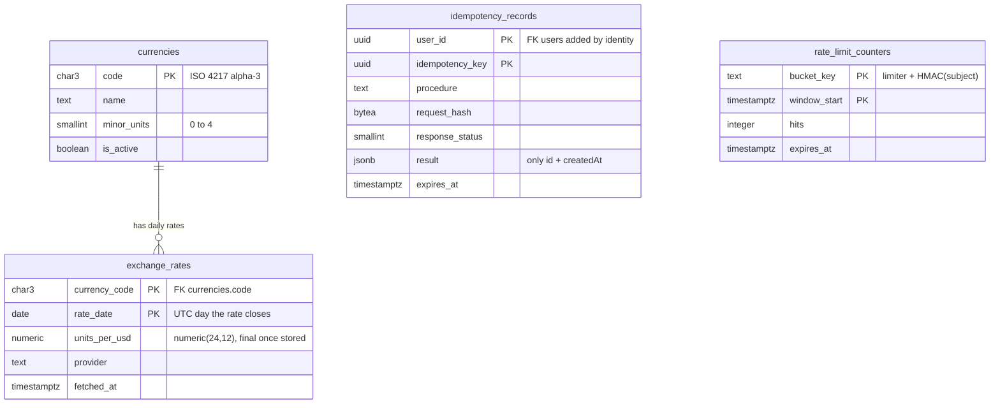
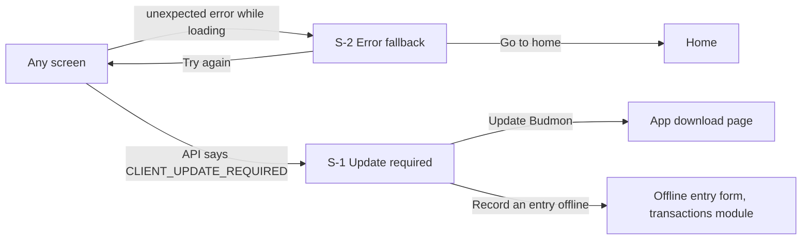
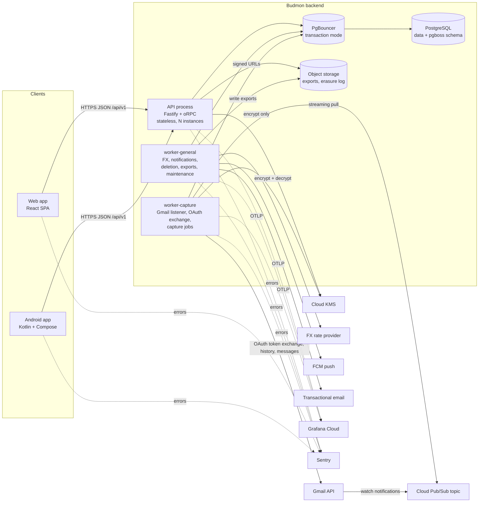
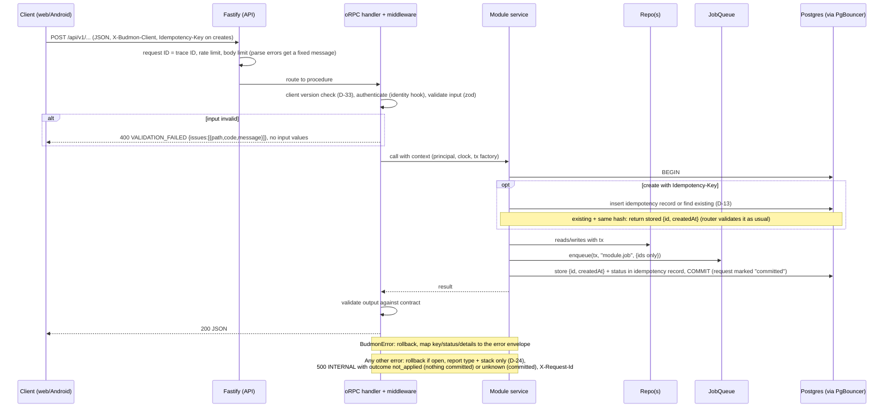
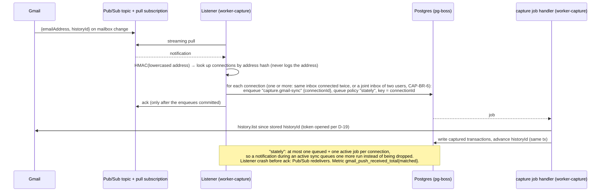
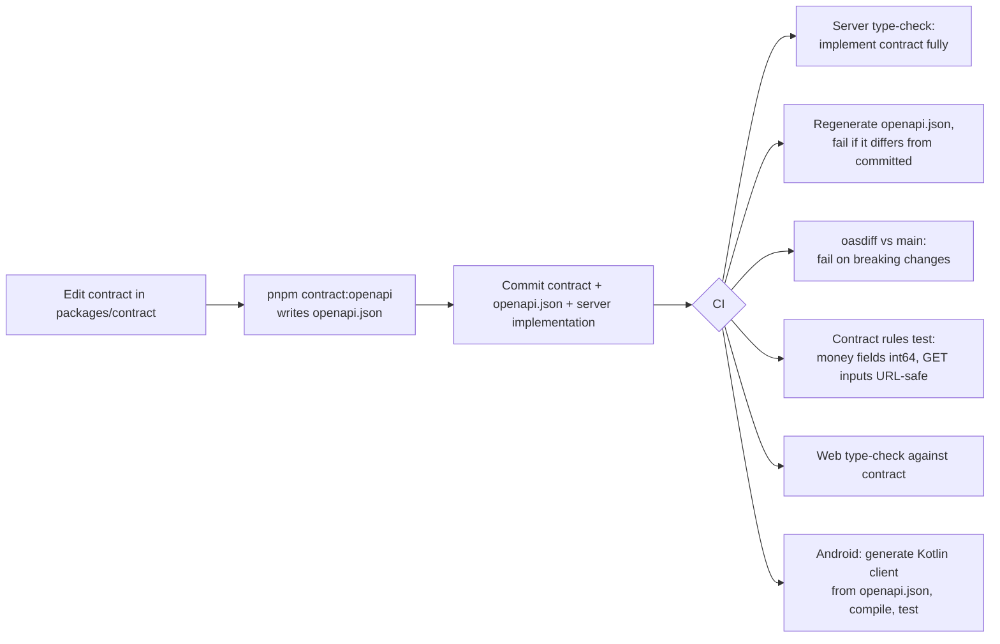

# Platform: High-Level Design

The technical base every other Budmon module builds on: repository layout, the API contract and generated clients, worker processes and the job queue, configuration and secrets, credential encryption, data access, migrations and the money type, the error model, observability, the security baseline, file storage, test tooling, CI, local development, hosting and backups, and the clean-up of the current repo.

Sources: [spec summary](../../product/spec-summary.md) v0.10 §4.14 (`PLT`), §3 (XC-n), §5 to §7; the user's [platform decisions](../../product/notes/2026-10-05-platform-decisions.md) (cited as **PD**); the [codebase review](../../product/codebase-review.md) (cited as **CR**); the [project brief](../../product/project-brief.md).

## Changelog

| Version | Date       | Change |
| ------- | ---------- | ------ |
| 0.1     | 2026-10-05 | Initial draft |
| 0.2     | 2026-10-05 | Plan review round 1. **P-1:** D-14 now states the exact money wire mechanism (a shared codec: `z.number().int()` bounded to ±(2^53 − 1) with a JSON-schema override to `integer`/`int64`, explicit number↔bigint conversion in server routers and web data hooks, no `.transform()` in the contract); added to the first contract spike (§9). **P-2:** D-24 gains a "sensitive-data boundaries" list: sanitised job errors (pg-boss output) with a canary on `pgboss.job.output`; messages of non-`BudmonError` errors dropped on server and both clients; oRPC validation `cause` stripped; Postgres `log_error_verbosity = terse` and `log_min_error_statement = panic`; no sensitive values in paths or query strings (sensitive filters in POST bodies, encrypted cursors, D-32); outbound client spans without query strings and allowlisted third-party error fields; Fastify request logging disabled with a custom serialiser; an infrastructure logging checklist and a staging canary gate. **P-3:** D-19 decides where the OAuth code exchange happens (worker-capture, from a sealed authorization code; F-3 redrawn), rewords memory handling, places re-wrap jobs, adds confused-deputy egress rules and the residual trust boundary with IAM restrictions. **P-4:** D-15 defines FX date semantics (the rate of UTC day D, fetched after it closes), immutable stored days, provisional conversions, an `fx.rates-added` notification for recomputation, and per-item rounding; §3.3 contradiction removed. **P-5:** D-13 replaces client-supplied entity IDs with per-user idempotency keys and an `idempotency_records` table; replays are answered from the record. **P-6:** D-21 adds `data.outcome` (`not_applied` / `unknown`) to `INTERNAL`; J-1 and §4.9 wording depend on it; every create takes an idempotency key on web too. **P-7:** D-9/D-12/§7.1 give pg-boss its own role owning the `pgboss` schema (runtime DDL confined there, a documented exception to PLT-BR-5); queues created in the migrate step; one retention for finished jobs plus dead-letter queues; F-4 uses the `stately` policy. **P-8:** new D-35 object storage for exports and the erasure log (private buckets, signed URLs, lifecycle deletion, erasure coverage). **P-9:** D-25 treats token expiry as connection state and alerts on a bounded `capture_connections_stale` gauge. User questions Q-11 (Gmail publishing status) and Q-12 (production pooler) added; Q-4 costs re-estimated with levers. Suggestions applied: S-1 to S-10, S-12, S-13, S-14; S-11 resolved by using 400 instead of 426 (see D-33). **User requirement (migrations only between deployments):** D-12 redesigned: development and test databases are built directly from the Drizzle schema (guarded `db:reset`/`db:sync`, no migration files); one migration per release, generated on a `release/<version>` pull request by the software-engineer, hand-edited for data-preserving changes listed in each LLD's release migration notes, reviewed and gated by release-only CI checks (migrations reproduce the schema, upgrade test, destructive-statement check); staging and production apply only committed migrations; pg-boss schema, roles, reference data and queues handled by an environment-independent schema step. PLT-BR-5 restated (US-7, D-12); D-5, D-9, D-26, D-27, D-28, D-29, D-34, §3, §7.1, §9 and Q-9 updated; Q-13 added. |
| 0.3     | 2026-10-05 | Plan review round 2. **B-1 (a):** release pull requests target main, must be up to date with main, and the pipeline tags the merge commit only after re-running check (i) on it; deploys use that commit (D-12, D-27, D-29). **B-1 (b):** `hotfix/<version>` path from the last release tag, with its own migration, the release checks, and a merge-back exempt from the no-migrations rule; linear journal rule; marked pending Q-14. **B-1 (c):** prompts never answered interactively: development and feature-branch test databases are only built by pushing onto empty databases (`db:sync` removed), and `generate` runs under a pseudo-terminal driver answering "create" and listing ambiguities, with `generate --custom` as fallback (D-12, D-26, §9). **B-1 (d):** the test-architect owns the upgrade test and its raw-SQL fixtures written against the previous release's schema; the planner keeps each LLD's Release migration notes current through amendments. **B-1 (e):** pg-boss upgrades ship alone, with workers scaled to zero and the API in maintenance during the schema step. **B-2:** creates return a fixed `{ id, createdAt }`; the idempotency record stores only that and the status; replays go through output validation; Android resends the stored request bytes (D-13, §3, F-1). **B-3:** successful sync defined per source kind; Gmail safety-net sync at least every 6 hours counts; SMS staleness on the dashboard only (D-25, J-8, Q-3). Suggestions S-1 to S-8 applied: spec v0.10 references and FK wording; OIDC trust scoped to release/hotfix tags in a protected environment; dead-letter lifetime and discarded return values; wider risky-statement check and the no-`CONCURRENTLY` note; staging keeps separate worker identities (costs updated); OAuth state bound to a server-side row (F-3); request bytes resent from the outbox; `db:reset`-only rule in the proposed CLAUDE.md conventions. Q-14 (hotfixes) added. |

## 1. Context and requirements

### 1.1 Requirements

Stories PLT-US-1 to PLT-US-15 and business rules PLT-BR-1 to PLT-BR-8 (spec §4.14), plus the cross-cutting requirements the platform has to make possible:

| Requirement | What the platform must provide |
| ----------- | ------------------------------ |
| XC-1, XC-2, XC-3, PLT-BR-3 | One exact money type (64-bit integer minor units plus the currency's decimals), currency reference data, daily market rates and a conversion function with defined date semantics. |
| XC-5, XC-6 | Conventions and helpers for instants, calendar dates and IANA time zones. |
| XC-9 to XC-16, PLT-BR-1, PLT-BR-2 | Credential encryption that only the capture worker can undo; observability, job storage and URLs that never carry amounts, payees, message content or tokens; hard deletion as the default so erasure (XC-16) is real; backups and logs whose retention is stated. |
| XC-17 | Background jobs and private file storage for exports (the export itself is `identity`'s). |
| XC-19 to XC-22 | A monorepo with backend, web app and native Android app; idempotent creates so Android's offline queue (XC-22, TXN-US-10) can retry safely. |
| XC-25 to XC-28 | Scheduled and queued work in workers (reminders, push and email delivery are `notifications`' and `identity`'s). |
| XC-29 to XC-31 | Gmail push ingestion path; best-effort availability (P9) with alerting. |
| IDN-BR-3, §6 (Gmail testing mode) | Nothing that hard-wires invite-only: the platform is designed for public scale (PD "Scale target") but deploys small. |

### 1.2 Goals

- Every module is built the same way, in a predictable place, against a contract that the web and Android apps can't drift from.
- Privacy rules (PLT-BR-1, PLT-BR-2) are enforced by construction and by automated tests, not only by guidelines.
- A fresh checkout plus one documented command runs the whole stack; one command runs every check.
- Launch cheaply for an invited group; scale out (more API instances, more workers, bigger database) without redesign.
- The repo starts from a sound base: the current broken and unsafe code is removed in the first slice (PLT-US-14).

### 1.3 Non-goals

- Any module's own features, tables or screens, including sign-in, sessions and tokens (`identity`).
- Redis, Kubernetes, microservices, GraphQL, a service mesh or a message broker other than pg-boss.
- WebSockets or server-sent events in the MVP (see §5.2).
- Postgres row-level security in the MVP (D-23).
- Exporting client-side (browser or Android) traces to Grafana in the MVP (D-24).
- A persisted offline read cache on Android (only new-entry offline support is in the MVP, XC-22).
- Multi-region deployment, high availability beyond the hosting provider's defaults, and an SLA (P9: best effort).
- An operations UI inside Budmon. The product owner's error and health views are Sentry and Grafana (spec P22: an in-app view comes later).
- A feature-flag service. Per-user feature switches are `admin`'s (ADM-US-7).

## 2. Actors and stories

Actors: **developer or agent** (builds Budmon), **product owner** (operates it), **end user** (sees the platform only through what it protects and how reliably the apps work), and **system actors**: the API process, worker-capture, worker-general, the CI pipeline.

The HLD keeps the spec's story IDs so traceability is one-to-one. Each becomes an LLD slice, except that **US-14 (clean-up) is delivered inside the first slice together with US-1** (decided, spec §7 item 4).

| ID | Spec | Story |
| -- | ---- | ----- |
| US-1 | PLT-US-1 | As a developer or agent, I want one repository holding backend, web app, Android app and the shared contract in a documented layout, so every module is built the same way. |
| US-2 | PLT-US-2 | As a developer or agent, I want to start the whole stack locally with one documented command, so anyone can run and test Budmon from a fresh checkout. |
| US-3 | PLT-US-3 | As a developer or agent, I want the API defined as a contract first, with OpenAPI published from it and clients generated from it, so the apps can't drift from the backend. |
| US-4 | PLT-US-4 | As a developer or agent, I want background work in separate worker processes through a job queue, so slow or scheduled work never slows the API and jobs aren't lost. |
| US-5 | PLT-US-5 | As a developer or agent, I want configuration validated when each process starts, so a misconfigured process fails immediately and clearly. |
| US-6 | PLT-US-6 | As an end user, I want the credentials Budmon holds for me encrypted and usable only by the part of Budmon that needs them, so a database or API leak doesn't expose my inbox. |
| US-7 | PLT-US-7 | As a developer or agent, I want staging and production schemas changed only through generated, reviewed, committed migrations, created once per release, while development and test databases are built directly from the schema, so the schema can evolve freely during development and safely once real data exists (user requirement, D-12). |
| US-8 | PLT-US-8 | As a developer or agent, I want one shared money type and helpers (including conversion at market rates), so every module stores, adds and displays amounts exactly. |
| US-9 | PLT-US-9 | As a client developer and end user, I want one error model across the API, so apps show the right message and nothing internal leaks. |
| US-10 | PLT-US-10 | As the product owner, I want errors from backend, web and Android in one place without users' financial data, so I can fix problems fast without breaking the privacy promise. |
| US-11 | PLT-US-11 | As the product owner, I want dashboards and alerts for the API and workers, including whether capture is working, so I notice when capture stops before users do. |
| US-12 | PLT-US-12 | As a developer or agent, I want automated checks on every change, so broken code doesn't reach the main branch. |
| US-13 | PLT-US-13 | As an end user, I want basic protection against abuse (rate limits, CORS, security headers, size limits), so my account can't be brute-forced and the API isn't trivially attacked. |
| US-14 | PLT-US-14 | As a developer or agent, I want the current repo cleaned up per the codebase review inside the first slice, so the first module starts from a sound base. |
| US-15 | PLT-US-15 | As an end user and product owner, I want my data backed up, so a server failure doesn't lose my financial history. |

Business rules carried through: PLT-BR-1 (D-24, §7.5), PLT-BR-2 (D-19), PLT-BR-3 (D-14), PLT-BR-4 (D-4, D-6), PLT-BR-5 (D-12; spec v0.10 wording, from the user's [platform feedback](../../product/notes/2026-10-05-platform-feedback.md)), PLT-BR-6 (D-9), PLT-BR-7 (D-25), PLT-BR-8 (D-21).

## 3. Data model

The platform owns little data: currency reference data and market rates (D-15), idempotency records (D-13), rate-limit counters (D-22), the queue's schema (D-9), the migrations journal in staging and production (D-12), and two storage buckets (D-35). It **removes** the existing `users`, `accounts`, `accountOwners` and `refreshTokens` tables from the codebase: the database is disposable (spec §7 item 1) and `identity` and `accounts` design their own tables fresh (spec §7 item 2).

### 3.1 Tables and stores

| Table / store | New / changed | Purpose | Key columns | Relationships |
| ------------- | ------------- | ------- | ----------- | ------------- |
| `currencies` | Changed (replaces the current table and the `CURRENCY` enum) | ISO 4217 reference data; the source of each currency's number of decimals (XC-1). | `code` (ISO 4217 alpha-3, primary key), `name`, `minor_units` (0 to 4), `is_active` (withdrawn currencies such as EEK are inactive: kept for history, hidden from pickers). Only real ISO 4217 currencies: no metals (XAU, XAG, XPT, XPD), no SDR (XDR), no testing or fund codes, no crypto. | Referenced by `exchange_rates`; later by accounts, users (base currency) and any table holding money. |
| `exchange_rates` | New | Daily market rates (XC-3), stored against one pivot currency (USD) so any cross rate can be derived. | (`currency_code`, `rate_date`) primary key; `units_per_usd` `numeric(24,12)`, parsed losslessly from the provider; `provider`; `fetched_at`. A stored row is **final** (insert-only). | `currency_code` → `currencies.code` (`restrict`). |
| `idempotency_records` | New | Makes create-type mutations safe to retry (offline sync, web retries) without probing or resurrection (D-13). | (`user_id`, `idempotency_key`) primary key; `procedure`; `request_hash` (SHA-256 of the canonical validated input); `response_status`; `result` (`jsonb`, only `{ id, createdAt }`, never entity content); `created_at`; `expires_at` (90 days). | `user_id` → `identity`'s users table with `cascade`, declared in `identity`'s schema (the platform is built before that table exists; both reach staging in the baseline release migration). |
| `rate_limit_counters` | New (`UNLOGGED`) | Shared fixed-window counters for sensitive endpoints, so limits hold across stateless API instances (D-22). | (`bucket_key`, `window_start`) primary key; `hits`; `expires_at`. `bucket_key` is the limiter name plus an **HMAC** of the subject (IP or email), never the raw value. | None. |
| `pgboss` schema | New | pg-boss's tables. | Owned by the `budmon_queue` role; installed and upgraded by the platform's queue schema step for the pinned pg-boss version, in every environment (D-12); pg-boss's own maintenance may create and drop objects inside this schema only (D-12). | Job payloads reference other tables' IDs only, never by foreign key. |
| `drizzle.__drizzle_migrations` | New | The applied-migrations journal. | Managed by Drizzle's migrator; exists in staging, production and release-path test databases (development databases are pushed, D-12). | None. |
| Bucket `exports` | New (object storage) | Generated data exports (XC-17). | Objects under `users/<userId>/exports/<exportId>.<ext>`; private; deleted after 7 days. | Metadata rows are `identity`'s. |
| Bucket `erasure-log` | New (object storage) | Append-only erasure records (internal user ID + time) to replay after a backup restore (D-30). | One object per erasure; retention lock 30 days, then lifecycle deletion. | None. |
| `users`, `accounts`, `accountOwners`, `refreshTokens` | **Removed** | Replaced by `identity` and `accounts` designs (spec §7). | | |

Conventions every module's tables follow (detailed in the LLD):

- **Names:** `snake_case`, plural table names (D-12).
- **Primary keys:** UUIDv7 generated by the server (D-13), except reference tables with a natural key (`currencies.code`).
- **Money columns:** `bigint` minor units plus a `currency_code` column (or a currency fixed by a parent row), never `numeric`, `real` or `double precision` (D-14).
- **Time columns:** `timestamptz` for instants, `date` for calendar dates, `text` IANA zone names; never `timestamp without time zone` (D-16).
- **Every table** has `created_at` and `updated_at`; author columns where a story needs them (for example ACC-US-7).
- **Every foreign key** states its `onDelete` behaviour explicitly (D-17).
- **Sealed secrets** (D-19) live in the owning module's table as one `bytea` column holding a versioned envelope; no central secrets table.
- **Tables holding a user's data** are covered by `identity`'s erasure (XC-16): each module's LLD states how (cascade from the user, or an explicit erasure step).

### 3.2 Entity-relationship diagram



### 3.3 Data lifecycle

- **`currencies`:** loaded from a committed ISO 4217 data file by the idempotent reference-data step (D-12); never deleted (`is_active = false` instead). `minor_units` never changes in place: an ISO change would be a deliberate data migration that rescales every stored amount in that currency.
- **`exchange_rates`:** insert-only; a stored day is final and is never overwritten by the application (a provider correction would be a deliberate, reviewed data migration). Kept indefinitely (about 160 currencies × 365 days ≈ 58k rows a year).
- **`idempotency_records`:** deleted 90 days after creation by a platform maintenance job, and with the user on erasure.
- **`rate_limit_counters`:** `UNLOGGED` (a database crash only resets limits); expired rows deleted every 10 minutes.
- **Jobs:** every finished job (completed or failed) is deleted 7 days after it finishes (pg-boss keeps one retention for finished jobs). A job that exhausts its retries is also copied to its role's **dead-letter queue**, which no worker consumes, so its jobs stay queued until the dead-letter queue's own retention (30 days) expires them: that's where failed jobs are inspected (PLT-US-4). Payloads hold IDs only and failure output is sanitised (D-10, D-24), so retention isn't a privacy concern.
- **Exports bucket:** objects deleted by lifecycle rule 7 days after creation, and immediately on user erasure (prefix `users/<userId>/`).
- **Erasure-log bucket:** each record is kept 30 days (longer than backup retention, D-30), then deleted.
- **Deletion convention for all modules (D-17):** hard delete is the default; lifecycle states are explicit status columns; soft delete only where a story requires restoring (for example REV-US-4), always with a purge job.
- **Backups (D-30):** daily, 14-day retention, plus 7 days of point-in-time recovery (proposed; Q-1). Erasures are replayed after any restore.
- **Telemetry retention** (D-24): logs, traces and error reports keep internal IDs (never names, emails or financial data) for at most 30 days.

## 4. User experience

The platform has almost no screens of its own. What applies is: how unexpected errors, rate limits, offline state and app updates look to the end user, which every module's screens reuse; and how the product owner sees errors and health, which is in external tools (Sentry, Grafana), not in Budmon.

Budmon has no design language yet: `docs/design/ux-guidelines.md` doesn't exist and XC-24 (proposal P8: English first, WCAG 2.2 AA, Android accessibility guidelines, a calm and plain tone) is still open. The conventions below follow P8 provisionally (Q-7).

### 4.1 User journeys

**J-1 Something goes wrong on Budmon's side (US-9, US-10).** An end user does anything (saves a transaction, opens a list). The server hits an unexpected error. What the user sees depends on whether the server knows nothing was saved (D-21, `outcome`):
- **Nothing was saved** (`outcome: not_applied`): "Something went wrong on our side. Nothing was changed. Try again in a moment." with **Try again** and "Reference: 4bf92f35" (the first 8 characters of the request ID). Form input is kept.
- **Unknown** (`outcome: unknown`, for example the error happened after the change was committed, or the connection dropped after sending): "We couldn't confirm this was saved. Check before trying again." **Try again** is still offered for creates, because every create carries an idempotency key (D-13): a retry returns the original result rather than creating a duplicate.
- Reads show the first message without "Nothing was changed" wording issues (reads change nothing).
- If the user reports the reference, the product owner finds the error in Sentry and the trace in Grafana. The report contains the reference, the user's internal ID, the error type and the code location, never what they typed.
- *Goes wrong:* retrying fails again: same message; nothing is lost. A screen-level failure while loading shows the full-screen fallback (S-2).

**J-2 Invalid input (US-9).** The user submits a form with a value the server rejects. The field is outlined, an icon and message appear under it (for example "Enter an amount greater than 0"), focus moves to the first invalid field, and a screen reader announces the error. The client maps the error's field paths to its fields. Client-side validation catches most of these first using the same rules from the contract's schemas (D-6).
- *Goes wrong:* a field the form doesn't show is rejected: the message appears at the top of the form ("Something in this form isn't valid: <field label>").

**J-3 Too many attempts (US-13).** The user (or an attacker) repeats a sensitive action too often. The form shows "Too many attempts. Try again in 10 minutes." with the wait from the server's `Retry-After`, and the submit button is disabled until then (the countdown is in text, not only a graphic).

**J-4 Offline on Android (XC-22; shared conventions that `transactions` uses for TXN-US-10).** The phone loses its connection. A slim banner appears: "You're offline. New entries are saved on this phone and sync when you're back online." Screens that need the network keep showing what's **already loaded in memory** (there's no persisted read cache in the MVP), marked "Offline: last updated 14:02", and disable server actions, explaining why on tap. If the app was restarted while offline, those screens show "You're offline. Connect to see this." New transactions and transfers can still be recorded (`transactions`). Each such entry shows a "Not yet synced" chip (icon + text). The app bar shows "3 waiting to sync". When back online: "Back online. Syncing 3 entries…", then chips disappear as entries sync.
- *Goes wrong:* the server rejects a synced entry (for example the account was archived or the user lost their role): the entry stays on the phone marked "Couldn't sync: tap to fix", and the app bar shows "1 entry needs attention". Nothing is silently dropped.
- *Goes wrong:* an entry has waited more than 60 days (close to the 90-day idempotency window, D-13): it isn't sent automatically; it's marked "Check before syncing" so the user confirms it, which prevents a duplicate if an earlier attempt had in fact succeeded.
- *Goes wrong:* the API says the app must be updated (J-5): sync pauses; entries stay "Not yet synced" (not "needs attention").
- (Whether offline entries count in on-device balances is P6, owned by `transactions`.)

**J-5 App update (Android, D-33).** When a newer build is available, a dismissible card on the home screen says "A new version of Budmon is available." with **Update** and **Later** ("Later" hides it for 3 days). When the installed build is below the minimum the API supports, the API answers every request with `CLIENT_UPDATE_REQUIRED`, offline sync pauses, and the app shows **Update required** (S-1): "Entries you saved offline are kept and will sync after you update." Recording new offline entries stays possible from that screen.
- *Goes wrong:* the download link fails: "Couldn't open the download. Ask the person who invited you for the latest version." (distribution, Q-8).

**J-6 Web app update.** After a new web release, the open web app notices (it checks the deployed version on window focus and every 30 minutes) and shows a non-blocking toast: "Budmon has been updated. Reload to get the latest version." with **Reload**. It never reloads by itself, so unsaved input isn't lost. If the API reports `CLIENT_UPDATE_REQUIRED` to the web app, the toast becomes a persistent banner with the same button.

**J-7 Budmon is down or in maintenance.** The API is unreachable or answers 503: "Budmon is temporarily unavailable. Try again in a few minutes." Android keeps recording offline entries. No status page in the MVP.

**J-8 The product owner is alerted (US-10, US-11).** Something breaks (the API stops answering, a worker stops, Gmail notifications back up, a connected Gmail inbox hasn't synced for a day, jobs fail unexpectedly). The owner gets an email from Grafana Cloud within about 5 to 15 minutes: subject "[Budmon] Capture worker down", with what's wrong, since when, and links to the dashboard and Sentry. The dashboard shows request rate, errors, latency, queue depth, dead-lettered jobs, Gmail push activity and capture connections by status (counts only). None of these show amounts, payees, message content, tokens, names or emails. When the problem clears, a "Resolved" email follows. First-time experience: right after the first deploy, panels show "No data" until traffic arrives; the synthetic health check produces data within 5 minutes, which proves the pipeline works.
- *Goes wrong:* the monitoring itself fails (Grafana Cloud down, free-tier limit hit): alerts can't fire. Mitigation: a monthly glance at usage against free-tier limits; a second independent uptime check is deferred (D-25).

### 4.2 Screens

| Screen | Purpose | Information hierarchy (first → last) | Primary action | Other actions |
| ------ | ------- | ------------------------------------ | -------------- | ------------- |
| S-1 Update required (Android) | Block use of an app version the API no longer supports, without losing offline entries. | What happened and that it's safe → why → how many offline entries are kept → download | **Update Budmon** | Record an entry offline |
| S-2 Error fallback (web and Android) | Replace a screen that failed to load or crashed. | What happened → what to do → reference | **Try again** | Go to home |

Shared components, used inside every module's screens:

| Component | Purpose | Behaviour |
| --------- | ------- | --------- |
| C-1 Offline banner (Android; the web app shows the same text without the offline-entry sentence) | Tell the user they're offline and what still works. | Appears when connectivity is lost, replaced by "Back online…" for 3 seconds when it returns. |
| C-2 Sync indicator and "Not yet synced" chip (Android) | Show pending and failed offline entries. | App-bar indicator with a count; chip on each pending entry; tapping a failed one opens it with the server's error. |
| C-3 Error message patterns | One look for every module's errors. | Inline field error (icon + text under the field), form-level summary, toast for background failures, full-screen fallback (S-2) for screens that can't load. |
| C-4 Update card (Android) and toast (web) | Announce a new version. | J-5 and J-6. |

S-1 Update required (Android):

```
+----------------------------------+
|                                  |
|        [ update icon ]           |
|                                  |
|  Update Budmon to continue       |
|                                  |
|  This version is no longer       |
|  supported. Updating takes about |
|  a minute.                       |
|                                  |
|  (i) 3 entries you saved offline |
|      are kept and will sync      |
|      after you update.           |
|                                  |
|  [       Update Budmon        ]  |
|                                  |
|     Record an entry offline      |
+----------------------------------+
```

S-2 Error fallback (both apps; web shown):

```
+----------------------------------------------+
| Budmon                          [nav ...]    |
|----------------------------------------------|
|                                              |
|   Something went wrong on our side           |
|                                              |
|   Try again in a moment. If it keeps         |
|   happening, share this reference with the   |
|   person who invited you.                    |
|                                              |
|   [ Try again ]   Go to home                 |
|                                              |
|   Reference: 4bf92f35                        |
+----------------------------------------------+
```

C-1 and C-2 on Android:

```
+----------------------------------+
| (!) You're offline. New entries  |
|     are saved on this phone.     |
|----------------------------------|
| Transactions      [⟳ 3 waiting]  |
|                                  |
|  Coffee         25.00 EGP        |
|  Today · Cash   [⟳ Not yet synced]|
|  Groceries     412.50 EGP        |
|  Yesterday · Bank                |
+----------------------------------+
```

### 4.3 Navigation

The platform adds no navigation destinations of its own. The update-required and error screens sit in front of any screen:



### 4.4 States

| Screen | Empty | Loading | Error | Partial / a lot of data |
| ------ | ----- | ------- | ----- | ----------------------- |
| S-1 Update required | No offline entries: the "(i) entries kept" line is hidden. | Not applicable (shown from local state). | Download link fails: inline message (J-5). | 1,000+ offline entries: "1,000+ entries you saved offline are kept". |
| S-2 Error fallback | Not applicable. | **Try again** shows a spinner in the button and keeps the message. | Retry fails: the screen stays, with "Still not working." added. | Not applicable. |
| C-2 Sync indicator | Hidden when nothing is pending. | "Syncing 3…" with a progress icon (not colour only). | "1 entry needs attention". | "99+ waiting". |
| Product-owner dashboards (Grafana) | "No data" until traffic; the synthetic check fills within 5 minutes. | Grafana's own. | Grafana's own. | Metric labels are bounded (D-25). |

### 4.5 Interaction and feedback

- **Error mapping** is by stable error key, never by parsing messages (D-21). Each client has one table mapping keys to wording; unknown keys fall back to the generic message.
- **Validation errors** are shown inline on submit, and as the user leaves a field when the client already knows the rule from the contract's schema. Server-side validation errors map back to fields by path.
- **Mutations** show progress on the button that triggered them and update the screen after the server confirms. Optimistic updates are a per-module choice; a failure rolls back the change and shows a toast. Offline entries on Android appear immediately with "Not yet synced".
- **Retries:** clients automatically retry only reads and idempotency-keyed creates (D-13), with backoff; other mutations are retried only when the user taps **Try again**. Updates set values (so a repeat is harmless) and a repeated delete that returns `NOT_FOUND` is treated as success.
- **Every response carries `X-Request-Id`**; clients show its first 8 characters as "Reference" on generic errors only.
- **Confirmation and undo** are per module; the platform adds none.

### 4.6 Effort on frequent tasks

The frequent tasks (recording a transaction, reviewing a capture, checking a balance) belong to other modules. The platform's job is not to add steps or latency to them:
- Update prompts never interrupt a task: the soft prompt is a dismissible card on home; the hard block happens only below the minimum supported version (D-33).
- Offline entry is never blocked by the platform, not even by the update-required screen.
- Latency targets for every module (D-25): API p95 under 300 ms for single-item reads and writes, under 800 ms for list and aggregate reads, measured server-side.

### 4.7 Presentation of data

Platform-wide conventions, implemented once in `@budmon/shared` (D-14, D-16) and in Android's equivalent, checked against shared test vectors so both apps agree:

- **Money:** formatted with the user's locale and the currency's code or symbol through `Intl.NumberFormat` (web) and ICU (Android), always with **the currency's `minor_units` from Budmon's `currencies` table** as the number of decimals, overriding the library default ("1,234.50 EGP", "1,234 JPY", "1.234 KWD"). All decimals are always shown. The helper can show a sign (`−12.50`) or not; whether a module shows a minus sign or colours an amount is its UX choice, and colour is never the only cue.
- **Converted amounts** (D-15) can be marked as approximate when the conversion is provisional; modules decide whether to show the mark.
- **Dates:** calendar dates are shown in the user's locale and never shifted by time zone. Instants are shown in the user's time zone (XC-5). Relative times ("2 hours ago") only under 7 days; older ones show the date.
- **Large numbers** don't abbreviate in money fields; reports may abbreviate axis labels.

### 4.8 Platform and accessibility

- **Web:** evergreen browsers (Chrome, Edge, Firefox, Safari, last 2 versions); responsive from 360 px wide to desktop. The platform's components meet WCAG 2.2 AA (P8, provisional): banners use `role="status"` with `aria-live="polite"`, error summaries `role="alert"`, focus moves to the error summary or the first invalid field on submit, contrast at least 4.5:1, all actions keyboard-reachable. Automated axe checks run in the web end-to-end tests (D-26).
- **Android:** Android 8.0 (API 26) and later (A-6), phones first; Material 3 with font scaling to 200% without clipping, TalkBack labels on every icon (the sync chip reads "Not yet synced"), touch targets at least 48 dp, and meaning never conveyed by colour alone.

### 4.9 Wording

Plain, calm, never blaming the user (P8). Key strings (English; clients hold them in message catalogs so other languages can follow):

| Where | Text |
| ----- | ---- |
| Generic error, nothing saved (`INTERNAL`, `outcome: not_applied`) | "Something went wrong on our side. Nothing was changed. Try again in a moment." |
| Generic error, outcome unknown (`INTERNAL`, `outcome: unknown`; or a timeout after sending) | "We couldn't confirm this was saved. Check before trying again." |
| Generic error on a read | "Something went wrong on our side. Try again in a moment." |
| Reference line | "Reference: {first 8 characters of request ID}" |
| Validation, form level (`VALIDATION_FAILED`) | "Some details need fixing." (each field shows its own message) |
| Rate limited (`RATE_LIMITED`) | "Too many attempts. Try again in {n} minutes." |
| Unavailable (`SERVICE_UNAVAILABLE`, network failure) | "Budmon is temporarily unavailable. Try again in a few minutes." |
| Not found (`NOT_FOUND`) | "This item doesn't exist or you no longer have access to it." |
| Forbidden (`FORBIDDEN`) | "You don't have permission to do this." |
| Offline banner | "You're offline. New entries are saved on this phone and sync when you're back online." |
| Offline, nothing loaded | "You're offline. Connect to see this." |
| Back online | "Back online. Syncing {n} entries…" |
| Chips | "Not yet synced" / "Couldn't sync: tap to fix" / "Check before syncing" |
| Update card | "A new version of Budmon is available." Buttons: "Update", "Later" |
| Update required | Title "Update Budmon to continue"; body "This version is no longer supported. Updating takes about a minute."; note "{n} entries you saved offline are kept and will sync after you update."; button "Update Budmon"; link "Record an entry offline" |
| Web update toast | "Budmon has been updated. Reload to get the latest version." Button "Reload" |
| Alert email subject | "[Budmon] {alert name}" and "[Budmon] Resolved: {alert name}" |

`NOT_FOUND` deliberately doesn't distinguish "doesn't exist" from "not yours" (§7.1).

## 5. Interfaces, protocols and integrations

### 5.1 Process and component overview



### 5.2 Client ↔ API: one HTTP JSON surface defined by the oRPC contract (D-4, D-6)

- **Transport:** HTTPS, JSON, REST-style paths under `/api/v1`, generated from the oRPC contract by oRPC's OpenAPI handler mounted in Fastify. The **web app** calls it with oRPC's `OpenAPILink` driven by the same contract; the **Android app** calls it through a Kotlin client generated from the committed `openapi.json`. Both clients hit the same routes.
- **No sensitive values in URLs (D-24):** paths and query strings may contain only IDs, enum values, dates, limits and encrypted cursors. Procedures whose inputs include amounts, payee names, note or message text, emails or tokens are `POST` with a JSON body, even when they only read (for example a transaction search with a payee or amount filter). A contract test enforces this (D-6).
- **Idempotency (D-13):** every create-type procedure requires an `Idempotency-Key` header (a UUID generated by the client per user action); both apps send it.
- **Auth transport** (bearer token vs cookie) is `identity`'s decision. The platform supports both: an auth hook in the oRPC context, `@fastify/cookie`, and CORS that allows credentials for the exact web origin.
- **Errors:** oRPC's error envelope, with Budmon keys as codes (D-21).
- **Real-time:** none in the MVP. The web app refetches on focus and after mutations; Android receives push through FCM (`notifications`). No story needs sub-second updates; SSE or WebSockets would add long-lived connections to a stateless API. oRPC supports event streams if a later story needs them.
- **Non-contract routes:** `GET /health/live` and `GET /health/ready` (database reachable), plain Fastify routes, unauthenticated, excluded from OpenAPI, returning no internals. `GET /api/v1/meta/client-config` (in the contract) returns the minimum supported and latest client versions (D-33). In local development only, a route serves files from the filesystem object store in place of signed URLs (D-35).
- **Client identification:** both apps send `X-Budmon-Client: android/<versionCode>` or `web/<build id>`; used only for D-33 and as the `client_kind` metric label.

### 5.3 Jobs and workers (D-9, D-10)

- **pg-boss** in the same Postgres. Modules use it only through the platform's `JobQueue` interface: define a job (name `<module>.<job>`, a zod payload schema, the worker role that runs it, retry policy, queue policy), enqueue it inside a database transaction, or schedule it with cron.
- **Two worker roles from one codebase**, each a separately deployed process (PLT-BR-6):
  - **worker-capture:** the only process allowed to decrypt capture credentials (PLT-BR-2). Runs the Gmail Pub/Sub listener, the OAuth code exchange (D-19), and every job that needs a user's credentials or raw message content (owned by `sources` and `capture`), plus re-wrapping of capture envelopes.
  - **worker-general:** everything else: FX rates (platform), notification and reminder delivery (`notifications`), deletion after the grace period and exports (`identity`), reconciliation of derived values (`accounts`, `budgets`), capture-connection health gauges, and platform maintenance.
  - In local development both roles can run as one process (`WORKER_ROLES=capture,general`); in deployed environments they're separate, so the decrypt permission stays isolated.
- **Inbound data that can only arrive through the API** (SMS content uploaded by the Android app, OAuth callbacks) is validated, sealed with the capture key, stored in the owning module's table and enqueued; processing happens in worker-capture (A-1).

### 5.4 Integrations

| Integration | Used for | Owner | Failure modes and behaviour |
| ----------- | -------- | ----- | --------------------------- |
| Google Cloud KMS | Wrapping data keys for sealed secrets (D-19). | platform | **Down or slow:** sealing fails, so the API rejects the action with `SERVICE_UNAVAILABLE` (the user retries); unsealing fails, so capture jobs retry with backoff (about 1 hour) and then dead-letter; nothing is lost because a mailbox's history ID isn't advanced until a sync succeeds. **Key disabled or permission removed:** same, plus an alert. Timeout 5 s per call. KMS decrypt calls are recorded in Cloud Audit Logs (principal and key only). |
| Google Cloud Pub/Sub (pull subscription) | Gmail `watch` notifications (PD). | platform hosts the listener; `sources`/`capture` own the handling | **Listener down:** notifications accumulate (retained 7 days) and are processed on restart; alert when the oldest unacknowledged message is older than 15 minutes. **Notification lost or watch expired:** a periodic safety-net sync per connection (frequency is `sources`' decision) catches up, and the stale-connection gauge alerts if a connection hasn't synced for 24 hours (D-25). Notifications contain only an email address and a history ID; the address is never logged. |
| Gmail API and Google OAuth token endpoint | Exchanging authorization codes, reading in-scope messages. | `sources`, `capture` | Designed in those modules. Platform constraints: runs only in worker-capture; destinations are fixed Google hosts from configuration (D-19). Expired or revoked tokens are a connection state, not a job failure (D-25). |
| FX rate provider | Daily market rates (XC-3). | platform (D-15) | **Down:** the daily job retries with backoff for up to 6 hours; conversions keep working provisionally from the latest stored day (D-15); alert if no new day for 36 hours. **Bad data** (unknown currency, zero, negative, unparseable): that currency's row is rejected and counted in a metric; the rest are stored. Provider choice: Q-5. |
| Object storage (Google Cloud Storage) | Exports and the erasure log (D-35). | platform | **Down:** export jobs retry, then dead-letter; the user sees the export as failed and can request it again (`identity`). Erasure-log write failure stops the erasure before any data is deleted (D-30), and the job retries. |
| Firebase Cloud Messaging | Android push. | `notifications` | Designed there; runs in worker-general. |
| Transactional email | Invitations, password reset, deletion notices (XC-27). | `identity` / `notifications` | Designed there; runs in worker-general through a provider adapter; Mailpit locally, a fake in tests. |
| Sentry | Error reports from all three apps (PD). | platform | **Down or quota reached:** reports are dropped after the SDK's buffer; the app is unaffected. Errors are still in logs. |
| Grafana Cloud (OTLP) | Traces, metrics, logs, alerting, synthetic check (PD). | platform | **Down:** exporters drop data after a bounded in-memory queue, never blocking requests. Logs still go to stdout and the host's log viewer. |
| Secret store (Google Secret Manager) | Production secrets injected as environment variables (D-20). | platform | Read at start; a missing secret fails startup. |
| App distribution (Firebase App Distribution, Q-8) | Android builds for the invited group. | platform | Download failure handled in J-5. |

## 6. Key flows

**F-1 A request, from client to database and back, including the error paths.**



**F-2 Transactional enqueue, processing, retry and dead-lettering.**

```mermaid
sequenceDiagram
  participant S as Service (API or worker)
  participant DB as Postgres
  participant W as Worker (role that owns the queue)
  participant H as Job handler (wrapped by platform)
  S->>DB: BEGIN; write domain rows; INSERT pgboss job (same tx); COMMIT
  Note over S,DB: Rollback removes the job too
  W->>DB: fetch next job
  W->>H: handle(payload validated by zod)
  alt success
    H->>DB: domain writes (own tx), idempotent by design
    W->>DB: complete job
  else throws
    H->>H: wrapper replaces the error with a sanitised one<br/>(error key or class, stack frames, allowlisted code)
    W->>DB: fail attempt (sanitised output only); retry with exponential backoff
    Note over W,DB: After retryLimit: copied to the role's dead-letter queue (kept 30 days);<br/>metric jobs_dead_lettered_total; owner retries with a CLI command
  end
```

**F-3 Connecting Gmail: the API never sees tokens or the client secret (D-19).**

```mermaid
sequenceDiagram
  participant U as User's browser/app
  participant API as API (encrypt-only identity)
  participant DB as Postgres
  participant KMS as Cloud KMS
  participant WC as worker-capture (decrypt identity)
  participant G as Google OAuth + Gmail
  U->>API: start connection
  API->>DB: insert pending OAuth row {state, user ID, PKCE verifier (sealed), expires in 10 min}
  Note over API,DB: works for Android (custom tab, bearer auth): the callback carries no session,<br/>so the state row, not a session, identifies the user
  API-->>U: redirect to Google consent (code challenge, state)
  U->>G: consent
  G-->>U: redirect to API callback with code + state
  U->>API: callback(code, state)
  API->>DB: look up unexpired pending row by state (single use)
  API->>API: seal {code} with key capture-credentials (the verifier is already sealed)
  API->>KMS: Encrypt(data key)
  API->>DB: store sealed pending exchange + enqueue sources.gmail-exchange {pendingId} (one tx)
  API-->>U: "Connecting…" (polls status)
  DB-->>WC: job
  WC->>KMS: Decrypt(data key)
  WC->>G: token exchange (code, verifier, client secret held only by worker-capture)
  G-->>WC: refresh + access token
  WC->>WC: seal refresh token (AAD = table + row + purpose); access token kept in memory only
  WC->>DB: store sealed token, mark connected, delete pending exchange (one tx)
  U->>API: poll status: "Connected"
  Note over WC,G: Code expired or exchange fails: pending exchange deleted, status "Couldn't connect, try again"
```

**F-4 Gmail push into capture jobs (with fan-out to several connections).**



**F-5 Contract change to clients (D-6).**



**F-6 Daily FX rates and late-arriving days (D-15).**

```mermaid
sequenceDiagram
  participant Cron as pg-boss schedule (UTC 00:30)
  participant WG as worker-general
  participant P as FX provider
  participant DB as Postgres
  participant M as Subscribed modules (budgets, reports...)
  Cron->>WG: platform.fx-rates-fetch {rateDate = yesterday (UTC)}
  WG->>P: historical rates for rateDate (USD base), timeout 10 s
  alt ok
    WG->>WG: parse losslessly as decimal strings; keep active ISO codes only; reject bad values
    WG->>DB: INSERT exchange_rates for rateDate (ON CONFLICT DO NOTHING: stored days are final)
    WG->>DB: enqueue fx.rates-added {rateDate, affectedFrom, affectedTo} for each subscribed module (same tx)
    DB-->>M: module recomputes derived values that used provisional rates in [affectedFrom, affectedTo]
  else fails
    WG->>DB: retry with backoff, up to 6 hours, then dead-letter + alert after 36 h without a new day
  end
```

## 7. Cross-cutting concerns

### 7.1 Authorization

- **The platform provides the plumbing; modules decide the rules.** Every procedure is built from one of three bases: `publicProcedure` (explicit allowlist only: in the contract, sign-up/sign-in-type procedures, client config and similar), `authedProcedure` (requires a principal from `identity`'s authentication hook), and `ownerProcedure` (product owner, for `admin`). Resource-level checks live in each module's service.
- **Default deny, tested:** an automated test enumerates every procedure in the contract and calls it without credentials; anything not on the public allowlist must return `UNAUTHENTICATED` (401). This is the structural fix for the unauthenticated `GET /users` (CR X-1).
- **Not found vs forbidden:** reading another user's resource returns `NOT_FOUND` (404), not `FORBIDDEN`, so IDs can't be probed (XC-15, ACC-BR-4). `FORBIDDEN` (403) is for resources the caller can see but can't change (for example a viewer editing an entry, ACC-BR-2). Idempotency keys are scoped per user, so they can't be used to probe other users' data either (D-13).
- **Workers** act as the system, with the user or account ID in the job payload; handlers re-read current state (for example that the source is still connected, the account not frozen) instead of trusting the payload.
- **Database roles (least privilege):**
  - `budmon_migrator` owns the application schema and is the only role that runs DDL there (the deploy migrate step in staging and production; the push onto empty development and feature-branch test databases).
  - `budmon_queue` owns the `pgboss` schema; pg-boss's internal connections (fetching, maintenance) in the workers use it. Its runtime DDL (pg-boss maintenance creating and dropping objects) is confined to that schema.
  - `budmon_app` (API and workers) gets DML on the application schema, and on `pgboss` tables through default privileges granted by `budmon_queue` (so it can enqueue inside its own transactions).
- **Row-level security** isn't used in the MVP (D-23).

### 7.2 Money and currency

- **Storage:** `bigint` minor units plus the currency code; decimals from `currencies.minor_units` (D-14, PLT-BR-3).
- **In TypeScript:** a `Money` value `{ minor: bigint, currency: CurrencyCode }`; arithmetic only through helpers that reject mixed currencies; no `number` arithmetic on money. ESLint rules ban `parseFloat`, `Number(...)` and `bigint({ mode: "number" })` in money code paths.
- **On the wire:** JSON integers in minor units bounded to ±(2^53 − 1), declared `integer`/`int64` in OpenAPI through the shared money codec; `number` in the contract's TypeScript types; converted explicitly to and from `bigint` at two places only: the server's routers and the web app's data hooks (D-14).
- **Aggregates:** `SUM` over `bigint` returns `numeric`, which the driver returns as a string; repos parse it straight to `bigint` (exact). A value outside the wire range fails the response loudly (`INTERNAL`, reported) rather than losing precision.
- **Rounding:** only conversion, percentages and allocation produce fractions. Conversion and percentages use exact rational `bigint` arithmetic and round once, half-to-even. **Converting a set of amounts rounds each item, then sums** (so totals equal the sum of the converted amounts users see). Allocation uses largest remainder so parts sum exactly (TXN-BR-2).
- **Multi-currency and FX:** D-15 (date semantics, provisional conversions, recomputation). Applied rates on transfers are `transactions`' data (TXN-BR-7), never overwritten by market rates.
- **Formatting:** §4.7.

### 7.3 Consistency and transactions

- **Unit of work:** services open the transaction (`withTransaction`) and pass the handle to every repo and to `JobQueue.enqueue`; repos never open their own. This replaces the `getInstance()` singletons (CR §4.1).
- **Isolation:** `READ COMMITTED` by default; modules use `SELECT … FOR UPDATE` on rows they derive from, or request `SERIALIZABLE` for a specific operation. `withTransaction` retries serialization failures and deadlocks (40001, 40P01) up to 3 times with jitter.
- **Commit tracking:** the request context records whether any transaction committed during the request; the error interceptor uses it for `outcome` (D-21).
- **Jobs and data change together:** same-transaction enqueue (F-2); no outbox table.
- **At-least-once jobs:** every handler is idempotent: check state first, use unique constraints as guards, and record external side effects (such as "push sent") in the module's table in the same transaction that completes the work.
- **Derived values** (balances, budget progress) are maintained incrementally in the same transaction as the change (PD), and a scheduled reconciliation job per module recomputes from source rows, corrects drift, and counts corrections in `reconcile_corrections_total{module}`. Conversions are deterministic given the stored rates, and the `fx.rates-added` job (D-15) tells modules exactly which dates' conversions changed, so incremental values and reconciliation converge.
- **Idempotent creates:** per-user idempotency keys and records (D-13).

### 7.4 Time and time zones

- **Instants:** `timestamptz` in the database, `Temporal.Instant` in TypeScript, RFC 3339 with `Z` on the wire.
- **Calendar dates** (a transaction's date, a budget period's start): `date` in the database, `Temporal.PlainDate` in TypeScript, `YYYY-MM-DD` on the wire, `java.time.LocalDate` on Android; never converted through a time zone.
- **Time zones:** IANA names (`Africa/Cairo`), validated against the runtime's zone database. The user's zone lives in `identity`'s profile; changing it doesn't move stored dates (IDN-US-3).
- **"Today" and periods** are computed from the user's zone (XC-5) through an injectable `Clock`.
- **Servers and cron run in UTC.** Per-user local times (quiet hours, reminders) are computed by the owning module.
- **FX dates:** a transaction's calendar date is matched to the rate stored for that same date (a UTC day) without zone conversion (D-15).
- **Library:** Temporal, native where the runtime has it, otherwise the polyfill, behind `@budmon/shared` (D-16).

### 7.5 Privacy and security

- **PLT-BR-1 enforcement** (D-24): allowlist-only logging; values that print as `[redacted]`; telemetry configured to capture no bodies, query strings, headers or local variables; messages of unexpected errors dropped everywhere; sanitised job failure output; no sensitive values in URLs; infrastructure logging configured by checklist; a privacy canary test suite in CI and a canary gate on staging before each production release.
- **PLT-BR-2:** envelope encryption with Cloud KMS; the API can encrypt but never decrypt capture secrets and never sees Gmail tokens or the Google client secret; only worker-capture decrypts (D-19).
- **Secrets** from the environment (Secret Manager when deployed); `.env` only locally; never committed (D-20).
- **Transport:** TLS for every external connection and for database connections outside the private network; HSTS on the API and web host.
- **At rest:** provider disk encryption, plus application-level envelope encryption for credentials; exports in a private bucket reachable only through short-lived signed URLs (D-35).
- **Job payloads** hold IDs only (D-10).
- **Hashing utilities** for `identity`: Argon2id for low-entropy secrets, HMAC-SHA-256 for high-entropy tokens, constant-time comparison, a random token generator (D-22).
- **Abuse protection:** rate limits, CORS, headers, body limits, timeouts (D-22).
- **Errors** never leak internals (PLT-BR-8, D-21).
- **Data minimisation:** date of birth is dropped (spec §7 item 3); rate-limit keys and mailbox lookups use HMACs; telemetry retention capped at 30 days.
- **Android:** the local database (offline entries) is excluded from Android Auto Backup and device-to-device transfer, and never attached to Sentry reports.

### 7.6 Scale, performance and observability

- **Expected load (A-4):** invite-only, up to about 100 users, roughly 100 to 300 transactions per user per month; a few requests per second at peak. Public scale means more instances and a bigger database, not a redesign: stateless API (PLT-BR-6), queue behind an interface (PD), pooler (D-18), indexes per query.
- **Indexes per query:** every module's LLD lists each query with the index that serves it; `pg_stat_statements` is enabled and reviewed after each module ships.
- **Latency targets:** §4.6; tracked with request-duration histograms per route template.
- **Observability** (D-24, D-25): OpenTelemetry traces and metrics plus pino logs from API and workers to Grafana Cloud; Sentry for errors from all three apps; W3C trace context from clients so a client error, its request ID, the server trace and the Sentry issue line up; email alerting.

## 8. Decisions

Decisions D-1 to D-4, the queue and worker part of D-9, D-11's push, the core of D-14, D-18's pooler, D-19's managed key and capture-only decryption, and D-24's tool choices were **made by the user** (PD) and are recorded here with their rationale; they aren't reopened. The rest are the planner's proposals.

### D-1: PostgreSQL as the only database (user decision, PD)
- **Options considered:** PostgreSQL; MongoDB or another document store; PostgreSQL plus a document store.
- **Decision:** PostgreSQL. Flexible data (templates, extracted fields, budget rule conditions) goes in `jsonb`. Major version: the current stable major at implementation time (18 or later), pinned to the same major in local, CI and production.
- **Rationale:** the domain is relational and needs multi-row transactions (splits, transfers, balances); `jsonb` covers the flexible parts; the same database hosts the job queue (D-9).

### D-2: Node.js + TypeScript (user decision, PD), on Node 24 LTS with a planned move to 26
- **Options considered:** runtime: Node + TypeScript (chosen by the user); Kotlin/JVM; Go. Version: Node 24 (Active LTS until this month, then maintenance until April 2028); Node 26 (becomes LTS in October 2026).
- **Decision:** start on **Node 24 LTS**; move to Node 26 as a single pinned-version change (`engines`, `.nvmrc`, CI, Docker image) once it's LTS and the native and instrumented dependencies (`@node-rs/argon2`, pg-boss, OpenTelemetry instrumentations) support it, before the first production deploy if possible. TypeScript in strict mode with the review's settings kept (ESM, `module: nodenext`, `.js` import suffixes, `noUncheckedIndexedAccess`, `exactOptionalPropertyTypes`, `verbatimModuleSyntax`). Production runs compiled JavaScript (`tsc -b`); development uses `tsx watch`.
- **Rationale:** the workload is I/O-bound (PD); one language across backend, web and contract lets the web app use the contract's types directly. Starting on the proven LTS avoids being first on a fresh major with native bindings; the move is cheap and planned.

### D-3: Fastify replaces Express (user decision, PD)
- **Options considered:** Express 5 (current), Fastify, Hono.
- **Decision:** Fastify, with `@fastify/helmet`, `@fastify/cors`, `@fastify/rate-limit`, `@fastify/cookie`; oRPC's OpenAPI handler is mounted through its Fastify adapter. Fastify's built-in request logging is **disabled** (`disableRequestLogging`), replaced by the platform's allowlisted request log, and its logger uses the platform's serialisers for requests and errors (D-24).
- **Rationale (PD):** built-in pino logging, plugin encapsulation per module, `app.inject()` for in-process tests, better typing, mature plugins and OpenTelemetry instrumentation. Speed isn't the reason.

### D-4: oRPC contract-first, one OpenAPI-shaped wire protocol for both clients (user decision for oRPC; planner decision for the single protocol)
- **Options considered:** (a) oRPC serving both its native RPC protocol (web, `RPCLink`) and the OpenAPI protocol (Android); (b) only the OpenAPI protocol, with the web using `OpenAPILink`; (c) ts-rest (rejected by the user); (d) tRPC (the current stub; superseded).
- **Decision:** (b). The contract (`@orpc/contract`, zod 4 schemas) lives in `packages/contract`; the server implements it with `implement(contract)`; Fastify mounts only the `OpenAPIHandler` under `/api/v1`; the web uses `OpenAPILink` plus oRPC's TanStack Query integration. oRPC is pinned to an exact version.
- **Rationale:** with one protocol, the routes Android uses are exactly the routes the web uses and the tests exercise, and errors, dates and money are encoded once. The RPC protocol's richer native types (`Date`, `BigInt`) are things we don't want on the wire anyway, because Android needs plain JSON and money has its own codec (D-14).

### D-5: Monorepo with pnpm workspaces, no build orchestrator
- **Options considered:** (a) pnpm workspaces with plain scripts; (b) plus Turborepo or Nx; (c) separate repositories per app.
- **Decision:** (a). Layout:

  | Path | What | Package |
  | ---- | ---- | ------- |
  | `apps/server/` | API and workers (one codebase, several entry points). `src/platform/` holds the foundations (config, db, errors, observability, queue, crypto, http, storage, FX service, idempotency, rate limits); `src/<module>/` per spec module with `<module>Router.ts` (oRPC implementation; converts wire values to domain values), `<module>Service.ts`, `<module>Repo.ts`, `<module>Errors.ts`, `<module>Jobs.ts`, and `<module>Validators.ts` for server-only validation (third-party payloads); `src/db/schema/<table>.ts` (`<name>Table`, registered in `src/db/schema/index.ts`); `src/main/{api,worker,migrate}.ts`; `drizzle/` migrations; `test/` | `@budmon/server` |
  | `apps/web/` | React SPA (D-7) | `@budmon/web` |
  | `apps/android/` | Gradle project (D-8); not a pnpm package | (Gradle) |
  | `packages/contract/` | oRPC contract, zod schemas per module (`src/<module>/`), shared wire schemas (`src/common/`: money codec, dates, IDs, cursors, errors), contract-authoring rules, and the committed `openapi.json` | `@budmon/contract` |
  | `packages/shared/` | Pure helpers for server and web: `Money` and its arithmetic, formatting and wire conversion, time helpers, ID generation; `test-vectors/` (JSON) also read by Android tests | `@budmon/shared` |
  | `packages/config/` | Shared `tsconfig` bases, ESLint flat config, Prettier config | `@budmon/config` |
  | `infra/` | `compose.yaml` for local dev, Dockerfiles, OpenTofu (D-29) | |
  | `docs/` | As today | |

  Root scripts: `pnpm dev`, `pnpm check`, `pnpm check:all`, `pnpm test`, `pnpm db:reset`, `pnpm db:seed` (development), `pnpm db:release-migration` (release and hotfix branches), `pnpm db:migrate` (deploy), `pnpm contract:openapi`. The review's layering (router → service → repo; only repos touch the database) is kept and enforced with an ESLint import-boundary rule.
- **Rationale:** a handful of packages doesn't need a task graph; Turborepo can be added later without restructuring. One repo keeps contract, server and clients changing in the same pull request, which makes the drift check (D-6) possible. Android stays a plain Gradle project because pnpm can't build it.

### D-6: Contract → OpenAPI → clients, kept in sync by CI; additive API evolution
- **Options considered:** OpenAPI file generated at build time only vs generated and committed; Kotlin client committed vs generated at Gradle build time; drift caught by people vs by CI.
- **Decision:**
  - `pnpm contract:openapi` generates `packages/contract/openapi.json` (OpenAPI 3.1, oRPC's generator with `@orpc/zod`'s zod 4 converter and the platform's schema overrides, D-14) and it's **committed**.
  - The **web** imports the contract package; its client is `OpenAPILink` typed from the contract.
  - The **Kotlin client** is generated during the Android build from the committed `openapi.json` (OpenAPI Generator, `kotlin`, Retrofit + kotlinx.serialization) into the build directory; never committed or hand-edited (PLT-BR-4).
  - **Contract-authoring rules,** checked by a contract test: no `.transform()` or other schemas that convert to an untyped JSON schema; every money field uses the shared money codec and appears as `integer`/`int64` in `openapi.json`; `GET` procedures take only URL-safe inputs (IDs, enums, dates, limits, cursors; D-24); every create declares the `Idempotency-Key` header; every procedure declares its errors.
  - **CI fails if:** the server doesn't implement the contract exactly; a freshly generated `openapi.json` differs from the committed one; `oasdiff` reports a breaking change against main (unless the pull request is labelled as intentionally breaking, which also requires raising the minimum client version, D-33); the contract rules test fails; the web app doesn't type-check; the Android app doesn't compile or its tests fail against the regenerated client.
  - **Runtime:** oRPC validates inputs and outputs against the contract's schemas.
  - **Evolution policy:** additive only (new procedures, new optional fields, new enum values that clients tolerate as "unknown"). A breaking change is a new procedure plus deprecation of the old one, removed only after the minimum supported Android version no longer uses it.
- **Rationale:** each piece fails at the earliest stage that can detect it; generating the Kotlin client at build time removes "forgot to regenerate" drift; breaking-change detection matters because Android installs lag behind deploys.

### D-7: Web app: React + Vite single-page app with TanStack Router and Query
- **Options considered:** (a) React + Vite SPA with TanStack Router and Query; (b) Next.js; (c) SvelteKit; (d) React Router 7 in framework mode.
- **Decision:** (a), served as static files from a CDN (D-29). UI on **React Aria Components** styled with **Tailwind CSS**; forms with React Hook Form and zod schemas from the contract; messages and formatting through **FormatJS (react-intl)** catalogs from day one; Sentry browser SDK (configured per D-24). Data hooks convert wire values to domain values (money to `Money`, dates to `Temporal`) in one place per procedure, using `@budmon/shared` (D-14). Router search parameters (the URL) hold only URL-safe values (D-24); sensitive filters live in component state.
- **Rationale:** the web app is entirely behind sign-in, so server rendering and SEO add nothing; Next.js or SvelteKit would add a second server runtime duplicating the API's concerns and blurring PLT-BR-6. A static SPA is cheap to host and is what the planned Electron app wraps. oRPC has first-class TanStack Query support. React Aria gives WCAG-grade keyboard and screen-reader behaviour (P8). Cost: no server-rendered first paint, and security relies on a strict CSP from the static host.

### D-8: Android stack: Kotlin, Jetpack Compose, Room, WorkManager, generated Retrofit client
- **Options considered:** UI: Compose vs XML Views. Storage: Room vs SQLDelight vs DataStore. Networking: generated Retrofit client vs generated Ktor client (Multiplatform-ready) vs hand-written. Architecture: single-activity MVVM vs MVI frameworks.
- **Decision:** Kotlin, **Jetpack Compose** with Material 3, single activity, MVVM (`ViewModel` + `StateFlow`), **Hilt**, **Room** for the offline-entry outbox (TXN-US-10), **WorkManager** for sync, **OkHttp + Retrofit + kotlinx.serialization** through the generated client (D-6), Sentry Android SDK (D-24), minSdk 26. The Room database is excluded from Auto Backup and device transfer (data extraction rules). OkHttp's logging interceptor exists only in debug builds and never logs bodies. Debug builds point at the local API (`http://10.0.2.2:<port>`); release builds at the deployed API.
- **Rationale:** Compose, Room and WorkManager are the current Android defaults with the best testing support; WorkManager survives process death and reboots, which offline sync needs; Retrofit is OpenAPI Generator's most mature Kotlin target. Kotlin Multiplatform is deferred until iOS is scheduled (XC-21).

### D-9: pg-boss with separate worker processes in two roles (user decision for pg-boss and separate workers; planner decision for roles, database role and queue setup)
- **Options considered:** queue: pg-boss (user), BullMQ on Redis (revisit only if volume outgrows Postgres). Split: (a) one worker process; (b) one process per module; (c) two roles: capture and general. Schema ownership: application role with DDL rights; pg-boss's own role; pg-boss with runtime DDL features disabled.
- **Decision:** (c). One `worker` entry point started with `WORKER_ROLES`. Each job definition names its role; a worker only works its roles' queues. **pg-boss runs under its own database role `budmon_queue`, which owns the `pgboss` schema** (§7.1); its maintenance may create and drop objects inside that schema, an explicit and documented exception to PLT-BR-5 confined to it. Queues are **not partitioned** (avoids per-queue table creation). **Queues are created and updated by the schema step** (D-12: `pnpm db:migrate` when deployed, `pnpm db:reset` in development, test setup in CI), through a queue sync from the job registry as `budmon_queue`; workers never create queues and fail fast at start-up if a queue they need is missing. Scheduling uses pg-boss cron schedules (UTC), registered by the general role. Modules use only the platform's `JobQueue` interface (PD).
- **Rationale:** PLT-BR-2 is enforceable only if the capture worker is a separately deployed process with its own cloud identity (D-19), so (a) doesn't work; (b) multiplies deployments for no benefit. pg-boss performs DDL at runtime (maintenance-created objects, deferred index creation), so a DML-only application role can't run it; a dedicated owner role keeps the application schema DDL-free while letting pg-boss work as designed. Creating queues in the schema step keeps all schema-affecting actions in one deliberate place.

### D-10: Transactional enqueue, payload rules, retention and idempotency
- **Options considered:** enqueue after commit (risk: lost jobs); an outbox table; enqueue in the same transaction.
- **Decision:** enqueue in the same transaction, using pg-boss's support for a caller-provided database executor (bound to the Drizzle transaction). **Payloads** hold only IDs, enums, dates and counts, validated by the job's zod schema on enqueue and on receipt; never amounts, payees, message content, tokens, emails or names (sensitive inputs go into the owning module's table, sealed where D-19 applies). **Job output:** the platform's handler wrapper catches every error and rethrows a sanitised one (D-24) so pg-boss only ever stores a key or class name, stack frames and an allowlisted code; it also discards handlers' return values (pg-boss would store them as the completed job's output), so completed jobs store nothing. Dead-lettered copies keep that sanitised output. **Retries:** exponential backoff, default limit 5, per-job override. **Retention:** finished jobs deleted after 7 days (`deleteAfterSeconds`); exhausted jobs copied to the role's dead-letter queue, which nothing consumes, so their lifetime is that queue's retention (30 days); a CLI lists and re-enqueues them. **Queue policies:** default `standard`; `stately` where "one queued plus one running per key" is wanted (F-4); singleton keys for deduplication. Handlers are idempotent (§7.3).
- **Rationale:** same-transaction enqueue is the simplest correct option and the main reason pg-boss was chosen (PD). The payload and failure-output rules keep pg-boss's tables outside PLT-BR-1's blast radius. pg-boss has one retention setting for finished jobs, so longer inspection lives in dead-letter queues.

### D-11: Gmail push via `watch` + Pub/Sub, received by a pull subscription in worker-capture (user decision for push; planner decision for pull)
- **Options considered:** polling (rejected by the user); Pub/Sub push subscription to an HTTPS endpoint; Pub/Sub pull (streaming pull) from a worker.
- **Decision:** a pull subscription consumed by a listener in worker-capture, which maps each notification's mailbox (by HMAC of the lowercased address) to every matching connection and enqueues one `stately` capture job per connection, acknowledging only after the enqueues commit (F-4). `watch` renewal and the safety-net sync are scheduled jobs designed by `sources`.
- **Rationale:** a push endpoint would have to live on the API (the only public HTTP surface), contradicting PLT-BR-6, and would need token verification. Pull keeps ingestion in the worker, needs no public endpoint, and gets redelivery for free; its backlog signals a dead listener (D-25).

### D-12: Keep Drizzle; schema synced directly in development, one reviewed migration per release for staging and production; snake_case
- **Options considered:**
  - ORM: keep Drizzle; Kysely; Prisma; raw SQL with node-pg-migrate.
  - Migration workflow (PLT-US-7 and PLT-BR-5 in spec v0.10: migrations only where deployed data must be preserved): (a) a migration per schema change, committed with each change (v0.1's design); (b) **development and test databases built directly from the Drizzle schema, with one migration generated per release** capturing the net change since the last deployed migration; (c) no migrations at all, `push` everywhere (rejected: `push` can't express data-preserving changes and would change staging and production ad hoc).
  - Who writes the release migration and when: the person or agent merging each module; a release step when a release is cut; the deploy pipeline (rejected: a migration must be reviewed before it runs).
  - Handling `drizzle-kit`'s interactive prompts (it asks "rename or create?" whenever a column or table disappears and another appears, in `push` and in `generate`, including its programmatic API): answer them by hand (impossible for agents and CI); avoid them by only pushing onto empty databases; answer them mechanically ("create" for every ambiguity) through a pseudo-terminal driver and fix renames by hand; write every release migration by hand (`generate --custom`).
- **Decision:** keep **Drizzle ORM** with `node-postgres`; database identifiers become `snake_case` (Drizzle's `casing: "snake_case"`), TypeScript properties stay camelCase. Workflow **(b)**:
  - **The rule (PLT-BR-5, spec v0.10):** staging and production schemas change only by applying committed, reviewed release migrations through the deploy pipeline, and every release migration preserves existing data; development and test databases are disposable and built directly from the current schema.
  - **Prompts are never answered interactively.** Development and test databases are only ever built by **pushing onto an empty database** (no existing tables, so no ambiguity and no prompt). Migration generation (`db:release-migration` and the pending-changes report) runs `drizzle-kit generate` under a **pseudo-terminal driver** that answers "create" to every ambiguity and lists each ambiguity it answered; renames are then hand-edited into the migration as the Release migration notes require. If the driver stops working with a `drizzle-kit` upgrade, the fallback is a hand-written migration (`generate --custom`), which release check (i) still verifies.
  - **Development (local, feature and module branches, main between releases):** no migration files. `pnpm db:reset` drops the local database and rebuilds it with the development schema step (push onto the empty database), then seeds it. There is no incremental `db:sync` (it would prompt). `db:reset` refuses to run unless the target is a local or test database (`APP_ENV` is `development` or `test` and the host is local or a test container); deploy images contain no push command; deployed environments' DDL-capable credentials never reach developer tools.
  - **Release branches.** A release is cut as branch `release/<version>` from main and opened as a pull request **into main**. In it:
    1. the **software-engineer** runs `pnpm db:release-migration`, which generates **one** migration, `NNNN_<version>.sql`, with the net schema change since the last released snapshot, and hand-edits it for data-preserving changes a schema diff can't express: renames, backfills, `NOT NULL` on existing columns (add nullable → backfill → set `NOT NULL`), type changes with conversion; destructive "contract" steps (dropping what the previous release's code still uses) are deferred to a later release so the migration is compatible with old code during rollout (expand then contract). What each module needs is listed in its LLD's **Release migration notes**, which the **planner** writes and keeps current, including when an implementation-time amendment changes a table;
    2. the **test-architect** writes the **upgrade test** and its fixtures: fixture data in raw SQL written against the **previous release's** schema (factories follow the current schema, so they can't be used), under `apps/server/test/upgrade/<version>/`, with assertions that the data survived as the Release migration notes specify;
    3. the **code-reviewer** reviews the migration; the **user** merges.
    - Branch protection requires the release pull request to be **up to date with main** before merging, so any schema change merged to main meanwhile forces an update and re-runs the release checks (and the migration must be regenerated if check (i) fails). The pipeline creates the release tag on the merge commit only after **re-running check (i) on that exact commit**; the deploy uses that commit.
    - Before the first release there are no migrations; the first release migration is the baseline.
    - Drizzle's migrator runs all pending migrations in one transaction, so `CREATE INDEX CONCURRENTLY` isn't available; plain index builds are acceptable at this scale, and a release needing a concurrent build would do it in a separate, documented step.
  - **Hotfix branches (option (a) of Q-14, pending the user's answer).** An urgent fix to a deployed release branches as `hotfix/<version>` from the last release (or hotfix) tag, because main may hold unreleased schema changes. It follows the release rules: it may carry its own migration (generated against the last released snapshot), and it gets the same checks, staging deploy and canary gate. After deploy, the hotfix branch is merged back into main by a pull request that is **exempt from the "no migration files" rule** (it brings the migration, its Drizzle snapshot and the schema change together). The migration journal stays linear because a release can't be cut while a hotfix merge-back is pending, and the next release migration is generated against the hotfix's snapshot.
  - **The schema step**, the same in every environment, run by `pnpm db:migrate` (deploy, a one-off job before rollout, never on start-up) and by `db:reset` and test setup (development and CI): (1) idempotent roles and grants; (2) **deployed and release-path test databases:** Drizzle's migrator applying committed migrations as `budmon_migrator`; **development and feature-branch test databases:** push of the current schema onto the empty database; (3) the queue schema: pg-boss's own install or upgrade SQL for the pinned pg-boss version, applied as `budmon_queue` (pg-boss starts with automatic migration off); (4) idempotent reference data (the `currencies` list from a committed data file); (5) the queue sync (D-9). pg-boss's schema is never part of Drizzle's migrations; it's versioned by the pinned pg-boss version.
  - **pg-boss upgrades** ship in a release that changes nothing else (a "queue upgrade release"). During its deploy, the pipeline scales both worker roles to zero and puts the API into maintenance mode (`503 SERVICE_UNAVAILABLE`, J-7; Android keeps recording offline) before the schema step, then rolls out the new API and workers and lifts maintenance. This takes minutes and means no process on the old pg-boss version ever touches the upgraded schema, without depending on pg-boss's cross-version compatibility.
  - **CI enforcement** (D-27):
    - *Feature and module pull requests:* any change under `apps/server/drizzle/` fails the build. Test databases are built by pushing the current schema onto an empty database (D-26). A non-blocking "pending schema changes" report (what the generator, through the driver, would produce now, with its list of ambiguities) is attached to the pull request so the coming release's data-preserving work is visible early.
    - *Release and hotfix pull requests:* (i) a database built from **committed migrations only** must match the current schema exactly (generating again produces nothing); (ii) the full test suite runs on a template built from migrations only; (iii) the test-architect's upgrade test: build the previous release's database from its migrations, load its raw-SQL fixtures, apply the new migration, assert; (iv) a **risky-statement check** fails on `DROP TABLE`, `DROP COLUMN`, `RENAME`, `ALTER … TYPE`, `SET NOT NULL`, `ADD COLUMN … NOT NULL` without a default, and constraints added without `NOT VALID`, unless the statement carries a `-- reviewed:` comment explaining why it's safe, which the user sees when merging.
    - *Hotfix merge-back pull requests:* exempt from the "no migration files" rule; check (i) runs on the result.
    - *Deploy pipeline:* re-runs check (i) on the tagged commit, then runs only `pnpm db:migrate`; it fails if the database records a migration that isn't in the repository.
- **Rationale:** Drizzle is in use, SQL-shaped, type-safe, and its snapshots make "net change since the last generated migration" what `generate` produces, so one migration per release falls out naturally. Syncing development databases from the schema removes migration churn while modules are built, as the user asked, while staging and production change only through reviewed, committed, tested migrations. Pushing only onto empty databases and driving `generate` mechanically removes every interactive prompt from agent and CI paths. Requiring up-to-date release branches and re-checking the tagged commit closes the gap where a schema change merged during an open release would be deployed without its migration. Isolating pg-boss upgrades trades a few minutes of maintenance for not having to trust cross-version compatibility. Cost: data-preserving work is deferred to release time; the Release migration notes, the pending-changes report, the upgrade test, the risky-statement check and staging are the mitigations (§9).

### D-13: Server-generated UUIDv7 IDs; per-user idempotency keys for creates, storing only a minimal result
- **Options considered:** IDs: integer identity (current); UUIDv4; UUIDv7; ULID. Safe retries of creates: (a) clients supply the new entity's ID and the server compares a replay with the current entity; (b) per-user idempotency keys with a stored record. What the record stores: the full response; only a minimal fixed result.
- **Decision:** UUIDv7 primary keys generated by the server's injectable ID generator; reference tables use natural keys. Creates are made retry-safe with **(b)**:
  - Every create-type procedure requires an `Idempotency-Key` header (a UUID the client generates per user action) and **returns a fixed minimal shape: `{ id, createdAt }`**. Clients read the created entity through the normal, authorised read procedures when they need it.
  - In the create's transaction, the service calls the platform's idempotency helper, which inserts `(user_id, key, procedure, request_hash)` into `idempotency_records` before the work (concurrent duplicates wait on the primary key) and stores `{ id, createdAt }` and the status after it. `request_hash` is SHA-256 of the canonical, validated input (keys sorted, defaults applied).
  - A replay is answered **from the record**: same procedure and hash → the stored `{ id, createdAt }` with the original status and `Idempotent-Replayed: true` (the replayed body goes through the router's normal output validation); different procedure or hash → `409 IDEMPOTENCY_KEY_REUSED`. The current entity is never consulted: a later edit doesn't cause a false conflict, a later deletion isn't undone, and losing access to a shared account means the follow-up read returns `NOT_FOUND`.
  - Keys are scoped per user, so another user's key reveals nothing. Records expire after 90 days. Requests that fail don't leave a record (the transaction rolls back).
  - **Android** stores each offline entry's request body **as first serialised** in the Room outbox, with its key, and resends those exact bytes, so an app update that serialises differently can't cause a false `IDEMPOTENCY_KEY_REUSED`. Entries older than 60 days aren't auto-sent (J-4).
- **Rationale:** offline sync and web retries need creates that are safe to repeat. Option (a) leaked existence across users, gave false conflicts after edits and resurrected deleted entries. Storing only `{ id, createdAt }` keeps the record free of financial data (so it can't outlive an entry's deletion or a user's loss of access, D-17), keeps it independent of the wire format (the service has the ID and timestamp; the router still owns domain→wire conversion, D-14), and makes replays trivially valid. Cost: one extra insert per create, and clients make a follow-up read when they need the full entity.

### D-14: Money as 64-bit integer minor units; bigint in code; bounded JSON integers on the wire via one shared codec (user decision for the representation; planner decision for the mechanism)
- **Options considered:** code: `number` restricted to safe integers; `bigint`; a decimal library. Wire: (i) JSON integers; (ii) decimal strings. Mechanism for (i) with oRPC: a zod `bigint` schema (oRPC's JSON-schema converter emits `type: string` with a pattern, and the OpenAPI client serialiser sends bigints as strings, so Kotlin would get `String` and the web would see strings); a `.transform()` (becomes an untyped `{}` schema); a `number` wire schema with an explicit JSON-schema override and explicit conversion.
- **Decision:**
  - **Database:** `bigint` (Drizzle `bigint({ mode: "bigint" })`). **Server and `@budmon/shared`:** `bigint` in `Money`.
  - **Wire:** JSON integers, through **one shared money codec** in `packages/contract/src/common/money.ts`: the wire schema is `z.number().int()` bounded to ±(2^53 − 1); it's registered with the zod 4 JSON-schema registry (or the oRPC converter's override hook) so both input and output schemas are emitted as `{ type: "integer", format: "int64", minimum: −9007199254740991, maximum: 9007199254740991 }`. The contract therefore types amounts as `number`.
  - **Conversion is explicit, in exactly two places,** with `toMoney(minor: number, currency)` and `toWire(money)` from `@budmon/shared`: in each server module's router (wire → domain before calling the service, domain → wire on the way out), and in each web data hook (§D-7). No `.transform()` in contract schemas. Kotlin gets `Long`.
  - Out-of-range input returns `VALIDATION_FAILED`; out-of-range output fails loudly (§7.2).
  - The first contract slice includes this shape in its spike (§9): emitted `openapi.json`, generated Kotlin type, and the web's inferred type.
- **Rationale:** `bigint` makes exact FX conversion possible (a large amount times a scaled rate overflows `number`'s exact range). JSON integers keep both clients simple. The codec makes the wire format a single, tested piece of code rather than a convention, and keeping conversion out of the contract keeps the emitted JSON schema exact. The bound (about 90 trillion units of a 2-decimal currency per value) is the one place the API is narrower than 64 bits, and only on the wire (A-8).

### D-15: Currency reference data and market rates are owned by the platform, with defined date semantics
- **Options considered:** ownership: `accounts`, `transactions`, `reports`, or the platform. Rate date for a daily fetch: store "latest" under the fetch day; store the provider's historical rate for the UTC day that just closed. Late-arriving rates: overwrite and let modules drift; treat stored days as final and notify modules of new days; have modules snapshot the rate they used.
- **Decision:**
  - The platform owns `currencies`, `exchange_rates`, the fetch jobs, and `FxService.convert(money, toCurrency, onDate)` (PLT-US-8). The provider sits behind an interface with a fake for tests.
  - **The rate of date D** is the provider's end-of-day (historical) rate for the **UTC day D**, stored under `rate_date = D`. The daily job runs at 00:30 UTC on D+1 and fetches D. A transaction's calendar date is matched to the rate of that same date without time-zone conversion (§7.4).
  - **Stored days are final:** insert-only; the application never overwrites a stored day.
  - **Conversion for date D:** if D's rate is stored, it's used (`provisional: false`). Otherwise the latest stored date before D is used and the result is marked `provisional: true` with its `rateDate`. (Today's conversions are always provisional until tomorrow's fetch.) If no earlier rate exists either (a back-dated entry before the first stored date), the result is "no rate" and a historical backfill job for D is enqueued.
  - **When new days are inserted** (the daily fetch or a backfill), the platform enqueues an `fx.rates-added` job for each module that registered a handler, with the date range whose conversions just changed (`affectedFrom` = the new date, `affectedTo` = the day before the next stored date, or open-ended). Modules that store converted values (`budgets`' incremental progress) recompute exactly that range; modules that convert on read (`reports`) need no handler. Because conversion is deterministic given stored rates, incremental values and reconciliation converge.
  - **Lossless parsing:** provider responses are parsed so rates stay decimal strings (no float step), stored as `numeric(24,12)`; only active ISO codes in `currencies` are stored (no metals, SDR or crypto); zero, negative or unparseable rates are rejected.
  - **Rounding:** per converted item, then summed (§7.2).
  - Provider: open (Q-5); candidates are Open Exchange Rates and ExchangeRate-API (about 160 to 170 currencies, USD base, historical endpoints whose availability on free tiers must be confirmed); ECB-based free sources don't cover enough currencies (for example EGP).
- **Rationale:** at least four modules need conversion; none should own the others' dependency. Fixing the date semantics and finality makes conversions reproducible, and the explicit "rates added" signal is what keeps incrementally maintained budget progress consistent with reconciliation. Using UTC days for rates is an accepted approximation (a rate is a market's daily figure, not a user's local day).

### D-16: Time representation and the Temporal API
- **Options considered:** `Date` plus date-fns and `@date-fns/tz`; Luxon; Temporal (native or polyfill).
- **Decision:** storage and wire as in §7.4; in TypeScript, **Temporal** (`PlainDate` for calendar dates, `Instant` for instants, `ZonedDateTime` for period boundaries) behind `@budmon/shared`, with an injectable `Clock`. Use the runtime's native Temporal where present (checked for the pinned Node version and supported browsers when the LLD is written), and `@js-temporal/polyfill` otherwise (expected at least for some browsers). Android uses `java.time`.
- **Rationale:** Temporal's types match the domain's distinction between a calendar date and an instant, and mirror `java.time`. `Date` conflates the two, the classic source of off-by-one-day bugs. Cost: polyfill bundle size where native support is missing.

### D-17: Deletion conventions: hard delete by default, explicit lifecycle states, explicit `onDelete`
- **Options considered:** a global soft-delete column; hard delete everywhere; hard delete by default with status columns and targeted soft delete.
- **Decision:** the third option (§3.3). Every foreign key's `onDelete` is chosen and justified in the LLD that creates it.
- **Rationale:** XC-16 promises erasure; a global soft delete would keep data forever and leak into every query. Status columns express real states that stories need anyway.

### D-18: A transaction-mode pooler in front of Postgres (user decision for a pooler; planner decision for details; production form is Q-12)
- **Options considered:** each process's own `pg` pool only; PgBouncer (self-run) in transaction mode; a managed pooler (Cloud SQL's managed pooling is only in the pricier Enterprise Plus edition).
- **Decision:** all code is written for **PgBouncer in transaction mode**: no session-level `SET`, advisory locks only transaction-scoped, no `LISTEN`, no named prepared statements across transactions; small per-process `pg` pools (default 5). Local development and CI run PgBouncer, and a dedicated integration suite runs through it (D-26). The migrate step uses a direct connection. In production, the form is open (Q-12): (a) PgBouncer on its own small VM; (b) no production pooler at launch, with Cloud Run maximum instances × pool size kept below Cloud SQL's connection limit, adding the pooler when scaling; (c) PgBouncer on the same small VM as worker-general. The planner recommends (c).
- **Rationale:** stateless instances that scale out multiply connections; writing for transaction pooling from the start means the pooler can be introduced or moved without code changes. Running it locally and in CI catches incompatibilities early.

### D-19: Envelope encryption with Google Cloud KMS; the API can't decrypt capture secrets and never sees Gmail tokens (user decision for a managed key and capture-only decryption; planner decision for the mechanism)
- **Options considered:**
  - Key service: Google Cloud KMS, AWS KMS, HashiCorp Vault Transit, a static key in an environment variable (not "managed", rejected).
  - Scheme: direct KMS encryption vs envelope encryption with a per-secret data key.
  - Where the OAuth code exchange happens: (1) the API exchanges the code and seals the tokens (the API holds the Google client secret and sees plaintext tokens briefly); (2) the API seals the authorization code and PKCE verifier with the capture key and enqueues, and worker-capture exchanges them (the API never sees tokens or the client secret; "connected" appears seconds later); (3) worker-capture hosts the OAuth callback itself (a second public HTTP surface, contradicting PLT-BR-6).
- **Decision:**
  - **Google Cloud KMS** (the Google Cloud project already exists for Gmail and Pub/Sub), **envelope encryption:** each secret encrypted with its own random AES-256-GCM data key, with associated data binding it to table, row and purpose; the data key wrapped by a KMS key; the stored envelope is versioned and records the KMS key version.
  - **Two KMS keys:** `capture-credentials` (Gmail refresh tokens, pending OAuth exchanges, SMS content awaiting processing, and user-provided AI keys later): the API's service identity has **encrypt only**; only worker-capture's identity can decrypt (PLT-BR-2). `api-secrets` (proposed for two-step verification secrets, which `identity` verifies in the API): the API can encrypt and decrypt; this protects against a database leak but not a compromised API, stated plainly (Q-2).
  - **OAuth exchange: option (2)** (F-3). The Google OAuth client secret is configured only in worker-capture.
  - **Plaintext handling:** plaintext secrets exist only in local variables for the duration of the operation; they're never logged, persisted unsealed, or put in job payloads. Data keys are held in `Buffer`s that are zero-filled after use. JavaScript strings can't be wiped, so a short in-memory lifetime of plaintext tokens in worker-capture is an accepted residual risk.
  - **Access tokens** are cached only in worker-capture's memory until they expire; they're never persisted (if a later design needs to persist them, they're sealed like refresh tokens).
  - **Rotation:** KMS rotates key versions every 90 days; old versions stay enabled for decryption. Re-wrapping envelopes to the newest version needs decrypt, so for `capture-credentials` it's a worker-capture job; for `api-secrets` it's a one-off command run under the API's identity.
  - **Egress rules (confused deputy):** worker-capture sends tokens and message content only to destinations fixed in configuration (Google's OAuth and Gmail hosts), never to a destination taken from database data. The later user-hosted AI endpoint (XC-12) needs its own design (for example a separate process without decrypt rights receiving only extracted, in-scope text); it's out of scope here and flagged for `capture`.
  - **Residual trust boundary:** anyone who can deploy worker-capture's code or act as its service account can decrypt. Restrictions, defined in infrastructure code: only the production deploy identity (used by CI through GitHub's OIDC federation, trusted only for release and hotfix tags, and only inside a protected GitHub environment whose deployments require the user's approval) may deploy worker-capture or act as its service account; the only human with that ability is the project owner (the product owner); no service-account keys exist; KMS decrypt calls are audit-logged.
  - **Local development and tests** use a local key provider behind the same interface; config validation refuses it when `NODE_ENV=production`.
- **Rationale:** IAM-enforced encrypt/decrypt separation makes PLT-BR-2 something the API physically can't violate; moving the code exchange to worker-capture removes the last place the API would hold plaintext tokens or the client secret. Envelope encryption keeps KMS calls to one per seal or open. Workload identities (D-29) mean no long-lived key file to steal. Cost: connecting Gmail shows "Connecting…" for a few seconds, and Google Cloud dependency (already present).

### D-20: Configuration and secrets validated at start-up
- **Options considered:** keep the current warn-and-continue; fail fast with zod; a configuration library.
- **Decision:** one zod schema per process kind (API, worker-capture, worker-general, migrate) built from shared parts, parsed once at start-up; on failure, the process prints the **names** of missing or invalid variables and the rule each broke (never values) and exits non-zero before opening any port or connection. Secret-typed values print as `[redacted]`. `.env` only in development (`node --env-file`); deployed environments get variables from Secret Manager. `.env.example` lists every variable that's read, with safe development values; a test checks schema and example list the same variables. Process-specific secrets exist only in that process's configuration (for example the Google OAuth client secret only in worker-capture's).
- **Rationale:** PLT-US-5 and CR X-5; the consistency test prevents a stale `.env.example` from returning.

### D-21: Error model: `BudmonError` keys become oRPC error codes; nothing internal leaks; the outcome is reported
- **Options considered:** keep `BudmonError` with a custom body; adopt oRPC's error envelope; RFC 9457 problem details.
- **Decision:** keep `BudmonError(key, status, message, details)` and map it onto **oRPC's error envelope** (`code` = key, `status`, `message`, `data` = details), so both clients decode errors without custom code. Keys are `UPPER_SNAKE_CASE` and globally unique; each procedure declares its errors in the contract. Platform keys: `VALIDATION_FAILED` 400 (`data.issues: [{ path, code, message }]`, never input values), `CLIENT_UPDATE_REQUIRED` 400 (D-33), `UNAUTHENTICATED` 401, `FORBIDDEN` 403, `NOT_FOUND` 404, `CONFLICT` 409, `IDEMPOTENCY_KEY_REUSED` 409, `PAYLOAD_TOO_LARGE` 413, `RATE_LIMITED` 429 (with `Retry-After`), `INTERNAL` 500, `SERVICE_UNAVAILABLE` 503.
  - **Any non-`BudmonError`** becomes `INTERNAL` with a fixed generic message and `data.outcome`: `not_applied` if no transaction committed during the request, otherwise `unknown` (for example output validation failing after commit). Clients word the message from `outcome` (§4.9).
  - **oRPC's validation errors** carry the input or output in their `cause`; the interceptor builds `issues` (path, code, message) and **discards the cause** before anything is logged or reported. Output validation failures are reported with issue paths and codes only.
  - **Malformed request bodies** (JSON parse errors) return `VALIDATION_FAILED` with a fixed message, never the parser's message (it quotes the body).
  - Every response carries `X-Request-Id` (the trace ID). `message` is developer-facing English; clients map keys to wording.
- **Rationale:** keeps the pattern the review said to keep, fixes X-3 and X-4 structurally (one interceptor), and the `outcome` field stops clients from claiming "nothing was changed" when they can't know.

### D-22: Security baseline: rate limits shared through Postgres, CORS, headers, limits, hashing utilities
- **Options considered (rate-limit storage):** per-instance memory only; Redis; Postgres; the cloud's edge rate limiting (paid).
- **Decision:**
  - **Rate limits:** a coarse per-instance in-memory limit per IP on all routes, plus **shared limits in Postgres** (`rate_limit_counters`, fixed windows) for sensitive operations, per IP and per target account (email HMAC). Modules declare limits per procedure in their LLDs. Exceeding a limit returns `RATE_LIMITED` with `Retry-After`. The client IP comes from the hosting proxy's header with an exact trusted-hop count.
  - **CORS:** only the configured web origin(s), credentials allowed for them; no wildcard.
  - **Headers:** helmet on the API (`Content-Security-Policy: default-src 'none'`, `X-Content-Type-Options`, `Referrer-Policy: no-referrer`, HSTS); the web host serves a strict CSP (no inline script; `connect-src` limited to the API and telemetry endpoints).
  - **Limits:** JSON body 100 kB by default (per-route override in the LLD), request timeout 30 s, Fastify's default header and URL limits.
  - **Hashing utilities:** Argon2id (`@node-rs/argon2`, OWASP parameters) for passwords and recovery codes; HMAC-SHA-256 for high-entropy tokens; constant-time compare; 256-bit random token generator. `identity` decides where each is used.
- **Rationale:** stateless instances need shared counters for limits to mean anything (US-13); a Postgres upsert per sensitive request is cheap at this scale, with no new infrastructure. Argon2id is the OWASP recommendation and avoids bcrypt's 72-byte truncation.

### D-23: Authorization plumbing in the application; no row-level security in the MVP
- **Options considered:** application-level checks only; Postgres row-level security as defence in depth.
- **Decision:** application-level checks with default-deny procedure bases and the "every procedure rejects anonymous callers" test (§7.1), plus cross-user authorization test cases in every LLD. RLS revisited before any public launch.
- **Rationale:** RLS with transaction pooling needs per-transaction `SET LOCAL`, policies joining account memberships and shared vocabularies, and a worker bypass: significant complexity for an invite-only MVP whose rules are still being designed module by module. The default-deny test addresses the failure that actually happened (CR X-1).

### D-24: Observability: OpenTelemetry, pino, Sentry and Grafana Cloud, with PLT-BR-1 enforced in layers (user decision for the tools and the rule; planner decision for the enforcement)
- **Options considered (enforcement):** guidelines and review only; deny-list redaction; allowlists plus automated canary tests; an OpenTelemetry Collector with a redaction processor as an extra layer.
- **Decision:**
  - **Backend tooling:** OpenTelemetry Node SDK (HTTP server and client, Fastify, `pg`, pg-boss instrumentation) exporting traces and metrics by OTLP to Grafana Cloud; pino logs to stdout and Grafana Cloud with `trace_id`; Sentry Node SDK for errors, linked by trace ID.
  - **Layer 1: allowlist logger.** Modules get a typed logger whose fields come from a closed set of safe keys (IDs, enums, counts, durations, error keys, booleans). Importing `pino` directly or using `console` is an ESLint error outside the observability folder. Fastify's own request logging is disabled; the platform's request log records method, route template, status, duration, client kind, request ID and internal user ID only.
  - **Layer 2: values that can't leak by accident.** `Money` and the secret wrapper print `[redacted]` from `toString`, `toJSON` and Node's inspect hook.
  - **Layer 3: sensitive-data boundaries**, each a rule with a test:
    1. *Unexpected errors carry no message.* On the server and in both apps, errors that aren't `BudmonError` (or a client's own typed errors) are reported and logged as type, stack frames and an allowlisted code only (for example Postgres SQLSTATE, Node `errno` code, HTTP status); their `message` is dropped, because messages of runtime errors can contain values (a `RangeError` with an amount, a `SyntaxError` quoting a body, Android's `NumberFormatException` with the input). Database driver errors lose `detail`, `where`, `parameters` and query text. Third-party SDK errors (Google's Gaxios errors carry request config and the bearer token) are serialised through an allowlist: HTTP status, provider reason code, retryable flag.
    2. *Job failures are sanitised* by the handler wrapper before pg-boss stores them (D-10); pg-boss's `error` event is logged through the same serialiser.
    3. *Validation errors* lose their `cause` (which holds the input or output) before logging or reporting (D-21).
    4. *No sensitive values in URLs:* paths and query strings carry only IDs, enums, dates, limits and encrypted cursors (§5.2, D-32), because URLs end up in Cloud Run request logs, browser history and breadcrumbs. Web router search parameters follow the same rule.
    5. *Outbound calls:* HTTP client spans and breadcrumbs record scheme, host and path only, never query strings (provider API keys and Gmail search strings live there).
    6. *Telemetry configuration:* span names and `http.route` use templates; no headers or bodies recorded; database spans keep parameterised SQL text, never parameter values; custom span attributes go through the allowlist.
    7. *Sentry in all apps:* `sendDefaultPii: false`, no request bodies, no local variables, no attachments; **no Session Replay on web**; **no screenshots or view hierarchy on Android**; web console breadcrumbs off; navigation breadcrumbs and transaction names stripped of query strings; a `beforeSend`/`beforeBreadcrumb` that keeps only allowlisted fields.
    8. *Postgres server logs:* `log_error_verbosity = terse` (no DETAIL lines such as "Failing row contains…"), `log_min_error_statement = panic` (failing statements aren't logged), `log_statement = none`, `log_parameter_max_length = 0` and `log_parameter_max_length_on_error = 0`.
    9. *Infrastructure logs*, configured by a checklist kept in the OpenTofu code: Cloud Run request logs (paths only, safe by rule 4), Cloud SQL flags (rule 8), PgBouncer (connection events only, no query logging), Pub/Sub (no message logging), Cloud Logging retention 30 days.
  - **Layer 4: canaries.** The **privacy canary suite** (CI) drives real flows (API requests, worker jobs, failures and unexpected errors, including a failing job) with canary values in every sensitive field, captures all logs, an in-memory span and metric exporter, Sentry's test transport, **and `pgboss.job` output**, and fails if any canary appears. Each module's LLD adds its flows. Web and Android have unit tests on their Sentry scrubbers. A **staging canary gate** runs the same canary flows against staging before each production promotion and searches Cloud Logging, Sentry and Grafana for the canaries (which also covers infrastructure logs CI can't see); a hit blocks promotion.
  - **Clients:** web and Android report errors to Sentry (one organisation, one project per app) with the internal user ID only (A42), and send a W3C `traceparent` header so client errors line up with server traces. They don't export spans in the MVP.
  - **Retention:** Sentry and Grafana Cloud at their free-plan retention (30 days or less, confirmed when the accounts are set up); Cloud Logging 30 days; Pub/Sub messages 7 days. The privacy policy says operational logs keep internal IDs, never names or financial data, for up to 30 days.
  - **No Collector in the MVP**; adding one with an attribute-allowlist processor is the first step if free tiers or risk demand it.
- **Rationale:** guidelines fail silently; deny-lists miss new field names (and message scrubbing by pattern is a deny-list); allowlists fail closed. The canaries are what make the rule hard to break: a new log line, span attribute, job failure or infrastructure setting that carries a payee fails CI or blocks the release.

### D-25: Metrics cardinality, latency targets and alerting
- **Options considered (alerting):** none; Sentry alerts only; Grafana Cloud alerting to email; push to the owner's phone. Capture health: job failures; notification silence; connection state gauges.
- **Decision:**
  - **Metric labels (PLT-BR-7):** only bounded values: `service`, `environment`, `http_route` (template), `method`, `status_class`, `client_kind`, `queue`, `job_state`, `module`, `error_key` (bounded by the error catalog), `source_kind` (gmail/sms), `connection_status` (an enum owned by `sources`), `age_bucket` (24h/72h). Never user IDs, emails, amounts, account or connection IDs, raw paths or instance IDs. Histograms use 6 fixed buckets. Each LLD lists its metrics and labels; the platform keeps a series budget under 5,000 of the free tier's 10,000.
  - **Core metrics:** HTTP count and duration; queue depth, job duration and outcomes, `jobs_dead_lettered_total`; `gmail_push_received_total{matched}`; `fx_rates_fetched_total`; worker heartbeat; `reconcile_corrections_total`; **`capture_connections{source_kind, connection_status}`** and **`capture_connections_stale{source_kind, age_bucket}`** (active connections with no successful sync in 24 or 72 hours), computed every 5 minutes. **A successful sync** is defined per source kind: for **Gmail**, any completed sync run for the connection, including the safety-net sync when there's no new mail, with a requirement on `sources` that the safety-net sync runs at least every 6 hours per active connection; for **SMS**, a sync only happens when a bank SMS arrives, so SMS staleness is shown on the dashboard but **excluded from alerting** in the MVP (an app heartbeat is `sources`' option later). The gauges are by a worker-general job from counts only; Node runtime metrics.
  - **Token expiry is connection state, not job failure:** when a sync finds a refresh token expired or revoked, the job completes and the connection moves to a "needs reconnect" status that the user sees (`sources` designs the state and prompt). So expected weekly expiries (Q-11) never dead-letter or alert; they show on the dashboard as counts.
  - **Alerting (proposed, Q-3):** Grafana Cloud alerting, email to the product owner, on: API health check failing for 5 minutes (Grafana synthetic check); a worker heartbeat missing for 5 minutes; Gmail notifications backing up (oldest unacknowledged older than 15 minutes); **any active Gmail connection stale for 24 hours**; any job dead-lettered in a capture queue, or more than 5 dead-lettered in any queue in an hour; API 5xx above 5% for 10 minutes; no new FX day for 36 hours; KMS errors in the last 15 minutes.
  - A second, independent uptime check is deferred.
- **Rationale:** the backlog alert catches a dead listener; the stale-connection alert catches what a backlog can't (an expired watch, a broken sync, a token problem the code didn't classify) because it measures the outcome, successful syncs; treating expiry as state avoids weekly false alarms. All within free tiers.

### D-26: Test tooling (foundation for the test-architect)
- **Options considered:** Vitest vs Jest vs `node:test`; database isolation by rollback, truncation, or a database per test file from a template; Testcontainers vs an always-running database.
- **Decision:**
  - **TypeScript (server, packages, web unit and component):** **Vitest**; web component tests with Testing Library and MSW (handlers typed from the contract).
  - **Server integration tests** against **real Postgres** (same major as production), started by **Testcontainers** from Vitest's global setup, both locally and in CI (GitHub's runners have Docker); `TEST_DATABASE_URL` can point at an existing server instead. Global setup builds a template database with the schema step (D-12): on feature and module branches, a **push of the current schema onto an empty database** (no prompts are possible); on `release/*` and `hotfix/*` branches, **committed migrations only**; in both cases with roles, the `pgboss` schema, reference data and queues; each test file gets its own database created from the template, connecting **directly** (not through PgBouncer); tables are truncated between tests within a file. API tests run in-process through Fastify's `inject()`. pg-boss runs for real in queue tests; job handlers are also unit-tested as plain functions.
  - **Pooler compatibility suite:** a small integration suite runs through a PgBouncer container in transaction mode (with a wildcard database entry, so per-file databases resolve) covering transactions, transactional enqueue, pg-boss fetch and maintenance.
  - **Determinism:** injectable `Clock` and ID generator; every external integration (KMS, Pub/Sub, Gmail, OAuth, FX provider, object storage, FCM, email, Sentry transport) behind an interface with an in-memory fake. Factories per table in `apps/server/test/factories/`.
  - **Dependency injection:** D-31.
  - **Web end-to-end:** **Playwright** against the real API, workers and a database built by the schema step (D-12), started by Playwright's `webServer`, with `@axe-core/playwright` checks on each screen.
  - **Android:** JUnit, MockK and Turbine for ViewModels; Room and Compose UI tests on the JVM with Robolectric; OkHttp MockWebServer for the generated client; a small instrumented smoke suite on an emulator, run on release candidates.
  - **Shared test vectors** (`packages/shared/test-vectors/*.json`) for money formatting, rounding, conversion and the wire codec, run by both TypeScript and Kotlin suites.
  - **Platform-owned suites every module extends:** privacy canary (D-24), default-deny (§7.1), contract rules (D-6).
- **Rationale:** Vitest handles ESM and TypeScript natively; a database per file gives real-Postgres fidelity without rollback isolation's pitfalls (pg-boss and services open their own transactions); one mechanism (Testcontainers) in both places avoids local/CI divergence; the pooler suite proves D-18 without slowing every test.

### D-27: CI on GitHub Actions
- **Options considered:** GitHub Actions; GitLab CI; Google Cloud Build.
- **Decision:** GitHub Actions (A-3), on every pull request and on main. Stages, failing fast:
  1. install (pnpm, cached); format check (Prettier), lint (ESLint, including layering and logging rules), type-check (`tsc -b`);
  2. contract checks (D-6), env-example check (D-20), and the migration checks for the branch type (D-12): on feature and module pull requests, "no migration files changed" plus the pending-schema-changes report; on `release/*` pull requests, migrations reproduce the schema, the destructive-statement check, and (in stage 4) the upgrade test;
  3. unit tests (all TypeScript workspaces);
  4. server integration tests (Testcontainers), including the privacy canary, default-deny and pooler compatibility suites;
  5. web end-to-end (Playwright, Chromium; all three browsers on release candidates);
  6. Android (when `apps/android/`, `packages/contract/` or `packages/shared/test-vectors/` changed, and on release candidates): ktlint and Android lint, Kotlin client generation, unit and Robolectric tests, `assembleDebug`;
  7. on main: build container images and the web bundle (no deploy). On a release or hotfix tag (created by the pipeline on the merge commit after re-running D-12's check (i) on it): build, run `db:migrate` and deploy to staging, run the staging canary gate, upload the Android build to distribution; production is a manual promotion of the same build (D-29).
  `pnpm check` runs stages 1 to 4 locally; `pnpm check:all` adds end-to-end and Android (`./gradlew check`). Main is protected: required checks green before merge (the user merges).
- **Rationale:** PLT-US-12; path filters keep the slow Android job off unrelated changes while catching contract and test-vector changes; slower suites run on release candidates rather than nightly.

### D-28: Local development: compose for infrastructure, one command for the stack
- **Options considered:** everything in containers; infrastructure in containers and apps on the host; dev containers.
- **Decision:** `infra/compose.yaml` (replacing the root `compose.yaml`) runs Postgres (pinned version), PgBouncer, and **Mailpit** (local SMTP with a web inbox, so developers and QA can follow invitation and reset links). Apps run on the host with hot reload. `pnpm dev` starts compose, waits for the database, builds or updates the schema with the development schema step (D-12: push, no migrations), seeds development data (idempotent), then runs the API, one worker with both roles, and the web dev server. Integrations default to local stand-ins: KMS → local key provider; FX → fixed sample rates; email → Mailpit; FCM → logged no-op; object storage → a local filesystem store under `.data/` served by a development-only route; Gmail → disabled unless real development credentials are configured. Android builds against the local API from the emulator. The README documents prerequisites (Node, pnpm via Corepack, Docker, JDK and Android Studio) and commands. Seed data is a platform framework; modules add their rows in their own slices.
- **Rationale:** PLT-US-2; host-run apps keep hot reload and debugging simple; pinned containers keep the database identical to CI; stand-ins let anyone run Budmon with no cloud accounts.

### D-29: Hosting, environments and deployment (proposal; needs user confirmation, Q-4)
- **Options considered:**
  - (a) **One small VM** (for example Hetzner) running everything with Docker Compose: cheapest, but self-managed Postgres, backups, patching and TLS, and KMS would need a long-lived key file.
  - (b) **PaaS plus managed Postgres** (Fly.io or Render, plus Neon or Supabase with built-in poolers): pleasant, but three or four vendors, and KMS again needs a key file.
  - (c) **Google Cloud:** Cloud Run for the API (request-based billing, scales to zero), worker-capture on Cloud Run with instance-based billing and one minimum instance, worker-general per Q-12, Cloud SQL for PostgreSQL (Enterprise edition, smallest suitable tier, private IP), Cloud Run reaching the private network through Direct VPC egress, Cloud Storage buckets (D-35), Firebase Hosting for the web app, Secret Manager, Artifact Registry, Cloud KMS and Pub/Sub.
- **Decision:** (c), with infrastructure in OpenTofu under `infra/` (including the IAM bindings of D-19 and the logging checklist of D-24). **Environments:** production, plus staging if Q-9 is accepted (deployed from release tags, smallest sizes, separate Google project and OAuth client). **Releases** are cut from main as `release/<version>` pull requests into main carrying that release's single migration; they must be up to date with main to merge, and the pipeline tags the merge commit after re-checking it (D-12). Hotfixes follow D-12's `hotfix/<version>` path (Q-14). **Deploy order:** build images → run `pnpm db:migrate` (committed migrations only) as a one-off job → roll out API and workers → publish web → staging canary gate (D-24) before promoting the same build to production manually. CI deploys through GitHub OIDC federation (no service-account keys). Android release builds go to the invited group through Firebase App Distribution (Q-8). Region: Q-4.
- **Cost estimate (Q-4),** monthly, at launch; Cloud Run's instance-based rates were checked ($0.000018 per vCPU-second and $0.000002 per GiB-second, with a monthly free allowance); the other figures are from memory and must be checked against current pricing:
  - Cloud Run worker, 1 vCPU and 1 GiB always on: about $50 each.
  - Cloud SQL Enterprise: about $10 to $30 shared-core, about $50 for 1 dedicated vCPU, plus storage and backups (a few dollars).
  - Small Compute Engine VM (e2-small): about $13 to $15.
  - API on Cloud Run (request-based, low traffic), KMS, Secret Manager, Pub/Sub, Storage, Artifact Registry, Firebase Hosting: about $5 to $10 combined.
  - **As drawn in v0.1** (two Cloud Run workers, PgBouncer VM, dedicated Cloud SQL): about **$170 to $180 for production**, plus about **$60 to $80 for staging**: roughly **$230 to $260** in total, well above v0.1's estimate.
  - **Recommended lean setup:** worker-general and PgBouncer on one e2-small VM (Q-12 option c), worker-capture on Cloud Run, shared-core Cloud SQL: about **$80 to $100 for production**. **Staging keeps the two worker identities separate** (so D-19's IAM split and egress rules run for real before production): worker-general and PgBouncer on one e2-small VM with the general service account, worker-capture on its own e2-micro VM with the capture service account, shared-core Cloud SQL: about **$40 to $60**.
  - **Cost levers:** no permanent staging (−$40 to $60; Q-9); worker-capture on its own small VM with an attached service account instead of Cloud Run (about −$35, at the cost of patching a second VM); shared-core instead of dedicated Cloud SQL until load requires it.
- **Rationale:** Gmail and Pub/Sub already need a Google Cloud project; per-process workload identities are what make "only the capture worker can decrypt" enforceable without key files (D-19). Everything scales out when Budmon goes public. Cost: more than a single VM, and lock-in for infrastructure (the application stays portable: containers, Postgres, OTLP). Any VM is a single point of failure, accepted under best-effort availability (P9).

### D-30: Backups and restore (proposal; needs user confirmation, Q-1)
- **Options considered:** retention of 7, 14 or 30 days; with or without point-in-time recovery (PITR); provider backups only, or also logical dumps elsewhere.
- **Decision:** the provider's automated **daily backups, retained 14 days**, plus **PITR for 7 days**, same region; no extra dumps in the MVP. A **restore drill** into a scratch instance every 3 months, with a runbook. **Erasure after restore:** `identity`'s erasure step first writes an erasure record (internal user ID and time only) to the `erasure-log` bucket (D-35) and only then deletes data, so a record always exists for every erasure that happened; the restore runbook replays every record newer than the backup, and replay is idempotent (erasing an already-erased user does nothing). The privacy policy states: "Deleted data is removed from our backups within 14 days of erasure."
- **Rationale:** matches the analyst's proposal (PLT-US-15) and bounds how long deleted data lingers (XC-16). PITR covers "a bad change an hour ago". Record-before-delete plus idempotent replay means a restore never resurrects a deleted user.

### D-31: Composition root and injectable dependencies instead of singletons
- **Options considered:** keep `getInstance()` singletons; a DI container library; a hand-written composition root with constructor injection.
- **Decision:** a composition root per process (`createApiContainer`, `createWorkerContainer`) building config, database, clock, ID generator, queue, KMS client, object store, integrations, then repos and services. Services receive repos and integrations through constructors; repos receive the database executor per call. Tests build the container with overrides.
- **Rationale:** fixes the review's singleton problems (CR §4.1) and makes injectable dependencies explicit for the test-architect, without a framework.

### D-32: Keyset pagination with encrypted cursors
- **Options considered:** fix the current offset helper (CR X-8); keyset pagination with plain base64 cursors; keyset with ID-only cursors; keyset with encrypted cursors.
- **Decision:** lists use keyset pagination: request `{ cursor?, limit }` with `limit` 1 to 100 (default 50); response `{ items, nextCursor | null }`. The cursor holds the sort key, the last ID, a hash of the list's filters and an expiry (24 hours), **encrypted and authenticated** (AES-256-GCM with a server-side cursor key from configuration), so it can travel in a query string without exposing amounts, payee names or dates (D-24). A tampered, expired or mismatched cursor returns `VALIDATION_FAILED`. The broken offset helper is removed.
- **Rationale:** ledger lists grow without bound and change while being read; keyset pages are stable and use the sort's index. Plain base64 cursors would expose the sort key (an amount or payee) in URLs; ID-only cursors would need an extra lookup and break when that row is deleted. Encryption is cheap and keeps cursors opaque in fact, not only in name.

### D-33: Client version policy and update prompts
- **Options considered:** no version handling; store-only updates; a server-driven minimum version. Status code: 426 (requires an `Upgrade` header naming a protocol, which doesn't fit an app update), 400 with a dedicated key.
- **Decision:** clients send `X-Budmon-Client`. Configuration holds, per client kind, the minimum supported and latest versions, exposed by `meta/client-config`. Below the minimum, every procedure except `meta/client-config` returns **`400 CLIENT_UPDATE_REQUIRED`** (clients act on the key, as for every error); Android pauses offline sync and shows S-1 (J-5), the web shows J-6's banner. Between minimum and latest, apps show the soft prompt. The minimum is raised only together with a deliberate breaking contract change (D-6).
- **Rationale:** Android builds outside a store can't be force-updated; a server-driven floor lets the API evolve safely, and the offline queue survives updates. A 400 with a specific key is HTTP-compliant and needs nothing special from proxies or clients.

### D-34: The clean-up happens in the first slice, by verdict
- **Options considered:** a separate clean-up pull request; inside the first slice (decided by the user, spec §7 item 4).
- **Decision:** the first slice restructures the repo into D-5's layout and handles every item:

  | Item (CR §5 unless noted) | Verdict | Handling in the first slice |
  | ------------------------- | ------- | --------------------------- |
  | `src/index.ts` bootstrap | Keep (rework) | Replaced by `apps/server/src/main/api.ts` on Fastify (D-3) with the security baseline (D-22). |
  | `src/router/index.ts` | Rework | Replaced by the oRPC contract router (D-4); the broken `../trpc.js` import and the tRPC stub are removed. |
  | `src/env.ts` | Keep (rework) | Becomes the fail-fast config module (D-20). |
  | `src/errors/index.ts` | Keep class, rework handler | `BudmonError` kept; the Express handler replaced by the oRPC error interceptor (D-21); unused `ValidationError` removed. |
  | `src/auth/*` | Replace flows, keep patterns | Deleted; `identity` designs sign-in fresh; patterns carried into conventions; bcrypt replaced by the Argon2id utility (D-22). |
  | `src/users/usersRouter.ts` | Replace | Deleted (removes X-1 and the hanging `POST /users`, X-11). |
  | `src/users/userRepo.ts` | Rework | Deleted; `identity` designs its repo. |
  | `src/accounts/accountsRepo.ts` | Replace | Deleted. |
  | `src/db/schemas/users.ts`, `account.ts`, `refreshTokens.ts` | Rework / replace | Deleted (database disposable); `dob` is gone with them (spec §7 item 3). |
  | `src/db/schemas/currencies.ts` | Rework | Replaced by the new `currencies` table (§3). |
  | `src/db/index.ts` (CR X-10: `refresTokens` typo, missing tables and relations) | Rework | Replaced by `src/db/schema/index.ts` registering every table and relation, and the platform's database module (D-18, D-31). |
  | `src/enums/currency.ts` | Replace | Deleted; `currencies` is the single source. |
  | `src/utils/pagination.ts` | Rework | Replaced by keyset pagination (D-32). |
  | `src/types/TableRecord.ts` | Replace | Deleted. |
  | `server/dist/` | Remove from git | Removed; `dist/` stays ignored. |
  | `server/.env.example` | Replace | Replaced by a correct one checked by the env test (D-20). |
  | `server/drizzle.config.ts` | (CR §1.3) | Moved to `apps/server/`, pointing at `src/db/schema/`, `casing: "snake_case"`, no non-null assertion (reads validated config). |
  | `server/tsconfig.json` | (CR §1.3) | Replaced by per-package configs extending `packages/config` bases (no `rootDir: "."`, no `jsx` on the server). |
  | `package.json` scripts and dependencies | Rework | Workspace scripts (D-5) with real `build`, `test`, `db:reset`, `db:release-migration`, `db:migrate`; the old `db:push` script is replaced by the guarded `db:reset` (D-12). Removed: `@rollup/plugin-typescript`, `rollup`, `tslib`, `@types/mssql`, Express and `@types/express`, morgan and `@types/morgan`, `@trpc/server`, `jsonwebtoken` and `@types/jsonwebtoken`, `drizzle-zod`, `dotenv`, bcrypt and `@types/bcrypt`. |
  | `server/.gitignore` | (CR §3.4) | Prisma line removed; ignores consolidated in the root `.gitignore` (including `.data/` and `.env*` except `.env.example`). |
  | `compose.yaml` | Keep (rework) | Moved to `infra/compose.yaml`, image pinned, PgBouncer and Mailpit added (D-28). |
  | Root `.prettierrc` | (CR §4.1: rework) | Replaced by the full Prettier config in `packages/config`, referenced from the root. |
  | `.zed/settings.json` | (CR §1.1) | Kept (personal editor setting, harmless). |
  | `code-bites.md`, empty root `README.md` | (CR §1.1) | A real README (layout, prerequisites, commands, environments) replaces both; `code-bites.md` deleted. |
  | Debug endpoints `GET /`, `GET /auth/test-auth` | (CR §3.4) | Gone with the files above. |

  The first slice also proposes CLAUDE.md's "Project conventions" text (based on CR §4.2, updated for this HLD); only the user approves CLAUDE.md, so the text goes into the pull request for the user to accept (Q-10). It includes the database rules agents follow: rebuild the development database only with `pnpm db:reset`; never write migration files outside `release/*` and `hotfix/*` branches.
- **Rationale:** decided by the user; doing it inside the slice means the skeleton and the removals are reviewed together.

### D-35: Private object storage for exports and the erasure log
- **Options considered:** storing exports in Postgres (`bytea`); generating exports on the fly in the API response; object storage with signed URLs.
- **Decision:** Google Cloud Storage behind a platform `ObjectStore` interface (filesystem store locally, in-memory fake in tests). Buckets per environment, all with uniform bucket-level access and public access prevention, encrypted at rest by Google:
  - **`exports`:** written by worker-general (`identity`'s export job) under `users/<userId>/exports/<exportId>`; downloaded only through **V4 signed URLs valid 15 minutes**, issued by the API after an authorization check (the API's identity can sign URLs and read, not list or delete); lifecycle deletion after 7 days; `identity`'s erasure deletes the user's prefix. Object names contain IDs only.
  - **`erasure-log`:** append-only erasure records (D-30); written by the identity performing erasure, which can create but not delete or overwrite objects; a 30-day retention lock, then lifecycle deletion.
- **Rationale:** exports are a full copy of a user's financial data, so they need private storage, short-lived access and guaranteed deletion (XC-16, XC-17); generating them in the API would break PLT-BR-6 for large exports and Postgres isn't a good file store. The erasure log must live outside the database to survive a restore. Cost: a few cents a month.

## 9. Risks

| Risk | Impact | Mitigation |
| ---- | ------ | ---------- |
| oRPC is young and evolving (a v2 is in development). | API churn could force rework of contract or handler code. | Pin an exact version; keep oRPC behind the platform's procedure bases, codec and error interceptor; the OpenAPI document is the stable external contract. |
| OpenAPI Generator's Kotlin output may handle oRPC's OpenAPI 3.1 output poorly (unions, `oneOf`, nullable), and the money codec's override may not apply to both input and output schemas. | Android compile errors, `String` instead of `Long`, or web amounts typed as strings. | **First contract slice spike:** emit `openapi.json` for representative shapes (money in inputs and outputs, nested objects, discriminated unions, nullable fields, enums, the error envelope), generate and compile the Kotlin client, and check the web's inferred types; the contract-rules test (D-6) then guards the result. Contract-authoring rules are tightened if needed. |
| pg-boss behind PgBouncer in transaction mode, and transactional `send` through a Drizzle transaction under a different role. | Subtle failures (locks, privileges on maintenance-created objects) or a weaker enqueue guarantee. | The pooler compatibility suite (D-26) and the first queue slice verify it; fallback: pg-boss's internal connection goes direct while enqueue stays in the app's transaction. |
| Free-tier limits (Sentry about 5k errors a month; Grafana 10k series and log volume). | Missing data in an incident storm. | SDK sampling and rate limits; series budget (D-25); `info` log level; monthly usage check; paid tiers are cheap. |
| A privacy leak through an SDK default, an infrastructure log, or a runtime error message. | Breaks PLT-BR-1, the headline privacy promise. | D-24's boundaries, canary suite in CI (including job output), staging canary gate (including infrastructure logs), scrubber tests in each app, review checklist on SDK upgrades. |
| Gmail OAuth while unverified: Google's documentation says refresh tokens may expire after 7 days unless the client is approved for production. | Weekly reconnection for every user; capture stops until they reconnect. | Treated as connection state with a user prompt and dashboard counts (D-25); the publishing-status choice is Q-11, verified by a spike before `sources` is designed. |
| Google Cloud cost above expectations. | Monthly cost higher than planned. | Revised estimate and levers (D-29); billing budget alerts; staging scaled down or dropped (Q-9). |
| Single maintainer operating cloud infrastructure. | Slow incident response, forgotten upgrades. | Managed services where affordable, infrastructure as code, runbooks (restore, key rotation, canary gate), email alerts. |
| A VM (PgBouncer, and worker-general under Q-12 (c)) is a single point of failure. | Database or background work unavailable while it's down. | Container-optimised VM with auto-restart; heartbeat and health alerts; best effort accepted (P9). |
| FX provider free tiers may lack historical endpoints or forbid this use. | Back-dated conversions unavailable, or a licence problem. | Q-5; provider behind an interface; a paid plan is inexpensive. |
| Release-time migrations (D-12): data-preserving changes are deferred until a release is cut; `drizzle-kit generate` asks interactive rename questions an agent can't answer, so renames come out as drop-and-create. | A missed rename or backfill could lose data in staging or production; a `drizzle-kit` upgrade could break the prompt driver. | Each module's LLD lists *Release migration notes*; the pending-schema-changes report shows the coming diff on every pull request; generation runs under a pseudo-terminal driver that answers "create" and lists every ambiguity, so the software-engineer knows which statements to hand-edit; the test-architect's upgrade test and the risky-statement check gate the release pull request; staging (Q-9) runs it before production; PITR (D-30) is the last resort. |
| Exact-money discipline erodes (someone uses `number` arithmetic). | Rounding drift, violating XC-1. | Branded `Money` type, codec, lint rules, shared test vectors, review checklist. |

## 10. Assumptions

| ID | Assumption |
| -- | ---------- |
| A-1 | PLT-BR-6 ("ingestion runs in workers, never in the API") allows the API to **receive** inbound data that can only arrive over HTTP (SMS uploaded by the Android app, OAuth callbacks), as long as it only validates, seals, stores and enqueues it; all processing happens in a worker. |
| A-2 | The platform owns currency reference data, market rates and conversion (D-15); no other module claims them. |
| A-3 | The repository is (or will be) hosted on GitHub, so CI is GitHub Actions. |
| A-4 | Invite-only load: up to about 100 users, 100 to 300 transactions per user per month, a few requests per second at peak. |
| A-5 | API messages are English-only and for developers; clients localise by error key. |
| A-6 | Android minimum version is 8.0 (API 26). |
| A-7 | One product owner (A28) receives all alerts by email; their address lives in deployment configuration, not in code. |
| A-8 | No single amount exceeds ±(2^53 − 1) minor units (D-14). |
| A-9 | Two-step verification secrets (IDN-US-8) must be verified inside the API during sign-in, so they can't be under the capture-only key (Q-2). |
| A-10 | Matching a transaction's local calendar date to the rate of the same UTC day is acceptable precision for budgets and reports (D-15). |

## 11. Open questions

| # | Question | Proposal | Blocks |
| - | -------- | -------- | ------ |
| Q-1 | Backups (PLT-US-15): frequency, retention, privacy-policy wording. | Daily backups kept 14 days, plus 7 days of point-in-time recovery; quarterly restore drill; erasures replayed after a restore; the privacy policy says deleted data leaves backups within 14 days (D-30). | The backup part of the platform LLD. |
| Q-2 | PLT-US-6: what else gets the same protection as Gmail tokens? | Gmail tokens, pending OAuth exchanges, SMS content awaiting processing and (later) user-provided AI keys under the capture-only key. Two-step verification secrets under a separate key the API can decrypt, because sign-in happens in the API: that protects against a database leak but not a compromised API (D-19, A-9). | `identity`'s 2FA design; the crypto part of the platform LLD. |
| Q-3 | Alerting (PLT-US-11): channel and the list of alerts. | Email to you from Grafana Cloud for the alerts in D-25. The spec's "Gmail silent for over an hour" is replaced by two alerts: notifications backing up for 15 minutes (listener down) and any active Gmail connection without a successful sync for 24 hours (capture broken for any other reason; Gmail's safety-net sync runs at least every 6 hours, so silence means a fault). SMS connections are on the dashboard only, because they sync only when a bank SMS arrives. Token expiries show as counts on the dashboard and don't email you. | The alerting part of the platform LLD. |
| Q-4 | Hosting, cost and region: accept Google Cloud (D-29)? Revised estimate: about $230 to $260 a month as originally drawn, or about $120 to $160 with the recommended lean setup (worker-general and PgBouncer on one small VM, shared-core database, and a staging environment that keeps the two worker identities separate on two small VMs); about $80 to $100 without staging. Only Cloud Run's rates were checked; the rest are estimates. And which region should hold the data (closest to the invited group, for example a European or Middle East region)? | Google Cloud with the lean setup; region chosen by you. | Deployment slices only. |
| Q-5 | Exchange-rate provider. | Open Exchange Rates or ExchangeRate-API, after checking that the plan's terms allow this use and include historical rates; a paid plan if not. | The FX slice. |
| Q-6 | Domain name for the web app and API. | You choose; both on the same registrable domain (for example `app.<domain>` and `api.<domain>`). | Deployment slices. |
| Q-7 | Design language: `docs/design/ux-guidelines.md` doesn't exist and XC-24 (P8) is open. | Accept P8 (English first, WCAG 2.2 AA, Android accessibility guidelines, calm and plain tone) and have `identity` propose `ux-guidelines.md`. | Any module's screens. |
| Q-8 | Android distribution to the invited group. | Firebase App Distribution rather than a Play Store internal track while SMS permission compliance is out of scope. | Android release slice. |
| Q-9 | Staging environment (about $40 to $60 a month scaled down, with the capture and general workers still under separate identities). Keep it? | Yes, scaled down, so release migrations, the capture/general permission split, releases and the staging canary gate (D-24) run on real infrastructure before production. Without it, the canary gate would run against production with a dedicated test user. | Deployment slices. |
| Q-10 | CLAUDE.md "Project conventions" (PLT-US-1 says you approve it). | The first slice's pull request proposes the text for you to accept or edit. | Part of the first slice's review. |
| Q-11 | Gmail publishing status. In Google's "Testing" status, refresh tokens for Gmail's restricted scope expire after 7 days, so every user would reconnect weekly. Options: (a) accept weekly reconnection with a one-tap prompt; (b) set the consent screen to "In production" without verification: still capped at 100 users, users see an "unverified app" warning, and tokens may then last longer (Google's documentation is ambiguous here, so it needs checking); (c) start Google's verification and security assessment early (costly and slow; normally only for a public launch). | (b), confirmed by a short spike (connect a test account, check token lifetime past 7 days) before `sources` is designed; (a) as the fallback. | `sources` design; not the platform's slices. |
| Q-12 | Production pooler at about 100 users. (a) PgBouncer on its own small VM (private network, TLS, patching, a single point of failure; about $13 to $15 a month); (b) no production pooler at launch: code stays pooler-ready, Cloud Run maximum instances × pool size kept below the database's connection limit, pooler added when scaling (lowest operations effort); (c) PgBouncer and worker-general together on one small VM (worker-general has no decrypt permission, and it saves an always-on Cloud Run service, about $50 a month). | (c); (b) if minimal operations matter more than cost. | Deployment slices. |
| Q-13 | Release process (D-12): staging and production deploys now happen per release (`release/<version>` pull request into main with one migration, written by the software-engineer, upgrade test by the test-architect, reviewed by the code-reviewer, merged by you), not on every merge to main. That's a new step in the pipeline (`docs/design/README.md` describes only `/project-brief`, `/design-module` and `/build-module`). | Add a `/release` step that runs the release migration, the release checks and the staging deploy; the planner can draft it once you agree. | The first deployment; not development. |
| Q-14 | Hotfixes under the release model: because main may hold unreleased schema changes, how is an urgent fix shipped? (a) a hotfix release branched from the last release tag, with its own migration if needed, the same checks and staging canary gate, then merged back into main; (b) always cut a full release from main, shipping whatever else is on main; (c) allow a direct production deploy for emergencies, skipping staging. | (a), as designed in D-12 (pending your answer). (b) is simpler but can force unfinished schema changes out; (c) bypasses the checks that protect data. | The release step (Q-13). |

## 12. Out of scope / future work

- An OpenTelemetry Collector with redaction processing (D-24).
- Client-side trace export (Grafana Faro or OTel web/Android) (D-24).
- Postgres row-level security (before any public launch, D-23).
- Real-time updates (SSE or WebSockets) if a later story needs them (§5.2).
- A persisted offline read cache and full offline use on Android (XC-22, later).
- A separate egress design for user-hosted AI endpoints (XC-12, flagged for `capture`, D-19).
- Kotlin Multiplatform data layer when iOS is scheduled (D-8).
- Turborepo or Nx if builds get slow (D-5).
- BullMQ on Redis if job volume outgrows Postgres (PD).
- Table partitioning, only if ever needed (PD).
- A status page; a second independent uptime check; an in-app error and health view for the owner (spec P22).
- Cross-region backups and high availability (before any public launch).
- Public-launch requirements: Google verification and security assessment, Play Store SMS compliance (spec §5 Later).
