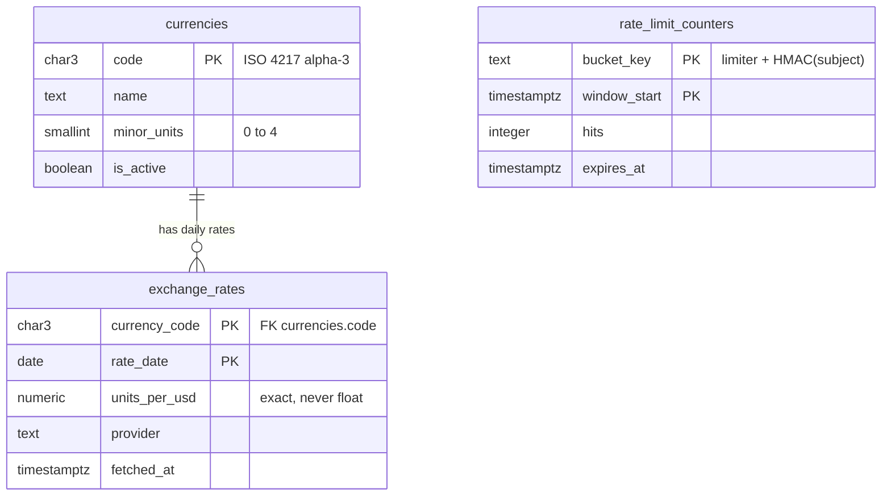
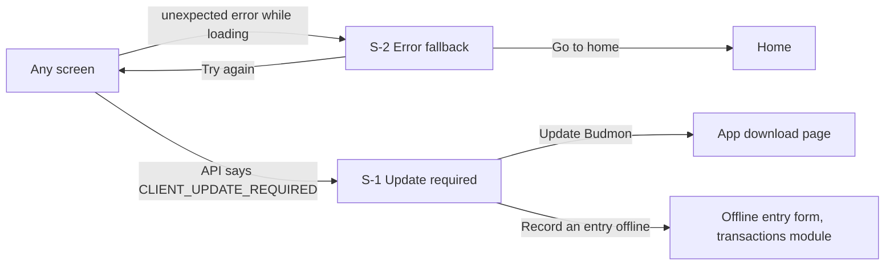
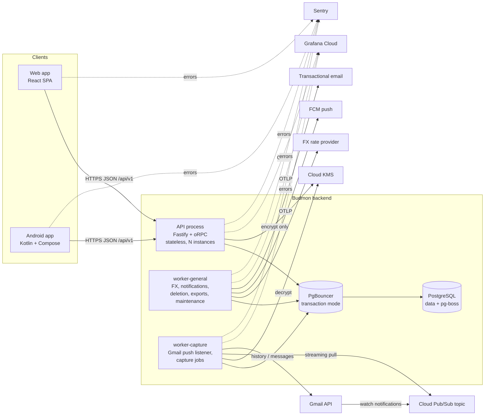
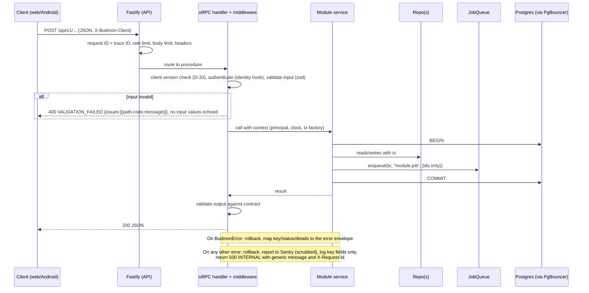
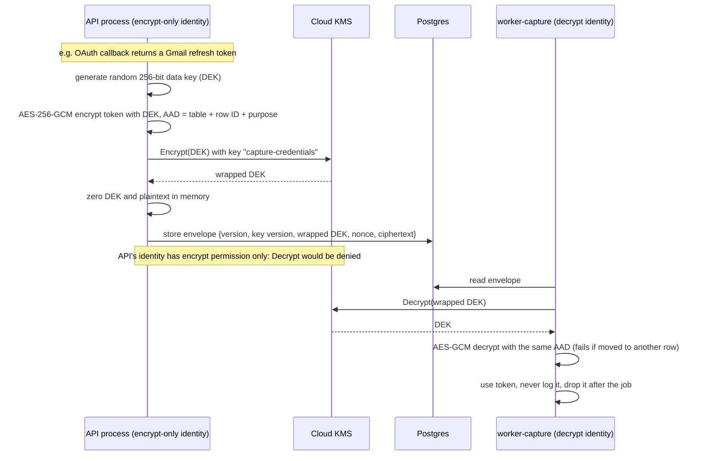
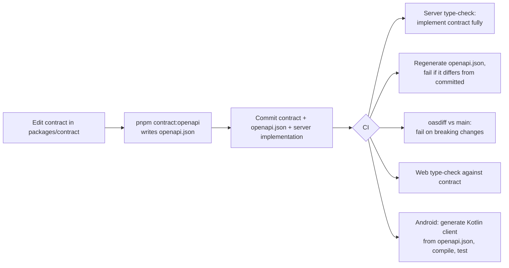

# Platform: High-Level Design

The technical base every other Budmon module builds on: repository layout, the API contract and generated clients, worker processes and the job queue, configuration and secrets, credential encryption, data access, migrations and the money type, the error model, observability, the security baseline, test tooling, CI, local development, hosting and backups, and the clean-up of the current repo.

Sources: [spec summary](../../product/spec-summary.md) v0.9 §4.14 (`PLT`), §3 (XC-n), §5 to §7; the user's [platform decisions](../../product/notes/2026-10-05-platform-decisions.md) (cited as **PD**); the [codebase review](../../product/codebase-review.md) (cited as **CR**); the [project brief](../../product/project-brief.md).

## Changelog

| Version | Date       | Change        |
| ------- | ---------- | ------------- |
| 0.1     | 2026-10-05 | Initial draft |

## 1. Context and requirements

### 1.1 Requirements

Stories PLT-US-1 to PLT-US-15 and business rules PLT-BR-1 to PLT-BR-8 (spec §4.14), plus the cross-cutting requirements the platform has to make possible:

| Requirement | What the platform must provide |
| ----------- | ------------------------------ |
| XC-1, XC-2, XC-3, PLT-BR-3 | One exact money type (64-bit integer minor units plus the currency's decimals), currency reference data, daily market rates and a conversion function. |
| XC-5, XC-6 | Conventions and helpers for instants, calendar dates and IANA time zones. |
| XC-9 to XC-16, PLT-BR-1, PLT-BR-2 | Credential encryption that only the capture worker can undo; observability that never carries amounts, payees, message content or tokens; job payloads that never carry them either; hard deletion as the default so erasure (XC-16) is real; backups whose retention is stated. |
| XC-17 | Background jobs for exports (the export itself is `identity`'s). |
| XC-19 to XC-22 | A monorepo with backend, web app and native Android app; client-generated IDs so Android can create entries offline (XC-22, TXN-US-10). |
| XC-25 to XC-28 | Scheduled and queued work in workers (reminders, push and email delivery are `notifications`' and `identity`'s). |
| XC-29 to XC-31 | Gmail push ingestion path; best-effort availability (P9) with alerting. |
| IDN-BR-3, §6 (Gmail testing mode) | Nothing that hard-wires invite-only: the platform is designed for public scale (PD "Scale target") but deploys small. |

### 1.2 Goals

- Every module is built the same way, in a predictable place, against a contract that the web and Android apps can't drift from.
- Privacy rules (PLT-BR-1, PLT-BR-2) are enforced by construction and by automated tests, not only by guidelines.
- A fresh checkout plus one documented command runs the whole stack; one command runs every check.
- Launch cheaply for an invited group; scale out (more API instances, more workers, bigger database) without redesign.
- The repo starts from a sound base: the current broken and unsafe code is removed in the first slice (PLT-US-14).

### 1.3 Non-goals

- Any module's own features, tables or screens, including sign-in, sessions and tokens (`identity`).
- Redis, Kubernetes, microservices, GraphQL, a service mesh or a message broker other than pg-boss.
- WebSockets or server-sent events in the MVP (see §5.2).
- Postgres row-level security in the MVP (D-23).
- Exporting client-side (browser or Android) traces to Grafana in the MVP (D-24).
- Multi-region deployment, high availability beyond the hosting provider's defaults, and an SLA (P9: best effort).
- An operations UI inside Budmon. The product owner's error and health views are Sentry and Grafana (spec P22: an in-app error/health view comes later).
- A feature-flag service. Per-user feature switches are `admin`'s (ADM-US-7) and live in its tables.

## 2. Actors and stories

Actors: **developer or agent** (builds Budmon), **product owner** (operates it), **end user** (sees the platform only through what it protects and how reliably the apps work), and **system actors**: the API process, the capture worker, the general worker, the CI pipeline.

The HLD keeps the spec's story IDs so traceability is one-to-one. Each becomes an LLD slice, except that **US-14 (clean-up) is delivered inside the first slice together with US-1** (decided, spec §7 item 4).

| ID | Spec | Story |
| -- | ---- | ----- |
| US-1 | PLT-US-1 | As a developer or agent, I want one repository holding backend, web app, Android app and the shared contract in a documented layout, so every module is built the same way. |
| US-2 | PLT-US-2 | As a developer or agent, I want to start the whole stack locally with one documented command, so anyone can run and test Budmon from a fresh checkout. |
| US-3 | PLT-US-3 | As a developer or agent, I want the API defined as a contract first, with OpenAPI published from it and clients generated from it, so the apps can't drift from the backend. |
| US-4 | PLT-US-4 | As a developer or agent, I want background work in separate worker processes through a job queue, so slow or scheduled work never slows the API and jobs aren't lost. |
| US-5 | PLT-US-5 | As a developer or agent, I want configuration validated when each process starts, so a misconfigured process fails immediately and clearly. |
| US-6 | PLT-US-6 | As an end user, I want the credentials Budmon holds for me encrypted and usable only by the part of Budmon that needs them, so a database or API leak doesn't expose my inbox. |
| US-7 | PLT-US-7 | As a developer or agent, I want schema changes only through generated, committed migrations applied the same way everywhere, so the schema can evolve once real data exists. |
| US-8 | PLT-US-8 | As a developer or agent, I want one shared money type and helpers (including conversion at market rates), so every module stores, adds and displays amounts exactly. |
| US-9 | PLT-US-9 | As a client developer and end user, I want one error model across the API, so apps show the right message and nothing internal leaks. |
| US-10 | PLT-US-10 | As the product owner, I want errors from backend, web and Android in one place without users' financial data, so I can fix problems fast without breaking the privacy promise. |
| US-11 | PLT-US-11 | As the product owner, I want dashboards and alerts for the API and workers, including whether Gmail push is arriving, so I notice when capture stops before users do. |
| US-12 | PLT-US-12 | As a developer or agent, I want automated checks on every change, so broken code doesn't reach the main branch. |
| US-13 | PLT-US-13 | As an end user, I want basic protection against abuse (rate limits, CORS, security headers, size limits), so my account can't be brute-forced and the API isn't trivially attacked. |
| US-14 | PLT-US-14 | As a developer or agent, I want the current repo cleaned up per the codebase review inside the first slice, so the first module starts from a sound base. |
| US-15 | PLT-US-15 | As an end user and product owner, I want my data backed up, so a server failure doesn't lose my financial history. |

Business rules carried through: PLT-BR-1 (D-24, §7.5), PLT-BR-2 (D-19), PLT-BR-3 (D-14), PLT-BR-4 (D-4, D-6), PLT-BR-5 (D-12), PLT-BR-6 (D-9), PLT-BR-7 (D-25), PLT-BR-8 (D-21).

## 3. Data model

The platform owns very little data. It owns the currency reference data and market rates (D-15), the queue's tables (D-9), the migrations journal (D-12) and the rate-limit counters (D-22). It **removes** the existing `users`, `accounts`, `accountOwners` and `refreshTokens` tables from the codebase: the database is disposable (spec §7 item 1) and `identity` and `accounts` design their own tables fresh (spec §7 item 2).

### 3.1 Tables

| Table | New / changed | Purpose | Key columns | Relationships |
| ----- | ------------- | ------- | ----------- | ------------- |
| `currencies` | Changed (replaces the current table and the `CURRENCY` enum) | ISO 4217 reference data; the source of each currency's number of decimals (XC-1). | `code` (ISO 4217 alpha-3, primary key), `name`, `minor_units` (0 to 4, from ISO 4217), `is_active` (withdrawn currencies such as EEK or HRK are inactive: kept for history, hidden from pickers). | Referenced by `exchange_rates`; later by accounts (account currency), users (base currency) and any table holding money. |
| `exchange_rates` | New | Daily market rates (XC-3), stored against one pivot currency (USD) so any cross rate can be derived. | (`currency_code`, `rate_date`) primary key; `units_per_usd` (exact `numeric`); `provider`; `fetched_at`. | `currency_code` → `currencies.code`. |
| `rate_limit_counters` | New (`UNLOGGED`) | Shared fixed-window counters for sensitive endpoints, so limits hold across stateless API instances (D-22). | (`bucket_key`, `window_start`) primary key; `hits`; `expires_at`. `bucket_key` is the limiter name plus an **HMAC** of the subject (IP address or email), never the raw value. | None. |
| `pgboss.*` (schema) | New | pg-boss's own job, schedule and archive tables. | Managed by pg-boss; created and upgraded through our committed migrations, not by pg-boss at start-up (D-12). | Job payloads reference other tables' IDs only, never by foreign key. |
| `drizzle.__drizzle_migrations` | New | The applied-migrations journal. | Managed by Drizzle's migrator. | None. |
| `users`, `accounts`, `accountOwners`, `refreshTokens` | **Removed** | Replaced by `identity` and `accounts` designs (spec §7). | | |

Conventions every module's tables follow (decided here, detailed in the LLD):

- **Names:** `snake_case`, plural table names (D-12).
- **Primary keys:** UUIDv7 (D-13), except reference tables with a natural key (`currencies.code`).
- **Money columns:** `bigint` minor units plus a `currency_code` column (or a currency fixed by a parent row, such as the account's), never `numeric`, `real` or `double precision` (D-14).
- **Time columns:** `timestamptz` for instants, `date` for calendar dates, `text` IANA zone names; never `timestamp without time zone` (D-16).
- **Every table** has `created_at` and `updated_at` (`timestamptz`, set by the database); author columns where a story needs them (for example ACC-US-7).
- **Every foreign key** states its `onDelete` behaviour explicitly in the LLD that creates it (D-17).
- **Sealed secrets** (D-19) are stored in the owning module's own table as one `bytea` column holding a versioned envelope; there's no central secrets table.

### 3.2 Entity-relationship diagram



### 3.3 Data lifecycle

- **`currencies`:** seeded by a migration from ISO 4217; never deleted (`is_active = false` instead). A currency's `minor_units` never changes in place: if ISO ever changes it, that's a deliberate data migration that rescales every stored amount in that currency.
- **`exchange_rates`:** append-only, one row per currency per day; kept indefinitely (small: about 170 currencies × 365 days ≈ 62k rows a year). A re-fetch of the same day overwrites that day's row (upsert); rates aren't financial records of any user.
- **`rate_limit_counters`:** `UNLOGGED` (lost on a database crash, which only resets limits); rows past `expires_at` are deleted by a platform maintenance job every 10 minutes.
- **Jobs:** completed jobs are kept 1 day, failed jobs 30 days for inspection (PLT-US-4), then deleted by pg-boss maintenance. Payloads never hold sensitive data (D-10), so retention isn't a privacy concern.
- **Deletion convention for all modules (D-17):** hard delete is the default, so erasure (XC-16) actually removes data. Lifecycle states (archived, frozen, pending deletion) are explicit status columns, not a generic `deleted_at`. Soft delete is used only where a story requires restoring (for example REV-US-4), always with a purge job that hard-deletes after the stated window.
- **Backups (D-30):** daily, 14-day retention, plus point-in-time recovery for 7 days (proposed; needs user confirmation, Q-1). Erasures are re-applied after any restore.

## 4. User experience

The platform has almost no screens of its own. What applies is: how unexpected errors, rate limits, offline state and app updates look to the end user, which every module's screens reuse; and how the product owner sees errors and health, which is in external tools (Sentry, Grafana), not in Budmon.

Budmon has no design language yet: `docs/design/ux-guidelines.md` doesn't exist and XC-24 (proposal P8: English first, WCAG 2.2 AA, Android accessibility guidelines, a calm and plain tone) is still open. The conventions below follow P8 provisionally and are listed as open question Q-7.

### 4.1 User journeys

**J-1 Something goes wrong on Budmon's side (US-9, US-10).** An end user does anything (saves a transaction, opens a list). The server hits an unexpected error. The user sees, in place of the result, "Something went wrong on our side. Nothing was changed. Try again in a moment." with a **Try again** button and a small "Reference: 4bf92f35" line (the first 8 characters of the request ID). Their form input is kept. If they contact the product owner with the reference, the owner finds the exact error in Sentry and the trace in Grafana. The error report contains the reference, the user's internal ID and the code location, never what they typed.
- *Goes wrong:* retrying fails again: same message, same button; nothing is lost. A screen-level failure while loading shows the full-screen fallback (§4.2, S-2).
- *"Nothing was changed"* is only true because every mutation runs in one transaction (D-10, §7.3); when a mutation's outcome is unknown (timeout after sending), the message is instead "We couldn't confirm this was saved. Check before trying again." and the Android offline queue retries safely because creates are idempotent (D-13).

**J-2 Invalid input (US-9).** The user submits a form with a value the server rejects. The field is outlined, an icon and message appear under it (for example "Enter an amount greater than 0"), focus moves to the first invalid field, and a screen reader announces the error. The client maps the error's field paths to its fields. Client-side validation catches most of these first using the same rules from the contract's schemas (D-6).
- *Goes wrong:* a field the form doesn't show is rejected: the message appears at the top of the form ("Something in this form isn't valid: <field label>").

**J-3 Too many attempts (US-13).** The user (or an attacker) repeats a sensitive action, such as signing in with a wrong password, too often. The form shows "Too many attempts. Try again in 10 minutes." with the wait computed from the server's `Retry-After`, and the submit button is disabled until then (the countdown is in text, not only a timer graphic).

**J-4 Offline on Android (XC-22; shared conventions that `transactions` uses for TXN-US-10).** The phone loses its connection. A slim banner appears at the top: "You're offline. New entries are saved on this phone and sync when you're back online." Screens that need the network show their last loaded data marked "Offline: last updated 14:02" and disable actions that need the server, explaining why on tap. New transactions and transfers can still be recorded (owned by `transactions`, TXN-US-10). Each such entry shows a "Not yet synced" chip (icon + text). A global sync indicator in the app bar shows "3 waiting to sync". When back online, the banner reads "Back online. Syncing 3 entries…" then disappears; chips disappear as entries sync.
- *Goes wrong:* the server rejects a synced entry (for example the account was archived or the user lost their role): the entry stays on the phone marked "Couldn't sync: tap to fix", and the app bar indicator turns into "1 entry needs attention". Nothing is silently dropped. (Whether offline entries count in on-device balances is P6, owned by `transactions`.)

**J-5 App update (Android, US-3's API evolution policy).** When a newer Android build is available, a dismissible card on the home screen says "A new version of Budmon is available." with **Update** and **Later**. "Later" hides it for 3 days. When the installed build is below the minimum the API still supports (D-33), the API answers every request with `CLIENT_UPDATE_REQUIRED`, and the app shows the full-screen **Update required** screen (§4.2, S-1). It explicitly reassures: "Entries you saved offline are kept and will sync after you update." Recording new offline entries stays possible from that screen's "Record an entry offline" link, because the local queue survives updates.
- *Goes wrong:* the download link fails: "Couldn't open the download. Ask the person who invited you for the latest version." (distribution is invite-only, Q-8).

**J-6 Web app update.** After a new web release, the open web app notices (it checks the deployed version on window focus and every 30 minutes) and shows a non-blocking toast: "Budmon has been updated. Reload to get the latest version." with **Reload**. It never reloads by itself, so unsaved form input isn't lost. If the API reports `CLIENT_UPDATE_REQUIRED` to the web app (a breaking change shipped), the toast becomes a persistent banner with the same button.

**J-7 Budmon is down or in maintenance.** The API is unreachable or answers 503. Web and Android show "Budmon is temporarily unavailable. Try again in a few minutes." Android keeps recording offline entries. There's no status page in the MVP.

**J-8 The product owner is alerted (US-10, US-11).** Something breaks (the API stops answering, a worker stops, Gmail notifications back up, jobs start failing). The owner gets an email from Grafana Cloud within about 5 to 15 minutes: subject "[Budmon] Capture worker down", body with what's wrong, since when, and links to the dashboard and to the matching Sentry issues. They open the Grafana dashboard (request rate, error rate, latency, queue depth, failed jobs, Gmail push activity) and Sentry (grouped errors with stack traces, release, internal user ID, request ID). None of these show amounts, payees, message content or tokens. When the problem clears, a "Resolved" email follows. First-time experience: right after the first deploy, every dashboard panel shows "No data" until traffic arrives; the synthetic health check starts producing data within 5 minutes, which proves the pipeline works.
- *Goes wrong:* the monitoring itself fails (Grafana Cloud down, free-tier limit hit): alerts can't fire. Mitigation: a second, independent uptime check (D-25) and a monthly glance at usage against free-tier limits.

### 4.2 Screens

| Screen | Purpose | Information hierarchy (first → last) | Primary action | Other actions |
| ------ | ------- | ------------------------------------ | -------------- | ------------- |
| S-1 Update required (Android) | Block use of an app version the API no longer supports, without losing offline entries. | What happened and that it's safe → why → how many offline entries are kept → download | **Update Budmon** | Record an entry offline |
| S-2 Error fallback (web and Android) | Replace a screen that failed to load or crashed. | What happened → that nothing was lost → what to do → reference | **Try again** | Go to home |

Shared components, used inside every module's screens:

| Component | Purpose | Behaviour |
| --------- | ------- | --------- |
| C-1 Offline banner (Android; the web app shows the same text without the offline-entry sentence) | Tell the user they're offline and what still works. | Appears when connectivity is lost, replaced by "Back online…" for 3 seconds when it returns. |
| C-2 Sync indicator and "Not yet synced" chip (Android) | Show pending and failed offline entries. | App-bar indicator with a count; chip on each pending entry; tapping a failed one opens it with the server's error. |
| C-3 Error message patterns | One look for every module's errors. | Inline field error (icon + text under the field), form-level summary at the top of a form, toast for background failures, full-screen fallback (S-2) for screens that can't load. |
| C-4 Update card (Android) and toast (web) | Announce a new version. | J-5 and J-6. |

S-1 Update required (Android):

```
+----------------------------------+
|                                  |
|        [ update icon ]           |
|                                  |
|  Update Budmon to continue       |
|                                  |
|  This version is no longer       |
|  supported. Updating takes about |
|  a minute.                       |
|                                  |
|  (i) 3 entries you saved offline |
|      are kept and will sync      |
|      after you update.           |
|                                  |
|  [       Update Budmon        ]  |
|                                  |
|     Record an entry offline      |
+----------------------------------+
```

S-2 Error fallback (both apps; web shown):

```
+----------------------------------------------+
| Budmon                          [nav ...]    |
|----------------------------------------------|
|                                              |
|   Something went wrong on our side           |
|                                              |
|   Nothing was changed. Try again in a        |
|   moment. If it keeps happening, share this  |
|   reference with the person who invited you. |
|                                              |
|   [ Try again ]   Go to home                 |
|                                              |
|   Reference: 4bf92f35                        |
+----------------------------------------------+
```

C-1 and C-2 on Android:

```
+----------------------------------+
| (!) You're offline. New entries  |
|     are saved on this phone.     |
|----------------------------------|
| Transactions      [⟳ 3 waiting]  |
|                                  |
|  Coffee         25.00 EGP        |
|  Today · Cash   [⟳ Not yet synced]|
|  Groceries     412.50 EGP        |
|  Yesterday · Bank                |
+----------------------------------+
```

### 4.3 Navigation

The platform adds no navigation destinations of its own. The update-required and error screens sit in front of any screen:



### 4.4 States

| Screen | Empty | Loading | Error | Partial / a lot of data |
| ------ | ----- | ------- | ----- | ----------------------- |
| S-1 Update required | No offline entries: the "(i) entries kept" line is hidden. | Not applicable (shown from local state). | Download link fails: inline message, J-5. | 1,000+ offline entries: "1,000+ entries you saved offline are kept". |
| S-2 Error fallback | Not applicable. | **Try again** shows a spinner in the button and keeps the message. | Retry fails: the same screen stays, with "Still not working." added. | Not applicable. |
| C-2 Sync indicator | Hidden when nothing is pending. | "Syncing 3…" with a progress icon (not colour only). | "1 entry needs attention". | "99+ waiting". |
| Product-owner dashboards (Grafana) | "No data" until traffic; the synthetic check fills within 5 minutes. | Grafana's own. | Grafana's own. | Metric labels are bounded (D-25), so panels don't explode with series. |

### 4.5 Interaction and feedback

- **Error mapping** is by stable error key, never by parsing messages (D-21). Each client has one table mapping keys to wording; unknown keys fall back to the generic message.
- **Validation errors** are shown inline on submit, and as the user leaves a field when the client already knows the rule from the contract's schema. Server-side validation errors map back to fields by path.
- **Mutations** show progress on the button that triggered them and update the screen after the server confirms. Optimistic updates are a per-module choice; when used, a failure rolls back the change and shows a toast with the error's wording. Offline entries on Android are the exception: they appear immediately with "Not yet synced".
- **Retries:** the generic error offers **Try again**. Clients automatically retry only idempotent reads and offline-queue creates (D-13), with backoff; they never auto-retry other mutations.
- **Every server error response carries a request ID** (`X-Request-Id`); clients show its first 8 characters as "Reference" on generic errors only.
- **Confirmation and undo** are per module; the platform adds none.

### 4.6 Effort on frequent tasks

The frequent tasks (recording a transaction, reviewing a capture, checking a balance) belong to other modules. The platform's job is not to add steps or latency to them:
- Update prompts never interrupt a task: the soft prompt is a dismissible card on home, and the hard block happens only below the minimum supported version (D-33).
- Offline entry is never blocked by the platform, not even by the update-required screen.
- Latency targets the platform sets for every module (D-25): API p95 under 300 ms for single-item reads and writes, under 800 ms for list and aggregate reads, measured server-side.

### 4.7 Presentation of data

Platform-wide conventions, implemented once in the shared money and time helpers (D-14, D-16) and in Android's equivalent, checked against shared test vectors so both apps agree:

- **Money:** formatted with the user's locale and the currency's ISO code or symbol through `Intl.NumberFormat` (web) and ICU (Android), but always with **the currency's `minor_units` from Budmon's `currencies` table** as the number of decimals, overriding the platform library's default (for example "1,234.50 EGP", "1,234 JPY", "1.234 KWD"). All decimals are always shown ("12.50", not "12.5"). The helper supports showing a sign (`−12.50`) or not; whether a module shows a minus sign or colours an amount is its own UX choice, and colour is never the only cue.
- **Dates:** calendar dates are shown in the user's locale and are never shifted by time zone (a transaction dated 5 October stays 5 October). Instants are shown in the user's time zone (XC-5). Relative times ("2 hours ago") are only for recent instants under 7 days; older ones show the date.
- **Large numbers** don't abbreviate in money fields (no "1.2M" for balances); reports may abbreviate axis labels.

### 4.8 Platform and accessibility

- **Web:** current evergreen browsers (Chrome, Edge, Firefox, Safari, last 2 versions); responsive from 360 px wide to desktop. The platform's components meet WCAG 2.2 AA (P8, provisional): banners use `role="status"` with `aria-live="polite"`, error summaries `role="alert"`, focus moves to the error summary or the first invalid field on submit, contrast at least 4.5:1, all actions keyboard-reachable. Automated accessibility checks (axe) run in the web end-to-end tests (D-26).
- **Android:** Android 8.0 (API 26) and later (assumption A-6), phones first; Material 3 with dynamic type (font scaling to 200% without clipping), TalkBack labels on every icon (the sync chip reads "Not yet synced"), touch targets at least 48 dp, and no meaning conveyed by colour alone (icons plus text).

### 4.9 Wording

Plain, calm, never blaming the user (P8). Key strings (English; clients hold them in message catalogs so other languages can follow):

| Where | Text |
| ----- | ---- |
| Generic error (`INTERNAL`) | "Something went wrong on our side. Nothing was changed. Try again in a moment." |
| Outcome unknown (timeout after sending) | "We couldn't confirm this was saved. Check before trying again." |
| Reference line | "Reference: {first 8 characters of request ID}" |
| Validation, form level (`VALIDATION_FAILED`) | "Some details need fixing." (each field shows its own message) |
| Rate limited (`RATE_LIMITED`) | "Too many attempts. Try again in {n} minutes." |
| Unavailable (`SERVICE_UNAVAILABLE`, network failure) | "Budmon is temporarily unavailable. Try again in a few minutes." |
| Not found (`NOT_FOUND`) | "This item doesn't exist or you no longer have access to it." |
| Forbidden (`FORBIDDEN`) | "You don't have permission to do this." |
| Offline banner | "You're offline. New entries are saved on this phone and sync when you're back online." |
| Back online | "Back online. Syncing {n} entries…" |
| Chip | "Not yet synced" / "Couldn't sync: tap to fix" |
| Update card | "A new version of Budmon is available." Buttons: "Update", "Later" |
| Update required | Title "Update Budmon to continue"; body "This version is no longer supported. Updating takes about a minute."; note "{n} entries you saved offline are kept and will sync after you update."; button "Update Budmon"; link "Record an entry offline" |
| Web update toast | "Budmon has been updated. Reload to get the latest version." Button "Reload" |
| Alert email subject | "[Budmon] {alert name}" and "[Budmon] Resolved: {alert name}" |

`NOT_FOUND` deliberately doesn't distinguish "doesn't exist" from "not yours" (§7.1).

## 5. Interfaces, protocols and integrations

### 5.1 Process and component overview



### 5.2 Client ↔ API: one HTTP JSON surface defined by the oRPC contract (D-4, D-6)

- **Transport:** HTTPS, JSON, REST-style paths under `/api/v1`, generated from the oRPC contract by oRPC's OpenAPI handler mounted in Fastify. The **web app** calls it with oRPC's `OpenAPILink` driven by the same contract (fully typed, no hand-written client); the **Android app** calls it through a Kotlin client generated from the published `openapi.json`. Both clients hit the same routes, so the one surface that's tested is the one both apps use.
- **Auth transport** (bearer token vs cookie) is `identity`'s decision. The platform supports both: an auth hook in the oRPC context, `@fastify/cookie`, and CORS that allows credentials for the exact web origin.
- **Errors:** oRPC's error envelope, with Budmon keys as codes (D-21).
- **Real-time:** none in the MVP. The web app refetches on focus and after mutations; Android receives push through FCM (`notifications`). Rationale: no story needs sub-second updates; SSE or WebSockets would add sticky connections to a stateless API. oRPC supports event streams if a later story needs them.
- **Non-contract routes:** `GET /health/live` (process up) and `GET /health/ready` (database reachable), plain Fastify routes, excluded from OpenAPI, unauthenticated, returning no internals. `GET /api/v1/meta/client-config` (in the contract) returns the minimum supported and latest client versions (D-33).
- **Client identification:** both apps send `X-Budmon-Client: android/<versionCode>` or `web/<build id>`; the API uses it only for D-33 and as a low-cardinality metric label (`client_kind`).

### 5.3 Jobs and workers (D-9, D-10)

- **pg-boss** in the same Postgres. Modules use it only through the platform's `JobQueue` interface: define a job (name `<module>.<job>`, a zod payload schema, the worker role that runs it, retry policy), enqueue it inside a database transaction, or schedule it with cron.
- **Two worker roles from one codebase**, each a separately deployed process (PLT-BR-6):
  - **worker-capture**: the only process with permission to decrypt credentials (PLT-BR-2). Runs the Gmail Pub/Sub listener and every job that needs a user's credentials or raw message content (owned by `sources` and `capture`).
  - **worker-general**: everything else: FX rate fetching (platform), notification and reminder delivery (`notifications`), deletion after the grace period and exports (`identity`), reconciliation of derived values (`accounts`, `budgets`), and platform maintenance.
  - Both roles can run as one process in local development (`WORKER_ROLES=capture,general`); in deployed environments they're separate, so the decrypt permission stays isolated.
- **Inbound data that arrives through the API** (for example SMS content uploaded by the Android app, or an OAuth callback) is only validated, sealed with the capture key when sensitive, stored, and enqueued by the API; all processing happens in a worker (assumption A-1).

### 5.4 Integrations

| Integration | Used for | Owner | Failure modes and behaviour |
| ----------- | -------- | ----- | --------------------------- |
| Google Cloud KMS | Wrapping data keys for sealed credentials (D-19). | platform | **Down or slow:** sealing fails, so the API rejects connecting a source with `SERVICE_UNAVAILABLE` (the user retries); unsealing fails, so capture jobs retry with backoff (up to about 1 hour) and then fail into the inspectable failed state; nothing is lost because the Gmail history ID isn't advanced until a sync succeeds. **Key disabled or permission removed:** same as down, plus an alert. Timeout 5 s per call. |
| Google Cloud Pub/Sub (pull subscription) | Gmail `watch` notifications (PD). | platform provides the listener host; `sources`/`capture` own the handling | **Listener down:** notifications accumulate in the subscription (retained 7 days) and are processed on restart; an alert fires when the oldest unacknowledged message is older than 15 minutes. **Notification lost or watch expired:** a periodic safety-net sync per mailbox (frequency is `sources`' decision) catches up from the last history ID. Notifications contain only an email address and a history ID, never content. |
| Gmail API | Reading in-scope messages. | `sources`, `capture` | Designed in those modules. Platform constraint: runs only in worker-capture. |
| FX rate provider | Daily market rates (XC-3). | platform (D-15) | **Down:** the daily job retries with backoff for up to 6 hours; conversions keep using the latest stored rate on or before the date (D-15), so nothing blocks; an alert fires if no new rates for 36 hours. **Bad data** (missing currency, zero or negative rate): the row is rejected and logged by currency code; the previous rate stays. Provider choice is open (Q-5). |
| Firebase Cloud Messaging | Android push. | `notifications` | Designed there; runs in worker-general. |
| Transactional email | Invitations, password reset, deletion notices (XC-27). | `identity` / `notifications` | Designed there; runs in worker-general through a provider adapter with a fake for tests. |
| Sentry | Error reports from all three apps (PD). | platform | **Down or quota reached** (free plan): reports are dropped client-side after the SDK's buffer; the app is unaffected. Errors are still in logs (Grafana). |
| Grafana Cloud (OTLP) | Traces, metrics, logs, alerting, synthetic check (PD). | platform | **Down:** exporters drop data after a bounded in-memory queue (never blocking requests). Logs still go to stdout and the host's log viewer. Free-tier limits are watched monthly. |
| Secret store (Google Secret Manager) | Production secrets injected as environment variables (D-20). | platform | Read only at deploy/start; a missing secret fails startup (D-20). |
| App distribution (Firebase App Distribution, Q-8) | Android builds for the invited group. | platform | Download failure handled in J-5. |

## 6. Key flows

**F-1 A request, from client to database and back, including both error paths.**



**F-2 Transactional enqueue, processing, retry and failure.**

```mermaid
sequenceDiagram
  participant S as Service (API or worker)
  participant DB as Postgres
  participant W as Worker (role that owns the queue)
  participant H as Job handler
  S->>DB: BEGIN; write domain rows; INSERT pgboss job (same tx); COMMIT
  Note over S,DB: Rollback removes the job too: no job without its change, no change without its job
  W->>DB: fetch next job (SKIP LOCKED)
  W->>H: handle(payload validated by zod)
  alt success
    H->>DB: domain writes (own tx), idempotent by design
    W->>DB: complete job
  else throws
    W->>DB: fail attempt; retry later with exponential backoff
    Note over W,DB: After retryLimit, job stays "failed" for 30 days; metric jobs_failed_total increments;<br/>alert on capture queues; owner can retry with a CLI command
  end
```

**F-3 Sealing and opening a credential (D-19).**



**F-4 Gmail push into a capture job.**

```mermaid
sequenceDiagram
  participant G as Gmail
  participant PS as Pub/Sub topic + pull subscription
  participant L as Listener (in worker-capture)
  participant DB as Postgres (pg-boss)
  participant J as capture job handler (worker-capture)
  G->>PS: {emailAddress, historyId} on mailbox change
  L->>PS: streaming pull
  PS-->>L: notification
  L->>DB: enqueue "capture.gmail-sync" {connectionId} with singleton key = connectionId
  L->>PS: ack (only after the enqueue committed)
  DB-->>J: job
  J->>G: history.list since stored historyId (token opened per F-3)
  J->>DB: write captured transactions, advance historyId (same tx)
  Note over L,PS: If the listener crashes before ack, Pub/Sub redelivers;<br/>the singleton key collapses duplicates. Metric gmail_push_received_total.
```

**F-5 Contract change to clients (D-6).**



**F-6 Daily FX rates.**

```mermaid
sequenceDiagram
  participant Cron as pg-boss schedule (UTC 00:30)
  participant WG as worker-general
  participant P as FX provider
  participant DB as Postgres
  Cron->>WG: platform.fx-rates-fetch {date}
  WG->>P: latest rates (USD base), timeout 10 s
  alt ok
    WG->>WG: validate (positive, known currencies), parse as exact decimals
    WG->>DB: upsert exchange_rates for date; metric fx_rates_fetched_total
  else fails
    WG->>DB: retry with backoff, up to 6 hours
  end
```

## 7. Cross-cutting concerns

### 7.1 Authorization

- **The platform provides the plumbing; modules decide the rules.** Every procedure is built from one of three bases: `publicProcedure` (explicit allowlist only: health is outside the contract; in the contract only sign-up/sign-in-type procedures, client config and similar), `authedProcedure` (requires a principal from `identity`'s authentication hook), and `ownerProcedure` (requires the product-owner role, for `admin`). Resource-level checks (for example "is this user an admin of this account?") live in each module's service.
- **Default deny, tested:** an automated test enumerates every procedure in the contract and calls it without credentials; anything not on the public allowlist must return `UNAUTHENTICATED` (401). This is the structural fix for the unauthenticated `GET /users` (CR X-1).
- **Not found vs forbidden:** reading another user's resource returns `NOT_FOUND` (404), not `FORBIDDEN`, so IDs can't be probed (XC-15, ACC-BR-4). `FORBIDDEN` (403) is for resources the caller can see but can't change (for example a viewer editing an entry, ACC-BR-2).
- **Workers** act as the system, with the user or account ID in the job payload; handlers re-read current state (for example that the source is still connected, the account not frozen) instead of trusting the payload.
- **Database roles (least privilege):** `budmon_migrator` owns the schema and is the only role that runs DDL (used by the migration step); `budmon_app` (API and workers) gets DML only. Separate identities for API and workers aren't needed at the database level because sealed credentials are useless without KMS decrypt permission.
- **Row-level security** isn't used in the MVP (D-23).

### 7.2 Money and currency

- **Storage:** `bigint` minor units plus the currency code; the number of decimals comes from `currencies.minor_units` (D-14, PLT-BR-3).
- **In TypeScript:** a `Money` value `{ minor: bigint, currency: CurrencyCode }`; arithmetic only through helpers that reject mixed currencies; no `number` arithmetic on money, ever. ESLint rules ban `parseFloat`, `Number(...)` and `bigint({ mode: "number" })` in money code paths (LLD lists the exact rules).
- **On the wire:** JSON integers in minor units, limited to ±(2^53 − 1) so JavaScript clients parse them exactly; `int64` in OpenAPI, `Long` in Kotlin; out-of-range input returns `VALIDATION_FAILED` (D-14).
- **Rounding:** only three operations produce fractions: currency conversion, percentages (budgets) and allocation. Conversion and percentages compute exactly with rational bigint arithmetic and round once, at the end, half-to-even. Allocation (splitting an amount into parts) uses the largest-remainder method so the parts sum exactly to the whole (TXN-BR-2).
- **Multi-currency and FX:** rates stored per currency against USD as exact decimals (D-15). Cross rates are derived (`rate(A→B) = units_per_usd(B) / units_per_usd(A)`) and applied with exact arithmetic. "The rate on date D" means the latest stored rate on or before D (XC-3); conversions report the rate date used so modules can show it. Applied rates on transfers are `transactions`' data (TXN-BR-7), never overwritten by market rates.
- **Formatting:** §4.7.

### 7.3 Consistency and transactions

- **Unit of work:** services open the transaction (`withTransaction`) and pass the transaction handle to every repo and to `JobQueue.enqueue`; repos never open their own. This replaces the `getInstance()` singletons that couldn't share a transaction (CR §4.1).
- **Isolation:** `READ COMMITTED` by default; modules use `SELECT … FOR UPDATE` on the rows they derive from (for example an account's balance row) or request `SERIALIZABLE` for a specific operation. The platform's `withTransaction` retries serialization failures and deadlocks (SQLSTATE 40001, 40P01) up to 3 times with jitter.
- **Jobs and data change together:** enqueue happens in the same transaction (F-2), so there's no outbox table and no lost or orphaned job.
- **At-least-once jobs:** every handler is idempotent (a re-run after a crash must not double-apply). Conventions: check state before acting, use unique constraints as guards, and record external side effects (such as "push sent") in the module's own table in the same transaction that completes the work.
- **Derived values** (balances, budget progress) are maintained incrementally in the same transaction as the change (PD "Performance"), and a scheduled reconciliation job per module recomputes from source rows, corrects any drift, and counts corrections in a metric (`reconcile_corrections_total{module}`), never logging amounts. The modules design their own; the platform provides the job pattern.
- **Idempotent creates for offline sync:** clients may supply the UUIDv7 of a new entity (D-13); a replayed create with the same ID and the same content returns the original, and with different content returns `CONFLICT`. The modules that accept offline creates (`transactions`) apply this convention.

### 7.4 Time and time zones

- **Instants** are `timestamptz` in the database, `Temporal.Instant` in TypeScript, RFC 3339 with `Z` on the wire.
- **Calendar dates** (a transaction's date, a budget period's start) are `date` in the database, `Temporal.PlainDate` in TypeScript, `YYYY-MM-DD` on the wire, `java.time.LocalDate` on Android. They're never converted through a time zone.
- **Time zones** are IANA names (`Africa/Cairo`), validated against the runtime's zone database. The user's zone lives in `identity`'s profile; changing it doesn't move stored dates (IDN-US-3).
- **"Today" and periods** are computed from the user's zone (XC-5); the platform provides `today(zone)` and period helpers through an injectable `Clock`, so tests control time.
- **Servers and cron run in UTC.** Per-user local times (quiet hours, reminder times) are computed by the owning module from the user's zone, not by cron.
- **Library:** the Temporal API through its polyfill until Node and browsers ship it natively (D-16).

### 7.5 Privacy and security

- **PLT-BR-1 enforcement** (D-24) in layers: an allowlist-only logger (only declared safe fields can be logged, by type), `Money` and other sensitive values that print as `[redacted]`, OpenTelemetry and Sentry configured to capture no bodies, query strings, headers or local variables, scrubbers on every Sentry event and breadcrumb, Postgres configured not to log parameter values, and a **privacy canary test suite** that runs real flows with canary values and fails if any canary reaches logs, spans, metrics or error reports.
- **PLT-BR-2:** envelope encryption with Cloud KMS; the API can encrypt but not decrypt; only worker-capture can decrypt (D-19).
- **Secrets** come from the environment (from Google Secret Manager in deployed environments); `.env` files only in local development; never committed (D-20).
- **Transport:** TLS for every external connection and for database connections outside the private network; HSTS on the API and web host.
- **At rest:** the database provider's disk encryption, plus application-level envelope encryption for credentials.
- **Job payloads and pg-boss tables** never contain amounts, payees, message content or tokens (D-10), so failed jobs kept for inspection aren't a leak.
- **Password and token hashing utilities** for `identity`: Argon2id for low-entropy secrets (passwords, recovery codes), HMAC-SHA-256 with a server key for high-entropy tokens (refresh, invitation, reset tokens) so they're stored as hashes, constant-time comparison, and a cryptographically random token generator (D-22). `identity` decides where to use them.
- **Abuse protection:** rate limits, CORS, security headers, body-size limits, timeouts (D-22).
- **Errors** never leak internals (PLT-BR-8, D-21).
- **Data minimisation:** date of birth is dropped (spec §7 item 3); rate-limit keys store HMACs, not IPs or emails.

### 7.6 Scale, performance and observability

- **Expected load (assumption A-4):** invite-only, up to about 100 users (Gmail testing-mode limit), roughly 100 to 300 transactions per user per month; a few requests per second at peak. Designed so public scale needs more instances and a bigger database, not a redesign: stateless API (PLT-BR-6), queue in Postgres behind an interface (PD), pooler in front of Postgres (D-18), indexes per query.
- **Indexes per query:** every module's LLD lists each query with the index that serves it; `pg_stat_statements` is enabled and its top queries are reviewed after each module ships.
- **Latency targets:** §4.6; tracked with request-duration histograms per route.
- **Observability** (D-24, D-25): OpenTelemetry traces and metrics plus pino logs from API and workers to Grafana Cloud; Sentry for errors from all three apps; W3C trace context from clients to API so a client error, its request ID, the server trace and the Sentry issue line up; email alerting.

## 8. Decisions

Decisions D-1 to D-4, the queue and worker part of D-9, D-11, the core of D-14, D-18's pooler, D-19's managed key, and D-24's tool choices were **made by the user** (PD) and are recorded here with their rationale; they aren't reopened. The rest are the planner's proposals.

### D-1: PostgreSQL as the only database (user decision, PD)
- **Options considered:** PostgreSQL; MongoDB or another document store; PostgreSQL plus a document store.
- **Decision:** PostgreSQL. Flexible data (templates, extracted fields, budget rule conditions) goes in `jsonb` columns. Major version: the current stable major at implementation time (18 or later), pinned to the same major in local, CI and production.
- **Rationale:** the domain is relational and needs multi-row transactions (splits, transfers, balances); `jsonb` covers the flexible parts; one database also hosts the job queue (D-9), so there's no extra infrastructure.

### D-2: Node.js + TypeScript (user decision, PD)
- **Options considered:** Node + TypeScript; Kotlin/JVM (shared with Android); Go.
- **Decision:** Node.js, current LTS (24.x), TypeScript in strict mode with the review's settings kept (ESM, `module: nodenext`, `.js` import suffixes, `noUncheckedIndexedAccess`, `exactOptionalPropertyTypes`, `verbatimModuleSyntax`). Production runs compiled JavaScript (`tsc -b`), development uses `tsx watch`. The Node version is pinned (`engines`, `.nvmrc`, CI, Docker image).
- **Rationale:** the workload is I/O-bound (PD); one language for backend, web and contract lets the web app use the contract's types directly; strict settings already type-check cleanly (CR §1.4).

### D-3: Fastify replaces Express (user decision, PD)
- **Options considered:** Express 5 (current), Fastify, Hono.
- **Decision:** Fastify, with `@fastify/helmet`, `@fastify/cors`, `@fastify/rate-limit`, `@fastify/cookie`. oRPC's handler is mounted as a Fastify route.
- **Rationale (PD):** built-in pino logging, plugin encapsulation per module, `app.inject()` for in-process integration tests (PLT-US-12), better typing, mature plugins and OpenTelemetry instrumentation. Speed isn't the reason. Hono's edge portability isn't needed.

### D-4: oRPC contract-first, one OpenAPI-shaped wire protocol for both clients (user decision for oRPC; planner decision for the single protocol)
- **Options considered:** (a) oRPC serving both its native RPC protocol (for the web, via `RPCLink`) and the OpenAPI protocol (for Android); (b) oRPC serving only the OpenAPI protocol, with the web using `OpenAPILink` against the contract; (c) ts-rest (rejected by the user); (d) tRPC (the current stub; superseded by the user's decision).
- **Decision:** (b). The contract (`@orpc/contract`, zod 4 schemas) lives in `packages/contract`; the server implements it with `implement(contract)`; Fastify mounts only the `OpenAPIHandler` under `/api/v1`; the web app uses `OpenAPILink` plus oRPC's TanStack Query integration. oRPC is pinned to an exact version.
- **Rationale:** with one protocol, the routes Android uses are exactly the routes the web uses and the integration tests exercise, and errors, dates and money are encoded once. What (a) would add, the RPC protocol's richer native types (`Date`, `BigInt`, `Map`), we don't want anyway, because Android needs plain JSON and money has its own wire format (D-14). Cost: we lose oRPC's RPC-only features (such as batching), which nothing needs.

### D-5: Monorepo with pnpm workspaces, no build orchestrator
- **Options considered:** (a) pnpm workspaces with plain scripts; (b) pnpm plus Turborepo or Nx for task caching; (c) separate repositories per app.
- **Decision:** (a). Layout:

  | Path | What | Package |
  | ---- | ---- | ------- |
  | `apps/server/` | API and workers (one codebase, several entry points). `src/platform/` holds the foundations (config, db, errors, observability, queue, crypto, http, money/FX service, rate limits); `src/<module>/` per spec module with `<module>Router.ts` (oRPC implementation), `<module>Service.ts`, `<module>Repo.ts`, `<module>Errors.ts`, `<module>Jobs.ts`; `src/db/schema/<table>.ts` (`<name>Table`, registered in `src/db/schema/index.ts`); `src/main/{api,worker,migrate}.ts`; `drizzle/` migrations; `test/` | `@budmon/server` |
  | `apps/web/` | React SPA (D-7) | `@budmon/web` |
  | `apps/android/` | Gradle project (D-8); not a pnpm package | (Gradle) |
  | `packages/contract/` | oRPC contract, zod schemas per module (`src/<module>/`), shared schemas (`src/common/`: money, dates, IDs, pagination, errors), and the committed `openapi.json` | `@budmon/contract` |
  | `packages/shared/` | Pure, dependency-light helpers used by server and web: money arithmetic and formatting, time helpers, ID generation; plus `test-vectors/` (JSON) that the Android tests also read | `@budmon/shared` |
  | `packages/config/` | Shared `tsconfig` bases, ESLint flat config, Prettier config | `@budmon/config` |
  | `infra/` | `compose.yaml` for local dev, Dockerfiles, infrastructure as code (D-29) | |
  | `docs/` | As today | |

  Root scripts: `pnpm dev`, `pnpm check` (everything), `pnpm test`, `pnpm db:migrate`, `pnpm db:seed`, `pnpm contract:openapi`. The review's per-module layering (router → service → repo; only repos touch the database) is kept and enforced with an ESLint import-boundary rule. Request schemas move from `<module>Validators.ts` into the contract package; server-only validators (for third-party payloads) stay in the module as `<module>Validators.ts`.
- **Rationale:** a handful of packages doesn't need a task graph; `pnpm -r` with `--filter` is enough and Turborepo can be added later without restructuring. One repo keeps the contract, server and clients changing in the same pull request, which is what makes the drift check (D-6) possible. Android stays a plain Gradle project inside the repo because pnpm can't build it, and Gradle doesn't need to know about pnpm.

### D-6: Contract → OpenAPI → clients, kept in sync by CI; additive API evolution
- **Options considered:** for the OpenAPI file: generated at build time only, or generated and committed. For the Kotlin client: committed generated code, or generated at Gradle build time. For drift: trust developers, or CI checks.
- **Decision:**
  - `pnpm contract:openapi` generates `packages/contract/openapi.json` (OpenAPI 3.1, via oRPC's OpenAPI generator and zod 4 JSON-schema conversion) and it's **committed**, so API changes are visible in review.
  - The **web** imports the contract package directly; its "generated client" is `OpenAPILink` typed from the contract, so it can't drift without failing type-checking.
  - The **Kotlin client** is generated during the Android Gradle build from the committed `openapi.json` (OpenAPI Generator, `kotlin` generator, Retrofit + kotlinx.serialization) into the build directory and is never committed or hand-edited (PLT-BR-4).
  - **CI fails if:** the server doesn't implement the contract exactly (type error from `implement(contract)`); a freshly generated `openapi.json` differs from the committed one; `oasdiff` reports a breaking change against the main branch's `openapi.json` (unless the pull request is explicitly labelled as an intentional breaking change, which also requires raising the minimum client version, D-33); the web app doesn't type-check; the Android app doesn't compile or its tests fail against the regenerated client.
  - **Runtime:** oRPC validates inputs and outputs against the contract's schemas, so the server can't return a shape the contract doesn't describe.
  - **Evolution policy:** additive changes only (new procedures, new optional fields, new enum values that clients tolerate as "unknown"). A breaking change is a new procedure plus deprecation of the old one, removed only after the minimum supported Android version no longer uses it.
- **Rationale:** each piece fails at the earliest stage that can detect it. Generating the Kotlin client at build time removes a whole class of "forgot to regenerate" drift. Breaking-change detection matters because Android installs lag behind deploys.

### D-7: Web app: React + Vite single-page app with TanStack Router and Query
- **Options considered:** (a) React + Vite SPA with TanStack Router and TanStack Query; (b) Next.js (App Router, server components); (c) SvelteKit; (d) React Router 7 in framework mode.
- **Decision:** (a), served as static files from a CDN (D-29). UI built on **React Aria Components** (accessible headless primitives) styled with **Tailwind CSS**; forms with React Hook Form and zod schemas imported from the contract; messages and number/date formatting through **FormatJS (react-intl)** catalogs from day one; Sentry browser SDK.
- **Rationale:** Budmon's web app is entirely behind sign-in, so server rendering and SEO add nothing; Next.js or SvelteKit would add a second server runtime that duplicates the API's concerns (auth, CSP, deployment) and blurs PLT-BR-6. A static SPA is cheap to host, trivially cacheable, and is what the planned Electron app (spec §5 Later) wraps. oRPC has first-class TanStack Query support. React has the deepest ecosystem for accessible components and testing. React Aria gives WCAG-grade keyboard and screen-reader behaviour (P8). Cost: no server rendering for the first paint (acceptable for a signed-in app), and an SPA's security relies on a strict CSP set by the static host.

### D-8: Android stack: Kotlin, Jetpack Compose, Room, WorkManager, generated Retrofit client
- **Options considered:** UI: Jetpack Compose vs XML Views. Local storage: Room vs SQLDelight vs DataStore. Networking: generated Retrofit/OkHttp client vs generated Ktor client (Kotlin Multiplatform-ready) vs hand-written. Architecture: single-activity MVVM vs MVI frameworks.
- **Decision:** Kotlin, **Jetpack Compose** with Material 3, single activity, MVVM (`ViewModel` + `StateFlow`), **Hilt** for dependency injection, **Room** for local data, including the offline-entry outbox (TXN-US-10), **WorkManager** for sync when connectivity returns, **OkHttp + Retrofit + kotlinx.serialization** through the generated client (D-6), Sentry Android SDK, minSdk 26, targetSdk the latest required. Debug builds point at the local API (`http://10.0.2.2:<port>` from the emulator); release builds at the deployed API.
- **Rationale:** Compose, Room and WorkManager are the current Android defaults with the best tooling and testing support; WorkManager survives process death and reboots, which offline sync needs. Retrofit is the most mature target of OpenAPI Generator's Kotlin output. Cost: when iOS arrives (later), this data layer isn't shared; Kotlin Multiplatform with Ktor and SQLDelight would allow that, but adds MVP risk for a platform that's explicitly later (XC-21). Revisit when iOS is scheduled.

### D-9: pg-boss with separate worker processes, in two roles (user decision for pg-boss and separate workers; planner decision for the roles)
- **Options considered:** queue: pg-boss (chosen by the user), BullMQ on Redis (revisit only if volume outgrows Postgres). Process split: (a) one worker process running all jobs; (b) one process per module; (c) two roles: capture and general.
- **Decision:** (c). One `worker` entry point started with `WORKER_ROLES` (`capture`, `general`, or both locally). Each job definition names its role; a worker only subscribes to its roles' queues. Scheduling uses pg-boss cron schedules (UTC), registered by the general role. Modules use only the platform's `JobQueue` interface (define, enqueue in a transaction, schedule), so pg-boss could be replaced without touching modules (PD).
- **Rationale:** PLT-BR-2 says only the capture worker can decrypt tokens. That's enforceable only if the capture worker is a separately deployed process with its own cloud identity (D-19), so (a) doesn't work. (b) multiplies deployments for no isolation benefit. Two roles give the security boundary and let capture scale separately from reminders.

### D-10: Transactional enqueue, payload rules and idempotency
- **Options considered:** enqueue after commit (risk: lost jobs); an outbox table relayed to the queue; enqueue in the same transaction (possible because pg-boss lives in the same database).
- **Decision:** enqueue in the same transaction, using pg-boss's support for running its insert through a caller-provided database executor (bound to the Drizzle transaction). Payload rules: payloads hold **only IDs, enums, dates and counts**, validated by the job's zod schema on enqueue and on receipt; never amounts, payees, message content, tokens, emails or names (sensitive inputs, such as SMS content, go into the owning module's table, sealed, and the job carries its ID). Retries: exponential backoff, default limit 5, per-job override; after the limit the job stays in the failed state for 30 days. Deduplication: optional singleton key per job. Handlers are idempotent (§7.3).
- **Rationale:** same-transaction enqueue is the simplest correct option and the main reason pg-boss was chosen (PD). The payload rule keeps pg-boss's tables (and failed jobs kept for inspection) outside PLT-BR-1's blast radius.

### D-11: Gmail push via `watch` + Pub/Sub, received by a pull subscription in worker-capture (user decision for push; planner decision for pull)
- **Options considered:** polling (rejected by the user); Pub/Sub **push** subscription to an HTTPS endpoint; Pub/Sub **pull** (streaming pull) from a worker.
- **Decision:** a pull subscription consumed by a listener inside worker-capture, which turns each notification into a deduplicated capture job (F-4) and acknowledges only after the enqueue commits. `watch` renewal and the safety-net sync are scheduled jobs whose details belong to `sources`.
- **Rationale:** a push endpoint would have to live on the API (the only public HTTP surface), which contradicts PLT-BR-6, and it would need OIDC token verification. Pull keeps ingestion in the worker, needs no public endpoint, gets redelivery for free, and its backlog is a clean "is capture alive?" signal for alerting (D-25). Cost: worker-capture must be always on (it is anyway).

### D-12: Keep Drizzle; committed SQL migrations applied by a separate step; snake_case
- **Options considered:** keep Drizzle (current); Kysely (query builder with its own migrator); Prisma; raw SQL with a migration tool (for example node-pg-migrate).
- **Decision:** keep **Drizzle ORM** with `node-postgres`. Migrations: `drizzle-kit generate` produces SQL files in `apps/server/drizzle/`, which are reviewed and committed; hand-written SQL migrations (`drizzle-kit generate --custom`) for what Drizzle can't express (triggers, the pg-boss schema, seed reference data such as `currencies`). `drizzle-kit push` is removed (PLT-BR-5). Migrations are applied by `pnpm db:migrate` (Drizzle's migrator) using the `budmon_migrator` role, as a **separate step before deploy**, never on app start-up, so several instances never race. Forward-only; breaking schema changes use expand-then-contract across releases. **pg-boss's schema** is installed and upgraded through a committed migration containing pg-boss's own SQL for the pinned version, and pg-boss starts with its automatic migration turned off, so PLT-BR-5 also covers the queue. Database identifiers become `snake_case` (Drizzle's `casing: "snake_case"`), with TypeScript properties staying camelCase. A CI check fails if the schema files and the committed migrations differ (`drizzle-kit generate` produces nothing new).
- **Rationale:** Drizzle is already in use, is SQL-shaped (so indexes and queries stay visible, which matters given "indexes will be very important"), type-safe, and supports generated migrations, check constraints and partial indexes. Prisma's engine and schema language would be a second source of truth; Kysely is comparable but would mean rewriting the existing patterns for no gain. snake_case removes the quoting burden the review noted (CR §3.5), and the database is disposable, so now is the free moment to change it.

### D-13: UUIDv7 primary keys, generated by the application (and by clients for offline creates)
- **Options considered:** integer identity (current); UUIDv4; UUIDv7; ULID; integer identity plus a separate public ID.
- **Decision:** UUIDv7 for every entity table, generated in application code through an injectable ID generator (so tests are deterministic), with the database default `uuidv7()` as a fallback where the Postgres version provides it. Clients may supply the ID of a new entity where a module allows offline creation (§7.3). Reference tables use natural keys (`currencies.code`).
- **Rationale:** offline creation on Android (XC-22) needs IDs that clients can generate without coordination, which rules out identity columns (CR §3.5). UUIDv7 is time-ordered, so B-tree inserts stay local and fast (unlike v4), and it's not sequentially guessable (though authorization never relies on that). Cost: 16 bytes instead of 4 or 8, and the ID reveals its creation time, which is acceptable.

### D-14: Money as 64-bit integer minor units; bigint in code; JSON integers on the wire (user decision for the representation; planner decision for the code and wire details)
- **Options considered:** for code: (a) JavaScript `number` restricted to safe integers; (b) `bigint` everywhere on the server and in `@budmon/shared`; (c) a decimal library. For the wire: (i) JSON integers; (ii) decimal strings ("12345").
- **Decision:** Postgres `bigint` (Drizzle `bigint({ mode: "bigint" })`); `bigint` in all TypeScript money code (b); JSON **integers** on the wire (i), limited to ±(2^53 − 1) minor units, declared as `int64` with those bounds in OpenAPI, `Long` in Kotlin. Values are converted at the contract boundary (zod transforms) so services only ever see `bigint`. Conversion, percentage and allocation helpers as in §7.2.
- **Rationale:** `bigint` makes exact FX conversion possible: multiplying a large amount by a scaled rate overflows `number`'s exact range, while `bigint` rational arithmetic is exact with one final rounding. JSON integers keep both clients simple (Kotlin `Long`, JavaScript numbers parse exactly within the limit); decimal strings would need custom mapping in the generated Kotlin client. The limit, about 90 trillion units of a 2-decimal currency per single amount, is far beyond any personal finance value; this is the one place the API is narrower than 64 bits, and only on the wire.

### D-15: Currency reference data and market rates are owned by the platform
- **Options considered:** owned by `accounts` (first module that uses currencies), by `transactions`, by `reports`; or by the platform.
- **Decision:** the platform owns `currencies`, `exchange_rates`, the daily fetch job, an on-demand historical backfill job (for back-dated entries before the first fetched date), and the `FxService.convert(money, toCurrency, onDate)` function (PLT-US-8: "conversion uses the rates in XC-3"). The provider sits behind an interface with a fake for tests. Rates are stored per currency as units per USD in exact `numeric`. Conversion for a date uses the latest rate on or before that date and returns the rate date used; if none exists, it returns "no rate" (and enqueues a backfill), and the calling module decides how to show that. Provider: open (Q-5); candidates are Open Exchange Rates and ExchangeRate-API (about 160 to 170 currencies, USD base, daily data within free tiers whose licence terms must be checked), while the free ECB-based sources don't cover enough currencies (for example EGP).
- **Rationale:** at least four modules (accounts' totals, transactions' transfers, budgets, reports) need conversion; none of them should own the others' dependency. It's integration and reference data with no end-user story of its own, which is what the platform is for.

### D-16: Time representation and the Temporal API
- **Options considered:** `Date` plus date-fns and `@date-fns/tz`; Luxon; Temporal (polyfill until native).
- **Decision:** storage and wire as in §7.4; in TypeScript, **Temporal** via `@js-temporal/polyfill` behind `@budmon/shared` (`PlainDate` for calendar dates, `Instant` for instants, `ZonedDateTime` for period boundaries), with an injectable `Clock`. Android uses `java.time`.
- **Rationale:** Temporal's types match the domain's distinction between a calendar date and an instant exactly, and mirror `java.time`, so both apps reason the same way. `Date` conflates the two, which is the classic source of off-by-one-day bugs in budgeting apps. Cost: the polyfill adds about 20 to 50 kB to the web bundle until browsers ship Temporal natively.

### D-17: Deletion conventions: hard delete by default, explicit lifecycle states, explicit `onDelete`
- **Options considered:** a global soft-delete column on every table; hard delete everywhere; hard delete by default, with status columns and targeted soft delete.
- **Decision:** the third option (§3.3). Every foreign key's `onDelete` (`cascade`, `restrict` or `set null`) is chosen and justified in the LLD that creates it; Drizzle's default (`no action`) is never left implicit.
- **Rationale:** XC-16 promises that data is erased; a global soft delete would keep it forever and leak into every query. Status columns express real states (archived, frozen) that stories need anyway. The current code's missing `onDelete` (CR §2.1, §2.3) is how orphaned or undeletable rows happen.

### D-18: PgBouncer in transaction mode in front of Postgres (user decision for a pooler; planner decision for the details)
- **Options considered:** each process's own `pg` pool only; PgBouncer (self-run) in transaction mode; the hosting provider's managed pooler.
- **Decision:** every process connects through **PgBouncer in transaction mode** (a managed pooler if the chosen database tier offers one, otherwise a small PgBouncer instance, D-29); small per-process `pg` pools (default 5). The migration step uses a direct connection. Code avoids session state across transactions (no session-level `SET`, advisory locks only transaction-scoped, no `LISTEN`), which is checked when pg-boss and Drizzle are wired in the first slices. Local development runs PgBouncer too (compose), so transaction-mode problems show up before production.
- **Rationale:** stateless API instances that scale out multiply connections; transaction pooling keeps Postgres's connection count flat. Running it locally prevents "works on my machine" surprises.

### D-19: Envelope encryption with Google Cloud KMS; encrypt-only for the API, decrypt only for worker-capture (user decision for a managed key and capture-only decryption; planner decision for the mechanism)
- **Options considered:** key service: Google Cloud KMS, AWS KMS, HashiCorp Vault Transit, a static key in an environment variable (not "managed", rejected). Scheme: direct KMS encryption of each secret vs envelope encryption with a per-secret data key. Separation: IAM permissions per process vs asymmetric keys.
- **Decision:** **Google Cloud KMS** (the Google Cloud project already exists for Gmail and Pub/Sub). **Envelope encryption:** each secret is encrypted with its own random AES-256-GCM data key, with associated data binding it to its table, row and purpose (so a ciphertext copied to another row fails to decrypt); the data key is wrapped by a KMS key; the stored envelope is versioned and records the KMS key version. **Two KMS keys:**
  - `capture-credentials` (Gmail tokens, and user-provided AI keys later): the API's service identity has **encrypt only**; **only worker-capture's** identity has decrypt (PLT-BR-2).
  - `api-secrets` (proposed for two-step verification secrets, which `identity` must verify during sign-in in the API): the API can encrypt and decrypt. This protects against a database leak but not against a compromised API, and that's stated plainly (Q-2).
  - Separation is enforced by cloud IAM bindings defined in infrastructure code (reviewable), not by application code. KMS rotates key versions automatically (90 days); old versions stay enabled for decryption; a re-wrap job can move envelopes to the newest version.
  - **Local development and tests** use a local key provider behind the same interface; config validation refuses it when `NODE_ENV=production`.
- **Rationale:** IAM-enforced encrypt/decrypt separation turns PLT-BR-2 into something the API process is physically unable to violate, which is what "the user will review this closely" deserves. Envelope encryption keeps KMS calls to one per seal or open and data keys out of KMS's size limits. Hosting in Google Cloud (D-29) lets each process use a workload identity with short-lived credentials, so there's no long-lived key file to steal. Cost: a dependency on Google Cloud (already present for Gmail) and a few cents a month.

### D-20: Configuration and secrets validated at start-up
- **Options considered:** keep the current warn-and-continue (`src/env.ts`); fail fast with zod; a configuration library.
- **Decision:** one zod schema per process kind (API, worker-capture, worker-general, migrate) built from shared parts; parsed once at start-up; on failure, the process prints the **names** of missing or invalid variables and the rule each broke (never values) and exits with a non-zero code before opening any port or connection. Secret-typed values are wrapped so they print as `[redacted]`. `.env` files are loaded only in development (`node --env-file`); in deployed environments, variables come from Google Secret Manager through the host. `.env.example` lists every variable that's read, with safe development values, and a test checks that the schema and `.env.example` list the same variables.
- **Rationale:** PLT-US-5 directly, plus the review's X-5. The schema/example consistency test makes the stale `.env.example` (CR §1.3) impossible to recreate.

### D-21: Error model: `BudmonError` keys become oRPC error codes; nothing internal leaks
- **Options considered:** keep `BudmonError` and a custom error body; adopt oRPC's error envelope; RFC 9457 problem details.
- **Decision:** keep the `BudmonError(key, status, message, details)` class (CR verdict) and map it one-to-one onto **oRPC's error envelope** (`code` = key, `status`, `message`, `data` = details), so the typed TypeScript client and the generated Kotlin client decode errors without custom code. Keys are `UPPER_SNAKE_CASE` and globally unique (module errors may be specific, such as `INVITATION_EXPIRED`); each procedure declares its possible errors in the contract, so they appear in OpenAPI and as typed errors in the clients. Platform keys: `VALIDATION_FAILED` 400 (`data.issues: [{ path, code, message }]`, never input values), `UNAUTHENTICATED` 401, `FORBIDDEN` 403, `NOT_FOUND` 404, `CONFLICT` 409, `PAYLOAD_TOO_LARGE` 413, `CLIENT_UPDATE_REQUIRED` 426, `RATE_LIMITED` 429 (with `Retry-After`), `INTERNAL` 500, `SERVICE_UNAVAILABLE` 503. **Any non-`BudmonError`** becomes `INTERNAL` with a fixed generic message; the original goes only to Sentry and logs, scrubbed (D-24). Every response carries `X-Request-Id` (the trace ID). `message` is English text for developers; clients show wording mapped from the key (§4.9).
- **Rationale:** keeps the pattern the review said to keep, fixes X-3 and X-4 structurally (one interceptor, so no route can leak), and uses oRPC's native envelope rather than a custom one that each client would need custom decoding for.

### D-22: Security baseline: rate limits shared through Postgres, CORS, headers, limits, hashing utilities
- **Options considered (rate-limit storage):** per-instance memory only (wrong once there are several stateless instances); Redis (new infrastructure); Postgres; the cloud's edge rate limiting (paid).
- **Decision:**
  - **Rate limits:** a coarse per-instance in-memory limit per IP on all routes (first line of defence), plus **shared limits in Postgres** (`rate_limit_counters`, fixed windows) for sensitive operations, applied per IP and per target account (email HMAC). The platform provides the limiter; `identity` and others declare limits on their procedures in their LLDs. Exceeding a limit returns `RATE_LIMITED` with `Retry-After`. The client IP is taken from the hosting proxy's header with an exact trusted-hop count.
  - **CORS:** only the configured web origin(s), credentials allowed for them; no wildcard. Android doesn't use CORS.
  - **Headers:** helmet on the API (`Content-Security-Policy: default-src 'none'`, `X-Content-Type-Options`, `Referrer-Policy: no-referrer`, HSTS); the web host serves a strict CSP (no inline script, `connect-src` limited to the API and telemetry endpoints).
  - **Limits:** JSON body 100 kB by default (per-route override declared in the LLD), request timeout 30 s, header and URL size limits at their Fastify defaults.
  - **Hashing utilities** (§7.5): Argon2id (`@node-rs/argon2`, OWASP parameters) replaces bcrypt for passwords; HMAC-SHA-256 for tokens; constant-time compare; 256-bit random token generator.
- **Rationale:** stateless API instances need shared counters for limits to mean anything (US-13); at this scale a Postgres upsert per sensitive request is cheap, and an `UNLOGGED` table avoids WAL cost. No new infrastructure. Argon2id is the current OWASP recommendation and avoids bcrypt's 72-byte truncation; the prebuilt binding avoids native build steps.

### D-23: Authorization plumbing in the application; no row-level security in the MVP
- **Options considered:** application-level checks only; Postgres row-level security (RLS) as defence in depth.
- **Decision:** application-level checks with default-deny procedure bases and the "every procedure rejects anonymous callers" test (§7.1), plus per-module authorization test cases across users in every LLD. RLS is revisited before any public launch.
- **Rationale:** RLS with transaction pooling needs per-transaction `SET LOCAL` of the user, policies that join account memberships (roles, shared vocabularies), and a bypass for workers. That's significant complexity and query-planning risk for an invite-only MVP whose authorization rules are still being designed module by module. The default-deny test and cross-user test cases address the failure that actually happened (CR X-1).

### D-24: Observability: OpenTelemetry, pino, Sentry and Grafana Cloud, with PLT-BR-1 enforced in layers (user decision for the tools and the rule; planner decision for the enforcement)
- **Options considered (enforcement):** guidelines and code review only; redaction lists (deny-lists) in the logger; allowlists plus automated canary tests; an OpenTelemetry Collector with a redaction processor as an extra layer.
- **Decision:**
  - **Backend:** OpenTelemetry Node SDK (HTTP, Fastify, `pg` and pg-boss instrumentation) exporting traces and metrics by OTLP straight to Grafana Cloud; pino logs to stdout and to Grafana Cloud (Loki), carrying `trace_id`. The Sentry Node SDK for errors, linked by trace ID.
  - **Layer 1: allowlist logger.** Modules get a typed logger whose fields must come from a closed set of safe keys (IDs, enum values, counts, durations, error keys, booleans); arbitrary objects can't be passed (type error). Importing `pino` directly or using `console` is an ESLint error outside the platform's observability folder. Request logs record method, **route template** (`/api/v1/transactions/{id}`), status, duration, client kind, request ID, internal user ID: never URLs with query strings, bodies or headers.
  - **Layer 2: values that can't leak by accident.** `Money` and the secret wrapper print `[redacted]` from `toString`, `toJSON` and Node's inspect hook.
  - **Layer 3: telemetry configuration.** OpenTelemetry: span names and `http.route` use templates; URL query, headers and bodies aren't recorded; database spans keep the parameterised SQL text but never parameter values; custom span attributes go through the same allowlist. Sentry (all apps): `sendDefaultPii: false`, no request bodies, no local variables, **no Session Replay on web, no screenshots or view hierarchy on Android**, breadcrumbs without URLs' query strings or bodies, and a `beforeSend` scrubber that drops everything outside an allowlist and masks emails, long digit runs and quoted strings in messages. Errors from the database driver lose their `detail`, `parameters` and query text before reporting. Postgres itself is configured not to log parameter values (`log_parameter_max_length = 0`, `log_parameter_max_length_on_error = 0`).
  - **Layer 4: the privacy canary suite.** An integration test suite drives real flows (API requests and worker jobs, including failures and unexpected errors) with canary values in every sensitive field (an amount like `987654321987`, payee `CANARY-PAYEE-7f3a`, message text `CANARY-MSG-…`, tokens `CANARY-TOKEN-…`). It captures all logs, an in-memory span and metric exporter, and Sentry's test transport, and fails if any canary appears. Every module's LLD adds its flows to it. Android and web have equivalent unit tests on their Sentry scrubbers.
  - **Clients:** web and Android report errors to Sentry (same organisation, one project per app) with the internal user ID only (A42), and send a W3C `traceparent` header on every API call so client errors line up with server traces. They don't export spans to Grafana in the MVP.
  - **No Collector in the MVP**; adding one (with an attribute-allowlist processor as a fifth layer) is the first step if the free tiers or the risk profile demand it.
- **Rationale:** guidelines alone fail silently; deny-lists miss new field names; allowlists fail closed. The canary suite is the part that makes the rule hard to break: a new log line or span attribute that carries a payee fails CI. Not exporting client spans avoids putting a public ingestion token in the apps and keeps the free tier's budget for the backend.

### D-25: Metrics cardinality, latency targets and alerting
- **Options considered (alerting):** none; Sentry alerts only; Grafana Cloud alerting to email; push to the owner's phone.
- **Decision:**
  - **Metric labels (PLT-BR-7):** only bounded values: `service` (api, worker-capture, worker-general), `environment`, `http_route` (template), `method`, `status_class` (2xx/3xx/4xx/5xx), `client_kind` (web/android), `queue`, `job_state`, `module`, `error_key` (bounded by the error catalog). Never user IDs, emails, amounts, account IDs, raw paths or instance IDs. Histograms use a fixed small bucket set (6 buckets). Each LLD lists its new metrics and their label sets; the platform's LLD keeps a running series budget, which must stay under 5,000 of the free tier's 10,000 active series so there's headroom.
  - **Core metrics:** HTTP request count and duration; queue depth, job duration, job outcomes; `gmail_push_received_total`; `fx_rates_fetched_total`; worker heartbeat; `reconcile_corrections_total`; Node runtime metrics.
  - **Alerting (proposed, needs user confirmation, Q-3):** Grafana Cloud alerting, email to the product owner, on: API health check failing for 5 minutes (Grafana synthetic check, plus an independent free uptime check from Google Cloud Monitoring); a worker heartbeat missing for 5 minutes; Pub/Sub oldest unacknowledged Gmail notification older than 15 minutes; any failed job in a capture queue, or more than 5 failed jobs in any queue in an hour; API 5xx above 5% for 10 minutes; no new FX rates for 36 hours; a KMS error in the last 15 minutes.
  - This **replaces** the spec's proposed "Gmail push silent for over an hour": with a small group, an hour without new email is normal at night, so silence would alert falsely; a backlog in the subscription is the real signal that capture is down.
- **Rationale:** stays within free tiers, catches the failures that matter (capture down before users notice, PLT-US-11), and avoids alert fatigue.

### D-26: Test tooling (foundation for the test-architect)
- **Options considered:** Vitest vs Jest vs `node:test`; for the database: transaction-rollback per test vs truncation vs a fresh database per test file from a template; Testcontainers vs an always-running compose database.
- **Decision:**
  - **TypeScript (server, packages, web unit and component):** **Vitest**. Web component tests with Testing Library and MSW (handlers typed from the contract).
  - **Server integration tests** against **real Postgres** (same major version as production), started by **Testcontainers** from Vitest's global setup (or an existing server via `TEST_DATABASE_URL`). Global setup applies all migrations once to a template database; each test file gets its own database created from the template (fast and fully isolated, safe for parallel workers); tables are truncated between tests within a file. API tests run in-process through Fastify's `inject()` (no network port, PLT-US-12). pg-boss runs for real against the test database in queue tests; job handlers are also unit-tested as plain functions.
  - **Determinism:** time through the injectable `Clock`, IDs through the injectable ID generator, and every external integration (KMS, Pub/Sub, Gmail, FX provider, FCM, email, Sentry transport) behind an interface with an in-memory fake. Factories per table live in `apps/server/test/factories/`.
  - **Dependency injection:** a composition root (`createContainer(config, overrides)`) builds services and repos with constructor injection, replacing `getInstance()` singletons (CR §4.1); tests pass overrides. No DI framework.
  - **Web end-to-end:** **Playwright** against the real API, workers and a migrated database started by Playwright's `webServer`, with `@axe-core/playwright` accessibility checks on each screen.
  - **Android:** JUnit and MockK with Turbine for ViewModels and flows; Room DAO tests and Compose UI tests on the JVM with Robolectric (run in CI on every Android change); OkHttp MockWebServer for the generated client; a small instrumented smoke suite on an emulator, run nightly and before releases.
  - **Shared test vectors** (`packages/shared/test-vectors/*.json`) for money formatting, rounding and conversion are run by both the TypeScript and Kotlin test suites.
  - **The privacy canary suite** (D-24) and the **default-deny suite** (§7.1) are platform-owned test suites that every module extends.
- **Rationale:** Vitest handles ESM and TypeScript natively (Jest's ESM support is still awkward); a database per file from a template gives real-Postgres fidelity without the nested-transaction pitfalls of rollback-based isolation (pg-boss and services open their own transactions). Testcontainers makes `pnpm test` work from a fresh checkout with only Docker installed.

### D-27: CI on GitHub Actions
- **Options considered:** GitHub Actions; GitLab CI; Google Cloud Build.
- **Decision:** GitHub Actions (assumption A-3: the repo is on GitHub), on every pull request and on main. Stages, failing fast:
  1. install (pnpm, cached); format check (Prettier), lint (ESLint, including layering and logging rules), type-check (`tsc -b` across workspaces);
  2. contract checks (D-6) and migration check (D-12), plus the env-example check (D-20);
  3. unit tests (all TypeScript workspaces);
  4. server integration tests (Postgres service), including the privacy canary and default-deny suites;
  5. web end-to-end (Playwright, Chromium on pull requests; all three browsers nightly);
  6. Android (only when `apps/android/` or `packages/contract/` changed, and nightly): ktlint and Android lint, Kotlin client generation, unit and Robolectric tests, `assembleDebug`;
  7. on main only: build container images and the web bundle, upload Android build to distribution (D-29).
  `pnpm check` runs stages 1 to 4 locally with one command; `pnpm check:all` adds end-to-end and Android (`./gradlew check`). Main is protected: all required checks green before merge (the user merges).
- **Rationale:** PLT-US-12 directly; path filters keep the slow Android job off unrelated changes while still catching contract changes that affect Android.

### D-28: Local development: compose for infrastructure, one command for the stack
- **Options considered:** everything in containers; infrastructure in containers and apps on the host; dev containers.
- **Decision:** `infra/compose.yaml` (replacing the root `compose.yaml`) runs Postgres (pinned version, not `latest`) and PgBouncer. Apps run on the host with hot reload. `pnpm dev` starts compose, waits for the database, applies migrations, seeds development data (idempotent), then runs the API, one worker process with both roles, and the web dev server, with prefixed output. Integrations default to fakes in development (KMS → local key provider, FX → fixed sample rates, email → printed to the console with content redacted to subject and recipient ID, FCM → logged no-op, Gmail → disabled unless real development credentials are configured). Android builds against the local API from the emulator. The README documents prerequisites (Node, pnpm via Corepack, Docker, JDK and Android Studio for Android) and the commands. Seed data is a platform framework; each module adds its seed rows in its own slices (a product-owner user, sample users, accounts and transactions as those modules arrive).
- **Rationale:** PLT-US-2; host-run apps keep hot reload and debugging simple, while pinned containers keep the database identical to CI. Fakes by default let anyone run Budmon with no cloud accounts.

### D-29: Hosting, environments and deployment (proposal; needs user confirmation, Q-4)
- **Options considered:**
  - (a) **One small VM** (for example Hetzner) running everything with Docker Compose: cheapest (around €10 a month), but self-managed Postgres, backups, patching and TLS; no workload identity, so KMS needs a long-lived key file.
  - (b) **PaaS plus managed Postgres** (for example Fly.io or Render, plus Neon or Supabase, which include a pooler): pleasant, around $25 to $60 a month, but spread across three or four vendors, and KMS again needs a key file.
  - (c) **Google Cloud:** Cloud Run for the API (scales with requests, stateless), Cloud Run with always-allocated CPU and one minimum instance for each worker role, Cloud SQL for PostgreSQL (Enterprise edition, smallest tier with automated backups), PgBouncer on a small Compute Engine VM (Cloud SQL's managed pooling is only on the pricier Enterprise Plus edition), Firebase Hosting for the web app, Secret Manager, Artifact Registry, Cloud KMS and Pub/Sub. Roughly $50 to $90 a month at launch (to be confirmed against current pricing).
- **Decision:** (c), with infrastructure defined in OpenTofu under `infra/` (including the IAM bindings that enforce D-19), and two environments: **staging** (deployed automatically from main, smallest sizes, separate Google project and OAuth client) and **production** (deployed by manual promotion of a tested build). Deploy order: build images → run the migration job → roll out API and workers → publish web. Android release builds go to the invited group through Firebase App Distribution (Q-8). The region is open (Q-4).
- **Rationale:** Gmail and Pub/Sub already require a Google Cloud project; keeping compute there gives each process its own **workload identity**, which is what makes "only the capture worker can decrypt" enforceable without any key file (D-19). Everything scales out without redesign when Budmon goes public (Cloud Run instances, Cloud SQL tiers, then Enterprise Plus pooling). Cost: higher than a single VM, and Google Cloud lock-in for compute (the application itself stays portable: containers, Postgres, OTLP). The PgBouncer VM is a single point of failure, acceptable under best-effort availability (P9).

### D-30: Backups and restore (proposal; needs user confirmation, Q-1)
- **Options considered:** retention of 7, 14 or 30 days; with or without point-in-time recovery (PITR); provider backups only, or also periodic logical dumps elsewhere.
- **Decision:** the provider's automated **daily backups, retained 14 days**, plus **PITR for 7 days**, in the same region; no extra logical dumps in the MVP. A **restore drill** into a scratch instance every 3 months, with a written runbook. **Erasure after restore:** `identity`'s erasure step also appends an erasure record (internal user ID and time only) to a small append-only log outside the database (an object-storage bucket); the restore runbook replays every erasure recorded after the backup's time, so a restore never resurrects a deleted user. The privacy policy states: "Deleted data is removed from our backups within 14 days of erasure."
- **Rationale:** matches the analyst's proposal (PLT-US-15) and bounds how long deleted data lingers (XC-16). PITR covers "a bad migration or bug corrupted data an hour ago", which daily backups alone don't. The erasure replay closes the gap where a restore would undo deletions.

### D-31: Composition root and injectable dependencies instead of singletons
- **Options considered:** keep `getInstance()` singletons; a DI container library (for example tsyringe, Awilix); a hand-written composition root with constructor injection.
- **Decision:** a hand-written composition root per process (`createApiContainer`, `createWorkerContainer`) building config, database, clock, ID generator, queue, KMS client, integrations, then repos and services. Services receive repos and integrations through their constructors; repos receive the database executor per call (so a transaction can be passed). Tests build the container with overrides.
- **Rationale:** fixes the review's singleton problems (CR §4.1: a cache that never caches, hard-wired dependencies, no shared transactions) and makes injectable dependencies explicit for the test-architect, without a framework or decorators.

### D-32: Keyset (cursor) pagination as the list convention
- **Options considered:** fix the current offset helper (CR X-8); keyset pagination with opaque cursors; both.
- **Decision:** lists use keyset pagination: request `{ cursor?, limit }` with `limit` 1 to 100 (default 50); response `{ items, nextCursor | null }`; the cursor is an opaque base64url encoding of the sort key and ID, validated on decode (`VALIDATION_FAILED` if tampered). A module may add a total count where a screen needs it. The broken offset helper is removed.
- **Rationale:** ledger lists grow without bound and change while being read; offset pages skip or repeat rows and slow down with depth, while keyset pages are stable and use the same index as the sort. Admin lists are small enough for either, so one convention is simpler.

### D-33: Client version policy and update prompts
- **Options considered:** no version handling; an app-store-only update flow; a server-driven minimum version.
- **Decision:** clients send `X-Budmon-Client`. Configuration holds, per client kind, the **minimum supported** and **latest** versions, exposed by `meta/client-config`. Below the minimum, every procedure except `meta/client-config` returns `CLIENT_UPDATE_REQUIRED` (426) and the apps show J-5 or J-6. Above the minimum but below the latest, apps show the soft prompt. The minimum is raised only together with a deliberate breaking contract change (D-6).
- **Rationale:** Android builds distributed outside a store can't be force-updated; a server-driven floor lets the API evolve safely, and the offline queue survives the update.

### D-34: The clean-up happens in the first slice, by verdict
- **Options considered:** a separate clean-up pull request (the review's original option); inside the first slice (decided by the user, spec §7 item 4).
- **Decision:** the first slice restructures the repo into D-5's layout and handles every item of CR §5 as follows:

  | Item (CR §5) | Verdict | Handling in the first slice |
  | ------------ | ------- | --------------------------- |
  | `src/index.ts` bootstrap | Keep (rework) | Replaced by `apps/server/src/main/api.ts` on Fastify (D-3) with the security baseline (D-22). |
  | `src/router/index.ts` | Rework | Replaced by the oRPC contract router (D-4); the broken `../trpc.js` import and the tRPC stub are removed. |
  | `src/env.ts` | Keep (rework) | Becomes the fail-fast config module (D-20). |
  | `src/errors/index.ts` | Keep class, rework handler | `BudmonError` kept; the Express handler replaced by the oRPC error interceptor (D-21); unused `ValidationError` removed. |
  | `src/auth/*` | Replace flows, keep patterns | Deleted; `identity` designs sign-in fresh. Patterns carried into conventions (zod at boundaries, error classes); bcrypt replaced by the Argon2id utility (D-22). |
  | `src/users/usersRouter.ts` | Replace | Deleted (removes the password-hash leak, X-1, and the hanging `POST /users`, X-11). |
  | `src/users/userRepo.ts` | Rework | Deleted; `identity` designs its repo. |
  | `src/accounts/accountsRepo.ts` | Replace | Deleted. |
  | `src/db/schemas/users.ts`, `account.ts`, `refreshTokens.ts` | Rework / replace | Deleted (database disposable); `dob` is gone with them (spec §7 item 3). |
  | `src/db/schemas/currencies.ts` | Rework | Replaced by the new `currencies` table (§3). |
  | `src/enums/currency.ts` | Replace | Deleted; `currencies` is the single source. |
  | `src/utils/pagination.ts` | Rework | Replaced by keyset pagination (D-32). |
  | `src/types/TableRecord.ts` | Replace | Deleted. |
  | `server/dist/` | Remove from git | Removed; `dist/` stays ignored. |
  | `server/.env.example` | Replace | Replaced by a correct one checked by the env test (D-20). |
  | `package.json` scripts | Rework | Replaced by workspace scripts (D-5) with real `build`, `test`, `db:migrate`. Unused dependencies removed (`@rollup/plugin-typescript`, `rollup`, `tslib`, `@types/mssql`, Express, morgan, `@trpc/server`, `jsonwebtoken`, `drizzle-zod`, `dotenv`, bcrypt); `server/.gitignore`'s Prisma line removed. |
  | `compose.yaml` | Keep (rework) | Moved to `infra/compose.yaml`, image pinned, PgBouncer added (D-28). |
  | `code-bites.md`, empty `README.md` | (CR §1.1) | `code-bites.md` folded into a real README and deleted. |
  | Debug endpoints `GET /`, `GET /auth/test-auth` | (CR §3.4) | Gone with the files above. |

  The first slice also proposes the text of CLAUDE.md's "Project conventions" section (based on CR §4.2, updated for these decisions); since only the user approves CLAUDE.md changes, the text goes into the pull request for the user to accept.
- **Rationale:** decided by the user; doing it inside the slice means the new skeleton and the removals are reviewed together.

## 9. Risks

| Risk | Impact | Mitigation |
| ---- | ------ | ---------- |
| oRPC is young and evolving (a v2 is in development). | API churn could force rework of contract or handler code. | Pin an exact version; keep oRPC usage behind the platform's procedure bases and error interceptor; the OpenAPI document is the stable external contract either way. |
| OpenAPI Generator's Kotlin output may handle oRPC's OpenAPI 3.1 output poorly (unions, `oneOf`, nullable). | Android client compile errors or awkward types. | The first contract slice includes a spike: generate and compile the Kotlin client for representative shapes; the LLD sets contract-authoring rules (for example discriminated unions only) if needed. |
| pg-boss behind PgBouncer in transaction mode, and pg-boss's transactional `send` through a Drizzle transaction. | Subtle failures (locks, prepared statements) or a weaker enqueue guarantee. | Verified in the first queue slice with integration tests through PgBouncer; fallback: pg-boss uses a direct connection for its maintenance while enqueue stays in the app's transaction. |
| Free-tier limits (Sentry about 5k errors a month; Grafana 10k series and log volume limits). | Missing data exactly when there's an incident storm. | Error sampling and rate limits in the SDKs; metric series budget (D-25); log levels kept at `info`; monthly usage check; paid tiers are cheap if needed. |
| A privacy leak through a third-party SDK's defaults (automatic breadcrumbs, request capture, screenshots). | Breaks PLT-BR-1, the headline privacy promise. | Explicit SDK configuration (D-24), scrubber unit tests in each app, the canary suite, and a review checklist item on any SDK upgrade. |
| Gmail testing mode: Google's documentation says refresh tokens for apps in "Testing" status with non-basic scopes expire after 7 days. | Users would have to reconnect Gmail weekly; capture silently stops. | Out of the platform's scope but flagged for `sources`: reconnection must be easy and detected (an alert on token-expiry errors per D-25's failed-job alert). |
| Google Cloud cost creep (always-on workers, Cloud SQL, PgBouncer VM). | Monthly cost above expectations. | Smallest tiers, budget alerts in the billing account, staging scaled down; option (b) of D-29 remains a fallback. |
| Single maintainer operating cloud infrastructure. | Slow incident response, forgotten upgrades. | Managed services wherever possible, infrastructure as code, runbooks for restore and key rotation, alerts by email. |
| The PgBouncer VM is a single point of failure. | API and workers can't reach the database while it's down. | Container-optimised VM with auto-restart; an alert; best-effort availability accepted (P9); managed pooling when scale justifies Enterprise Plus. |
| Temporal polyfill size and correctness. | Larger web bundle; rare polyfill bugs. | Isolated behind `@budmon/shared`; switch to native when available. |
| Exact-money discipline erodes over time (someone uses `number`). | Rounding drift, violating XC-1. | Branded `Money` type, lint rules, shared test vectors, code-review checklist. |

## 10. Assumptions

| ID | Assumption |
| -- | ---------- |
| A-1 | PLT-BR-6 ("ingestion runs in workers, never in the API") allows the API to **receive** inbound data that can only arrive over HTTP (SMS uploaded by the Android app, OAuth callbacks), as long as it only validates, seals, stores and enqueues it; all processing happens in a worker. |
| A-2 | The platform owns currency reference data, market rates and conversion (D-15); no other module claims them. |
| A-3 | The repository is (or will be) hosted on GitHub, so CI is GitHub Actions. |
| A-4 | Invite-only load: up to about 100 users, 100 to 300 transactions per user per month, a few requests per second at peak. |
| A-5 | API messages are English-only and for developers; clients localise by error key. |
| A-6 | Android minimum version is 8.0 (API 26), which covers the vast majority of devices in use. |
| A-7 | One product owner (A28) receives all alerts by email; their email address lives in deployment configuration, not in code. |
| A-8 | Amounts never exceed ±(2^53 − 1) minor units in a single value (D-14). |
| A-9 | Two-step verification secrets (IDN-US-8) must be verified inside the API during sign-in, so they can't be under the capture-only key (Q-2). |

## 11. Open questions

| # | Question | Proposal | Blocks |
| - | -------- | -------- | ------ |
| Q-1 | Backups (PLT-US-15, NEEDS INPUT): frequency and retention, and the privacy-policy wording. | Daily backups kept 14 days, plus 7 days of point-in-time recovery; quarterly restore drill; erasures replayed after a restore; the privacy policy says deleted data leaves backups within 14 days (D-30). | The backup part of the platform LLD. |
| Q-2 | PLT-US-6 (NEEDS INPUT): what else gets the same protection as Gmail tokens? | Gmail tokens and (later) user-provided AI keys under the capture-only key; two-step verification secrets under a separate key the API can decrypt, because sign-in happens in the API (D-19, A-9). | `identity`'s 2FA design; the crypto part of the platform LLD. |
| Q-3 | Alerting (PLT-US-11, NEEDS INPUT): channel and the list of alerts. | Email to you from Grafana Cloud for the alerts in D-25. "Gmail push silent for over an hour" is replaced by "Gmail notifications backing up for 15 minutes", because silence is normal at night for a small group. | The alerting part of the platform LLD. |
| Q-4 | Hosting (planner's choice per spec, but it costs money): accept Google Cloud (D-29), roughly $50 to $90 a month at launch? And which **region** should hold the data (closest to the invited group; for example a European region or a Middle East one)? | Google Cloud as in D-29; region chosen by you. | Deployment slices only (local development and CI don't depend on it). |
| Q-5 | Exchange-rate provider: which one, given free tiers' licence terms and currency coverage? | Open Exchange Rates or ExchangeRate-API on the free tier, after checking that their terms allow this use; a paid plan if not. | The FX slice. |
| Q-6 | Domain name for the web app and API (needed for CORS, cookies, CSP and OAuth redirect URIs). | You choose; the web app and API on the same registrable domain (for example `app.<domain>` and `api.<domain>`). | Deployment slices. |
| Q-7 | Design language: `docs/design/ux-guidelines.md` doesn't exist and XC-24 (P8) is open. The platform's error, offline and update conventions follow P8 provisionally. | Accept P8 (English first, WCAG 2.2 AA, Android accessibility guidelines, calm and plain tone), and have the first module with real screens (`identity`) propose `ux-guidelines.md`. | Any module's screens; not the platform's backend slices. |
| Q-8 | Android distribution to the invited group. | Firebase App Distribution (free, invite by email, update notifications), rather than a Play Store internal track, while SMS permission compliance is out of scope. | Android release slice. |
| Q-9 | A staging environment costs extra (roughly a third of production). Keep it? | Yes, scaled to the minimum, so migrations and releases are tested on real infrastructure before production. | Deployment slices. |
| Q-10 | CLAUDE.md "Project conventions" (PLT-US-1 says you approve it). | The first slice's pull request proposes the text (from CR §4.2, updated for this HLD) for you to accept or edit. | Nothing now; part of the first slice's review. |

## 12. Out of scope / future work

- An OpenTelemetry Collector with redaction processing (first step if free tiers or risk demand it, D-24).
- Client-side trace export (Grafana Faro or OTel web/Android) (D-24).
- Postgres row-level security (before any public launch, D-23).
- Real-time updates (SSE or WebSockets) if a later story needs them (§5.2).
- Kotlin Multiplatform data layer when iOS is scheduled (D-8).
- Turborepo or Nx if builds get slow (D-5).
- BullMQ on Redis if job volume outgrows Postgres (PD).
- Table partitioning, only if ever needed (PD).
- A status page; an in-app error and health view for the owner (spec P22).
- Cross-region backups and high availability (before any public launch).
- Public-launch requirements: Google verification and security assessment, Play Store SMS compliance (spec §5 Later).
