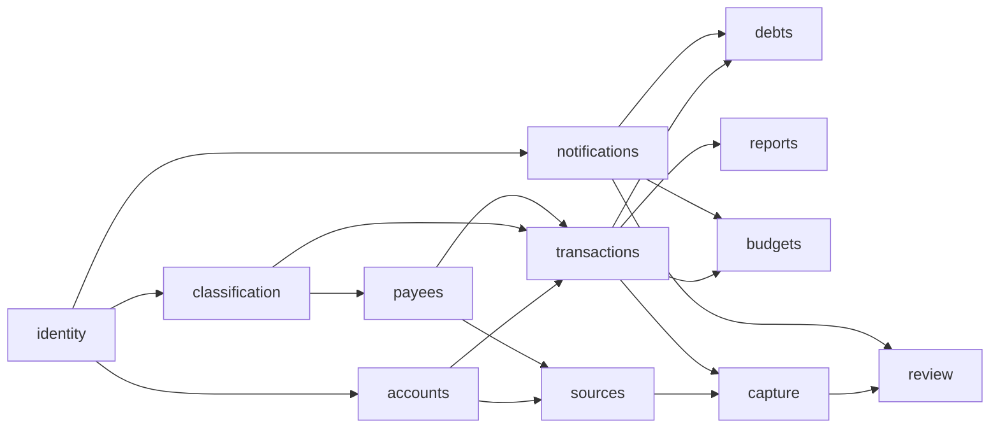

# Budmon: Spec Summary

Based on the [project brief](./project-brief.md) and the user's [initial description](./notes/2026-10-04-initial-idea.md). Each module below is designed with `/design-module <module>`.

**Conventions in this document**

- **Decided** means the user stated it. Anything inferred is marked *(assumption Ax)* and listed in section 8.
- `[NEEDS INPUT: ...]` marks a gap the user must close before the affected module is designed.
- The **MVP?** column in the story tables is **the analyst's recommendation, pending the user's decision** (see section 5). Values are `MVP`, `Later`, or `TBD` (depends on an open question).

## Changelog

| Version | Date | Change |
| ------- | ---- | ------ |
| 0.1     | 2026-10-04 | Initial draft (interview round 1) |

## 1. Users and roles

| Role | Who | Can see and do |
| ---- | --- | -------------- |
| **User** | Anyone with a Budmon login. | Everything for their own accounts, payees, purposes, tags, transactions, debts, sources and settings. Nothing of another user's unless it's shared with them. |
| **Account owner** | The user who created a money account. | Everything on that account, including inviting and removing members, and archiving or deleting the account. |
| **Account member** | A user the owner has shared an account with (decided: shared accounts exist). | See and record transactions on that shared account only. [NEEDS INPUT: roles and permissions. Proposal: *editor* (add/edit transactions) and *viewer* (read only). Can a member edit or delete transactions another member entered? See question 4.] |
| **Counterparty user** | Another Budmon user involved in a loan (decided). | Accept or decline a loan addressed to them. Once accepted, the loan appears in their ledger too. They don't see the lender's other data. |
| **Off-system counterparty** | A person or entity who isn't a Budmon user (decided). | No access. A label the user records debts against. |

[NEEDS INPUT: Is there a *household* concept (a group sharing several accounts and budgets), or only per-account sharing? Proposal: per-account sharing only in the first version. See question 4.]

No administrator or support role is defined yet. [NEEDS INPUT: Do you need an admin view (for example to maintain built-in bank templates or look at errors), or is that out of scope?]

## 2. Glossary

| Term | Definition |
| ---- | ---------- |
| **Account** | A place money is held, belonging to a user: a bank account, an online wallet, cash, or another kind. It has one currency *(assumption A2)* and a balance. Not to be confused with the user's login, called the *Budmon user* or *profile*. |
| **Shared account** | An account the owner has given other users access to. |
| **Transaction** | A record of money entering or leaving one account on a date: an *expense* (out) or *income* (in). It has an amount, account, date, payee, purpose, tags and a note, and may be split. |
| **Split line** | One part of a split transaction, with its own amount, purpose, tags and note. The lines add up to the transaction total. |
| **Transfer** | Money moving between two accounts the user can access. It isn't income or expense. |
| **Refund** | An incoming transaction linked to an earlier expense (or one of its split lines) that it partly or fully reverses. |
| **Purpose** | What the money was for, such as Groceries or Electronics. Other apps call this a *category* *(assumption A1)*. One per transaction or split line. |
| **Tag** | A free label, such as "subscription" or "tip". A transaction or split line can have any number of tags. Default tags are provided, and users can add their own. |
| **Payee** | Who was paid, or who paid the user, under the name the user knows them by (for example "Amazon"). |
| **Payee alias** | A name that appears in messages for a payee (for example "AMZN Mktp EG"). One payee has many aliases (decided). |
| **Debt / loan** | Money the user owes someone (*borrowed*) or someone owes the user (*lent*), with a counterparty, an amount outstanding and optionally a due date (decided). |
| **Counterparty** | The other side of a debt: a Budmon user or an off-system person or entity. |
| **Repayment** | A transaction that reduces a debt's outstanding amount. |
| **Source** | A connected place Budmon reads messages from: a Gmail account (first) or the phone's SMS. |
| **Scan scope** | The user's rule for which messages from a source Budmon may read: *only listed senders*, *everything except excluded senders*, or *everything* (decided). |
| **Sender** | An email address or SMS sender ID or number known to Budmon. Its *role* is *financial institution* (bank or payment gateway, the source of truth) or *vendor* (a merchant or service). |
| **Template** | A rule that extracts transaction fields from a sender's messages of one *message type* (debit, credit, card payment, cash withdrawal, and so on). |
| **Captured transaction** | A transaction proposed by automation from one or more messages, waiting for review. |
| **Review** | The user confirming, correcting or rejecting a captured transaction. |
| **Balance** | See XC-4. [NEEDS INPUT] |
| **Period** | A span of time that reports and budgets are calculated over. Calendar month by default. See XC-6. |
| **Budget** | [NEEDS INPUT: see question 2.] |

## 3. Cross-cutting requirements

### 3.1 Money and currencies

- **XC-1** Amounts are exact. No rounding drift; every currency is shown with its own number of decimals.
- **XC-2** Each account holds one currency *(assumption A2)*. Each user has a *base currency* used for totals across accounts.
- **XC-3** [NEEDS INPUT: How are totals across currencies calculated? Options: (a) one currency per user, so there's no conversion at all; (b) several currencies, converted at a daily rate from an external provider; (c) several currencies, with rates the user enters. Also: a transfer between accounts in different currencies records both amounts. See question 5.]
- **XC-4** [NEEDS INPUT: Definition of an account's balance. Proposal: balance = opening balance + all *confirmed* transactions up to now. Captured but unreviewed transactions are shown separately as "pending review" and not included. Future-dated entries are excluded until their date. See question 6.]

### 3.2 Time, periods and time zones

- **XC-5** Each user has a time zone, and transaction dates are in that time zone. Captured transactions take the date and time of the bank message, converted to the user's time zone.
- **XC-6** [NEEDS INPUT: Does a month or period start on the 1st, or on a user-chosen day such as payday? Proposal: calendar month by default, with a user-chosen start day as an option.]
- **XC-7** Back-dated entries are allowed and change historical balances and reports. [NEEDS INPUT: Can past periods ever be locked against changes? Proposal: no locking in the first version.]
- **XC-8** [NEEDS INPUT: Recurring or scheduled transactions (for example rent and subscriptions entered once and repeated automatically) aren't mentioned in your description. Are they wanted? Proposal: later, alongside subscription detection.]

### 3.3 Privacy, security and data ownership

- **XC-9** (Decided) Every automated capability has a manual alternative that gives the same result: setting up senders, creating templates, extracting fields, choosing payees and purposes.
- **XC-10** (Decided) AI is opt-in. The user can use Budmon fully with AI off. [NEEDS INPUT: one global AI switch, or a switch per feature (sender discovery, extraction, categorisation)? Proposal: one global switch plus per-feature switches.]
- **XC-11** (Decided in intent) Budmon reads only messages inside the user's scan scope, even when the granted permissions would technically allow more. A message outside the scope is never stored or sent to AI.
- **XC-12** [NEEDS INPUT: Where AI runs, and what may leave Budmon's servers: a third-party LLM API, a self-hosted model, or on-device. See question 7.]
- **XC-13** [NEEDS INPUT: Retention of raw message content. Options: keep it permanently (so the user can see why a transaction was captured); keep it for N days and then only extracted fields; never store it beyond processing. See question 7.]
- **XC-14** Disconnecting a source stops all reading immediately and revokes Budmon's access. [NEEDS INPUT: Is that source's stored message data deleted at the same time? Proposal: yes.]
- **XC-15** A user only sees another user's data through an explicit share (account membership) or an accepted loan.
- **XC-16** [NEEDS INPUT: What happens when a user deletes their Budmon account? Proposal: all their data is deleted within 30 days. Shared accounts they own are either handed to another member or deleted after members are warned. Loans with other users stay in the other user's ledger, with the counterparty shown as "deleted user".]
- **XC-17** [NEEDS INPUT: Data export. Proposal: the user can export all their data (CSV and JSON) at any time.]
- **XC-18** Login and financial data are protected to a standard appropriate for a finance app. [NEEDS INPUT: Is two-factor authentication required, optional, or later?]

### 3.4 Platforms, UX principles and accessibility

- **XC-19** (Decided) The first platforms are the backend, the web app and the mobile app. An Electron desktop app based on the web app comes later.
- **XC-20** (Decided) Everything, including the automation setup, can be done from both the web app and the mobile app UIs. [NEEDS INPUT: Is every feature on both from day one, or are some web-first (for example template building) or mobile-first (for example SMS)? The description says the essentials "can be tested through the webapp".]
- **XC-21** [NEEDS INPUT: Mobile platforms: Android, iOS, or both? This matters a lot for SMS (iOS doesn't allow apps to read SMS).]
- **XC-22** [NEEDS INPUT: Must the mobile app work offline (record a cash expense with no signal and sync later)? Proposal: yes, for manual entry. It's a substantial cost, so decide early.]
- **XC-23** Recording a manual transaction is fast: on mobile, an expense with amount, account, payee and purpose takes no more than [NEEDS INPUT: e.g. 4] taps after opening the app. Reviewing a captured transaction is a single action when nothing needs changing.
- **XC-24** [NEEDS INPUT: Languages, and whether right-to-left layouts are needed. Accessibility target (proposal: WCAG 2.2 AA on web, platform accessibility guidelines on mobile). Design language and tone (proposal: calm, plain-spoken, never guilt-inducing about spending).]

### 3.5 Notifications

- **XC-25** (Decided) Reminders to record data are based on when the user last recorded something and on their preferences. Cash withdrawals are an important trigger.
- **XC-26** Every kind of notification can be turned off individually.
- **XC-27** [NEEDS INPUT: Delivery channels: mobile push, in-app, email, web push? Proposal: push and in-app first.]
- **XC-28** [NEEDS INPUT: Quiet hours, and a daily cap on reminders? Proposal: quiet hours set by the user, and at most one data-entry reminder per day.]

### 3.6 Performance and availability expectations

- **XC-29** [NEEDS INPUT: How soon after a bank message arrives should the captured transaction appear for review? Proposal: within 5 minutes for Gmail.]
- **XC-30** [NEEDS INPUT: How far back should Budmon scan when a source is first connected? Proposal: the user chooses, up to 90 days.]
- **XC-31** [NEEDS INPUT: Availability expectations. Proposal: best effort; no formal uptime target while invite-only.]

## 4. Modules

Twelve modules. Five are **core ledger** (`identity`, `accounts`, `classification`, `payees`, `transactions`), four are **people and follow-up** (`debts`, `notifications`, `reports`, `budgets`), and three are **automated capture** (`sources`, `capture`, `review`).

### 4.1 `identity`: Users, sign-in and profile (prefix `IDN`)

- **Purpose:** who the user is, how they sign in, their preferences, and their control over their own data.
- **In scope:** sign-up, sign-in and sign-out, sessions across devices, profile (name, base currency, time zone, language), finding another user to share with or lend to, data export, account deletion.
- **Out of scope:** money accounts (`accounts`), notification preferences (`notifications`), source connections (`sources`).
- **Depends on:** none.

**Stories**

| ID | As a… | I want… | So that… | Acceptance criteria | MVP? |
| -- | ----- | ------- | -------- | ------------------- | ---- |
| IDN-US-1 | visitor | to create a Budmon user | I can start tracking my money | Sign-up with [NEEDS INPUT: email + password, Google sign-in, or both]; after sign-up I choose my base currency and time zone; I land on an empty-state home that tells me to add my first account. | MVP |
| IDN-US-2 | user | to sign in on the web and on mobile and stay signed in | I don't have to log in every time | Sessions persist across app restarts; I can see my active sessions and sign any of them out. | MVP |
| IDN-US-3 | user | to edit my profile and preferences | totals and dates make sense to me | I can change name, base currency, time zone and language; changing the time zone doesn't change the instants of existing transactions. | MVP |
| IDN-US-4 | user | to reset a forgotten password | I can get back in | Reset link by email; expires after a set time; old sessions are signed out. | MVP |
| IDN-US-5 | user | to find another Budmon user | I can share an account or lend to them | Looked up by exact email (or invite link) only; no browsing of the user directory. | MVP |
| IDN-US-6 | user | to export all my data | I own my data | See XC-17. | TBD |
| IDN-US-7 | user | to delete my Budmon user and data | I can leave completely | Asks for confirmation; follows XC-16; disconnects all sources. | MVP |
| IDN-US-8 | user | to turn on two-factor authentication | my financial data is safer | See XC-18. | TBD |

**Business rules**

| ID | Rule |
| -- | ---- |
| IDN-BR-1 | One login identity (email) per Budmon user. |
| IDN-BR-2 | A user can't be found by partial search. Lookup needs an exact email or an invite link (privacy). |

### 4.2 `accounts`: Money accounts and sharing (prefix `ACC`)

- **Purpose:** the places money is held, their balances, and sharing them with other users.
- **In scope:** account types, creation, editing, archiving, opening balance, current balance, net worth across accounts, sharing (invite, accept, roles, leave, remove), identifiers used for automated matching (for example the last 4 card digits).
- **Out of scope:** the transactions themselves (`transactions`); linking senders to accounts (`sources`).
- **Depends on:** `identity`.

**Stories**

| ID | As a… | I want… | So that… | Acceptance criteria | MVP? |
| -- | ----- | ------- | -------- | ------------------- | ---- |
| ACC-US-1 | user | to create an account of a given type | I can record money held there | Types: bank account, online wallet, cash, other (decided). [NEEDS INPUT: Are *credit card* and *loan/mortgage* separate types? A credit card has a negative balance and a payment cycle, so it behaves differently from a bank account.] Fields: name, type, currency, opening balance and date, optional institution, optional identifiers (for example card or account last digits). | MVP |
| ACC-US-2 | user | to see all my accounts with current balances and a total | I know where I stand | List grouped by type; balance per XC-4; total in base currency per XC-3; shared accounts are marked as shared. | MVP |
| ACC-US-3 | user | to edit or archive an account | my list stays current | Archived accounts are hidden from pickers and totals but keep their history; an account with transactions can't be hard-deleted without confirmation that its transactions go too. | MVP |
| ACC-US-4 | account owner | to invite another user to an account | we can track a joint account together | Invite by IDN-US-5; the invitee must accept; role per section 1 [NEEDS INPUT]. | TBD |
| ACC-US-5 | account member | to leave a shared account, and as owner to remove a member | sharing can end cleanly | After leaving, the account disappears from the member's lists and totals. [NEEDS INPUT: Does the member keep a read-only copy of history?] | TBD |
| ACC-US-6 | account member | to see who entered or changed each transaction on a shared account | we avoid confusion | Each transaction shows its creator and last editor. | TBD |
| ACC-US-7 | user | to correct an account's balance when it doesn't match reality | my balance matches my bank or wallet | Entering the real balance creates an adjustment transaction for the difference, clearly labelled. | MVP |

**Business rules**

| ID | Rule |
| -- | ---- |
| ACC-BR-1 | An account has exactly one owner and one currency *(assumption A2)*. |
| ACC-BR-2 | Members see only the shared account and its transactions, never the owner's other accounts. |
| ACC-BR-3 | Opening balance plus transactions make up the balance; balances are never edited directly (ACC-US-7 makes an adjustment transaction instead). |
| ACC-BR-4 | [NEEDS INPUT: On a shared account, whose purposes and tags are used? Options: the owner's set, a separate set per shared account, or each member's own. This determines how reports across members work.] |

### 4.3 `classification`: Purposes and tags (prefix `CLS`)

- **Purpose:** the vocabulary used to describe what money was for.
- **In scope:** default purposes and tags, custom purposes and tags, editing, merging, archiving. [NEEDS INPUT: Can purposes be nested, for example Food > Groceries? Proposal: two levels.]
- **Out of scope:** automatic purpose suggestions (`capture`); budgets per purpose (`budgets`).
- **Depends on:** `identity`.

**Stories**

| ID | As a… | I want… | So that… | Acceptance criteria | MVP? |
| -- | ----- | ------- | -------- | ------------------- | ---- |
| CLS-US-1 | new user | a sensible default set of purposes and tags | I can start without setup | Defaults are created at sign-up, including the tags "subscription" (decided example) and "tip" *(assumption A6)*. [NEEDS INPUT: the default purpose list, or should the analyst propose one?] | MVP |
| CLS-US-2 | user | to create, rename and archive purposes and tags | they fit my life | Renaming updates every transaction that uses it; archived items are hidden from pickers but stay on history. | MVP |
| CLS-US-3 | user | to merge two purposes or two tags | I can clean up duplicates | All uses move to the surviving one; the other is removed. | Later |

**Business rules**

| ID | Rule |
| -- | ---- |
| CLS-BR-1 | Purpose and tag names are unique per user, ignoring case. |
| CLS-BR-2 | Purposes split into income purposes and expense purposes *(assumption A7)*. Tags apply to both. |

### 4.4 `payees`: Payees and their aliases (prefix `PAY`)

- **Purpose:** the people and businesses money goes to or comes from, and the many names they appear under in messages.
- **In scope:** payees, aliases (one payee, many names; decided), a default purpose per payee, merging payees.
- **Out of scope:** linking vendor *senders* to payees (`sources`); automatic matching during capture (`capture`).
- **Depends on:** `identity`, `classification`.

**Stories**

| ID | As a… | I want… | So that… | Acceptance criteria | MVP? |
| -- | ----- | ------- | -------- | ------------------- | ---- |
| PAY-US-1 | user | to create and edit payees | my transactions name who I paid in my own words | Name, optional default purpose, optional default tags; payees can also be created inline while entering a transaction. | MVP |
| PAY-US-2 | user | to attach several aliases to a payee | "AMZN Mktp EG" and "Amazon.eg" both resolve to "Amazon" | Aliases listed per payee; adding one is possible from the payee screen and from review (REV-US-3); an alias belongs to only one payee. | MVP |
| PAY-US-3 | user | to merge two payees | duplicates created by automation are cleaned up | All transactions and aliases move to the surviving payee. | MVP |
| PAY-US-4 | user | a payee's default purpose and tags to pre-fill new transactions | entry is faster | Choosing a payee pre-fills the purpose and tags, which I can still change. | MVP |

**Business rules**

| ID | Rule |
| -- | ---- |
| PAY-BR-1 | (Decided) A payee has many aliases; an alias resolves to exactly one payee per user. |
| PAY-BR-2 | (Decided) When automation finds a name with no matching alias, it creates a payee named exactly as in the message, with that name as its first alias. |
| PAY-BR-3 | Alias matching ignores case and surrounding whitespace. [NEEDS INPUT: Should it also ignore trailing reference numbers or locations, for example "UBER *TRIP 8F3K"? Proposal: yes, via user-editable patterns. Later.] |

### 4.5 `transactions`: Transactions, splits, transfers and refunds (prefix `TXN`)

- **Purpose:** the ledger, meaning every movement of money and what it was for.
- **In scope:** income and expense entry; payee, account, purpose, tags and note (decided); splits (decided); transfers between accounts (decided); refunds linked to the original purchase (decided); tips as split lines (decided); search and filter; attachments [NEEDS INPUT: receipts/photos wanted?].
- **Out of scope:** the loan semantics of a transaction (`debts`); creating transactions from messages (`capture`, `review`).
- **Depends on:** `accounts`, `classification`, `payees`.
- **Note:** this is the largest core module. The planner may design it in slices (entry, splits, transfers, refunds).

**Stories**

| ID | As a… | I want… | So that… | Acceptance criteria | MVP? |
| -- | ----- | ------- | -------- | ------------------- | ---- |
| TXN-US-1 | user | to record an expense or income | my ledger is complete | Fields: type, amount, account, date (default today; time optional), payee, purpose, tags, note. Only amount, account and date are required [NEEDS INPUT: confirm minimum fields]. The account balance updates. | MVP |
| TXN-US-2 | user | to edit or delete a transaction | I can fix mistakes | Balances recalculate; deletion asks for confirmation; deleting a transaction that refunds or is refunded removes the link, not the other transaction. | MVP |
| TXN-US-3 | user | to split a transaction into lines | a mixed Amazon order counts against Food and Electronics separately (decided) | Two or more lines, each with amount, purpose, tags and note; the lines must add up to the total before saving (the remainder is shown live); payee, account and date belong to the whole transaction *(assumption A8)*. | MVP |
| TXN-US-4 | user | to mark part of a payment as a tip | I learn how much I spend on tips (decided) | A split line with the tip tag or purpose (per A6); reports can total tips (RPT-US-3). [NEEDS INPUT: a one-tap "add tip" shortcut on the entry screen, or the normal split flow?] | MVP |
| TXN-US-5 | user | to record a transfer between two of my accounts | moving money isn't counted as spending (decided) | Source account, destination account, amount, date, note; not counted as income or expense in reports; if the currencies differ, both amounts are recorded (XC-3). Transfers to and from shared accounts I belong to are allowed. | MVP |
| TXN-US-6 | user | to record a cash withdrawal | my cash account reflects the money I took out | A transfer from a bank account to a cash account, optionally with a fee as a separate expense; triggers the cash follow-up reminder (NTF-US-3). | MVP |
| TXN-US-7 | user | to record a refund or return linked to the original purchase (decided) | spending figures reflect what I actually kept | Pick the original expense (or one of its split lines); the refund amount defaults to the remaining refundable amount; both transactions show the link. | MVP |
| TXN-US-8 | user | to search and filter transactions | I find things quickly | Filter by date range, account, payee, purpose, tag, amount range and text in the note; on shared accounts, also by who entered it. | MVP |
| TXN-US-9 | user | to see where a transaction came from | I trust what's in my ledger | Each transaction shows its origin (manual, captured from a source, adjustment) and, for captured ones, links to the source messages (subject to XC-13). | MVP |

**Business rules**

| ID | Rule |
| -- | ---- |
| TXN-BR-1 | Amounts are positive; direction comes from the type (expense, income, transfer). |
| TXN-BR-2 | (Decided) A split transaction's lines add up exactly to its total. |
| TXN-BR-3 | A transfer moves money between two different accounts and is never counted as income or expense. |
| TXN-BR-4 | (Decided) A refund links to exactly one earlier expense or split line. The total of all refunds linked to an expense can't exceed that expense's amount. |
| TXN-BR-5 | A refund reduces spending under the original purpose for the period the refund falls in *(assumption A9)*. [NEEDS INPUT: or the period of the original purchase?] |
| TXN-BR-6 | A transaction on a shared account is visible to all its members; a member's personal accounts never are. |

### 4.6 `debts`: Debts and loans (prefix `DEBT`)

- **Purpose:** keeping track of money the user owes and money owed to them (decided).
- **In scope:** debts against off-system counterparties (decided); loans to or from another Budmon user with acceptance (decided); direction (lent or borrowed); due dates and check-ins (decided); repayments; settling and writing off.
- **Out of scope:** interest calculation and amortisation schedules [NEEDS INPUT: confirm out of scope]; formal bank loans or mortgages (see ACC-US-1 question).
- **Depends on:** `identity`, `accounts`, `transactions`, `notifications`.

**Stories**

| ID | As a… | I want… | So that… | Acceptance criteria | MVP? |
| -- | ----- | ------- | -------- | ------------------- | ---- |
| DEBT-US-1 | user | to record money I lent to or borrowed from someone who isn't a Budmon user | I keep track of it (decided) | Counterparty name (a reusable contact), direction, amount, date, optional due date and note; optionally linked to the transaction that moved the money (marked as a loan, not as spending or income). | MVP |
| DEBT-US-2 | user | to record a debt with no money moving through my accounts | I can track "a friend paid for my dinner, I owe them" | Creates a debt with no linked transaction. [NEEDS INPUT: confirm you want this case.] | TBD |
| DEBT-US-3 | user | to record repayments, full or partial | the outstanding amount stays correct | A repayment is a transaction linked to the debt; the outstanding amount decreases; at zero, the debt is *settled*. | MVP |
| DEBT-US-4 | user | to be asked on the due date whether the debt has been paid | I don't forget (decided) | Notification on the due date with actions: *Paid* (records a repayment), *Need more time* (pick a new date), *Update* (edit the debt). | MVP |
| DEBT-US-5 | user | to see all open debts, split into "I owe" and "owed to me" | I know my position | Totals per direction in base currency; overdue ones are highlighted. | MVP |
| DEBT-US-6 | user | to write off or forgive a debt | it stops nagging me | Status becomes *written off*; it's kept in history; the remaining amount is optionally recorded as an expense or income. | Later |
| DEBT-US-7 | user | to send a loan to another Budmon user's account | it's recorded on both sides (decided) | I pick their account [NEEDS INPUT: can I see their account list, or do they choose the receiving account when accepting? Proposal: they choose, for privacy]; the loan is *pending* until they accept. | Later |
| DEBT-US-8 | counterparty user | to accept or decline a loan sent to me | nothing appears in my ledger without my consent (decided) | On acceptance, the money arrives in my chosen account and the debt appears in my debts list as *borrowed*; on decline, the lender is told and nothing is recorded for me. [NEEDS INPUT: what happens on the lender's side while the loan is pending: is the money already out of their account?] | Later |
| DEBT-US-9 | either party to a linked loan | repayments recorded by one side to show on the other | we agree on what's outstanding | [NEEDS INPUT: Must the other side confirm each repayment too?] | Later |

**Business rules**

| ID | Rule |
| -- | ---- |
| DEBT-BR-1 | (Decided) A debt's direction is *lent* (expected to come back to me) or *borrowed* (expected to go back to the other side). |
| DEBT-BR-2 | Money moved as a loan or repayment isn't counted as income or expense in spending reports *(assumption A10)*. |
| DEBT-BR-3 | Outstanding amount = principal minus the sum of repayments; it can't go below zero. |
| DEBT-BR-4 | (Decided) A loan to another Budmon user only takes effect on their side after they accept it. |
| DEBT-BR-5 | A debt is in one currency. [NEEDS INPUT: Can it be repaid in another currency?] |

### 4.7 `notifications`: Reminders and alerts (prefix `NTF`)

- **Purpose:** prompting the user at the right moments, mainly to keep data entry from lapsing (decided).
- **In scope:** data-entry reminders based on inactivity and preferences (decided); cash follow-ups (decided); delivery of notifications raised by other modules (debt due dates, loan requests, review queue, budgets); preferences, channels and quiet hours.
- **Out of scope:** deciding *when* another module's event happens; that module owns the trigger.
- **Depends on:** `identity`.

**Stories**

| ID | As a… | I want… | So that… | Acceptance criteria | MVP? |
| -- | ----- | ------- | -------- | ------------------- | ---- |
| NTF-US-1 | user | a reminder when I haven't recorded anything for a while | my ledger doesn't fall behind (decided) | I set the threshold (for example 2 days) and preferred time of day; "recorded anything" includes reviewing captured transactions. | MVP |
| NTF-US-2 | user | a regular reminder at a time I choose | I build a habit | Daily or weekly, at a time I pick; skipped if I've already recorded something that day. [NEEDS INPUT: wanted in addition to NTF-US-1?] | TBD |
| NTF-US-3 | user | a follow-up after a cash withdrawal | I record what I spend the cash on (decided as especially important) | After a withdrawal into a cash account, I'm reminded after a delay I set (for example the same evening). [NEEDS INPUT: also remind when a cash account has had no expenses for N days while it still has a balance?] | MVP |
| NTF-US-4 | user | to control each kind of notification and quiet hours | I'm not nagged | Per-type on/off; quiet hours (XC-28); channels (XC-27). | MVP |
| NTF-US-5 | user | an in-app list of recent notifications | I can act on one I missed | Shows the last [NEEDS INPUT: e.g. 30 days]; actionable items (debt check-in, loan request, review) open the right screen. | MVP |
| NTF-US-6 | user | a nudge when captured transactions are waiting for review | automation actually saves time | At most once a day, only when the queue isn't empty. | MVP |

**Business rules**

| ID | Rule |
| -- | ---- |
| NTF-BR-1 | Notifications respect the user's time zone and quiet hours. |
| NTF-BR-2 | A notification is never sent for a type the user has turned off. |
| NTF-BR-3 | Data-entry reminders stop as soon as the user records or reviews something. |

### 4.8 `reports`: Insights (prefix `RPT`)

- **Purpose:** showing the user what their money did.
- **In scope:** spending and income by period, purpose, tag, payee and account; balances over time; tip totals (decided as useful insight). [NEEDS INPUT: which reports matter most on day one?]
- **Out of scope:** forecasting; tax reports.
- **Depends on:** `transactions`, `classification`, `payees`, `accounts`; optionally `debts`.

**Stories**

| ID | As a… | I want… | So that… | Acceptance criteria | MVP? |
| -- | ----- | ------- | -------- | ------------------- | ---- |
| RPT-US-1 | user | spending by purpose for a period | I see where money goes | Period picker (per XC-6); split lines count under their own purpose; refunds per TXN-BR-5; transfers and loans excluded. | MVP |
| RPT-US-2 | user | income vs expenses per period | I know whether I'm saving | Monthly bars for the last [NEEDS INPUT: e.g. 12] periods. | MVP |
| RPT-US-3 | user | totals by tag (for example "tip", "subscription") | I see cross-cutting costs (decided example: tips) | Any tag, any period; drill down into the transactions. | MVP |
| RPT-US-4 | user | spending by payee | I see who gets my money | Top payees per period, with drill-down. | Later |
| RPT-US-5 | user | account balances and net worth over time | I see the trend | Line chart per account and total, in base currency. | Later |

**Business rules**

| ID | Rule |
| -- | ---- |
| RPT-BR-1 | Reports include only confirmed transactions (consistent with XC-4). |
| RPT-BR-2 | [NEEDS INPUT: Do a user's reports include shared-account transactions entered by other members? Proposal: yes, with a filter to hide them.] |

### 4.9 `budgets`: Budgets (prefix `BUD`)

- **Purpose:** [NEEDS INPUT: The description says the product is "mainly meant to help with budget management", but doesn't describe budgets themselves. See question 2.]
- **Proposal, pending your decision:** a spending limit per purpose (or group of purposes) per period. Progress is shown as spent, remaining and days left, with alerts at configurable thresholds (for example 80% and 100%). Going over is allowed and never blocks entry. Unused amounts don't roll over unless the user chooses it.
- **Depends on:** `classification`, `transactions`, `notifications`.

**Stories:** to be written once question 2 is answered.

**Business rules:** to be written once question 2 is answered.

### 4.10 `sources`: Message sources and scan scope (prefix `SRC`)

- **Purpose:** connecting where transaction messages arrive, and the user's rules for what Budmon may read (decided).
- **In scope:** connecting and disconnecting Gmail accounts (decided: Gmail first; several email accounts allowed); SMS on supported phones (decided as a source; platform limits apply, XC-21); scan-scope modes (decided); the sender list and sender roles; linking financial-institution senders to accounts (decided: "during the initial setup… and maybe of each new account"); linking vendor senders to payees (decided); AI-assisted sender discovery (decided as an option); initial backfill.
- **Out of scope:** reading fields out of messages (`capture`).
- **Depends on:** `identity`, `accounts`, `payees`.

**Stories**

| ID | As a… | I want… | So that… | Acceptance criteria | MVP? |
| -- | ----- | ------- | -------- | ------------------- | ---- |
| SRC-US-1 | user | to connect one or more Gmail accounts | Budmon can find my transaction emails | Connect through Google's consent screen; the source shows status (connected, error, disconnected) and last check time; scanning only starts once the scan scope is set (SRC-US-3). | MVP |
| SRC-US-2 | user (Android) | to connect my phone's SMS | bank SMS are captured too | Asks for the OS permission with an explanation; same scope rules as email. | Later |
| SRC-US-3 | user | to choose a scan scope per source | Budmon reads only what I allow (decided) | Three modes: *only listed senders*, *everything except excluded senders* (for SMS with an option to exclude all phone contacts, and only my exceptions allowed), *everything*. The chosen mode and lists are shown in plain language. | MVP |
| SRC-US-4 | user | to add senders manually and give each a role | I don't need AI to set up (decided) | Add by email address/domain or SMS sender ID; role is *financial institution* or *vendor*; a financial-institution sender is linked to one or more of my accounts; a vendor sender is linked to a payee. | MVP |
| SRC-US-5 | user who opted into AI | Budmon to suggest which senders send transaction messages | setup is quick (decided as an option) | Only messages within the scan scope are examined; suggestions need my confirmation before they're used. | Later |
| SRC-US-6 | user | to choose how far back to scan when connecting | past transactions are captured too | See XC-30; results go to the review queue, not straight into the ledger. | MVP |
| SRC-US-7 | user | to be prompted to link senders when I create a new account | capture works for the new account (decided as "maybe") | After creating a bank or wallet account, an optional step to pick or add its sender. | MVP |
| SRC-US-8 | user | to pause or disconnect a source | I stay in control | Pause stops reading; disconnect also revokes access and follows XC-14. | MVP |
| SRC-US-9 | iPhone user | to share or forward a bank message into Budmon | capture works where SMS can't be read | [NEEDS INPUT: wanted? Options: an iOS share-sheet extension, a Budmon forwarding email address, or both.] | TBD |

**Business rules**

| ID | Rule |
| -- | ---- |
| SRC-BR-1 | (Decided) A message outside the scan scope is never read, stored or sent to AI (XC-11). |
| SRC-BR-2 | Changing the scope affects messages processed from then on. Data already captured from now-excluded senders stays unless the user deletes it. [NEEDS INPUT: confirm.] |
| SRC-BR-3 | (Decided) Financial-institution senders are the source of truth for amount, date and account; vendor senders add detail. |
| SRC-BR-4 | A sender belongs to one user and has one role. |

### 4.11 `capture`: Extraction, matching and merging (prefix `CAP`)

- **Purpose:** turning in-scope messages into captured transactions (decided).
- **In scope:** templates per sender and message type (decided: cash withdrawal, money credited, money debited, payment made, and more); building a template from a sample message with user input or AI (decided); AI extraction (opt-in); merging several messages about one payment into one captured transaction (decided); resolving the payee via aliases (decided) and the account via sender and identifiers; purpose suggestions (decided as later); detecting duplicates against manual entries; handling messages no template can read.
- **Out of scope:** connecting sources and scope (`sources`); the user's confirmation (`review`).
- **Depends on:** `sources`, `transactions`, `payees`, `classification`, `accounts`.

**Stories**

| ID | As a… | I want… | So that… | Acceptance criteria | MVP? |
| -- | ----- | ------- | -------- | ------------------- | ---- |
| CAP-US-1 | user | to create a template from one sample bank message by marking its fields | messages like it are read automatically (decided: "start with one message from the bank… user input") | I pick a message, choose its type (debit, credit, card payment, cash withdrawal, refund, other), and mark amount, currency, payee name, date and time, account identifier, and optionally the balance after; Budmon shows what it would extract from other messages by the same sender before I save. | MVP |
| CAP-US-2 | user who opted into AI | AI to propose the template or extract the fields | I don't have to mark fields myself (decided as an option) | The proposal is shown for confirmation like CAP-US-1. [NEEDS INPUT: Does AI propose reusable templates, extract every message directly, or both? Proposal: propose templates, and use AI directly only when no template matches.] | Later |
| CAP-US-3 | user | every in-scope message matching a template to become a captured transaction | I don't type it | The captured transaction has its type, amount, account, date, payee, links to source messages, and a confidence indicator; it lands in the review queue. | MVP |
| CAP-US-4 | user | a bank message and a vendor message about the same payment to become one transaction | I don't get duplicates (decided) | Matched by amount and a time window [NEEDS INPUT: proposal 30 minutes] plus a payee/sender link; the bank's amount, date and account win; the vendor adds detail (for example the payee name or order items as a note). | MVP |
| CAP-US-5 | user | the payee to be resolved through my aliases | captured transactions use my payee names (decided) | A known alias resolves to its payee; an unknown name creates a payee per PAY-BR-2; the payee's default purpose and tags are applied. | MVP |
| CAP-US-6 | user | captured transactions that match something I already entered by hand to be flagged | I don't record it twice | Same account, same amount, within [NEEDS INPUT: e.g. 3] days: shown in review as "possible duplicate of…", with *merge* and *keep both* actions. | MVP |
| CAP-US-7 | user | to see in-scope messages from known senders that no template could read | nothing slips through | Listed with actions: create a template from it, mark it as "not a transaction" (with an option to ignore similar messages), or enter manually. | MVP |
| CAP-US-8 | user who opted into AI | a suggested purpose for each captured transaction | review is faster (decided as later) | Uses payee, vendor details and history; shown as a suggestion, never applied silently. | Later |
| CAP-US-9 | user | a cash-withdrawal message to become a transfer to my cash account | my cash is tracked | A withdrawal template produces a transfer (TXN-US-6) to the cash account I've set as default. [NEEDS INPUT: one default cash account per currency?] | MVP |
| CAP-US-10 | user | subscriptions to be detected | I know what I'm subscribed to (decided as "if possible") | Recurring payments to the same payee at regular intervals are suggested to be tagged "subscription". | Later |

**Business rules**

| ID | Rule |
| -- | ---- |
| CAP-BR-1 | (Decided) A financial-institution message is the primary record. A vendor message alone produces a captured transaction only if no bank message is expected. [NEEDS INPUT: For example, payments by an account with no connected sender. Should a vendor-only message create a captured transaction, or only enrich one?] |
| CAP-BR-2 | Nothing captured goes into the ledger without review. [NEEDS INPUT: allow auto-confirming for trusted templates later? See question 6.] |
| CAP-BR-3 | Templates are private to the user who made them. [NEEDS INPUT: Should Budmon offer built-in templates for common banks, or let users share templates? Sharing templates can leak message formats but not personal data.] |
| CAP-BR-4 | AI extraction runs only when the user has opted in (XC-10) and only on in-scope messages (SRC-BR-1). |
| CAP-BR-5 | One message contributes to at most one captured transaction. |

### 4.12 `review`: Review queue (prefix `REV`)

- **Purpose:** letting the user confirm automation output with as little effort as possible (decided: reviews replace data entry and should be "very convenient").
- **In scope:** the queue, confirm, edit-and-confirm, reject, bulk actions, learning from corrections, showing the source messages.
- **Out of scope:** extraction itself (`capture`).
- **Depends on:** `capture`, `transactions`, `payees`, `classification`, `notifications`.

**Stories**

| ID | As a… | I want… | So that… | Acceptance criteria | MVP? |
| -- | ----- | ------- | -------- | ------------------- | ---- |
| REV-US-1 | user | a queue of captured transactions, newest first | I can clear it in one sitting | Shows amount, payee, account, date, suggested purpose and possible-duplicate flags; a count is shown on the home screen. | MVP |
| REV-US-2 | user | to confirm a captured transaction in one action | review is faster than entry | On mobile, one swipe or tap; on web, a keyboard shortcut; confirmed items move into the ledger. | MVP |
| REV-US-3 | user | to correct fields before confirming | the ledger is right | Edit any field; changing the payee offers "always map this name to that payee", which adds an alias (PAY-US-2); splitting is possible here too. | MVP |
| REV-US-4 | user | to reject a captured transaction | false positives go away | Reject with an optional reason ("not a transaction", "duplicate"); rejected items can be seen and restored for [NEEDS INPUT: e.g. 30 days]. | MVP |
| REV-US-5 | user | to confirm many at once | I can catch up quickly | Multi-select and confirm, or "confirm all with no flags". | MVP |
| REV-US-6 | user | to see the original messages behind a captured transaction | I can check it | Message text or excerpt shown, subject to XC-13. | MVP |
| REV-US-7 | user | corrections to improve future captures | I'm not correcting the same thing every time | Payee corrections create aliases; repeated corrections to a template's field prompt me to fix the template. | MVP |
| REV-US-8 | user | to let trusted templates confirm automatically | I review less over time (decided: "the user will be asked again for reviews to the automation later on") | [NEEDS INPUT: see question 6.] | Later |

**Business rules**

| ID | Rule |
| -- | ---- |
| REV-BR-1 | Confirming creates exactly one ledger transaction (or merges with a flagged duplicate if the user chose that). |
| REV-BR-2 | On a shared account, any member with edit rights can review captured transactions for that account. [NEEDS INPUT: or only the member whose source captured it?] |

## 5. Module map and build order

**Recommended build order and MVP cut (the analyst's recommendation, pending your decision; see question 3)**

The recommendation is to deliver in three stages. Stage A gives a usable manual budgeting app on web and mobile, which proves the ledger is right. Stage B adds the differentiator (Gmail capture with templates and review). Stage C adds the things that carry the most platform, privacy or cost risk.

| Order | Module | Why here | MVP? |
| ----- | ------ | -------- | ---- |
| 1 | `identity` | Everything belongs to a user. | MVP (stage A) |
| 2 | `accounts` | Transactions need accounts. Sharing stories can come later in the module if question 4 says so. | MVP (stage A) |
| 3 | `classification` | Transactions and payees reference purposes and tags. | MVP (stage A) |
| 4 | `payees` | Transactions reference payees; aliases are needed before capture. | MVP (stage A) |
| 5 | `transactions` | The ledger; everything after it reads from it. | MVP (stage A) |
| 6 | `notifications` | Data-entry and cash reminders are part of the core answer to "users forget"; debts and review need it. | MVP (stage A) |
| 7 | `reports` | Gives the ledger visible value; small once transactions exist. | MVP (stage A) |
| 8 | `debts` | Off-system debts are self-contained; user-to-user loans (DEBT-US-7 to 9) are later. | MVP (stage A), partial |
| 9 | `sources` | Gmail connection and scope rules; SMS later. | MVP (stage B) |
| 10 | `capture` | Templates, merging and payee resolution; AI later. | MVP (stage B) |
| 11 | `review` | Without review, capture is unusable; designed together with `capture`. | MVP (stage B) |
| 12 | `budgets` | Position depends on question 2. If budgets are core, move it to straight after `reports`. | TBD |

Stage C (later): SMS on Android (SRC-US-2), AI options (SRC-US-5, CAP-US-2, CAP-US-8), auto-confirm (REV-US-8), user-to-user loans (DEBT-US-7 to 9), subscription detection (CAP-US-10), other email providers, the Electron desktop app.

## 6. External integrations

| Integration | Why | Notes |
| ----------- | --- | ----- |
| Gmail API (Google OAuth) | Read in-scope transaction emails (decided: Gmail first). | Restricted scope: public use needs Google verification plus an annual security assessment; testing mode allows a limited number of named users. A forwarding address is an alternative that needs no scope (SRC-US-9). |
| Android SMS access | Read in-scope bank SMS (decided as a source). | Google Play restricts SMS permissions; iOS doesn't allow it at all. |
| LLM / AI model provider | Optional sender discovery, extraction and categorisation (decided as opt-in). | [NEEDS INPUT: see question 7.] |
| Push notification services (APNs and FCM) | Reminders and alerts. | Needed for NTF on mobile. |
| Transactional email provider | Password reset, invitations, possibly notifications. | |
| FX rate provider | Conversion to base currency. | Only if XC-3 option (b) is chosen. |
| Bank data aggregators | Not planned: the approach is message-based. | Recorded so the choice is explicit. [NEEDS INPUT: confirm it's out of scope.] |

## 7. Current state of the codebase

Not evaluated yet. The user will ask for this separately.

## 8. Assumptions

| ID | Assumption |
| -- | ---------- |
| A1 | "Purpose" means what most apps call a category; exactly one per transaction or split line. |
| A2 | Each account holds exactly one currency. |
| A3 | Budmon records money only; it never initiates payments or bank transfers. |
| A4 | "System one models" means small, specialised models as an alternative to LLMs. Which is used is a design decision; the product requirement is that the "templates only" path works with no AI. |
| A5 | The first user is the product owner; the product should still be built so that others can sign up. |
| A6 | "Tip" is a default tag (not a purpose), so a tip line keeps the purpose of what it was for (for example Restaurants) while still being totalled as tips. |
| A7 | Purposes are separated into income and expense purposes. |
| A8 | In a split transaction, payee, account and date are shared by all lines. |
| A9 | A refund reduces spending in the period the refund happens. |
| A10 | Loans and repayments aren't income or expense in spending reports. |

## 9. Open questions

Round 1 questions are listed in the round report. The full list of gaps is every `[NEEDS INPUT]` marker above. Later rounds will cover: sign-in method and 2FA, mobile OS targets, offline use, languages and RTL, notification channels, report priorities, default purposes, credit-card account behaviour, raw-message retention details, and template sharing.
