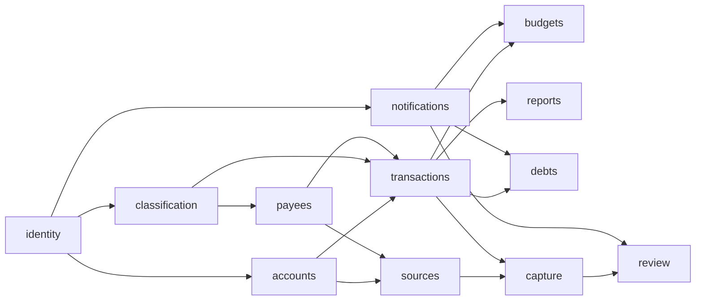

# Budmon: Spec Summary

Based on the [project brief](./project-brief.md), the user's [initial description](./notes/2026-10-04-initial-idea.md) and their [round 2 answers](./notes/2026-10-04-round-2-answers.md) (cited as R2-Qn). Each module below is designed with `/design-module <module>`.

**Conventions in this document**

- **Decided** means the user stated it (with its source). Anything inferred is marked *(assumption Ax)* and listed in section 8.
- `[NEEDS INPUT: ...]` marks a gap the user must close before the affected module is designed.
- **MVP?** column values:
  - `MVP`: in the first version. The scope (stage B) is decided; the placement of individual stories is the analyst's recommendation unless marked decided.
  - `Later`: not in the first version.
  - `TBD`: depends on an open question.

## Changelog

| Version | Date | Change |
| ------- | ---- | ------ |
| 0.1     | 2026-10-04 | Initial draft (interview round 1) |
| 0.2     | 2026-10-04 | Round 2 answers folded in. MVP reaches stage B (R2-Q3). `budgets` written as a core MVP module: conditions, amount or percentage, nesting, overlap, custom periods (R2-Q2). Native Android first (R2-Q3). Shared-account roles admin, member and viewer (R2-Q4). Per-account currency, daily rates, cross-currency transfers with fees and the actual rate applied (R2-Q5). No hard-coded bank list (R2-Q5). Unreviewed captures count in balances, flagged, with a review-status filter (R2-Q6). Review teaches sender-name-to-payee and payee-to-purpose links (R2-Q6). Auto-confirmation for known single-purpose payees, never for new payees (R2-Q6). AI provider rollout (R2-Q7). Raw messages not kept after processing, plus an opt-in raw-data donation setting (R2-Q7). Build order and MVP cut updated. |
| 0.3     | 2026-10-04 | Audience decided (R2-Q1): a small invited group first; going public is a hoped-for goal, not a commitment. `identity` sign-up is invite-only (IDN-US-1, new IDN-US-9, IDN-BR-3). Gmail stays in Google's testing mode; public-launch work is Later. A5 replaced by the decision. |

## 1. Users and roles

Sharing is **per account** (decided, R2-Q4). A "household" is simply a group of people sharing one or more accounts, such as a common "house money" cash account. There is no separate household entity. [NEEDS INPUT, later round: is a household grouping wanted later as a convenience, for example "invite these 3 people to all of these accounts at once"?]

| Role | Who | Can see and do |
| ---- | --- | -------------- |
| **User** | Anyone with a Budmon login. In the first version, only people who have been invited (decided, R2-Q1). | Everything for their own accounts, payees, purposes, tags, transactions, debts, budgets, sources and settings. Nothing of another user's unless it's shared with them. |
| **Account admin** (decided, R2-Q4) | Usually the creator of the account; an admin can make other members admins. | Any change to the account: settings, sharing, roles, archiving. Creates entries, and edits or deletes anyone's entries, including other admins'. |
| **Account member** (decided, R2-Q4) | A user invited with the member role. | Sees the account and its entries. Creates transactions and transfers on it. Edits and deletes only the entries they created *(assumption A13: "edit" includes delete)*. |
| **Account viewer** (decided, R2-Q4) | For example, someone who has moved out of the household. | View only. What a viewer sees may differ per viewer; that refinement is later (R2-Q4). In the first version, a viewer sees the whole account *(assumption A15)*. |
| **Counterparty user** | Another Budmon user involved in a loan. | Accept or decline a loan addressed to them (later, see `debts`). |
| **Off-system counterparty** | A person or entity who isn't a Budmon user. | No access. A label debts are recorded against. |

No administrator or support role for Budmon itself is defined. [NEEDS INPUT, later round: is an operator or admin view needed, for example to look at errors?]

## 2. Glossary

| Term | Definition |
| ---- | ---------- |
| **Account** | A place money is held: a bank account, an online wallet, cash, or another kind. Each account has its own currency (decided, R2-Q5) and a balance. Not to be confused with the user's login (*Budmon user* or *profile*). |
| **Shared account** | An account with more than one user, each holding a role (admin, member or viewer). |
| **Transaction** | Money entering or leaving one account on a date: an *expense* or *income*. It has an amount, account, date, payee, purpose, tags, a note, a *review status*, and possibly splits. |
| **Review status** | *Confirmed* (entered manually, or reviewed by the user), *Auto-confirmed* (captured and confirmed by rule, REV-US-8), or *Needs review* (captured, not yet reviewed). See R2-Q6. |
| **Split line** | One part of a split transaction, with its own amount, purpose, tags and note. The lines add up to the total. |
| **Transfer** | Money moving between two accounts. When the currencies differ, it has a *sent amount*, a *received amount*, an optional *fee*, and the *applied rate* that results, which can differ from the market rate (decided, R2-Q5). |
| **Market rate** | The exchange rate Budmon fetches daily (decided, R2-Q5), used for conversions where no applied rate exists. |
| **Base currency** | The user's chosen currency for totals across accounts, budgets and reports. |
| **Refund** | An incoming transaction linked to an earlier expense (or split line) that it partly or fully reverses. |
| **Purpose** | What the money was for; what other apps call a *category* *(assumption A1)*. One per transaction or split line. |
| **Tag** | A free label, such as "subscription" or "tip". Any number per transaction or split line. |
| **Payee** | Who was paid or who paid, under the name the user uses. A payee is either *single-purpose* (always the same purpose) or *multi-purpose*; the user can change this at any time (decided, R2-Q6). |
| **Payee alias** | A name that appears in messages for a payee. One payee has many aliases. |
| **Debt / loan** | Money owed by or to the user, with a counterparty, an outstanding amount and an optional due date. |
| **Source** | A connected place messages are read from: a Gmail account, or the Android phone's SMS. |
| **Scan scope** | The user's rule for which messages a source may read: *only listed senders*, *everything except excluded senders*, or *everything*. |
| **Sender** | An email address, domain or SMS sender ID. Its role is *financial institution* (the source of truth) or *vendor*. |
| **Template** | A user's rule for extracting fields from one sender's messages of one message type. Built per user; there's no built-in bank list (decided, R2-Q5). |
| **Captured transaction** | A transaction created by automation from one or more messages. It's in the ledger straight away with status *Needs review* or *Auto-confirmed* (decided, R2-Q6). |
| **Message reference** | An identifier of a source message (for example a Gmail message ID), with no content, kept so the original can be opened at the source *(assumption A12)*. |
| **Balance** | See XC-4. |
| **Budget** | A spending plan for a period, defined by conditions and an amount or percentage. See `budgets`. |
| **Budget condition** | A rule selecting which transactions count toward a budget: purposes, tags, and possibly payees or accounts, combined with AND, OR and NOT (decided, R2-Q2). |
| **Period** | A span of time a budget or report is calculated over. Budgets have custom periods (decided, R2-Q2). |

## 3. Cross-cutting requirements

### 3.1 Money and currencies

- **XC-1** Amounts are exact. No rounding drift; each currency is shown with its own number of decimals.
- **XC-2** (Decided, R2-Q5) Each account has its own currency. Each user has a base currency for totals.
- **XC-3** (Decided, R2-Q5) The backend fetches market exchange rates daily; more frequent updates come later. [NEEDS INPUT: Which rate converts a past transaction into base currency for reports and budgets: the rate on the transaction's date, or today's rate? See question 6.]
- **XC-4** (Decided, R2-Q6) An account's balance includes every transaction, whether *Confirmed*, *Auto-confirmed* or *Needs review*. Transactions that need review are visibly flagged, and the balance shows how much of it is unreviewed *(assumption A16 on the display)*. [NEEDS INPUT, later round: are future-dated transactions excluded until their date? Proposal: yes.]

### 3.2 Time, periods and time zones

- **XC-5** Each user has a time zone; dates are in that time zone. Captured transactions take the bank message's timestamp.
- **XC-6** (Decided, R2-Q2) Budgets use custom periods. [NEEDS INPUT, later round: is a "month" in reports a calendar month, or can it start on a chosen day such as payday? Proposal: reports follow a user-chosen month start day, defaulting to the 1st.]
- **XC-7** Back-dated entries are allowed and change historical balances, budgets and reports. No locking of past periods in the first version *(proposal; [NEEDS INPUT, later round: confirm])*.
- **XC-8** [NEEDS INPUT, later round: are recurring or scheduled transactions wanted? Proposal: later, alongside subscription detection.]

### 3.3 Privacy, security and data ownership

- **XC-9** (Decided) Every automated capability has a manual alternative.
- **XC-10** (Decided) AI is opt-in. [NEEDS INPUT, later round: one global switch, or a switch per feature? Proposal: a global switch plus per-feature switches.]
- **XC-11** (Decided) Only in-scope messages are read. A message outside the scope is never stored or sent to AI.
- **XC-12** (Decided, R2-Q7) AI provider rollout: first a third-party LLM service, then a Budmon-hosted model, then an endpoint the user hosts and configures. Users always know which provider handles their data.
- **XC-13** (Decided, R2-Q7) Raw message and email content is **not stored after processing**. Only templates and extracted data are kept, and this is a headline commitment of the privacy policy. The only exception is the opt-in donation setting (SRC-US-10). Budmon keeps a message reference with no content *(assumption A12)*.
- **XC-14** Disconnecting a source stops reading immediately and revokes access. Transactions already captured stay in the ledger. [NEEDS INPUT, later round: are that source's sender list and templates kept for a possible reconnection? Proposal: kept until the user deletes them.]
- **XC-15** A user only sees another user's data through an account role or an accepted loan.
- **XC-16** [NEEDS INPUT, later round: what happens on account deletion? Proposal: all data deleted within 30 days. Shared accounts where the user is the only admin are handed over to another member, or deleted after warning. Transactions they entered on shared accounts stay, attributed to "deleted user".]
- **XC-17** [NEEDS INPUT, later round: data export. Proposal: full CSV/JSON export at any time.]
- **XC-18** [NEEDS INPUT, later round: is two-factor authentication required, optional, or later?]

### 3.4 Platforms, UX principles and accessibility

- **XC-19** (Decided, R2-Q3) The first platforms are the backend, the web app and a **native Android app**. More platforms (iOS, desktop via Electron) come later.
- **XC-20** (Decided) Everything, including automation setup, can be done from both the web app and the Android app. [NEEDS INPUT, later round: any feature that is web-first or Android-first? SMS is Android-only by nature.]
- **XC-21** (Decided, R2-Q3) Android first; iOS later.
- **XC-22** [NEEDS INPUT: must the Android app work offline? See question 7.]
- **XC-23** Recording a manual transaction is fast: at most [NEEDS INPUT, later round: e.g. 4] taps after opening the app. Confirming a captured transaction that needs no change takes one action.
- **XC-24** [NEEDS INPUT, later round: languages and right-to-left layouts; accessibility target (proposal: WCAG 2.2 AA on web, Android accessibility guidelines); tone (proposal: calm and plain, never guilt-inducing).]

### 3.5 Notifications

- **XC-25** (Decided) Reminders to record data are based on when the user last recorded something and on their preferences; cash withdrawals are a key trigger.
- **XC-26** Every kind of notification can be turned off individually.
- **XC-27** [NEEDS INPUT, later round: channels. Proposal: Android push and in-app first.]
- **XC-28** [NEEDS INPUT, later round: quiet hours and a daily cap. Proposal: quiet hours set by the user; at most one data-entry reminder per day.]

### 3.6 Performance and availability expectations

- **XC-29** [NEEDS INPUT, later round: how soon after a message arrives should the captured transaction appear? Proposal: within 5 minutes for Gmail, near-instant for SMS.]
- **XC-30** [NEEDS INPUT, later round: how far back to scan when a source is first connected? Proposal: the user chooses, up to 90 days.]
- **XC-31** [NEEDS INPUT, later round: availability expectations. Proposal: best effort during the early phase.]

## 4. Modules

Twelve modules:

- **Core ledger** (five): `identity`, `accounts`, `classification`, `payees`, `transactions`.
- **Planning and follow-up** (four): `notifications`, `budgets`, `reports`, `debts`.
- **Automated capture** (three): `sources`, `capture`, `review`.

### 4.1 `identity`: Users, sign-in and profile (prefix `IDN`)

- **Purpose:** who the user is, how they sign in, their preferences, and their control over their own data.
- **In scope:** invite-only sign-up (decided, R2-Q1), invitations, sign-in and sign-out, sessions, profile (name, base currency, time zone, language), finding another user, data export, account deletion.
- **Out of scope:** money accounts and roles (`accounts`); notification preferences (`notifications`); sources and the raw-data donation setting (`sources`).
- **Depends on:** none.

**Stories**

| ID | As a… | I want… | So that… | Acceptance criteria | MVP? |
| -- | ----- | ------- | -------- | ------------------- | ---- |
| IDN-US-1 | invited person | to create a Budmon user from my invitation | I can start | Sign-up works only with a valid, unused, unexpired invitation (decided, R2-Q1); without one, the sign-up page explains that Budmon is invite-only. Sign-up with [NEEDS INPUT, later round: email + password, Google sign-in, or both]; choose base currency and time zone; land on an empty state that tells me to add my first account. | MVP |
| IDN-US-2 | user | to stay signed in on web and Android | I don't log in every time | Sessions persist; I can see and sign out my active sessions. | MVP |
| IDN-US-3 | user | to edit my profile and preferences | totals and dates make sense to me | Name, base currency, time zone and language; changing the time zone doesn't move existing transactions in time. | MVP |
| IDN-US-4 | user | to reset a forgotten password | I can get back in | Reset link by email; expires; other sessions are signed out. | MVP |
| IDN-US-5 | user | to find another Budmon user | I can share an account or lend to them | Exact email or invite link only; no directory browsing. | MVP |
| IDN-US-6 | user | to export all my data | I own my data | See XC-17. | TBD |
| IDN-US-7 | user | to delete my Budmon user and data | I can leave completely | Confirmation; follows XC-16; disconnects all sources. | MVP |
| IDN-US-8 | user | two-factor authentication | my data is safer | See XC-18. | TBD |
| IDN-US-9 | [NEEDS INPUT, later round: any user, or only you as the product owner?] | to invite someone to Budmon by email | they can join the invited group (decided, R2-Q1) | The invitation is sent by email and expires after [NEEDS INPUT, later round: e.g. 7 days]; it can be revoked before use. Inviting someone to a shared account (ACC-US-4) also sends a Budmon invitation if they aren't a user yet. [NEEDS INPUT, later round: should the total number of users be capped to stay within Gmail testing-mode limits?] | MVP |
| IDN-US-10 | visitor | to sign up without an invitation | Budmon can grow | Later, and only if Budmon goes public, which is a hoped-for goal, not a commitment (R2-Q1). | Later |

**Business rules**

| ID | Rule |
| -- | ---- |
| IDN-BR-1 | One login identity (email) per Budmon user. |
| IDN-BR-2 | Users can't be found by partial search. |
| IDN-BR-3 | (Decided, R2-Q1) In the first version, a Budmon user can only be created from a valid invitation. Nothing in the design should prevent switching to open sign-up later. |

### 4.2 `accounts`: Money accounts and sharing (prefix `ACC`)

- **Purpose:** the places money is held, their balances, and sharing them through roles.
- **In scope:** account types, creation, editing, archiving, opening balance, balance (XC-4), net worth, balance correction, sharing (invitations, roles, role changes, leaving, removal), identifiers used for capture matching.
- **Out of scope:** transactions (`transactions`); linking senders to accounts (`sources`); per-viewer visibility rules (later, R2-Q4).
- **Depends on:** `identity`.

**Stories**

| ID | As a… | I want… | So that… | Acceptance criteria | MVP? |
| -- | ----- | ------- | -------- | ------------------- | ---- |
| ACC-US-1 | user | to create an account | I can record money held there | Types: bank, online wallet, cash, other. [NEEDS INPUT, later round: are credit card and loan/mortgage separate types?] Fields: name, type, currency (decided, R2-Q5), opening balance and date, optional institution, optional identifiers (for example the last 4 digits). I become its admin. | MVP |
| ACC-US-2 | user | to see my accounts with balances and a total | I know where I stand | Includes shared accounts I hold any role on, marked as shared with my role shown; each balance shows its unreviewed part (XC-4); total in base currency at today's market rate. | MVP |
| ACC-US-3 | admin | to edit or archive an account | the list stays current | Archived accounts are hidden from pickers and totals but keep their history. | MVP |
| ACC-US-4 | admin | to invite someone with a role | my household can use "house money" together (decided, R2-Q4) | Invite by IDN-US-5 as admin, member or viewer; the invitee accepts or declines. | MVP *(A11)* |
| ACC-US-5 | admin | to change a person's role, including making them admin | responsibilities can shift (decided, R2-Q4) | Any role change, for example member to viewer when someone moves out (decided example, R2-Q4). [NEEDS INPUT, later round: can an admin demote or remove the account's creator?] | MVP *(A11)* |
| ACC-US-6 | member or viewer | to leave a shared account, and as admin to remove someone | sharing can end cleanly | After leaving, the account disappears from my lists, totals and budgets; entries I created stay on the account, attributed to me. | MVP *(A11)* |
| ACC-US-7 | anyone on a shared account | to see who created and last changed each entry | we avoid confusion | Shown on every transaction and transfer. | MVP *(A11)* |
| ACC-US-8 | admin | to restrict what a particular viewer can see | e.g. hide some details from someone who has moved out | (Decided as later, R2-Q4.) To be specified. | Later |
| ACC-US-9 | user with edit rights | to correct an account's balance | it matches reality | Entering the real balance creates a labelled adjustment transaction. [NEEDS INPUT, later round: on shared accounts, admins only?] | MVP |

**Business rules**

| ID | Rule |
| -- | ---- |
| ACC-BR-1 | (Decided, R2-Q5) An account has exactly one currency. |
| ACC-BR-2 | (Decided, R2-Q4) The admin role allows any change to the account and to any entry on it. Member: create entries, and edit only their own. Viewer: read only. |
| ACC-BR-3 | An account always has at least one admin; the last admin can't leave without handing the role over *(assumption A17)*. |
| ACC-BR-4 | People on a shared account see only that account, never each other's other accounts. |
| ACC-BR-5 | (Decided, R2-Q4, from the example) A member may transfer from a shared account to one of their own personal accounts. The other people on the shared account see the shared side, with the destination shown only as "<person>'s account" *(assumption A14)*. |
| ACC-BR-6 | Balances are never edited directly; corrections create adjustment transactions. |
| ACC-BR-7 | [NEEDS INPUT: on a shared account, whose purposes and tags (and payees) are used? See question 5.] |

### 4.3 `classification`: Purposes and tags (prefix `CLS`)

- **Purpose:** the vocabulary for what money was for.
- **In scope:** default purposes and tags, custom ones, editing, archiving, merging. [NEEDS INPUT, later round: can purposes be nested, for example Food > Groceries? Proposal: two levels. This affects budget conditions such as "Food including its sub-purposes".]
- **Out of scope:** purpose suggestions (`capture`); budgets (`budgets`).
- **Depends on:** `identity`.

**Stories**

| ID | As a… | I want… | So that… | Acceptance criteria | MVP? |
| -- | ----- | ------- | -------- | ------------------- | ---- |
| CLS-US-1 | new user | default purposes and tags | I can start without setup | Created at sign-up, including the "subscription" and "tip" tags *(assumption A6 for "tip")*. [NEEDS INPUT, later round: the default purpose list.] | MVP |
| CLS-US-2 | user | to create, rename and archive purposes and tags | they fit my life | Renaming applies everywhere, including budget conditions; archived items are hidden from pickers but stay on history and in budgets. | MVP |
| CLS-US-3 | user | to merge two purposes or two tags | duplicates go away | Uses, including budget conditions, move to the survivor. | Later |

**Business rules**

| ID | Rule |
| -- | ---- |
| CLS-BR-1 | Names are unique per vocabulary, ignoring case. |
| CLS-BR-2 | Purposes are either income or expense purposes *(assumption A7)*. Tags apply to both. |

### 4.4 `payees`: Payees, aliases and payee behaviour (prefix `PAY`)

- **Purpose:** who money goes to or comes from, the names they appear under in messages, and how predictable they are.
- **In scope:**
  - payees and aliases (one payee, many aliases);
  - a default purpose and default tags per payee;
  - the single-purpose/multi-purpose classification (decided, R2-Q6);
  - merging payees.
- **Out of scope:** linking vendor senders (`sources`); matching during capture (`capture`); auto-confirmation itself (`review`).
- **Depends on:** `identity`, `classification`.

**Stories**

| ID | As a… | I want… | So that… | Acceptance criteria | MVP? |
| -- | ----- | ------- | -------- | ------------------- | ---- |
| PAY-US-1 | user | to create and edit payees | transactions use my names | Name, default purpose, default tags; created inline from entry or review too. | MVP |
| PAY-US-2 | user | several aliases per payee | "AMZN Mktp EG" and "Amazon.eg" both mean "Amazon" | Aliases are managed on the payee screen and added from review (REV-US-3); an alias belongs to one payee. | MVP |
| PAY-US-3 | user | to merge payees | duplicates from automation are cleaned up | Transactions and aliases move to the survivor; its single/multi-purpose setting is kept. | MVP |
| PAY-US-4 | user | a payee's defaults to pre-fill new transactions | entry and review are faster | Pre-filled, and still editable. | MVP |
| PAY-US-5 | user | to mark a payee as single-purpose or multi-purpose, and change it later | auto-confirmation follows how predictable the payee is (decided, R2-Q6: "cuz sometimes stuff change") | A toggle on the payee; a single-purpose payee must have a default purpose; changing it affects only future captures. [NEEDS INPUT, later round: does Budmon also suggest "single-purpose" after N reviews of a payee with the same purpose? Is the default for new payees multi-purpose?] | MVP |

**Business rules**

| ID | Rule |
| -- | ---- |
| PAY-BR-1 | (Decided) A payee has many aliases; an alias resolves to exactly one payee per vocabulary (see ACC-BR-7 for shared accounts). |
| PAY-BR-2 | (Decided) An unknown name from a message creates a payee with that name and its first alias. |
| PAY-BR-3 | Alias matching ignores case and surrounding whitespace. [NEEDS INPUT, later round: patterns for trailing reference numbers, for example "UBER *TRIP 8F3K"?] |
| PAY-BR-4 | (Decided, R2-Q6) A newly created payee is never single-purpose until the user makes it so; its captures are never auto-confirmed. |

### 4.5 `transactions`: Transactions, splits, transfers and refunds (prefix `TXN`)

- **Purpose:** the ledger.
- **In scope:**
  - income and expense entry, splits and tips;
  - transfers, including cross-currency transfers with fees and the applied rate (decided, R2-Q5);
  - cash withdrawals and refunds;
  - review status on every transaction (decided, R2-Q6);
  - search and filters, including by review status (decided, R2-Q6);
  - attachments ([NEEDS INPUT, later round: receipt photos wanted?]).
- **Out of scope:** loan semantics (`debts`); creating transactions from messages (`capture`); the review workflow (`review`).
- **Depends on:** `accounts`, `classification`, `payees`.
- **Note:** this is a large module; the planner may design it in slices.

**Stories**

| ID | As a… | I want… | So that… | Acceptance criteria | MVP? |
| -- | ----- | ------- | -------- | ------------------- | ---- |
| TXN-US-1 | user | to record an expense or income | my ledger is complete | Type, amount (in the account's currency), account, date (default today; time optional), payee, purpose, tags, note. Required: amount, account, date [NEEDS INPUT, later round: confirm]. Manually entered transactions are *Confirmed*. | MVP |
| TXN-US-2 | user with rights on the account | to edit or delete a transaction | I can fix mistakes | Rights per ACC-BR-2; balances and budgets recalculate; deleting a refunded or refunding transaction removes only the link. | MVP |
| TXN-US-3 | user | to split a transaction into lines | a mixed order counts against different purposes (decided) | Lines with amount, purpose, tags and note must add up to the total before saving; payee, account and date are shared *(assumption A8)*. | MVP |
| TXN-US-4 | user | to mark part of a payment as a tip | I learn what I spend on tips (decided) | A split line tagged "tip" (A6). [NEEDS INPUT, later round: a one-tap "add tip" shortcut?] | MVP |
| TXN-US-5 | user | to record a transfer between two accounts I can use | moving money isn't spending (decided) | From account, to account, date and note. Same currency: one amount. Different currencies: sent amount and received amount, with the applied rate shown alongside the market rate for that day; optional fee (decided, R2-Q5; fee model per question 6). Allowed from a shared account to my personal account (ACC-BR-5). | MVP |
| TXN-US-6 | user | to record a cash withdrawal | my cash account is right | A transfer from a bank account to a cash account, with an optional fee; triggers NTF-US-3. | MVP |
| TXN-US-7 | user | to record a refund linked to the original purchase (decided) | spending reflects what I kept | Pick the original expense or split line; amount defaults to the remaining refundable amount; both sides show the link. | MVP |
| TXN-US-8 | user | to search and filter transactions | I find things quickly | Date range, account, payee, purpose, tag, amount, note text, created-by (shared accounts), and **review status** (decided, R2-Q6). | MVP |
| TXN-US-9 | user | to see where a transaction came from | I trust my ledger | Origin (manual, captured, adjustment); for captured ones, sender, received time, extracted fields, and a link to open the original at the source (A12). No raw content is shown from Budmon's storage (XC-13). | MVP |

**Business rules**

| ID | Rule |
| -- | ---- |
| TXN-BR-1 | Amounts are positive; direction comes from the type. |
| TXN-BR-2 | (Decided) Split lines add up exactly to the total. |
| TXN-BR-3 | A transfer is never income or expense. A transfer fee is an expense (model per question 6). |
| TXN-BR-4 | (Decided) A refund links to one earlier expense or split line; refunds can't exceed the original amount in total. |
| TXN-BR-5 | A refund reduces spending under the original purpose in the period the refund falls in *(assumption A9)*. |
| TXN-BR-6 | (Decided, R2-Q6) Every transaction has a review status. *Needs review* transactions count in balances, budgets and reports like any other, and are flagged wherever they appear. |
| TXN-BR-7 | (Decided, R2-Q5) In a cross-currency transfer, the sent and received amounts are what the user (or the message) says. The applied rate is derived from them, and it is never overwritten by the market rate. |

### 4.6 `notifications`: Reminders and alerts (prefix `NTF`)

- **Purpose:** prompting the user at the right moments.
- **In scope:**
  - data-entry and cash reminders (decided);
  - delivery of events raised by other modules: budget thresholds, debt due dates, the review queue, invitations, and loan requests later;
  - preferences, channels and quiet hours.
- **Out of scope:** deciding when another module's event happens.
- **Depends on:** `identity`.

**Stories**

| ID | As a… | I want… | So that… | Acceptance criteria | MVP? |
| -- | ----- | ------- | -------- | ------------------- | ---- |
| NTF-US-1 | user | a reminder when I haven't recorded anything for a while | my ledger doesn't lapse (decided) | Threshold and time of day set by me; recording or reviewing anything resets it. | MVP |
| NTF-US-2 | user | a regular reminder at a time I choose | I build a habit | Skipped if I already recorded something that day. [NEEDS INPUT, later round: wanted?] | TBD |
| NTF-US-3 | user | a follow-up after a cash withdrawal | I record what the cash goes on (decided) | Reminder after a delay I set. [NEEDS INPUT, later round: also when a cash account has had no expenses for N days?] | MVP |
| NTF-US-4 | user | to control each notification type and quiet hours | I'm not nagged | Per-type on/off; XC-27 and XC-28. | MVP |
| NTF-US-5 | user | an in-app list of recent notifications | I can act on one I missed | Actionable items open the right screen. | MVP |
| NTF-US-6 | user | a nudge when transactions need review | data gets refined (R2-Q6) | At most once a day, only when something needs review. | MVP |

**Business rules**

| ID | Rule |
| -- | ---- |
| NTF-BR-1 | Notifications respect the user's time zone and quiet hours. |
| NTF-BR-2 | A notification type that's turned off is never sent. |
| NTF-BR-3 | Data-entry reminders stop once the user records or reviews something. |

### 4.7 `budgets`: Budgets (prefix `BUD`)

- **Purpose:** letting users plan spending in whatever structure fits them: from one simple limit to "80% of my salary, of which 30% goes on food" (decided, R2-Q2).
- **In scope:**
  - budgets defined by conditions over purposes and tags, combined with AND, OR and NOT (decided);
  - amounts that are fixed or a percentage (decided), where the base of the percentage is the user's choice (decided; the options are in question 3);
  - nested budgets (decided);
  - one transaction counting toward several budgets (decided);
  - custom periods (decided);
  - progress views and threshold alerts.
- **Out of scope:** forecasting; automatic budget suggestions.
- **Depends on:** `classification`, `transactions`, `accounts`, `notifications`.
- **Note:** this is substantially bigger than a typical "limit per category" feature; the planner may slice it (conditions, amounts and percentages, nesting, periods, alerts).

**Stories**

| ID | As a… | I want… | So that… | Acceptance criteria | MVP? |
| -- | ----- | ------- | -------- | ------------------- | ---- |
| BUD-US-1 | user | to create a budget for transactions matching conditions I define | I can budget food, subscriptions, or anything else (decided) | Conditions on purposes and tags, combined with AND, OR and NOT, for example "purpose Food AND NOT tag groceries" (decided). [NEEDS INPUT, later round: can conditions also use payees, accounts or amount ranges?] The matching transactions are previewed while I edit. | MVP |
| BUD-US-2 | user | a budget with a fixed amount | I set a simple limit | Amount in base currency *(assumption A18)*. | MVP |
| BUD-US-3 | user | a budget set as a percentage | it follows my income or a parent budget (decided) | The percentage base is chosen by the user (decided); the base options are in question 3. | MVP |
| BUD-US-4 | user | to nest budgets | "food is 30% of the 80% of my salary I plan to spend" (decided) | A child budget's amount can be a percentage of its parent's amount; the effective share of the root is shown (for example "≈24% of salary"). How spending rolls up from child to parent is in question 4. | MVP |
| BUD-US-5 | user | one transaction to count toward every budget it matches | "food" and "subscription" budgets both see a food subscription (decided) | Each budget's spent amount includes all matching transactions; no exclusivity between budgets. | MVP |
| BUD-US-6 | user | to choose each budget's period | budgets fit my life (decided: custom) | [NEEDS INPUT, later round: which kinds of custom period? Proposal: monthly starting on a chosen day, weekly, every N days/weeks/months from a start date, and a one-off date range.] | MVP |
| BUD-US-7 | user | to see each budget's progress | I know where I stand | Budgeted, spent, remaining, and time left in the period; the part of "spent" that still needs review is shown separately (TXN-BR-6); the nested structure is shown as a tree. | MVP |
| BUD-US-8 | user | alerts as I approach or exceed a budget | I can adjust in time | Thresholds per budget (proposal: 80% and 100%), via `notifications`. Exceeding is allowed and never blocks entry *(proposal; question 4)*. | MVP |
| BUD-US-9 | user | unspent (or overspent) amounts to carry into the next period | [NEEDS INPUT: wanted? See question 4.] | | TBD |
| BUD-US-10 | user | budgets that include shared-account transactions | household budgets work | [NEEDS INPUT, later round: does my budget count everything on a shared account, only entries I created, or is that a per-budget choice? Can a budget itself be shared?] | TBD |

**Business rules**

| ID | Rule |
| -- | ---- |
| BUD-BR-1 | (Decided, R2-Q2) A transaction counts toward every budget whose conditions it matches. |
| BUD-BR-2 | Split lines are matched individually: a line counts only if the line matches (its own purpose and tags). |
| BUD-BR-3 | Refunds matching a budget reduce its spent amount (consistent with TXN-BR-5). Transfers and loans never count *(assumption A10)*. |
| BUD-BR-4 | Amounts in other currencies are converted to base currency per XC-3. |
| BUD-BR-5 | A nested child's amount is derived from its parent's amount when set as a percentage, and changes when the parent's does. |
| BUD-BR-6 | Budgets can be nested to any depth *(assumption A19; [NEEDS INPUT, later round: a depth limit?])*. A budget can't be its own ancestor. |

### 4.8 `reports`: Insights (prefix `RPT`)

- **Purpose:** showing what money did.
- **In scope:** spending and income by period, purpose, tag, payee and account; balances over time; tip totals. [NEEDS INPUT, later round: which reports matter most on day one?]
- **Out of scope:** forecasting; tax.
- **Depends on:** `transactions`, `classification`, `payees`, `accounts`.

**Stories**

| ID | As a… | I want… | So that… | Acceptance criteria | MVP? |
| -- | ----- | ------- | -------- | ------------------- | ---- |
| RPT-US-1 | user | spending by purpose for a period | I see where money goes | Split lines under their own purpose; refunds per TXN-BR-5; transfers and loans excluded; filter by review status. | MVP |
| RPT-US-2 | user | income vs expenses per period | I know whether I'm saving | Last [NEEDS INPUT, later round: e.g. 12] periods. | MVP |
| RPT-US-3 | user | totals by tag | I see tips and subscriptions (decided example) | Any tag, any period, with drill-down. | MVP |
| RPT-US-4 | user | spending by payee | I see who gets my money | Top payees with drill-down. | Later |
| RPT-US-5 | user | balances and net worth over time | I see the trend | Per account and total, in base currency. | Later |

**Business rules**

| ID | Rule |
| -- | ---- |
| RPT-BR-1 | (Decided, R2-Q6) Reports include transactions that need review by default, and can be filtered by review status. |
| RPT-BR-2 | Amounts in other currencies are converted per XC-3. |
| RPT-BR-3 | [NEEDS INPUT, later round: do my reports include shared-account entries created by others? Proposal: yes, with a filter.] |

### 4.9 `debts`: Debts and loans (prefix `DEBT`)

- **Purpose:** tracking money owed by and to the user.
- **In scope:** debts against off-system counterparties; user-to-user loans with acceptance (later); direction; due dates and check-ins; repayments; settling and write-offs.
- **Out of scope:** interest and amortisation [NEEDS INPUT, later round: confirm].
- **Depends on:** `identity`, `accounts`, `transactions`, `notifications`.

**Stories**

| ID | As a… | I want… | So that… | Acceptance criteria | MVP? |
| -- | ----- | ------- | -------- | ------------------- | ---- |
| DEBT-US-1 | user | to record money lent to or borrowed from someone who isn't a Budmon user | I keep track (decided) | Counterparty (reusable contact), direction, amount and currency, date, optional due date and note; optionally linked to the transaction that moved the money (marked as a loan). | MVP |
| DEBT-US-2 | user | a debt with no money moving through my accounts | "a friend paid for my dinner" | [NEEDS INPUT, later round: wanted?] | TBD |
| DEBT-US-3 | user | to record full or partial repayments | outstanding stays correct | Linked transactions reduce the outstanding amount; at zero the debt is settled. | MVP |
| DEBT-US-4 | user | to be asked on the due date whether it's been paid | I don't forget (decided) | Actions: *Paid*, *Need more time* (new date), *Update*. | MVP |
| DEBT-US-5 | user | all open debts, as "I owe" and "owed to me" | I know my position | Totals in base currency; overdue highlighted. | MVP |
| DEBT-US-6 | user | to write off a debt | it stops nagging me | Kept in history as written off. | Later |
| DEBT-US-7 | user | to lend to another Budmon user | it's recorded on both sides (decided) | Pending until accepted. [NEEDS INPUT, later: receiving account chosen by the receiver? Lender's side while pending?] | Later |
| DEBT-US-8 | counterparty user | to accept or decline a loan | nothing enters my ledger without consent (decided) | On acceptance it appears in my ledger and debts. | Later |
| DEBT-US-9 | either party | repayments to show on both sides | we agree on what's outstanding | [NEEDS INPUT, later] | Later |

**Business rules**

| ID | Rule |
| -- | ---- |
| DEBT-BR-1 | (Decided) Direction is *lent* or *borrowed*. |
| DEBT-BR-2 | Loans and repayments aren't income or expense in reports or budgets *(assumption A10)*. |
| DEBT-BR-3 | Outstanding = principal minus repayments; never below zero. |
| DEBT-BR-4 | (Decided) A loan to another Budmon user takes effect on their side only after acceptance. |

### 4.10 `sources`: Message sources and scan scope (prefix `SRC`)

- **Purpose:** connecting where messages arrive, and the user's rules for what may be read.
- **In scope:** Gmail accounts (several allowed); Android SMS ([NEEDS INPUT: in the MVP? See question 2]); scan-scope modes; senders and roles; linking senders to accounts and payees; AI sender discovery (opt-in); initial backfill; the raw-data donation setting (decided, R2-Q7).
- **Out of scope:** extracting fields (`capture`).
- **Depends on:** `identity`, `accounts`, `payees`.

**Stories**

| ID | As a… | I want… | So that… | Acceptance criteria | MVP? |
| -- | ----- | ------- | -------- | ------------------- | ---- |
| SRC-US-1 | user | to connect one or more Gmail accounts | transaction emails are captured | Google consent; status and last check time shown; scanning starts only after the scope is set. | MVP (decided, R2-Q3) |
| SRC-US-2 | Android user | to connect my phone's SMS | bank SMS are captured | Permission with an explanation; same scope rules; messages processed on arrival. | TBD (question 2) |
| SRC-US-3 | user | to choose a scan scope per source | only what I allow is read (decided) | Only listed senders / everything except excluded (for SMS, with an option to exclude all contacts except my exceptions) / everything; explained in plain language. | MVP |
| SRC-US-4 | user | to add senders manually with a role | setup works without AI (decided) | Email address or domain, or SMS sender ID; *financial institution* senders are linked to one or more accounts; *vendor* senders to a payee. | MVP |
| SRC-US-5 | user who opted into AI | sender suggestions | setup is quick | Only in-scope messages examined; suggestions need my confirmation. | TBD (question 2) |
| SRC-US-6 | user | to choose how far back to scan | past transactions are captured | XC-30; results arrive as *Needs review*. | MVP |
| SRC-US-7 | user | a prompt to link senders when I create an account | capture covers it | Optional step after creating a bank or wallet account. | MVP |
| SRC-US-8 | user | to pause or disconnect a source | I stay in control | Pause stops reading; disconnect revokes access (XC-14). | MVP |
| SRC-US-9 | iOS user | to share or forward a message into Budmon | capture works without SMS access | iOS is later (R2-Q3). | Later |
| SRC-US-10 | user | to opt in to donating raw messages and emails to help improve Budmon | I can help if I want (decided, R2-Q7) | Off by default and not promoted; explains what's collected and why; can be turned off at any time. [NEEDS INPUT, later round: does turning it off delete what was already donated? Proposal: yes.] | Later |

**Business rules**

| ID | Rule |
| -- | ---- |
| SRC-BR-1 | (Decided) A message outside the scan scope is never read, stored or sent to AI. |
| SRC-BR-2 | (Decided, R2-Q7) An in-scope message is processed and then its content is discarded; only extracted data, templates and the message reference remain (XC-13). |
| SRC-BR-3 | (Decided) Financial-institution senders are the source of truth for amount, date and account; vendor senders add detail. |
| SRC-BR-4 | (Decided, R2-Q5) There is no built-in list of banks or senders; every user defines their own (manually or with AI). |
| SRC-BR-5 | A scope change applies from then on; data already captured stays. [NEEDS INPUT, later round: confirm.] |

### 4.11 `capture`: Extraction, matching and merging (prefix `CAP`)

- **Purpose:** turning in-scope messages into transactions in the ledger.
- **In scope:**
  - per-user templates by sender and message type (decided);
  - template building from a sample message, by the user or by AI;
  - AI extraction (opt-in);
  - merging several messages about one payment;
  - resolving payee and account;
  - flagging duplicates against manual entries;
  - handling unreadable messages;
  - purpose suggestions (later);
  - subscription detection (later).
- **Out of scope:** sources and scope (`sources`); review and auto-confirmation (`review`).
- **Depends on:** `sources`, `transactions`, `payees`, `classification`, `accounts`.

**Stories**

| ID | As a… | I want… | So that… | Acceptance criteria | MVP? |
| -- | ----- | ------- | -------- | ------------------- | ---- |
| CAP-US-1 | user | to build a template from one sample message by marking its fields | similar messages are read automatically (decided) | Choose the type (debit, credit, card payment, cash withdrawal, refund, other); mark amount, currency, payee name, date and time, account identifier, and optionally balance after; preview extraction on other recent messages from the sender; the sample's content is discarded once the template is saved (XC-13). | MVP |
| CAP-US-2 | user who opted into AI | AI to propose the template or extract fields | I don't mark fields myself (decided as an option) | Proposal shown for confirmation like CAP-US-1; third-party provider first (XC-12). [NEEDS INPUT, later round: does AI propose templates, extract directly when no template matches, or both?] | TBD (question 2) |
| CAP-US-3 | user | every in-scope message matching a template to become a transaction straight away | I get analysis without doing anything (decided, R2-Q6) | The transaction goes into the ledger with status *Needs review* (or *Auto-confirmed* per REV-US-8), with type, amount, account, date, payee, the payee's default purpose and tags, and the message reference. | MVP |
| CAP-US-4 | user | a bank message and a vendor message about one payment to become one transaction | no duplicates (decided) | Matched on amount, a time window [NEEDS INPUT, later round: proposal 30 minutes] and a sender/payee link; the bank wins on amount, date and account; the vendor adds detail. | MVP |
| CAP-US-5 | user | the payee resolved through aliases | my names are used (decided) | Known alias → payee; unknown → new payee (PAY-BR-2). | MVP |
| CAP-US-6 | user | captures that match a manual entry to be flagged | I don't record things twice | Same account and amount within [NEEDS INPUT, later round: e.g. 3] days → "possible duplicate", with *merge* or *keep both* in review. | MVP |
| CAP-US-7 | user | to see in-scope messages from known senders that no template could read | nothing slips through | Listed with: build a template, mark "not a transaction" (optionally ignoring similar messages), or enter manually. [NEEDS INPUT, later round: since raw content isn't kept (XC-13), is an unreadable message held temporarily until handled (for how long?), or re-fetched from the source by reference when the user opens it? Proposal: re-fetch by reference.] | MVP |
| CAP-US-8 | user who opted into AI | a suggested purpose for multi-purpose payees | review is faster | A suggestion, never applied silently. | Later |
| CAP-US-9 | user | a withdrawal message to become a transfer to my cash account | cash is tracked | Uses the default cash account for that currency. [NEEDS INPUT, later round: confirm one default cash account per currency.] | MVP |
| CAP-US-10 | user | subscriptions detected | I see what I'm subscribed to | Suggests the "subscription" tag for regular payments to the same payee. | Later |

**Business rules**

| ID | Rule |
| -- | ---- |
| CAP-BR-1 | (Decided) The financial-institution message is the primary record. [NEEDS INPUT, later round: should a vendor message with no bank counterpart create a transaction, or only enrich one?] |
| CAP-BR-2 | (Decided, R2-Q6) Captured transactions enter the ledger immediately and count in balances, budgets and reports while flagged *Needs review*. |
| CAP-BR-3 | (Decided, R2-Q5) Templates are private to the user and built per user; there's no hard-coded bank list. [NEEDS INPUT, later round: should users ever be able to share templates (format only, no personal data)?] |
| CAP-BR-4 | AI is used only with opt-in (XC-10), only on in-scope messages, and only through the provider in effect (XC-12). |
| CAP-BR-5 | One message contributes to at most one transaction. |
| CAP-BR-6 | On a shared account, messages about the same payment arriving through different people's sources are merged into one transaction *(assumption A20; for example a joint bank account notifying both holders)*. |

### 4.12 `review`: Review and refinement (prefix `REV`)

- **Purpose:** refining captured data with as little effort as possible. Each review teaches Budmon, so future captures need less review (decided, R2-Q6).
- **In scope:** the review queue (transactions with status *Needs review*), confirm, edit and confirm, reject, bulk actions, learning associations, auto-confirmation for known single-purpose payees.
- **Out of scope:** extraction (`capture`).
- **Depends on:** `capture`, `transactions`, `payees`, `classification`, `notifications`.

**Stories**

| ID | As a… | I want… | So that… | Acceptance criteria | MVP? |
| -- | ----- | ------- | -------- | ------------------- | ---- |
| REV-US-1 | user | a queue of transactions that need review | I can clear it in one sitting | Amount, payee, account, date, suggested purpose, and duplicate flags; a count on the home screen. | MVP |
| REV-US-2 | user | to confirm in one action | review beats data entry | One swipe or tap on Android; a keyboard shortcut on web; status becomes *Confirmed*. | MVP |
| REV-US-3 | user | to correct fields before confirming, and teach Budmon as I go | future captures are right (decided, R2-Q6) | Changing the payee offers "always map this sender name to this payee" (adds an alias); setting a purpose offers "use this as the payee's default purpose"; splitting is available. | MVP |
| REV-US-4 | user | to reject a captured transaction | false positives go away | Optional reason; it's removed from balances; restorable for [NEEDS INPUT, later round: e.g. 30 days]. | MVP |
| REV-US-5 | user | to confirm many at once | I catch up quickly | Multi-select, or "confirm all without flags". | MVP |
| REV-US-6 | user | to check the original message | I can verify | Shows the sender, received time and extracted fields; opens the original in Gmail or on the phone by reference (A12). | MVP |
| REV-US-7 | user | repeated corrections to a template's output to prompt me to fix the template | errors stop recurring | Prompt after [NEEDS INPUT, later round: e.g. 3] corrections of the same field. | MVP |
| REV-US-8 | user | captures from known single-purpose payees to be confirmed automatically | I review only what needs judgement (decided, R2-Q6) | Captures for single-purpose payees (PAY-US-5) get status *Auto-confirmed* with the payee's default purpose; captures for new payees or multi-purpose payees always need review; auto-confirmed items stay filterable and editable. [NEEDS INPUT, later round: on by default, or turned on by the user?] | MVP |

**Business rules**

| ID | Rule |
| -- | ---- |
| REV-BR-1 | Confirming changes a transaction's status; it never creates a second transaction (except when the user chooses *keep both* on a duplicate flag). |
| REV-BR-2 | (Decided, R2-Q6) A capture whose payee was created by that same capture is never auto-confirmed. |
| REV-BR-3 | (Decided, R2-Q6) Turning a payee from single-purpose to multi-purpose affects only future captures. |
| REV-BR-4 | On a shared account, anyone with edit rights over the entry (ACC-BR-2) can review it. [NEEDS INPUT, later round: should a member be able to review captures from an admin's source on that account?] |

## 5. Module map and build order

**MVP cut (decided, R2-Q3): the MVP reaches stage B.** The order within it is the analyst's recommendation.

| Order | Module | Why here | MVP? |
| ----- | ------ | -------- | ---- |
| 1 | `identity` | Everything belongs to a user. | MVP |
| 2 | `accounts` | Transactions need accounts; roles are needed for the household case. | MVP |
| 3 | `classification` | Transactions, payees and budgets reference purposes and tags. | MVP |
| 4 | `payees` | Transactions reference payees; aliases and single-purpose flags are needed by capture and review. | MVP |
| 5 | `transactions` | The ledger, including review status from the start. | MVP |
| 6 | `notifications` | Reminders are core; budgets, debts and review raise notifications. | MVP |
| 7 | `budgets` | A core feature (R2-Q2); needs transactions and notifications. | MVP |
| 8 | `reports` | Small once the ledger exists. | MVP |
| 9 | `debts` | Off-system debts only; user-to-user loans later. | MVP (partial) |
| 10 | `sources` | Gmail (and SMS if question 2 says so). | MVP |
| 11 | `capture` | Templates, merging and resolution. | MVP |
| 12 | `review` | Refinement and auto-confirmation; designed together with `capture`. | MVP |

**Later (stage C):** going public, if it happens (open sign-up IDN-US-10, Gmail verification and security assessment, Play Store SMS compliance); iOS; Electron; a Budmon-hosted AI model, then a user-hosted endpoint; more frequent exchange rates; per-viewer visibility; user-to-user loans; subscription detection; purpose suggestions; other email providers; raw-data donation (SRC-US-10). SMS and AI-assisted capture move here or into the MVP depending on question 2.

## 6. External integrations

| Integration | Why | Notes |
| ----------- | --- | ----- |
| Gmail API (Google OAuth) | Read in-scope transaction emails. | Restricted scope. Decided (R2-Q1): stays in Google's testing mode while invite-only (limited named test users; no verification or annual assessment for now). Verification and assessment are later, needed only if Budmon goes public. Messages can be re-fetched by ID (A12). |
| Android SMS access | Read in-scope bank SMS. | Google Play restricts SMS permissions. While invite-only, the app can be given to the group directly; store compliance is later. |
| LLM provider | Opt-in sender discovery and extraction. | Decided (R2-Q7): a third-party service first; Budmon-hosted later; user-hosted endpoint later. |
| Exchange-rate provider | Daily market rates (decided, R2-Q5). | More frequent updates later. |
| Push notifications (FCM) | Android reminders and alerts. | APNs later with iOS. |
| Transactional email | Password reset, invitations. | |
| Bank data aggregators | Not planned; the approach is message-based. | [NEEDS INPUT, later round: confirm.] |

## 7. Current state of the codebase

Not evaluated yet. The user will ask for this separately.

## 8. Assumptions

| ID | Assumption |
| -- | ---------- |
| A1 | "Purpose" means a category; one per transaction or split line. |
| A2 | *(Confirmed in R2-Q5: each account has its own currency. Now recorded as a decision.)* |
| A3 | Budmon never moves money at a bank. |
| A4 | "System one models" means small, specialised models; the templates-only path needs no AI. |
| A5 | *(Replaced by a decision in R2-Q1: the first version is for a small invited group, built so going public later stays possible.)* |
| A6 | "Tip" is a default tag, so a tip line keeps the purpose of what it was for. |
| A7 | Purposes are either income or expense purposes. |
| A8 | Split lines share the transaction's payee, account and date. |
| A9 | A refund reduces spending in the period the refund happens. |
| A10 | Loans, repayments and transfers aren't income or expense in reports or budgets. |
| A11 | Shared accounts and roles are in the MVP (inferred from the household example, R2-Q4). |
| A12 | Budmon keeps a content-free message reference so originals can be opened or re-fetched at the source. |
| A13 | A member's "edit only their own entries" includes deleting their own entries. |
| A14 | In a transfer from a shared account to a personal account, the others see only "<person>'s account" as the destination. |
| A15 | Until per-viewer visibility exists, a viewer sees the whole shared account. |
| A16 | Balances show the unreviewed part separately (for example "of which 120 needs review"). |
| A17 | A shared account always has at least one admin. |
| A18 | Budget amounts are in the user's base currency. |
| A19 | Budgets can be nested to any depth. |
| A20 | Captures of the same payment from different people's sources on a shared account are merged. |

## 9. Open questions

This round's questions are in the round report. Every `[NEEDS INPUT]` marker above is a gap; those marked "later round" are lower priority and will be asked once the higher-impact questions are settled.
