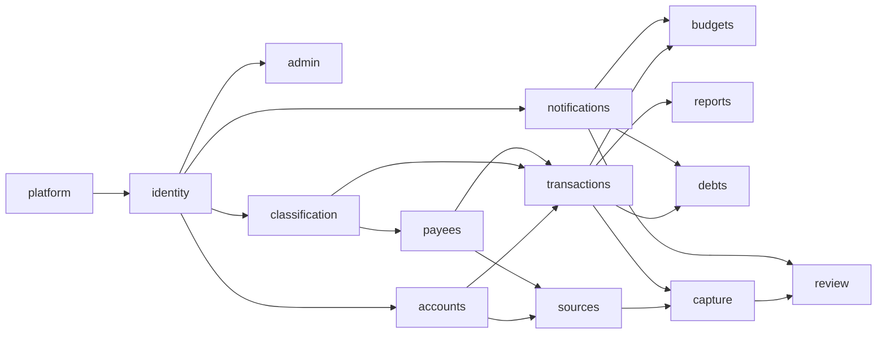

# Budmon: Spec Summary

Based on the [project brief](./project-brief.md), the user's [initial description](./notes/2026-10-04-initial-idea.md) and their [round 2 answers](./notes/2026-10-04-round-2-answers.md) (cited as R2-Qn). Each module below is designed with `/design-module <module>`.

**Conventions in this document**

- **Decided** means the user stated it (with its source). Anything inferred is marked *(assumption Ax)* and listed in section 8.
- `[NEEDS INPUT: ...]` marks a gap the user must close before the affected module is designed.
- **MVP?** column values:
  - `MVP`: in the first version. The scope (stage B) is decided; the placement of individual stories is the analyst's recommendation unless marked decided.
  - `Later`: not in the first version.
  - `TBD`: depends on an open question.

## Changelog

| Version | Date | Change |
| ------- | ---- | ------ |
| 0.1     | 2026-10-04 | Initial draft (interview round 1) |
| 0.2     | 2026-10-04 | Round 2 answers folded in. MVP reaches stage B (R2-Q3). `budgets` written as a core MVP module: conditions, amount or percentage, nesting, overlap, custom periods (R2-Q2). Native Android first (R2-Q3). Shared-account roles admin, member and viewer (R2-Q4). Per-account currency, daily rates, cross-currency transfers with fees and the actual rate applied (R2-Q5). No hard-coded bank list (R2-Q5). Unreviewed captures count in balances, flagged, with a review-status filter (R2-Q6). Review teaches sender-name-to-payee and payee-to-purpose links (R2-Q6). Auto-confirmation for known single-purpose payees, never for new payees (R2-Q6). AI provider rollout (R2-Q7). Raw messages not kept after processing, plus an opt-in raw-data donation setting (R2-Q7). Build order and MVP cut updated. |
| 0.3     | 2026-10-04 | Audience decided (R2-Q1): a small invited group first; going public is a hoped-for goal, not a commitment. `identity` sign-up is invite-only (IDN-US-1, new IDN-US-9, IDN-BR-3). Gmail stays in Google's testing mode; public-launch work is Later. A5 replaced by the decision. |
| 0.4     | 2026-10-04 | Round 3 answers folded in. SMS in the MVP; AI right after it (R3-Q2: SRC-US-2, SRC-US-5, CAP-US-2). Templates made by highlighting and labelling (R3-Q2: CAP-US-1). Budgets: percentage bases (R3-Q3, BUD-US-3), own conditions only plus chosen accounts, alerts only, rollover later (R3-Q4: BUD-US-1, 4, 8, 9, BUD-BR-7, 8). Shared-account vocabulary (R3-Q5: ACC-BR-7, CLS-US-4, 5, CLS-BR-3, PAY-US-6). Transfer fees and conversion rates (R3-Q6: XC-3, TXN-US-5, TXN-BR-3). Offline entry (R3-Q7: XC-22, TXN-US-10). |
| 0.5     | 2026-10-04 | Round 4 answers folded in. Sign-in by email + password and by Google, optional two-step verification, sessions of about a month (R4-Q1: IDN-US-1, 2, 8, XC-18). Any user can invite; 7-day expiry; user cap; new `admin` module for the product owner's portal (R4-Q2: IDN-US-9, section 4.13, built second). Deletion with a 7-day grace period; export in the MVP (R4-Q3: XC-16, XC-17, IDN-US-6, 7). Credit cards are their own type (R4-Q4: ACC-US-1, ACC-BR-8). Balance corrections are admin-only (R4-Q5: ACC-US-9). Flat purposes (the analyst's reading, to be confirmed); tips as split lines; draft default purposes (R4-Q6: section 4.3, TXN-US-4, A6). Vocabularies unlinked; budgets cover all accounts by default (R4-Q7: CLS-BR-3, BUD-US-1, BUD-BR-9). |
| 0.6     | 2026-10-04 | Round 5 answers folded in. Admin portal: account details only, delete, ban by email, invite, per-user invite allowance and feature switches (R5-Q1: section 1, ADM-US-1, 4, 5, 7, ADM-BR-4, IDN-US-9). Budget rules match purposes by name, ignoring case (R5-Q2: BUD-US-1, BUD-BR-10). Two-level purposes in the MVP, with the default list redrafted (R5-Q3 (i): section 4.3, CLS-BR-4). Separate income and expense lists (R5-Q3 (ii): CLS-BR-2). Members can delete their own entries, viewers see the whole account, and the creator isn't protected (R5-Q3 (iii)-(v): ACC-BR-2, ACC-US-5). Only amount, account and date required; future-dated entries; receipts later (R5-Q4: TXN-US-1, TXN-US-11, XC-4). Automatic Google sign-in linking; several Gmail inboxes per user (R5-Q5: IDN-BR-1, A30). |
| 0.7     | 2026-10-05 | Round 6 answers folded in. Owner deletion uses the 7-day window; sole-admin shared accounts go to the longest-standing member, with an owner override (pick an admin or freeze the account) and an email to the user (R6-Q1: ADM-US-4, ADM-US-8, ACC-BR-9). Parent-purpose rules include children, with a "this purpose only" option; parent purposes can be used directly (R6-Q2: BUD-BR-10, CLS-BR-4). Notification channels, quiet hours and a daily cap (R6-Q3: XC-27, XC-28). Default purposes accepted for now (R6-Q4: CLS-US-1). Invite allowance 3; feature switches for Gmail, SMS, invitations (and AI later), on by default (R6-Q5: ADM-US-5, ADM-US-7). Payees multi-purpose by default; single-purpose and default-purpose suggestions (R6-Q6: PAY-US-5, PAY-US-7). A split line can change account; payee and date shared; refunds count when they arrive; one-tap tip (R6-Q7: TXN-US-3, TXN-US-4, TXN-BR-5, TXN-BR-8). |
| 0.8     | 2026-10-05 | Round 7 answers folded in. Auto-confirmation on by default (R7-Q1: REV-US-8). Split totals across accounts, same currency only (R7-Q2: TXN-US-3, TXN-BR-9). Captures for frozen accounts are processed on unfreeze (R7-Q3: ACC-BR-9, CAP-BR-7). Fast review as a core principle (R7-Q5: XC-23). Budget period kinds, 80%/100% alerts, counting by entry author, shared budgets later (R7-Q7: BUD-US-6, 8, 10, BUD-BR-11). Section 9 rewritten as a numbered list of proposals for the remaining gaps. |
| 0.9     | 2026-10-05 | New cross-cutting `platform` module (section 4.14, prefix `PLT`), first in the build order. It records the user's technology decisions ([platform decisions](./notes/2026-10-05-platform-decisions.md)) and the clean-up of the current repo. Section 7 now links to the [codebase review](./codebase-review.md) and records the user's acceptance of its recommendations. Section 6 gains the platform's external services. Round 8 items untouched. |

## 1. Users and roles

Sharing is **per account** (decided, R2-Q4). A "household" is simply a group of people sharing one or more accounts, such as a common "house money" cash account. There is no separate household entity. [NEEDS INPUT, later round: is a household grouping wanted later as a convenience, for example "invite these 3 people to all of these accounts at once"?]

| Role | Who | Can see and do |
| ---- | --- | -------------- |
| **User** | Anyone with a Budmon login. In the first version, only people who have been invited (decided, R2-Q1). | Everything for their own accounts, payees, purposes, tags, transactions, debts, budgets, sources and settings. Nothing of another user's unless it's shared with them. |
| **Account admin** (decided, R2-Q4) | Usually the creator of the account; an admin can make other members admins. | Any change to the account: settings, sharing, roles, archiving. Creates entries, and edits or deletes anyone's entries, including other admins'. |
| **Account member** (decided, R2-Q4) | A user invited with the member role. | Sees the account and its entries. Creates transactions and transfers on it. Edits and deletes only the entries they created *(assumption A13: "edit" includes delete)*. |
| **Account viewer** (decided, R2-Q4) | For example, someone who has moved out of the household. | View only. What a viewer sees may differ per viewer; that refinement is later (R2-Q4). In the first version, a viewer sees the whole account *(assumption A15)*. |
| **Counterparty user** | Another Budmon user involved in a loan. | Accept or decline a loan addressed to them (later, see `debts`). |
| **Off-system counterparty** | A person or entity who isn't a Budmon user. | No access. A label debts are recorded against. |

**Product owner** (decided, R4-Q2): you, running Budmon for the invited group. This is a Budmon-wide role, not an account role. You manage users, invitations, permissions and the user cap through the admin portal (`admin`, section 4.13). (Decided, R5-Q1) The portal shows account details only: name, email, status, last active, and the number of connected sources. It never shows users' financial data. You are the only portal owner; co-owners aren't planned for the MVP *(assumption A28)*.

## 2. Glossary

| Term | Definition |
| ---- | ---------- |
| **Account** | A place money is held: a bank account, an online wallet, cash, or another kind. Each account has its own currency (decided, R2-Q5) and a balance. Not to be confused with the user's login (*Budmon user* or *profile*). |
| **Shared account** | An account with more than one user, each holding a role (admin, member or viewer). |
| **Transaction** | Money entering or leaving one account on a date: an *expense* or *income*. It has an amount, account, date, payee, purpose, tags, a note, a *review status*, and possibly splits. |
| **Review status** | *Confirmed* (entered manually, or reviewed by the user), *Auto-confirmed* (captured and confirmed by rule, REV-US-8), or *Needs review* (captured, not yet reviewed). See R2-Q6. |
| **Split line** | One part of a split transaction, with its own amount, purpose, tags and note. The lines add up to the total. |
| **Transfer** | Money moving between two accounts. When the currencies differ, it has a *sent amount*, a *received amount*, an optional *fee*, and the *applied rate* that results, which can differ from the market rate (decided, R2-Q5). |
| **Market rate** | The exchange rate Budmon fetches daily (decided, R2-Q5), used for conversions where no applied rate exists. |
| **Base currency** | The user's chosen currency for totals across accounts, budgets and reports. |
| **Refund** | An incoming transaction linked to an earlier expense (or split line) that it partly or fully reverses. |
| **Purpose** | What the money was for; what other apps call a *category* *(assumption A1)*. One per transaction or split line. |
| **Tag** | A free label, such as "subscription" or "tip". Any number per transaction or split line. |
| **Payee** | Who was paid or who paid, under the name the user uses. A payee is either *single-purpose* (always the same purpose) or *multi-purpose*; the user can change this at any time (decided, R2-Q6). |
| **Payee alias** | A name that appears in messages for a payee. One payee has many aliases. |
| **Debt / loan** | Money owed by or to the user, with a counterparty, an outstanding amount and an optional due date. |
| **Source** | A connected place messages are read from: a Gmail account, or the Android phone's SMS. |
| **Scan scope** | The user's rule for which messages a source may read: *only listed senders*, *everything except excluded senders*, or *everything*. |
| **Sender** | An email address, domain or SMS sender ID. Its role is *financial institution* (the source of truth) or *vendor*. |
| **Template** | A user's rule for extracting fields from one sender's messages of one message type. Built per user; there's no built-in bank list (decided, R2-Q5). |
| **Captured transaction** | A transaction created by automation from one or more messages. It's in the ledger straight away with status *Needs review* or *Auto-confirmed* (decided, R2-Q6). |
| **Message reference** | An identifier of a source message (for example a Gmail message ID), with no content, kept so the original can be opened at the source *(assumption A12)*. |
| **Balance** | See XC-4. |
| **Budget** | A spending plan for a period, defined by conditions and an amount or percentage. See `budgets`. |
| **Budget condition** | A rule selecting which transactions count toward a budget: purposes, tags, and possibly payees or accounts, combined with AND, OR and NOT (decided, R2-Q2). |
| **Period** | A span of time a budget or report is calculated over. Budgets have custom periods (decided, R2-Q2). |

## 3. Cross-cutting requirements

### 3.1 Money and currencies

- **XC-1** Amounts are exact. No rounding drift; each currency is shown with its own number of decimals.
- **XC-2** (Decided, R2-Q5) Each account has its own currency. Each user has a base currency for totals.
- **XC-3** (Decided, R2-Q5) The backend fetches market exchange rates daily; more frequent updates come later. (Decided, R3-Q6) Reports and budgets convert a transaction at the market rate on its date. Net worth and current balance totals use today's rate.
- **XC-4** (Decided, R2-Q6) An account's balance includes every transaction, whether *Confirmed*, *Auto-confirmed* or *Needs review*. Transactions that need review are visibly flagged, and the balance shows how much of it is unreviewed *(assumption A16 on the display)*. (Decided, R5-Q4) Future-dated transactions are shown as "upcoming" and left out of the balance until their date.

### 3.2 Time, periods and time zones

- **XC-5** Each user has a time zone; dates are in that time zone. Captured transactions take the bank message's timestamp.
- **XC-6** (Decided, R2-Q2) Budgets use custom periods. [NEEDS INPUT, later round: is a "month" in reports a calendar month, or can it start on a chosen day such as payday? Proposal: reports follow a user-chosen month start day, defaulting to the 1st.]
- **XC-7** Back-dated entries are allowed and change historical balances, budgets and reports. No locking of past periods in the first version *(proposal; [NEEDS INPUT, later round: confirm])*.
- **XC-8** [NEEDS INPUT, later round: are recurring or scheduled transactions wanted? Proposal: later, alongside subscription detection.]

### 3.3 Privacy, security and data ownership

- **XC-9** (Decided) Every automated capability has a manual alternative.
- **XC-10** (Decided) AI is opt-in. [NEEDS INPUT, later round: one global switch, or a switch per feature? Proposal: a global switch plus per-feature switches.]
- **XC-11** (Decided) Only in-scope messages are read. A message outside the scope is never stored or sent to AI.
- **XC-12** (Decided, R2-Q7) AI provider rollout: first a third-party LLM service, then a Budmon-hosted model, then an endpoint the user hosts and configures. Users always know which provider handles their data.
- **XC-13** (Decided, R2-Q7) Raw message and email content is **not stored after processing**. Only templates and extracted data are kept, and this is a headline commitment of the privacy policy. The only exception is the opt-in donation setting (SRC-US-10). Budmon keeps a message reference with no content *(assumption A12)*.
- **XC-14** Disconnecting a source stops reading immediately and revokes access. Transactions already captured stay in the ledger. [NEEDS INPUT, later round: are that source's sender list and templates kept for a possible reconnection? Proposal: kept until the user deletes them.]
- **XC-15** A user only sees another user's data through an account role or an accepted loan.
- **XC-16** (Decided, R4-Q3) Deleting a Budmon account starts a 7-day grace period during which the user can undo it. After that, all their data is erased. Before deletion, shared accounts where they're the only admin must be handed to someone else. Entries they made on shared accounts stay, attributed to "deleted user".
- **XC-17** (Decided, R4-Q3) A user can export all their data as CSV and JSON at any time. This is in the MVP.
- **XC-18** (Decided, R4-Q1) Two-step verification is optional, using an authenticator app. Sessions are long-lived: the refresh token stays valid for about a month.

### 3.4 Platforms, UX principles and accessibility

- **XC-19** (Decided, R2-Q3) The first platforms are the backend, the web app and a **native Android app**. More platforms (iOS, desktop via Electron) come later.
- **XC-20** (Decided) Everything, including automation setup, can be done from both the web app and the Android app. [NEEDS INPUT, later round: any feature that is web-first or Android-first? SMS is Android-only by nature.]
- **XC-21** (Decided, R2-Q3) Android first; iOS later.
- **XC-22** (Decided, R3-Q7) The Android app lets the user record **new** transactions (including transfers) offline; they sync when the connection returns. Everything else (editing, review, budgets) needs a connection in the first version. Full offline use, including review, may come later. [NEEDS INPUT, later round: are offline entries shown in balances on the device before they sync? Proposal: yes, marked as "not yet synced".]
- **XC-23** (Decided core principle, R7-Q5: "reviews need to be fast otherwise what's the point?") The median review of a captured transaction takes under 5 seconds. Recording a manual transaction is fast: at most [NEEDS INPUT, later round: e.g. 4] taps after opening the app. Confirming a captured transaction that needs no change takes one action.
- **XC-24** [NEEDS INPUT, later round: languages and right-to-left layouts; accessibility target (proposal: WCAG 2.2 AA on web, Android accessibility guidelines); tone (proposal: calm and plain, never guilt-inducing).]

### 3.5 Notifications

- **XC-25** (Decided) Reminders to record data are based on when the user last recorded something and on their preferences; cash withdrawals are a key trigger.
- **XC-26** Every kind of notification can be turned off individually.
- **XC-27** (Decided, R6-Q3) Channels in the MVP are Android push and in-app. Email is used only for account matters (invitations, password reset, deletion notices).
- **XC-28** (Decided, R6-Q3) Users set their own quiet hours. At most one data-entry reminder is sent per day. The reminder behaviour may be revisited after the MVP (R6-Q3).

### 3.6 Performance and availability expectations

- **XC-29** [NEEDS INPUT, later round: how soon after a message arrives should the captured transaction appear? Proposal: within 5 minutes for Gmail, near-instant for SMS.]
- **XC-30** [NEEDS INPUT, later round: how far back to scan when a source is first connected? Proposal: the user chooses, up to 90 days.]
- **XC-31** [NEEDS INPUT, later round: availability expectations. Proposal: best effort during the early phase.]

## 4. Modules

Fourteen modules:

- **Core ledger** (five): `identity`, `accounts`, `classification`, `payees`, `transactions`.
- **Operation** (one): `admin`, the product owner's portal (R4-Q2).
- **Foundations** (one): `platform`, the shared technical base every other module builds on (section 4.14). It's built first.
- **Planning and follow-up** (four): `notifications`, `budgets`, `reports`, `debts`.
- **Automated capture** (three): `sources`, `capture`, `review`.

### 4.1 `identity`: Users, sign-in and profile (prefix `IDN`)

- **Purpose:** who the user is, how they sign in, their preferences, and their control over their own data.
- **In scope:** invite-only sign-up (decided, R2-Q1), invitations, sign-in and sign-out, sessions, profile (name, base currency, time zone, language), finding another user, data export, account deletion.
- **Out of scope:** money accounts and roles (`accounts`); notification preferences (`notifications`); sources and the raw-data donation setting (`sources`).
- **Depends on:** none.

**Stories**

| ID | As a… | I want… | So that… | Acceptance criteria | MVP? |
| -- | ----- | ------- | -------- | ------------------- | ---- |
| IDN-US-1 | invited person | to create a Budmon user from my invitation | I can start | Sign-up works only with a valid, unused, unexpired invitation (decided, R2-Q1); without one, the sign-up page explains that Budmon is invite-only. Sign-up with email + password or with Google (decided, R4-Q1); choose base currency and time zone; land on an empty state that tells me to add my first account. | MVP |
| IDN-US-2 | user | to stay signed in on web and Android | I don't log in every time | Sessions persist; a session stays valid for about a month without signing in again (decided, R4-Q1); I can see and sign out my active sessions. | MVP |
| IDN-US-3 | user | to edit my profile and preferences | totals and dates make sense to me | Name, base currency, time zone and language; changing the time zone doesn't move existing transactions in time. | MVP |
| IDN-US-4 | user with a password | to reset a forgotten password | I can get back in | Reset link by email; expires; other sessions are signed out. | MVP |
| IDN-US-5 | user | to find another Budmon user | I can share an account or lend to them | Exact email or invite link only; no directory browsing. | MVP |
| IDN-US-6 | user | to export all my data | I own my data | CSV and JSON, covering everything I own (XC-17). | MVP (decided, R4-Q3) |
| IDN-US-7 | user | to delete my Budmon user and data | I can leave completely | Confirmation; 7-day undo period (XC-16); sources are disconnected immediately; I'm asked to hand over shared accounts where I'm the only admin. | MVP |
| IDN-US-8 | user | to turn on two-step verification with an authenticator app | my data is safer | Optional (decided, R4-Q1); recovery codes are given when I turn it on *(assumption A26)*. | MVP |
| IDN-US-9 | user (any user, decided, R4-Q2) | to invite someone to Budmon by email | they can join the invited group (decided, R2-Q1) | The invitation expires after 7 days and can be revoked before use (decided, R4-Q2). Inviting someone to a shared account (ACC-US-4) also sends a Budmon invitation if they aren't a user yet (decided, R4-Q2). It can't be accepted once the user cap is reached (ADM-US-3). I can send only as many invitations as my allowance permits, which the product owner sets (ADM-US-5). Banned email addresses can't be invited (ADM-BR-4). | MVP |
| IDN-US-10 | visitor | to sign up without an invitation | Budmon can grow | Later, and only if Budmon goes public, which is a hoped-for goal, not a commitment (R2-Q1). | Later |

**Business rules**

| ID | Rule |
| -- | ---- |
| IDN-BR-1 | One Budmon user per email address. (Decided, R5-Q5) Signing in with Google using an email that already has a password account links the two automatically. This happens only when Google reports the email as verified *(assumption A32)*. |
| IDN-BR-2 | Users can't be found by partial search. |
| IDN-BR-3 | (Decided, R2-Q1) In the first version, a Budmon user can only be created from a valid invitation. Nothing in the design should prevent switching to open sign-up later. |

### 4.2 `accounts`: Money accounts and sharing (prefix `ACC`)

- **Purpose:** the places money is held, their balances, and sharing them through roles.
- **In scope:** account types, creation, editing, archiving, opening balance, balance (XC-4), net worth, balance correction, sharing (invitations, roles, role changes, leaving, removal), identifiers used for capture matching.
- **Out of scope:** transactions (`transactions`); linking senders to accounts (`sources`); per-viewer visibility rules (later, R2-Q4).
- **Depends on:** `identity`.

**Stories**

| ID | As a… | I want… | So that… | Acceptance criteria | MVP? |
| -- | ----- | ------- | -------- | ------------------- | ---- |
| ACC-US-1 | user | to create an account | I can record money held there | Types: bank, online wallet, cash, **credit card**, other (decided, R4-Q4). Loan and mortgage types come later (R4-Q4). Fields: name, type, currency (decided, R2-Q5), opening balance and date, optional institution, optional identifiers (for example the last 4 digits). I become its admin. | MVP |
| ACC-US-2 | user | to see my accounts with balances and a total | I know where I stand | Includes shared accounts I hold any role on, marked as shared with my role shown; each balance shows its unreviewed part (XC-4); total in base currency at today's market rate. | MVP |
| ACC-US-3 | admin | to edit or archive an account | the list stays current | Archived accounts are hidden from pickers and totals but keep their history. | MVP |
| ACC-US-4 | admin | to invite someone with a role | my household can use "house money" together (decided, R2-Q4) | Invite by IDN-US-5 as admin, member or viewer; the invitee accepts or declines. | MVP *(A11)* |
| ACC-US-5 | admin | to change a person's role, including making them admin | responsibilities can shift (decided, R2-Q4) | Any role change, for example member to viewer when someone moves out (decided example, R2-Q4). (Decided, R5-Q3) The creator has no special protection: any admin can demote or remove them. | MVP *(A11)* |
| ACC-US-6 | member or viewer | to leave a shared account, and as admin to remove someone | sharing can end cleanly | After leaving, the account disappears from my lists, totals and budgets; entries I created stay on the account, attributed to me. | MVP *(A11)* |
| ACC-US-7 | anyone on a shared account | to see who created and last changed each entry | we avoid confusion | Shown on every transaction and transfer. | MVP *(A11)* |
| ACC-US-8 | admin | to restrict what a particular viewer can see | e.g. hide some details from someone who has moved out | (Decided as later, R2-Q4.) To be specified. | Later |
| ACC-US-9 | account admin (the owner of a personal account is its admin) | to correct an account's balance | it matches reality | Entering the real balance creates a labelled adjustment transaction. Admins only (decided, R4-Q5). | MVP |

**Business rules**

| ID | Rule |
| -- | ---- |
| ACC-BR-1 | (Decided, R2-Q5) An account has exactly one currency. |
| ACC-BR-2 | (Decided, R2-Q4) The admin role allows any change to the account and to any entry on it. Member: create entries, and edit or delete only their own (decided, R5-Q3). Viewer: read only, seeing the whole account until per-viewer visibility exists (decided, R5-Q3). |
| ACC-BR-3 | An account always has at least one admin; the last admin can't leave without handing the role over *(assumption A17)*. |
| ACC-BR-4 | People on a shared account see only that account, never each other's other accounts. |
| ACC-BR-5 | (Decided, R2-Q4, from the example) A member may transfer from a shared account to one of their own personal accounts. The other people on the shared account see the shared side, with the destination shown only as "<person>'s account" *(assumption A14)*. |
| ACC-BR-6 | Balances are never edited directly; corrections create adjustment transactions. |
| ACC-BR-9 | (Decided, R6-Q1) A **frozen** account is read-only for everyone on it: no new entries and no edits. Only the product owner can freeze or unfreeze an account, and only through ADM-US-8 *(assumption A40)*. (Decided, R7-Q3) Captures for a frozen account aren't recorded while it's frozen; they're processed when it's unfrozen (CAP-BR-7). |
| ACC-BR-8 | (Decided, R4-Q4) A credit card's balance is shown as the amount owed. Card purchases are expenses on the card account. Paying the card off from another account is a transfer. Statement cycles and due-date reminders come later. |
| ACC-BR-7 | (Decided, R3-Q5) A shared account has its own vocabulary of purposes, tags, payees and payee aliases, managed by its admins. When the account becomes shared, the vocabulary starts as a copy of the creating admin's set. Admins can copy in items that other members have marked as shared. Entries on the account use only the account's vocabulary. A personal account uses its owner's personal set *(assumption A21)*. |

### 4.3 `classification`: Purposes and tags (prefix `CLS`)

- **Purpose:** the vocabulary for what money was for.
- **In scope:** default purposes and tags, custom ones, editing, archiving, merging. (Decided, R5-Q3) Purposes have **two levels** in the MVP, a parent and children (for example Food > Sweets). Unlimited nesting comes later.
- **Out of scope:** purpose suggestions (`capture`); budgets (`budgets`).
- **Depends on:** `identity`.

**Stories**

| ID | As a… | I want… | So that… | Acceptance criteria | MVP? |
| -- | ----- | ------- | -------- | ------------------- | ---- |
| CLS-US-1 | new user | default purposes and tags | I can start without setup | Created at sign-up from the default list below (accepted "for now", R6-Q4), including the "subscription" and "tip" tags. | MVP |
| CLS-US-2 | user | to create, rename and archive purposes and tags | they fit my life | Renaming applies everywhere, including budget conditions; archived items are hidden from pickers but stay on history and in budgets. | MVP |
| CLS-US-3 | user | to merge two purposes or two tags | duplicates go away | Uses, including budget conditions, move to the survivor. | Later |
| CLS-US-4 | user | to mark items of my personal vocabulary (purposes, tags, payees) as shared/visible | admins of accounts I'm on can reuse them (decided, R3-Q5) | Hidden by default *(assumption A22)*; visible only to people who share at least one account with me *(assumption A23)*. | MVP *(A11)* |
| CLS-US-5 | admin of a shared account | to manage the account's own vocabulary | entries on the account are classified consistently (decided, R3-Q5) | Seeded from the creating admin's set; admins add, rename and archive items; admins can copy items that members have marked as shared (CLS-US-4); members and viewers can't change it. [NEEDS INPUT, later round: can members create a new purpose or tag inline while entering a transaction?] | MVP *(A11)* |

**Business rules**

| ID | Rule |
| -- | ---- |
| CLS-BR-1 | Names are unique per vocabulary, ignoring case. |
| CLS-BR-2 | (Decided, R5-Q3: "I suppose") Income purposes and expense purposes are separate lists. Tags apply to both. |
| CLS-BR-4 | (Decided, R5-Q3) A purpose is either a top-level purpose or a child of one; children can't have children in the MVP. A transaction can use either a parent or a child purpose (decided, R6-Q2). A child's name is unique within its parent, so "Food > Other" and "Shopping > Other" can coexist *(assumption A35)*. |
| CLS-BR-3 | (Decided, R3-Q5 and R4-Q7) A vocabulary belongs either to a user (personal) or to a shared account. A copied item is independent of its original once copied; there's no linking between vocabularies in the MVP. Linking may come later. |

**Default purposes** (drafted by the analyst, R4-Q6; accepted "for now", R6-Q4; two levels, per R5-Q3; shown as *Parent: children*):

- *Expense purposes:*
  - Food: Groceries, Dining out, Coffee & snacks, Delivery
  - Housing: Rent or mortgage, Utilities, Phone & internet, Maintenance & repairs, Furniture & household
  - Transport: Public transport, Taxis & rides, Fuel, Car maintenance, Parking & tolls
  - Health: Medical, Pharmacy, Fitness
  - Personal: Personal care, Clothing & shoes
  - Shopping: Electronics, Books & hobbies, Other shopping
  - Entertainment: Streaming & media, Outings & events, Games
  - Education: Tuition, Courses & books
  - Travel: Flights, Accommodation, Spending abroad
  - Family: Kids, Pets
  - Gifts & donations: Gifts given, Charity
  - Financial: Bank & transfer fees (used by TXN-US-5), Insurance, Taxes & government, Interest paid
  - Other expenses
- *Income purposes:*
  - Salary: Salary, Bonus
  - Business & freelance
  - Investments: Interest, Dividends
  - Gifts received
  - Government benefits
  - Other income
- *Default tags:* subscription, tip.

Refunds aren't an income purpose; they're linked to the original expense (TXN-US-7). Cash withdrawals and credit-card payoffs are transfers, so they need no purpose. Income and expense lists are separate (CLS-BR-2).

### 4.4 `payees`: Payees, aliases and payee behaviour (prefix `PAY`)

- **Purpose:** who money goes to or comes from, the names they appear under in messages, and how predictable they are.
- **In scope:**
  - payees and aliases (one payee, many aliases);
  - a default purpose and default tags per payee;
  - the single-purpose/multi-purpose classification (decided, R2-Q6);
  - merging payees.
- **Out of scope:** linking vendor senders (`sources`); matching during capture (`capture`); auto-confirmation itself (`review`).
- **Depends on:** `identity`, `classification`.

**Stories**

| ID | As a… | I want… | So that… | Acceptance criteria | MVP? |
| -- | ----- | ------- | -------- | ------------------- | ---- |
| PAY-US-1 | user | to create and edit payees | transactions use my names | Name, default purpose, default tags; created inline from entry or review too. | MVP |
| PAY-US-2 | user | several aliases per payee | "AMZN Mktp EG" and "Amazon.eg" both mean "Amazon" | Aliases are managed on the payee screen and added from review (REV-US-3); an alias belongs to one payee. | MVP |
| PAY-US-3 | user | to merge payees | duplicates from automation are cleaned up | Transactions and aliases move to the survivor; its single/multi-purpose setting is kept. | MVP |
| PAY-US-4 | user | a payee's defaults to pre-fill new transactions | entry and review are faster | Pre-filled, and still editable. | MVP |
| PAY-US-6 | admin of a shared account | the account's own payees and aliases | captures on the account resolve consistently (decided, R3-Q5) | Follows CLS-US-5: seeded from the creating admin's payees, extendable by copying members' shared payees. | MVP *(A11)* |
| PAY-US-5 | user | to mark a payee as single-purpose or multi-purpose, and change it later | auto-confirmation follows how predictable the payee is (decided, R2-Q6: "cuz sometimes stuff change") | A toggle on the payee; new payees are multi-purpose (decided, R6-Q6); a single-purpose payee must have a default purpose; changing it affects only future captures. | MVP |
| PAY-US-7 | user | Budmon to notice when I keep choosing the same purpose for a payee | setup improves without effort (decided, R6-Q6) | After the same purpose has been chosen for a payee [NEEDS INPUT, later round: e.g. 3] times in a row, Budmon suggests marking the payee single-purpose. If I decline, it suggests making that purpose the payee's default instead; the default pre-fills, and I can still change it in review. Declined suggestions aren't repeated until the pattern changes *(assumption A37)*. | MVP |

**Business rules**

| ID | Rule |
| -- | ---- |
| PAY-BR-1 | (Decided) A payee has many aliases; an alias resolves to exactly one payee per vocabulary (see ACC-BR-7 for shared accounts). |
| PAY-BR-2 | (Decided) An unknown name from a message creates a payee with that name and its first alias. |
| PAY-BR-3 | Alias matching ignores case and surrounding whitespace. [NEEDS INPUT, later round: patterns for trailing reference numbers, for example "UBER *TRIP 8F3K"?] |
| PAY-BR-4 | (Decided, R2-Q6 and R6-Q6) A newly created payee is multi-purpose until the user makes it single-purpose; its captures are never auto-confirmed. A multi-purpose payee can still have a default purpose. |

### 4.5 `transactions`: Transactions, splits, transfers and refunds (prefix `TXN`)

- **Purpose:** the ledger.
- **In scope:**
  - income and expense entry, splits and tips;
  - transfers, including cross-currency transfers with fees and the applied rate (decided, R2-Q5);
  - cash withdrawals and refunds;
  - review status on every transaction (decided, R2-Q6);
  - search and filters, including by review status (decided, R2-Q6);
  - future-dated entries (decided, R5-Q4).
  - Receipt photos are later (decided, R5-Q4).
- **Out of scope:** loan semantics (`debts`); creating transactions from messages (`capture`); the review workflow (`review`).
- **Depends on:** `accounts`, `classification`, `payees`.
- **Note:** this is a large module; the planner may design it in slices.

**Stories**

| ID | As a… | I want… | So that… | Acceptance criteria | MVP? |
| -- | ----- | ------- | -------- | ------------------- | ---- |
| TXN-US-1 | user | to record an expense or income | my ledger is complete | Type, amount (in the account's currency), account, date (default today; time optional), payee, purpose, tags, note. Required: amount, account, date only (decided, R5-Q4). Manually entered transactions are *Confirmed*. | MVP |
| TXN-US-2 | user with rights on the account | to edit or delete a transaction | I can fix mistakes | Rights per ACC-BR-2; balances and budgets recalculate; deleting a refunded or refunding transaction removes only the link. | MVP |
| TXN-US-3 | user | to split a transaction into lines | a mixed order counts against different purposes (decided) | Lines with amount, purpose, tags and note must add up to the total before saving. Each line starts with the transaction's account, payee and date (decided, R6-Q7). The account can be changed per line, for example a card payment with a cash tip. Payee and date stay shared *(assumption A8, revised)*. (Decided, R7-Q2) The total is the sum of all lines, for example card 100 + cash tip 10 = 110. On a captured transaction, the lines on the captured account must still add up to the bank's amount; lines on other accounts come on top. | MVP |
| TXN-US-4 | user | to mark part of a payment as a tip | I learn what I spend on tips (decided) | (Decided, R4-Q6) A tip is its own split line tagged "tip". It keeps the purpose of what it was for (for example Dining out), because the tag "only applies to part of the money paid". (Decided, R6-Q7) A one-tap "add tip" button creates the tip split line, with the tip tag applied and the purpose taken from the main line. | MVP |
| TXN-US-5 | user | to record a transfer between two accounts I can use | moving money isn't spending (decided) | From account, to account, date and note. Same currency: one amount. Different currencies: sent amount and received amount, with the applied rate shown alongside the market rate for that day. An optional fee is recorded as a separate expense line on the source account under the "Financial > Bank & transfer fees" purpose. The gap between the applied rate and the market rate is also shown as an implied cost (decided, R2-Q5 and R3-Q6). [NEEDS INPUT, later round: does the implied cost count as spending in reports and budgets, or is it information only? Proposal: information only, so the fee isn't counted twice.] Allowed from a shared account to my personal account (ACC-BR-5). | MVP |
| TXN-US-6 | user | to record a cash withdrawal | my cash account is right | A transfer from a bank account to a cash account, with an optional fee; triggers NTF-US-3. | MVP |
| TXN-US-7 | user | to record a refund linked to the original purchase (decided) | spending reflects what I kept | Pick the original expense or split line; amount defaults to the remaining refundable amount; both sides show the link. | MVP |
| TXN-US-8 | user | to search and filter transactions | I find things quickly | Date range, account, payee, purpose, tag, amount, note text, created-by (shared accounts), and **review status** (decided, R2-Q6). | MVP |
| TXN-US-11 | user | to enter a transaction with a future date | I can plan for known upcoming payments (decided, R5-Q4) | Shown as "upcoming"; not counted in the balance until its date (XC-4). [NEEDS INPUT, later round: do upcoming entries count in budgets for the period they fall in, before their date?] | MVP |
| TXN-US-10 | Android user | to record a new transaction or transfer offline | I can log cash spending without a signal (decided, R3-Q7) | Saved on the device and synced when back online; marked "not yet synced" until then; after syncing it goes through the duplicate check against captures (CAP-US-6). | MVP |
| TXN-US-9 | user | to see where a transaction came from | I trust my ledger | Origin (manual, captured, adjustment); for captured ones, sender, received time, extracted fields, and a link to open the original at the source (A12). No raw content is shown from Budmon's storage (XC-13). | MVP |

**Business rules**

| ID | Rule |
| -- | ---- |
| TXN-BR-1 | Amounts are positive; direction comes from the type. |
| TXN-BR-2 | (Decided) Split lines add up exactly to the total. |
| TXN-BR-3 | A transfer is never income or expense. (Decided, R3-Q6) A transfer fee is a separate expense line; the implied exchange-rate cost is shown alongside it. |
| TXN-BR-4 | (Decided) A refund links to one earlier expense or split line; refunds can't exceed the original amount in total. |
| TXN-BR-5 | (Decided, R6-Q7: "the refund waits for the refund to arrive") A refund reduces spending under the original purpose in the period the refund arrives, not the period of the original purchase. |
| TXN-BR-8 | (Decided, R6-Q7) A split line may use a different account from the transaction's default; each line changes the balance of its own account. |
| TXN-BR-9 | (Decided, R7-Q2) A transaction's total is the sum of its lines across all accounts. For a captured transaction, the lines on the captured account always add up to the amount in the bank message. In the MVP, every line must be in the transaction's currency, so lines can only move to accounts in that currency. |
| TXN-BR-6 | (Decided, R2-Q6) Every transaction has a review status. *Needs review* transactions count in balances, budgets and reports like any other, and are flagged wherever they appear. |
| TXN-BR-7 | (Decided, R2-Q5) In a cross-currency transfer, the sent and received amounts are what the user (or the message) says. The applied rate is derived from them, and it is never overwritten by the market rate. |

### 4.6 `notifications`: Reminders and alerts (prefix `NTF`)

- **Purpose:** prompting the user at the right moments.
- **In scope:**
  - data-entry and cash reminders (decided);
  - delivery of events raised by other modules: budget thresholds, debt due dates, the review queue, invitations, and loan requests later;
  - preferences, channels and quiet hours.
- **Out of scope:** deciding when another module's event happens.
- **Depends on:** `identity`.

**Stories**

| ID | As a… | I want… | So that… | Acceptance criteria | MVP? |
| -- | ----- | ------- | -------- | ------------------- | ---- |
| NTF-US-1 | user | a reminder when I haven't recorded anything for a while | my ledger doesn't lapse (decided) | Threshold and time of day set by me; recording or reviewing anything resets it. | MVP |
| NTF-US-2 | user | a regular reminder at a time I choose | I build a habit | Skipped if I already recorded something that day. [NEEDS INPUT, later round: wanted?] | TBD |
| NTF-US-3 | user | a follow-up after a cash withdrawal | I record what the cash goes on (decided) | Reminder after a delay I set. [NEEDS INPUT, later round: also when a cash account has had no expenses for N days?] | MVP |
| NTF-US-4 | user | to control each notification type and quiet hours | I'm not nagged | Per-type on/off; XC-27 and XC-28. | MVP |
| NTF-US-5 | user | an in-app list of recent notifications | I can act on one I missed | Actionable items open the right screen. | MVP |
| NTF-US-6 | user | a nudge when transactions need review | data gets refined (R2-Q6) | At most once a day, only when something needs review. | MVP |

**Business rules**

| ID | Rule |
| -- | ---- |
| NTF-BR-1 | Notifications respect the user's time zone and quiet hours. |
| NTF-BR-2 | A notification type that's turned off is never sent. |
| NTF-BR-3 | Data-entry reminders stop once the user records or reviews something. |

### 4.7 `budgets`: Budgets (prefix `BUD`)

- **Purpose:** letting users plan spending in whatever structure fits them: from one simple limit to "80% of my salary, of which 30% goes on food" (decided, R2-Q2).
- **In scope:**
  - budgets defined by conditions over purposes and tags, combined with AND, OR and NOT (decided);
  - amounts that are fixed or a percentage (decided), where the base of the percentage is the user's choice: a parent budget, actual matching income, or an amount the user enters (decided, R3-Q3);
  - nested budgets (decided);
  - one transaction counting toward several budgets (decided);
  - custom periods (decided);
  - progress views and threshold alerts.
- **Out of scope:** forecasting; automatic budget suggestions.
- **Depends on:** `classification`, `transactions`, `accounts`, `notifications`.
- **Note:** this is substantially bigger than a typical "limit per category" feature; the planner may slice it (conditions, amounts and percentages, nesting, periods, alerts).

**Stories**

| ID | As a… | I want… | So that… | Acceptance criteria | MVP? |
| -- | ----- | ------- | -------- | ------------------- | ---- |
| BUD-US-1 | user | to create a budget for transactions matching conditions I define | I can budget food, subscriptions, or anything else (decided) | Conditions on purposes and tags, combined with AND, OR and NOT, for example "purpose Food AND NOT tag groceries" (decided). The budget also lists which accounts it draws from, including shared accounts I'm on (decided, R3-Q4). By default a budget covers **all accounts I can see** (decided, R4-Q7). This includes accounts I create or join later *(assumption A31)*. (Decided, R5-Q2) A condition such as "purpose Food" matches by name, ignoring case, so it catches "Food" in my personal vocabulary and in every shared account's vocabulary the budget covers. (Decided, R6-Q2) A rule on a parent purpose includes its children unless I choose "this purpose only". [NEEDS INPUT, later round: can conditions also use payees or amount ranges?] The matching transactions are previewed while I edit. | MVP |
| BUD-US-2 | user | a budget with a fixed amount | I set a simple limit | Amount in base currency *(assumption A18)*. | MVP |
| BUD-US-3 | user | a budget set as a percentage | it follows my income or a parent budget (decided) | (Decided, R3-Q3) The base is one of: (i) the parent budget's amount; (ii) the actual income in the same period matching conditions I set (for example purpose Salary), using an expected amount I enter until the income actually arrives; (iii) an amount I enter. [NEEDS INPUT, later round: for (ii), if more or less income arrives than expected, does the budget follow the actual figure once anything arrives, or only once the total reaches the expected amount? Proposal: the actual figure once anything has arrived, with the expected amount shown alongside.] | MVP |
| BUD-US-4 | user | to nest budgets | "food is 30% of the 80% of my salary I plan to spend" (decided) | A child budget's amount can be a percentage of its parent's amount; the effective share of the root is shown (for example "≈24% of salary"). (Decided, R3-Q4) Each budget's spent amount comes only from its own conditions and accounts; children's spending isn't added to the parent automatically. Budmon warns when a child's conditions or accounts aren't covered by its parent's *(assumption A25)*. | MVP |
| BUD-US-5 | user | one transaction to count toward every budget it matches | "food" and "subscription" budgets both see a food subscription (decided) | Each budget's spent amount includes all matching transactions; no exclusivity between budgets. | MVP |
| BUD-US-6 | user | to choose each budget's period | budgets fit my life (decided: custom) | (Decided, R7-Q7) Monthly from a chosen start day, weekly, every N days/weeks/months from a start date, or a one-off date range. | MVP |
| BUD-US-7 | user | to see each budget's progress | I know where I stand | Budgeted, spent, remaining, and time left in the period; the part of "spent" that still needs review is shown separately (TXN-BR-6); the nested structure is shown as a tree. | MVP |
| BUD-US-8 | user | alerts as I approach or exceed a budget | I can adjust in time | Thresholds per budget, 80% and 100% by default (decided, R7-Q7), via `notifications`. (Decided, R3-Q4) Exceeding only triggers alerts; nothing is ever blocked. | MVP |
| BUD-US-9 | user | unspent and overspent amounts to carry into the next period, optionally per budget | my plan reflects past periods (decided, R3-Q4) | Future work; to be specified. | Later |
| BUD-US-10 | user | budgets that include shared-account transactions | household budgets work | A shared account can be chosen as one of the budget's accounts (BUD-US-1). Conditions on that account use the account's vocabulary (ACC-BR-7) and match by name (BUD-BR-10). (Decided, R7-Q7) By default a budget counts everyone's entries. It can be limited to entries created by specific people. Sharing a budget with the account's members comes later. | MVP |

**Business rules**

| ID | Rule |
| -- | ---- |
| BUD-BR-1 | (Decided, R2-Q2) A transaction counts toward every budget whose conditions it matches. |
| BUD-BR-2 | Split lines are matched individually: a line counts only if the line matches (its own purpose and tags). |
| BUD-BR-3 | Refunds matching a budget reduce its spent amount (consistent with TXN-BR-5). Transfers and loans never count *(assumption A10)*. |
| BUD-BR-4 | Amounts in other currencies are converted to base currency per XC-3. |
| BUD-BR-5 | A nested child's amount is derived from its parent's amount when set as a percentage, and changes when the parent's does. |
| BUD-BR-7 | (Decided, R3-Q4) A budget counts only transactions on its chosen accounts that match its own conditions. |
| BUD-BR-8 | (Decided, R3-Q3) A percentage-of-income budget uses the expected amount until matching income arrives in the period. |
| BUD-BR-11 | (Decided, R7-Q7) A budget can be limited to entries created by specific users; by default it counts entries by everyone. For captured entries, the author is the person whose source captured them *(assumption A41)*. |
| BUD-BR-9 | (Decided, R4-Q7) A new budget covers all accounts the user can see unless the user narrows it. |
| BUD-BR-10 | (Decided, R5-Q2) Purpose and tag conditions match by name, ignoring case, across every vocabulary the budget's accounts use. A child purpose is matched by its full name, for example "Food > Sweets" *(assumption A33)*. (Decided, R6-Q2) A rule on a parent purpose matches the parent and all its children, unless the rule is set to "this purpose only". Renaming an item changes which budgets it matches. |
| BUD-BR-6 | Budgets can be nested to any depth *(assumption A19; [NEEDS INPUT, later round: a depth limit?])*. A budget can't be its own ancestor. |

### 4.8 `reports`: Insights (prefix `RPT`)

- **Purpose:** showing what money did.
- **In scope:** spending and income by period, purpose, tag, payee and account; balances over time; tip totals. [NEEDS INPUT, later round: which reports matter most on day one?]
- **Out of scope:** forecasting; tax.
- **Depends on:** `transactions`, `classification`, `payees`, `accounts`.

**Stories**

| ID | As a… | I want… | So that… | Acceptance criteria | MVP? |
| -- | ----- | ------- | -------- | ------------------- | ---- |
| RPT-US-1 | user | spending by purpose for a period | I see where money goes | Split lines under their own purpose; refunds per TXN-BR-5; transfers and loans excluded; filter by review status. | MVP |
| RPT-US-2 | user | income vs expenses per period | I know whether I'm saving | Last [NEEDS INPUT, later round: e.g. 12] periods. | MVP |
| RPT-US-3 | user | totals by tag | I see tips and subscriptions (decided example) | Any tag, any period, with drill-down. | MVP |
| RPT-US-4 | user | spending by payee | I see who gets my money | Top payees with drill-down. | Later |
| RPT-US-5 | user | balances and net worth over time | I see the trend | Per account and total, in base currency. | Later |

**Business rules**

| ID | Rule |
| -- | ---- |
| RPT-BR-1 | (Decided, R2-Q6) Reports include transactions that need review by default, and can be filtered by review status. |
| RPT-BR-2 | (Decided, R3-Q6) Amounts in other currencies are converted at the market rate on each transaction's date; net worth uses today's rate (XC-3). |
| RPT-BR-3 | [NEEDS INPUT, later round: do my reports include shared-account entries created by others? Proposal: yes, with a filter.] |

### 4.9 `debts`: Debts and loans (prefix `DEBT`)

- **Purpose:** tracking money owed by and to the user.
- **In scope:** debts against off-system counterparties; user-to-user loans with acceptance (later); direction; due dates and check-ins; repayments; settling and write-offs.
- **Out of scope:** interest and amortisation [NEEDS INPUT, later round: confirm].
- **Depends on:** `identity`, `accounts`, `transactions`, `notifications`.

**Stories**

| ID | As a… | I want… | So that… | Acceptance criteria | MVP? |
| -- | ----- | ------- | -------- | ------------------- | ---- |
| DEBT-US-1 | user | to record money lent to or borrowed from someone who isn't a Budmon user | I keep track (decided) | Counterparty (reusable contact), direction, amount and currency, date, optional due date and note; optionally linked to the transaction that moved the money (marked as a loan). | MVP |
| DEBT-US-2 | user | a debt with no money moving through my accounts | "a friend paid for my dinner" | [NEEDS INPUT, later round: wanted?] | TBD |
| DEBT-US-3 | user | to record full or partial repayments | outstanding stays correct | Linked transactions reduce the outstanding amount; at zero the debt is settled. | MVP |
| DEBT-US-4 | user | to be asked on the due date whether it's been paid | I don't forget (decided) | Actions: *Paid*, *Need more time* (new date), *Update*. | MVP |
| DEBT-US-5 | user | all open debts, as "I owe" and "owed to me" | I know my position | Totals in base currency; overdue highlighted. | MVP |
| DEBT-US-6 | user | to write off a debt | it stops nagging me | Kept in history as written off. | Later |
| DEBT-US-7 | user | to lend to another Budmon user | it's recorded on both sides (decided) | Pending until accepted. [NEEDS INPUT, later: receiving account chosen by the receiver? Lender's side while pending?] | Later |
| DEBT-US-8 | counterparty user | to accept or decline a loan | nothing enters my ledger without consent (decided) | On acceptance it appears in my ledger and debts. | Later |
| DEBT-US-9 | either party | repayments to show on both sides | we agree on what's outstanding | [NEEDS INPUT, later] | Later |

**Business rules**

| ID | Rule |
| -- | ---- |
| DEBT-BR-1 | (Decided) Direction is *lent* or *borrowed*. |
| DEBT-BR-2 | Loans and repayments aren't income or expense in reports or budgets *(assumption A10)*. |
| DEBT-BR-3 | Outstanding = principal minus repayments; never below zero. |
| DEBT-BR-4 | (Decided) A loan to another Budmon user takes effect on their side only after acceptance. |

### 4.10 `sources`: Message sources and scan scope (prefix `SRC`)

- **Purpose:** connecting where messages arrive, and the user's rules for what may be read.
- **In scope:** Gmail accounts (several allowed); Android SMS (decided in the MVP, R3-Q2); scan-scope modes; senders and roles; linking senders to accounts and payees; AI sender discovery (opt-in); initial backfill; the raw-data donation setting (decided, R2-Q7).
- **Out of scope:** extracting fields (`capture`).
- **Depends on:** `identity`, `accounts`, `payees`.

**Stories**

| ID | As a… | I want… | So that… | Acceptance criteria | MVP? |
| -- | ----- | ------- | -------- | ------------------- | ---- |
| SRC-US-1 | user | to connect one or more Gmail accounts | transaction emails are captured | Google consent; status and last check time shown; scanning starts only after the scope is set. | MVP (decided, R2-Q3) |
| SRC-US-2 | Android user | to connect my phone's SMS | bank SMS are captured | Permission with an explanation; same scope rules; messages processed on arrival. | MVP (decided, R3-Q2) |
| SRC-US-3 | user | to choose a scan scope per source | only what I allow is read (decided) | Only listed senders / everything except excluded (for SMS, with an option to exclude all contacts except my exceptions) / everything; explained in plain language. | MVP |
| SRC-US-4 | user | to add senders manually with a role | setup works without AI (decided) | Email address or domain, or SMS sender ID; *financial institution* senders are linked to one or more accounts; *vendor* senders to a payee. | MVP |
| SRC-US-5 | user who opted into AI | sender suggestions | setup is quick | Only in-scope messages examined; suggestions need my confirmation. | Later: right after the MVP (decided, R3-Q2) |
| SRC-US-6 | user | to choose how far back to scan | past transactions are captured | XC-30; results arrive as *Needs review*. | MVP |
| SRC-US-7 | user | a prompt to link senders when I create an account | capture covers it | Optional step after creating a bank or wallet account. | MVP |
| SRC-US-8 | user | to pause or disconnect a source | I stay in control | Pause stops reading; disconnect revokes access (XC-14). | MVP |
| SRC-US-9 | iOS user | to share or forward a message into Budmon | capture works without SMS access | iOS is later (R2-Q3). | Later |
| SRC-US-10 | user | to opt in to donating raw messages and emails to help improve Budmon | I can help if I want (decided, R2-Q7) | Off by default and not promoted; explains what's collected and why; can be turned off at any time. [NEEDS INPUT, later round: does turning it off delete what was already donated? Proposal: yes.] | Later |

**Business rules**

| ID | Rule |
| -- | ---- |
| SRC-BR-1 | (Decided) A message outside the scan scope is never read, stored or sent to AI. |
| SRC-BR-2 | (Decided, R2-Q7) An in-scope message is processed and then its content is discarded; only extracted data, templates and the message reference remain (XC-13). |
| SRC-BR-3 | (Decided) Financial-institution senders are the source of truth for amount, date and account; vendor senders add detail. |
| SRC-BR-4 | (Decided, R2-Q5) There is no built-in list of banks or senders; every user defines their own (manually or with AI). |
| SRC-BR-5 | A scope change applies from then on; data already captured stays. [NEEDS INPUT, later round: confirm.] |

### 4.11 `capture`: Extraction, matching and merging (prefix `CAP`)

- **Purpose:** turning in-scope messages into transactions in the ledger.
- **In scope:**
  - per-user templates by sender and message type (decided);
  - template building from a sample message, by the user or by AI;
  - AI extraction (opt-in);
  - merging several messages about one payment;
  - resolving payee and account;
  - flagging duplicates against manual entries;
  - handling unreadable messages;
  - purpose suggestions (later);
  - subscription detection (later).
- **Out of scope:** sources and scope (`sources`); review and auto-confirmation (`review`).
- **Depends on:** `sources`, `transactions`, `payees`, `classification`, `accounts`.

**Stories**

| ID | As a… | I want… | So that… | Acceptance criteria | MVP? |
| -- | ----- | ------- | -------- | ------------------- | ---- |
| CAP-US-1 | user | to build a template from a real message by highlighting and labelling its parts | similar messages are read automatically (decided) | (Decided, R3-Q2) Templates aren't written from scratch. I open a real message from the sender, choose its type (debit, credit, card payment, cash withdrawal, refund, other), select a part of the text, and pick which field it represents: amount, currency, payee name, date and time, account identifier, and optionally balance after. The UI is left to design (R3-Q2: "we will get to how this part of the ui is built later on"). Works the same on web and Android, for email and SMS; preview extraction on other recent messages from the sender; the sample's content is discarded once the template is saved (XC-13). | MVP |
| CAP-US-2 | user who opted into AI | AI to propose the template or extract fields | I don't mark fields myself (decided as an option) | Proposal shown for confirmation in the same highlight-and-label view as CAP-US-1; third-party provider first (XC-12). [NEEDS INPUT, later round: does AI propose templates, extract directly when no template matches, or both?] | Later: right after the MVP (decided, R3-Q2) |
| CAP-US-3 | user | every in-scope message matching a template to become a transaction straight away | I get analysis without doing anything (decided, R2-Q6) | The transaction goes into the ledger with status *Needs review* (or *Auto-confirmed* per REV-US-8), with type, amount, account, date, payee, the payee's default purpose and tags, and the message reference. | MVP |
| CAP-US-4 | user | a bank message and a vendor message about one payment to become one transaction | no duplicates (decided) | Matched on amount, a time window [NEEDS INPUT, later round: proposal 30 minutes] and a sender/payee link; the bank wins on amount, date and account; the vendor adds detail. | MVP |
| CAP-US-5 | user | the payee resolved through aliases | my names are used (decided) | Known alias → payee; unknown → new payee (PAY-BR-2). | MVP |
| CAP-US-6 | user | captures that match a manual entry to be flagged | I don't record things twice | Same account and amount within [NEEDS INPUT, later round: e.g. 3] days → "possible duplicate", with *merge* or *keep both* in review. | MVP |
| CAP-US-7 | user | to see in-scope messages from known senders that no template could read | nothing slips through | Listed with: build a template, mark "not a transaction" (optionally ignoring similar messages), or enter manually. [NEEDS INPUT, later round: since raw content isn't kept (XC-13), is an unreadable message held temporarily until handled (for how long?), or re-fetched from the source by reference when the user opens it? Proposal: re-fetch by reference.] | MVP |
| CAP-US-8 | user who opted into AI | a suggested purpose for multi-purpose payees | review is faster | A suggestion, never applied silently. | Later |
| CAP-US-9 | user | a withdrawal message to become a transfer to my cash account | cash is tracked | Uses the default cash account for that currency. [NEEDS INPUT, later round: confirm one default cash account per currency.] | MVP |
| CAP-US-10 | user | subscriptions detected | I see what I'm subscribed to | Suggests the "subscription" tag for regular payments to the same payee. | Later |

**Business rules**

| ID | Rule |
| -- | ---- |
| CAP-BR-1 | (Decided) The financial-institution message is the primary record. [NEEDS INPUT, later round: should a vendor message with no bank counterpart create a transaction, or only enrich one?] |
| CAP-BR-2 | (Decided, R2-Q6) Captured transactions enter the ledger immediately and count in balances, budgets and reports while flagged *Needs review*. |
| CAP-BR-3 | (Decided, R2-Q5) Templates are private to the user and built per user; there's no hard-coded bank list. [NEEDS INPUT, later round: should users ever be able to share templates (format only, no personal data)?] |
| CAP-BR-4 | AI is used only with opt-in (XC-10), only on in-scope messages, and only through the provider in effect (XC-12). |
| CAP-BR-5 | One message contributes to at most one transaction. |
| CAP-BR-7 | (Decided, R7-Q3) While an account is frozen, captures for it aren't recorded. When it's unfrozen, the frozen period's captures are processed. They can come from items held while frozen (extracted data only, never raw content) or from re-reading messages from the freeze date onward through message references (A12). The planner picks the mechanism; either way, XC-13 (no raw content kept) holds. For SMS, re-reading only works for messages still on the phone. |
| CAP-BR-6 | On a shared account, messages about the same payment arriving through different people's sources are merged into one transaction *(assumption A20; for example a joint bank account notifying both holders)*. |

### 4.12 `review`: Review and refinement (prefix `REV`)

- **Purpose:** refining captured data with as little effort as possible. Each review teaches Budmon, so future captures need less review (decided, R2-Q6).
- **In scope:** the review queue (transactions with status *Needs review*), confirm, edit and confirm, reject, bulk actions, learning associations, auto-confirmation for known single-purpose payees.
- **Out of scope:** extraction (`capture`).
- **Depends on:** `capture`, `transactions`, `payees`, `classification`, `notifications`.

**Stories**

| ID | As a… | I want… | So that… | Acceptance criteria | MVP? |
| -- | ----- | ------- | -------- | ------------------- | ---- |
| REV-US-1 | user | a queue of transactions that need review | I can clear it in one sitting | Amount, payee, account, date, suggested purpose, and duplicate flags; a count on the home screen. | MVP |
| REV-US-2 | user | to confirm in one action | review beats data entry | One swipe or tap on Android; a keyboard shortcut on web; status becomes *Confirmed*. | MVP |
| REV-US-3 | user | to correct fields before confirming, and teach Budmon as I go | future captures are right (decided, R2-Q6) | Changing the payee offers "always map this sender name to this payee" (adds an alias); setting a purpose offers "use this as the payee's default purpose"; splitting is available. | MVP |
| REV-US-4 | user | to reject a captured transaction | false positives go away | Optional reason; it's removed from balances; restorable for [NEEDS INPUT, later round: e.g. 30 days]. | MVP |
| REV-US-5 | user | to confirm many at once | I catch up quickly | Multi-select, or "confirm all without flags". | MVP |
| REV-US-6 | user | to check the original message | I can verify | Shows the sender, received time and extracted fields; opens the original in Gmail or on the phone by reference (A12). | MVP |
| REV-US-7 | user | repeated corrections to a template's output to prompt me to fix the template | errors stop recurring | Prompt after [NEEDS INPUT, later round: e.g. 3] corrections of the same field. | MVP |
| REV-US-8 | user | captures from known single-purpose payees to be confirmed automatically | I review only what needs judgement (decided, R2-Q6) | Captures for single-purpose payees (PAY-US-5) get status *Auto-confirmed* with the payee's default purpose; captures for new payees or multi-purpose payees always need review; auto-confirmed items stay filterable and editable. On by default (decided, R7-Q1); each user can turn it off. | MVP |

**Business rules**

| ID | Rule |
| -- | ---- |
| REV-BR-1 | Confirming changes a transaction's status; it never creates a second transaction (except when the user chooses *keep both* on a duplicate flag). |
| REV-BR-2 | (Decided, R2-Q6) A capture whose payee was created by that same capture is never auto-confirmed. |
| REV-BR-3 | (Decided, R2-Q6) Turning a payee from single-purpose to multi-purpose affects only future captures. |
| REV-BR-4 | On a shared account, anyone with edit rights over the entry (ACC-BR-2) can review it. [NEEDS INPUT, later round: should a member be able to review captures from an admin's source on that account?] |

### 4.13 `admin`: Product-owner portal (prefix `ADM`)

- **Purpose:** letting the product owner run the invited group: manage users, permissions and invitations, and enforce the user cap (decided, R4-Q2: "a permission/user management dashboard for me in the first phase of the project").
- **In scope:** the list of users and their status; inviting and revoking invitations; suspending, reactivating and deleting users; the user cap; managing what users are allowed to do (permissions); the operational checklist for Google test users.
- **Out of scope:** anything inside users' financial data (decided, R5-Q1); co-owners of the portal; operations tooling such as logs and metrics [NEEDS INPUT, later round: is an error/health view wanted?].
- **Depends on:** `identity`.
- **Note:** numbered 4.13 so the earlier IDs stay stable; it's built second (section 5).

**Stories**

| ID | As a… | I want… | So that… | Acceptance criteria | MVP? |
| -- | ----- | ------- | -------- | ------------------- | ---- |
| ADM-US-1 | product owner | to see all users | I know who is in the group | (Decided, R5-Q1) Name, email, status (active, pending deletion), last active, and the number of connected sources. Also sign-up date, who invited them, and their invite allowance *(assumption A36)*. No financial data. | MVP (decided, R4-Q2) |
| ADM-US-2 | product owner | to see and manage all invitations | I control growth | Pending, accepted, expired and revoked invitations, with inviter; I can send and revoke invitations. | MVP |
| ADM-US-3 | product owner | to set the user cap | Gmail access stays within Google's testing-mode limit (decided, R4-Q2) | Invitations can't be accepted once the cap is reached; the inviter and I are told why. Pending invitations count toward the cap *(assumption A27)*. | MVP |
| ADM-US-4 | product owner | to delete or ban a user | I can manage the group "however I like" (R4-Q2) | (Decided, R5-Q1) *Delete* removes the user. *Ban* deletes the user and blocks their email address from being invited or signing up again; in the MVP a ban is by email only. I can lift a ban. (Decided, R6-Q1) Deletion by me uses the same 7-day grace period as self-deletion (XC-16), and only I can undo it. A ban takes effect immediately: sign-in is blocked at once, and the data is erased *(assumption A38)*. The user is emailed (decided, R6-Q1). Shared accounts where they were the only admin follow ADM-US-8. | MVP |
| ADM-US-5 | product owner | to set each user's invite allowance | I control who can grow the group (decided, R5-Q1) | A number of invitations, or unlimited (still bounded by the user cap). A new user's allowance is 3 (decided, R6-Q5). | MVP |
| ADM-US-7 | product owner | to switch features on or off per user | I can roll features out gradually (decided, R5-Q1) | (Decided, R6-Q5) Switches in the MVP: Gmail capture, SMS capture, sending invitations; AI-assisted capture is added when it ships. All are on by default. Switching a capture feature off pauses that user's sources of that kind *(assumption A39)*. | MVP |
| ADM-US-8 | product owner | to decide what happens to shared accounts when their only admin is deleted or banned | households aren't left stranded (decided, R6-Q1) | Default: the longest-standing member becomes admin; if nobody else is on the account, it's deleted with the user. I can override by picking another person as admin, or by **freezing** the account (ACC-BR-9) until I decide. | MVP |
| ADM-US-6 | product owner | a reminder to add each new tester's Google address to the Google project | Gmail connection works for them (operational step, R4-Q2) | Shown when an invitation is accepted, with the address to add; I can mark it done. | MVP |

**Business rules**

| ID | Rule |
| -- | ---- |
| ADM-BR-1 | There is exactly one product owner in the MVP *(assumption A28)*. |
| ADM-BR-2 | (Decided, R4-Q2) The number of users never exceeds the cap. |
| ADM-BR-3 | Every admin-portal action is recorded in an audit log the product owner can see *(assumption A29)*. |
| ADM-BR-4 | (Decided, R5-Q1) A banned email address can't be invited, sign up, or be linked through Google sign-in. |
| ADM-BR-5 | Even on a frozen account, the owner never sees its financial data; freezing changes only what its members can do (R5-Q1). |

### 4.14 `platform`: Shared foundations (prefix `PLT`)

- **Purpose:** the technical base every other module builds on, set up once so each module doesn't reinvent it. Its "users" are mostly the developers and agents building Budmon, plus the product owner operating it. End users see it only through what it protects (their data and credentials) and how reliably the app works.
- **In scope:**
  - **Repository layout** for the backend, web app and Android app (one repo, with a shared API contract).
  - **The API contract** and how the clients are generated from it.
  - **Background workers** and the job queue.
  - **Configuration and secrets.**
  - **Encryption** of sensitive credentials.
  - **Data:** database access, migrations and the money type.
  - **The error model.**
  - **Observability.**
  - **Security baseline:** rate limits, CORS and security headers.
  - **Engineering:** test tooling, CI, and local development setup.
  - **Clean-up** of the current repo, per the [codebase review](./codebase-review.md).
- **Out of scope:** any module's own features, tables or screens, including sign-in, which belongs to `identity`. Where Budmon is hosted and how it's deployed is the planner's choice, unless the user decides otherwise.
- **Depends on:** none. Every other module depends on it.
- **Technology decisions (decided by the user; source: [platform decisions](./notes/2026-10-05-platform-decisions.md)):** the planner records these in the HLD and justifies and details them there. They're listed here so no module design contradicts them.

| Topic | Decision |
| ----- | -------- |
| Database | PostgreSQL. Flexible data (templates, extracted fields, budget rule conditions) goes in `jsonb`. |
| Backend | Node.js + TypeScript, with Fastify as the HTTP framework (replacing Express). |
| API | oRPC, contract-first, publishing an OpenAPI document (replacing the tRPC stub). The web app uses oRPC's TypeScript client; the Android (Kotlin) client is generated from OpenAPI. |
| Background work | Separate worker process(es) from the same codebase, with pg-boss as the job queue behind a small interface (to revisit only if job volume outgrows Postgres). Listening and syncing (Gmail, SMS ingestion, exchange rates, reminders, notifications) run in workers. |
| Gmail | Push notifications through Gmail `watch` + Google Cloud Pub/Sub, not polling. |
| Gmail tokens | Encrypted at rest with a managed key; only the capture worker can decrypt them. The user will review this closely. |
| Money | 64-bit integers in minor units, plus each currency's number of decimal places. |
| Performance | Indexes designed per query ("indexes will be very important here"); budget progress maintained incrementally; a connection pooler in front of Postgres; table partitioning only if ever needed. |
| API servers | Stateless, so more can be added. |
| Observability | OpenTelemetry instrumentation; structured logs with pino; Sentry (free plan to start) for errors from the backend, web app and Android app; Grafana Cloud's free tier for traces, metrics and logs. |
| Scale | Designed for public scale, launched invite-only (consistent with R2-Q1). |

**Stories**

| ID | As a… | I want… | So that… | Acceptance criteria | MVP? |
| -- | ----- | ------- | -------- | ------------------- | ---- |
| PLT-US-1 | developer or agent | one repository holding the backend, web app, Android app and the shared API contract, in a documented layout | every module is built the same way, in a predictable place | The layout and naming conventions are written down (README, and the conventions section of CLAUDE.md, which the user approves); the backend keeps the per-module folder and router → service → repo layering the review recommends keeping. | MVP |
| PLT-US-2 | developer or agent | to start the whole stack locally with one documented command | anyone, human or agent, can run and test Budmon from a fresh checkout | A fresh checkout plus the documented steps gives a running database, API, worker(s) and web app; Android builds against the local API; `.env.example` lists every variable that's actually read, with safe development values. | MVP |
| PLT-US-3 | developer or agent | the API defined as a contract first, with an OpenAPI document published from it and clients generated from it | the web and Android apps can't drift from the backend | Each module adds its procedures to the contract before implementing them; the web app uses the generated TypeScript client and Android a client generated from OpenAPI; CI fails if the implementation, the OpenAPI document or the generated clients are out of step. | MVP |
| PLT-US-4 | developer or agent | background work to run in separate worker processes through a job queue | slow or scheduled work (Gmail and SMS ingestion, exchange rates, reminders, notifications) never slows the API, and jobs aren't lost | Workers run from the same codebase as separate processes; a job can be enqueued in the same database transaction as the change that caused it; failed jobs are retried and, after a limit, kept for inspection; modules use the queue only through its interface. | MVP |
| PLT-US-5 | developer or agent | configuration validated when each process starts | a misconfigured process fails immediately with a clear message instead of misbehaving later | Missing or invalid settings stop startup and name the setting (never its value); secrets are never committed; production secrets come from the environment or a secret store. | MVP |
| PLT-US-6 | end user | the credentials Budmon holds for me, such as Gmail access tokens, to be encrypted and usable only by the part of Budmon that needs them | a leak of the database or of the API server doesn't expose my inbox | Tokens are encrypted at rest with a managed key; only the capture worker can decrypt them; the API process can't (PLT-BR-2). [NEEDS INPUT: should anything besides Gmail tokens get the same treatment in the MVP? Proposal: also two-step verification secrets and any third-party AI keys a user provides later.] | MVP |
| PLT-US-7 | developer or agent | database changes made only through generated, committed migrations, applied the same way everywhere | the schema can evolve once real data exists | `drizzle-kit push` is replaced by migrations; a fresh database is built from migrations alone; the existing development database is disposable (section 7). | MVP |
| PLT-US-8 | developer or agent | one shared money type and helpers | every module stores, adds and displays amounts the same way, exactly (XC-1) | Amounts are 64-bit integers in minor units together with the currency's decimals; no floating-point arithmetic on money anywhere; conversion uses the rates in XC-3. | MVP |
| PLT-US-9 | client developer and end user | one error model across the API | apps can show the right message and nothing internal leaks | Every error has a stable key and a status; invalid input returns a validation error that says which field, never a server error; unexpected errors return a generic error with no internals (no SQL, parameters or stack). | MVP |
| PLT-US-10 | product owner | to see errors from the backend, web app and Android app in one place, without seeing users' financial data | I can fix problems fast without breaking my privacy promise | All three apps report errors to one Sentry project or organisation; reports identify the user only by an internal ID *(assumption A42)*; they contain no amounts, payees, message content or tokens (PLT-BR-1). | MVP |
| PLT-US-11 | product owner | dashboards for the API and workers: request rates, errors, latency, queue depth and failed jobs, and whether Gmail push is arriving | I notice when capture stops working before users do | Traces, metrics and logs go to Grafana Cloud; metric labels stay low-cardinality (free tier: 10k active series); the same privacy rule applies (PLT-BR-1). [NEEDS INPUT, later round: alerts by email or push to you when something breaks? Proposal: email alerts for API down, workers down, and Gmail push silent for over an hour.] | MVP |
| PLT-US-12 | developer or agent | automated checks on every change: formatting, linting, type-checking, tests and the contract check | broken code doesn't reach the main branch | CI runs all checks on every pull request; the backend has unit tests and integration tests against a real Postgres (API tests run in-process, without a network port); the web and Android apps have their own test setups; one command runs everything locally. | MVP |
| PLT-US-13 | end user | basic protection against abuse | my account can't be brute-forced, and the API isn't trivially attacked | Rate limits on sign-in and other sensitive endpoints, a CORS policy limited to Budmon's own apps, security headers, and request-size limits (codebase review X-6). | MVP |
| PLT-US-14 | developer or agent | the current repo cleaned up per the codebase review, inside the first slice | the first module starts from a sound base | Removed: the tracked `server/dist/`, the debug endpoints, the unauthenticated `GET /users`, the stale `.env.example`, unused dependencies and dead code. The broken tRPC stub and Express are replaced by the chosen stack. Every item in review section 5 is handled by its verdict. Done inside the first slice, not as a separate PR (decided, section 7). | MVP |
| PLT-US-15 | end user and product owner | my data backed up | a server failure doesn't lose my financial history | [NEEDS INPUT: how often are backups taken, and how long are they kept? Deleted users' data lingers in backups until they expire, which affects the "everything is erased" promise in XC-16. Proposal: daily backups kept 14 days, with the privacy policy saying deleted data leaves backups within 14 days of erasure.] | MVP |

**Business rules**

| ID | Rule |
| -- | ---- |
| PLT-BR-1 | (Decided, [platform decisions](./notes/2026-10-05-platform-decisions.md); the user: "yes, totally, very important") Logs, traces, metrics and error reports **never** contain amounts, payees, message content or tokens. This applies to all three apps and every worker. Passwords and secrets are never included either. Users are identified only by an internal ID *(A42)*. |
| PLT-BR-2 | (Decided, [platform decisions](./notes/2026-10-05-platform-decisions.md)) Gmail tokens are encrypted at rest with a managed key. Only the capture worker can decrypt them. |
| PLT-BR-3 | (Decided, [platform decisions](./notes/2026-10-05-platform-decisions.md)) Money is stored and computed as 64-bit integers in minor units, together with the currency's decimal places. Floating-point arithmetic on money is never allowed. |
| PLT-BR-4 | (Decided, [platform decisions](./notes/2026-10-05-platform-decisions.md)) The API is contract-first: a procedure exists in the contract before it's implemented. The OpenAPI document is generated from the contract, and clients are generated, never hand-written. |
| PLT-BR-5 | Schema changes happen only through committed migrations (decided by accepting the codebase review; replaces `drizzle-kit push`). |
| PLT-BR-6 | (Decided, [platform decisions](./notes/2026-10-05-platform-decisions.md)) API servers are stateless. Ingestion, syncing and scheduled work run in worker processes, never in the API process. |
| PLT-BR-7 | (Decided, [platform decisions](./notes/2026-10-05-platform-decisions.md)) Metric labels stay low-cardinality. No user IDs, emails, amounts or other unbounded values as labels. |
| PLT-BR-8 | Unexpected errors never expose internals to clients, such as SQL, parameters or stack traces (codebase review X-3) *(assumption A43: treated as part of the security baseline)*. |

## 5. Module map and build order

**MVP cut (decided, R2-Q3): the MVP reaches stage B.** The mermaid map omits the edges from `platform` to every module except `identity`; every module depends on it. The order within it is the analyst's recommendation.

| Order | Module | Why here | MVP? |
| ----- | ------ | -------- | ---- |
| 1 | `platform` | Every module builds on it: contract, workers, migrations, money type, errors, observability, CI. The repo clean-up happens in its first slice (PLT-US-14). | MVP |
| 2 | `identity` | Everything belongs to a user. | MVP |
| 3 | `admin` | The invited group can't be run without it: invitations, the cap, the Google test-user step (R4-Q2). Small, and only needs `identity`. | MVP (decided, R4-Q2) |
| 4 | `accounts` | Transactions need accounts; roles are needed for the household case. | MVP |
| 5 | `classification` | Transactions, payees and budgets reference purposes and tags. | MVP |
| 6 | `payees` | Transactions reference payees; aliases and single-purpose flags are needed by capture and review. | MVP |
| 7 | `transactions` | The ledger, including review status and offline entry from the start. | MVP |
| 8 | `notifications` | Reminders are core; budgets, debts and review raise notifications. | MVP |
| 9 | `budgets` | A core feature (R2-Q2); needs transactions and notifications. | MVP |
| 10 | `reports` | Small once the ledger exists. | MVP |
| 11 | `debts` | Off-system debts only; user-to-user loans later. | MVP (partial) |
| 12 | `sources` | Gmail and Android SMS (R3-Q2). | MVP |
| 13 | `capture` | Templates, merging and resolution. | MVP |
| 14 | `review` | Refinement and auto-confirmation; designed together with `capture`. | MVP |

**Later (stage C):** going public, if it happens (open sign-up IDN-US-10, Gmail verification and security assessment, Play Store SMS compliance); iOS; Electron; a Budmon-hosted AI model, then a user-hosted endpoint; more frequent exchange rates; per-viewer visibility; user-to-user loans; subscription detection; purpose suggestions; other email providers; raw-data donation (SRC-US-10); budget rollover (BUD-US-9); full offline use. **First after the MVP:** AI-assisted capture (SRC-US-5, CAP-US-2; decided, R3-Q2).

## 6. External integrations

| Integration | Why | Notes |
| ----------- | --- | ----- |
| Gmail API (Google OAuth) | Read in-scope transaction emails. | Restricted scope. Decided (R2-Q1): stays in Google's testing mode while invite-only (limited named test users; no verification or annual assessment for now). Verification and assessment are later, needed only if Budmon goes public. Messages can be re-fetched by ID (A12). |
| Android SMS access | Read in-scope bank SMS. | Google Play restricts SMS permissions. While invite-only, the app can be given to the group directly; store compliance is later. |
| LLM provider | Opt-in sender discovery and extraction. | Decided (R2-Q7): a third-party service first; Budmon-hosted later; user-hosted endpoint later. |
| Exchange-rate provider | Daily market rates (decided, R2-Q5). | More frequent updates later. |
| Push notifications (FCM) | Android reminders and alerts. | APNs later with iOS. |
| Transactional email | Password reset, invitations. | |
| Google Cloud Pub/Sub | Gmail push notifications via Gmail `watch` (decided, [platform decisions](./notes/2026-10-05-platform-decisions.md)). | Replaces polling. |
| Sentry | Error reports from the backend, web app and Android app (decided). | Free plan to start; PLT-BR-1 applies. |
| Grafana Cloud | Traces, metrics and logs via OpenTelemetry (decided). | Free tier (10k active series); PLT-BR-1 and PLT-BR-7 apply. |
| Managed key service | Encrypting Gmail tokens (PLT-BR-2). | The provider is the planner's choice. |
| Google Sign-In | Sign in with Google (decided, R4-Q1). | Separate from the Gmail connection (decided, R5-Q5): the Google account used to sign in is independent of the Gmail inboxes connected as sources, and a user can connect several inboxes (SRC-US-1). |
| Bank data aggregators | Not planned; the approach is message-based. | [NEEDS INPUT, later round: confirm.] |

## 7. Current state of the codebase

Evaluated in the [codebase review](./codebase-review.md) (v0.1, against spec v0.7). In short: the repo holds a backend skeleton only (Express, Drizzle, zod, a half-started tRPC setup), and it doesn't start. There's partial `identity` and `accounts` code with serious security and correctness problems. There's no web app, Android app, test or migration. Per-module facts and keep/rework/replace verdicts are in the review.

**The user's decisions on the review's recommendations** (2026-10-05, "happy to go with the review's recommendations"; about tooling, "this still needs work", now covered by `platform`):

1. **The existing database is disposable.** No data needs keeping, so the schema can be redefined freely, from migrations (PLT-US-7).
2. **Keep the patterns, replace the flows.** Keep the per-module layout, router → service → repo layering, the `BudmonError` class, zod at the boundaries, and strict TypeScript. Replace the auth and accounts flows; `identity` and `accounts` are designed fresh.
3. **Date of birth is dropped.** It isn't collected, which fits the privacy stance.
4. **The clean-up is done inside the first slice,** not as a separate PR, so it's reviewed like everything else. Because `platform` is now built first, that's `platform`'s first slice (PLT-US-14).

The review's open question 5 (REST vs tRPC) is superseded by the user's decision for oRPC, contract-first, with OpenAPI (section 4.14).

## 8. Assumptions

| ID | Assumption |
| -- | ---------- |
| A1 | "Purpose" means a category; one per transaction or split line. |
| A2 | *(Confirmed in R2-Q5: each account has its own currency. Now recorded as a decision.)* |
| A3 | Budmon never moves money at a bank. |
| A4 | "System one models" means small, specialised models; the templates-only path needs no AI. |
| A5 | *(Replaced by a decision in R2-Q1: the first version is for a small invited group, built so going public later stays possible.)* |
| A6 | *(Confirmed in R4-Q6: "tip" is a tag on its own split line. Now recorded as a decision in TXN-US-4.)* |
| A7 | *(Confirmed in R5-Q3: separate income and expense lists. Now CLS-BR-2.)* |
| A8 | *(Revised in R6-Q7.)* Split lines share the transaction's payee and date; the account defaults to the transaction's but can be changed per line (decided). |
| A9 | *(Confirmed in R6-Q7. Now TXN-BR-5.)* |
| A10 | Loans, repayments and transfers aren't income or expense in reports or budgets. |
| A11 | Shared accounts and roles are in the MVP (inferred from the household example, R2-Q4). |
| A12 | Budmon keeps a content-free message reference so originals can be opened or re-fetched at the source. |
| A13 | *(Confirmed in R5-Q3. Now in ACC-BR-2.)* |
| A14 | In a transfer from a shared account to a personal account, the others see only "<person>'s account" as the destination. |
| A15 | *(Confirmed in R5-Q3. Now in ACC-BR-2.)* |
| A16 | Balances show the unreviewed part separately (for example "of which 120 needs review"). |
| A17 | A shared account always has at least one admin. |
| A18 | Budget amounts are in the user's base currency. |
| A19 | Budgets can be nested to any depth. |
| A20 | Captures of the same payment from different people's sources on a shared account are merged. |
| A21 | A personal (unshared) account uses its owner's personal vocabulary. |
| A22 | Personal vocabulary items are hidden from others until marked shared/visible. |
| A23 | Items marked shared are visible only to people who share at least one account with the owner. |
| A24 | *(Confirmed in R4-Q7: copies are unlinked; linking is later. Now recorded in CLS-BR-3.)* |
| A25 | Budmon warns, but doesn't prevent, when a child budget's conditions or accounts aren't covered by its parent's. |
| A26 | Turning on two-step verification gives the user one-time recovery codes. |
| A27 | Pending invitations count toward the user cap. |
| A28 | There's exactly one product owner in the MVP. |
| A29 | Admin-portal actions are recorded in an audit log. |
| A30 | *(Confirmed in R5-Q5: sign-in and Gmail sources are independent; several inboxes per user.)* |
| A31 | A budget covering "all accounts" includes accounts created or joined later. |
| A32 | Automatic linking of Google sign-in to an existing password account happens only when Google reports the email as verified. |
| A33 | Budget rules match a child purpose by its full name ("Food > Sweets"). |
| A34 | *(Confirmed in R6-Q2. Now CLS-BR-4.)* |
| A35 | Child purpose names are unique within their parent, not globally. |
| A36 | The admin portal also shows sign-up date, inviter and invite allowance. These are account details, not financial data. |
| A37 | A suggestion the user declines (single-purpose or default purpose) isn't repeated until the pattern changes. |
| A38 | A ban takes effect immediately, with no grace period. |
| A39 | Switching a capture feature off for a user pauses their sources of that kind, without deleting them. |
| A40 | Only the product owner can freeze or unfreeze a shared account. |
| A41 | The author of a captured entry, for budget filters, is the user whose source captured it. |
| A42 | Error reports, logs and traces identify users only by an internal ID, never by email or name. |
| A43 | Hiding internals from error responses is part of the platform's security baseline, even though no round stated it explicitly. |

## 9. Open questions

The remaining `[NEEDS INPUT]` markers are listed below as **proposals**. The user can accept them all at once or change any of them by number. Accepted proposals become decisions; until then, each stays an open gap. The capture-module questions (sources, capture, review) are asked separately in the round report.

| # | Where | Proposal |
| - | ----- | -------- |
| P1 | XC-6 | Reports use a month that starts on a day the user chooses; the default is the 1st. |
| P2 | XC-7 | No locking of past periods in the MVP. |
| P3 | XC-8 | Recurring or scheduled transactions come later, together with subscription detection. |
| P4 | XC-10 | One global AI switch plus a switch per AI feature, all off until the user opts in. |
| P5 | XC-20 | Everything is available on both web and Android, except SMS capture, which is Android-only. |
| P6 | XC-22 | Offline entries count in the balances shown on the device, marked "not yet synced". |
| P7 | XC-23 | A manual expense takes at most 4 taps after opening the Android app. |
| P8 | XC-24 | English first, with layouts ready for other languages and right-to-left later. WCAG 2.2 AA on web and Android accessibility guidelines. A calm, plain tone that never makes people feel guilty about spending. |
| P9 | XC-31 | Best-effort availability while Budmon is invite-only. |
| P10 | CLS-US-5 | On a shared account, members can create new *tags* inline; only admins create purposes. |
| P11 | PAY-US-7, REV-US-7, CAP-US-6, REV-US-4 | Thresholds: 3 repeats before a single-purpose suggestion; 3 corrections of the same field before a template-fix prompt; a 3-day window for spotting duplicates between manual and captured entries; rejected captures can be restored for 30 days. |
| P12 | PAY-BR-3 | Alias patterns that ignore trailing reference numbers come later. |
| P13 | TXN-US-5 | The implied exchange-rate cost is shown for information only, and isn't counted as spending. |
| P14 | TXN-US-11 | Upcoming (future-dated) entries show as "planned" in budget progress, but don't count as spent until their date. |
| P15 | NTF-US-2 | An optional daily reminder at a chosen time, off by default. |
| P16 | NTF-US-3 | Also remind when a cash account with a balance has had no expenses for 3 days; on by default. |
| P17 | BUD-US-1 | Budget conditions can also use payees in the MVP; amount ranges come later. |
| P18 | BUD-US-3 | An income-based budget follows the actual income once any has arrived, with the expected amount shown alongside. |
| P19 | BUD-BR-6 | Budgets can be nested to any depth (unlike purposes). |
| P20 | `reports`, RPT-US-2, RPT-BR-3 | Day-one reports are RPT-US-1 to RPT-US-3; the last 12 periods are shown; my reports include other people's entries on shared accounts, with a filter. |
| P21 | `debts` | Debts with no money moving through an account (DEBT-US-2) are in the MVP. Interest calculations are out of scope. The details of loans between users are settled when those stories are scheduled. |
| P22 | Section 1, `admin`, section 6 | A household grouping comes later. An error or health view for the owner comes later. Bank data aggregators aren't planned. |
| P23 | CAP-US-9 | One default cash account per currency receives cash withdrawals. |
| P24 | A38 | A ban takes effect immediately, with no grace period. |
